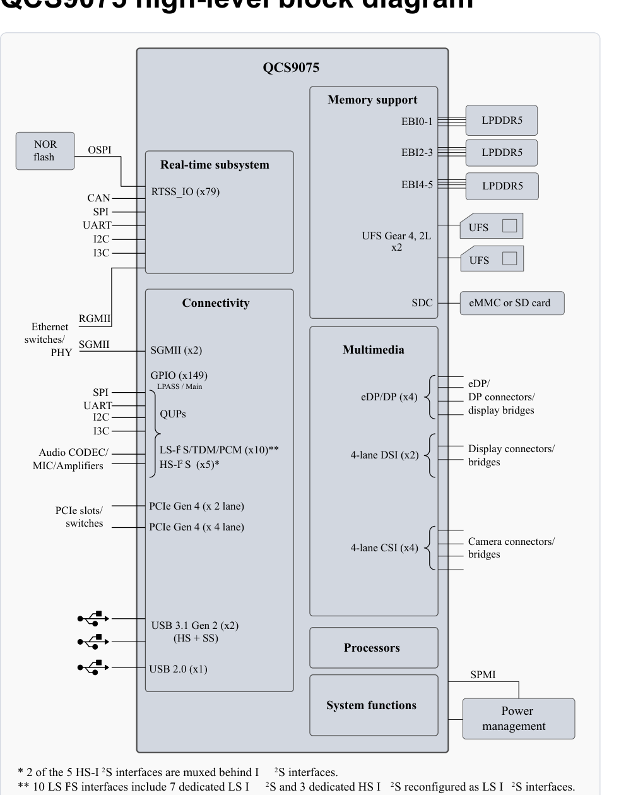

[← Contents](../README.md)

# QCS9075 Data Sheet

80-73417-1 Rev. AL

August 31, 2026

Qualcomm Technologies, Inc.

## Device description

The IQ-9075 (also known as the QCS9075) is part of the IQ9 Series platform SoCs, offering unparalleled on-device AI performance for the most demanding industrial applications. It provides design flexibility for high-compute, power-efficient performance, and is capable of handling heavy workloads in extreme environments.

The QCS9075 device features the following major architectural blocks:

- 2 × Quad Core Qualcomm Kryo™ Gen 6 CPU built on Arm v8.2 Cortex technology
- 512 kB of L2 cache per Gold Prime core
- 2 MB shared L3 cache per cluster
- Qualcomm® Adreno™ 663 GPU for the highest in graphics performance and power efficiency
- Dual Hexagon Tensor Processor (HTP) integrated with Qualcomm Hexagon DSP, Quad Hexagon Vector eXtensions (HVX), and dual Hexagon Matrix eXtensions (HMX) co-processors
- Six-channel (independent) high-speed memory – 3200 MHz LPDDR5 SDRAM, with 6400 MT/s
- 256 kB IMEM, 1.5 MB GMEM, 8 MB Vector-TCM per HTP
- Qualcomm Spectra 690 ISP image processing engine
- Qualcomm Adreno™ 765 VPU for high-quality, ultra HD video encode and decode
- Dual Adreno DPU 1199 for ultra HD multi-display support
- Dedicated real-time subsystem (RTSS) equipped with quad Cortex-R52 CPU

Figure 1-1 QCS9075 functional block diagram

Section 4.1 Device physical dimensions

Section 4.3 Device ordering information

## Key features

- 1 × OSPI/QSPI interface (166 MHz) in RTSS domain for boot-up, multiplexed with RTSS GPIOs
- Two PCIe interfaces
  - 1 × 2-lane PCIe Gen4 (PCIe0)
  - 1 × 4-lane PCIe Gen4 (PCIe1)
- 2 × SGMII (SGMII0, SGMII1) in Main Domain supporting up to 3.125 Gbps
- 1 × RGMII v1.3 and v2.0 up to 1 Gbps over RTSS domain, muxed with RTSS GPIOs
- Three USB interfaces:
  - USB0 – USB 3.1 Gen 2 (HS + SS, support device and host modes)
  - USB1 – USB 3.1 Gen 2 (HS + SS, support device and host modes)
  - USB2 – USB 2.0 (HS, support device and host modes)
- 2 × UFS 3.1 up to Gear 4 (UFS0, UFS1), 2-Lanes, Rate B, 11.67 Gbps, bootable over UFS0 only
- 1 × SDIO interface (SDC1) for eMMC 5.1 (bootable)/SD card (storage only)
- 4 × 4-lane CSI C-PHY/D-PHY interfaces (CSI0, CSI1, CSI2, CSI3)
  - 8-dedicated CCI_I2C interfaces muxed with GPIOs
  - 4 camera MCLKs, muxed with GPIOs
  - Each 4-lanes PHY configurable as 2 PHYs with 1 + 2 lanes each
- 2 × 4-lane DSI C-PHY/D-PHY interfaces (DSI0, DSI1)
- 4 × DP/eDP interface up to 4-lanes. DP is compliant with VESA DisplayPort v1.4
- 149 GPIOs in Main Domain, 79 GPIOs in RTSS domain. Multiplexed with SPI/I²C/I3C/UART/CAN
- Audio interfaces like LS-I2S, PCM/TDM, HS-I2S

QCS9075 features

## QCS9075 high-level block diagram

*Text content of the diagram:*

**External devices, left** — NOR flash (OSPI); RTSS_IO (x79) carrying CAN, SPI, UART, I2C, I3C;
Ethernet switches/PHY over RGMII and SGMII; Audio CODEC/MIC/Amplifiers over SPI, UART, I2C, I3C
(QUPs), LS-I²S/TDM/PCM (x10) ** and HS-I²S (x5) *; PCIe slots/switches.

**QCS9075** — Real-time subsystem; Connectivity (SGMII (x2), GPIO (x149), LPASS / Main QUPs);
Memory support (EBI0-1 → LPDDR5, EBI2-3 → LPDDR5, EBI4-5 → LPDDR5); UFS Gear 4, 2L ×2 → UFS, UFS;
SDC → eMMC or SD card; Multimedia (eDP/DP (x4), 4-lane DSI (x2), 4-lane CSI (x4));
PCIe Gen 4 (x 2 lane) and PCIe Gen 4 (x 4 lane); USB 3.1 Gen 2 (x2) (HS + SS) and USB 2.0 (x1);
Processors; System functions; SPMI.

**External devices, right** — LPDDR5 ×3; UFS ×2; eMMC or SD card; eDP/DP connectors/display
bridges; Display connectors/bridges; Camera connectors/bridges; Power management (via SPMI).

\* 2 of the 5 HS-I²S interfaces are muxed behind I²S interfaces.

\*\* 10 LS I²S interfaces include 7 dedicated LS I²S and 3 dedicated HS I²S reconfigured as LS I²S interfaces.

## About Qualcomm

Qualcomm relentlessly innovates to deliver intelligent computing everywhere, helping the world tackle some of its most important challenges. Building on our 40 years of technology leadership in creating era-defining breakthroughs, we deliver a broad portfolio of solutions built with our leading-edge AI, high-performance, low-power computing, and unrivaled connectivity. Our Snapdragon® platforms power extraordinary consumer experiences, and our Qualcomm Dragonwing™ products empower businesses and industries to scale to new heights. Together with our ecosystem partners, we enable next-generation digital transformation to enrich lives, improve businesses, and advance societies. At Qualcomm, we are engineering human progress.

© Qualcomm Technologies, Inc. and/or its subsidiaries. All rights reserved.

## Contents

- 1 Introduction — 7
  - 1.1 Functional block diagram — 8
  - 1.2 QCS9075 features — 9
- 2 Pin definitions — 15
  - 2.1 I/O parameter definitions — 15
  - 2.2 Pin map — 16
  - 2.3 Pin descriptions — 18
- 3 Electrical specifications — 60
  - 3.1 Absolute maximum ratings — 60
  - 3.2 Operating conditions — 62
  - 3.3 Average operating current — 65
  - 3.4 Power-on circuits and power sequence — 65
  - 3.5 Digital logic characteristics — 65
  - 3.6 Timing characteristics — 69
    - 3.6.1 Timing diagram conventions — 69
    - 3.6.2 Rise and fall time specifications — 70
  - 3.7 Memory support — 70
  - 3.8 Multimedia — 70
    - 3.8.1 Camera interfaces — 70
    - 3.8.2 Audio support — 71
    - 3.8.3 Display support — 72
    - 3.8.4 DisplayPort — 73
  - 3.9 Connectivity — 73
    - 3.9.1 USB interfaces — 74
    - 3.9.2 PCIe interface — 76
    - 3.9.3 UFS interface — 77
    - 3.9.4 HSGMII interface — 77
    - 3.9.5 Secured digital interfaces — 78
    - 3.9.6 Octa-SPI/Quad-SPI interface — 81
    - 3.9.7 RGMII interface — 82
    - 3.9.8 I²S interfaces — 84
    - 3.9.9 PCM/TDM interfaces — 87
    - 3.9.10 I²C interface — 88
    - 3.9.11 Serial peripheral interface — 89
    - 3.9.12 CAN-FD-interface — 90
  - 3.10 Internal functions — 90
    - 3.10.1 Modes and resets — 90
    - 3.10.2 JTAG — 90
- 4 Mechanical information — 92
  - 4.1 Device physical dimensions — 92
  - 4.2 Part marking — 94
  - 4.3 Device ordering information — 95
  - 4.4 Device identification for each sample type — 96
  - 4.5 Device moisture sensitivity level — 98
  - 4.6 Thermal characteristics — 98
  - 4.7 Package loading during heat sink attachment — 98
- 5 Carrier, handling, and storage information — 99
  - 5.1 Tape and reel information — 99
  - 5.2 Matrix tray information — 99
  - 5.3 Storage — 101
    - 5.3.1 Bagged storage conditions — 101
    - 5.3.2 Out-of-bag duration — 101
  - 5.4 Handling — 101
    - 5.4.1 Baking — 101
    - 5.4.2 Electrostatic discharge — 101
  - 5.5 Bar code label and packing for shipment — 101
- 6 PCB mounting guidelines — 102
  - 6.1 ELV and RoHS requirements — 102
  - 6.2 SMT assembly guidelines — 102
  - 6.3 Board-level reliability — 102
  - 6.4 High temperature warpage — 102
- 7 Part reliability — 103
  - 7.1 Reliability qualifications summary — 104
  - 7.2 Device characteristics — 107
- 8 Samples and known issues — 108
  - 8.1 Sample testing — 108
    - 8.1.1 Engineering samples (ES) — 108
    - 8.1.2 Commercial samples (CS) — 108
  - 8.2 Compatible software releases — 108
  - 8.3 Known issues — 108
- 9 Revision history — 109

## Tables

- Table 1-1: IQ9 feature comparison summary — 9
- Table 2-1: I/O description (pin type) parameters — 15
- Table 3-1: Absolute maximum ratings — 60
- Table 3-2: Operating conditions for voltage rails with AVS Type - 1 — 62
- Table 3-3: Operating conditions for non AVS voltage rails — 63
- Table 3-4: Digital I/Os specified in this section — 66
- Table 3-5: DC specification of 1.8 V I/Os — 66
- Table 3-6: Possible drive strength settings — 66
- Table 3-7: DC specifications for RGMII 1.8 V mode (VDD_RTSS_PX8) — 67
- Table 3-8: Possible drive strength — 67
- Table 3-9: Digital I/O characteristics for UFS_RESET and UFS_REF_CLK (VDD_PX9/VDD_PX10) — 68
- Table 3-10: DC specifications for SPMI (VDD_PX0) — 68
- Table 3-11: DC specifications for PS_HOLD and MD_PS_HOLD (VDD_PX3) — 68
- Table 3-12: Supported MIPI-CSI standards and exceptions — 70
- Table 3-13: CSI C‑PHY electrical characteristics — 71
- Table 3-14: CSI D‑PHY electrical characteristics — 71
- Table 3-15: Supported MIPI-DSI standards and exceptions — 72
- Table 3-16: DSI C‑PHY electrical characteristics — 72
- Table 3-17: DSI D‑PHY electrical characteristics — 72
- Table 3-18: Supported DisplayPort standards and exceptions — 73
- Table 3-19: DP/eDP electrical and link characteristics — 73
- Table 3-20: Supported USB standards and exceptions — 74
- Table 3-21: USB SuperSpeed electrical characteristics — 74
- Table 3-22: USB high-speed electrical characteristics — 75
- Table 3-23: Supported PCIe standards and exceptions — 76
- Table 3-24: PCIe Gen4 and Gen3 electrical and timing characteristics — 76
- Table 3-25: Supported UFS standards and exceptions — 77
- Table 3-26: Supported HSGMII standards and exceptions — 77
- Table 3-27: SGMII characteristics at 3.125 Gbps — 77
- Table 3-28: SGMII characteristics at 1.25 Gbps — 77
- Table 3-29: Supported SD standards and exceptions — 78
- Table 3-30: SDC modes supported — 78
- Table 3-31: eMMC timing specifications with respect to controller – regular mode — 79
- Table 3-32: SD card timing specifications with respect to controller – regular mode — 80
- Table 3-33: Octa-SPI/Quad-SPI interface SDR timing — 81
- Table 3-34: Octa-SPI interface DDR timing — 82
- Table 3-35: Supported RGMII standards and exceptions — 82
- Table 3-36: Supported I²S standards and exceptions — 84
- Table 3-37: I²S interface timing — 85
- Table 3-38: HS-I²S Rx interface timing — 86
- Table 3-39: HS-I²S Tx interface timing — 86
- Table 3-40: PCM/TDM interface timing parameters — 87
- Table 3-41: High speed PCM/TDM Rx interface timing — 88
- Table 3-42: High speed PCM/TDM Tx interface timing — 88
- Table 3-43: Supported I²C standards and exceptions — 88
- Table 3-44: SPI master timing characteristics — 89
- Table 3-45: SPI slave timing characteristics — 89
- Table 3-46: Supported CAN-FD standards and exceptions — 90
- Table 3-47: JTAG interface timing characteristics — 90
- Table 4-1: QCS9075 marking line definitions — 94
- Table 4-2: QFPROM_CORR_PTE_ROW0_LSB (Address: 0x784158) — 94
- Table 4-3: Example device identification code — 95
- Table 4-4: Device identification details — 96
- Table 4-5: MSL ratings summary — 98
- Table 4-6: Maximum loading specification — 98
- Table 5-1: Matrix tray approved sources of supply — 100
- Table 7-1: Qualification plan and results summary — 104
- Table 7-2: Device characteristics — 107

## Figures

- Figure 1-1: QCS9075 functional block diagram — 8
- Figure 2-1: QCS9075 bottom pin assignments — 17
- Figure 3-1: QCS9075 and PMIC power-on sequence — 65
- Figure 3-2: Timing diagram conventions — 69
- Figure 3-3: Rise and fall times under different load conditions — 70
- Figure 3-4: Single data rate – SDR mode — 79
- Figure 3-5: Double data rate – DDR mode — 79
- Figure 3-6: HS400 mode input timing — 79
- Figure 3-7: HS400 mode output timing — 79
- Figure 3-8: Octa-SPI/Quad-SPI SDR timing diagram — 81
- Figure 3-9: Octa-SPI DDR timing diagram — 82
- Figure 3-10: MDIO sourced by PHY — 83
- Figure 3-11: MDIO sourced by SoC — 83
- Figure 3-12: RGMII Tx and Rx timing — 84
- Figure 3-13: I²S timing diagram — 85
- Figure 3-14: PCM/TDM audio format with different sync modes — 87
- Figure 3-15: PCM/TDM timing diagram — 87
- Figure 3-16: SPI master timing diagram — 89
- Figure 3-17: JTAG interface timing diagram — 90
- Figure 4-1: Simplified FCBGA1723+HS outline drawing — 93
- Figure 4-2: Device marking (top view, not to scale) — 94

---
