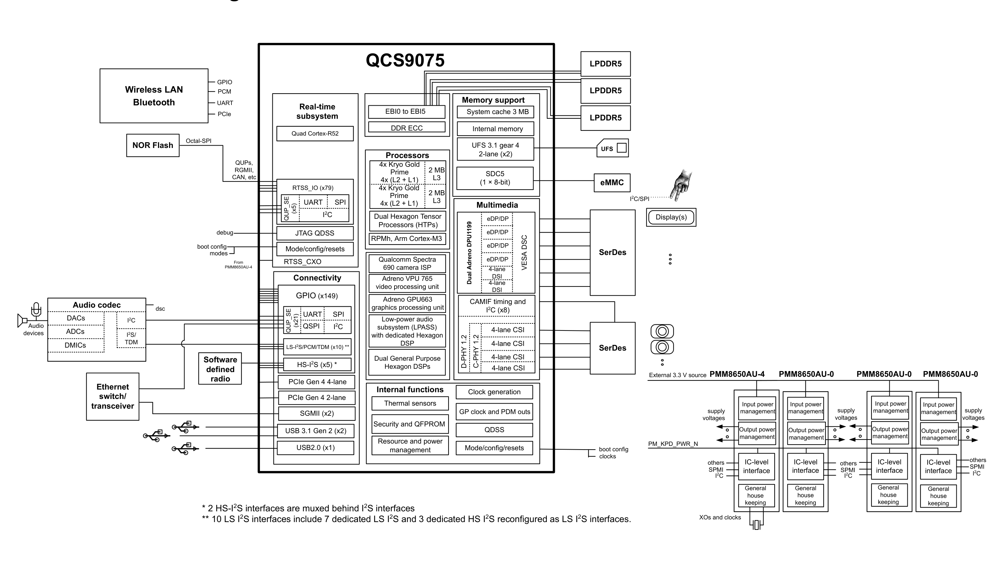

[← Contents](../README.md)

# 1 Introduction

**Document updates**

See the Revision history for details on the changes included in this revision.

**NOTE** All the information provided is preliminary and is subject to change before CS.

## 1.1 Functional block diagram

**Figure 1-1  QCS9075 functional block diagram**

*Text content of the diagram:*

**External devices, left side** — Wireless LAN / Bluetooth (GPIO, PCM, UART, PCIe); NOR Flash
(Octal‑SPI); Audio devices → Audio codec (DACs, ADCs, DMICs; I²C, I²S/TDM), dsc; Ethernet
switch/transceiver; Software defined radio; USB connectors; debug; boot config modes; “From
PMM8650AU‑4” into RTSS_CXO; QUPs, RGMII, CAN, etc.

**QCS9075 – Real‑time subsystem** — Quad Cortex‑R52; RTSS_IO (x79) with QUP_SE (x5): UART, SPI,
I²C; JTAG QDSS; Mode/config/resets; RTSS_CXO.

**QCS9075 – Memory support** — EBI0 to EBI5; DDR ECC; System cache 3 MB; Internal memory;
UFS 3.1 gear 4, 2‑lane (x2); SDC5 (1 × 8‑bit).

**QCS9075 – Processors** — 4x Kryo Gold Prime, 4x (L2 + L1), 2 MB L3; 4x Kryo Gold Prime,
4x (L2 + L1), 2 MB L3; Dual Hexagon Tensor Processors (HTPs); RPMh, Arm Cortex‑M3; Qualcomm
Spectra 690 camera ISP; Adreno VPU 765 video processing unit; Adreno GPU663 graphics processing
unit; Low‑power audio subsystem (LPASS) with dedicated Hexagon DSP; Dual General Purpose
Hexagon DSPs.

**QCS9075 – Multimedia** — Dual Adreno DPU1199; eDP/DP (x4) with VESA DSC; 4‑lane DSI (x2);
CAMIF timing and I²C (x8); 4‑lane CSI (x4); D‑PHY 1.2, C‑PHY 1.2.

**QCS9075 – Connectivity** — GPIO (x149); QUP_SE (x21): UART, SPI, QSPI, I²C;
LS‑I²S/PCM/TDM (x10) **; HS‑I²S (x5) *; PCIe Gen 4 4‑lane; PCIe Gen 4 2‑lane; SGMII (x2);
USB 3.1 Gen 2 (x2); USB2.0 (x1).

**QCS9075 – Internal functions** — Clock generation; Thermal sensors; GP clock and PDM outs;
Security and QFPROM; QDSS; Resource and power management; Mode/config/resets.

**External devices, right side** — LPDDR5 (x3); UFS (x2); eMMC or SD card; Display(s);
SerDes (display); SerDes (camera); boot config clocks.

**Power management (right)** — External 3.3 V source; PMM8650AU‑4, PMM8650AU‑0, PMM8650AU‑0,
PMM8650AU‑0. Each PMIC block shows: Input power management, Output power management, IC‑level
interface, General house keeping, plus supply voltages, SPMI/I²C, “others”, PM_KPD_PWR_N and
XOs and clocks.

**Figure footnotes** — \* 2 HS‑I²S interfaces are muxed behind I²S interfaces.
\*\* 10 LS I²S interfaces include 7 dedicated LS I²S and 3 dedicated HS I²S reconfigured as
LS I²S interfaces.

## 1.2 QCS9075 features

The following table lists the comprehensive features of the QCS9075 chipset and its capabilities.

**NOTE** Some of the hardware features integrated within the QCS9075 must be enabled by software. See the latest revision of the applicable software release notes to identify the enabled QCS9075 features.

**Table 1-1  IQ9 feature comparison summary**

| Function | Qualcomm Dragonwing IQ-9075 | Qualcomm Dragonwing IQ-9075 |
|---|---|---|
| SKU | QCS9075-AC | QCS9075-AA |
| CPU | 8-Core Kryo Gen 6 | 8-Core Kryo Gen 6 |
|  | 2.1 GHz | 2.36 GHz |
| AI performance | Hexagon | Hexagon |
|  | Llama 2 7B: up to 22 tokens/sec | Llama 2 7B: up to 22 tokens/sec |
|  | 50 Dense TOPS | 100 Dense TOPS |
| GPU | Adreno 663 | Adreno 663 |
|  | 530 MHz | 800 MHz |
| Memory | 6 × 16-bit LPDDR5 at 3200 MHz | 6 × 16-bit LPDDR5 at 3200 MHz |
| Addressable memory | Up to 36 GB with inline ECC | Up to 36 GB with inline ECC |
| Audio DSP (LPASS) | 1980 MPPS 7 × TDM/I²S + 3 × High-Speed I²S for radio FE | 1980 MPPS 7 × TDM/I²S + 3 × High-Speed I²S for radio FE |
| Display support | Dual Qualcomm® Adreno™ DPU 1199, max 48 megapixel and 12 displays with no superframe 5 × 4K at 60 3 × 4K at 60 + 8x 1080P at 60 2 × DSI + 2 × DP/eDP MST2 + 2 × DP/eDP MST4 | Dual Qualcomm® Adreno™ DPU 1199, max 48 megapixel and 12 displays with no superframe 5 × 4K at 60 3 × 4K at 60 + 8x 1080P at 60 2 × DSI + 2 × DP/eDP MST2 + 2 × DP/eDP MST4 |
| Video decode | 4K at 275: 1 × 8K at 60 2 × 8K at 30 4 × 4K at 60 8 × 4K at 30 16 × 1080P at 60 32 × 1080P at 30 Formats: AV1, H.264, H.265, VP9, MPEG-2 | 4K at 275: 1 × 8K at 60 2 × 8K at 30 4 × 4K at 60 8 × 4K at 30 16 × 1080P at 60 32 × 1080P at 30 Formats: AV1, H.264, H.265, VP9, MPEG-2 |
| Video encode | 4K at 170: 2 × 4K at 60 4 × 4k at 30 8 × 1080P at 60 16 × 1080P at 30 Formats: H.264, H.265, HEIF/HEIC | 4K at 170: 2 × 4K at 60 4 × 4k at 30 8 × 1080P at 60 16 × 1080P at 30 Formats: H.264, H.265, HEIF/HEIC |
| Camera | Up to 16 cameras Maximum 12 MP sensor resolution 4 × 4-lane CSI2 | Up to 16 cameras Maximum 12 MP sensor resolution 4 × 4-lane CSI2 |
| PCIe | 2 × PCIe Gen 4: 1 × 2-lane + 1 × 4-lane (root complex and endpoint) | 2 × PCIe Gen 4: 1 × 2-lane + 1 × 4-lane (root complex and endpoint) |
| USB | 2 × USB 3.1 Gen 2 USB Type-C, 1 × USB 2.0 | 2 × USB 3.1 Gen 2 USB Type-C, 1 × USB 2.0 |
| Networking | 2 × 2.5 GbE with TSN (SGMII) | 2 × 2.5 GbE with TSN (SGMII) |
| Other I/O | 21 × QUP_SEs ᵃ (supports UART/I²C/SPI), 149 × GPIOs | 21 × QUP_SEs ᵃ (supports UART/I²C/SPI), 149 × GPIOs |
| Storage | 2 × UFS 3.1 Gen4 2-lane, 1 × 8-bit SDCC5 with eMMC, NVMe over PCIe | 2 × UFS 3.1 Gen4 2-lane, 1 × 8-bit SDCC5 with eMMC, NVMe over PCIe |
| Wi-Fi/BT/WAN | Support through companion chips: QCA6698AQ, SDX35, SDX72 | Support through companion chips: QCA6698AQ, SDX35, SDX72 |
| MCU-like subsystem | 4 × realtime cores at 1.85 GHz | 4 × realtime cores at 1.85 GHz |
|  | 1 × RGMII with TSN, 8 × CAN-FD, 5 × QUP_SEs ᵃ (supports UART/I²C/SPI) | 1 × RGMII with TSN, 8 × CAN-FD, 5 × QUP_SEs ᵃ (supports UART/I²C/SPI) |
| Power (SoC only) | 3.8 W–20 W | 3.8 W–20 W |
| OS | Linux Yocto, Linux Ubuntu | Linux Yocto, Linux Ubuntu |
| Package | 25.0 mm × 25.0 mm/0.6 mm ball pitch | 25.0 mm × 25.0 mm/0.6 mm ball pitch |
| Temperature range (Tⱼ) | -40°C – 115°C | -40°C – 115°C |

ᵃ Qualcomm Universal Peripheral Serial Engines

#### Processor

| Feature | Capabilities |
|---|---|
| CPU | Kryo Gen 6 CPU subsystem – two identical quad-core cluster with full hardware coherency in between ■ Quad Kryo Gold Prime cores with 512 kB L2 cache per core at 2.36 GHz ■ 2 MB shared L3 cache per cluster |
| Digital signal processing | Dual Hexagon Tensor Processor integrated with Qualcomm Hexagon DSP, up to 1.420 GHz, quad Hexagon Vector eXtensions (HVX), and dual Hexagon Matrix eXtensions (HMX) co-processors ■ Common AI processing architecture for machine learning use cases ■ Matrix co-processors (one HMX-Integer and one HMX-float per Hexagon Tensor Processor) for deep neural network acceleration Audio Hexagon DSP dedicated to audio subsystem, up to 1.344 GHz and with a 2 MB L2/TCM Two general purpose Hexagon DSPs up to 1.708 GHz and with a 1 MB L2 cache for advanced audio processing and other use cases All Hexagon DSPs are cache-based processors with full access to DDR memory |
| Artificial intelligence (AI) | Up to 100 dense Llama 2 7B: 22 tokens per second |
| Real-time subsystem (RTSS) | ■ A subsystem integrated with quad cortex-R52 CPU ■ Each cortex-R52 CPU frequency is up to 1.850 GHz ■ Independent booting capability through OSPI interface |
| Always-on subsystem | ■ Always-on subsystem with always-on processor ■ Hardware-based resource and power management (RPMh) with hardware accelerators for voltage control and regulation, clock management, and resource communication |

#### Memory

| Feature | Capabilities |
|---|---|
| System memory via EBI | ■ Six-channel high-speed memory – 3200 MHz LPDDR5 SDRAM (6 × 16-bit) ■ 3 MB system cache ■ Maximum density supported 12 GB × 3 = 36 GB |
| Other internal memory | ■ 256 kB IMEM ■ 1.5 MB GMEM for graphics ■ 1 MB L2 cache and 8 MB Vector-TCM (vTCM) for each Hexagon Tensor Processor |
| ***External memory*** |  |
| Via UFS Via eMMC Via Octal/Quad SPI | Two UFS 3.1 gear 4 – two lanes for on-board memory (UFS0 as main domain boot up device) 1 × 8-bit SDIO interface (SDC1) to support eMMC 5.1. ᵃ NOR flash memory running up to 166 MHz as RTSS domain boot up device |
| Via PCIe | NVMe (non-bootable) |

ᵃ 2 × UFS and 1 × eMMC cannot be supported together. More details on the eMMC support will be added in a future revision of this document.

#### Multimedia

| Feature | Capabilities |
|---|---|
| Adreno display processing unit (DPU) Display interface/performance | Dual Adreno DPU1199 Two 4-lane MIPI DSI with VESA DSC v1.2 ■ D-PHY v1.2: 2.5 Gbps/lane on four lanes per port, 10 Gbps/port, up to 20 Gbps total ■ C-PHY v1.1: 5.7 Gbps/trio on three trios per port, 17 Gbps/port, up to 34 Gbps total Four Embedded DisplayPorts (eDP)/DisplayPort (DP) v1.4 at 8.1 Gbps/lane, 32.4 Gbps/port, MST and VESA DSC v1.2a and forward error correction (FEC) ■ Up to a maximum of 48 MP; example configuration: 5 × 4K |
| Image processing | Destination scaler, fetch exclusion rect., inline rotation, 17 × 17 × 17 3D LUT (ViG/DSPP), HDR10 improvements WCG, Rounded-corner, CCCS to Fixed-point |
| Compression | UBWC 4.0, DSC v1.2 |

#### Camera

| Feature | Capabilities |
|---|---|
| Camera performance | Qualcomm Spectra 690 ISP ■ Pixel processing: 2 × IFE + 5 × IFE_L ■ Data format inputs: 24 bit HDR RGGB/RCCB/RYYCy, RCCG, YUV ■ Data format outputs: 12/10/8 bit Y, 10/8 bit UV; RGB8 in planar or interleaved order |
| Camera interface | Processing features: 24b HDR Bayer processing, lens distortion correction, advanced tone mapping, offset correction, lens roll off correction, bad pixel correction, directional scalers, color LUTs, color space transform, noise reduction Four MIPI CSI interfaces configurable as D-PHY or C-PHY mode ■ D-PHY v1.2: 2.5 Gbps/lane on four lanes per port, 10 Gbps/port, up to 40 Gbps total. Each 4-lane port can also be configured as 1-lane + 2-lane ports or 1-lane + 1-lane ports ■ C-PHY v1.2: 10.2 Gbps/trio on three trios per port, 31 Gbps/port, up to 123 Gbps total. Each 3-trio port can also be configured as 1-trio + 2-trio ports, or three 1-trio ports |
| Adreno video processing unit (VPU) | ■ Adreno VPU 765 – fifth-generation UHD video processing unit ■ Video decode up to UHD275 ■ Video encode up to UHD170 ■ Concurrent UHD120 decode + UHD60 encode or UHD60 decode + UHD120 encode ■ Native decode support for AV1, HEVC, H.264, H.265, VP9, MPEG-2 codecs ■ Native encode support for HEVC, H.264 and H.265 ■ Embedded video analytics (EVA) for optical flow processing and stereo disparity |
| Adreno graphic processing unit (GPU) | ■ Adreno 663 GPU supports safe GPGPU compute, up to 840 MHz ■ Graphics APIs: Vulkan 1.2, OpenGL ES 3.2 ■ Compute APIs: Vulkan 1.2, OpenCL 2.0 FP, Adreno NN Direct |
| Low-power audio subsystem (LPASS) | ■ Dedicated audio LPASS Hexagon DSP with a 2 MB L2/TCM ■ AI Processor (eNPU) to accelerate neural networking use cases ■ HW linear echo cancellation accelerator ■ Two general purpose DSPs to offload audio high performance use cases |

#### Audio interfaces

| Feature | Capabilities |
|---|---|
| LS-I²S (muxed with PCM/TDM pins) | ■ Up to 10 (7 + 3) interfaces (pin multiplexed with PCM/TDM interfaces): nine (6 + 3) interfaces with two data lanes each; one interface with four data lanes for a total of 22 (16 + 6) data lanes ■ Three MCLKs up to 512 × 48 kHz (24.576 MHz); clock master or slave independent of the source of frame sync/word select ■ Supports two channels of 32-bit sample up to 384 kHz sample rate, for each data line |
| PCM/TDM (muxed with LS-I²S and HS-I²S pins) | ■ Multi-lane TDM (master and slave capable) ■ 2 Up to 10 (7 + 3) interfaces (pin multiplexed with I S): nine (6 + 3) interfaces with two data lanes each; one interface with four data lanes ■ Short, long, and one-slot sync mode ■ 2 Maximum clock frequency of 24.576 MHz (muxed with LS-I S) or 73.728 MHz (RX, muxed with HS-I²S) □ Up to 512 bits/frame, 32 bits/slot, 16 slots/interface with 48 KHz sample rate ■ Support TDM interfaces grouping for data synchronization |
| HS-I²S(muxed with PCM/TDM pins) | ■ Five high-speed (up to 73.728 MHz) receive interfaces for software defined radio (SDR); two of them are muxed behind LS-I²S interfaces; all of them can be configured as LS-I²S interfaces if needed ■ Two receive-only data lanes per interface; clock and word select in slave mode NOTE The additional LS-I²S interfaces (muxed with PCM/TDM pins) are configured from the three dedicated HS-I²S interfaces. |

#### Connectivity

| Feature | Capabilities |
|---|---|
| Qualcomm universal peripheral (QUP) serial engines UART (up to 4 MHz) I²C master (up to 1 MHz) | ■ 21 main domain (MD) GPIO-based QUP SEs: 5 bits for QUP2_SE_2 and 4 bits for each of the other 19 QUP SEs; multiplexed serial interface functions ■ Five RTSS domain GPIO-based QUP SEs: 5 bits for QUP0_SE_4 and 4 bits for each of the other four QUP SEs; multiplexed serial interface functions UART (64 B FIFO) interface available on all MD and RTSS domain QUP SEs, except MD QUP0_SE_2/3, QUP1_SE_2/3, QUP2_SE_2/3 and RTSS QUP0_SE_2/3, which also support HS-UART (128 B FIFO) I²C interface available on MD and RTSS domain QUP SEs, dedicated controller for each port |
| SPI master (up to 50 MHz) SPI slave (up to 50 MHz) CCI I²C | SPI master interfaces available on all MD and RTSS domains QUP SEs, except for MD QUP1_SE_6 SPI slave interface available on MD QUP0_SE_4/5, QUP1_SE_4/5, QUP2_SE_4/5 and RTSS QUP0_SE_0/1 Eight dedicated I²C interfaces for devices using CSI ports |
| USB | Three total USB interfaces ■ One USB 3.1 Gen 2 - USB0 (HS + SS, support device and host modes, DRD) ■ One USB 3.1 Gen 2 - USB1 (HS + SS, support device and host modes, DRD) ■ One USB2.0 - USB2 (HS, support device and host modes, DRD) |
| PCIe | ■ One 2-lane PCIe Gen4: PCIe0 (RC + EP) ■ One 4-lane PCIe Gen4: PCIe1 (RC + EP) |
| RGMII | One RTSS domain RGMII interface with MDIO for ethernet with AVB |
| CAN-FD | Eight CAN-FD interfaces located in RTSS domain, each of them supports up to 10 Mbps |
| SGMII | Two SGMII interfaces supporting up to 2.5 Gbps each (up to 3.125 Gbps serial line rate) |

#### Configurable GPIO

| Feature | Capabilities |
|---|---|
| Number of main domain GPIO ports | 149 – GPIO_0 to GPIO_148 |
| Number of RTSS domain GPIO ports | 79 – RTSS_IO_0 to RTSS_IO_78 |
| Input configurations | Pull-up, pull-down, keeper, or no pull |
| Output configurations | Programmable drive current up to 16 mA |
| Top-level mode multiplexer | Provides a convenient way to program groups of GPIOs |

#### Internal functions

| Feature | Capabilities |
|---|---|
| Security PLLs and clocks | ■ Crypto: Hardware ECC and RSA (Elliptic-Curve Cryptography), ICE, Crypto engine v5 (CE5), FIPS/CAVP certifiable, RNG (random number generation) ■ QFPROM: Fuse bits available for OEM use ■ Access control: Programmable security domain protection and sand-boxing Content Protection Zone (CPZ) supported ■ Secure boot and tools: Secure Boot with Sec Tools 5.4; easy to use tool set ■ Storage security: Secure file system (SFS); fast trusted storage ■ TrustZone: Qualcomm® Trusted Execution Environment (QTEE v5.3) ■ QTEE services: KeyMaster and Gate Keeper, Widevine, Wired HDCP2.x, SHE emulation in TEE ■ ICEMEM: An inline encryption/decryption engine used to protect the confidentiality of external RAM ■ Multiple clock regimes; watchdog and sleep timers ■ Dedicated 19.2 MHz RTSS_CXO for RTSS ■ 19.2 MHz CXO_0 and CXO_1 as clock sources for main domain of the chip ■ General-purpose outputs: M/N counter and PDM |
| Debug | JTAG |
| Others | Thermal sensors; modes and resets; peripheral subsystem |

#### Chipset interfaces

| Feature | Capabilities |
|---|---|
| Power management | Two-line SPMI; plus other lines, as needed via GPIOs |

#### Fabrication technology and package

| Feature | Capabilities |
|---|---|
| Package type and dimensions | FCBGA1723 + HS: 25.0 × 25.0 × 2.31 mm; maximum (including metallic heat spreader) |
