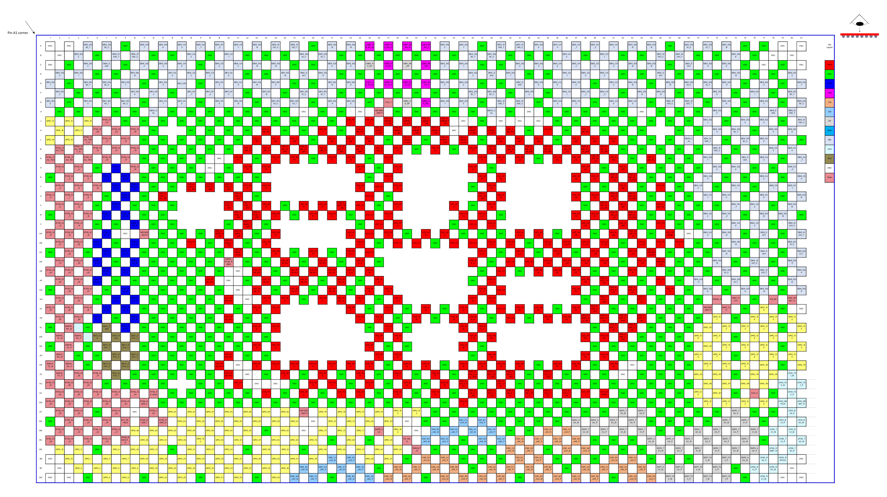

[← Contents](../README.md)

## 2.2 Pin map

The QCS9075 chipset is available in the FCBGA1723+HS package that includes several ground pins for electrical grounding, mechanical strength, and thermal continuity. See Chapter 4 for package details. A high-level view of the pin assignments is shown in the following figure.

[QCS9075 + PMM8650AU Pin Assignment and GPIO Configuration Spreadsheet (80-73417-1A)](https://docs.qualcomm.com/bundle/80-73417-1A/resource/80-73417-1A.xlsm) lists all QCS9075 pad numbers (in alphanumeric order), pad names, pad voltages, pad types, and functional descriptions.

**Figure 2-1  QCS9075 bottom pin assignments**

**Pin map grid** — rows A…BG (top to bottom), columns 1…81 (left to right), as printed in Figure 2-1. Empty cells have no ball at that grid position (the FCBGA1723+HS array is staggered).

| | 1 | 2 | 3 | 4 | 5 | 6 | 7 | 8 | 9 | 10 | 11 | 12 | 13 | 14 | 15 | 16 | 17 | 18 | 19 | 20 | 21 | 22 | 23 | 24 | 25 | 26 | 27 | 28 | 29 | 30 | 31 | 32 | 33 | 34 | 35 | 36 | 37 | 38 | 39 | 40 | 41 | 42 | 43 | 44 | 45 | 46 | 47 | 48 | 49 | 50 | 51 | 52 | 53 | 54 | 55 | 56 | 57 | 58 | 59 | 60 | 61 | 62 | 63 | 64 | 65 | 66 | 67 | 68 | 69 | 70 | 71 | 72 | 73 | 74 | 75 | 76 | 77 | 78 | 79 | 80 | 81 |
|---|---|---|---|---|---|---|---|---|---|---|---|---|---|---|---|---|---|---|---|---|---|---|---|---|---|---|---|---|---|---|---|---|---|---|---|---|---|---|---|---|---|---|---|---|---|---|---|---|---|---|---|---|---|---|---|---|---|---|---|---|---|---|---|---|---|---|---|---|---|---|---|---|---|---|---|---|---|---|---|---|---|
| **A** | DNC |  | DNC |  | EBI0_DQS0_T |  | EBI0_DQS0_C |  | GND |  | EBI0_DQ7 |  | EBI0_DQ6 |  | EBI0_CA5 |  | EBI0_CK_T |  | EBI0_CK_C |  | EBI0_CS1 |  | EBI0_DQ13 |  | EBI0_WCK1_C |  | EBI0_WCK1_T |  | GND |  | EBI0_DQ15 |  | EBI0_DQ10 |  | USB0_SS_RX_M |  | USB0_SS_RX_P |  | USB1_SS_RX_M |  | USB1_SS_RX_P |  | EBI3_DQ2 |  | EBI3_DQ7 |  | GND |  | EBI3_WCK0_T |  | EBI3_WCK0_C |  | EBI3_DQ6 |  | EBI3_CA5 |  | EBI3_CK_T |  | EBI3_CK_C |  | EBI3_CA1 |  | EBI3_DQ13 |  | EBI3_DQ15 |  | GND |  | EBI3_DQS1_C |  | EBI3_DQS1_T |  | EBI3_DQ10 |  | GND |  | GND |  | DNC |  | DNC |
| **B** |  | DNC |  | EBI0_DQ2 |  | GND |  | EBI0_WCK0_T |  | EBI0_WCK0_C |  | GND |  | GND |  | EBI0_CA4 |  | GND |  | EBI0_CA1 |  | GND |  | GND |  | GND |  | EBI0_DQS1_C |  | EBI0_DQS1_T |  | GND |  | GND |  | GND |  | GND |  | GND |  | GND |  | GND |  | EBI3_DQS0_T |  | EBI3_DQS0_C |  | GND |  | GND |  | GND |  | EBI3_CA4 |  | GND |  | EBI3_CS1 |  | GND |  | GND |  | EBI3_WCK1_C |  | EBI3_WCK1_T |  | GND |  | GND |  | EBI3_DQ8 |  | GND |  | DNC |  | DNC |  |
| **C** | DNC |  | GND |  | EBI0_DQ3 |  | EBI0_DMI0 |  | GND |  | EBI0_DQ4 |  | EBI0_DQ5 |  | EBI0_CA6 |  | GND |  | EBI0_CS0 |  | EBI0_CA0 |  | EBI0_DQ14 |  | EBI0_DQ12 |  | GND |  | GND |  | EBI0_DQ9 |  | EBI0_DQ8 |  | USB0_HS_DP |  | USB0_HS_DM |  | USB1_HS_DP |  | USB1_HS_DM |  | EBI3_DQ0 |  | EBI3_DQ1 |  | GND |  | GND |  | EBI3_DQ4 |  | EBI3_DQ5 |  | EBI3_CA6 |  | EBI3_CA3 |  | EBI3_CS0 |  | EBI3_CA0 |  | EBI3_DQ14 |  | EBI3_DQ12 |  | GND |  | EBI3_DMI1 |  | EBI3_DQ11 |  | EBI3_DQ9 |  | GND |  | DNC |  | GND |  | DNC |
| **D** |  | EBI0_DQ0 |  | EBI0_DQ1 |  | GND |  | GND |  | EBI1_DMI0 |  | GND |  | EBI1_CA0 |  | EBI0_CA3 |  | EBI0_CA2 |  | EBI1_CA6 |  | GND |  | GND |  | EBI1_DQ15 |  | EBI0_DMI1 |  | EBI0_DQ11 |  | GND |  | GND |  | GND |  | GND |  | GND |  | GND |  | GND |  | EBI3_DQ3 |  | EBI3_DMI0 |  | EBI2_DQ7 |  | GND |  | GND |  | EBI2_CA1 |  | EBI3_CA2 |  | EBI2_CA4 |  | GND |  | GND |  | EBI2_DMI1 |  | GND |  | GND |  | GND |  | EBI2_DQ10 |  | GND |  | GND |  | EBI5_DQ2 |  |
| **E** | EBI1_DQ1 |  | GND |  | EBI1_DQS0_T |  | EBI1_DQS0_C |  | EBI1_DQ7 |  | GND |  | EBI1_DQ5 |  | EBI1_CS1 |  | GND |  | EBI1_CA4 |  | EBI1_CA5 |  | EBI1_DQ14 |  | EBI1_DMI1 |  | GND |  | GND |  | EBI1_DQ10 |  | EBI1_DQ8 |  | USB0_SS_TX_M |  | USB0_SS_TX_P |  | USB1_SS_TX_M |  | USB1_SS_TX_P |  | EBI2_DQ0 |  | EBI2_DQ2 |  | GND |  | GND |  | EBI2_DMI0 |  | EBI2_DQ6 |  | EBI2_CA0 |  | EBI2_CS0 |  | GND |  | EBI2_CA3 |  | EBI2_DQ13 |  | GND |  | EBI2_DQ15 |  | EBI2_DQS1_C |  | EBI2_DQS1_T |  | EBI2_DQ11 |  | GND |  | EBI5_DQ0 |  | GND |  | EBI5_DQ7 |
| **F** |  | EBI1_DQ2 |  | GND |  | GND |  | GND |  | EBI1_DQ6 |  | EBI1_DQ4 |  | GND |  | EBI1_CK_T |  | EBI1_CK_C |  | EBI1_CA3 |  | GND |  | EBI1_DQ12 |  | GND |  | EBI1_DQS1_C |  | EBI1_DQS1_T |  | GND |  | GND |  | GND |  | GND |  | GND |  | GND |  | GND |  | EBI2_DQS0_T |  | EBI2_DQS0_C |  | GND |  | EBI2_DQ4 |  | GND |  | EBI2_CS1 |  | EBI2_CK_T |  | EBI2_CK_C |  | GND |  | EBI2_DQ12 |  | EBI2_DQ14 |  | GND |  | GND |  | EBI2_DQ9 |  | GND |  | EBI5_DQ1 |  | GND |  | EBI5_DQS0_T |  |
| **G** | EBI1_DQ0 |  | GND |  | EBI1_DQ3 |  | EBI1_WCK0_T |  | EBI1_WCK0_C |  | GND |  | EBI1_CA1 |  | EBI1_CA2 |  | GND |  | EBI1_CS0 |  | EBI1_DQ13 |  | GND |  | EBI1_WCK1_C |  | EBI1_WCK1_T |  | GND |  | EBI1_DQ11 |  | EBI1_DQ9 |  | GND |  | CXO_1 |  | USB2_HS_DP |  | USB2_HS_DM |  | EBI2_DQ1 |  | EBI2_DQ3 |  | GND |  | EBI2_WCK0_T |  | EBI2_WCK0_C |  | GND |  | EBI2_DQ5 |  | EBI2_CA2 |  | GND |  | EBI2_CA6 |  | EBI2_CA5 |  | GND |  | EBI2_WCK1_C |  | EBI2_WCK1_T |  | GND |  | EBI2_DQ8 |  | GND |  | EBI5_DQ3 |  | GND |  | EBI5_DQS0_C |
| **H** |  | GND |  | GND |  | GND |  | GND |  | GND |  | EBI01_CAL |  | GND |  | GND |  | GND |  | GND |  | GND |  | GND |  | GND |  | DNC |  | GND |  | GND |  | DNC |  | REFGEN_REXT1 |  | GND |  | GND |  | GND |  | GND |  | GND |  | EBI23_CAL |  | GND |  | DNC |  | GND |  | GND |  | GND |  | GND |  | GND |  | DNC |  | GND |  | GND |  | GND |  | EBI4_DQ0 |  | GND |  | GND |  | EBI5_DMI0 |  | EBI5_WCK0_T |  |
| **J** | GPIO_13 |  | GPIO_14 |  | GPIO_15 |  | RTSS_IO_67 |  | GND |  | GND |  | GND |  | GND |  | GND |  | GND |  | GND |  | GND |  | GND |  | GND |  | GND |  | GND |  | VDD_PX3 |  | VDD_PX11 |  | VDD_A_USBHS_0_1P8 |  | VDD_A_USBHS_0_3P1 |  | VDD_A_USBHS_1_1P8 |  | VDD_A_USBHS_1_3P1 |  | DNC |  | GND |  | DNC |  | DNC |  | DNC |  | GND |  | GND |  | GND |  | GND |  | GND |  | GND |  | GND |  | GND |  | EBI4_DQ1 |  | GND |  | EBI4_DQ2 |  | EBI5_DQ4 |  | GND |  | EBI5_WCK0_C |
| **K** |  | GPIO_16 |  | GPIO_17 |  | RTSS_IO_68 |  | RTSS_IO_69 |  | RTSS_IO_70 |  | GND |  |  |  | GND |  | GND |  | GND |  | GND |  | VDD_A_EBI_PLL |  | GND |  | GND |  | VDD_PX1 |  | GND |  | VDD_A_EBI_PLL |  | VDD_A_USBHS_0_0P9 |  | VDD_A_USBSS_0_1P2 |  | VDD_A_USBHS_1_0P9 |  | VDD_A_USBSS_1_1P2 |  | DNC |  | VDD_A_USBHS_2_1P8 |  | VDD_A_USBHS_2_3P1 |  | VDD_A_EBI_PLL |  | GND |  | VDD_PX1 |  | GND |  | VDD_A_EBI_PLL |  | GND |  | GND |  | GND |  |  |  | GND |  | GND |  | EBI4_DQ3 |  | EBI4_DQS0_T |  | GND |  | EBI5_DQ5 |  | EBI5_DQ6 |  |
| **L** | GPIO_18 |  | GPIO_19 |  | RTSS_JTAG_TRST_N |  | RTSS_IO_71 |  | RTSS_IO_72 |  | GND |  | GND |  | GND |  | GND |  | GND |  | GND |  | VDD_D_EBI |  | VDD_D_EBI |  | VDD_D_EBI |  | GND |  | VDD_D_EBI |  | VDD_D_EBI |  | VDD_D_EBI |  | GND |  | VDD_A_USBSS_0_0P9 |  | GND |  | VDD_A_USBSS_1_0P9 |  | VDD_A_USBHS_2_0P9 |  | GND |  | VDD_D_EBI |  | VDD_D_EBI |  | VDD_D_EBI |  | GND |  | VDD_D_EBI |  | VDD_D_EBI |  | VDD_D_EBI |  | GND |  | GND |  | GND |  | EBI45_CAL |  | EBI4_WCK0_T |  | GND |  | EBI4_DQS0_C |  | EBI5_CA6 |  | GND |  | GND |
| **M** |  | RTSS_JTAG_TCK |  | RTSS_JTAG_SRST_N |  | RTSS_IO_73 |  | RTSS_IO_74 |  | RTSS_IO_75 |  | GND |  | GND |  | GND |  | GND |  | GND |  | VDD_IO_EBI_01 |  | VDD_IO_EBI_01 |  | VDD_A_EBI_01_0P9 |  | VDD_A_EBI_01_0P9 |  | VDD_IO_EBI_01 |  | VDD_A_EBI_01_0P9 |  | VDD_A_EBI_01_0P9 |  | VDD_IO_EBI_01 |  | VDD_APC1 |  | GND |  | VDD_APC1 |  | GND |  | VDD_APC1 |  | VDD_IO_EBI_23_45 |  | VDD_IO_EBI_23_45 |  | VDD_A_EBI_23_45_0P9 |  | VDD_A_EBI_23_45_0P9 |  | VDD_IO_EBI_23_45 |  | VDD_A_EBI_23_45_0P9 |  | VDD_A_EBI_23_45_0P9 |  | GND |  | GND |  | GND |  | GND |  | GND |  | EBI4_WCK0_C |  | GND |  | GND |  | EBI5_CA5 |  | EBI5_CA4 |  |
| **N** | RTSS_JTAG_TDO |  | RTSS_JTAG_TDI |  | RTSS_JTAG_TMS |  | RTSS_IO_76 |  | RTSS_IO_77 |  | GND |  | GND |  | GND |  | GND |  | DNC |  | VDD_NSP1 |  | GND |  | VDD_NSP1 |  | VDD_NSP1 |  | GND |  | VDD_NSP1 |  | VDD_NSP1 |  | GND |  | VDD_APC1 |  |  |  |  |  |  |  |  |  | VDD_APC1 |  | VDD_APC0 |  | VDD_APC0 |  | GND |  | VDD_APC0 |  | VDD_APC0 |  | VDD_IO_EBI_23_45 |  | VDD_D_EBI |  | GND |  | VDD_A_EBI_PLL |  | GND |  | GND |  | EBI4_DQ7 |  | GND |  | EBI4_DMI0 |  | EBI5_CA3 |  | GND |  | EBI5_CK_T |
| **P** |  | RTSS_IO_1 |  | RTSS_IO_0 |  | GND |  | PCIE0_TX1_M |  | RTSS_IO_78 |  | GND |  | GND |  | GND |  | DNC |  | GND |  | VDD_NSP1 |  | VDD_NSP1 |  |  |  |  |  |  |  |  |  | VDD_NSP1 |  | GND |  | VDD_APC1 |  |  |  |  |  |  |  | VDD_APC1 |  | GND |  |  |  |  |  |  |  |  |  | VDD_APC0 |  | GND |  | VDD_D_EBI |  | GND |  | GND |  | GND |  | GND |  | EBI4_DQ4 |  | EBI4_DQ6 |  | GND |  | GND |  | EBI5_CK_C |  |
| **R** | GND |  | RTSS_IO_2 |  | RTSS_IO_3 |  | PCIE0_TX1_P |  | PCIE0_TX0_M |  | GND |  | GND |  | GND |  | GND |  | GND |  | GND |  | GND |  |  |  |  |  |  |  |  |  |  |  | GND |  | VDD_APC1 |  |  |  |  |  |  |  |  |  | VDD_APC1 |  | VDD_APC0 |  |  |  |  |  |  |  | VDD_APC0 |  | VDD_APC0 |  | VDD_IO_EBI_23_45 |  | VDD_A_EBI_23_45_0P9 |  | GND |  | GND |  | GND |  | EBI4_DQ5 |  | GND |  | GND |  | EBI5_CA2 |  | GND |  | EBI5_CS0 |
| **T** |  | RTSS_IO_4 |  | RTSS_IO_5 |  | RTSS_IO_18 |  | PCIE0_TX0_P |  | PCIE0_REFCLK_M |  | GND |  | GND |  | VDD_A_PCIE_0_PLL_1P2 |  | VDD_A_PCIE_0_0P9 |  | VDD_A_PCIE_0_0P9 |  | VDD_NSP1 |  | VDD_NSP1 |  |  |  |  |  |  |  |  |  | VDD_NSP1 |  | VDD_CX |  | VDD_APC1 |  |  |  |  |  |  |  | GND |  | VDD_APC0 |  |  |  |  |  |  |  |  |  | GND |  | GND |  | VDD_D_EBI |  | GND |  | VDD_PX1 |  | GND |  | EBI4_CA0 |  | GND |  | EBI4_CA1 |  | GND |  | EBI5_CS1 |  | EBI5_CA1 |  |
| **U** | RTSS_IO_6 |  | RTSS_IO_7 |  | RTSS_IO_8 |  | GND |  | PCIE0_REFCLK_P |  | GND |  | VDD_A_PCIE_1_PLL_1P2 |  |  |  |  |  |  |  | VDD_A_PCIE_0_0P9 |  | GND |  |  |  |  |  |  |  |  |  |  |  | VDD_CX |  | GND |  |  |  |  |  |  |  |  |  | VDD_A_APC_CS_1P2 |  | VDD_APC0 |  |  |  |  |  |  |  | VDD_APC0 |  | VDD_APC0 |  | VDD_IO_EBI_23_45 |  | VDD_A_EBI_23_45_0P9 |  | GND |  | GND |  | GND |  | EBI4_CS1 |  | EBI4_CS0 |  | GND |  | EBI5_CA0 |  | GND |  | EBI5_DQ13 |
| **V** |  | RTSS_IO_9 |  | RTSS_IO_10 |  | GND |  | PCIE0_RX1_M |  | GND |  | GND |  | GND |  |  |  |  |  | VDD_A_PCIE_1_0P9 |  | VDD_A_PCIE_1_0P9 |  | VDD_NSP1 |  | GND |  | VDD_NSP1 |  | VDD_NSP1 |  | VDD_A_NSP1_CS_1P2 |  | VDD_CX |  | GND |  | VDD_APC1 |  |  |  |  |  | VDD_APC1 |  | GND |  | VDD_APC0 |  |  |  |  |  |  |  |  |  | GND |  | VDD_A_EBI_23_45_0P9 |  | VDD_D_EBI |  | GND |  | VDD_A_EBI_PLL |  | GND |  | GND |  | GND |  | EBI4_CK_T |  | EBI4_CA2 |  | GND |  | EBI5_DQ14 |  |
| **W** | GND |  | RTSS_IO_11 |  | RTSS_IO_12 |  | PCIE0_RX1_P |  | PCIE0_RX0_M |  | GND |  | GND |  |  |  |  |  |  |  | VDD_A_PCIE_1_0P9 |  | VDD_A_PCIE_1_0P9 |  | VDD_NSP1 |  | GND |  | VDD_NSP1 |  | VDD_NSP1 |  | GND |  | VDD_CX |  | VDD_APC1 |  |  |  |  |  |  |  | VDD_APC1 |  | VDD_MX_A |  | GND |  |  |  |  |  |  |  | VDD_APC0 |  | VDD_APC0 |  | VDD_IO_EBI_23_45 |  | VDD_A_EBI_23_45_0P9 |  | GND |  | GND |  | GND |  | EBI4_CA4 |  | EBI4_CK_C |  | GND |  | EBI5_DQ12 |  | EBI5_DQ15 |  | GND |
| **Y** |  | RTSS_IO_13 |  | RTSS_IO_14 |  | GND |  | GND |  | PCIE0_RX0_P |  | GND |  | GND |  |  |  |  |  | GND |  | VDD_A_SGMII_0_0P9 |  | GND |  |  |  |  |  |  |  |  |  | GND |  | VDD_CX |  | VDD_APC1 |  |  |  |  |  | GND |  | VDD_CX |  | VDD_MX_A |  |  |  |  |  |  |  |  |  | VDD_APC0 |  | GND |  | VDD_D_EBI |  | GND |  | VDD_PX1 |  | GND |  | GND |  | GND |  | EBI4_CA6 |  | EBI4_CA3 |  | GND |  | EBI5_WCK1_C |  |
| **AA** | RTSS_IO_17 |  | RTSS_IO_16 |  | RTSS_IO_15 |  | PCIE1_TX3_M |  | DNC |  | REFGEN_REXT0 |  | GND |  | GND |  | GND |  | VDD_A_SGMII_0_1P2 |  | VDD_A_SGMII_1_0P9 |  | GND |  | VDD_NSP1 |  |  |  |  |  |  |  | VDD_MX_C |  | VDD_CX |  | VDD_APC1 |  | GND |  | VDD_APC1 |  | VDD_APC1 |  | GND |  | GND |  | GND |  | VDD_MX_A |  | VDD_APC0 |  | GND |  | VDD_APC0 |  | GND |  | VDD_D_EBI |  | VDD_IO_EBI_23_45 |  | GND |  | VDD_QFPROM |  | DNC |  | EBI4_CA5 |  | EBI4_DQ13 |  | GND |  | EBI5_DMI1 |  | GND |  | EBI5_WCK1_T |
| **AB** |  | RTSS_IO_37 |  | RTSS_IO_38 |  | PCIE1_TX3_P |  | GND |  | PCIE1_TX2_M |  | GND |  | GND |  | VDD_PX7 |  | GND |  | VDD_A_SGMII_1_1P2 |  | GND |  | VDD_NSP1 |  |  |  |  |  |  |  |  |  | VDD_MX_C |  | GND |  | VDD_CX |  | VDD_CX |  | GND |  | VDD_CX |  | VDD_CX |  | VDD_MX_A |  | VDD_MX_A |  | GND |  | VDD_MX_LPI |  | VDD_MX_LPI |  | VDD_MX_LPI |  | VDD_MX_LPI |  | GND |  | VDD_MX_LPI |  | VDD_PX3 |  | VDD_PX0 |  | GND |  | GND |  | EBI4_DQ12 |  | GND |  | GND |  | EBI5_DQS1_C |  |
| **AC** | GND |  | RTSS_IO_40 |  | GND |  | PCIE1_TX1_M |  | PCIE1_TX2_P |  | GND |  | GND |  | GND |  | GND |  | GND |  | VDD_QFPROM_RTSS |  | GND |  | VDD_NSP1 |  | GND |  | VDD_NSP1 |  | GND |  | VDD_MX_C |  | VDD_CX |  |  |  |  |  |  |  |  |  |  |  | VDD_MX_A |  | GND |  | VDD_MX_A |  | GND |  | VDD_CX_LPI |  | GND |  | VDD_CX_LPI |  | GND |  | VDD_CX_LPI |  | VDD_A_REFGEN_0P875 |  | GND |  | GND |  | GND |  | EBI4_DQ14 |  | GND |  | EBI4_DMI1 |  | GND |  | EBI5_DQS1_T |
| **AD** |  | RTSS_IO_41 |  | RTSS_IO_39 |  | PCIE1_TX1_P |  | GND |  | PCIE1_TX0_M |  | GND |  | GND |  | GND |  | GND |  | VBIAS_RTSS_RGMII |  | GND |  | GND |  | VDD_RTSS_MX |  | GND |  | VDD_RTSS_MX |  | GND |  | VDD_MX_C |  | GND |  |  |  |  |  |  |  |  |  | VDD_MX_A |  | GND |  | VDD_CX |  | VDD_CX |  | VDD_CX_LPI |  | VDD_CX_LPI |  | VDD_CX_LPI |  | VDD_CX_LPI |  | GND |  | VDD_CX_LPI |  | VDD_A_REFGEN_1P2 |  | GND |  | GND |  | EBI4_DQ15 |  | GND |  | EBI4_WCK1_C |  | GND |  | EBI5_DQ11 |  |
| **AE** | RTSS_IO_44 |  | RTSS_IO_43 |  | RTSS_IO_42 |  | PCIE1_REFCLK_M |  | PCIE1_TX0_P |  | GND |  | GND |  | GND |  | GND |  | GND |  | DNC |  | VDD_RTSS_MX |  | GND |  | VDD_RTSS_MX |  | VDD_RTSS_MX |  | VDD_RTSS_CX |  | VDD_MX_C |  | VDD_MM |  |  |  |  |  |  |  |  |  |  |  | GND |  | VDD_CX |  | GND |  | VDD_NSP0 |  | VDD_NSP0 |  | VDD_NSP0 |  | GND |  | GND |  | VDD_PX11 |  | GND |  | GND |  | GND |  | GND |  | EBI4_DQS1_C |  | GND |  | EBI4_WCK1_T |  | GND |  | EBI5_DQ9 |
| **AF** |  | RTSS_IO_46 |  | RTSS_IO_45 |  | PCIE1_REFCLK_P |  | GND |  | GND |  | GND |  | GND |  | GND |  | VDD_RTSS_PX3 |  | DNC |  | GND |  | VDD_RTSS_CX |  | GND |  | VDD_RTSS_CX |  | GND |  | VDD_RTSS_CX |  | GND |  | VDD_MM |  |  |  |  |  |  |  |  |  | GND |  | VDD_MX_C |  |  |  |  |  |  |  |  |  | VDD_NSP0 |  | VDD_A_UFS_1_0P9 |  | GND |  | GND |  | VDD_PX9 |  | GND |  | EBI4_DQ11 |  | GND |  | EBI4_DQS1_T |  | GND |  | GND |  | EBI5_DQ10 |  |
| **AG** | GND |  | RTSS_IO_48 |  | RTSS_IO_47 |  | GND |  | PCIE1_RX3_M |  | GND |  | GND |  | GND |  | GND |  | GND |  | DNC |  | VDD_RTSS_CX |  | GND |  | VDD_RTSS_CX |  | GND |  | VDD_RTSS_CX |  | GND |  | VDD_MM |  | VDD_MM |  |  |  |  |  |  |  |  |  | VDD_MX_C |  | VDD_CX |  |  |  |  |  |  |  | VDD_NSP0 |  | GND |  | VDD_A_UFS_1_1P2 |  | VDD_A_UFS_0_1P2 |  | GND |  | VDD_PX10 |  | GND |  | EBI4_DQ8 |  | GND |  | EBI4_DQ9 |  | EBI4_DQ10 |  | GND |  | EBI5_DQ8 |
| **AH** |  | RTSS_IO_50 |  | RTSS_IO_49 |  | GND |  | PCIE1_RX3_P |  | PCIE1_RX2_M |  | GND |  | GND |  | GND |  | GND |  | VDD_RTSS_PX8 |  | DNC |  | VDD_GFX |  | VDD_GFX |  | GND |  | VDD_GFX |  | VDD_RTSS_CX |  | VDD_MM |  | GND |  | VDD_MX_C |  |  |  |  |  |  |  | VDD_MM |  | VDD_MX_C |  |  |  |  |  |  |  |  |  | GND |  | VDD_A_UFS_0_0P9 |  | GND |  | VDD_A_EDP_0_1P2 |  | GND |  | GND |  | GND |  | RESIN_N |  | SPMI_DATA |  | GND |  | DS_EN |  | DDR_RESET_N |  |
| **AJ** | RTSS_IO_54 |  | RTSS_IO_52 |  | RTSS_IO_51 |  | PCIE1_RX1_M |  | PCIE1_RX2_P |  | GND |  | GND |  | GND |  | GND |  | GND |  | GND |  | VDD_GFX |  | VDD_GFX |  |  |  |  |  |  |  | VDD_GFX |  | GND |  | VDD_MX_C |  | GND |  | VDD_MM |  | GND |  | VDD_MM |  | GND |  | VDD_CX |  | VDD_NSP0 |  | VDD_NSP0 |  | GND |  | VDD_NSP0 |  | VDD_A_EDP_0_0P9 |  | GND |  | GND |  | GND |  | GND |  | GND |  | REFGEN_REXT2 |  | SPMI_CLK |  | GND |  | GPIO_126 |  | GND |  | DNC |
| **AK** |  | RTSS_IO_56 |  | RTSS_IO_55 |  | PCIE1_RX1_P |  | GND |  | PCIE1_RX0_M |  | GND |  | GND |  | GND |  | GND |  | VDD_RTSS_PX3 |  | GND |  | GND |  |  |  |  |  |  |  |  |  | VDD_GFX |  | VDD_MX_C |  | GND |  | VDD_MM |  | GND |  | VDD_MM |  | VDD_MX_A |  | GND |  | VDD_CX |  | GND |  | VDD_NSP0 |  | VDD_NSP0 |  | VDD_A_NSP0_CS_1P2 |  | VDD_A_EDP_1_0P9 |  | VDD_A_EDP_2_0P9 |  | VDD_A_EDP_1_1P2 |  | GND |  | GND |  | GND |  | GPIO_127 |  | GND |  | GPIO_128 |  | GPIO_129 |  | GPIO_130 |  |
| **AL** | GND |  | SGMII0_RX_M |  | GND |  | SDC1_CMD |  | PCIE1_RX0_P |  | GND |  | GND |  | GND |  | GND |  | GND |  | GND |  | VDD_GFX |  | VDD_GFX |  |  |  |  |  |  |  |  |  | GND |  | VDD_MX_C |  | GND |  |  |  |  |  | VDD_MM |  | VDD_MX_A |  |  |  |  |  |  |  |  |  |  |  | GND |  | VDD_A_EDP_3_1P2 |  | VDD_A_EDP_2_1P2 |  | GND |  | GND |  | GND |  | GPIO_131 |  | GPIO_132 |  | GPIO_133 |  | GPIO_134 |  | GND |  | GPIO_135 |
| **AM** |  | SGMII0_TX_M |  | SGMII0_RX_P |  | SDC1_CLK |  | SDC1_RCLK |  | SDC1_DATA_0 |  | GND |  | GND |  | GND |  | GND |  | GND |  | GND |  | GND |  |  |  |  |  |  |  |  |  |  |  | VDD_GFX |  | VDD_MM |  |  |  |  |  |  |  | VDD_MX_A |  | VDD_NSP0 |  |  |  |  |  |  |  |  |  | VDD_NSP0 |  | VDD_NSP0 |  | VDD_A_EDP_3_0P9 |  | GND |  | GND |  | GND |  | GPIO_136 |  | GPIO_137 |  | GND |  | GPIO_138 |  | GPIO_139 |  | GPIO_140 |  |
| **AN** | GND |  | SGMII0_TX_P |  | GND |  | SDC1_DATA_1 |  | SDC1_DATA_2 |  | GND |  | GND |  | GND |  | GND |  | GND |  | GND |  | VDD_GFX |  | VDD_GFX |  |  |  |  |  |  |  |  |  | VDD_GFX |  | GND |  | GND |  |  |  |  |  | VDD_MM |  | GND |  |  |  |  |  |  |  |  |  |  |  | GND |  | GND |  | GND |  | GND |  | GND |  | GND |  | GPIO_141 |  | GPIO_142 |  | GPIO_143 |  | GPIO_144 |  | GND |  | GPIO_145 |
| **AP** |  | SGMII1_RX_M |  | GND |  | GND |  | SDC1_DATA_3 |  | SDC1_DATA_4 |  | GND |  | GND |  | GND |  | GND |  | VDD_RTSS_PX3 |  | GND |  | GND |  |  |  |  |  |  |  |  |  |  |  | VDD_GFX |  | VDD_MM |  |  |  |  |  |  |  | GND |  | VDD_NSP0 |  |  |  |  |  |  |  |  |  | VDD_NSP0 |  | VDD_NSP0 |  | GND |  | GND |  | GND |  | GND |  | GPIO_146 |  | GPIO_147 |  | GND |  | GPIO_148 |  | GPIO_105 |  | GPIO_106 |  |
| **AR** | SGMII1_TX_M |  | SGMII1_RX_P |  | GND |  | SDC1_DATA_5 |  | SDC1_DATA_6 |  | GND |  | GND |  | GND |  | GND |  | VDD_RTSS_PX11 |  | DNC |  | VDD_GFX |  | VDD_GFX |  | VDD_GFX |  | VDD_GFX |  | VDD_GFX |  | VDD_GFX |  | VDD_GFX |  | GND |  | VDD_MM |  | VDD_MM |  | GND |  | VDD_MM |  | VDD_MM |  | VDD_NSP0 |  | VDD_NSP0 |  | GND |  | VDD_NSP0 |  | VDD_NSP0 |  | GND |  | VDD_NSP0 |  | DNC |  | GND |  | GND |  | GND |  | GPIO_107 |  | GPIO_108 |  | GPIO_109 |  | GPIO_110 |  | GND |  | GPIO_111 |
| **AT** |  | SGMII1_TX_P |  | RTSS_IO_58 |  | RTSS_IO_57 |  | SDC1_DATA_7 |  | GND |  | GND |  | GND |  | GND |  | GND |  | VDD_RTSS_PX0 |  | DNC |  | GND |  | VDD_GFX |  | GND |  | VDD_GFX |  | GND |  | VDD_GFX |  | GND |  | VDD_MM |  | GND |  | VDD_MM |  | GND |  | VDD_A_DSI_0_PLL_0P9 |  | VDD_A_DSI_1_PLL_0P9 |  | VDD_A_CSI_0_1_0P9 |  | GND |  | VDD_A_CSI_2_3_0P9 |  | GND |  | GND |  | GND |  | DNC |  | GND |  | GND |  | GND |  | GPIO_112 |  | GPIO_113 |  | GND |  | GPIO_114 |  | GPIO_115 |  | UFS1_TX1_M |  |
| **AU** | RTSS_IO_61 |  | RTSS_IO_59 |  | RTSS_IO_20 |  | GND |  | GND |  | GND |  | GND |  |  |  | GND |  | GND |  | VDD_PX3 |  | DNC |  | DNC |  | GND |  | VDD_GFX |  | VDD_GFX |  | GND |  | VDD_GFX |  | GND |  | VDD_MM |  | GND |  | VDD_MM |  | VDD_A_DSI_0_0P9 |  | GND |  | VDD_A_DSI_1_0P9 |  | GND |  | GND |  | GND |  | GND |  | GND |  | GND |  | GND |  | GND |  | GND |  | GND |  | GPIO_116 |  | GPIO_117 |  | GPIO_118 |  | GPIO_119 |  | UFS1_TX0_M |  | UFS1_TX1_P |
| **AV** |  | RTSS_IO_60 |  | RTSS_IO_53 |  | RTSS_IO_19 |  | RTSS_IO_66 |  | RTSS_IO_64 |  | RTSS_PS_HOLD |  | GND |  | GND |  | GND |  | GND |  | GND |  | VDD_GFX |  | GND |  | VDD_GFX |  | GND |  | VDD_PX3 |  | VDD_GFX |  | GND |  | VDD_MM |  | GND |  | VDD_MM |  | GND |  | VDD_A_DSI_0_1_1P2 |  | VDD_A_DSI_0_1_1P2 |  | VDD_A_CSI_0_1P2 |  | VDD_A_CSI_1_1P2 |  | VDD_A_CSI_2_1P2 |  | VDD_A_CSI_3_1P2 |  | VDD_PX3 |  | VDD_QFPROM |  | GND |  | GND |  | GND |  | GND |  | GPIO_120 |  | GPIO_121 |  | GND |  | CXO_0 |  | GND |  | UFS1_TX0_P |  |
| **AW** | RTSS_IO_29 |  | RTSS_IO_28 |  | RTSS_IO_27 |  | RTSS_IO_65 |  | RTSS_IO_63 |  | RTSS_MODE_0 |  | GND |  | GND |  | GND |  | GND |  | GND |  | GND |  | GND |  | GND |  | GND |  | GND |  | GND |  | GND |  | GND |  | GND |  | GND |  | GND |  | VDD_PX3 |  | GND |  | GND |  | GND |  | GND |  | GND |  | GND |  | GND |  | GND |  | GND |  | GND |  | GND |  | GND |  | GPIO_122 |  | GPIO_123 |  | GPIO_124 |  | GPIO_125 |  | UFS1_REFCLK |  | UFS1_RESET_N |
| **AY** |  | RTSS_IO_26 |  | RTSS_IO_25 |  | GND |  | RTSS_IO_62 |  | DNC |  | RTSS_CXO |  | GPIO_63 |  | GPIO_67 |  | GPIO_97 |  | GPIO_93 |  | GPIO_88 |  | GPIO_86 |  | GPIO_82 |  | REFGEN_REXT3 |  | GPIO_79 |  | GPIO_78 |  | GPIO_74 |  | GPIO_70 |  | GPIO_104 |  | GPIO_103 |  | GND |  | GND |  | GND |  | GND |  | GND |  | GND |  | GND |  | GND |  | GND |  | GND |  | EDP3_TX0_M |  | EDP3_TX0_P |  | GND |  | GND |  | GND |  | GND |  | EDP0_TX0_P |  | GND |  | GND |  | UFS1_RX0_P |  |
| **BA** | GND |  | RTSS_IO_24 |  | RTSS_IO_34 |  | RTSS_IO_36 |  | MD_PS_HOLD |  | RTSS_MODE_1 |  | RTSS_RESIN_N |  | GPIO_64 |  | GPIO_99 |  | GPIO_96 |  | GPIO_92 |  | GPIO_89 |  | GPIO_85 |  | GPIO_81 |  | DNC |  | GPIO_75 |  | GPIO_73 |  | GPIO_69 |  | GPIO_101 |  | DNC |  | GND |  | GND |  | DSI1_C1_CLK_M |  | DSI1_B1_CLK_P |  | GND |  | GND |  | GND |  | GND |  | EDP3_AUX_M |  | EDP3_AUX_P |  | EDP3_TX2_M |  | EDP3_TX2_P |  | GND |  | GND |  | GND |  | GND |  | EDP0_TX0_M |  | EDP0_TX1_P |  | GND |  | UFS1_RX1_P |  | UFS1_RX0_M |
| **BB** |  | RTSS_IO_35 |  | RTSS_IO_33 |  | RTSS_IO_22 |  | RTSS_IO_21 |  | GPIO_58 |  | GPIO_60 |  | GPIO_62 |  | GPIO_66 |  | GPIO_98 |  | GPIO_94 |  | GPIO_90 |  | GND |  | GPIO_83 |  | DNC |  | GPIO_77 |  | GPIO_72 |  | GPIO_71 |  | SLEEP_CLK |  | GPIO_102 |  | DNC |  | DSI1_B2_LN2_M |  | DSI1_A2_LN2_P |  | DSI1_A1_LN1_M |  | DSI1_C0_LN1_P |  | GND |  | GND |  | CSI2_B1_LN1_M |  | CSI2_A1_LN1_P |  | EDP3_TX3_M |  | EDP3_TX3_P |  | EDP3_TX1_M |  | EDP3_TX1_P |  | GND |  | GND |  | EDP2_TX0_M |  | EDP2_TX0_P |  | EDP0_TX2_P |  | EDP0_TX1_M |  | UFS0_TX1_M |  | UFS1_RX1_M |  |
| **BC** | RTSS_IO_30 |  | RTSS_IO_31 |  | RTSS_IO_32 |  | RTSS_IO_23 |  | RTSS_RESOUT_N |  | GPIO_59 |  | GPIO_61 |  | GPIO_65 |  | GPIO_100 |  | GPIO_95 |  | GPIO_91 |  | GPIO_87 |  | GPIO_84 |  | GPIO_80 |  | GPIO_76 |  | GND |  | GPIO_68 |  | GND |  | GPIO_45 |  | PS_HOLD |  | DSI1_NC_LN3_M |  | DSI1_C2_LN3_P |  | GND |  | DSI1_B0_LN0_M |  | DSI1_A0_LN0_P |  | CSI2_A2_LN2_M |  | CSI2_C1_LN2_P |  | CSI2_C0_LN0_M |  | CSI2_B0_LN0_P |  | GND |  | GND |  | GND |  | EDP2_AUX_M |  | EDP2_AUX_P |  | EDP2_TX2_M |  | EDP2_TX2_P |  | EDP0_TX3_P |  | EDP0_TX2_M |  | GND |  | UFS0_TX1_P |  | UFS0_TX0_M |
| **BD** |  | GPIO_10 |  | GPIO_11 |  | GND |  | GPIO_6 |  | GPIO_39 |  | GPIO_37 |  | GND |  | GPIO_31 |  | GPIO_27 |  | GPIO_24 |  | GND |  | GPIO_55 |  | GPIO_51 |  | GND |  | GPIO_40 |  | GPIO_49 |  | GPIO_47 |  | GPIO_44 |  | GPIO_42 |  | RESOUT_N |  | GND |  | GND |  | GND |  | GND |  | CSI2_C2_LN3_M |  | CSI2_B2_LN3_P |  | GND |  | CSI2_A0_CLK_M |  | CSI2_NC_CLK_P |  | GND |  | GND |  | GND |  | EDP2_TX3_M |  | EDP2_TX3_P |  | EDP2_TX1_M |  | EDP2_TX1_P |  | EDP0_TX3_M |  | EDP0_AUX_P |  | UFS0_RESET_N |  | UFS0_TX0_P |  |
| **BE** | DNC |  | GPIO_12 |  | GPIO_1 |  | GPIO_3 |  | GPIO_7 |  | GPIO_38 |  | GPIO_35 |  | GPIO_33 |  | GPIO_29 |  | GPIO_25 |  | GPIO_22 |  | GPIO_56 |  | GPIO_52 |  | GPIO_41 |  | GPIO_48 |  | DSI0_C1_CLK_M |  | DSI0_B1_CLK_P |  | GPIO_46 |  | GPIO_43 |  | GND |  | CSI0_B1_LN1_M |  | CSI0_A1_LN1_P |  | GND |  | GND |  | GND |  | CSI1_B1_LN1_M |  | CSI1_A1_LN1_P |  | GND |  | GND |  | GND |  | CSI3_B1_LN1_M |  | CSI3_A1_LN1_P |  | GND |  | GND |  | GND |  | EDP1_TX0_M |  | EDP1_TX0_P |  | EDP0_AUX_M |  | UFS0_RX0_P |  | UFS0_REFCLK |  | DNC |
| **BF** |  | DNC |  | GPIO_0 |  | GPIO_2 |  | GPIO_5 |  | GPIO_9 |  | GPIO_36 |  | GPIO_34 |  | GPIO_30 |  | GPIO_26 |  | GPIO_23 |  | GPIO_57 |  | GPIO_54 |  | GPIO_50 |  | DSI0_B2_LN2_M |  | DSI0_A2_LN2_P |  | DSI0_A1_LN1_M |  | DSI0_C0_LN1_P |  | GND |  | CSI0_A2_LN2_M |  | CSI0_C1_LN2_P |  | CSI0_C0_LN0_M |  | CSI0_B0_LN0_P |  | GND |  | CSI1_A2_LN2_M |  | CSI1_C1_LN2_P |  | CSI1_C0_LN0_M |  | CSI1_B0_LN0_P |  | GND |  | CSI3_A2_LN2_M |  | CSI3_C1_LN2_P |  | CSI3_C0_LN0_M |  | CSI3_B0_LN0_P |  | EDP1_AUX_M |  | EDP1_AUX_P |  | EDP1_TX2_M |  | EDP1_TX2_P |  | GND |  | UFS0_RX1_P |  | UFS0_RX0_M |  | DNC |  |
| **BG** | DNC |  | DNC |  | GND |  | GPIO_4 |  | GPIO_8 |  | GND |  | GPIO_32 |  | GPIO_28 |  | GND |  | GPIO_21 |  | GPIO_20 |  | GND |  | GPIO_53 |  | DSI0_NC_LN3_M |  | DSI0_C2_LN3_P |  | GND |  | DSI0_B0_LN0_M |  | DSI0_A0_LN0_P |  | CSI0_C2_LN3_M |  | CSI0_B2_LN3_P |  | GND |  | CSI0_A0_CLK_M |  | CSI0_NC_CLK_P |  | CSI1_C2_LN3_M |  | CSI1_B2_LN3_P |  | GND |  | CSI1_A0_CLK_M |  | CSI1_NC_CLK_P |  | CSI3_C2_LN3_M |  | CSI3_B2_LN3_P |  | GND |  | CSI3_A0_CLK_M |  | CSI3_NC_CLK_P |  | EDP1_TX3_M |  | EDP1_TX3_P |  | EDP1_TX1_M |  | EDP1_TX1_P |  | GND |  | UFS0_RX1_M |  | DNC |  | DNC |

**Net legend (Figure 2-1 colour key)**

| Net class | Fill colour | Balls |
|---|---|---|
| PWR | #FF0000 (red) | 327 |
| GND | #00FF00 (green) | 687 |
| PCIE | #0000FF (blue) | 28 |
| USB | #F802F9 (magenta) | 11 |
| CSI | #F3B083 (light orange) | 40 |
| DSI | #94CEFF (light blue) | 20 |
| DP | #D8D8D8 (light gray) | 43 |
| Qlink | #00B0F0 (cyan) | 0 |
| EBI | #D8E1F2 (pale blue) | 225 |
| UFS | #D7F7FD (pale cyan) | 20 |
| SDC | #938A53 (olive) | 11 |
| DNC | #FFFFFF (white) | 47 |
| Other | #E98B93 (dusty rose) | 115 |
| GPIO (not shown in the printed legend) | #FFFF79 (yellow) | 149 |

**Balls by net class**

- **PWR** (327): J33, J35, J37, J39, J41, J43, K24, K30, K34, K36, K38, K40, K42, K46, K48, K50, K54, K58, L23, L25, L27, L31, L33, L35, L39, L43, L45, L49, L51, L53, L57, L59, L61, M22, M24, M26, M28, M30, M32, M34, M36, M38, M42, M46, M48, M50, M52, M54, M56, M58, M60, N21, N25, N27, N31, N33, N37, N47, N49, N51, N55, N57, N59, N61, N65, P22, P24, P34, P38, P46, P58, P62, R37, R47, R49, R57, R59, R61, R63, T16, T18, T20, T22, T24, T34, T36, T38, T48, T62, T66, U13, U21, U35, U47, U49, U57, U59, U61, U63, V20, V22, V24, V28, V30, V32, V34, V38, V44, V48, V60, V62, V66, W21, W23, W25, W29, W31, W35, W37, W45, W47, W57, W59, W61, W63, Y22, Y36, Y38, Y46, Y48, Y58, Y62, Y66, AA19, AA21, AA25, AA33, AA35, AA37, AA41, AA43, AA51, AA53, AA57, AA61, AA63, AA67, AB16, AB20, AB24, AB34, AB38, AB40, AB44, AB46, AB48, AB50, AB54, AB56, AB58, AB60, AB64, AB66, AB68, AC21, AC25, AC29, AC33, AC35, AC47, AC51, AC55, AC59, AC63, AC65, AD26, AD30, AD34, AD46, AD50, AD52, AD54, AD56, AD58, AD60, AD64, AD66, AE23, AE27, AE29, AE31, AE33, AE35, AE49, AE53, AE55, AE57, AE63, AF18, AF24, AF28, AF32, AF36, AF48, AF58, AF60, AF66, AG23, AG27, AG31, AG35, AG37, AG47, AG49, AG57, AG61, AG63, AG67, AH20, AH24, AH26, AH30, AH32, AH34, AH38, AH46, AH48, AH60, AH64, AJ23, AJ25, AJ33, AJ37, AJ41, AJ45, AJ49, AJ51, AJ53, AJ57, AJ59, AK20, AK34, AK36, AK40, AK44, AK46, AK50, AK54, AK56, AK58, AK60, AK62, AK64, AL23, AL25, AL37, AL45, AL47, AL61, AL63, AM36, AM38, AM46, AM48, AM58, AM60, AM62, AN23, AN25, AN35, AN45, AP20, AP36, AP38, AP48, AP58, AP60, AR19, AR23, AR25, AR27, AR29, AR31, AR33, AR35, AR39, AR41, AR45, AR47, AR49, AR51, AR55, AR57, AR61, AT20, AT26, AT30, AT34, AT38, AT42, AT46, AT48, AT50, AT54, AU21, AU29, AU31, AU35, AU39, AU43, AU45, AU49, AV24, AV28, AV32, AV34, AV38, AV42, AV46, AV48, AV50, AV52, AV54, AV56, AV58, AV60, AW45
- **GND** (687): A9, A29, A47, A67, A75, A77, B6, B12, B14, B18, B22, B24, B26, B32, B34, B36, B38, B40, B42, B44, B50, B52, B54, B58, B62, B64, B70, B72, B76, C3, C9, C17, C27, C29, C47, C49, C67, C75, C79, D6, D8, D12, D22, D24, D32, D34, D36, D38, D40, D42, D44, D52, D54, D62, D64, D68, D70, D72, D76, D78, E3, E11, E17, E27, E29, E47, E49, E59, E65, E75, E79, F4, F6, F8, F14, F22, F26, F32, F34, F36, F38, F40, F42, F44, F50, F54, F62, F68, F70, F74, F78, G3, G11, G17, G23, G29, G35, G47, G53, G59, G65, G71, G75, G79, H2, H4, H6, H8, H10, H14, H16, H18, H20, H22, H24, H26, H30, H32, H38, H40, H42, H44, H46, H50, H54, H56, H58, H60, H62, H66, H68, H70, H74, H76, J9, J11, J13, J15, J17, J19, J21, J23, J25, J27, J29, J31, J47, J55, J57, J59, J61, J63, J65, J67, J69, J73, J79, K12, K16, K18, K20, K22, K26, K28, K32, K52, K56, K60, K62, K64, K68, K70, K76, L11, L13, L15, L17, L19, L21, L29, L37, L41, L47, L55, L63, L65, L67, L73, L79, L81, M12, M14, M16, M18, M20, M40, M44, M62, M64, M66, M68, M70, M74, M76, N11, N13, N15, N17, N23, N29, N35, N53, N63, N67, N69, N73, N79, P6, P12, P14, P16, P20, P36, P48, P60, P64, P66, P68, P70, P76, P78, R1, R11, R13, R15, R17, R19, R21, R23, R35, R65, R67, R69, R73, R75, R79, T12, T14, T46, T58, T60, T64, T68, T72, T76, U7, U11, U23, U37, U65, U67, U69, U75, U79, V6, V10, V12, V14, V26, V36, V46, V58, V64, V68, V70, V72, V78, W1, W11, W13, W27, W33, W49, W65, W67, W69, W75, W81, Y6, Y8, Y12, Y14, Y20, Y24, Y34, Y44, Y60, Y64, Y68, Y70, Y72, Y78, AA13, AA15, AA17, AA23, AA39, AA45, AA47, AA49, AA55, AA59, AA65, AA75, AA79, AB8, AB12, AB14, AB18, AB22, AB36, AB42, AB52, AB62, AB70, AB72, AB76, AB78, AC1, AC5, AC11, AC13, AC15, AC17, AC19, AC23, AC27, AC31, AC49, AC53, AC57, AC61, AC67, AC69, AC71, AC75, AC79, AD8, AD12, AD14, AD16, AD18, AD22, AD24, AD28, AD32, AD36, AD48, AD62, AD68, AD70, AD74, AD78, AE11, AE13, AE15, AE17, AE19, AE25, AE47, AE51, AE59, AE61, AE65, AE67, AE69, AE71, AE75, AE79, AF8, AF10, AF12, AF14, AF16, AF22, AF26, AF30, AF34, AF46, AF62, AF64, AF68, AF72, AF76, AF78, AG1, AG7, AG11, AG13, AG15, AG17, AG19, AG25, AG29, AG33, AG59, AG65, AG69, AG73, AG79, AH6, AH12, AH14, AH16, AH18, AH28, AH36, AH58, AH62, AH66, AH68, AH70, AH76, AJ11, AJ13, AJ15, AJ17, AJ19, AJ21, AJ35, AJ39, AJ43, AJ47, AJ55, AJ61, AJ63, AJ65, AJ67, AJ69, AJ75, AJ79, AK8, AK12, AK14, AK16, AK18, AK22, AK24, AK38, AK42, AK48, AK52, AK66, AK68, AK70, AK74, AL1, AL5, AL11, AL13, AL15, AL17, AL19, AL21, AL35, AL39, AL59, AL65, AL67, AL69, AL79, AM12, AM14, AM16, AM18, AM20, AM22, AM24, AM64, AM66, AM68, AM74, AN1, AN5, AN11, AN13, AN15, AN17, AN19, AN21, AN37, AN39, AN47, AN59, AN61, AN63, AN65, AN67, AN69, AN79, AP4, AP6, AP12, AP14, AP16, AP18, AP22, AP24, AP46, AP62, AP64, AP66, AP68, AP74, AR5, AR11, AR13, AR15, AR17, AR37, AR43, AR53, AR59, AR65, AR67, AR69, AR79, AT10, AT12, AT14, AT16, AT18, AT24, AT28, AT32, AT36, AT40, AT44, AT52, AT56, AT58, AT60, AT64, AT66, AT68, AT74, AU7, AU9, AU11, AU13, AU17, AU19, AU27, AU33, AU37, AU41, AU47, AU51, AU53, AU55, AU57, AU59, AU61, AU63, AU65, AU67, AU69, AV14, AV16, AV18, AV20, AV22, AV26, AV30, AV36, AV40, AV44, AV62, AV64, AV66, AV68, AV74, AV78, AW13, AW15, AW17, AW19, AW21, AW23, AW25, AW27, AW29, AW31, AW33, AW35, AW37, AW39, AW41, AW43, AW47, AW49, AW51, AW53, AW55, AW57, AW59, AW61, AW63, AW65, AW67, AW69, AY6, AY42, AY44, AY46, AY48, AY50, AY52, AY54, AY56, AY58, AY60, AY66, AY68, AY70, AY72, AY76, AY78, BA1, BA41, BA43, BA49, BA51, BA53, BA55, BA65, BA67, BA69, BA71, BA77, BB24, BB50, BB52, BB66, BB68, BC31, BC35, BC45, BC59, BC61, BC63, BC77, BD6, BD14, BD22, BD28, BD42, BD44, BD46, BD48, BD54, BD60, BD62, BD64, BE39, BE45, BE47, BE49, BE55, BE57, BE59, BE65, BE67, BE69, BF36, BF46, BF56, BF74, BG5, BG11, BG17, BG23, BG31, BG41, BG51, BG61, BG75
- **PCIE** (28): P8, R7, R9, T8, T10, U9, V8, W7, W9, Y10, AA7, AB6, AB10, AC7, AC9, AD6, AD10, AE7, AE9, AF6, AG9, AH8, AH10, AJ7, AJ9, AK6, AK10, AL9
- **USB** (11): A35, A37, A39, A41, C37, C41, E35, E37, E39, E41, G41
- **CSI** (40): BB54, BB56, BC51, BC53, BC55, BC57, BD50, BD52, BD56, BD58, BE41, BE43, BE51, BE53, BE61, BE63, BF38, BF40, BF42, BF44, BF48, BF50, BF52, BF54, BF58, BF60, BF62, BF64, BG37, BG39, BG43, BG45, BG47, BG49, BG53, BG55, BG57, BG59, BG63, BG65
- **DSI** (20): BA45, BA47, BB42, BB44, BB46, BB48, BC41, BC43, BC47, BC49, BE31, BE33, BF28, BF30, BF32, BF34, BG27, BG29, BG33, BG35
- **DP** (43): C35, C39, G39, AY62, AY64, AY74, BA57, BA59, BA61, BA63, BA73, BA75, BB58, BB60, BB62, BB64, BB70, BB72, BB74, BB76, BC65, BC67, BC69, BC71, BC73, BC75, BD66, BD68, BD70, BD72, BD74, BD76, BE71, BE73, BE75, BF66, BF68, BF70, BF72, BG67, BG69, BG71, BG73
- **EBI** (225): A5, A7, A11, A13, A15, A17, A19, A21, A23, A25, A27, A31, A33, A43, A45, A49, A51, A53, A55, A57, A59, A61, A63, A65, A69, A71, A73, B4, B8, B10, B16, B20, B28, B30, B46, B48, B56, B60, B66, B68, B74, C5, C7, C11, C13, C15, C19, C21, C23, C25, C31, C33, C43, C45, C51, C53, C55, C57, C59, C61, C63, C65, C69, C71, C73, D2, D4, D10, D14, D16, D18, D20, D26, D28, D30, D46, D48, D50, D56, D58, D60, D66, D74, D80, E1, E5, E7, E9, E13, E15, E19, E21, E23, E25, E31, E33, E43, E45, E51, E53, E55, E57, E61, E63, E67, E69, E71, E73, E77, E81, F2, F10, F12, F16, F18, F20, F24, F28, F30, F46, F48, F52, F56, F58, F60, F64, F66, F72, F76, F80, G1, G5, G7, G9, G13, G15, G19, G21, G25, G27, G31, G33, G43, G45, G49, G51, G55, G57, G61, G63, G67, G69, G73, G77, G81, H12, H48, H72, H78, H80, J71, J75, J77, J81, K72, K74, K78, K80, L69, L71, L75, L77, M72, M78, M80, N71, N75, N77, N81, P72, P74, P80, R71, R77, R81, T70, T74, T78, T80, U71, U73, U77, U81, V74, V76, V80, W71, W73, W77, W79, Y74, Y76, Y80, AA71, AA73, AA77, AA81, AB74, AB80, AC73, AC77, AC81, AD72, AD76, AD80, AE73, AE77, AE81, AF70, AF74, AF80, AG71, AG75, AG77, AG81
- **UFS** (20): AT80, AU79, AU81, AV80, AW79, AW81, AY80, BA79, BA81, BB78, BB80, BC79, BC81, BD78, BD80, BE77, BE79, BF76, BF78, BG77
- **SDC** (11): AL7, AM6, AM8, AM10, AN7, AN9, AP8, AP10, AR7, AR9, AT8
- **DNC** (47): A1, A3, A79, A81, B2, B78, B80, C1, C77, C81, H28, H34, H52, H64, J45, J49, J51, J53, K44, N19, P18, AA9, AA69, AE21, AF20, AG21, AH22, AJ81, AR21, AR63, AT22, AT62, AU23, AU25, AY10, BA29, BA39, BB28, BB40, BE1, BE81, BF2, BF80, BG1, BG3, BG79, BG81
- **Other** (115): G37, H36, J7, K6, K8, K10, L5, L7, L9, M2, M4, M6, M8, M10, N1, N3, N5, N7, N9, P2, P4, P10, R3, R5, T2, T4, T6, U1, U3, U5, V2, V4, W3, W5, Y2, Y4, AA1, AA3, AA5, AA11, AB2, AB4, AC3, AD2, AD4, AD20, AE1, AE3, AE5, AF2, AF4, AG3, AG5, AH2, AH4, AH72, AH74, AH78, AH80, AJ1, AJ3, AJ5, AJ71, AJ73, AK2, AK4, AL3, AM2, AM4, AN3, AP2, AR1, AR3, AT2, AT4, AT6, AU1, AU3, AU5, AV2, AV4, AV6, AV8, AV10, AV12, AV76, AW1, AW3, AW5, AW7, AW9, AW11, AY2, AY4, AY8, AY12, AY28, BA3, BA5, BA7, BA9, BA11, BA13, BB2, BB4, BB6, BB8, BB36, BC1, BC3, BC5, BC7, BC9, BC39, BD40
- **GPIO** (149): J1, J3, J5, K2, K4, L1, L3, AJ77, AK72, AK76, AK78, AK80, AL71, AL73, AL75, AL77, AL81, AM70, AM72, AM76, AM78, AM80, AN71, AN73, AN75, AN77, AN81, AP70, AP72, AP76, AP78, AP80, AR71, AR73, AR75, AR77, AR81, AT70, AT72, AT76, AT78, AU71, AU73, AU75, AU77, AV70, AV72, AW71, AW73, AW75, AW77, AY14, AY16, AY18, AY20, AY22, AY24, AY26, AY30, AY32, AY34, AY36, AY38, AY40, BA15, BA17, BA19, BA21, BA23, BA25, BA27, BA31, BA33, BA35, BA37, BB10, BB12, BB14, BB16, BB18, BB20, BB22, BB26, BB30, BB32, BB34, BB38, BC11, BC13, BC15, BC17, BC19, BC21, BC23, BC25, BC27, BC29, BC33, BC37, BD2, BD4, BD8, BD10, BD12, BD16, BD18, BD20, BD24, BD26, BD30, BD32, BD34, BD36, BD38, BE3, BE5, BE7, BE9, BE11, BE13, BE15, BE17, BE19, BE21, BE23, BE25, BE27, BE29, BE35, BE37, BF4, BF6, BF8, BF10, BF12, BF14, BF16, BF18, BF20, BF22, BF24, BF26, BG7, BG9, BG13, BG15, BG19, BG21, BG25
