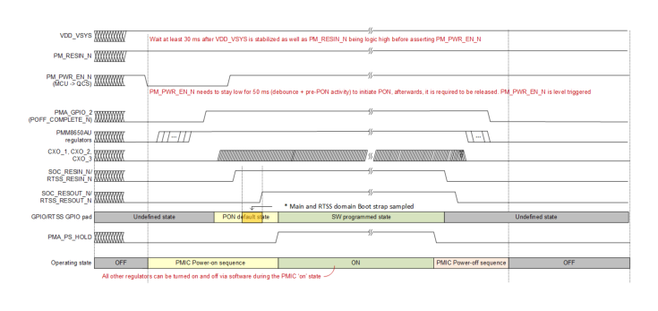

[← Contents](../README.md)

## 3.4 Power-on circuits and power sequence

Dedicated circuits continuously monitor several events that might trigger a power-on sequence. If any of these events occur, the PMIC circuits are powered on, the system’s available power sources are determined, the correct source is enabled, and the SoC is taken out of reset.

**Figure 3-1  QCS9075 and PMIC power-on sequence**

*Waveforms in the figure, top to bottom, with the annotations printed on them:*

- **VDD_VSYS** — “Wait at least 30 ms after VDD_VSYS is stabilized as well as PM_RESIN_N being
  logic high before asserting PM_PWR_EN_N”
- **PM_RESIN_N**
- **PM_PWR_EN_N (MCU → QCS)** — “PM_PWR_EN_N needs to stay low for 50 ms (debounce + pre‑PON
  activity) to initiate PON. afterwards, it is required to be released. PM_PWR_EN_N is level
  triggered”
- **PMA_GPIO_2 (POFF_COMPLETE_N)**
- **PMM8650AU regulators**
- **CXO_1, CXO_2, CXO_3**
- **SOC_RESIN_N / RTSS_RESIN_N**
- **SOC_RESOUT_N / RTSS_RESOUT_N** — “\* Main and RTSS domain Boot strap sampled”
- **GPIO/RTSS GPIO pad** — states in sequence: Undefined state → PON default state →
  SW programmed state → Undefined state
- **PMA_PS_HOLD**
- **Operating state** — OFF → PMIC Power‑on sequence → ON → PMIC Power‑off sequence → OFF;
  footnote “All other regulators can be turned on and off via software during the PMIC ‘on’ state”
