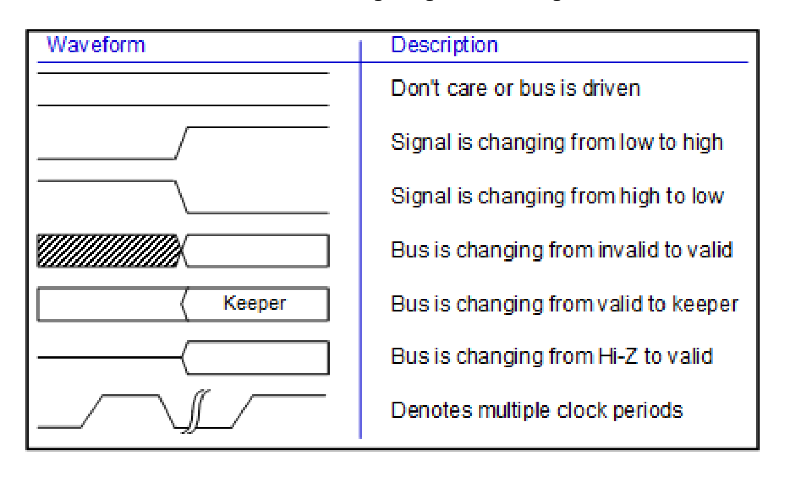
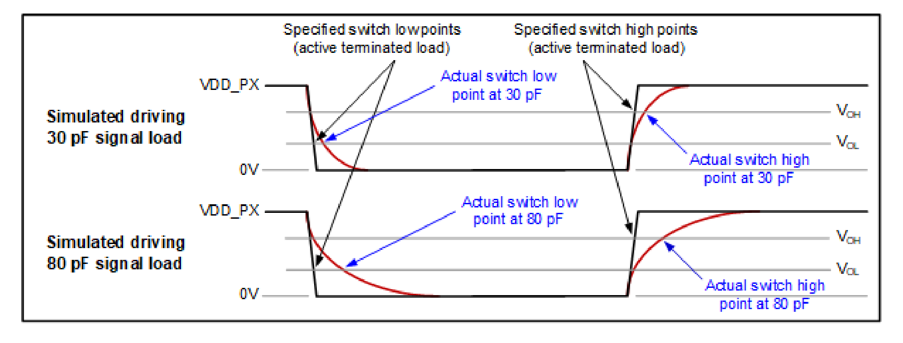

[← Contents](../README.md)

## 3.6 Timing characteristics

Specifications for the device timing characteristics are included (where appropriate) under each function’s section, along with all its other performance specifications. Some general comments about timing characteristics and pertinent pin design methodologies are included here.

**NOTE** All QCS9075 devices are characterized with actively terminated loads; therefore, all baseband timing parameters in this document assume no bus loading. For more details, see Section 3.6.2.

### 3.6.1 Timing diagram conventions

The conventions used within timing diagrams throughout this document are shown in the following figure.

**Figure 3-2  Timing diagram conventions**

*Waveform key (two columns: Waveform | Description):*

| Waveform | Description |
|---|---|
| Solid level line | Don't care or bus is driven |
| Rising edge | Signal is changing from low to high |
| Falling edge | Signal is changing from high to low |
| Hatched box → open box | Bus is changing from invalid to valid |
| Open box labelled “Keeper” | Bus is changing from valid to keeper |
| Hi‑Z line → open box | Bus is changing from Hi‑Z to valid |
| Break (squiggle) symbol | Denotes multiple clock periods |

For each signal in the diagram:

- One clock period (T) extends from one rising clock edge to the next rising clock edge.
- The high level represents 1, the low level represents 0, and the middle level represents the floating (high-impedance) state.
- When both the high and low levels are shown over the same time interval, the meaning depends on the signal type:
  - For a bus type signal (multiple bits), the processor or external interface is driving a value, but that value may or may not be valid.
  - For a single signal, this indicates don’t care.

### 3.6.2 Rise and fall time specifications

The testers that characterize QCS9075 devices have actively terminated loads, making the rise and fall times quicker (mimicking a no-load condition). The impact that different external load conditions have on rise and fall times is shown in the following diagram.

**Figure 3-3  Rise and fall times under different load conditions**

*Two stacked waveform panels showing rise/fall behaviour:*

- Upper panel: **Simulated driving 30 pF signal load** — VDD_PX and 0 V reference levels, with
  V_OH and V_OL threshold lines; callouts “Specified switch low points (active terminated load)”,
  “Specified switch high points (active terminated load)”, “Actual switch low point at 30 pF”,
  “Actual switch high point at 30 pF”.
- Lower panel: **Simulated driving 80 pF signal load** — same reference levels and thresholds,
  with “Actual switch low point at 80 pF” and “Actual switch high point at 80 pF”.

To account for external load conditions, rise or fall times must be added to the parameters that start timing at the QCS9075 device and terminate at an external device (or vice versa). Adding these rise and fall times is equivalent to applying capacitive load derating factors.
