[← Contents](../README.md)

## 3.9 Connectivity

The connectivity functions supported by the QCS9075 that require electrical specifications include:

- USB host/slave support with built-in physical layer (PHY)
- Peripheral component interconnect express (PCIe) interfaces
- Universal flash storage (UFS)
- NOR flash storages (OSPI/QSPI)
- Reduced gigabit media independent interface (RGMII)
- High-speed serial gigabit media-independent interface (HSGMII)
- 2 Inter-IC sound (I S) interfaces
- Pulse-coded modulation (PCM) interfaces
- Time-division multiplexing (TDM) interfaces
- Through proper configuration of 21 main domain (MD) GPIO-based QUP SEs and 5 RTSS domain RTSS_IO-based QUP SEs:
  - Universal asynchronous receiver/transmitter (UART) ports
  - 2 Inter-integrated circuit (I C) interfaces
  - Serial peripheral interface (SPI) ports
- 2 2 Dedicated I C interfaces for camera (CCI I C)

Pertinent specifications for these functions are detailed in the following subsections.

**NOTE** In addition to the following hardware specifications, see the latest software release notes for software-based performance features or limitations.

### 3.9.1 USB interfaces

**Table 3-20  Supported USB standards and exceptions**

| Applicable standard | Feature exceptions |
|---|---|
| Universal Serial Bus Specification, Revision 3.1 (August11, 2014 or later) | None |
| UTMI specification version 1.05, released on 3/29/2001 | None |
| On-The-Go and Embedded Host Supplement to the USB 3.0 Specification (May 10, 2012, Revision 1.1 or later) | Attach detection protocol (ADP), role swap protocol (RSP), session request protocol (SRP), and host negotiation protocol (HNP) |
| USB Serial Bus Specification, Revision 2.0 (April 27, 2000 or later) | None |

The following table summarizes the SuperSpeed USB electrical and timing characteristics for Gen1 and Gen2 operation at the SoC pin level.

**Table 3-21  USB SuperSpeed electrical characteristics**

| Parameter | Min | Typ | Max | Unit |
|---|---|---|---|---|
| Supported generation | – | Gen1, Gen2 | – | – |
| Signaling rate (Gen1) | – | 5 | – | Gb/s |
| Signaling rate (Gen2) | – | 10 | – | Gb/s |
| Unit interval (Gen1) | 199.94 | 200 | 200.065 | ps |
| Unit interval (Gen2) | 99.97 | 100 | 100.0325 | ps |
| Differential output voltage | 800 | 900 | 1200 | mVpp-diff |
| Tx rise / fall time (Gen1) | 20 | – | 80 | ps |
| Tx rise / fall time (Gen2) | 10 | – | 50 | ps |
| Differential output impedance | 70 | 90 | 110 | Ω |
| Intra-pair skew (P–N) | – | – | 5 | ps |
| Lane-to-lane skew | – | – | 70 | ps |
| Tx total jitter (Gen1) | – | – | 132 | ps |
| Tx total jitter (Gen2) | – | – | 67 | ps |
| Rx eye height (Gen2) | 0.07 | – | – | mV |
| Rx eye height (Gen1) | 0.1 | – | – | mV |

**NOTE** ■ Compliant with USB‑IF USB 3.1/USB 3.2 specifications for SuperSpeed operation.

  - Table applies to SuperSpeed differential pairs (Tx/Rx); USB 2.0 D+/D− signaling is specified separately.
  - SuperSpeed signaling uses embedded clocking; an external reference clock is required only for PHY PLL operation.
  - Differential routing requirement: 90 Ω ± 10% impedance, with strict control of intra‑pair and inter‑pair skew.
  - AC coupling capacitors are required on Tx SuperSpeed lanes and should be placed near SoC pins.
  - Supports LFPS‑based power management including U1, U2, and U3 states.
  - All parameters apply across recommended voltage and temperature range unless otherwise stated.

The following table summarizes the high-speed USB electrical and timing characteristics at the SoC pin level.

**Table 3-22  USB high-speed electrical characteristics**

| Parameter | Condition | Min | Typ | Max | Unit |
|---|---|---|---|---|---|
| Signaling rate | High-speed mode | 479.76 | 480 | 480.24 | Mb/s |
| Unit interval (UI) | at 480 Mb/s | – | 2.083 | – | ns |
| Differential output voltage (high) | HS driver | 360 | 400 | 440 | mVpp |
| Differential output voltage (low) | HS driver | – | – | 10 | mVpp |
| Differential interface impedance | Link (cable + termination) | 76.5 | 90 | 103.5 | Ω |
| Termination resistance (per line) | HS mode | 40.5 | 45 | 49.5 | Ω |
| Differential receiver sensitivity | Receiver | 200 | – | – | mV |
| Differential common-mode range | HS signaling | 0.8 | – | 2.5 | V |
| Rise time (10–90%) | Signal edge | 0.5 | – | – | ns |
| Fall time (10–90%) | Signal edge | 0.5 | – | – | ns |
| Chirp K/J width | HS detection | 40 | – | 60 | µs |
| Chirp J level (differential) | HS driver | 700 | – | 1100 | mV |
| Chirp K level (differential) | HS driver | –900 | – | –500 | mV |
| Bus pull-up (upstream port) | – | 1.425 | – | 1.575 | kΩ |
| Bus pull-down (downstream port) | – | 14.25 | – | 15.75 | kΩ |

**NOTE** ■ Compliant with the USB 2.0 high-speed specification (480 Mb/s); values reflect SoC pin-level electrical and timing characteristics

  - High-speed signaling uses bit-stuffed NRZI encoding with differential D+ and D- signaling
  - High-speed operation requires chirp signaling during reset for speed negotiation with downstream devices
  - No external reference clock is required; clock is recovered from the data stream
  - Differential impedance target is 90 Ω ± 10%; tight control of D+ and D– skew is recommended for margin
  - On-die series termination is assumed unless otherwise specified in the hardware design guide
  - All specifications apply across recommended operating voltage and temperature unless otherwise noted

### 3.9.2 PCIe interface

**Table 3-23  Supported PCIe standards and exceptions**

| Applicable standard | Feature exceptions |
|---|---|
| PCI Express Base Specification Revision 4.0 | Link configure capability |
|  | Lane margining at receiver |
|  | L0s link state |

The following table summarizes the electrical and timing characteristics for the high-speed serial interface operating at Gen4 and Gen3 data rates. The parameters represent SoC pin-level requirements across supported operating conditions.

**Table 3-24  PCIe Gen4 and Gen3 electrical and timing characteristics**

| Parameter | Gen4 – Min | Gen4 – Typ | Gen4 – Max | Gen3 – Min | Gen3 – Typ | Gen3 – Max | Unit |
|---|---|---|---|---|---|---|---|
| Signaling rate | – | – | 16 | – | – | 8 | GT/s |
| Unit interval (UI) | 62.48 | 62.5 | 62.64 | 124.96 | 125 | 125.28 | ps |
| Differential voltage (Tx) | 600 | – | 1200 | 800 | – | 1200 | mVpp-diff |
| Single-ended swing (Tx) | 300 | – | 600 | 400 | – | 600 | mVpp |
| Tx common-mode voltage | 0.7 | – | 0.9 | 0.7 | – | 0.9 | V |
| Differential output impedance | 80 | – | 120 | 80 | – | 120 | Ω |
| Receiver input sensitivity | 30 | – | – | 85 | – | – | mV |
| AC coupling capacitance | 75 | 100 | 200 | 75 | 100 | 200 | nF |
| Intra-pair skew (P–N) | – | – | 5 | – | – | 20 | ps |
| Lane-to-lane skew | – | – | 20 | – | – | 50 | ps |
| Tx total jitter (TJ) | – | – | 15.85 | – | – | 33.83 | ps |
| REFCLK frequency | 99.8 | 100 | 100.2 | 99.8 | 100 | 100.2 | MHz |
| REFCLK duty cycle | 45 | 50 | 55 | 45 | 50 | 55 | % |
| REFCLK RMS jitter (no SSC) | – | – | 1 | – | – | 1 | ps |
| REFCLK peak-to-peak jitter | – | – | 10 | – | – | 10 | ps |
| Spread spectrum clocking (down spread) | -0.5 | -0.3 | 0 | -0.5 | -0.3 | 0 | % |
| PERST# assertion width | 100 | – | – | 100 | – | – | ms |
| PERST# deassertion to LTSSM | 2 | – | – | 2 | – | – | ms |
| Receiver detect voltage | 200 | – | 600 | 200 | – | 600 | mV |
| Receiver detect resistance | 40 | – | 60 | 40 | – | 60 | Ω |

### 3.9.3 UFS interface

**Table 3-25  Supported UFS standards and exceptions**

| Applicable standard | Feature exceptions |
|---|---|
| Universal Flash Storage (UFS), Version 3.1 | None |

### 3.9.4 HSGMII interface

**Table 3-26  Supported HSGMII standards and exceptions**

| Applicable standard | Feature exceptions |
|---|---|
| IEEE 802.3 section 47 | None |

The following tables summarize the SoC pin-level electrical and timing characteristics for SGMII operation at *3.125* *Gbps* and *1.25 Gbps*.

**Table 3-27  SGMII characteristics at 3.125 Gbps**

| Parameter | Min | Typ | Max | Unit |
|---|---|---|---|---|
| Supported link speed | – | – | 2500 | Mb/s |
| Line coding | – | 8b/10b | – | – |
| Serial line rate | – | 3.125 | – | Gb/s |
| Unit interval (UI) | – | 320 | – | ps |
| Tx rise/fall time | 60 | – | 130 | ps |
| Intra-pair skew (P–N) | – | – | 15 | ps |
| Lane-to-lane skew | – | – | 100 | ps |
| Tx total jitter (TJ) | – | – | 0.35 | UI |
| Tx random jitter (RJ, RMS) | – | – | 0.18 | UI |
| Tx deterministic jitter | – | – | 0.17 | UI |
| Tx duty cycle distortion (DCD) | – | – | 2 | % |
| Rx eye height | 200 | – | – | mV |
| Rx eye width | 0.35 | – | – | UI |

**Table 3-28  SGMII characteristics at 1.25 Gbps**

| Parameter | Min | Typ | Max | Unit |
|---|---|---|---|---|
| Supported link speed | – | – | 1000 | Mb/s |
| Line coding | – | 8b/10b | – | – |
| Serial line rate | – | 1.25 | – | Gb/s |
| Unit interval (UI) | – | 800 | – | ps |
| Tx rise/fall time | 100 | – | 200 | ps |
| Intra-pair skew (P–N) | – | – | 20 | ps |
| Lane-to-lane skew | – | – | 100 | ps |
| Tx total jitter (TJ) | – | – | 0.30 | UI |
| Tx random jitter (RJ, RMS) | – | – | 0.20 | UI |
| Tx deterministic jitter | – | – | 0.10 | UI |
| Rx eye height | 100 | – | – | mV |
| Rx eye width | 0.35 | – | – | UI |

**NOTE** ■ Compliant with SGMII specification and IEEE 802.3 (1000BASE-X PCS/PMA)

  - Uses 8b/10b encoding with a fixed 1.25 Gb/s serial line rate, independent of negotiated link speed
  - Clock is embedded in the serial data stream; an optional 25 MHz reference clock may be used for PLL operation, depending on the SoC implementation
  - Differential routing requires controlled impedance of 100 Ω ± 10% with tight control of intra-pair skew
  - Auto-negotiation supports 10/100/1000 Mb/s operation over a single differential pair
  - AC coupling is required on Tx differential signals unless otherwise specified in the platform design
  - Specifications apply across recommended operating voltage and temperature unless otherwise noted

### 3.9.5 Secured digital interfaces

The supported secure digital (SD) interface standards and their exceptions are listed here.

**Table 3-29  Supported SD standards and exceptions**

| Applicable standard | Feature exceptions |
|---|---|
| MultiMediaCard Host Specification version 5.1 | None |
| Secure Digital: Physical Layer Specification version 3.0 | None |
| SDIO Card Specification version 3.0 | None |

**Table 3-30  SDC modes supported**

| Function | Bits | I/O voltage | Vector name | Frequency |
|---|---|---|---|---|
| eMMC | 8 | 1.8 V | HS400 | 192 MHz |
|  |  | 1.8 V | HS200 | 192 MHz |
|  |  | 1.8 V | HSSDR (SDR25) | 52 MHz |
|  |  | 1.8 V | HSDDR (DDR50) | 52 MHz |
| SD | 4 | 1.8 V | SDR50 | 100 MHz |

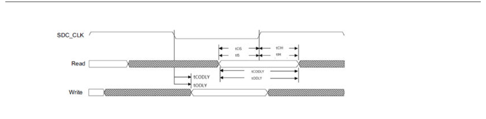

**Figure 3-4  Single data rate – SDR mode**

*Signals: SDC_CLK, Read, Write.
Timing markers: tCIS, tIS, tCIH, tIH (input setup/hold with respect to SDC_CLK) and
tCODLY, tODLY (command/data output delay).*

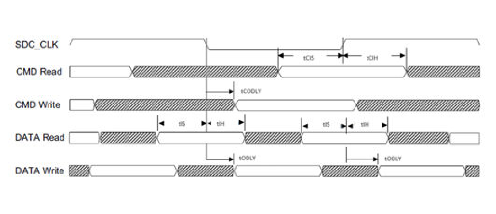

**Figure 3-5  Double data rate – DDR mode**

*Signals: SDC_CLK, CMD Read, CMD Write, DATA Read, DATA Write.
Timing markers: tCIS and tCIH on the command inputs, tCODLY on the command output,
tIS and tIH on the data inputs, tODLY on the data outputs.*

**Figure 3-6  HS400 mode input timing**

*Signals: SDC_CLK (referenced to VT), CMD Write, DATA Write (both referenced to
V_OH/V_OL). Timing markers: tCODLY min and tCODLY max on CMD Write, and tODLY on DATA Write.*

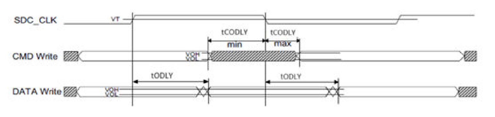

**Figure 3-7  HS400 mode output timing**

*Signals: SDC_CLK (referenced to VT), CMD Write, DATA Write (both referenced to
V_OH/V_OL). Timing markers: tCODLY min and tCODLY max on CMD Write, and tODLY on DATA Write.
(The document prints the same drawing for Figure 3‑6 and Figure 3‑7.)*

**Table 3-31  eMMC timing specifications with respect to controller – regular mode**

| SDCC modes | Frequency | Parameter | Description | Minimum (ns) | Maximum (ns) |
|---|---|---|---|---|---|
| HS400 (DDR 200 MHz) | 192 MHz | Tclhigh | Clock high time | 2.3437 | 2.8646 |
|  |  | tRQ | DQS to DQ valid setup | 0.4 | – |
|  |  | tRQH | DQS to DQ valid hold | 0.4 | – |
|  |  | tCIDV | Command input valid window | 2.4 | – |
|  |  | tCODLY | Command output delay | -1.45 | 0.85 |
|  |  | tIDV | Data input valid window | 1.7 | – |
|  |  | tODLY | Data output delay | 0.4 | 1.85 |
| HS200 (SDR 200 MHz) | 192 MHz | Tclhigh | Clock high time | 2.3437 | 2.8646 |
|  |  | tCIDV | Command input valid window | 2.4 | – |
|  |  | tCODLY | Command output delay | -1.45 | 0.85 |
|  |  | tIDV | Data input valid window | 1.7 | – |
|  |  | tODLY | Data output delay | -1.45 | 0.85 |
| HSDDR (DDR 50) | 52 MHz | Tclhigh | Clock high time | 9 | 11 |
|  |  | tCIS | Command input setup | 6.3 | – |
|  |  | tCIH | Command input hold | 1.5 | – |
|  |  | tCODLY | Command output delay | -8.2 | 3 |
|  |  | tIS | Data input setup | 2 | – |
|  |  | tIH | Data input hold | 1.5 | – |
|  |  | tODLY | Data output delay | 0.8 | 6 |
| HSSDR (SDR25) | 52 MHz | Tclhigh | Clock high time | 9 | 11 |
|  |  | tCIS | Command input setup | 6.3 | – |
|  |  | tCIH | Command input hold | 1.5 | – |
|  |  | tCODLY | Command output delay | -8.2 | 3 |
|  |  | tIS | Data input setup | 2 | – |
|  |  | tIH | Data input hold | 1.5 | – |
|  |  | tODLY | Data output delay | -3.7 | 1.5 |

**Table 3-32  SD card timing specifications with respect to controller – regular mode**

| SDCC modes | Frequency | Parameter | Description | Minimum (ns) | Maximum (ns) |
|---|---|---|---|---|---|
| SDR 50 | 100 MHz | Tclhigh | Clock high time | T*0.45 | T*0.45 |
|  |  | tCIS | Command input setup | 2.5 | – |
|  |  | tCIH | Command input hold | 1.5 | – |
|  |  | tCODLY | Command output delay | -3.7 | 1.5 |
|  |  | tIS | Data input setup | 2.5 | – |
|  |  | tIH | Data input hold | 1.5 | – |
|  |  | tODLY | Data output delay | -3.7 | 1.5 |

### 3.9.6 Octa-SPI/Quad-SPI interface

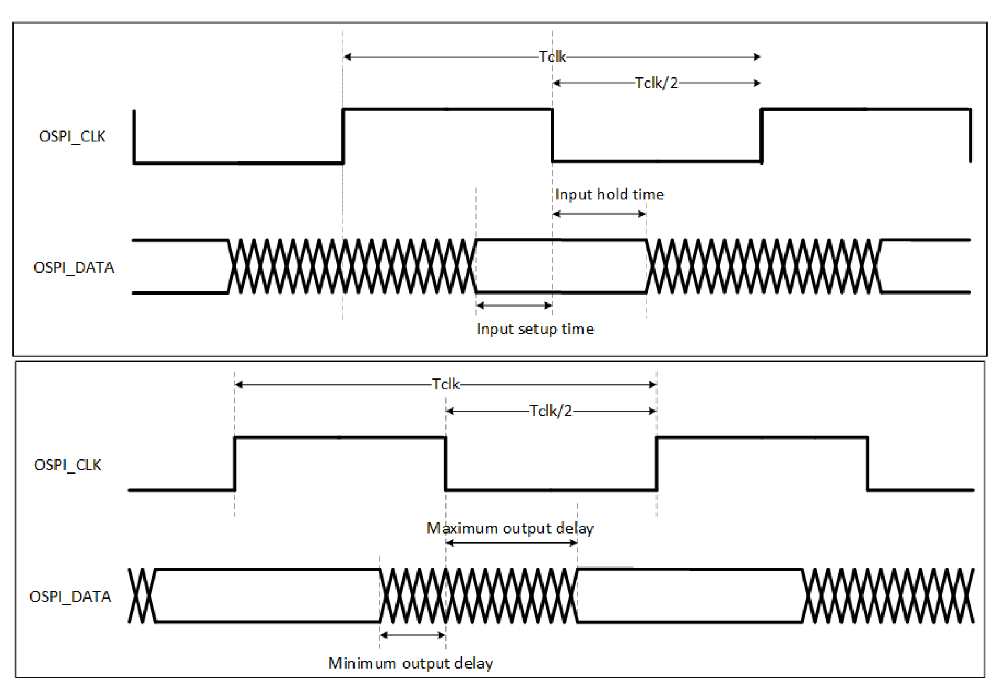

**Figure 3-8  Octa-SPI/Quad-SPI SDR timing diagram**

*Two panels, each with OSPI_CLK and OSPI_DATA:*

- Upper panel (input timing): Tclk and Tclk/2 marked on OSPI_CLK; **Input setup time** and
  **Input hold time** marked on OSPI_DATA.
- Lower panel (output timing): Tclk and Tclk/2 marked on OSPI_CLK; **Minimum output delay** and
  **Maximum output delay** marked on OSPI_DATA.

**Table 3-33  Octa-SPI/Quad-SPI interface SDR timing**

| Parameter | Comments | Min. | Max. | Unit |
|---|---|---|---|---|
| 1/T | OSPI/QSPI clock frequency | – | 90 | MHz |
| t(mis) | Master input setup time | 1.7 | – | ns |
| t(mih) | Master input hold time | 1.3 | – | ns |
| t(mod) | Master output delay | -2.00 | 2.00 | ns |

| Tclk |
|---|
| Tclk |

| Tclk/2 |
|---|
| Tclk/2 |

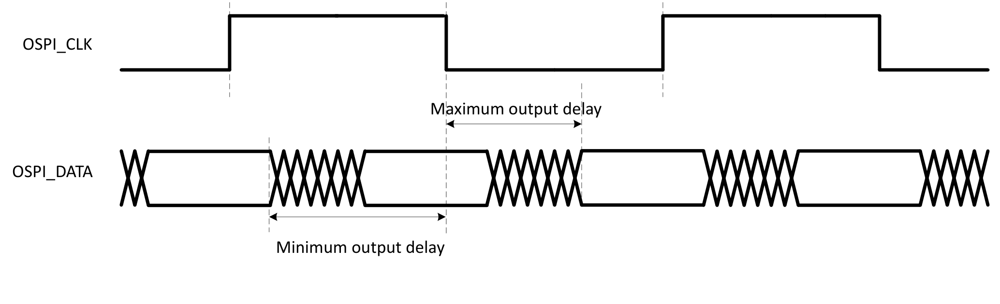

**Figure 3-9  Octa-SPI DDR timing diagram**

*Signals: OSPI_CLK and OSPI_DATA. Markers: Tclk, Tclk/2, **Maximum output delay**
and **Minimum output delay** (data changes on both clock edges — DDR).*

**Table 3-34  Octa-SPI interface DDR timing**

| Parameter | Comments | Min. | Max. | Unit |
|---|---|---|---|---|
| 1/T | OSPI clock frequency | – | 166 | MHz |
| t(skew) | DQ to DQS skew | – | 530 | ps |
| t(mod) | Master output delay | -2.00 | 2.00 | ns |

**NOTE** DDR is not supported on Quad-SPI operation.

### 3.9.7 RGMII interface

**Table 3-35  Supported RGMII standards and exceptions**

| Applicable standard | Feature exceptions |
|---|---|
| Reduced Gigabit Media Independent Interface (RGMII) v1.3 and v2.0 | None |

| Parameter | Min | Typ | Max | Unit |
|---|---|---|---|---|
| Supported speeds | 10/100/1000 |  |  | Mb/s |
| Reference clock (TXC/RXC) | 2.5/25/125 |  |  | MHz |
| Data transfer | DDR at 1000 Mbps only |  |  |  |
| **Signal electrical levels (CMOS)** |  |  |  |  |
| I/O supply voltage (VDDIO) | 1.7 | 1.8 | 1.9 | V |
| Input high voltage (VIH) | 0.65 × VDD_PXx | — | VDD_PXx + 0.3 | V |
| Input low voltage (VIL) | -0.3 | — | 0.35 × VDD_PXx | V |
| Output high voltage (VOH) | VDD_PXx - 0.45 | — | — | V |
| Output low voltage (VOL) | — | — | 0.45 | V |
| **Timing (1000BASE**‑**T)** |  |  |  |  |
| TXD setup time | 1.2 | — | — | ns |
| TXD hold time | 1.2 | — | — | ns |
| RXD setup time | 1 | — | — | ns |
| RXD hold time | 1 | — | — | ns |
| Clock duty cycle | 45 | 50 | 55 | % |
| **Management interface (MDIO/MDC)** |  |  |  |  |
| MDC clock frequency | — | 2.5 |  | MHz |
| Input high voltage (VIH) | 0.65 × VDD_PXx | — | VDD_PXx + 0.3 |  |
| Input low voltage (VIL) | -0.3 | — | 0.35 × VDD_PXx |  |
| Output high voltage (VOH) | VDD_PXx - 0.45 | — | — | V |
| Output low voltage (VOL) | — | — | 0.45 | V |

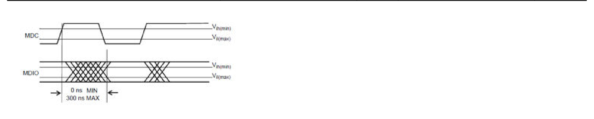

**Figure 3-10  MDIO sourced by PHY**

*Signals: MDC and MDIO, with V_ih(min) and V_il(max) reference levels.
Markers: “0 ns MIN” and “300 ns MAX” from the MDC edge to the MDIO transition.*

When the MDIO signal is sourced by the PHY, it is sampled by the SoC synchronous to the rising edge of MDC. The clock-to-output delay from the PHY shall be a minimum of 0 ns and a maximum of 300 ns.

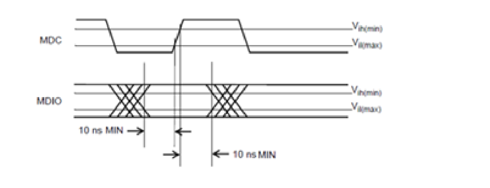

**Figure 3-11  MDIO sourced by SoC**

*Signals: MDC and MDIO, with V_ih(min) and V_il(max) reference levels.
Markers: “10 ns MIN” setup and “10 ns MIN” hold around the MDC edge.*

When the SoC sources the MDIO signal, it shall provide a minimum setup time of 10 ns and a minimum hold time of 10 ns, referenced to the rising edge of MDC.

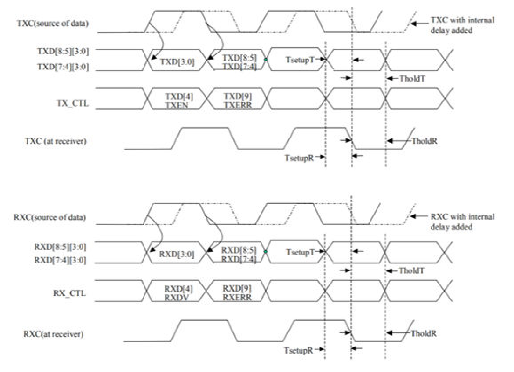

**Figure 3-12  RGMII Tx and Rx timing**

*Two panels — transmit (top) and receive (bottom).*

- **Transmit:** TXC(source of data) — also shown dashed as “TXC with internal delay added”;
  TXD[8:5][3:0] and TXD[7:4][3:0] carrying TXD[3:0] then TXD[8:5]/TXD[7:4]; TX_CTL carrying
  TXD[4] TXEN then TXD[9] TXERR; TXC (at receiver). Markers: TsetupT, TholdT, TsetupR, TholdR.
- **Receive:** RXC(source of data) — also shown dashed as “RXC with internal delay added”;
  RXD[8:5][3:0] and RXD[7:4][3:0] carrying RXD[3:0] then RXD[8:5]/RXD[7:4]; RX_CTL carrying
  RXD[4] RXDV then RXD[9] RXERR; RXC(at receiver). Markers: TsetupT, TholdT, TsetupR, TholdR.

### 3.9.8 I²S interfaces

**Table 3-36  Supported I²S standards and exceptions**

| Applicable standards | Feature exceptions |
|---|---|
| Philips I²S Bus Specifications revised June 5, 1996 | None |

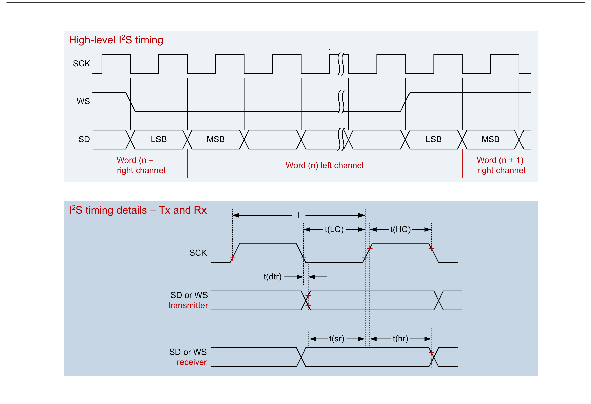

**Figure 3-13  I²S timing diagram**

*Two panels.*

- **High-level I²S timing** — signals SCK, WS and SD. SD carries LSB and MSB cells; the frame is
  annotated “Word (n – right channel)”, “Word (n) left channel” and “Word (n + 1) right channel”.
- **I²S timing details – Tx and Rx** — SCK with period T and the high/low times t(HC) and t(LC);
  “SD or WS transmitter” with output delay t(dtr); “SD or WS receiver” with setup t(sr) and
  hold t(hr).

**Table 3-37  I²S interface timing**

| Parameter | Parameter | Commentsᵃ | Min | Typ | Max | Unit |
|---|---|---|---|---|---|---|
| ***Using internal SCK*** |  |  |  |  |  |  |
| Frequency | Frequency |  | – | – | 24.576 | MHz |
| T | Clock period |  | 40.69 | – | – | ns |
| t(HC) | Clock high |  | 0.45 × T | – | 0.55 × T | ns |
| t(LC) | Clock low |  | 0.45 × T | – | 0.55 × T | ns |
| t(sr) | SD and WS input setup time |  | 8.14 | – | – | ns |
| t(hr) | SD and WS input hold time |  | 1.5 | – | – | ns |
| t(dtr) | SD and WS output delay |  | – | – | 8.14 | ns |
| ***Using external SCK*** |  |  |  |  |  |  |
| Frequency | Frequency |  | – | – | 24.576 | MHz |
| T | Clock period |  | 40.69 | – | – | ns |
| t(HC) | Clock high |  | 0.45 × T | – | 0.55 × T | ns |
| t(LC) | Clock low |  | 0.45 × T | – | 0.55 × T | ns |
| t(sr) | SD and WS input setup time |  | 8.14 | – | – | ns |
| t(hr) | SD and WS input hold time |  | 1.5 | – | – | ns |
| t(dtr) | SD and WS output delay |  | – | – | 8.14 | ns |

ᵃ Load capacitance is between 10 pF and 40 pF.

**Table 3-38  HS-I²S Rx interface timing**

| Parameter | Parameter | Commentsᵃ | Min | Typ | Max | Unit |
|---|---|---|---|---|---|---|
| ***Using external SCK*** |  |  |  |  |  |  |
|  | Frequency |  |  | – | 73.728 | MHz |
| T | Clock period |  | 13.56 | – | – | ns |
| t(HC) | Clock high |  | 0.45 × T | – | 0.55 × T | ns |
| t(LC) | Clock low |  | 0.45 × T | – | 0.55 × T | ns |
| t(sr) | SD and WS input setup time |  | 2.71 | – | – | ns |
| t(hr) | SD and WS input hold time |  | 1.5 | – | – | ns |

ᵃ Load capacitance is between 10 pF and 40 pF.

**Table 3-39  HS-I²S Tx interface timing**

| Parameter | Parameter | Commentsᵃ | Min | Typ | Max | Unit |
|---|---|---|---|---|---|---|
| ***Using external SCK*** |  |  |  |  |  |  |
|  | Frequency |  |  | – | 24.576 | MHz |
| T | Clock period |  | 40.69 | – | – | ns |
| t(HC) | Clock high |  | 0.45 × T | – | 0.55 × T | ns |
| t(LC) | Clock low |  | 0.45 × T | – | 0.55 × T | ns |
| t(dtr) | SD and WS output delay |  | – | – | 8.14 | ns |

ᵃ Load capacitance is between 10 pF and 40 pF.

### 3.9.9 PCM/TDM interfaces

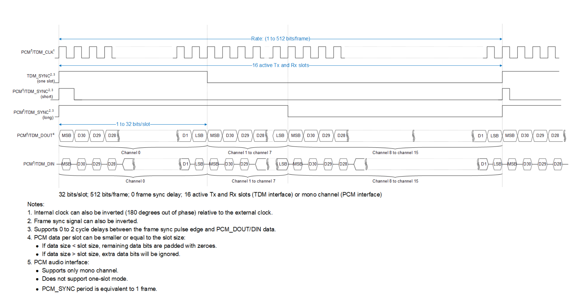

**Figure 3-14  PCM/TDM audio format with different sync modes**

*Signals, top to bottom:* PCM⁵/TDM_CLK¹; TDM_SYNC²'³ (one slot);
PCM⁵/TDM_SYNC²'³ (short); PCM⁵/TDM_SYNC²'³ (long); PCM⁵/TDM_DOUT⁴; PCM⁵/TDM_DIN.
*Spans marked on the drawing:* “Rate: (1 to 512 bits/frame)”, “16 active Tx and Rx slots”,
“1 to 32 bits/slot”. Data cells are MSB, D30, D29, D28 … D1, LSB, grouped as “Channel 0”,
“Channel 1 to channel 7” and “Channel 8 to channel 15” on both DOUT and DIN.
Caption line under the drawing: “32 bits/slot; 512 bits/frame; 0 frame sync delay; 16 active Tx
and Rx slots (TDM interface) or mono channel (PCM interface)”.

Notes printed with the figure:

1. Internal clock can also be inverted (180 degrees out of phase) relative to the external clock.
2. Frame sync signal can also be inverted.
3. Supports 0 to 2 cycle delays between the frame sync pulse edge and PCM_DOUT/DIN data.
4. PCM data per slot can be smaller or equal to the slot size:
   - If data size < slot size, remaining data bits are padded with zeroes.
   - If data size > slot size, extra data bits will be ignored.
5. PCM audio interface:
   - Supports only mono channel.
   - Does not support one-slot mode.
   - PCM_SYNC period is equivalent to 1 frame.

PCM/TDM timing details

T

T(HC) T(LC)

|  |  |
|---|---|
|  |  |
|  |  |

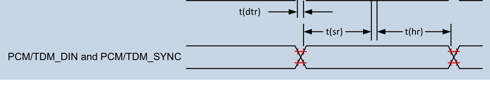

**Figure 3-15  PCM/TDM timing diagram**

*Signal group “PCM/TDM_DIN and PCM/TDM_SYNC” with the markers t(dtr) (output
delay), t(sr) (setup) and t(hr) (hold).*

**Table 3-40  PCM/TDM interface timing parameters**

| Parameter | Parameter | Comments | Min | Max | Unit |
|---|---|---|---|---|---|
| ***Master mode*** |  |  |  |  |  |
| Frequency | Frequency |  | – | 24.576 | MHz |
| T | Clock period |  | 40.69 | – | ns |
| t(HC) | Clock high |  | 0.45× T | 0.55× T | ns |
| t(LC) | Clock low |  | 0.45× T | 0.55× T | ns |
| t(sr) | PCM/TDM_DIN and PCM/TDM_SYNC setup time |  | 8.14 | – | ns |
| t(hr) | PCM/TDM_DIN and PCM/TDM_SYNC hold time |  | 1.5 | – | ns |
| t(dtr) | PCM/TDM_DOUT and PCM/TDM_SYNC output delay |  | – | 8.14 | ns |
| ***Slave mode*** |  |  |  |  |  |
| Frequency | Frequency |  | – | 24.576 | MHz |
| T | Clock period |  | 40.69 | – | ns |
| t(HC) | Clock high |  | 0.45× T | 0.55× T | ns |
| t(LC) | Clock low |  | 0.45× T | 0.55× T | ns |
| t(sr) | PCM/TDM_DIN and PCM/TDM_SYNC setup time |  | 8.14 | – | ns |
| t(hr) | PCM/TDM_DIN and PCM/TDM_SYNC hold time |  | 1.5 | – | ns |
| t(dtr) | PCM/TDM_DOUT and PCM/TDM_SYNC output delay |  | – | 8.14 | ns |

ᵃ Load capacitance is between 10 pF to 40 pF.

**Table 3-41  High speed PCM/TDM Rx interface timing**

| Parameter | Parameter | Commentsᵃ | Min | Typ | Max | Unit |
|---|---|---|---|---|---|---|
| ***Using external SCK*** |  |  |  |  |  |  |
|  | Frequency |  |  | – | 73.728 | MHz |
| T | Clock period |  | 13.56 | – | – | ns |
| t(HC) | Clock high |  | 0.45 × T | – | 0.55 × T | ns |
| t(LC) | Clock low |  | 0.45 × T | – | 0.55 × T | ns |
| t(sr) | PCM/TDM_DIN and PCM/TDM_SYNC setup time |  | 2.71 | – | – | ns |
| t(hr) | PCM/TDM_DIN and PCM/TDM_SYNC hold time |  | 1.5 | – | – | ns |

ᵃ Load capacitance is between 10 pF and 40 pF.

**Table 3-42  High speed PCM/TDM Tx interface timing**

| Parameter | Parameter | Commentsᵃ | Min | Typ | Max | Unit |
|---|---|---|---|---|---|---|
| ***Using external SCK*** |  |  |  |  |  |  |
|  | Frequency |  |  | – | 24.576 | MHz |
| T | Clock period |  | 40.69 | – | – | ns |
| t(HC) | Clock high |  | 0.45 × T | – | 0.55 × T | ns |
| t(LC) | Clock low |  | 0.45 × T | – | 0.55 × T | ns |
| t(dtr) | PCM/TDM_DOUT and PCM/TDM_SYNC delay |  | – | – | 8.14 | ns |

ᵃ Load capacitance is between 10 pF and 40 pF.

### 3.9.10 I²C interface

**Table 3-43  Supported I²C standards and exceptions**

| Applicable standard | Feature exceptions |
|---|---|
| I²C Specification, version 3.0 | HS mode, slave mode, multi-master mode, and 10‑bit addressing are not supported. |

### 3.9.11 Serial peripheral interface

The QCS9075 supports SPI as a master on 25 QUP ports. SPI slave mode is supported on the eight QUP ports. See [QCS9075 Pin Assignment and GPIO Configuration Spreadsheet (80-73417-1A)](https://docs.qualcomm.com/bundle/80-73417-1A/resource/80-73417-1A.xlsm) for more details.

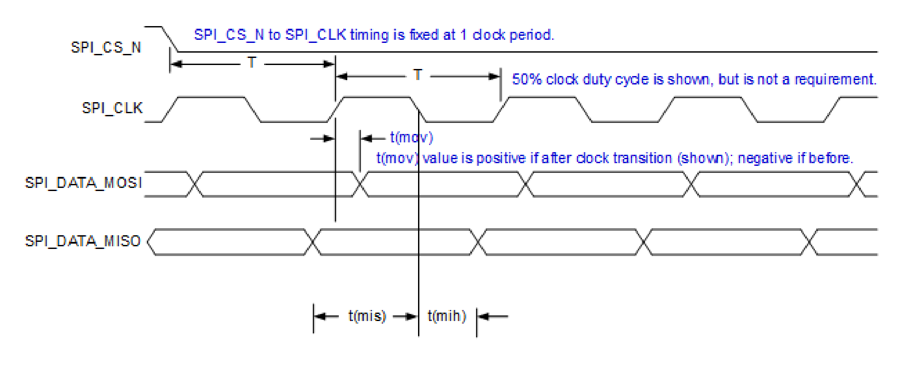

**Figure 3-16  SPI master timing diagram**

*Signals: SPI_CS_N, SPI_CLK, SPI_DATA_MOSI, SPI_DATA_MISO.
Markers: clock period T (shown twice), t(mov) on MOSI, t(mis) and t(mih) on MISO.
Printed annotations:* “SPI_CS_N to SPI_CLK timing is fixed at 1 clock period.”,
“50% clock duty cycle is shown, but is not a requirement.”,
“t(mov) value is positive if after clock transition (shown); negative if before.”

**NOTE** Depending on the mode configuration (Clock PHA and POL settings), Tx and Rx sampling edge could differ. The timing diagram above is using mode 1 as an example

**Table 3-44  SPI master timing characteristics**

| Parameter | Comments | Min | Typ | Max | Unit |
|---|---|---|---|---|---|
| T(SPI clock period)ᵃ | 50 MHz maximum | 20 | – | – | ns |
| t(ch) | Clock high | 8 | – | – | ns |
| t(cl) | Clock low | 8 | – | – | ns |
| t(mov) | Master output valid | -5 | – | 5 | ns |
| t(mis) | Master input setup | 5 | – | – | ns |
| t(mih) | Master input hold | 1 | – | – | ns |

ᵃ The minimum clock period includes 1% jitter of maximum frequency.

**Table 3-45  SPI slave timing characteristics**

| Parameter | Comments | Min | Max | Unit |
|---|---|---|---|---|
| T (SPI clock period) ᵃ | 50 MHz maximum | 20.0 | – | ns |
| t(ch) | Clock high | 9 | – | ns |
| t(cl) | Clock low | 9 | – | ns |
| t(sov) | Slave output valid | 2 | 13 | ns |
| t(mis) | Slave input setup | 3 | – | ns |
| t(mih) | Slave input hold | 3 | – | ns |
| S_TRI_STATE_EN ᵃ | Slave tri-state enable | – | 14 | ns |
| S_TRI_STATE_DIS ᵃ | Slave tri-state disable | – | 14 | ns |

ᵃ The total capacitive load must not exceed 30 pF for a single slave system. For each additional slave, 10 pF should be added to the clock and data lines (not needed for chip select since it is one-to-one). For example, 40 pF for two slaves, although most systems have only a single slave. Care must be taken to verify that every slave can drive the data line fast enough to meet the timing requirement or the system must use a reduced frequency.

**NOTE** Only SPI slave mode 1 (PHA = 1 and POL = 0) is supported.

### 3.9.12 CAN-FD-interface

QCS9075 supports up to eight CAN-FD interfaces multiplexed through RTSS_IOs in the RTSS domain.

For voltage characteristics, see Table 3-5. CAN-FD supports data rates up to 10 Mbps. For information on supported lower data rates, contact QTI.

**Table 3-46  Supported CAN-FD standards and exceptions**

| Applicable standard | Feature exception |
|---|---|
| ISO 11898-1: 2015, Road vehicles, Controller area network (CAN) | None |
| ISO 11898-4, Road vehicles, Controller area network (CAN) | None |
