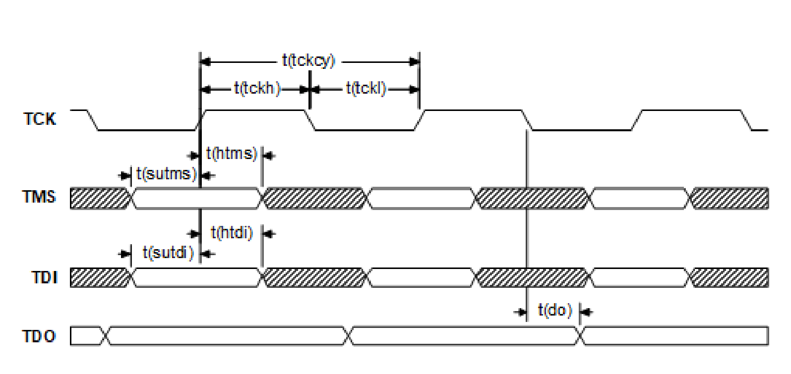

[← Contents](../README.md)

## 3.10 Internal functions

Some internal functions require external interfaces to enable their operation. These include modes and resets, and JTAG functions.

### 3.10.1 Modes and resets

Mode and reset functions are basic digital I/Os that meet the performance specifications presented in Digital logic characteristics.

### 3.10.2 JTAG

**Figure 3-17  JTAG interface timing diagram**

*Signals: TCK, TMS, TDI, TDO.
Markers: t(tckcy) (cycle), t(tckh) (high), t(tckl) (low), t(sutms)/t(htms) on TMS,
t(sutdi)/t(htdi) on TDI, and t(do) on TDO.*

**Table 3-47  JTAG interface timing characteristics**

| Parameter | Parameter | Min | Typ | Max | Unit |
|---|---|---|---|---|---|
| t(tckcy) | TCK period | 50 | – | – | ns |
| t(tckh) | TCK pulse width high | 20 | – | – | ns |
| t(tckl) | TCK pulse width low | 20 | – | – | ns |
| t(sutms) | TMS input setup time | 5 | – | – | ns |
| t(htms) | TMS input hold time | 20 | – | – | ns |
| t(sutdi) | TDI input setup time | 5 | – | – | ns |
| t(htdi) | TDI input hold time | 20 | – | – | ns |
| t(do) | TDO data output delay | – | – | 15 | ns |
| t(tckcy) | TCK period | 50 | – | – | ns |
