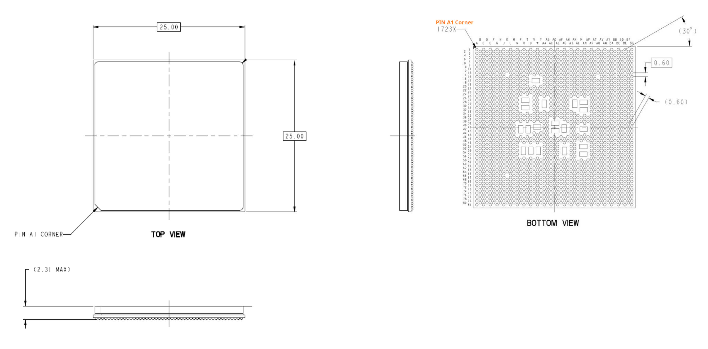
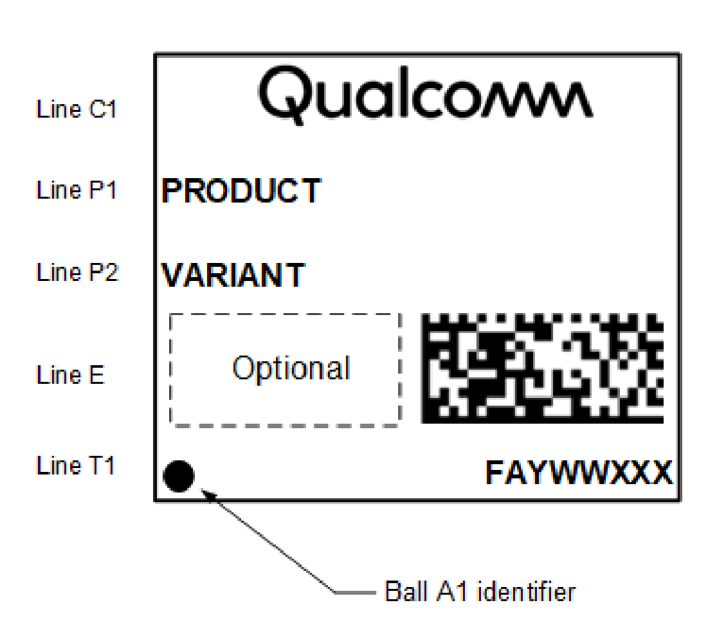

[← Contents](../README.md)

# 4 Mechanical information

## 4.1 Device physical dimensions

The QCS9075 device is available in the FCBGA1723+HS package, with a 25.0 mm × 25.0 mm body and a maximum height of 2.31 mm. This package includes many ground pins for improved electrical grounding, mechanical strength, and thermal continuity. Pin A1 is located by an indicator mark on the top of the package, and by the ball pattern when viewed from below. The following figure shows a simplified version of the package outline drawing.

Click [Package Outline Drawing, FCBGA1723+HS, 25.0 × 25.0 × 2.31 mm, L1250, PL1, HS1 (NT90-11744-1)](https://docs.qualcomm.com/bundle/NT90-11744-1/resource/NT90-11744-1.pdf) to download the drawing.

**Figure 4-1  Simplified FCBGA1723+HS outline drawing**

*Simplified package outline drawing, three views:*

- **TOP VIEW** — 25.00 mm × 25.00 mm body with the chamfered “PIN A1 CORNER” marked.
- **Side view** — overall height (2.31 MAX).
- **BOTTOM VIEW** — 1723X ball array with the “PIN A1 Corner” callout, ball pitch/size callouts
  0.60 and (0.60), a (30°) chamfer callout, row labels A…BG along the top and column numbers
  1…81 down the left side.

## 4.2 Part marking

**Figure 4-2  Device marking (top view, not to scale)**

*Package top marking layout (not to scale):*

- **Line C1** — Qualcomm logo
- **Line P1** — PRODUCT
- **Line P2** — VARIANT
- **Line E** — “Optional” field (dashed box) plus a 2D matrix barcode
- **Line T1** — a dot marking the **Ball A1 identifier**, and the code FAYWWXXX

**Table 4-1  QCS9075 marking line definitions**

| Line | Marking | Definition |
|---|---|---|
| C1 | Qualcomm | Qualcomm name or logo |
| P1 | PRODUCT | Qualcomm Technologies, Inc. (QTI) product name ■ QCS9075 |
| P2 | VARIANT | Device variant information ■ See Table 4-4 for assigned values |
| E | Blank or random | Optional or Additional trace information |
| T1 | • | Pin 1 or pin A1 indicator |
|  | FAYWWXXX | F = supply source code ■ F = J (Samsung) A = assembly site code ■ A = C (Amkor, Korea) ■ A = K (SPIL, Taiwan) Y = single/last digit of year WW = two-digit work week of year specified by Y XXX = traceability number |

**Table 4-2  QFPROM_CORR_PTE_ROW0_LSB (Address: 0x784158)**

| Bit location | Name | Description |
|---|---|---|
| bits [27:20] | FEATURE_ID | These bits are used for defining various feature variants (see Table 4-4). |
| bits [19:0] | JTAG_ID | These bits map to bits [31:12] of the hardware revision number (see Table 4-4). |

## 4.3 Device ordering information

The Oracle short description is used to order QTI products, and is present on both the customer label and this document. The short description includes the product name, configuration code, package type, product revision code, source code, and feature code/program ID of the part. This device can be ordered using the identification code shown in the following table.

**Table 4-3  Example device identification code**

| Device ID code – Symbol definition | AAA-AAAA – Product name | -P – Configuration code | TTTTTT – Package type | NNNN – Number of pins | A – Package variable | +FF – Additional package information | -EE – Shipping package | -RR – Product revision | -Sᵃ – Source code | -BB or -PIDᵇ – Feature code |
|---|---|---|---|---|---|---|---|---|---|---|
| Example 1 | QCS-9075 | 0 | -FCBGA | 1723 |  | +HS | -MT | -00 | -0 | -AA |
| Example 2 | QCS-9075 | 0 | -FCBGA | 1723 |  | +HS | -MT | -00 | -0 | -AC |

ᵃ Source code is always '0'

ᵇ The feature code (BB) and the program ID (PID) are mutually exclusive. A product may have one of them or none of them, but it will never have both. If there is no feature code/program ID, this field is blank, and the Oracle short description ends after the source configuration code (S).

For example 1: QCS-9075-0-FCBGA1723+HS-MT-00-0-AA.

For example 2: QCS-9075-0-FCBGA1723+HS-MT-00-0-AC.

**NOTE** The shipping package can be either TR (tape and reel) or MT (matrix tray).

Device identification details for all samples available to date are summarized in Table 4-4.

For availability and information about daisy chain parts, contact the Qualcomm Sales team for support.

## 4.4 Device identification for each sample type

Device identification details for all samples available to date are summarized in the following table.

**Table 4-4  Device identification details**

| Device | Sample type | Variant (PRR-BB) P = product configuration code RR = product revision code BB = feature code (if applicable) ᵃ | Hardware revision number | FEATURE_ID ᵇ | Hardware version | Source configuration code (S) ᶜ | Comments | Sample date |
|---|---|---|---|---|---|---|---|---|
| QCS9075 | ES | 000-AA | 0x1 02EB 0E1 | 0x0 | v2.0 | 0 | QCS9075, FCBGA1723+HS; Octa-core Kryo Gen6 2.36 GHz; Adreno 663 GPU 800 MHz; Hexagon Tensor Processor 1.487 GHz; 100 TOPS | – |
| QCS9075 | ES | 000-AC | 0x1 02EB 0E1 | 0x1 | v2.0 | 0 | QCS9075, FCBGA1723+HS; Octa-core Kryo Gen6, 2.1 GHz; Adreno 663 GPU 530 MHz; Hexagon Tensor Processor 0.768 GHz; 50 TOPS | – |
| QCS9075 | CS | 000-AA | 0x1 02EB 0E1 | 0x0 | v2.0 | 0 | QCS9075, FCBGA1723+HS; Octa-core Kryo Gen6 2.36 GHz; Adreno 663 GPU 800 MHz; Hexagon Tensor Processor 1.487 GHz; 100 TOPS | 6/30/2025 |
| QCS9075 | CS | 000-AC | 0x1 02EB 0E1 | 0x1 | v2.0 | 0 | QCS9075, FCBGA1723+HS; Octa-core Kryo Gen6, 2.1 GHz; Adreno 663 GPU 530 MHz; Hexagon Tensor Processor 0.768 GHz; 50 TOPS | 6/30/2025 |

ᵃ BB is the feature code that identifies an IC’s specific feature set, which distinguishes it from other versions or variants. Feature sets are detailed in the Comments column.

ᵇ FEATURE_ID combined with hardware revision number defines unique product variants. This information is shown for situations where other device identification information (such as device marking information) is not easily accessible.

ᶜ S is the source configuration code that identifies all the qualified die fabrication-source/assembly site combinations available when the particular sample type was shipped.

## 4.5 Device moisture sensitivity level

Non-hermetically sealed packages are susceptible to damage induced by absorbed moisture and high temperature. A package’s moisture sensitivity level (MSL) indicates its ability to withstand exposure after it is removed from its shipment bag, while it is on the factory floor awaiting PCB installation. A low MSL rating is better than a high rating; a low MSL device can be exposed on the factory floor longer than a high MSL device. All pertinent MSL ratings are summarized in the following table.

**Table 4-5  MSL ratings summary**

| MSL | Out-of-bag floor life | Comments |
|---|---|---|
| 1 | Unlimited | ≤ 30°C/85%RH |
| 2 | 1 year | ≤ 30°C/60%RH |
| 2a | 4 weeks | ≤ 30°C/60%RH |
| 3 | 168 hours | ≤ 30°C/60%RH, QCS9075 rating |
| 4 | 72 hours | ≤ 30°C/60%RH |
| 5 | 48 hours | ≤ 30°C/60%RH |
| 5a | 24 hours | ≤ 30°C/60%RH |
| 6 | Mandatory bake before use. After bake, it must be reflowed within the time limit specified on the label. | ≤ 30°C/60%RH |

QTI follows the latest IPC/JEDEC J-STD-020 standard revision for moisture-sensitivityqualification. ***The QCS9075 devices are MSL3; the qualification temperature was 245°C.***

## 4.6 Thermal characteristics

Rather than provide thermal resistance values ƟJC and ƟJA, validated thermal package models are provided through the Qualcomm website. Designers can extract thermal resistance values by conducting their own thermal simulations.

Click [QCS9075 Package Thermal Models Icepak (HS11-73417-5HW)](https://docs.qualcomm.com/bundle/HS11-73417-5HW/resource/HS11-73417-5HW.zip) and [QCS9075 Package Thermal Model](https://docs.qualcomm.com/bundle/HS11-73417-6HW/resource/HS11-73417-6HW.zip)[FloTHERM (HS11-73417-6HW)](https://docs.qualcomm.com/bundle/HS11-73417-6HW/resource/HS11-73417-6HW.zip) to download the thermal package models.

## 4.7 Package loading during heat sink attachment

The following table specifies the maximum static load for each individual component:

**Table 4-6  Maximum loading specification**

| Component | Loading |
|---|---|
| QCS9075 | 89.6 N |

The specification above will be validated through limited compressive testing with uniform loading applied perpendicular to the component surface of the packages at 125°C up to 2000 hours. It was determined that the above load recommendation is within safe working limits to ensure negligible solder ball collapse and BGA shorting risk. The end user is encouraged to validate the acceptable loading range based on intended application, motherboard, and heat sink attach configurations.
