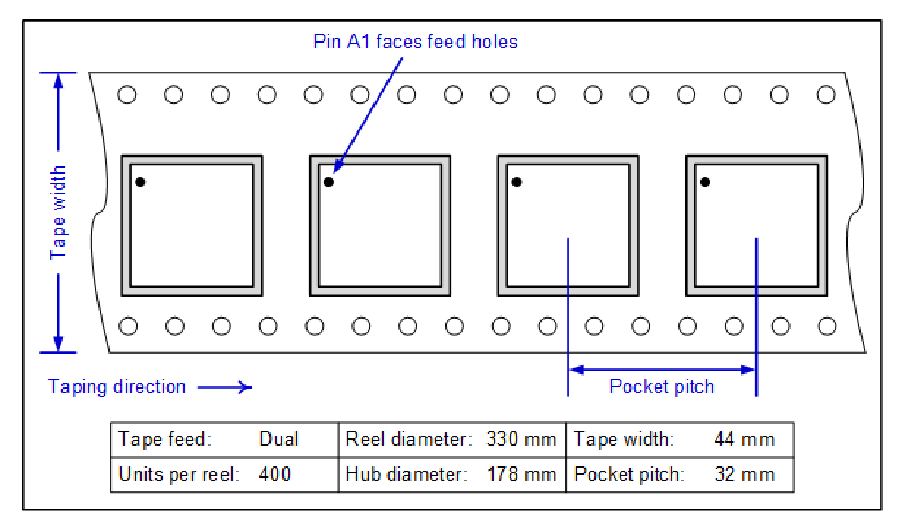
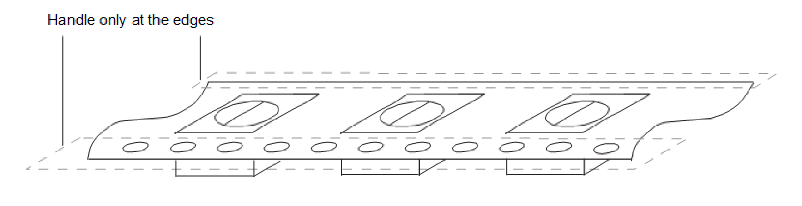
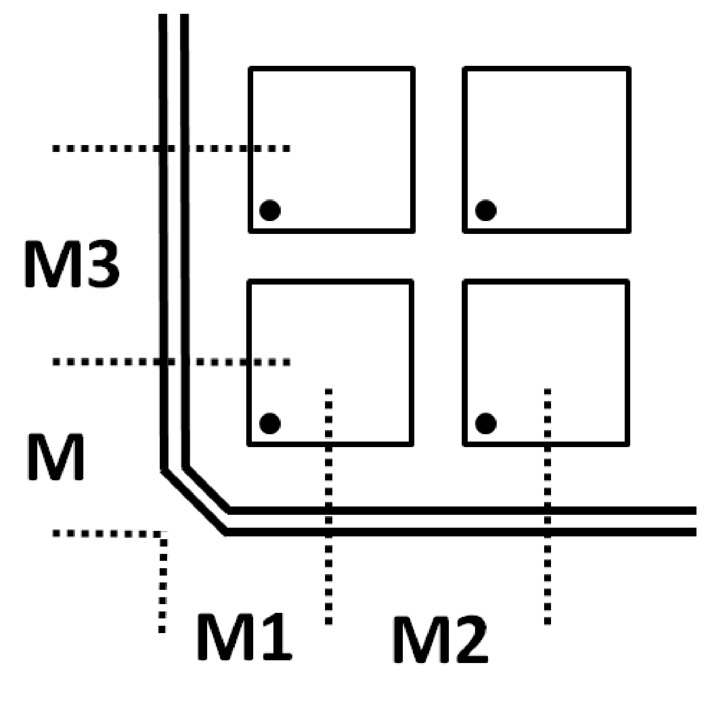

[← Contents](../README.md)

# 5 Carrier, handling, and storage information

## 5.1 Tape and reel information

All QTI tape carrier systems conform to EIA-481 standards. A simplified sketch of the QCS9075 tape carrier is shown in the following figure including the proper part orientation, maximum number of devices per reel, and key dimensions

*QCS9075 tape carrier*

*Simplified sketch of the QCS9075 tape carrier.
Callouts:* “Pin A1 faces feed holes”, “Tape width”, “Taping direction”, “Pocket pitch”.
*Data table printed inside the figure:*

| | | | |
|---|---|---|---|
| Tape feed: | Dual | Reel diameter: | 330 mm |
| Units per reel: | 400 | Hub diameter: | 178 mm |
| Tape width: | 44 mm | Pocket pitch: | 32 mm |

Tape-handling recommendations are shown in the following figure.

*Tape-handling recommendation*

*Tape-handling recommendation sketch, labelled* “Handle only at the edges”.

## 5.2 Matrix tray information

All QTI matrix tray carriers confirm to JEDEC standards.

The device pin 1 is oriented to the chamfered corner of the matrix tray.

All matrix tray media is available for sampling only. Production is supported on tape and reel.

**Table 5-1  Matrix tray approved sources of supply**

| **Key dimensions (mm)** |  |
|---|---|
| Array | 4 × 11 (44) |
| M | 26.70 |
| M1 | 20.00 |
| M2 | 27.50 |
| M3 | 27.50 |

*Matrix tray*

*Matrix tray sketch showing the device pockets and the tray key dimensions
M, M1, M2 and M3 (values are listed in Table 5‑1).*

## 5.3 Storage

### 5.3.1 Bagged storage conditions

QCS9075 devices delivered in tape and reel carriers must be stored in sealed, moisture barrier, anti-static bags. See [IC Products Packing Method (80-VK055-1)](https://docs.qualcomm.com/bundle/80-VK055-1/resource/80-VK055-1.pdf) for the expected shelf life.

### 5.3.2 Out-of-bag duration

The out-of-bag duration is the time a device can be on the factory floor before being installed onto a PCB. It is defined by the device MSL rating, as described in Section 4.5.

## 5.4 Handling

Tape handling was described in Section 5.1. Other (IC-specific) handling guidelines are presented in the following subsections.

### 5.4.1 Baking

It is not necessary to bake the QCS9075 if the conditions specified in Section 5.3.1 and Section 5.3.2 have not been exceeded.

It is necessary to bake the QCS9075 if any condition specified in Section 5.3.1 or Section 5.3.2 has been exceeded. The baking conditions are specified on the moisture-sensitive caution label attached to each bag; see the [IC](https://docs.qualcomm.com/bundle/80-VK055-1/resource/80-VK055-1.pdf)[Products Packing Method (80-VK055-1)](https://docs.qualcomm.com/bundle/80-VK055-1/resource/80-VK055-1.pdf) document for details.

CAUTION: If baking is required, the devices must be transferred into trays that can be baked to at least 125°C for 24 hours. Devices should not be baked in tape and reel carriers at any temperature.

### 5.4.2 Electrostatic discharge

Electrostatic discharge (ESD) occurs naturally in laboratory and factory environments. An established high-voltage potential is always at risk of discharging to a lower potential. If this discharge path is through a semiconductor device, destructive damage may result.

ESD counter measures and handling methods must be developed and used to control the factory environment at each manufacturing site.

QTI products must be handled according to the ESD Association standard: ANSI/ESD S20.20-1999, *Protection of* *Electrical and Electronic Parts, Assemblies, and Equipment*

See Reliability qualifications summary for the QCS9075 ESD ratings.

## 5.5 Bar code label and packing for shipment

See the [IC Products Packing Method (80-VK055-1)](https://docs.qualcomm.com/bundle/80-VK055-1/resource/80-VK055-1.pdf) document for all packing-related information, including bar code label details.
