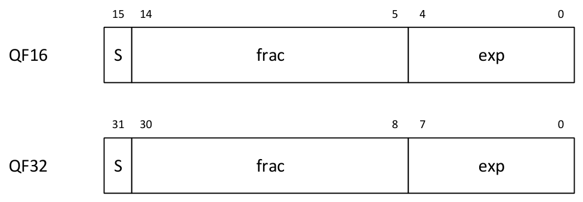

# 5 Vector instructions

This chapter provides an overview of the HVX load/store instructions, compute instructions, VLIW packet rules, dependency, and scheduling rules.

Section 5.8 gives a summary of Hexagon slot, HVX resource, and instruction latency for the instruction categories.

## 5.1 VLIW packing rules

HVX provides the following resources for vector instruction execution:

- load
- store
- shift
- permute
- two multiply

Each HVX instruction consumes some combination of these resources, as defined in section 5.1.2. VLIW packets cannot oversubscribe resources.

An instruction packet can contain up to four instructions, plus an end loop. The instructions inside the packet must obey the packet grouping rules described in section 5.1.3.

NOTE: The assembler should check and flag invalid packet combinations. When an invalid packet executes, the behavior is undefined.

### 5.1.1 Double vector instructions

Certain instructions consume a pair of resources, either both the shift and permute as a pair or both multiply resources as another pair. Such instructions are referred to as double vector instructions because they use two vector compute resources.

Halfword by halfword multiplies are double vector instructions, because they consume both the multiply resources.

### 5.1.2 Vector instruction resource usage

Table 5-1 summarizes the resources that an HVX instruction uses during execution. It also specifies the order in which the Hexagon assembler tries to build an instruction packet from the most to least stringent.

**Table 5-1  HVX execution resource usage**

| Instruction | Used resources |
|---|---|
| Histogram | All |
| Unaligned memory access | Load, store, and permute |
| Double vector cross-lane permute | Permute and shift |
| Cross-lane permute | Permute |
| Shift | Shift |
| Double vector & halfword multiplies | Both multiply |
| Single vector | Either multiply |
| Double vector ALU operation | Either shift and permute or both multiply |
| Single vector ALU operation | Shift, permute, or multiply |
| Aligned memory | Shift, permute, or multiply and one of load or store |
| Aligned memory (.tmp/.new) | Load or store only |
| Scatter (single vector indexing) | Store and one of shift, permute, or multiply |
| Scatter (double vector indexing) | Store and either shift and permute or both multiply |
| Gather (single vector indexing) | Load and one of shift, permute, or multiply |
| Gather (double vector indexing) | Load and either shift and permute or both multiply |

### 5.1.3 Vector instruction

Vector instructions map to certain Hexagon slots. A special subset of ALU instructions that require either the full 32 bits of the scalar Rt register (or 64 bits of Rtt) map to slots 2 and 3. These instructions include lookup table, splat, insert, and addition/subtraction with Rt.

**Table 5-2  HVX instruction to Hexagon slots mapping**

| Instruction | Used Hexagon slots | Additional restrictions |
|---|---|---|
| Aligned memory load | 0 or 1 |  |
| Aligned memory store | 0 |  |
| Unaligned memory load/store | 0 | Slot 1 must be empty. Maximum of three instructions allowed in the packet. |
| Scatter | 0 |  |
| Gather | 1 | .new store in slot 0 |
| Vextract | - | Only instruction in packet |
| Histogram | 0, 1, 2, or 3 | .tmp load in same packet |
| Multiplies | 2 or 3 | - |
| Using full 32-64 bit R | 2 or 3 | - |
| Simple ALU, permute, shift | 0, 1, 2, or 3 | - |

## 5.2 Vector load/store

VMEM instructions move data between VRF and memory. VMEM instructions support the following addressing modes.

- Indirect
- Indirect with offset
- Indirect with auto-increment (immediate and register/modifier register)

For example:

```
V2 = vmem(R1+#4) // Address R1 + 4 * (vector-size) bytes
V2 = vmem(R1++M1)// Address R1, post-modify by the value of M1
```

The immediate increment and post increments values are vector counts. So the byte offset is in multiples of the vector length.

To facilitate unaligned memory access, unaligned load and stores are available. The VMEMU instructions generate multiple accesses to the L2 cache and use the permute network to align the data.

The load-temp and load-current forms allow immediate use of load data within the same packet. A load-temp instruction does not write the load data into the register file. A register must be specified, but it is not overwritten. Because the load-temp instruction does not write to the register file, it does not consume a vector ALU resource.

A load-temp destination register cannot be an accumulator register within the packet. The behavior is considered undefined.

```
{V2.tmp = vmem(R1+#1)// Data loaded into a tmp
   V5:4.ub = vadd(V3.ub, V2.ub) // Use loaded data as V2 source
   V7:6.uw = vrmpy(V5:4.ub, R5.ub, #0)
}
```

Load-current is similar to load-temp, but consumes a vector ALU resource as the loaded data writes to the register file.

|  |  |
|---|---|
| `{V2.cur = vmem(R1+#1)` | `// Data loaded into a V2` |
| `V3 = valign(V1,V2, R4)` | `// Load data used immediately` |

```
   V7:6.ub = vrmpy(V5:4.ub, R5.ub,#0)
}
```

VMEM store instructions can store a newly generated value. They do not consume a vector ALU resource, as they do not read nor write the register file.

The register used for the new value VMEM store is encoded in a field in the store instruction. The store is always slot 0, and scalar instructions are skipped when counting the offset. Bit 0 corresponds to either the even (0) or odd (1) register of the pair.

```
vmem(R1+#1)= V20.new // Store V20 generated in the current packet
```

An entire VMEM write can also be suppressed by a scalar predicate.

```
if P0 vmem(R1++M1) = V20 // Store V20 if P0 is true
```

A vector predicate register can issue and control a partial byte-enabled store.

```
if Q0 vmem(R1++M1) = V20 // Store bytes of V20 where Q0 is true
```

## 5.3 Scatter and gather

Unlike vector loads and stores that access contiguous vectors in memory, scatter and gather allow for noncontiguous memory access of vector data. With scatter and gather, each element can independently index into a region of memory. This allows for applications that otherwise do not map well to the SIMD parallelism that HVX provides.

A scatter transfers data from a contiguous vector to noncontiguous memory locations. Similarly, gather transfers data from noncontiguous memory locations to a contiguous vector. In HVX, scatter is a vector register to noncontiguous memory transfer and gather is a noncontiguous memory to contiguous memory transfer. Additionally, HVX supports scatter-accumulate instructions that atomically add.

To maximize performance and efficiency, the scatter and gather instructions define a bounded region that must contain noncontiguous accesses. This region must be within VTCM (scatter/gather capable) and be within one translatable page. A vector specifies offsets from the base of the region for each element access. Table 5-3 lists the three sources that specify the noncontiguous accesses of a scatter or gather:

**Table 5-3  Sources for noncontiguous accesses: (Rt, Mu, Vv)**

| Source | Meaning |
|---|---|
| Rt | Base address of the region |
| Mu | Byte offset of last valid byte of the region (for example, region size - 1) |
| Vv or Vvv | Vector of byte offsets for the accesses. Double-vector is used when the offset width is double the data width |

To form an HVX gather (memory to memory), vgather is paired with a vector store to specify the destination address. A scatter is specified with a single instruction. Ignoring element sizes, Table 5-4 describes the basic forms of scatter and gather instructions:

**Table 5-4  Basic scatter and gather instructions**

| Instruction | Behavior |
|---|---|
| `vscatter(Rt,Mu,Vv)=Vw` | Write data in Vw to noncontiguous addresses specified by (Rt,Mu,Vv) |
| `vscatter(Rt,Mu,Vv)+=Vw` | Atomically add data in Vw to noncontiguous addresses specified by (Rt,Mu,Vv) |
| `{`<br>`vtmp=vgather(Rt,Mu,Vv);`<br>`vmem(Addr)=vtmp.new`<br>`}` | Read data from noncontiguous addresses specified by (Rt,Mu,Vv) and write the data contiguously to the aligned address |

## 5.4 Memory instruction slot combinations

VMEM load/store instructions and scatter/gather instructions can be grouped with normal scalar load/store instructions.

Table 5-5 provides the valid grouping combinations for HVX memory instructions. A combination that is not present in the table is invalid, and should be rejected by the assembler. The hardware generates an invalid packet error exception.

**Table 5-5  Valid VMEM load/store and scatter/gather combinations**

| Slot 0 instruction | Slot 1 instruction |
|---|---|
| VMEM Ld | Nonmemory |
| VMEM St | Nonmemory |
| VMEM Ld | Scalar Ld |
| Scalar St | VMEM Ld |
| Scalar Ld | VMEM Ld |
| VMEM St | Scalar St |
| VMEM St | Scalar Ld |
| VMEM St | VMEM Ld |
| VMEMU Ld | Empty |
| VMEMU St | Empty |
| .new VMEM St | Gather |
| Scatter | Nonmemory |
| Scatter | Scalar St |
| Scatter | Scalar Ld |
| Scatter | VMEM Ld |

## 5.5 Special instructions

### 5.5.1 Histogram

HVX contains a specialized histogram instruction. The vector register file divides into four histogram tables each of 256 entries (32 registers by 8 halfwords). A temporary VMEM load instruction fetches a line from memory. The top five bits of each byte provide a register select, and the bottom bits provide an element index. The value of the element in the register file is incremented. The programmer must clear the registers before use.

Example:

```
{ V31.tmp VMEM(R2) // Load a vector of data from memory.
   VHIST();         // Perform histogram using counters in VRF and indexes
                    // from temp load.
}
```

## 5.6 Qfloat

The Qfloat floating point format offers similar dynamic range and precision to that of IEEE-754. There are significant differences, as Qfloat is more hardware efficient.



```text
15 14 5 4 0
QF16 S frac exp
31 30 8 7 0
QF32 S frac exp
```

**Figure 5-1  Qfloat format**

The QFloat format has the following properties:

- The fractional field is two’s complement fixed-point format.
- There is no implied MSB in the significand as there is in IEEE. The fractional field only encodes o.frac.
- Qfloat implements Von Neumann rounding, where the implied LSB of the fractional field is an implicit one.
- There is no concept of infinity or NaN. QFloat saturates to maximum exponent with maximum positive or minimum negative significand.
- The Qfloat format has one bit less of precision compared to IEEE for most algorithms.

**Table 5-6  Differences between IEEE and Qfloat**

| Features | IEEE - 754 | QFloat |
|---|---|---|
| Bits | 1 + exp + mantissa | 1 + mantissa + exp |
| Positive zero | Yes (sub-normal) | Rounded to +tiniest |
| Negative zero | Yes (sub-normal) | Rounded to -tiniest |
| Significant bits | Mantissa +1 | Mantissa + 1 (limited by round) |
| Subnormal/zero | W/exp = min | Un-normals natural |
| Infinity/NaN | W/exp = max | Saturated |
| Lg(max/min) | 2^E - 2 + M | 2^E+M |
| Unique finite values | (2^E-1) * 2^M – 1 | 2^E*2^M |
| Rounding | Nearest even | Neatest odd or odd-even |
| Use with QFloat | Input and conversion/storage | Compute |

QFloat instructions use the same shift and multiply resources as other HVX instructions.

### 5.6.1 QFloat best practices

Treat QFloat like an intermediate format where the input and output of an algorithm are in an IEEE format (single or half precision).

The QFloat instruction set supports IEEE float values as inputs on the vector operands. The intermediate computations of an algorithm are performed in native Qfloat. The final output is converted back to IEEE through explicit convert instructions before storing to memory.

Performing a normalization step prior to a multiply is beneficial when expecting massive cancellation in a prior addition or subtraction step.

## 5.7 Instruction latency

Latencies are implementation-defined and can change with future versions.

HVX packets execute over multiple clock cycles, but typically in a pipelined manner to issue and complete a packet on every context cycle. The contexts are time interleaved to share the hardware such that using all contexts might be required to reach peak compute bandwidth.

With a few exceptions (for example, histogram and extract), results of packets generate within a fixed time after execution starts. But, when the sources are required varies. Instructions that need more pipelining require early sources. Only HVX registers are early source registers. Early source operands include:

- Input to the multiplier. For example V3.h = vmpyh(V2.h, V4.h). V2 and V4 are multiplier inputs. For multiply instructions with accumulation, the accumulator is not considered an early source multiplier input.
- Input to shift/bit count instructions. Only the shifted or counted register is considered early source. Accumulators are not early sources.
- Input to permute instructions. Only permuted registers are considered early source (not an accumulator).
- Unaligned store data is an early source.

An early source register produced in the previous vector packet can incur an interlock stall. Software should strive to schedule an intervening packet between the producer and an early source consumer.

The following example shows interlock cases:

```
V8 = VADD(V0,V0)
```

|  |  |
|---|---|
| `V0 = VADD(V8,V9)` | `// No stall.` |
| `V1 = VMPY(V0,R0)` | `// Stall due to V0` |
| `V2 = VSUB(V2,V1)` | `// No stall on V1` |
| `V5:4 = VUNPACK(V2)` | `// Stall due to V2` |
| `V2 = VADD(V0,V4)` | `// No stall on V4` |

## 5.8 Slot/resource/latency summary

Table 5-7 summarizes the Hexagon slot, HVX resource, and latency requirements for HVX instruction types.

**Table 5-7  HVX slot/resource/latency summary**

| Category | Variation | Core slots – 3 | Core slots – 2 | Core slots – 1 | Core slots – 0 | Vector resources – ld | Vector resources – mpy | Vector resources – mpy | Vector resources – shift | Vector resources – xlane | Vector resources – st | Input<br>latency |
|---|---|---|---|---|---|---|---|---|---|---|---|---|
| ALU | 1 vector | any |  |  |  |  | any |  |  |  |  | 1 |
|  | 2 vectors | any |  |  |  |  | either pair |  |  |  |  | 1 |
|  | Rt | either | either |  |  |  | either | either |  |  |  | 1 |
| Abs-diff | 1 vector | either | either |  |  |  | either | either |  |  |  | 2 |
|  | 2 vector | either | either |  |  |  |  |  |  |  |  | 2 |
| Multiply | by 8 bits; 1 vec | either | either |  |  |  | either | either |  |  |  | 2 |
|  | by 8 bits; 2 vec | either | either |  |  |  |  |  |  |  |  | 2 |
|  | by 16 bits | either | either |  |  |  |  |  |  |  |  | 2 |
| Cross-lane | 1 vector | any |  |  |  |  |  |  |  |  |  | 2 |
|  | 2 vectors | any |  |  |  |  |  |  |  |  |  | 2 |
| Shift or count | 1 vector | any |  |  |  |  |  |  |  |  |  | 2 |
| load | aligned |  |  | either | either |  | any |  |  |  |  | - |
|  | aligned; .tmp |  |  | either | either |  |  |  |  |  |  | - |
|  | aligned; .cur |  |  | either | either |  | any |  |  |  |  | - |
|  | unaligned |  |  |  |  |  |  |  |  |  |  | - |
| store | aligned |  |  |  |  |  | any |  |  |  |  | 1 |
|  | aligned; .new |  |  |  |  |  |  |  |  |  |  | 0 |
|  | unaligned |  |  |  |  |  |  |  |  |  |  | 2 |
| gather (needs<br>.new store) | 1 vector |  |  |  |  |  | any |  |  |  |  | 1 |
|  | 2 vector |  |  |  |  |  | either pair |  |  |  |  | 1 |
| scatter | 1 vector |  |  |  |  |  | any |  |  |  |  | 1 |
|  | 2 vector |  |  |  |  |  | either pair |  |  |  |  | 1 |
| histogram (needs .tmp load) | histogram (needs .tmp load) | any |  |  |  |  |  |  |  |  |  | 2 |
| extract |  |  |  |  |  |  |  |  |  |  |  | 1 |
