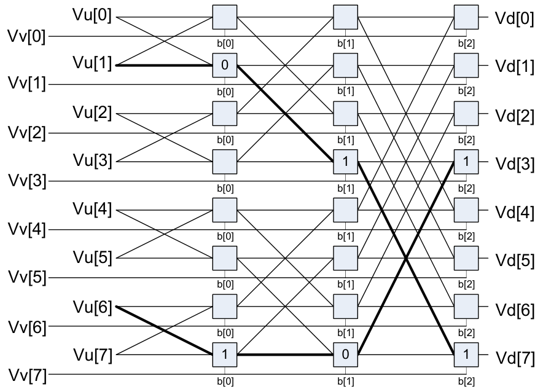
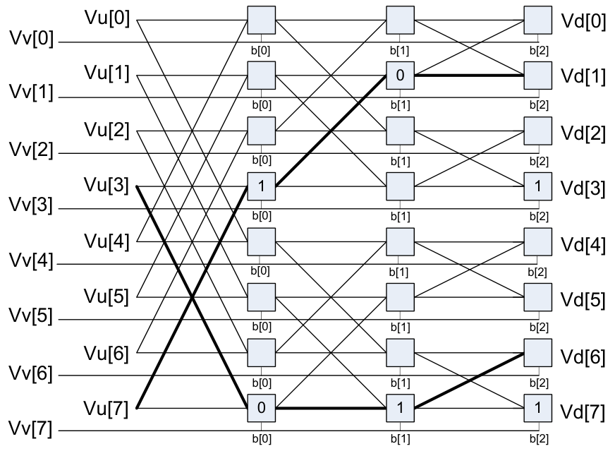

## 6.10 HVX PERMUTE-RESOURCE

The HVX PERMUTE-RESOURCE instruction subclass includes instructions that use the HVX

permute resource.

#### Byte alignment

Selects a continuous group of bytes the size of a vector register from vector registers Vu and Vv. The lower bits of Rt (modulo the vector length) or a 3-bit immediate value provide the starting location.

There are two forms of the operation, The first, `valign`, uses the Rt or immediate input directly to specify the beginning of the block. The second, `vlalign`, uses the inverse of the input value by subtracting it from the vector length.

The operation can implement a nonaligned vector load, using two aligned loads (above and below the pointer) and a `valign` where the pointer is the control input.

Vd=valign(Vu,Vv, Rt/u3)

|  |  |  |  |  |  |
|---|---|---|---|---|---|
| b[N-1] | ... | b[3] | b[2] | b[1] | b[0] |

Vub[N-1]...b[3]b[2]b[1]b[0] Vv

|  |  |  |  |  |  |
|---|---|---|---|---|---|
| b[N-1] | ... | b[3] | b[2] | b[1] | b[0] |

b[N-1]...b[3]b[2]b[1]b[0] Vu Vv

Starting byte = Rt (for example,. 2)

|  |  |  |  |  |  |
|---|---|---|---|---|---|
| b[N-1] | b[N-2] | b[N-3] | ... | b[1] | b[0] |

Vd

Vd=vlalign(Vu,Vv, Rt/u3)

|  |  |  |  |  |  |
|---|---|---|---|---|---|
| b[N-1] | b[N-2] | b[N-3] | ... | b[1] | b[0] |

Vub[N-1]b[N-2]b[N-3]...b[1]b[0] Vv

|  |  |  |  |  |  |
|---|---|---|---|---|---|
| b[N-1] | b[N-2] | b[N-3] | ... | b[1] | b[0] |

b[N-1]b[N-2]b[N-3]...b[1]b[0] Vu Vv

Starting byte = N-Rt (for example,. 2)

|  |  |  |  |  |  |
|---|---|---|---|---|---|
| b[N-1] | ... | b[3] | b[2] | b[1] | b[0] |

Vd

Perform a right rotate vector operation on vector register Vu, by the number of bytes specified by the lower bits of Rt. The result is written into Vd.

Byte[i] moves to Byte[(i + N - R) % N], where R is the right rotate amount in bytes, and N is the vector register size in bytes.

Rt indicates rotation amount in bytes (for

Vd = vror(Vu, Rt) example, 4)

|  |  |  |  |  |  |  |  |  |  |
|---|---|---|---|---|---|---|---|---|---|
| b[N-1] | b[N-2] | b[N-3] | ... | b[5] | b[4] | b[3] | b[2] | b[1] | b[0] |

Vu

|  |  |  |  |  |  |
|---|---|---|---|---|---|
|  |  |  |  |  |  |

|  |  |  |  |  |  |  |  |  |  |  |
|---|---|---|---|---|---|---|---|---|---|---|
| b[N-1] | b[N-2] | b[N-3] | b[N-4] | b[N-5] | b[N-4] | b[N-3] |  | ... | b[1] | b[0] |

Vd

| Syntax | Behavior |
|---|---|
| `Vd=valign(Vu,Vv,#u3)` | `for(i = 0; i < VWIDTH; i++) {`<br>`Vd.ub[i] = (i+#u>=VWIDTH) ? Vu.ub[i+#u-VWIDTH] : `<br>`Vv.ub[i+#u];`<br>`}` |
| `Vd=valign(Vu,Vv,Rt)` | `unsigned shift = Rt & (VWIDTH-1);`<br>`for(i = 0; i < VWIDTH; i++) {`<br>`Vd.ub[i] = (i+shift>=VWIDTH) ? Vu.ub[i+shift-VWIDTH] `<br>`: Vv.ub[i+shift];`<br>`}` |
| `Vd=vlalign(Vu,Vv,#u3)` | `unsigned shift = VWIDTH - #u;`<br>`for(i = 0; i < VWIDTH; i++) {`<br>`Vd.ub[i] = (i+shift>=VWIDTH) ? Vu.ub[i+shift-VWIDTH] `<br>`: Vv.ub[i+shift];`<br>`}` |
| `Vd=vlalign(Vu,Vv,Rt)` | `unsigned shift = VWIDTH - (Rt & (VWIDTH-1));`<br>`for(i = 0; i < VWIDTH; i++) {`<br>`Vd.ub[i] = (i+shift>=VWIDTH) ? Vu.ub[i+shift-VWIDTH] `<br>`: Vv.ub[i+shift];`<br>`}` |
| `Vd=vror(Vu,Rt)` | `for (k=0;k<VWIDTH;k++) {`<br>`Vd.ub[k] = Vu.ub[(k+Rt)&(VWIDTH-1)];`<br>`}` |

##### Class: COPROC_VX (slots 0,1,2,3)

##### Notes

- This instruction uses the HVX permute resource.
- Input scalar register Rt is limited to registers 0 through 7

##### Intrinsics

|  |  |
|---|---|
| `Vd=valign(Vu,Vv,#u3)` | `HVX_Vector Q6_V_valign_VVI(HVX_Vector Vu, HVX_Vector Vv, Word32 Iu3)` |
| `Vd=valign(Vu,Vv,Rt)` | `HVX_Vector Q6_V_valign_VVR(HVX_Vector Vu, HVX_Vector Vv, Word32 Rt)` |
| `Vd=vlalign(Vu,Vv,#u3)` | `HVX_Vector Q6_V_vlalign_VVI(HVX_Vector Vu, HVX_Vector Vv, Word32 Iu3)` |
| `Vd=vlalign(Vu,Vv,Rt)` | `HVX_Vector Q6_V_vlalign_VVR(HVX_Vector Vu, HVX_Vector Vv, Word32 Rt)` |
| `Vd=vror(Vu,Rt)` | `HVX_Vector Q6_V_vror_VR(HVX_Vector Vu, Word32 Rt)` |

##### Encoding

| 31 | 30 | 29 | 28 | 27 | 26 | 25 | 24 | 23 | 22 | 21 | 20 | 19 | 18 | 17 | 16 | 15 | 14 | 13 | 12 | 11 | 10 | 9 | 8 | 7 | 6 | 5 | 4 | 3 | 2 | 1 | 0 |  |
|---|---|---|---|---|---|---|---|---|---|---|---|---|---|---|---|---|---|---|---|---|---|---|---|---|---|---|---|---|---|---|---|---|
| ICLASS | ICLASS | ICLASS | ICLASS |  |  |  |  |  |  |  | t5 | t5 | t5 | t5 | t5 | Parse | Parse |  | u5 | u5 | u5 | u5 | u5 |  |  |  | d5 | d5 | d5 | d5 | d5 |  |
| 0 | 0 | 0 | 1 | 1 | 0 | 0 | 1 | 0 | 1 | 1 | t | t | t | t | t | P | P | 0 | u | u | u | u | u | 0 | 0 | 1 | d | d | d | d | d | Vd=vror(Vu,Rt) |
| ICLASS | ICLASS | ICLASS | ICLASS |  |  |  |  |  |  |  |  |  | t3 | t3 | t3 | Parse | Parse |  | u5 | u5 | u5 | u5 | u5 |  |  |  | d5 | d5 | d5 | d5 | d5 |  |
| 0 | 0 | 0 | 1 | 1 | 0 | 1 | 1 | v | v | v | v | v | t | t | t | P | P | 0 | u | u | u | u | u | 0 | 0 | 0 | d | d | d | d | d | Vd=valign(Vu,Vv,Rt) |
| 0 | 0 | 0 | 1 | 1 | 0 | 1 | 1 | v | v | v | v | v | t | t | t | P | P | 0 | u | u | u | u | u | 0 | 0 | 1 | d | d | d | d | d | Vd=vlalign(Vu,Vv,Rt) |
| ICLASS | ICLASS | ICLASS | ICLASS |  |  |  |  |  |  |  |  |  |  |  |  | Parse | Parse |  | u5 | u5 | u5 | u5 | u5 |  |  |  | d5 | d5 | d5 | d5 | d5 |  |
| 0 | 0 | 0 | 1 | 1 | 1 | 1 | 0 | 0 | 0 | 1 | v | v | v | v | v | P | P | 1 | u | u | u | u | u | i | i | i | d | d | d | d | d | Vd=valign(Vu,Vv,#u3) |
| 0 | 0 | 0 | 1 | 1 | 1 | 1 | 0 | 0 | 1 | 1 | v | v | v | v | v | P | P | 1 | u | u | u | u | u | i | i | i | d | d | d | d | d | Vd=vlalign(Vu,Vv,#u3) |

| Field name | Description |
|---|---|
| `ICLASS` | Instruction class |
| `Parse` | Packet/loop parse bits |
| `d5` | Field to encode register d |
| `t3` | Field to encode register t |
| `t5` | Field to encode register t |
| `u5` | Field to encode register u |
| `v2` | Field to encode register v |
| `v3` | Field to encode register v |
| `v5` | Field to encode register v |

#### General permute network

Perform permutation and rearrangement of the 64 input bytes, which is the width of a data slice. The input data passes through a network of switch boxes, which take two inputs and based on the two controls can pass through, swap, replicate the first input, or replicate the second input. The functionality is powerful, and the algorithms to compute the controls are complex.

The input vector of bytes passes through six levels of switches that have an increasing stride varying from 1 to 32 at the last stage. The following diagram shows the vrdelta network, the vdelta network is the mirror image, with the largest stride first followed by smaller strides down to 1. Each stage output is controlled by the control inputs in the vector register Vv. For each stage (for example stage 3), the bit at that position looks at the corresponding bit (bit 3) in the control byte. This is shown in the switch box in the diagram.

There are two main forms of data rearrangement. One uses a simple reverse butterfly network shown as vrdelta, and a butterfly network vdelta (shown in the following image). These are blocking networks, as not all possible paths are allowed simultaneously from input to output. The data does not have to be a permutation, defined as a one-to-one mapping of every input to its own output position. A subset of data rearrangement such as data replication can be accommodated. It can handle a family of patterns that have symmetric properties.

The following figure shows an example of such a valid pattern using an 8-element vrdelta network for clarity: 0,2,4,6,7,5,3,1.



```text
Vu[0] Vd[0]
Vv[0]
b[0] b[1] b[2]
Vu[1]₀ Vd[1]
Vv[1]
b[0] b[1] b[2]
Vu[2] Vd[2]
Vv[2]
b[0] b[1] b[2]
Vu[3] 1 1 Vd[3]
Vv[3]
b[0] b[1] b[2]
Vu[4] Vd[4]
Vv[4]b[0]b[1]b[2]
Vu[5] Vd[5]
Vv[5]b[0]b[1]b[2]
Vu[6] Vd[6]
Vv[6]b[0]b[1]b[2]
Vu[7]¹⁰¹ Vd[7]
Vv[7]b[0]b[1]b[2]
```



```text
Vu[0] Vd[0]
Vv[0]
b[0] b[1] b[2]
Vu[1]₀ Vd[1]
Vv[1]
b[0] b[1] b[2]
Vu[2] Vd[2]
Vv[2]
b[0] b[1] b[2]
Vu[3] 1 1 Vd[3]
Vv[3]
b[0] b[1] b[2]
Vu[4] Vd[4]
Vv[4]
b[0] b[1] b[2]
Vu[5] Vd[5]
Vv[5]
b[0] b[1] b[2]
Vu[6] Vd[6]
Vv[6]
b[0] b[1] b[2]
Vu[7]⁰¹¹ Vd[7]
Vv[7]
b[0] b[1] b[2]
```

The desired pattern 0,2,4,6,1,3,5,7 is not possible, as this overuses available paths in the trellis. The position of the output for a particular input is determined by using the bit sequence produced by the destination position D from source position S. The bit vector for the path through the trellis is a function of this destination bit sequence.

In the example D = 7, S = 1, the element in position 1 must move to position 7. The first switch box control bit at position 1 is 0, the next control bit at position 3 is 1, and finally the bit at position 7 is 1, yielding the sequence 0,1,1. Also, element 6 moves to position 3, with the control vector 1,0,1. Bits must be placed at the appropriate position in the control bytes to guide the inputs to the desired positions. Input can be placed into any output, but certain combinations conflict for resources, and so the rearrangement is not possible. A total of 512 control bits are required for a single vrdelta or vdelta slice.

Example of a permitted arrangement:

0,2,4,6,8,10,12,14,16,18,20,22,24,26,28,30,32,34,36,38,40,42,44,46,48,50,52,54,56,58,60,62,63, 61,59,57,55,53,51,49,47,45,43,41,39,37,35,33,31,29,27,25,23,21,19,17,15,13,11,9,7,5,3,1

Controls = {0x00,0x02,0x05,0x07,0x0A,0x08,0x0F,0x0D,0x14,0x16,0x11,0x13,0x1E,0x1C,0x1B,0x19,0x28,0x2 A,0x2D,0x2F,0x22,0x20,0x27,0x25,0x3C,0x3E,0x39,0x3B,0x36,0x34,0x33,0x31,0x10,0x12,0x15,0x 17,0x1A,0x18,0x1F,0x1D,0x04,0x06,0x01,0x03,0x0E,0x0C,0x0B,0x09,0x38,0x3A,0x3D,0x3F,0x32,0 x30,0x37,0x35,0x2C,0x2E,0x29,0x2B,0x26,0x24,0x23,0x21}

Similarly, the following is a function that replicates every 4th element: 0,0,0,0,4,4,4,4,8,8,8,8,12,12,12,12,16,16,16,16,20,20,20,20,24,24,24,24,28,28,28,28,32,32,32,32 ,36,36,36,36,40,40,40,40,44,44,44,44,48,48,48,48,52,52,52,52,56,56,56,56,60,60,60,60

Valid controls = {0x00,0x01,0x02,0x03,0x00,0x01,0x02,0x03,0x00,0x01,0x02,0x03,0x00,0x01,0x02,0x03,0x00,0x0 1,0x02,0x03,0x00,0x01,0x02,0x03,0x00,0x01,0x02,0x03,0x00,0x01,0x02,0x03,0x00,0x01,0x02,0x 03,0x00,0x01,0x02,0x03,0x00,0x01,0x02,0x03,0x00,0x01,0x02,0x03,0x00,0x01,0x02,0x03,0x00,0 x01,0x02,0x03,0x00,0x01,0x02,0x03,0x00,0x01,0x02,0x03}

The other general form of permute is a Benes network, which requires a vrdelta immediately followed by a vdelta operation. This form is nonblocking: it can accommdate any possible permute, however random, though it must be a permutation, each input must have a position in the output. Perform replication by using a pre- or post-conditioning vrdelta pass before or after the permute.

Implement element sizes larger than a byte by grouping bytes together and moving them to a group in the output.

An example of a general permute is the following random mix, where the 64 inputs are put in the following output positions:

33,42,40,61,28, 6,17,16,12,38,57,21,58,63,37,13,26,51,50,23,46, 5,52,53, 0,25,39, 7,10,19,18,56,44,41,11,14,43,45, 3,35,32,60,15,55,22,24,48, 9, 4,31,27, 8, 2,62,30,34,54,20,49,59,29,47,36

vrdelta controls ={0x00, 0x00, 0x21, 0x21, 0x20, 0x02, 0x00, 0x02, 0x20, 0x22, 0x00, 0x06, 0x23, 0x23, 0x02, 0x26, 0x06, 0x04, 0x2A, 0x0C, 0x2D, 0x2F, 0x20, 0x2E, 0x04, 0x00, 0x09, 0x29, 0x0C, 0x0A, 0x20, 0x0A, 0x05, 0x0F, 0x29, 0x2B, 0x2C, 0x0E, 0x11, 0x13, 0x31, 0x2F, 0x08, 0x0A, 0x2A, 0x3E, 0x02, 0x32, 0x0B, 0x07, 0x26, 0x0E, 0x2A, 0x2E, 0x36, 0x36, 0x1D, 0x07, 0x01, 0x2B, 0x0C, 0x1E, 0x21, 0x13}

vdelta controls={ 0x1D, 0x01, 0x00, 0x00, 0x1D, 0x1B, 0x00, 0x1A, 0x1E, 0x02, 0x13, 0x03, 0x0C, 0x18, 0x10, 0x08, 0x1A, 0x06, 0x07, 0x03, 0x11, 0x1D, 0x0D, 0x11, 0x19, 0x03, 0x15, 0x03, 0x03, 0x19, 0x1F, 0x01, 0x1B, 0x1B, 0x06, 0x12, 0x18, 0x00, 0x1D, 0x09, 0x1A, 0x0E, 0x02, 0x02, 0x0B, 0x05, 0x0A, 0x18, 0x1D, 0x1F, 0x01, 0x17, 0x14, 0x06, 0x19, 0x0F, 0x1D, 0x0D, 0x05, 0x01, 0x06, 0x06, 0x0F, 0x1B}

Use these applications to find vdelta/vrdelta controls for a Benes-type network or vrdelta only for a simple Delta network. For the Benes control, all outputs must be used. In the Delta network, X is a don't-care output and replication is allowed.

Vd = vrdelta(Vu,Vv) Vd = vdelta(Vu,Vv)

|  |  |  |  |  |
|---|---|---|---|---|
|  |  |  |  |  |
|  |  |  |  |  |
|  |  |  |  |  |
|  |  |  |  |  |
|  |  |  |  |  |
|  |  |  |  |  |
|  |  |  |  |  |
|  |  |  |  |  |
|  |  |  |  |  |
|  |  |  |  |  |
|  |  |  |  |  |
|  |  |  |  |  |
|  |  |  |  |  |
|  |  |  |  |  |
|  |  |  |  |  |
|  |  |  |  |  |
|  |  |  |  |  |
|  |  |  |  |  |
|  |  |  |  |  |
|  |  |  |  |  |
|  |  |  |  |  |
|  |  |  |  |  |
|  |  |  |  |  |
|  |  |  |  |  |
|  |  |  |  |  |
|  |  |  |  |  |
|  |  |  |  |  |
|  |  |  |  |  |
|  |  |  |  |  |
|  |  |  |  |  |
|  |  |  |  |  |

Vd

Vd Vu

Vu

|  |  |  |  |  |
|---|---|---|---|---|
|  |  |  |  |  |
|  |  |  |  |  |
|  |  |  |  |  |
|  |  |  |  |  |
|  |  |  |  |  |
|  |  |  |  |  |
|  |  |  |  |  |
|  |  |  |  |  |
|  |  |  |  |  |
|  |  |  |  |  |
|  |  |  |  |  |
|  |  |  |  |  |
|  |  |  |  |  |
|  |  |  |  |  |
|  |  |  |  |  |
|  |  |  |  |  |
|  |  |  |  |  |
|  |  |  |  |  |
|  |  |  |  |  |
|  |  |  |  |  |
|  |  |  |  |  |
|  |  |  |  |  |
|  |  |  |  |  |
|  |  |  |  |  |
|  |  |  |  |  |
|  |  |  |  |  |
|  |  |  |  |  |
|  |  |  |  |  |
|  |  |  |  |  |
|  |  |  |  |  |
|  |  |  |  |  |

Vd

Vd Vu

Vu

|  |  |  |  |  |
|---|---|---|---|---|
|  |  |  |  |  |
|  |  |  |  |  |
|  |  |  |  |  |
|  |  |  |  |  |
|  |  |  |  |  |
|  |  |  |  |  |
|  |  |  |  |  |
|  |  |  |  |  |
|  |  |  |  |  |
|  |  |  |  |  |
|  |  |  |  |  |
|  |  |  |  |  |
|  |  |  |  |  |
|  |  |  |  |  |
|  |  |  |  |  |
|  |  |  |  |  |
|  |  |  |  |  |
|  |  |  |  |  |
|  |  |  |  |  |
|  |  |  |  |  |
|  |  |  |  |  |
|  |  |  |  |  |
|  |  |  |  |  |
|  |  |  |  |  |
|  |  |  |  |  |
|  |  |  |  |  |
|  |  |  |  |  |
|  |  |  |  |  |
|  |  |  |  |  |
|  |  |  |  |  |

Example switch box

Vu.ub[i]0

Out[i]

1

|  |  |  |  |  |
|---|---|---|---|---|
|  |  |  |  |  |
|  |  |  |  |  |
|  |  |  |  |  |
|  |  |  |  |  |
|  |  |  |  |  |
|  |  |  |  |  |
|  |  |  |  |  |
|  |  |  |  |  |
|  |  |  |  |  |
|  |  |  |  |  |
|  |  |  |  |  |
|  |  |  |  |  |
|  |  |  |  |  |
|  |  |  |  |  |
|  |  |  |  |  |
|  |  |  |  |  |
|  |  |  |  |  |
|  |  |  |  |  |
|  |  |  |  |  |
|  |  |  |  |  |
|  |  |  |  |  |
|  |  |  |  |  |
|  |  |  |  |  |
|  |  |  |  |  |
|  |  |  |  |  |
|  |  |  |  |  |
|  |  |  |  |  |
|  |  |  |  |  |
|  |  |  |  |  |
|  |  |  |  |  |

Example switch box

Vu.ub[i]0

Out[i]

1

|  |  |
|---|---|
|  | 0<br>1 |
|  | 1<br>0 |

Vu.ub[i]

Out[i]

k Out[i+2ᵏ]

Vu.ub[i+2 ]

|  |  |
|---|---|
| Vv | k |
| VvVv.ub[i]&(1<<k)Vv.ub[i+2 | ]&(1<<k) |

| Syntax | Behavior |
|---|---|
| `Vd=vdelta(Vu,Vv)` | `for (offset=VWIDTH; (offset>>=1)>0; ) {`<br>`for (k = 0; k<VWIDTH; k++) {`<br>`Vd.ub[k] = (Vv.ub[k]&offset) ? Vu.ub[k^offset] : `<br>`Vu.ub[k];`<br>`}`<br>`for (k = 0; k<VWIDTH; k++) {`<br>`Vu.ub[k] = Vd.ub[k];`<br>`}`<br>`}` |
| `Vd=vrdelta(Vu,Vv)` | `for (offset=1; offset<VWIDTH; offset<<=1){`<br>`for (k = 0; k<VWIDTH; k++) {`<br>`Vd.ub[k] = (Vv.ub[k]&offset) ? Vu.ub[k^offset] : `<br>`Vu.ub[k];`<br>`}`<br>`for (k = 0; k<VWIDTH; k++) {`<br>`Vu.ub[k] = Vd.ub[k];`<br>`}`<br>`}` |

##### Class: COPROC_VX (slots 0,1,2,3)

##### Notes

- This instruction uses the HVX permute resource.

##### Intrinsics

|  |  |
|---|---|
| `Vd=vdelta(Vu,Vv)` | `HVX_Vector Q6_V_vdelta_VV(HVX_Vector Vu, HVX_Vector Vv)` |
| `Vd=vrdelta(Vu,Vv)` | `HVX_Vector Q6_V_vrdelta_VV(HVX_Vector Vu, HVX_Vector Vv)` |

##### Encoding

| 31 | 30 | 29 | 28 | 27 | 26 | 25 | 24 | 23 | 22 | 21 | 20 | 19 | 18 | 17 | 16 | 15 | 14 | 13 | 12 | 11 | 10 | 9 | 8 | 7 | 6 | 5 | 4 | 3 | 2 | 1 | 0 |  |
|---|---|---|---|---|---|---|---|---|---|---|---|---|---|---|---|---|---|---|---|---|---|---|---|---|---|---|---|---|---|---|---|---|
| ICLASS | ICLASS | ICLASS | ICLASS |  |  |  |  |  |  |  |  |  |  |  |  | Parse | Parse |  | u5 | u5 | u5 | u5 | u5 |  |  |  | d5 | d5 | d5 | d5 | d5 |  |
| 0 | 0 | 0 | 1 | 1 | 1 | 1 | 1 | 0 | 0 | 1 | v | v | v | v | v | P | P | 0 | u | u | u | u | u | 0 | 0 | 1 | d | d | d | d | d | Vd=vdelta(Vu,Vv) |
| 0 | 0 | 0 | 1 | 1 | 1 | 1 | 1 | 0 | 0 | 1 | v | v | v | v | v | P | P | 0 | u | u | u | u | u | 0 | 1 | 1 | d | d | d | d | d | Vd=vrdelta(Vu,Vv) |

| Field name | Description |
|---|---|
| `ICLASS` | Instruction class |
| `Parse` | Packet/loop parse bits |
| `d5` | Field to encode register d |
| `u5` | Field to encode register u |
| `v5` | Field to encode register v |

#### Shuffle deal

Deal or deinterleave the elements into the destination register Vd. Even elements of Vu are placed in the lower half of Vd, and odd elements are placed in the upper half.

For `vdeale`, the even elements of Vv are dealt into the lower half of the destination vector register Vd, and the even elements of Vu are dealt into the upper half of Vd. The deal operation takes even-even elements of Vv and places them in the lower quarter of Vd, while odd-even elements of Vv are placed in the second quarter of Vd. Similarly, even-even elements of Vu are placed in the third quarter of Vd, while odd-even elements of Vu are placed in the fourth quarter of Vd.

Vd.h=vdeal(Vu.h)

|  |  |  |  |  |  |  |  |
|---|---|---|---|---|---|---|---|
| [N-1] | [N-2] | ... | [4] | [3] | [2] | [1] | [0] |

Vu

|  |  |  |  |  |
|---|---|---|---|---|
|  |  |  |  |  |

|  |  |  |  |  |  |  |  |
|---|---|---|---|---|---|---|---|
| [N-1] | ... | [N/2+2] | [N/2] | [N/2-1] | [2] | [1] | [0] |

Vd

Vd.b=vdeale(Vu.b, Vv.b)

|  |  |  |  |  |  |  |  |  |  |  |  |
|---|---|---|---|---|---|---|---|---|---|---|---|
| ... | [10] | [9] | [8] | [7] | [6] | [5] | [4] | [3] | [2] | [1] | [0] |

Vu ...[10][9][8][7][6][5][4][3][2][1][0]Vv

|  |  |  |  |  |  |  |  |  |  |  |  |
|---|---|---|---|---|---|---|---|---|---|---|---|
| ... | [10] | [9] | [8] | [7] | [6] | [5] | [4] | [3] | [2] | [1] | [0] |

...[10][9][8][7][6][5][4][3][2][1][0]VuVv

|  |  |  |
|---|---|---|
|  |  |  |

|  |  |  |  |  |
|---|---|---|---|---|
|  |  |  |  |  |

|  |  |  |  |  |  |  |  |  |  |  |  |  |  |  |  |
|---|---|---|---|---|---|---|---|---|---|---|---|---|---|---|---|
| ... | [3N/4+2] | [3N/4+2] | [3N/4] | ... | [N/2+2] | [N/2+1] | [N/2] | ... | [N/4+2] | [N/4+1] | [N/4] | ... | [2] | [1] | [0] |

Vd

Shuffle elements within a vector. Elements from the same position - but in the upper half of the vector register - pack together in even and odd element pairs, and then placed in the destination vector register Vd.

Supports byte and halfword. Operates on a single register input, in a way similar to the vshuffoe operation.

Vd.b=vshuff(Vu.b)

|  |  |  |  |  |  |  |  |  |
|---|---|---|---|---|---|---|---|---|
| [N-1] | ... | [N/2+2] | [N/2+1] | [N/2] | [N/2-1] | [2] | [1] | [0] |

Vu

|  |  |  |
|---|---|---|
|  |  |  |

|  |  |  |  |  |  |  |  |  |
|---|---|---|---|---|---|---|---|---|
| [N-1] | [N-2] | ... | [5] | [4] | [3] | [2] | [1] | [0] |

Vd

*N is the number of element operations allowed in the vector

| Syntax | Behavior |
|---|---|
| `Vd.b=vdeal(Vu.b)` | `for (i = 0; i < VELEM(16); i++) {`<br>`Vd.ub[i ] = Vu.uh[i].ub[0];`<br>`Vd.ub[i+VBITS/16] = Vu.uh[i].ub[1];`<br>`}` |
| `Vd.b=vdeale(Vu.b,Vv.b)` | `for (i = 0; i < VELEM(32); i++) {`<br>`Vd.ub[0+i ] = Vv.uw[i].ub[0];`<br>`Vd.ub[VBITS/32+i ] = Vv.uw[i].ub[2];`<br>`Vd.ub[2*VBITS/32+i] = Vu.uw[i].ub[0];`<br>`Vd.ub[3*VBITS/32+i] = Vu.uw[i].ub[2];`<br>`}` |
| `Vd.b=vshuff(Vu.b)` | `for (i = 0; i < VELEM(16); i++) {`<br>`Vd.uh[i].b[0]=Vu.ub[i];`<br>`Vd.uh[i].b[1]=Vu.ub[i+VBITS/16];`<br>`}` |
| `Vd.h=vdeal(Vu.h)` | `for (i = 0; i < VELEM(32); i++) {`<br>`Vd.uh[i ] = Vu.uw[i].uh[0];`<br>`Vd.uh[i+VBITS/32] = Vu.uw[i].uh[1];`<br>`}` |
| `Vd.h=vshuff(Vu.h)` | `for (i = 0; i < VELEM(32); i++) {`<br>`Vd.uw[i].h[0]=Vu.uh[i];`<br>`Vd.uw[i].h[1]=Vu.uh[i+VBITS/32];`<br>`}` |

##### Class: COPROC_VX (slots 0,1,2,3)

##### Notes

- This instruction uses the HVX permute resource.

##### Intrinsics

|  |  |
|---|---|
| `Vd.b=vdeal(Vu.b)` | `HVX_Vector Q6_Vb_vdeal_Vb(HVX_Vector Vu)` |
| `Vd.b=vdeale(Vu.b,Vv.b)` | `HVX_Vector Q6_Vb_vdeale_VbVb(HVX_Vector Vu, HVX_Vector Vv)` |
| `Vd.b=vshuff(Vu.b)` | `HVX_Vector Q6_Vb_vshuff_Vb(HVX_Vector Vu)` |
| `Vd.h=vdeal(Vu.h)` | `HVX_Vector Q6_Vh_vdeal_Vh(HVX_Vector Vu)` |
| `Vd.h=vshuff(Vu.h)` | `HVX_Vector Q6_Vh_vshuff_Vh(HVX_Vector Vu)` |

##### Encoding

| 31 | 30 | 29 | 28 | 27 | 26 | 25 | 24 | 23 | 22 | 21 | 20 | 19 | 18 | 17 | 16 | 15 | 14 | 13 | 12 | 11 | 10 | 9 | 8 | 7 | 6 | 5 | 4 | 3 | 2 | 1 | 0 |  |
|---|---|---|---|---|---|---|---|---|---|---|---|---|---|---|---|---|---|---|---|---|---|---|---|---|---|---|---|---|---|---|---|---|
| ICLASS | ICLASS | ICLASS | ICLASS |  |  |  |  |  |  |  |  |  |  |  |  | Parse | Parse |  | u5 | u5 | u5 | u5 | u5 |  |  |  | d5 | d5 | d5 | d5 | d5 |  |
| 0 | 0 | 0 | 1 | 1 | 1 | 1 | 0 | - | - | 0 | - | - | - | 0 | 0 | P | P | 0 | u | u | u | u | u | 1 | 1 | 0 | d | d | d | d | d | Vd.h=vdeal(Vu.h) |
| 0 | 0 | 0 | 1 | 1 | 1 | 1 | 0 | - | - | 0 | - | - | - | 0 | 0 | P | P | 0 | u | u | u | u | u | 1 | 1 | 1 | d | d | d | d | d | Vd.b=vdeal(Vu.b) |
| 0 | 0 | 0 | 1 | 1 | 1 | 1 | 0 | - | - | 0 | - | - | - | 0 | 1 | P | P | 0 | u | u | u | u | u | 1 | 1 | 1 | d | d | d | d | d | Vd.h=vshuff(Vu.h) |
| 0 | 0 | 0 | 1 | 1 | 1 | 1 | 0 | - | - | 0 | - | - | - | 1 | 0 | P | P | 0 | u | u | u | u | u | 0 | 0 | 0 | d | d | d | d | d | Vd.b=vshuff(Vu.b) |
| 0 | 0 | 0 | 1 | 1 | 1 | 1 | 1 | 0 | 0 | 1 | v | v | v | v | v | P | P | 0 | u | u | u | u | u | 1 | 1 | 1 | d | d | d | d | d | Vd.b=vdeale(Vu.b,Vv.b) |

| Field name | Description |
|---|---|
| `ICLASS` | Instruction class |
| `Parse` | Packet/loop parse bits |
| `d5` | Field to encode register d |
| `u5` | Field to encode register u |
| `v5` | Field to encode register v |

#### Pack

The `vpack `operation has three forms that pack elements from the vector registers Vu and Vv into the destination vector register Vd.

The `vpacke` operation writes even elements from Vv and Vu into the lower half and upper half of Vd respectively.

The `vpacko` operation writes odd elements from Vv and Vu into the lower half and upper half of Vd respectively.

The `vpack` operation takes elements from Vv and Vu, saturates them to the next smallest element size, and writes them into Vd. Vd.b=vpacke(Vu.h,Vv.h)

|  |  |  |  |  |  |  |
|---|---|---|---|---|---|---|
| [N-1] | [N-2] | …. | [3] | [2] | [1] | [0] |

Vv

|  |  |  |  |  |  |  |  |  |  |  |  |  |
|---|---|---|---|---|---|---|---|---|---|---|---|---|
|  |  |  |  |  |  |  |  |  |  |  |  |  |
| [N-1] | [N-1] | [N-2] | [N-2] | ... |  |  | [3] | [2] | [2] | [1] | [0] | [0] |
|  |  |  |  |  |  |  |  |  |  |  |  |  |

Vu

|  |  |  |  |  |  |  |  |
|---|---|---|---|---|---|---|---|
| [N-1] | ... | [N/2+1] | [N/2] | [N/2-1] | ... | [1] | [0] |

Vd

Vd.b=vpacko(Vu.h,Vv.h)

|  |  |  |  |  |  |  |
|---|---|---|---|---|---|---|
| [N-1] | [N-2] | …. | [3] | [2] | [1] | [0] |

Vv

|  |  |  |  |  |  |  |  |  |  |  |  |
|---|---|---|---|---|---|---|---|---|---|---|---|
|  |  |  |  |  |  |  |  |  |  |  |  |
| [N-1] | [N-1] | [N-2] | ... |  |  | [3] | [3] | [2] | [1] | [1] | [0] |
|  |  |  |  |  |  |  |  |  |  |  |  |

Vu

|  |  |  |  |  |  |  |  |
|---|---|---|---|---|---|---|---|
| [N-1] | ... | [N/2+1] | [N/2] | [N/2-1] | ... | [1] | [0] |

Vd

Vd.b=vpack(Vu.h,Vv.h):sat

|  |  |  |  |
|---|---|---|---|
| [N/2-1] | ... | [1] | [0] |

Vu[N/2-1]….[1][0] Vv

|  |  |  |  |
|---|---|---|---|
| [N/2-1] | …. | [1] | [0] |

[N/2-1]...[1][0] Vu Vv

sat sat sat sat sat sat

|  |  |  |  |  |  |  |  |
|---|---|---|---|---|---|---|---|
| [N-1] | ... | [N/2+1] | [N/2] | [N/2-1] | ... | [1] | [0] |

Vd

| Syntax | Behavior |
|---|---|
| `Vd.b=vpack(Vu.h,Vv.h):sat` | `for (i = 0; i < VELEM(16); i++) {`<br>`Vd.b[i] = sat₈(Vv.h[i]);`<br>`Vd.b[i+VBITS/16] = sat₈(Vu.h[i]);`<br>`}` |
| `Vd.b=vpacke(Vu.h,Vv.h)` | `for (i = 0; i < VELEM(16); i++) {`<br>`Vd.ub[i] = Vv.uh[i].ub[0];`<br>`Vd.ub[i+VBITS/16] = Vu.uh[i].ub[0];`<br>`}` |
| `Vd.b=vpacko(Vu.h,Vv.h)` | `for (i = 0; i < VELEM(16); i++) {`<br>`Vd.ub[i] = Vv.uh[i].ub[1];`<br>`Vd.ub[i+VBITS/16] = Vu.uh[i].ub[1];`<br>`}` |
| `Vd.h=vpack(Vu.w,Vv.w):sat` | `for (i = 0; i < VELEM(32); i++) {`<br>`Vd.h[i] = sat₁₆(Vv.w[i]);`<br>`Vd.h[i+VBITS/32] = sat₁₆(Vu.w[i]);`<br>`}` |
| `Vd.h=vpacke(Vu.w,Vv.w)` | `for (i = 0; i < VELEM(32); i++) {`<br>`Vd.uh[i] = Vv.uw[i].uh[0];`<br>`Vd.uh[i+VBITS/32] = Vu.uw[i].uh[0];`<br>`}` |
| `Vd.h=vpacko(Vu.w,Vv.w)` | `for (i = 0; i < VELEM(32); i++) {`<br>`Vd.uh[i] = Vv.uw[i].uh[1];`<br>`Vd.uh[i+VBITS/32] = Vu.uw[i].uh[1];`<br>`}` |
| `Vd.ub=vpack(Vu.h,Vv.h):sat` | `for (i = 0; i < VELEM(16); i++) {`<br>`Vd.ub[i] = usat₈(Vv.h[i]);`<br>`Vd.ub[i+VBITS/16] = usat₈(Vu.h[i]);`<br>`}` |
| `Vd.uh=vpack(Vu.w,Vv.w):sat` | `for (i = 0; i < VELEM(32); i++) {`<br>`Vd.uh[i] = usat₁₆(Vv.w[i]);`<br>`Vd.uh[i+VBITS/32] = usat₁₆(Vu.w[i]);`<br>`}` |

##### Class: COPROC_VX (slots 0,1,2,3)

##### Notes

- This instruction uses the HVX permute resource.

##### Intrinsics

|  |  |
|---|---|
| `Vd.b=vpack(Vu.h,Vv.h):sat` | `HVX_Vector Q6_Vb_vpack_VhVh_sat(HVX_Vector Vu, HVX_Vector Vv)` |
| `Vd.b=vpacke(Vu.h,Vv.h)` | `HVX_Vector Q6_Vb_vpacke_VhVh(HVX_Vector Vu, HVX_Vector Vv)` |
| `Vd.b=vpacko(Vu.h,Vv.h)` | `HVX_Vector Q6_Vb_vpacko_VhVh(HVX_Vector Vu, HVX_Vector Vv)` |
| `Vd.h=vpack(Vu.w,Vv.w):sat` | `HVX_Vector Q6_Vh_vpack_VwVw_sat(HVX_Vector Vu, HVX_Vector Vv)` |
| `Vd.h=vpacke(Vu.w,Vv.w)` | `HVX_Vector Q6_Vh_vpacke_VwVw(HVX_Vector Vu, HVX_Vector Vv)` |
| `Vd.h=vpacko(Vu.w,Vv.w)` | `HVX_Vector Q6_Vh_vpacko_VwVw(HVX_Vector Vu, HVX_Vector Vv)` |
| `Vd.ub=vpack(Vu.h,Vv.h):sat` | `HVX_Vector Q6_Vub_vpack_VhVh_sat(HVX_Vector Vu, HVX_Vector Vv)` |
| `Vd.uh=vpack(Vu.w,Vv.w):sat` | `HVX_Vector Q6_Vuh_vpack_VwVw_sat(HVX_Vector Vu, HVX_Vector Vv)` |

##### Encoding

| 31 | 30 | 29 | 28 | 27 | 26 | 25 | 24 | 23 | 22 | 21 | 20 | 19 | 18 | 17 | 16 | 15 | 14 | 13 | 12 | 11 | 10 | 9 | 8 | 7 | 6 | 5 | 4 | 3 | 2 | 1 | 0 |  |
|---|---|---|---|---|---|---|---|---|---|---|---|---|---|---|---|---|---|---|---|---|---|---|---|---|---|---|---|---|---|---|---|---|
| ICLASS | ICLASS | ICLASS | ICLASS |  |  |  |  |  |  |  |  |  |  |  |  | Parse | Parse |  | u5 | u5 | u5 | u5 | u5 |  |  |  | d5 | d5 | d5 | d5 | d5 |  |
| 0 | 0 | 0 | 1 | 1 | 1 | 1 | 1 | 1 | 1 | 0 | v | v | v | v | v | P | P | 0 | u | u | u | u | u | 0 | 1 | 0 | d | d | d | d | d | Vd.b=vpacke(Vu.h,Vv.h) |
| 0 | 0 | 0 | 1 | 1 | 1 | 1 | 1 | 1 | 1 | 0 | v | v | v | v | v | P | P | 0 | u | u | u | u | u | 0 | 1 | 1 | d | d | d | d | d | Vd.h=vpacke(Vu.w,Vv.w) |
| 0 | 0 | 0 | 1 | 1 | 1 | 1 | 1 | 1 | 1 | 0 | v | v | v | v | v | P | P | 0 | u | u | u | u | u | 1 | 0 | 1 | d | d | d | d | d | Vd.ub=vpack(Vu.h,Vv.h):sat |
| 0 | 0 | 0 | 1 | 1 | 1 | 1 | 1 | 1 | 1 | 0 | v | v | v | v | v | P | P | 0 | u | u | u | u | u | 1 | 1 | 0 | d | d | d | d | d | Vd.b=vpack(Vu.h,Vv.h):sat |
| 0 | 0 | 0 | 1 | 1 | 1 | 1 | 1 | 1 | 1 | 0 | v | v | v | v | v | P | P | 0 | u | u | u | u | u | 1 | 1 | 1 | d | d | d | d | d | Vd.uh=vpack(Vu.w,Vv.w):sat |
| 0 | 0 | 0 | 1 | 1 | 1 | 1 | 1 | 1 | 1 | 1 | v | v | v | v | v | P | P | 0 | u | u | u | u | u | 0 | 0 | 0 | d | d | d | d | d | Vd.h=vpack(Vu.w,Vv.w):sat |
| 0 | 0 | 0 | 1 | 1 | 1 | 1 | 1 | 1 | 1 | 1 | v | v | v | v | v | P | P | 0 | u | u | u | u | u | 0 | 0 | 1 | d | d | d | d | d | Vd.b=vpacko(Vu.h,Vv.h) |
| 0 | 0 | 0 | 1 | 1 | 1 | 1 | 1 | 1 | 1 | 1 | v | v | v | v | v | P | P | 0 | u | u | u | u | u | 0 | 1 | 0 | d | d | d | d | d | Vd.h=vpacko(Vu.w,Vv.w) |

| Field name | Description |
|---|---|
| `ICLASS` | Instruction class |
| `Parse` | Packet/loop parse bits |
| `d5` | Field to encode register d |
| `u5` | Field to encode register u |
| `v5` | Field to encode register v |

#### Set predicate

Set a vector predicate register with a sequence of 1s based on the lower bits of the scalar register Rt.

Rt = 0x11: Qd4 = 0-----0011111111111111111b

Rt = 0x07: Qd4 = 0-----0000000000001111111b

The operation is element-size agnostic, and creates a mask to predicate an operation if it does not span a whole vector register width.

| Syntax | Behavior |
|---|---|
| `Qd4=vsetq(Rt)` | `for(i = 0; i < VWIDTH; i++) QdV[i]=(i < (Rt & (VWIDTH-1))) ? 1 `<br>`: 0;` |
| `Qd4=vsetq2(Rt)` | `for(i = 0; i < VWIDTH; i++) QdV[i]=(i <= ((Rt-1) & (VWIDTH-`<br>`1))) ? 1 : 0;` |

##### Class: COPROC_VX (slots 0,1,2,3)

##### Notes

- This instruction uses the HVX permute resource.

##### Intrinsics

|  |  |
|---|---|
| `Qd4=vsetq(Rt)` | `HVX_VectorPred Q6_Q_vsetq_R(Word32 Rt)` |
| `Qd4=vsetq2(Rt)` | `HVX_VectorPred Q6_Q_vsetq2_R(Word32 Rt)` |

##### Encoding

| 31 | 30 | 29 | 28 | 27 | 26 | 25 | 24 | 23 | 22 | 21 | 20 | 19 | 18 | 17 | 16 | 15 | 14 | 13 | 12 | 11 | 10 | 9 | 8 | 7 | 6 | 5 | 4 | 3 | 2 | 1 | 0 |  |
|---|---|---|---|---|---|---|---|---|---|---|---|---|---|---|---|---|---|---|---|---|---|---|---|---|---|---|---|---|---|---|---|---|
| ICLASS | ICLASS | ICLASS | ICLASS |  |  |  |  |  |  |  | t5 | t5 | t5 | t5 | t5 | Parse | Parse |  |  |  |  |  |  |  |  |  |  |  |  | d2 | d2 |  |
| 0 | 0 | 0 | 1 | 1 | 0 | 0 | 1 | 1 | 0 | 1 | t | t | t | t | t | P | P | 0 | - | - | - | - | - | 0 | 1 | 0 | - | 0 | 1 | d | d | Qd4=vsetq(Rt) |
| 0 | 0 | 0 | 1 | 1 | 0 | 0 | 1 | 1 | 0 | 1 | t | t | t | t | t | P | P | 0 | - | - | - | - | - | 0 | 1 | 0 | - | 1 | 1 | d | d | Qd4=vsetq2(Rt) |

| Field name | Description |
|---|---|
| `ICLASS` | Instruction class |
| `Parse` | Packet/loop parse bits |
| `d2` | Field to encode register d |
| `t5` | Field to encode register t |

#### Vector in-lane lookup table

The `vlut` instructions implement fast vectorized lookup-tables. The lookup table is contained in the Vv register while the indexes are held in Vu. Table elements are either 8-bit or 16-bit. An aggregation feature implements tables larger than 64 bytes in 64 byte mode and 128 bytes in 128 byte mode.

In both 64 and 128 byte modes, the maximum amount of lookup table accessible is 32 bytes for byte lookups (`vlut32`) and 16 half words in hwords lookup (`vlut16`).

##### 8-bit elements

For 64 byte mode, tables with 8-bit elements support 32 entry lookup tables using the `vlut32` instructions. The required entry is conditionally selected by using the lower five bits of the input byte for the respective output byte. A control input register, Rt, contains match and select bits. The lower three bits of Rt must match the upper three bits of the input byte index for the table entry to write to or OR with the destination vector register byte in Vd or Vx respectively. The LSB of Rt selects odd or even (32 entry) lookup tables in Vv.

The following example is a 256 byte table stored naturally in memory:

```
127,126,.....66, 65, 64, 63, 62,.........2, 1, 0
255,254,....194,193,192,191,190,.......130,129,128
```

For use with the `vlut `instruction in 64 byte mode, it must be shuffled in blocks of 32 bytes:

```
63, 31, 62, 30,......36, 4, 35, 3, 34, 2, 33, 1, 32, 0 Rt=0, Rt=1 127,
95,126, 94,.....100, 68, 99, 67, 98, 66, 97, 65, 96, 64 Rt=2, Rt=3
```

Same ordering for bytes 128 through 255 `Rt=4, 5, 6, 7 `

For 128 byte mode, the data must be shuffled in blocks of 64 bytes.

```
127, 63,126, 62,........68, 4, 67, 3, 66, 2, 65, 1, 64, 0 Rt=0,1,2,3
```

Same ordering for bytes 128 through 255 `Rt=4,5,6,7 `

Accessing data stored in this way with 64 or 128 byte mode produces the same results.

For 128 byte mode, bit 1 of Rt selects whether to use the odd or even packed table and bit 0 chooses the high of low 32 elements of that high or low table.

Vd.b = vlut32(Vu.b, Vv.b, Rt) and Vx.b |= vlut32(Vu.b, Vv.b, Rt)

|  |  |  |  |  |  |  |  |  |
|---|---|---|---|---|---|---|---|---|
| b[63:8] | Vd.b =vlut32(Vu.b, Vv.b, Rt) b[7] | b[6] | b[5] | b[4] | b[3] | b[2] | b[1] | b[0] |

Rt

Vu Input

Vector

b[7:5]

b[2:0]

Replicated for all other input bytes

== ?

|  |  |  |  |  |  |  |  |  |
|---|---|---|---|---|---|---|---|---|
| b[i]/a[i] i = 31 to 4 | b[3] | a[3] | b[2] | a[2] | b[1] | a[1] | b[0] | a[0] |

Vv Table

Vector

b[31:4]

To other selects b[0]

|  |  |
|---|---|
| 1 | 0 |

1 0 1 0 1 0

|  |  |
|---|---|
| 1 | 0 |

1 0 1 0 1 0

|  |  |
|---|---|
| 1 | 0 |

1 0 1 0 1 0

|  |  |
|---|---|
| 1 | 0 |

1 0 1 0 1 0

Other inputs

b[4:0]

‘0’

|  |  |
|---|---|
| 1 | 0 |

Replicated for all other output bytes<sub>|</sub>

|  |  |
|---|---|
| b[63:1] | b[0] |

Vd/Vx

Output Optional OR

Vector accumulate

Vd.b = vlut32(Vu.b, Vv.b, Rt) and Vx.b |= vlut32(Vu.b, Vv.b, Rt)

Rt

|  |  |  |  |  |  |  |  |  |  |
|---|---|---|---|---|---|---|---|---|---|
| Bytes 127 to 69 | B[68] | B[67] | B[65] | B[64] | Bytes 63 to 4 | B[3] | B[2] | B[1] | B[0] |

Vu Input

Vector

Bits 2

downto 0

Bits 2:0

bits 7 to 5

Replicated for all other input bytes

== ?

|  |  |  |  |  |  |  |  |  |  |
|---|---|---|---|---|---|---|---|---|---|
| b[i]/a[i] i = 63 to 34 | b[33] | a[33] | b[32] | a[32] | b[i]/a[i] i = 31 to 2 | b[1] | a[1] | b[0] | a[0] |

Vv Table

b31 to 4

Vector

Bit 1

|  |  |
|---|---|
|  |  |
|  |  |

To other selects

1 0 1 0

Bit 0

Select hi or lo 32 for Vv

32 x 32 to 1 selectorsbits 4 to 0

|  |  |
|---|---|
| 1 | 0 |

1 0

|  |  |
|---|---|
| 1 | 0 |

1 0

|  |  |
|---|---|
| 32 x 32 to 1 selectors | 32 x 32 to 1 selectors |

bits 4 to 0

‘0’

|  |  |
|---|---|
| 1 | 0 |

Replicated for all other output bytes<sub>|</sub>

|  |  |  |  |
|---|---|---|---|
| B127 downto 65 | B[64] | B63 downto 1 | B[0] |

Vd/Vx

Optional OR

Output

accumulate

Vector

128Byte mode

##### 16-bit elements

For tables with 16-bit elements, the basic unit is a 16-entry lookup table in 64 byte mode and 128 byte mode. Supported by the `vlut16` instructions. The even byte entries conditionally select using the lower four bits for the even destination register Vdd0. The odd byte entries select table entries into the odd vector destination register Vdd1. A control input register, Rt, contains match and select bits in the same way as the byte table case.

For 64 byte mode, the lower four bits of Rt must match the upper four bits of the input bytes for the table entry to write to or OR with the destination vector register bytes in Vdd or Vxx respectively. Bit 0 of Rt selects the even or odd 16 entries in Vv.

For 128 byte mode, only the upper four bits of input bytes must also match the lower four of Rt. Bit 1 of Rt selects odd or even hwords and bit 0 selects the lower or upper 16 entries in the Vv register.

For larger than 32-element tables in the hword case (for example 256 entries), the user must access the main lookup table in 8 different 32 hword sections.

The following example is a 256H table stored naturally in memory:

```
63, 62,.........2, 1, 0
127,126,.......66, 65, 64
191,190,......130,129,128
255,254,......194,193,192
```

To prepare it for use with the `vlut` instruction in 64 byte mode, it must be shuffled in blocks of 16 hwords, the LSB of Rt is used to choose the even or odd 16 entry hword tables in Vv.

```
31, 15, 30, 14,......20, 4, 19, 3, 18, 2, 17, 1, 16, 0 Rt=0, Rt=1 63, 47, 62,
46,..... 52, 36, 51, 35, 50, 34, 49, 33, 48, 32 Rt=2, Rt=3
```

```
same ordering for bytes 64-255 Rt=4, 5, 6, 7, 8, 9, 10, 11, 12, 13, 14, 15
```

For 128 byte mode, the data must be shuffled in blocks of 32 hwords. Bit 1 of Rt is used to choose between the even or odd 32 hwords in Vv. Bit 0 accesses the high or low 16 half words of the odd or even set.

```
63, 31, 62, 30,........36, 4, 35, 3, 34, 2, 33, 1, 32, 0 Rt=0,1 Rt=2,3
```

```
same ordering for bytes 128-255 Rt=4,5, Rt=6,7, Rt=8,9, Rt=10,11, Rt=12,13,
Rt=14,15
```

The following diagram shows the `vlut16` instruction with even bytes used to look up a table value, with the result written into the even destination register. Odd values go into the odd destination, 64 byte and 128 byte modes are shown.

Vdd.h = vlut16(Vu.b, Vv.h, Rt) / Vxx.h |= vlut16(Vu.b, Vv.h, Rt)

Odd bytes Even bytes

|  |  |  |  |  |  |  |  |  |
|---|---|---|---|---|---|---|---|---|
| Bytes i = 63 to 9 | b[7] |  | b[5] |  | b[3] |  | b[1] |  |

Vu input Bytes

Rt b[6] b[4] b[2] b[0]

vector i = 62 to 8

|  |  |  |  |  |  |  |  |  |
|---|---|---|---|---|---|---|---|---|
| Bytes i = 62 to 8 |  | b[6] |  | b[4] |  | b[2] |  | b[0] |

Bytes Vu input

Rt b[7] b[5] b[3] b[1]

i = 63 to 9 vector

|  |  |  |
|---|---|---|
|  |  |  |
|  |  |  |
| == ? |  |  |

Bits 7:4 Bits 7:4

Bits 3:0

Replicated for all other odd input bytes Replicated for all other even input bytes

== ?

|  |  |  |  |  |  |  |  |  |
|---|---|---|---|---|---|---|---|---|
| b[i]/a[i] i = 15 to 4 | b[3] | a[3] | b[2] | a[2] | b[1] | a[1] | b[0] | a[0] |

Vv table

Vv table b[i]/a[i]

vector b[3] a[3] b[2] a[2] b[1] a[1] b[0] a[0]

vector i = 15 to 4

(copy)

Bits 31:4

|  |  |  |  |  |  |  |  |  |
|---|---|---|---|---|---|---|---|---|
| b[i]/a[i] i = 15 to 4 | b[3] | a[3] | b[2] | a[2] | b[1] | a[1] | b[0] | a[0] |

Vv table

Vv table b[i]/a[i]

b[3] a[3] b[2] a[2] b[1] a[1] b[0] a[0] vector

vector i = 15 to 4

(copy)

Bits 31:4

|  |  |  |
|---|---|---|
|  |  |  |
| 1 | 1 | 0 |

To other selects Bit 0 To other selects Bit 0

1 0 1 0 1 0 1 0 1 0 1 0 1 0

|  |  |  |
|---|---|---|
|  |  |  |
| 1 | 1 | 0 |

To other selects Bit 0 To other selects Bit 0

1 0 1 0 1 0 1 0 1 0 1 0 1 0

|  |  |
|---|---|
| 1 | 0 |

1 0 1 0 1 0 1 0 1 0 1 0 1 0

|  |  |
|---|---|
| 1 | 0 |

1 0 1 0 1 0 1 0 1 0 1 0 1 0

|  |  |
|---|---|
| 1 | 0 |

1 0 1 0 1 0 1 0 1 0 1 0 1 0

|  |  |
|---|---|
| 1 | 0 |

1 0 1 0 1 0 1 0 1 0 1 0 1 0

|  |  |
|---|---|
| 1 | 0 |

1 0 1 0 1 0 1 0 1 0 1 0 1 0

|  |  |
|---|---|
| 1 | 0 |

1 0 1 0 1 0 1 0 1 0 1 0 1 0

|  |  |
|---|---|
| Other | Other |
| inputs | inputs |
| Bits 3:0 | Bits 3:0 |
| ‘0’ | ‘0’ |

|  |  |
|---|---|
| 1 | 0 |

1 0

|  |  |
|---|---|
| 1 | 0 |

1 0

Replicated for all other output bytes<sub>|</sub> Replicated for all other output bytes|

|  |  |
|---|---|
| h[31:1] | h[0] |

Vdd1/Vxx1 Vdd0/Vxx0

output output

h[31:1] h[0]

vector vector

|  |  |
|---|---|
| h[31:1] | h[0] |

Vdd1/Vxx1 Vdd0/Vxx0

output output

h[31:1] h[0]

vector vector

|  |  |
|---|---|
| Optional OR | Optional OR |
| accumulate | accumulate |

Vdd.h = vlut16(Vu.b, Vv.h, Rt) /Vxx.h |= vlut16(Vu.b, Vv.h, Rt)

|  |  |  |  |
|---|---|---|---|
| Bytes 127 to 2i+2 | B[2i+1] | B[2i] | Bytes 2i-1 to 0 |

128B MODEVu InputVector

Rt

bits 7 to 4 bits 3 to 0 bits 7 to 4 bits 3 to 0

|  |  |
|---|---|
|  |  |
| == ? |  |

Bits 3

downto 0

== ?

|  |  |
|---|---|
|  |  |
|  |  |
|  |  |

Bits 3

downto 0

== ? == ?

b[i]/a[i]

bh[1] ah[1] bh[0] ah[0]

i = 31 to 2

Vv Table

Vector

Bits 31 down to 4

(hwords)

hword select

Bit 1 – odd / even

To other selects

To other selects Bit 1

1 0 1 0

1 0 1 0

Other

inputs

Choose hi or lo 16 hwords Bit 0 Choose hi or lo 16 hwords

Bit 0 – hi or lo 16 hwords

from Vv

Bits 3 to 0

Bits 3 to 0 16 x 16 to 1 selects of input

|  |  |  |  |  |  |  |  |  |  |
|---|---|---|---|---|---|---|---|---|---|
|  |  |  | b[i]/a[i] i = 31 to 2 | bh[1] | bh[1] | ah[1] | ah[1] | bh[0] | ah[0] |
|  |  |  |  |  |  |  |  |  |  |
|  |  |  |  |  |  |  |  |  |  |
|  |  |  |  |  |  |  |  |  |  |
|  |  |  |  |  |  |  |  |  |  |

Vv Table

Vector

Bits 31 down to 4

(hwords)

hword select

Bit 1 – odd / even

|  |  |
|---|---|
|  |  |
| 1 | 0 |

To other selects

To other selects Bit 1

1 0

1 0 1 0

|  |  |
|---|---|
|  |  |
| 1 | 0 |

To other selects

1 0 1 0

1 0

|  |  |  |
|---|---|---|
|  |  |  |
| 1 | 1 | 0 |

To other selects

1 0 1 0

1 0

|  |  |
|---|---|
| 16 x 16 to 1 selects | 16 x 16 to 1 selects |

Bits 3 to 0

Bits 3 to 0 of input

byte

‘0’ ‘0’

1 0 1 0

Replicated for all other Replicated for all other odd bytes<sup>|</sup> even bytes<sup>|</sup>

|  |  |  |  |  |
|---|---|---|---|---|
| H127 down to i+65 | H[i+ 64] | H[i+ 64] |  | H[i+62] down to H64 |
|  |  |  |  |  |

Vdd1/Vxx1 Vdd0/Vxx0

H[i-1]

Output H63 down to i+1 H[i] Output

down to 0

Vector Vector

Optional OR Optional OR

|  |  |  |  |  |
|---|---|---|---|---|
| H63 down to i+1 | H[i] | H[i] |  | H[i-1] down to 0 |
|  |  |  |  |  |

Vdd1/Vxx1 Vdd0/Vxx0

H[i+H[i+62] down

H127 down to i+65 Output Output

64]to H64

Vector Vector

Optional OR Optional OR

accumulate accumulate

`vlut `instructions with the no match extension do not look at the upper bits and always produce a result. These are for small lookup tables.

| Syntax | Behavior |
|---|---|
| `Vd.b=vlut32(Vu.b,Vv.b,#u3)` | `for (i = 0; i < VELEM(8); i++) {`<br>`matchval = #u & 0x7;`<br>`oddhalf = (#u >> (log2(VECTOR_SIZE)-6)) & 0x1;`<br>`idx = Vu.ub[i];`<br>`Vd.b[i] = ((idx & 0xE0) == (matchval << 5)) ? `<br>`Vv.h[idx % VBITS/16].b[oddhalf] : 0;`<br>`}` |
| `Vd.b=vlut32(Vu.b,Vv.b,Rt)` | `for (i = 0; i < VELEM(8); i++) {`<br>`matchval = Rt & 0x7;`<br>`oddhalf = (Rt >> (log2(VECTOR_SIZE)-6)) & 0x1;`<br>`idx = Vu.ub[i];`<br>`Vd.b[i] = ((idx & 0xE0) == (matchval << 5)) ? `<br>`Vv.h[idx % VBITS/16].b[oddhalf] : 0;`<br>`}` |
| `Vd.b=vlut32(Vu.b,Vv.b,Rt):nom`<br>`atch` | `for (i = 0; i < VELEM(8); i++) {`<br>`matchval = Rt & 0x7;`<br>`oddhalf = (Rt >> (log2(VECTOR_SIZE)-6)) & 0x1;`<br>`idx = Vu.ub[i];`<br>`idx = (idx&0x1F) \| (matchval<<5);`<br>`Vd.b[i] = Vv.h[idx % VBITS/16].b[oddhalf];`<br>`}` |

##### Class: COPROC_VX (slots 0,1,2,3)

##### Notes

- This instruction uses the HVX permute resource.
- Input scalar register Rt is limited to registers 0 through 7.

##### Intrinsics

|  |  |
|---|---|
| `Vd.b=vlut32(Vu.b,Vv.b,#u3)` | `HVX_Vector Q6_Vb_vlut32_VbVbI(HVX_Vector Vu, HVX_Vector Vv, Word32 Iu3)` |
| `Vd.b=vlut32(Vu.b,Vv.b,Rt)` | `HVX_Vector Q6_Vb_vlut32_VbVbR(HVX_Vector Vu, HVX_Vector Vv, Word32 Rt)` |
| `Vd.b=vlut32(Vu.b,Vv.b,Rt):nomatch` | `HVX_Vector Q6_Vb_vlut32_VbVbR_nomatch(HVX_Vector Vu, HVX_Vector Vv, Word32 Rt)` |

##### Encoding

| 31 | 30 | 29 | 28 | 27 | 26 | 25 | 24 | 23 | 22 | 21 | 20 | 19 | 18 | 17 | 16 | 15 | 14 | 13 | 12 | 11 | 10 | 9 | 8 | 7 | 6 | 5 | 4 | 3 | 2 | 1 | 0 |  |
|---|---|---|---|---|---|---|---|---|---|---|---|---|---|---|---|---|---|---|---|---|---|---|---|---|---|---|---|---|---|---|---|---|
| ICLASS | ICLASS | ICLASS | ICLASS |  |  |  |  |  |  |  |  |  | t3 | t3 | t3 | Parse | Parse |  | u5 | u5 | u5 | u5 | u5 |  |  |  | d5 | d5 | d5 | d5 | d5 |  |
| 0 | 0 | 0 | 1 | 1 | 0 | 0 | 0 | v | v | v | v | v | t | t | t | P | P | 0 | u | u | u | u | u | 0 | 1 | 1 | d | d | d | d | d | Vd.b=vlut32(Vu.b,Vv.b,Rt):nomatch |
| 0 | 0 | 0 | 1 | 1 | 0 | 1 | 1 | v | v | v | v | v | t | t | t | P | P | 1 | u | u | u | u | u | 0 | 0 | 1 | d | d | d | d | d | Vd.b=vlut32(Vu.b,Vv.b,Rt) |
| ICLASS | ICLASS | ICLASS | ICLASS |  |  |  |  |  |  |  |  |  |  |  |  | Parse | Parse |  | u5 | u5 | u5 | u5 | u5 |  |  |  | d5 | d5 | d5 | d5 | d5 |  |
| 0 | 0 | 0 | 1 | 1 | 1 | 1 | 0 | 0 | 0 | 1 | v | v | v | v | v | P | P | 0 | u | u | u | u | u | i | i | i | d | d | d | d | d | Vd.b=vlut32(Vu.b,Vv.b,#u3) |

| Field name | Description |
|---|---|
| `ICLASS` | Instruction class |
| `Parse` | Packet/loop parse bits |
| `d5` | Field to encode register d |
| `t3` | Field to encode register t |
| `u5` | Field to encode register u |
| `v2` | Field to encode register v |
| `v3` | Field to encode register v |
| `v5` | Field to encode register v |
