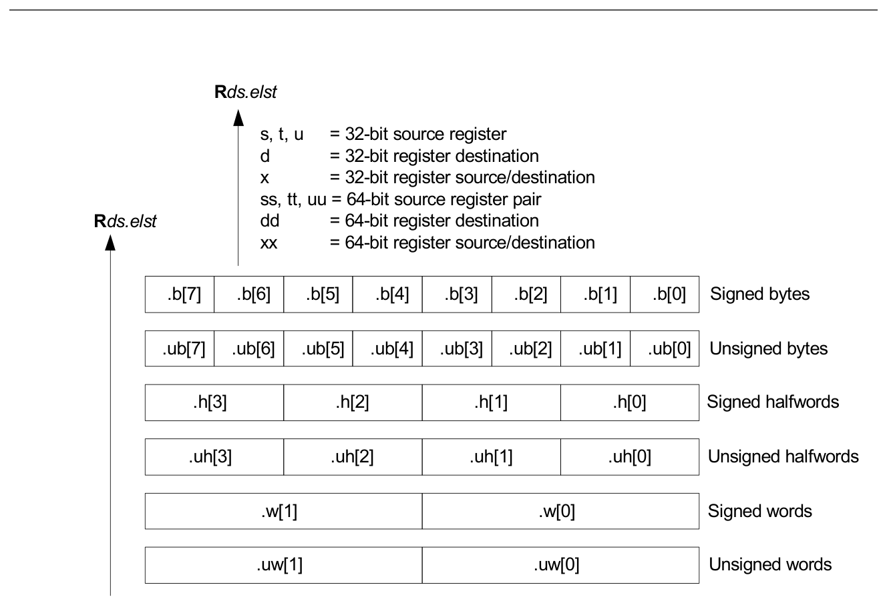
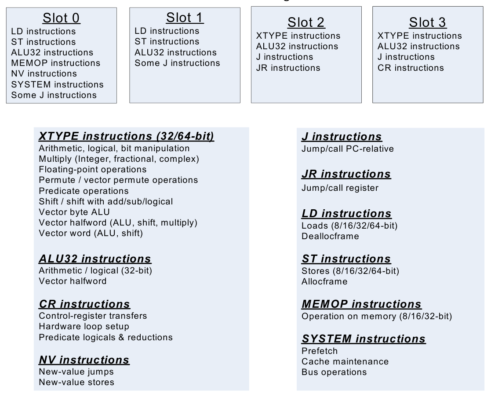

# 3 Instructions

Instruction encoding is described in Chapter 10. For detailed descriptions of the Hexagon processor instructions, see Chapter 11.

## 3.1 Hexagon processor instruction syntax

NOTE: The notation described here does not appear in actual assembly language instructions. It is used only to specify the instruction syntax and behavior.

Most Hexagon processor instructions have the following syntax:

```
dest = instr_name(source1,source2,...)[:option1][:option2]...
```

The item specified on the left-hand side (LHS) of the equation is assigned the value specified by the right-hand side (RHS). For example:

```
R2 = add(R3,R1)   // Add R3 and R1, assign result to R2
```

- `Courier New font` is used for instructions
- Square brackets enclose optional items (for example, [`:sat`], means that saturation is optional)
- Braces indicate a choice of items (for example, `{Rs,#s16}` means that either Rs or a signed 16-bit immediate can be used)

**Table 3-1  Instruction symbols**

| Symbol | Example | Meaning |
|---|---|---|
| = | `R2 = R3` | Assignment of RHS to LHS |
| # | `R1 = #1` | Immediate constant value |
| ## | `##2147483647` | 32-bit immediate constant value |
| 0x | `0xBABE` | Hexadecimal number prefix |
| MEMxx | `R2 = MEMxx(R3)` | Access memory. xx specifies the size and type of access. |
| ; | `R2 = R3; R4 = R5;` | Instruction delimiter, or end of an instruction. |
| { … } | `{R2 = R3; R5 = R6}` | Instruction packet delimiter; indicates a group of parallel instructions |
| ( … ) | `R2 = memw(R0 + #100)` | Source list delimiter |
| :endloopX | `:endloop0` | Loop end<br>`X` specifies a loop instruction (0 or 1) |

**Table 3-1  Instruction symbols (cont.)**

| Symbol | Example | Meaning |
|---|---|---|
| :t | `if (P0.new) jump:t target` | Direction hint (jump taken) |
| :nt | `if (!P1.new) jump:nt target` | Direction hint (jump not taken) |
| :sat | `R2 = add(R1,R2):sat` | Saturate result |
| :rnd | `R2 = mpy(R1.H,R2.H):rnd` | Round result |
| :carry | `R5:4=add(R1:0,R3:2,P1):carry` | Predicate used as carry input and output |
| :<<16 | `R2 = add(R1.L,R2.L):<<16` | Shift result left by halfword |
| :mem_noshuf | `{memw(R5) = R2;`<br>`R3 = memh(R6)}:mem_noshuf` | Inhibit load/store reordering (Section 5.5) |

### 3.1.1 Numeric operands

Table 3-2 lists the notation that describes numeric operands in the syntax and behavior of instructions.

**Table 3-2  Instruction operands**

| Symbol | Meaning | Min | Max | Example |
|---|---|---|---|---|
| #uN | Unsigned N-bit immediate value | 0 | 2<sup>N</sup>-1 | – |
| #sN | Signed N-bit immediate value | -2<sup>N-1</sup> | 2<sup>N-1</sup>-1 | – |
| #mN | Signed N-bit immediate value | -(2<sup>N-1</sup>-1) | 2<sup>N-1</sup>-1 | – |
| #uN:S | Unsigned N-bit immediate value representing<br>integral multiples of 2<sup>S</sup> in specified range | 0 | (2<sup>N</sup>-1) × 2<sup>S</sup> | – |
| #sN:S | Signed N-bit immediate value representing<br>integral multiples of 2<sup>S</sup> in specified range | (-2<sup>N-1</sup>) × 2<sup>S</sup> | (2<sup>N-1</sup>-1) × 2<sup>S</sup> | – |
| #rN:S | Same as #sN:S, but value is offset from PC of current packet | (-2<sup>N-1</sup>) × 2<sup>S</sup> | (2<sup>N-1</sup>-1) × 2<sup>S</sup> | – |
| usat<sub>N</sub> | Saturate value to unsigned N-bit number | 0 | 2<sup>N</sup>-1 | usat₁₆(Rs) |
| sat<sub>N</sub> | Saturate value to signed N-bit number | -2<sup>N-1</sup> | 2<sup>N-1</sup>-1 | sat₁₆(Rs) |
| sxt x->y | Sign-extend value from x to y bits | – | – | sxt32->64(Rs) |
| zxt x->y | Zero-extend value from x to y bits | – | – | zxt32->64(Rs) |
| >>> | Logical right shift | – | – | Rss >>> offset |

The `#uN`, `#sN`, and `#mN `symbols specify immediate operands in instructions. The `#` symbol appears in the actual instruction to indicate the immediate operand.

The `#rN` symbol specifies loop and branch destinations in instructions. The `#` symbol does not appear in the actual instruction. Instead, the entire `#rN `symbol (including its `:S` suffix) is expressed as a loop or branch symbol whose numeric value is determined by the assembler and linker. For example:

```
call my_proc           // Instruction example
```

The `:S` suffix indicates that the `S` least-significant bits in a value are implied zero bits and therefore not encoded in the instruction. The implied zero bits are called scale bits.

For example, `#s4:2` denotes a signed immediate operand represented by four bits encoded in the instruction, and two scale bits. The possible values for this operand are -32, -28, -24, -20, -16, -12, -8, -4, 0, 4, 8, 12, 16, 20, 24, and 28.

The` ##` symbol specifies a 32-bit immediate operand in an instruction (including a loop or branch destination). The `##` symbol indicates the operand in the actual instruction.

Examples of operand symbols:

```
Rd = add(Rs,#s16)     // #s16   -> signed 16-bit imm value
Rd = memw(Rs++#s4:2)  // #s4:2  -> scaled signed 4-bit imm value
call #r22:2           // #r22:2 -> scaled 22-bit PC-rel addr value
Rd = ##u32            // ##u32  -> unsigned 32-bit imm value
```

NOTE: When an instruction contains more than one immediate operand, the operand symbols are specified in upper and lowercase (for example, `#uN` and `#UN`) to indicate where they appear in the instruction encodings.

### 3.1.2 Terminology

Table 3-3 lists the symbols Hexagon processor instruction names use to specify the supported data types.

**Table 3-3  Data symbols**

| Size | Symbol | Type |
|---|---|---|
| 8-bit | B | Byte |
| 8-bit | UB | Unsigned byte |
| 16-bit | H | Half word |
| 16-bit | UH | Unsigned half word |
| 32-bit | W | Word |
| 32-bit | UW | Unsigned word |
| 64-bit | D | Double word |

### 3.1.3 Register operands

The following notation describes register operands in the syntax and behavior of instructions:

```
Rds[.elst]
```

The ds field indicates the register operand type and bit size (as defined in Table 3-4).

**Table 3-4  Register symbols**

| Symbol | Operand type | Size (in bits) |
|---|---|---|
| d | Destination | 32 |
| dd |  | 64 |
| s | First source | 32 |
| ss |  | 64 |
| t | Second source | 32 |
| tt |  | 64 |
| u | Third source | 32 |
| uu |  | 64 |
| x | Source and destination | 32 |
| xx |  | 64 |

Examples of the ds field that describe instruction syntax:

```
Rd = neg(Rs)           // Rd -> 32-bit dest, Rs 32-bit source
Rd = xor(Rs,Rt)        // Rt -> 32-bit second source
Rx = insert(Rs,Rtt)    // Rx -> both source and dest
```

Examples of the ds field that describe instruction behavior:

```
Rdd = Rss + Rtt        // Rdd, Rss, Rtt -> 64-bit registers
```

The optional elst (element size and type) field specifies parts of a register when the register is used as a vector. It can specify the following values:

- A signed or unsigned byte, halfword, or word within the register (as defined in Figure 3-1)
- A bit field within the register (as defined in Table 3-5)

Examples of the elst field:

```
EA = Rt.h[1]               // .h[1] -> bit field 31:16 in Rt
Pd = (Rss.u64 > Rtt.u64)   // .u64  -> unsigned 64-bit value
Rd = mpyu(Rs.L,Rt.H)       // .L/.H -> low/high 16-bit fields
```

NOTE: The control and predicate registers use the same notation as the general registers, but are written as Cx and Px (respectively) instead of Rx.



```text
Rds.elst
s, t, u = 32-bit source register
d = 32-bit register destination
x = 32-bit register source/destination
ss, tt, uu = 64-bit source register pair
Rds.elst dd = 64-bit register destination
xx = 64-bit register source/destination
.b[7] .b[6] .b[5] .b[4] .b[3] .b[2] .b[1] .b[0] Signed bytes
.ub[7] .ub[6] .ub[5] .ub[4] .ub[3] .ub[2] .ub[1] .ub[0] Unsigned bytes
.h[3] .h[2] .h[1] .h[0] Signed halfwords
.uh[3] .uh[2] .uh[1] .uh[0] Unsigned halfwords
.w[1] .w[0] Signed words
.uw[1] .uw[0] Unsigned words
```

**Figure 3-1  Register field symbols**

**Table 3-5  Register bit field symbols**

| Symbol | Meaning |
|---|---|
| .sN | Bits [N-1:0] are treated as a N-bit signed number. For example, R0.s16 means that the least significant 16-bits of R0 are treated as a 16-bit signed number. |
| .uN | Bits [N-1:0] are treated as a N-bit unsigned number. |
| .H | The most-significant 16 bits of a 32-bit register. |
| .L | The least-significant 16 bits of a 32-bit register. |

## 3.2 Instruction classes

The Hexagon processor instructions are assigned to specific instruction classes. Classes determine the combinations of instructions that can be written in parallel. Section 3.3 provides an overview of the instruction classes and how they can be grouped.

Instruction classes logically correspond with instruction types, so they serve as mnemonics to look up specific instructions. For instance, the ALU32 class contains ALU instructions that operate on 32-bit operands.

**Table 3-6  Instruction classes and subclasses**

| Class | Subclass | Description |
|---|---|---|
| XTYPE | – | Operations |
|  | XTYPE ALU | 64-bit ALU operations |
|  | XTYPE BIT | Bit operations |
|  | XTYPE COMPLEX | Complex math (use real and imaginary numbers) |
|  | XTYPE FP | Floating point operations |
|  | XTYPE MPY | Multiply operations |
|  | XTYPE PERM | Vector permute and format conversion (pack, splat, swizzle) |
|  | XTYPE PRED | Predicate operations |
|  | XTYPE SHIFT | Shift operations<br>(with optional ALU operations) |
| ALU32 | – | 32-bit ALU operations |
|  | ALU32 ALU | Arithmetic and logical |
|  | ALU32 PERM | Permute |
|  | ALU32 PRED | Predicate operations |
| CR | – | Controls register access and loops |
| JR | – | Jumps (register indirect addressing mode) |
| J | – | Jumps (PC-relative addressing mode) |
| LD | – | Memory load operations |
| MEMOP | – | Memory operations |
| NV | – | New-value operations |
|  | NV J | New-value jumps |
|  | NV ST | New-value stores |
| ST | – | Memory store operations;<br>allocate stack frame |
| SYSTEM | – | Operating system access |
|  | SYSTEM USER | Application-level access |

## 3.3 Instruction packets

Instructions can be grouped into very long instruction word (VLIW) packets for parallel execution, with each packet containing from one to four instructions. Packets of varying length can be freely mixed in a program.

Vector instructions operate on single instruction multiple data (SIMD) vectors.

Software must explicitly specify Instruction packets. Instruction packets are expressed in assembly language by enclosing groups of instructions in curly braces.

For example, two instructions grouped in a packet:

```
{ R0 = R1; R2 = R3 }
```

Four instructions grouped in a packet:

```
{   R8 = memh(R3++#2);
    R12 = memw(R1++#4);
    R = mpy(R10,R6): << 1:sat;
    R7 = add(R9,#2);
}
```

Packets have restrictions on the allowable instruction combinations. The instruction class of the instructions in a packet determines the primary restriction. Packet formation is subject to the following constraints:

- Resource constraints determine how many instructions of a specific type can appear in a packet. The Hexagon processor has a fixed number of execution units: each instruction executes on a particular type of unit, and each unit can process at most one instruction at a time. Thus, for example, because the Hexagon processor contains only two load units, an instruction packet with three load instructions is invalid.
- Grouping constraints are a small set of rules that apply above and beyond the resource constraints.
- Dependency constraints ensure that no write-after-write hazards exist in a packet.
- Ordering constraints dictate the order of instructions within a packet.
- Alignment constraints dictate the placement of packets in memory.

NOTE: The Hexagon processor executes individual instructions (which are not explicitly grouped in packets) as packets that contain a single instruction.

### 3.3.1 Packet execution semantics

Packets are defined to have parallel execution semantics. The execution behavior of a packet is defined as follows:

- First, instructions in the packet read their source registers in parallel.
- Next, instructions in the packet execute.
- Finally, instructions in the packet write their destination registers in parallel.

For example, consider the following packet:

```
{ R2 = R3; R3 = R2; }
```

In the first phase, registers R3 and R2 are read from the register file. Then, after execution, R2 is written with the old value of R3 and R3 is written with the old value of R2. The result of this packet is the swap of the values of R2 and R3.

NOTE: The store instructions in a dual store must belong to instruction class ST, and can execute only in Slots 0 and 1. Dual jumps, New-value stores, New-value compare jumps, and Dot-new predicates have non-parallel execution semantics.

### 3.3.2 Sequencing semantics

Packets of any length can freely mix in code. A packet is considered an atomic unit: in essence, a single large instruction. From the program perspective, a packet either executes to completion or not at all; it never partially executes. For example, if a packet causes a memory exception, the exception point is established before the packet.

A packet that contains multiple load/store instructions can require service from the external system. For instance, consider a packet that performs two load operations that both miss in the cache. The packet requires the memory system to supply the data:

- From the memory system perspective, the two resulting load requests process serially.
- From the program perspective, however, both load operations must complete before the packet can complete.

Thus, the packet is atomic from the program perspective.

Packets have a single PC address, which is the address of the start of the packet. Branches cannot be performed into the middle of a packet.

Architecturally, packets execute to completion – including updating all registers and memory – before the next packet begins. As a result, application programs are not exposed to pipeline artifacts.

### 3.3.3 Resource constraints

A packet cannot use more hardware resources than are physically available on the processor. For instance, because the Hexagon processor has only two load units, a packet with three load instructions is invalid. The behavior of such a packet is undefined. The assembler automatically rejects packets that oversubscribe the hardware resources.

The processor supports up to four parallel instructions. The instructions execute in four parallel pipelines, which are referred to as slots. The four slots are named Slot 0, Slot 1, Slot 2, and Slot 3.

NOTE: The endloopN instructions (Section 8.2.2) do not use any slots.

Each instruction belongs to specific Instruction classes. For example, jumps belong to instruction class J, while loads belong to instruction class LD. The class of an instruction determines the slot in which the instruction can execute.

Figure 3-2 shows the instruction classes that can be assigned to each of the four slots.



```text
Slot 0 Slot 1
Slot 2 Slot 3
LD instructions LD instructions
XTYPE instructions XTYPE instructions
ST instructions ST instructions
ALU32 instructions ALU32 instructions
ALU32 instructions ALU32 instructions
J instructions J instructions
MEMOP instructions Some J instructions
JR instructions CR instructions
NV instructions
SYSTEM instructions
Some J instructions
XTYPE instructions (32/64-bit) J instructions
Arithmetic, logical, bit manipulation Jump/call PC-relative
Multiply (Integer, fractional, complex)
Floating-point operations
JR instructions
Permute / vector permute operations
Jump/call register
Predicate operations
Shift / shift with add/sub/logical
Vector byte ALUVector halfword (ALU, shift, multiply) LD instructions
Loads (8/16/32/64-bit)
Vector word (ALU, shift)
Deallocframe
ALU32 instructions ST instructions
Arithmetic / logical (32-bit) Stores (8/16/32/64-bit)
Vector halfword Allocframe
CR instructions MEMOP instructions
Control-register transfers Operation on memory (8/16/32-bit)
Hardware loop setup
Predicate logicals & reductions SYSTEM instructions
Prefetch
NV instructionsCache maintenance
New-value jumps Bus operations
New-value stores
```

**Figure 3-2  Packet grouping combinations**

### 3.3.4 Grouping constraints

A few restrictions determine what constitutes a valid packet. The assembler ensures that packets follow valid grouping rules. If a packet executes that violates a grouping rule, the behavior is undefined. The following rules must be followed:

- Dot-new conditional instructions (Section 6.1.4) must be grouped in a packet with an instruction that generates dot-new predicates.
- ST-class instructions can be placed in Slot 1. In this case, Slot 0 normally must contain a second ST-class instruction (Section 5.4).
- J-class instructions can be placed in Slots 2 or 3. However, only certain combinations of program flow instructions (J or JR) can be grouped in a packet (Section 8.7). Otherwise, at most one program flow instruction is allowed in a packet. Some Jump and compare-Jump instructions can execute on slots 0 or 1, excluding calls, such as the following:
  - Instructions of the form “`Pd=cmp.xx(); if(Pd.new)jump:hint <target>`”
  - Instructions of the form “`If(Pd[.new]) jump[:hint] <target>`”
  - The “`jump<target>`” instruction
- JR-class instructions can be placed in Slot 2. However, when encoded in a duplex jumpr instruction, R31 can be placed in Slot 0 (Section 10.3).
- Restrictions limit the instructions that can appear in a packet at the setup or end of a hardware loop (Section 8.2.4).
- A user control register transfer to the control register `USR` cannot be grouped with a floating point instruction (Section 2.2.3).
- The SYSTEM-class instructions include prefetch, cache operations, bus operations, load locked, and store conditional instructions (Section 5.10). These instructions have the following grouping rules:
  - The `brkpt`, `trap`, `pause`, `icinva`, `isync`, and `syncht` instructions are solo instructions. They must not be grouped with other instructions in a packet.
  - The `memw_locked`, `memd_locked`, `l2fetch`, and `trace` instructions must execute on Slot 0. They must be grouped only with ALU32 or (non-FP) XTYPE instructions.
  - The `dccleana`, `dcinva`, `dccleaninva`, and `dczeroa` instructions must execute on Slot 0. Slot 1 must be empty or an ALU32 instruction.

### 3.3.5 Dependency constraints

Instructions in a packet cannot write to the same destination register. The assembler automatically flags such packets as invalid. If the processor executes a packet with two writes to the same general register, an error exception is raised.

If the processor executes a packet that performs multiple writes to the same predicate or control register, the behavior is undefined. Three special cases exist for this rule:

- Conditional writes are allowed to target the same destination register only if at most one of the writes is performed (Section 6.1.5).
- The overflow flag in the status register has defined behavior when multiple instructions write to it (Section 2.2.3). Do not group instructions that write to the entire user status register (for example, USR = R2) in a packet with any instruction that writes to a bit in the user status register.
- Multiple compare instructions are allowed to target the same predicate register to perform a logical AND of the results (Section 6.1.3).

### 3.3.6 Ordering constraints

In assembly code, instructions can appear in a packet in any order (except for Dual jumps. The assembler automatically encodes instructions in the packet in the proper order.

In the binary encoding of a packet, the instructions must be ordered from Slot 3 down to Slot 0. If the packet contains fewer than four instructions, any unused slot is skipped – a NOP is unnecessary as the hardware handles the proper spacing of the instructions.

In memory, instructions in a packet must appear in strictly decreasing slot order. Additionally, if an instruction can go in a higher-numbered slot, and that slot is empty, it must be moved into the higher-numbered slot.

For example, if a packet contains three instructions and slot 1 is not used, encode the instructions in the packet as follows:

- Slot 3 instruction at lowest address
- Slot 2 instruction follows Slot 3 instruction
- Slot 0 instructions at the last (highest) address

If a packet contains a single load or store instruction, that instruction must go in Slot 0, which is the highest address. As an example, a packet containing both LD and ALU32 instructions must be ordered so the LD is in Slot 0 and the ALU32 in another slot.

### 3.3.7 Alignment constraints

Packets have the following constraints on their placement or alignment in memory:

- Packets must be word-aligned (32-bit). If the processor executes an improperly aligned packet, it raises an error exception (Section 8.10).
- Packets should not wrap the 4 GB address space. If address wraparound occurs, the processor behavior is undefined.

No other core-based restrictions exist for code placement or alignment.

If the processor branches to a packet that crosses a 16-byte address boundary, the resulting instruction fetch stalls for one cycle. Packets that are jump targets or loop body entries can be explicitly aligned to ensure that this stall does not occur (Section 8.3.5).

## 3.4 Instruction intrinsics

To support efficient coding of the time-critical sections of a program (without resorting to assembly language), the C compilers support intrinsics that directly express Hexagon processor instructions from within C code.

For example:

```
int main()
{
    long long v1 = 0xFFFF0000FFFF0000LL;
    long long v2 = 0x0000FFFF0000FFFFLL;
    long long result;
    // Find the minimum for each half-word in 64-bit vector
    result = Q6_P_vminh_PP(v1,v2);
}
```

Intrinsics are defined for most of the Hexagon processor instructions.

## 3.5 Compound instructions

The Hexagon processor supports compound instructions, which encode pairs of common operations in a single instruction. For example, each of the following is a single compound instruction:

|  |  |
|---|---|
| `dealloc_return` | `// Deallocate frame and return` |
| `R2 &= and(R1, R0)` | `// And and and` |
| `R7 = add(R4, sub(#15, R3))` | `// Subtract and add` |
| `R3 = sub(#20, asl(R3, #16))` | `// Shift and subtract` |
| `R5 = add(R2, mpyi(#8, R4))` | `// Multiply and add` |
| `{` | `// Compare and jump` |

```
   P0 = cmp.eq (R2, R5)
   if (P0.new) jump:nt target}
{R2 = #15// Register transfer and jump
    jump target}
```

Compound instructions reduce code size and improve code performance.

NOTE: Compound instructions (except for X-and-jump) have distinct assembly syntax from the instructions of which they are composed.

## 3.6 Duplex instructions

To reduce code size, the Hexagon processor supports duplex instructions that encode pairs of common instructions in a 32-bit instruction container.

Unlike Compound instructions, duplex instructions do not have distinctive syntax – in assembly code they appear identical to the instructions they are composed of. The assembler is responsible for recognizing when a pair of instructions can be encoded as a single duplex rather than a pair of regular instruction words.

To fit two instructions into a single 32-bit word, Duplexes are limited to a subset of the most common instructions (load, store, branch, ALU), and the most common register operands.
