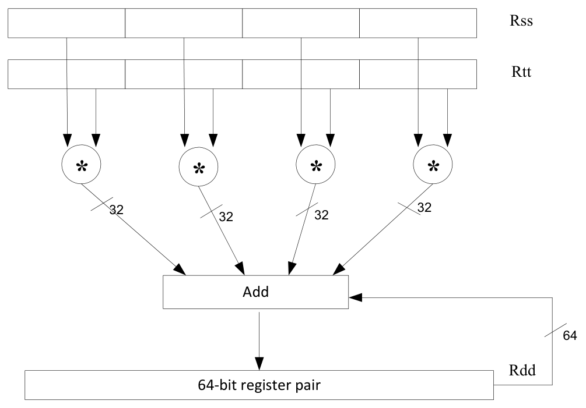
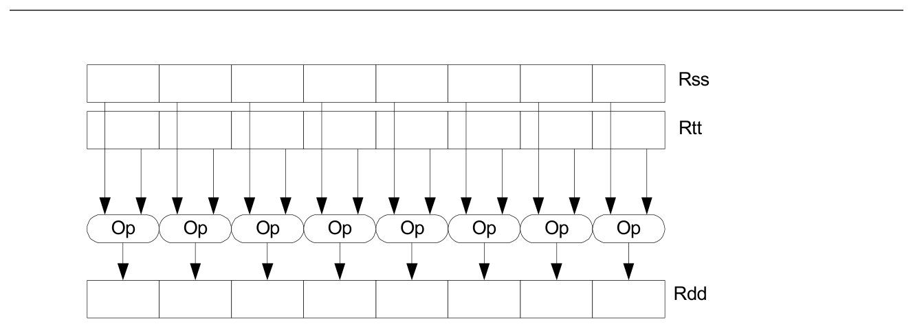
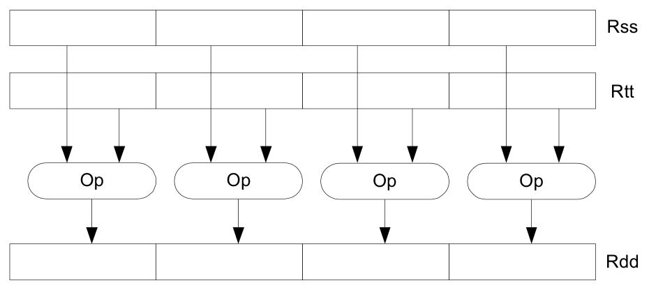
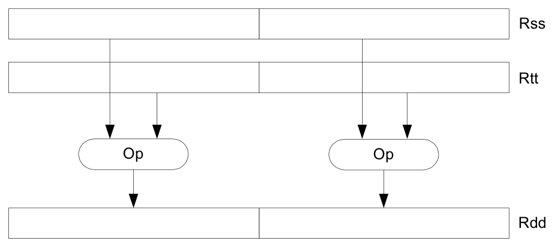
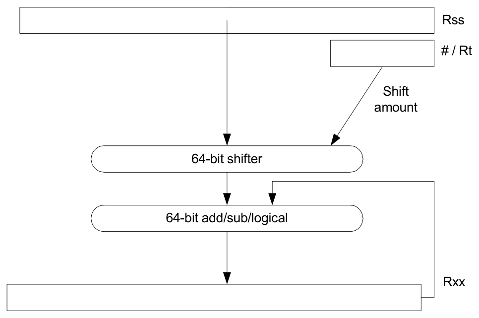
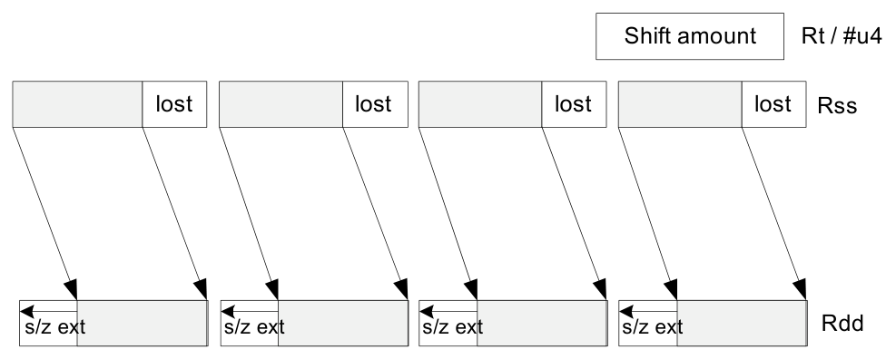
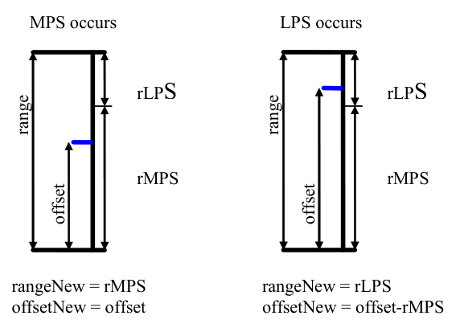
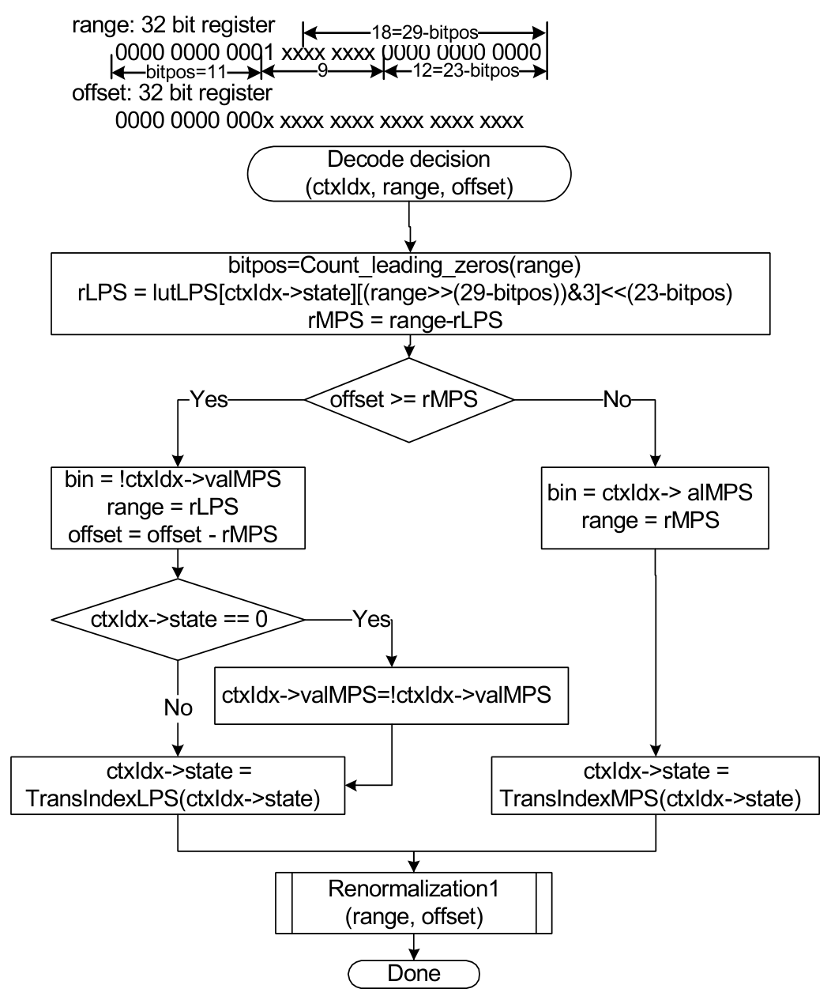
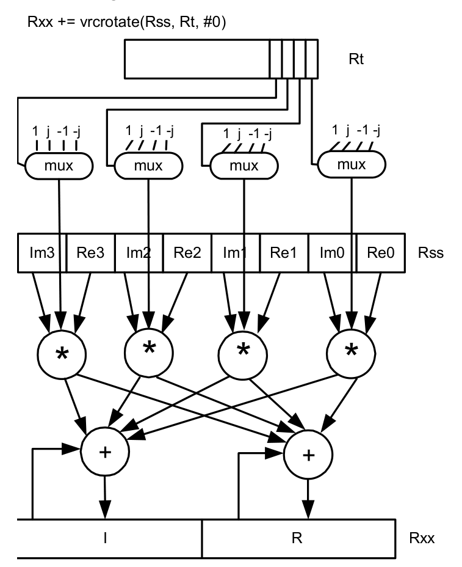
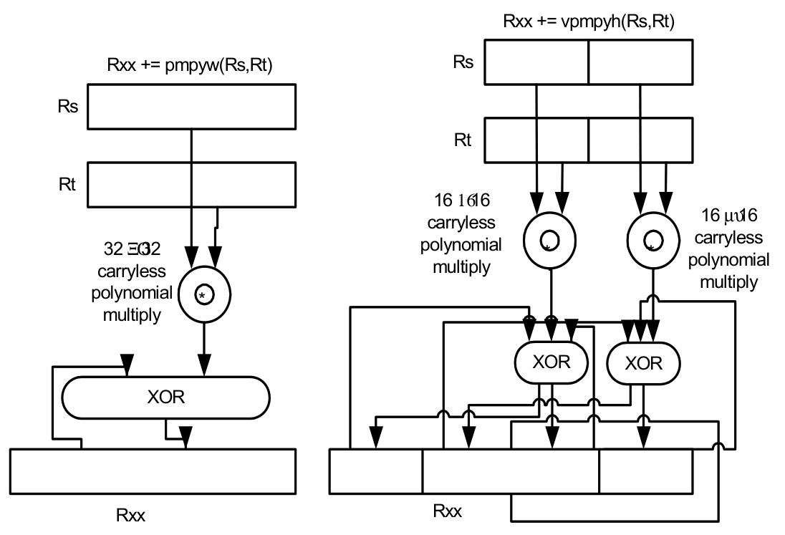

# 4 Data Processing

The Hexagon processor provides a rich set of operations for processing scalar and vector data. Instructions can perform a wide variety of operations on fixed-point or floating-point data. The fixed-point operations support scalar and vector data in various sizes. The floating-point operations support single-precision data.

This chapter presents an overview of the operations provided by the following Hexagon processor instruction classes:

- XTYPE – General-purpose data operations
- ALU32 – Arithmetic/logical operations on 32-bit data

## 4.1 Data types

The Hexagon processor provides operations for processing the following data types.

### 4.1.1 Fixed-point data

The Hexagon processor provides operations to process 8-, 16-, 32-, or 64-bit fixed-point data. The data is either integer or fractional, and in signed or unsigned format.

4.1.1.1 Scalar operations

The Hexagon processor includes the following scalar operations on fixed-point data:

- Multiplication of 16-bit, 32-bit, and complex data
- Addition and subtraction of 16-bit, 32-bit, and 64-bit data (with and without saturation)
- Logical operations on 32-bit and 64-bit data (AND, OR, XOR, NOT)
- Shifts on 32-bit and 64-bit data (arithmetic and logical)
- Min/max, negation, absolute value, parity, norm, swizzle
- Compares of 8-bit, 16-bit, 32-, and 64-bit data
- Sign and zero extension (8-bit and 16-bit to 32-bit, 32-bit to 64-bit)
- Bit manipulation
- Predicate operations

4.1.1.2 Vector operations

The Hexagon processor includes the following vector operations on fixed-point data:

- Multiplication (halfwords, word by half, vector reduce, dual multiply)
- Addition and subtraction of word and halfword data
- Shifts on word and halfword data (arithmetic and logical)
- Min/max, average, negative average, absolute difference, absolute value
- Compares of word, halfword, and byte data
- Reduce, sum of absolute differences on unsigned bytes
- Special-purpose data arrangement (such as pack, splat, shuffle, align, saturate, splice, truncate, complex conjugate, complex rotate, zero extend)

NOTE: Certain vector operations support automatic scaling, saturation, and rounding.

For example, the following instruction performs a vector operation:

```
R1:0 += vrmpyh(R3:2,R5:4)
```

The instruction is defined to perform the following operations in one cycle:

```
R1:0 += ((R2.L * R4.L) +
      (R2.H * R4.H) +
      (R3.L * R5.L) +
      (R3.H * R5.H))
```

Figure 4-1 shows a schematic of this instruction type.



```text
Rss
Rtt
32 32
32 32
Add
64
Rdd
64-bit register pair
```

**Figure 4-1  Vector instruction example**

### 4.1.2 Floating-point data

The Hexagon processor provides operations to process 32-bit floating-point numbers. The numbers are stored in IEEE single-precision floating-point format.

Per the IEEE standard, certain floating-point values are defined to represent positive or negative infinity, as well as Not-a-Number (NaN), which represents values that have no mathematical meaning.

Floating-point numbers can be held in a general register.

4.1.2.1 Floating-point operations

The Hexagon processor includes the following operations on floating-point data:

- Addition and subtraction
- Multiplication (with optional scaling)
- Min/max/compare
- Reciprocal/square root approximation
- Format conversion

### 4.1.3 Complex data

The Hexagon processor provides operations to process 32- or 64-bit complex data.

Complex numbers include a signed real portion and a signed imaginary portion. Given two complex numbers (a + bi) and (c + di), the complex multiply operations computes both the real portion (ac - bd) and the imaginary portion (ad + bc) in a single instruction.

Complex numbers can be packed in a general register or register pair. When packed, the imaginary portion occupies the most-significant portion of the register or register pair.

### 4.1.4 Vector data

The Hexagon processor provides operations to process 64-bit vector data.

Vector data types pack multiple data items – bytes, halfwords, or words – into 64-bit registers. Vector data operations are common in video and image processing.

Eight 8-bit bytes can be packed into a 64-bit register.



```text
Rss
Rtt
Op Op Op Op Op Op Op Op
Rdd
```

**Figure 4-1  Vector byte operation example**

Four 16-bit halfword values can be packed in a single 64-bit register pair.



```text
Rss
Rtt
Op Op Op Op
Rdd
```

**Figure 4-2  Vector halfword operation example**

Two 32-bit word values can be packed in a single 64-bit register pair.



```text
Rss
Rtt
Op Op
Rdd
```

**Figure 4-3  Vector word operation example**

## 4.2 Instruction options

Some instructions support optional scaling, saturation, and rounding. There are no mode bits controlling these options – instead, they are explicitly specified as part of the instruction name. The options are described in this section.

### 4.2.1 Fractional scaling

In fractional data format, data is treated as fixed-point fractional values whose range is determined by the word length and radix point position.

Fractional scaling is specified in an instruction by adding the`:<<1` specifier. For example:

```
R3:2 = cmpy(R0,R1):<<1:sat
```

When two fractional numbers are multiplied, the product must be scaled to restore the original fractional data format. The Hexagon processor allows specification of the fractional scaling of the product in the instruction for shifts of 0 and 1. Perform a shift of 1 for Q1.15 numbers. Perform a shift of 0 for integer multiplication.

### 4.2.2 Saturation

Certain instructions are available in saturating form. If a saturating arithmetic instruction has a result that is smaller than the minimum value, the result is set to the minimum value. Similarly, if the operation has a result that is greater than the maximum value, the result is set to the maximum value.

Saturation is specified in an instruction by adding the`:sat `specifier. For example:

```
R2 = abs(R1):sat
```

The open virtualization format (OVF) bit in the User status register is set whenever a saturating operation saturates to the maximum or minimum value. It remains set until explicitly cleared by a control register transfer to USR. For vector-type saturating operations, if any of the individual elements of the vector saturate, OVF is set.

### 4.2.3 Arithmetic rounding

Certain signed multiply instructions support optional arithmetic rounding (also known as biased rounding). The arithmetic rounding operation takes a double precision fractional value and adds 0x8000 to the low 16-bits (least significant 16-bit halfword).

Rounding is specified in an instruction by adding the `:rnd` specifier. For example:

```
R2 = mpy(R1.h,R2.h):rnd
```

NOTE: Arithmetic rounding can accumulate numerical errors, especially when the number to round is exactly 0.5. These errors occur most frequently when dividing by 2 or averaging.

### 4.2.4 Convergent rounding

To address the problem of error accumulation in Convergent rounding, the Hexagon processor includes four instructions that support positive and negative averaging with a convergent rounding option.

These instructions work as follows:

1. Compute (A + B) or (A - B) for AVG and NAVG respectively.

2. Based on the two least-significant bits of the result, add a rounding constant as follows:

  - If the two LSBs are 00, add 0
  - If the two LSBs are 01, add 0
  - If the two LSBs are 10, add 0
  - If the two LSBs are 11, add 1

3. Shift the result right by one bit.

### 4.2.5 Scaling for divide and square-root

On the Hexagon processor, floating point divide and square-root operations are implemented in software using library functions. To enable the efficient implementation of these operations, the processor supports special variants of the multiply-accumulate instruction, named scale FMA.

Scale FMA supports optional scaling of the product generated by the floating-point fused multiply-add instruction.

Scaling is specified in the instruction by adding the `:scale` specifier and a predicate register operand. For example:

```
R3 += sfmpy(R0,R1,P2):scale
```

For single precision, the scaling factor is two raised to the power specified by the contents of the predicate register (which is treated as an 8-bit two's complement value). For double precision, the predicate register value is doubled before use as a power of two.

NOTE: Do not use scale FMA instructions outside of divide and square-root library routines. There is no guarantee that future versions of the Hexagon processor will implement these instructions using the same semantics. Future versions assume only that compatibility for scale FMA is limited to the needs of divide and square-root library routines.

## 4.3 XTYPE operations

The XTYPE instruction class includes most of the data-processing operations performed by the Hexagon processor. The operation type categorizes these operations.

### 4.3.1 ALU

XTYPE ALU operations modify 8-, 16-, 32-, and 64-bit data. These operations include:

- Add and subtract with and without saturation
- Add and subtract with accumulate
- Absolute value
- Logical operations
- Min, max, negate instructions
- Register transfers of 64-bit data
- Word to doubleword sign extension
- Comparisons

### 4.3.2 Bit manipulation

XTYPE BIT manipulation operations modify bit fields in a register or register pair. These operations include:

- Bit field insert
- Bit field signed and unsigned extract
- Count leading and trailing bits
- Compare bitmasks
- Set/clear/toggle bit
- Test bit operation
- Interleave/deinterleave bits
- Bit reverse
- Split bit field
- Masked parity and linear feedback shift
- Table index formation

### 4.3.3 Complex

XTYPE COMPLEX operations manipulate complex numbers. These operations include:

- Complex add and subtract
- Complex multiply with optional round and pack
- Vector complex multiply
- Vector complex conjugate
- Vector complex rotate
- Vector reduce complex multiply real or imaginary

### 4.3.4 Floating point

XTYPE FP operations manipulate single-precision floating point numbers. These operations include:

- Addition and subtraction
- Multiplication (with optional scaling)
- Min/max/compare
- Format conversion

The Hexagon floating-point operations are defined to support the IEEE floating-point standard. However, certain IEEE-required operations – such as divide and square root – are not supported directly. Instead, special instructions are defined to support the implementation of the required operations as library routines. These instructions include:

- A special version of the fused multiply-add instruction (designed specifically for use in library routines)
- Reciprocal/square root approximations (which compute the approximate initial values used in reciprocal and reciprocal-square-root routines)
- Extreme value assistance (which adjusts input values if they cannot produce correct results using convergence algorithms)

NOTE: The special floating-point instructions are not intended for use directly in user code – use the special floating-point instructions only in the floating point library.

##### Format conversion

The floating-point conversion instructions `sfmake` and `dfmake` convert an unsigned 10-bit immediate value into the corresponding floating-point value.

The immediate value must be encoded so that bits [5:0] contain the significand, and bits [9:6] the exponent. The exponent value is added to the initial exponent value (`bias - 6`).

For example, to generate the single-precision floating point value 2.0, bits [5:0] must be set to 0 and bits [9:6] set to 7. Performing the sfmake operation on this immediate value yields the floating point value `0x40000000`, which is 2.0.

NOTE: The conversion instructions are designed to handle common floating point values, including most integers and many basic fractions (1/2, 3/4, and so on).

##### Rounding

The Hexagon User status register includes the FPRND field, which specifies the IEEE-defined floating-point rounding mode.

##### Exceptions

The Hexagon user status register includes five status fields, which work as sticky flags for the five IEEE-defined exception conditions: inexact, overflow, underflow, divide by zero, and invalid. A sticky flag is set when the corresponding exception occurs, and remains set until explicitly cleared.

The user status register also includes five mode fields that specify whether to perform an operating-system trap if one of the floating-point exceptions occur. For every instruction packet containing a floating-point operation, if a floating-point sticky flag and the corresponding trap-enable bit are both set, a floating-point trap is generated. After the packet commits, the Hexagon processor then automatically traps to the operating system.

NOTE: Non-floating-point instructions never generate a floating-point trap, regardless of the state of the sticky flag and trap-enable bits.

### 4.3.5 Multiply

Multiply operations support fixed-point multiplication, including both single- and double-precision multiplication, and polynomial multiplication.

##### Single precision

In single-precision arithmetic a 16-bit value is multiplied by another 16-bit value. These operands can come from the high portion or low portion of any register. Depending on the instruction, the result of the 16 × 16 operation can optionally be accumulated, saturated, rounded, or shifted left by 0 to 1 bits.

The instruction set supports operations on signed × signed, unsigned × unsigned, and signed × unsigned data.

Table 4-1 summarizes the options available for 16 × 16 single precision multiplications. The symbols used in the table are as follows:

- SS: Perform signed × signed multiply
- UU: Perform unsigned × unsigned multiply
- SU: Perform signed × unsigned multiply
- A+: Result added to accumulator
- A-: Result subtracted from accumulator
- 0 : Result not added to accumulator

**Table 4-1  Single-precision multiply options**

| Multiply | Result | Sign | Accumulate | Sat | Rnd | Scale |
|---|---|---|---|---|---|---|
| 16 × 16 | 32 | SS | A+, A- | Yes | No | 0 to 1 |
| 16 × 16 | 32 | SS | 0 | Yes | Yes | 0 to 1 |
| 16 × 16 | 64 | SS | A+, A- | No | No | 0 to 1 |
| 16 × 16 | 64 | SS | 0 | No | Yes | 0 to 1 |
| 16 × 16 | 32 | UU | A+, A-, 0 | No | No | 0 to 1 |
| 16 × 16 | 64 | UU | A+, A-, 0 | No | No | 0 to 1 |
| 16 × 16 | 32 | SU | A+, 0 | Yes | No | 0 to 1 |

##### Double precision

Double precision instructions are available for both 32 × 32 and 32 × 16 multiplication:

- For 32 × 32 multiplication the result is either 64 or 32 bits. The 32-bit result is either the high or low portion of the 64-bit product.
- For 32 × 16 multiplication the result is always taken as the upper 32 bits.

The operands are either signed or unsigned.

**Table 4-2  Double precision multiply options**

| Multiply | Result | Sign | Accumulate | Sat | Rnd | Scale |
|---|---|---|---|---|---|---|
| 32 × 32 | 64 | SS, UU | A+, A-, 0 | No | No | 0 |
| 32 × 32 | 32 (upper) | SS, UU | 0 | No | Yes | 0 |
| 32 × 32 | 32 (low) | SS, UU | A+, 0 | No | No | 0 |
| 32 × 16 | 32 (upper) | SS, UU | A+, 0 | Yes | Yes | 0 to 1 |
| 32 × 32 | 32 (upper) | SU | 0 | No | No | 0 |

##### Polynomial

Polynomial XTYPE MPY instructions are available for both words and vector halfwords.

These instructions are useful for algorithms that include scramble code generation, cryptographic, convolutional algorithms, and Reed Solomon code.

### 4.3.6 Permute

XTYPE PERM operations perform vector data operations such as arithmetic, format conversion, and rearrangement of vector elements. Supported conversions types:

- Swizzle bytes
- Vector shuffle
- Vector align
- Vector saturate and pack
- Vector splat bytes
- Vector splice
- Vector sign extend halfwords
- Vector zero extend bytes
- Vector zero extend halfwords
- Scalar saturate to byte, halfword, word
- Vector pack high and low halfwords
- Vector round and pack
- Vector splat halfwords

### 4.3.7 Predicate

XTYPE PRED operations modify predicate source data. The categories of instructions available include:

- Vector mask generation
- Predicate transfers
- Viterbi packing

### 4.3.8 Shift

Scalar XTYPE SHIFT operations perform various 32 and 64-bit shifts followed by an optional add/sub or logical operation. Figure 4-4 shows the general operation.



```text
Rss
# / Rt
Shift
amount
64-bit shifter
64-bit add/sub/logical
Rxx
```

**Figure 4-4  64-bit shift and add/sub/logical**

Four shift types are supported:

- Arithmetic shift right (ASR)
- Arithmetic shift left (ASL)
- Logical shift right (LSR)
- Logical shift left (LSL)

In register-based shifts, the Rt register is a signed two’s complement number. If this value is positive, the instruction opcode tells the direction of shift (right or left). If this value is negative, the shift direction indicated by the opcode is reversed.

When arithmetic right shifts are performed, the sign bit is shifted in, whereas logical right shifts in zeros. Left shifts always shift in zeros.

Some shifts are available with saturation and rounding options.

## 4.4 ALU32 operations

The ALU32 instruction class includes general arithmetic/logical operations on 32-bit data:

- Add, subtract, negate without saturation on 32-bit data
- Logical operations such as AND, OR, XOR, AND with immediate, and OR with immediate
- Scalar 32-bit compares
- Combine halfwords, combine words, combine with immediates, shift halfwords, and Mux
- Conditional add, combine, logical, subtract, and transfer.
- NOP
- Sign and zero-extend bytes and halfwords
- Transfer immediates and registers
- Vector add, subtract, and average halfwords

NOTE: ALU32 instructions can execute on any slot (Section 3.3.3).

Chapter 6 describes the conditional execution and compare instructions.

## 4.5 Vector operations

Vector operations support arithmetic operations on vectors of bytes, halfwords, and words.

The vector operations belong to the XTYPE instruction class (except for vector add, subtract, and average halfwords, which are ALU32).

##### Vector byte operations

The vector byte operations process packed vectors of signed or unsigned bytes. They include the following operations:

- Vector add and subtract signed or unsigned bytes
- Vector min and max signed or unsigned bytes
- Vector compare signed or unsigned bytes
- Vector average unsigned bytes
- Vector reduce add unsigned bytes
- Vector sum of absolute differences unsigned bytes

##### Vector halfword operations

The vector halfword operations process packed 16-bit halfwords. They include the following operations:

- Vector add and subtract halfwords
- Vector average halfwords
- Vector compare halfwords
- Vector min and max halfwords
- Vector shift halfwords
- Vector dual multiply
- Vector dual multiply with round and pack
- Vector multiply even halfwords with optional round and pack
- Vector multiply halfwords
- Vector reduce multiply halfwords

For example, Figure 4-5 shows the operation of the vector arithmetic shift right halfword (vasrh) instruction. In this instruction, each 16-bit half-word is shifted right by the same amount that is specified in a register or with an immediate value. Because the shift is arithmetic, the bits shifted in are copies of the sign bit.



```text
Shift amount Rt / #u4
lost lost lost lost Rss
s/z ext s/z ext s/z ext s/z ext Rdd
```

**Figure 4-5  Vector halfword shift right**

##### Vector word operations

The vector word operations process packed vectors of two words. They include the following operations:

- Vector add and subtract words
- Vector average words
- Vector compare words
- Vector min and max words
- Vector shift words with optional truncate and pack

For more information on vector operations, see Section 11.1.1 and Section 11.10.1.

## 4.6 CR operations

The CR instruction class includes operations that access the Control registers.

**Table 4-3  Control register transfer instructions**

| Syntax | Operation |
|---|---|
| Rd = Cs<br>Cd = Rs | Move control register to / from a general register.<br>NOTE PC is not a valid destination register. |
| Rdd = Css<br>Cdd = Rss | Move control register pair to / from a general register pair.<br>NOTE PC is not a valid destination register. |

NOTE: In register-pair transfers, control registers must be specified using their numeric alias names – see Section 2.2 for details.

## 4.7 Compound operations

The instruction set includes a number of instructions that perform multiple logical or arithmetic operations in a single instruction. They include the following operations:

- AND/OR with inverted input
- Compound logical register
- Compound logical predicate
- Compound add-subtract with immediates
- Compound shift-operation with immediates (arithmetic or logical)
- Multiply-add with immediates

For more information, see Section 11.10.1.

## 4.8 Special operations

Special-purpose instructions to support specific applications.

### 4.8.1 H.264 CABAC processing

H.264/AVC is adopted in a diverse range of multimedia applications:

- HD-DVDs
- HDTV broadcasting
- Internet video streaming

Context Adaptive Binary Arithmetic Coding (CABAC) is one of the two alternative entropy coding methods specified in the H.264 main profile. CABAC offers superior coding efficiency at the expense of greater computational complexity. The Hexagon processor includes a dedicated instruction (decbin) to support CABAC decoding.

Binary arithmetic coding is based on the principle of recursive interval subdivision, and its state is characterized by two quantities:

- The current interval range
- The current offset in the current code interval

The offset is read from the encoded bit stream. When decoding a bin, the interval range is subdivided in two intervals based on the estimation of the probability <sub>pLPS</sub> of least probable symbol (LPS): one interval with width of rLPS = range x pLPS, and another with width of rMPS = range x pMPS = range -rLPS, where MPS stands for most probable symbol.

Depending on which subinterval the offset falls into, the decoder decides whether the bin is decoded as MPS or LPS, after which the two quantities are iteratively updated, as shown in Figure 4-1.



```text
MPS occurs LPS occurs
rLPS rLPS
range range
rMPS rMPS
offset offset
rangeNew = rMPS rangeNew = rLPS
offsetNew = offset offsetNew = offset-rMPS
```

**Figure 4-1  Arithmetic decoding for one bin**

4.8.1.1 CABAC implementation

In H.264 range is a 9-bit quantity, and offset is 9 bits in regular mode and 10 bits in bypass mode during the whole decoding process. A 64 × 4 table of 256 bytes approximates the calculation of rLPS, where the range and the context state (selected for the bin to decode) address the lookup table. To maintain the precision of the decoding process, the new range must be renormalized to ensure that the most significant bit is always 1, and that the bit stream synchronously refills the offset.

To simplify the renormalization/refill process, the decoding scheme shown in Figure 4-2 significantly reduces the frequency of renormalization and refilling bits from the bit stream, while also being suitable for DSP implementation.



```text
range: 32 bit register18=29-bitpos
0000 0000 0001 xxxx xxxx 0000 0000 0000bitpos=11₉12=23-bitpos
offset: 32 bit register
0000 0000 000x xxxx xxxx xxxx xxxx xxxx
Decode decision
(ctxIdx, range, offset)
bitpos=Count_leading_zeros(range)
rLPS = lutLPS[ctxIdx->state][(range>>(29-bitpos))&3]<<(23-bitpos)
rMPS = range-rLPS
Yes offset >= rMPS No
bin = !ctxIdx->valMPS
bin = ctxIdx-> alMPS
range = rLPS
range = rMPS
offset = offset - rMPS
ctxIdx->state == 0 Yes
ctxIdx->valMPS=!ctxIdx->valMPS
No
ctxIdx->state = ctxIdx->state =
TransIndexLPS(ctxIdx->state) TransIndexMPS(ctxIdx->state)
Renormalization1
(range, offset)
Done
```

**Figure 4-2  CABAC decoding engine for regular bin**

The Hexagon processor can use the decbin instruction to decode one regular bin in two cycles (not counting the bin refill process).

For more information on the decbin instruction, see Section 11.10.6.

For example:

```
Rdd = decbin(Rss,Rtt)
```

```
INPUT: Rss and Rtt register pairs as:
Rtt.w1[5:0] = state
Rtt.w1[8] = valMPS
Rtt.w0[4:0] =  bitpos
Rss.w0 = range
Rss.w1 = offset
```

```
OUTPUT: Rdd register pair is packed as
Rdd.w0[5:0] = state
Rdd.w0[8] = valMPS
Rdd.w0[31:23] = range
Rdd.w0[22:16] = '0'
Rdd.w1 = offset (normalized)
```

```
OUTPUT: P0
P0 = (bin)
```

4.8.1.2 Code example

```
H264CabacGetBinNC:
/****************************************************************
* Non-conventional call:
* Input: R1:0 = offset : range  ,  R2 = dep,   R3 = ctxIdx,
* R4 = (*ctxIdx), R5 = bitpos
*
* Return:
*       R1: 0 - offset : range
*       P0 - (bin)
*****************************************************************/
```

```
// Cycle #1
{ R1:0= decbin(R1:0,R5:4)   // Decode one bin
  R6 = asl(R22,R5)          // Where R22 = 0x100
}
```

```
// Cycle #2
{ memb(R3) = R0             // Save context to *ctxIdx
   R1:0 = vlsrw(R1:0,R5)    // Re-align range and offset
   P1 = cmp.gtu(R6,R1)      // Need refill? P1= (range<0x100)
   IF (!P1.new) jumpr:t LR  // Return
}
RENORM_REFILL:
...
```

### 4.8.2 IP Internet checksum

The key features of the Internet checksum¹ include:

- The checksum can be summed in any order
- Carries can be accumulated using an accumulator larger than the size being added, and added back in at any time

Using standard data-processing instructions, the Internet checksum can be computed at 8 bytes per cycle in the main loop, by loading words and accumulating into doublewords. After the loop, the upper word is added to the lower word; then the upper halfword is added to the lower halfword, and any carries are added back in.

The Hexagon processor supports a dedicated instruction (vradduh) that computes the Internet checksum at a rate of 16 bytes per cycle.

The vradduh instruction accepts the halfwords of the two input vectors, adds them all together, and places the result in a 32-bit destination register. This operation can both compute the sum of 16 bytes of input while preserving the carries, and accumulate carries at the end of the computation.

For more information on the vradduh instruction, see Vector reduce add halfwords.

1 See RFC 1071 (http://www.faqs.org/rfcs/rfc1071.html)

NOTE: This operation uses the maximum available load bandwidth in the Hexagon processor.

4.8.2.1 Code example

```
.text
.global fast_ip_check
// Assumes data is 8-byte aligned
// Assumes data is padded at least 16 bytes afterwords with 0's.
// input R0 points to data
// input R1 is length of data
// returns IP checksum in R0
```

```
fast_ip_check:
   {
      R1 = lsr(R1,#4)          // 16-byte chunks, rounded down, +1
      R9:8 = combine(#0,#0)
      R3:2 = combine(#0,#0)
   }
   {
      loop0(1f,R1)
      R7:6 = memd(R0+#8)
      R5:4 = memd(R0++#16)
   }
   .falign
1:
   {
      R7:6 = memd(R0+#8)
      R5:4 = memd(R0++#16)
      R2 = vradduh(R5:4,R7:6)    // Accumulate 8 halfwords
      R8 = vradduh(R3:2,R9:8)    // Accumulate carries
   }:endloop0
   // Drain pipeline
   {
      R2 = vradduh(R5:4,R7:6)
      R8 = vradduh(R3:2,R9:8)
      R5:4 = combine(#0,#0)
   }
   {
      R8 = vradduh(R3:2,R9:8)
      R1 = #0
   }
   // Might have some carries to add back in
   {
      R0 = vradduh(R5:4,R9:8)
   }
   // Possible for one more to pop out
   {
      R0 = vradduh(R5:4,R1:0)
   }
   {
      R0 = not(R0)
      jumpr LR
   }
```

### 4.8.3 Software-defined radio

The Hexagon processor includes six special-purpose instructions that support the implementation of software-defined radio. These instructions greatly accelerate the following algorithms.

4.8.3.1 Rake despreading

A fundamental operation in despreading is the PN multiply operation. In this operation, the received complex chips are compared against a pseudo-random sequence of quadrature amplitude modulation (QAM) constellation points and accumulated.

Figure 4-3 shows the vrcrotate instruction that performs this operation. The products are summed to form a soft 32-bit complex symbol. The instruction has both accumulating and non-accumulating versions.



```text
Rxx += vrcrotate(Rss, Rt, #0)
Rt
1 j -1 -j 1 j -1 -j 1 j -1 -j 1 j -1 -j
mux mux mux mux
Im3 Re3 Im2 Re2 Im1 Re1 Im0 Re0 Rss
+ +
I R Rxx
```

**Figure 4-3  Vector reduce complex rotate**

For more information on the vrcrotate instruction, see Vector reduce complex rotate.

NOTE: The Hexagon processor can process 5.3 chips per cycle with this instruction, and a 12-finger WCDMA user requires only 15 MHz.

4.8.3.2 Polynomial operations

The polynomial multiply (pmpy) instructions support the following operations:

- Scramble code generation (at a rate of eight symbols per cycle for WCDMA)
- Cryptographic algorithms (such as elliptic curve)
- CRC checks (at a rate of 21 bits per cycle)
- Convolutional encoding
- Reed-Solomon codes

The four versions of this instruction support 32 × 32 and vector 16 × 16 multiplication with and without accumulation, as shown in Figure 4-4.



```text
Rxx += vpmpyh(Rs,Rt)
Rxx += pmpyw(Rs,Rt) Rs
Rs
Rt
Rt
16 16 16
16 μυ 16
carryless
carryless
32 ΞΟ 32 polynomial
polynomial
carryless multiply
multiply
polynomial
multiply
XOR XOR
XOR
Rxx Rxx
```

**Figure 4-4  Polynomial multiply**

For more information on the pmpy instructions, see Polynomial multiply words.
