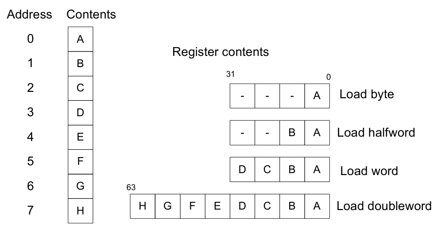
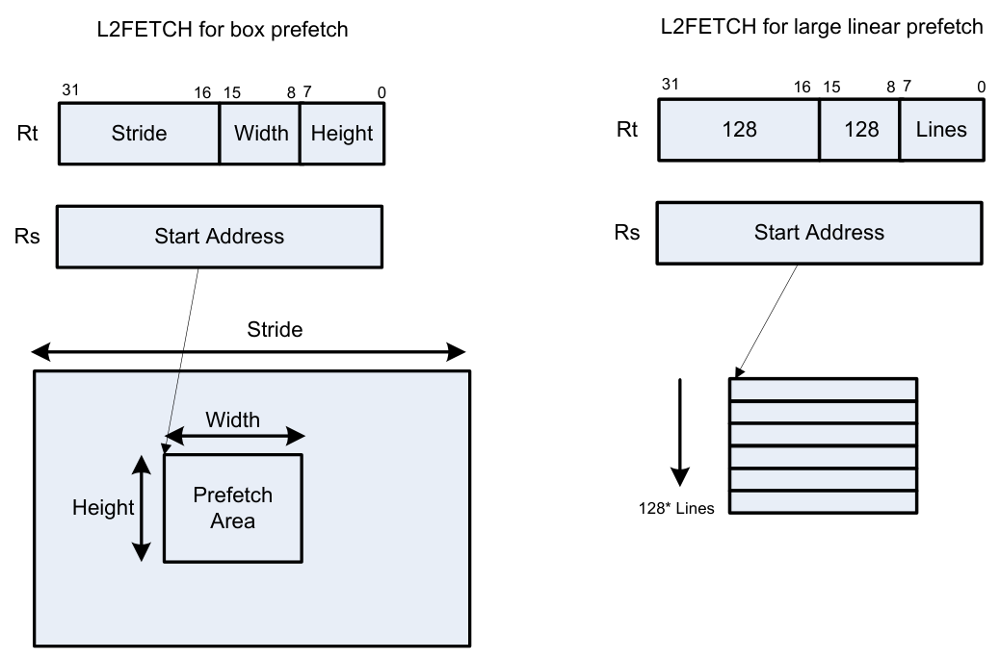

# 5 Memory

The Hexagon processor features a load/store architecture, where numeric and logical instructions operate on registers. Explicit load instructions move operands from memory to registers while store instructions move operands from registers to memory. A few instructions (known as mem-ops) perform numeric and logical operations directly on memory.

The address space is unified: all accesses target the same linear address space, which contains both instructions and data.

## 5.1 Memory model for the Hexagon processor

### 5.1.1 Address space

The Hexagon processor has a 32-bit byte-addressable memory address space. The entire 4G linear address space is addressable by the user application. A virtual-to-physical address translation mechanism is provided.

### 5.1.2 Byte order

The Hexagon processor is a little endian machine: the lowest address byte in memory is held in the least significant byte of a register, as shown in Figure 5-1.



```text
Address Contents
0 A
Register contents
1 B
31
0
2 C
- - - A Load byte
3 D
- - B A Load halfword
4 E
5 F
D C B A Load word
6 G 63
H G F E D C B A Load doubleword
7 H
```

**Figure 5-1  Hexagon processor byte order**

### 5.1.3 Alignment

Even though the Hexagon processor memory is byte-addressable, instructions and data must be aligned in memory on specific address boundaries:

- Instructions and instruction packets must be 32-bit aligned
- Data must be aligned to its native access size.

Any unaligned memory access causes a memory-alignment exception.

Use the Permute instructions in applications that must reference unaligned vector data. The loads and stores must be memory-aligned; however, the permute instructions enable easy rearrangement of the data in registers.

**Table 5-1  Memory alignment restrictions**

| Data type | Size (bits) | Exception when |
|---|---|---|
| Byte Unsigned byte | 8 | Never |
| Halfword Unsigned halfword | 16 | LSB[0] != 0¹ |
| Word Unsigned word | 32 | LSB[1:0] != 00 |
| Doubleword | 64 | LSB[2:0] != 000 |
| Instruction Instruction packet | 32 | LSB[1:0] != 00 |

¹ LSB = Least significant bits of address

## 5.2 Memory loads

Memory can be loaded in byte, halfword, word, or doubleword sizes. The data types supported are signed or unsigned. The syntax used is memXX, where XX denotes the data type.

**Table 5-2  Load instructions**

| Syntax | Source size (bits) | Destination size (bits) | Data placement | Comment |
|---|---|---|---|---|
| Rd = memub(Rs) | 8 | 32 | Low 8 bits | Zero-extend 8 to 32 bits |
| Rd = memb(Rs) | 8 | 32 | Low 8 bits | Sign-extend 8 to 32 bits |
| Rd = memuh(Rs) | 16 | 32 | Low 16 bits | Zero-extend 16 to 32 bits |
| Rd = memh(Rs) | 16 | 32 | Low 16 bits | Sign-extend 16 to 32 bits |
| Rd = memubh(Rs) | 16 | 32 | Bytes 0 and 2 | Bytes 1 and 3 zeroed¹ |
| Rd = membh(Rs) | 16 | 32 | Bytes 0 and 2 | Bytes 1 and 3 sign-extended |
| Rd = memw(Rs) | 32 | 32 | All 32 bits | Load word |
| Rdd = memubh(Rs) | 32 | 64 | Bytes 0,2,4,6 | Bytes 1,3,5,7 zeroed |
| Rdd = membh(Rs) | 32 | 64 | Bytes 0,2,4,6 | Bytes 1,3,5,7 sign-extended |
| Rdd = memd(Rs) | 64 | 64 | All 64 bits | Load doubleword |

**Table 5-2  Load instructions**

| Syntax | Source size (bits) | Destination size (bits) | Data placement | Comment |
|---|---|---|---|---|
| Ryy = memh_fifo(Rs) | 16 | 64 | High 16 bits | Shift vector and load halfword |
| deallocframe | 64 | 64 | All 64 bits | See Chapter 7 |
| dealloc_return | 64 | 64 | All 64 bits | See Chapter 7 |

¹ The memubh and membh instructions load contiguous bytes from memory (either 2 or 4 bytes) and unpack these bytes into a vector of halfwords. The instructions are useful when bytes are used as input into halfword vector operations, which is common in video and image processing.

NOTE: The memory load instructions belong to instruction class LD, and can execute only in slots 0 or 1.

## 5.3 Memory stores

Memory can be stored in byte, halfword, word, or doubleword sizes. The syntax used is memX, where X denotes the data type.

**Table 5-3  Store instructions**

| Syntax | Source size (bits) | Destination size (bits) | Comment |
|---|---|---|---|
| memb(Rs) = Rt | 32 | 8 | Store byte (bits 7:0) |
| memb(Rs) = #s8 | 8 | 8 | Store byte |
| memh(Rs) = Rt | 32 | 16 | Store lower half (bits 15:0) |
| memh(Rs) = Rt.H | 32 | 16 | Store upper half (bits 31:16) |
| memh(Rs) = #s8 | 8 | 16 | Sign-extend 8 to 16 bits |
| memw(Rs) = Rt | 32 | 32 | Store word |
| memw(Rs) = #s8 | 8 | 32 | Sign-extend 8 to 32 bits |
| memd(Rs) = Rtt | 64 | 64 | Store doubleword |
| allocframe(#u11) | 64 | 64 | See Chapter 7 |

NOTE: The memory store instructions belong to instruction class ST, and can only execute in slot 0 or – when part of a dual store – slot 1.

## 5.4 Dual stores

Two memory store instructions can appear in the same instruction packet. The resulting operation is considered a dual store. For example:

```
{
   memw(R5) = R2      // Dual store
   memh(R6) = R3
}
```

Unlike most packetized operations, dual stores do not execute in parallel (Section 3.3.1). Instead, the store instruction in Slot 1 executes first, followed by the store instruction in Slot 0.

NOTE: The store instructions in a dual store must belong to instruction class ST, and can execute only in Slots 0 and 1.

## 5.5 Slot 1 store with slot 0 load

A slot 1 store operation with a slot 0 load operation can appear in a packet. The packet attribute :mem_noshuf inhibits the instruction reordering that is otherwise done by the assembler. For example:

```
{
      memw(R5) = R2// Slot 1 store
      R3 = memh(R6)// Slot 0 load
}:mem_noshuf
```

Unlike most packetized operations, these memory operations do not execute in parallel (Section 3.3.1). Instead, the store instruction in Slot 1 executes first, followed by the load instruction in Slot 0. If the addresses of the two operations overlap, the load receives the newly stored data.

## 5.6 New-value stores

A memory store instruction can store a register that is assigned a new value in the same instruction packet (Section 3.3). This feature is expressed in assembly language by appending the suffix “.new” to the source register. For example:

```
{
   R2 = memh(R4+#8)       // load halfword
   memw(R5) = R2.new      // store newly-loaded value
}
```

New-value store instructions have the following restrictions:

- If an instruction uses auto-increment or absolute-set addressing mode (Section 5.8), its address register cannot be used as the new-value register.
- If an instruction produces a 64-bit result, its result registers cannot be used as the new-value register.
- If the instruction that sets a new-value register is conditional (Section 6.1.2), it must always execute.

NOTE: The new-value store instructions belong to instruction class NV, and can execute only in Slot 0.

## 5.7 Mem-ops

Mem-ops perform basic arithmetic, logical, and bit operations directly on memory operands, without the need for a separate load or store. Mem-ops can be performed on byte, halfword, or word sizes.

**Table 5-4  Mem-ops**

| Syntax | Operation |
|---|---|
| memXX(Rs+#u6) [+-\|&] = Rt | Arithmetic/logical on memory |
| memXX(Rs+#u6) [+-] = #u5 | Arithmetic on memory |
| memXX(Rs+#u6) = clrbit(#u5) | Clear bit in memory |
| memXX(Rs+#u6) = setbit(#u5) | Set bit in memory |

NOTE: The mem-op instructions belong to instruction class MEMOP, and can only execute in slot 0.

## 5.8 Addressing modes

**Table 5-5  Addressing modes**

| Mode | Syntax | Operation¹ |
|---|---|---|
| Absolute | `memXX(##address)` | `EA = address` |
| Absolute-set | `memXX(Re=##address)` | `EA = address`<br>`Re = address` |
| Absolute with register offset | `memXX(Ru<<#u2+##U32)` | `EA = imm + (Ru << #u2)` |
| Global pointer relative | `memXX(GP+#immediate)`<br>`memXX(#immediate)` | `EA = GP + immediate` |
| Indirect | `memXX(Rs)` | `EA = Rs` |
| Indirect with offset | `memXX(Rs+#s11)` | `EA = Rs + imm` |
| Indirect with register offset | `memXX(Rs+Ru<<#u2)` | `EA = Rs + (Ru << #u2)` |
| Indirect with auto-increment immediate | `memXX(Rx++#s4) ` | `EA = Rx;`<br>`Rx += (imm)` |
| Indirect with auto-increment register | `memXX(Rx++Mu)` | `EA = Rx;`<br>`Rx += Mu` |
| Circular with auto-increment immediate | `memXX(Rx++#s4:circ(Mu)`<br>`)` | `EA = Rx;`<br>`Rx = circ_add(Rx,imm,Mu)` |
| Circular with auto-increment register | `memXX(Rx++I:circ(Mu))` | `EA = Rx;`<br>`Rx = circ_add(Rx,I,Mu)` |
| Bit-reversed with auto-increment register | `memXX(Rx++Mu:brev)` | `EA = Rx.H + bit_reverse(Rx.L)`<br>`Rx += Mu` |

¹ EA (effective address) is equivalent to VA (virtual address).

### 5.8.1 Absolute

Absolute addressing mode uses a 32-bit constant value as the effective memory address. For example:

```
R2 = memw(##100000)   // Load R2 with word from addr 100000
memw(##200000) = R4   // Store R4 to word at addr 200000
```

### 5.8.2 Absolute-set

Absolute-set addressing mode assigns a 32-bit constant value to the specified general register, then uses the assigned value as the effective memory address. For example:

```
R2 = memw(R1=##400000)   // Load R2 with word from addr 400000
                         //  and load R1 with value 400000
memw(R3=##600000) = R4   // Store R4 to word at addr 600000
                         //  and load R3 with value 600000
```

### 5.8.3 Absolute with register offset

Absolute with register offset addressing mode performs an arithmetic left shift of a 32-bit general register value by the amount specified in a 2-bit unsigned immediate value, then adds the shifted result to an unsigned 32-bit constant value to create the 32-bit effective memory address. For example:

```
R2 = memh(R3 << #3 + ##100000) // load R2 with signed halfword
                               // from addr [100000 + (R3 << 3)]
```

The 32-bit constant value is the base address, and the shifted result is the byte offset.

NOTE: This addressing mode is useful for loading an element from a global table, where the immediate value is the name of the table, and the register holds the index of the element.

### 5.8.4 Global pointer relative

Global pointer relative addressing mode adds an unsigned offset value to the Hexagon processor GP global data pointer to create the 32-bit effective memory address. This addressing mode accesses global and static data in C.

Global pointer relative addresses can be expressed two ways in assembly language:

- By explicitly adding an unsigned offset value to register GP
- By specifying only an immediate value as the instruction operand

For example:

```
R2 = memh(GP+#100)     // Load R2 with signed halfword
                       // from [GP + 100 bytes]
```

```
R3 = memh(#2000)       // Load R3 with signed halfword
                       // from [GP + #2000 - _SDA_BASE]
```

Specifying only an immediate value causes the assembler and linker to automatically subtract the value of the special symbol `_SDA_BASE_ `from the immediate value, and use the result as the effective offset from GP.

The global data pointer is programmed in the GDP field of register GP (Section 2.2.8). This field contains an unsigned 26-bit value that specifies the most significant 26 bits of the 32-bit global data pointer. The least significant six bits of the pointer are always defined as zero.

The memory area referenced by the global data pointer is known as the global data area. It can be up to 512 KB in length, and – because of the way the global data pointer is defined – must align to a 64-byte boundary in virtual memory.

When expressed in assembly language, the offset values used in global pointer relative addressing always specify byte offsets from the global data pointer. The offsets must be integral multiples of the size of the instruction data type.

**Table 5-6  Offset ranges (global pointer relative)**

| Data type | Offset range | Offset must be multiple of |
|---|---|---|
| doubleword | 0 to 524280 | 8 |
| word | 0 to 262140 | 4 |
| halfword | 0 to 131070 | 2 |
| byte | 0 to 65535 | 1 |

NOTE: When using global pointer relative addressing, the immediate operand should be a symbol in the `.sdata` or `.sbss` section to ensure that the offset is valid.

### 5.8.5 Indirect

Indirect addressing mode uses a 32-bit value stored in a general register as the effective memory address. For example:

```
R2 = memub(R1)   // Load R2 with unsigned byte from addr R1
```

### 5.8.6 Indirect with offset

Indirect with offset addressing mode adds a signed offset value to a general register value to create the 32-bit effective memory address. For example:

```
R2 = memh(R3 + #100)   // Load R2 with signed halfword
                       // from [R3 + 100 bytes]
```

When expressed in assembly language, the offset values always specify byte offsets from the general register value. The offsets must be integral multiples of the size of the instruction data type.

**Table 5-7  Offset ranges (indirect with offset)**

| Data type | Offset range | Offset must be multiple of |
|---|---|---|
| doubleword | -8192 to 8184 | 8 |
| word | -4096 to 4092 | 4 |
| halfword | -2048 to 2046 | 2 |
| byte | -1024 to 1023 | 1 |

NOTE: The offset range is smaller for conditional instructions (Section 5.9).

### 5.8.7 Indirect with register offset

Indirect with register offset addressing mode adds a 32-bit general register value to the result created by performing an arithmetic left shift of a second 32-bit general register value by the amount specified in a 2-bit unsigned immediate value, forming the 32-bit effective memory address. For example:

```
R2 = memh(R3+R4<<#1)   // Load R2 with signed halfword
                       // from [R3 + (R4 << 1)]
```

The register values always specify byte addresses.

### 5.8.8 Indirect with auto-increment immediate

Indirect with auto-increment immediate addressing mode uses a 32-bit value stored in a general register to specify the effective memory address. However, after the address is accessed, a signed value (known as the increment) is added to the register so it specifies a different memory address (which is accessed in a subsequent instruction). For example:

```
R2 = memw(R3++#4)   // R3 contains the effective address
                    // R3 is then incremented by 4
```

When expressed in assembly language, the increment values always specify byte offsets from the general register value. The offsets must be integral multiples of the size of the instruction data type.

**Table 5-8  Increment ranges (indirect with auto-increment immediate)**

| Data type | Increment range | Increment must be a multiple of |
|---|---|---|
| doubleword | -64 to 56 | 8 |
| word | -32 to 28 | 4 |
| halfword | -16 to 14 | 2 |
| byte | -8 to 7 | 1 |

### 5.8.9 Indirect with auto-increment register

The indirect with auto-increment register addressing mode is functionally equivalent to indirect with auto-increment immediate, but uses a modifier register Mx (Section 2.2.4) instead of an immediate value to hold the increment. For example:

```
R2 = memw(R0++M1)   // The effective addr is the value of R0.
                    // Next, M1 is added to R0 and the result
                    // is stored in R0.
```

When auto-incrementing with a modifier register, the increment is a signed 32-bit value that is added to the general register. This offers two advantages over auto-increment immediate:

- A larger increment range
- Variable increments (the modifier register can be programmed at runtime)

The increment value always specifies a byte offset from the general register value.

NOTE: The signed 32-bit increment range is identical for all instruction data types (doubleword, word, halfword, and byte).

### 5.8.10 Circular with auto-increment immediate

The circular with auto-increment immediate addressing mode is a variant of indirect with auto-increment addressing – it accesses data buffers in a modulo wraparound fashion. Circular addressing is commonly used in data stream processing.

Circular addressing is expressed in assembly language with the address modifier “`:circ(Mx)`”, where Mx specifies a modifier register that is programmed to specify the circular buffer (Section 2.2.4). For example:

```
R0 = memb(R2++#4:circ(M0))   // Load from R2 in circ buf specified
                             //  by M0
memw(R2++#8:circ(M1)) = R0   // Store to R2 in circ buf specified
                             //  by M1
```

Program the following elements to set up circular addressing:

- Set the Length field of the `Mx` register to the length (in bytes) of the circular buffer to access. A circular buffer can be from 4 to (128K-1) bytes long.
- Always set bits 27:24 of the Mx register to 0.
- Set the circular start register CSx that corresponds to Mx (CS0 for M0, CS1 for M1) to the start address of the circular buffer.

In circular addressing, after memory is accessed at the address specified in the general register, the general register is incremented by the immediate increment value and then modulo’d by the circular buffer length to implement wraparound access of the buffer.

When expressed in assembly language, the increment values always specify byte offsets from the general register value. The offsets must be integral multiples of the size of the instruction data type.

**Table 5-9  Increment ranges (circular with auto-increment immediate addressing)**

| Data type | Increment range | Increment must be a multiple of |
|---|---|---|
| doubleword | -64 to 56 | 8 |
| word | -32 to 28 | 4 |
| halfword | -16 to 14 | 2 |
| byte | -8 to 7 | 1 |

When programming a circular buffer, the following rules apply:

- The start address must be aligned to the native access size of the buffer elements.
- ABS(Increment) < Length. The absolute value of the increment must be less than the buffer length.
- Access size < (Length-1). The memory access size (1 for byte, 2 for halfword, 4 for word, 8 for doubleword) must be less than (Length-1).
- Buffers must not wrap around in the 32-bit address space.

NOTE: If any of these rules are not followed, the execution result is undefined.

The following example sets up and accesses a 150-byte circular buffer:

```
R4.H = #0                    // M0[27:24]= 0x0
R4.L = #150                  // length = 150
M0 = R4
R2 = ##cbuf                  // Start addr = cbuf
CS0 = R2
R0 = memb(R2++#4:circ(M0))   // Load byte from circ buf
                             // specified by M0/CS0
                             // inc R2 by 4 after load
                             // wrap R2 around if >= 150
```

The following C function describes the behavior of the circular add function:

```
unsigned int
fcircadd(unsigned int pointer, int offset,
   unsigned int M_reg, unsigned int CS_reg)
{
   unsigned int length;
   int new_pointer, start_addr, end_addr;
```

```
   length = (M_reg&0x01ffff);  // Lower 17 bits gives buffer size
   new_pointer = pointer+offset;
   start_addr = CS_reg;
   end_addr = CS_reg + length;
   if (new_pointer >= end_addr) {
      new_pointer -= length;
} else if (new_pointer < start_addr) {
      new_pointer += length;
}
   return (new_pointer);
}
```

### 5.8.11 Circular with auto-increment register

The circular with auto-increment register addressing mode is functionally equivalent to circular with auto-increment immediate, but uses a register instead of an immediate value to hold the increment.

Register increments are specified in circular addressing instructions by using the symbol `I `as the increment (instead of an immediate value). For example:

```
R0 = memw(R2++I:circ(M1))    // Load byte with incr of I*4 from
                             // circ buf specified by M1/CS1
```

When auto-incrementing with a register, the increment is a signed 11-bit value that is added to the general register. This offers two advantages over circular addressing with immediate increments:

- Larger increment ranges
- Variable increments (since the increment register can be programmed at runtime)

The circular register increment value is programmed in the `I` field of the modifier register Mx (Section 2.2.4) as part of the circular data access set up. This register field holds the signed 11-bit increment value.

Increment values are expressed in units of the buffer element data type, and are automatically scaled at runtime to the proper data access size.

**Table 5-10  Increment ranges (circular with auto-increment register addressing)**

| Data type | Increment range | Increment must be multiple of |
|---|---|---|
| doubleword | -8192 to 8184 | 8 |
| word | -4096 to 4092 | 4 |
| halfword | -2048 to 2046 | 2 |
| byte | -1024 to 1023 | 1 |

When programming a circular buffer (with either a register or immediate increment), all the rules that apply to circular addressing must be followed – see Section 5.8.10.

NOTE: If any of these rules are not followed, the execution result is undefined.

### 5.8.12 Bit-reversed with auto-increment register

The bit-reversed with auto-increment register addressing mode is a variant of indirect with auto-increment addressing – it accesses data buffers using an address value that is the bit-wise reversal of the value stored in the general register. Bit-reversed addressing is used in fast Fourier transforms (FFT) and Viterbi encoding.

The bit-wise reversal of a 32-bit address value is defined as follows:

- The lower 16 bits are transformed by exchanging bit 0 with bit 15, bit 1 with bit 14, and so on.
- The upper 16 bits remain unchanged.

Bit-reversed addressing is expressed in assembly language with the address modifier “`:brev`”. For example:

```
R2 = memub(R0++M1:brev)  // Address is (R0.H | bitrev(R0.L))
                         // Orginal R0 (not reversed) is added
                         // to M1 and written back to R0
```

The initial values for the address and increment must be set in bit-reversed form, with the hardware bit-reversing the bit-reversed address value to form the effective address.

The buffer length for a bit-reversed buffer must be an integral power of two, with a maximum length of 64K bytes.

To support bit-reversed addressing, buffers must be properly aligned in memory. A bit-reversed buffer is properly aligned when the starting byte address of the buffer is aligned to a power of two greater than or equal to the buffer size (in bytes). For example, the following bit-reversed buffer is aligned to 1024 bytes because the buffer size is 1024 bytes (256 integer words × 4 bytes), and 1024 is an integral power of 2:

```
int bitrev_buf[256] __attribute__((aligned(1024)));
```

The buffer location pointer for a bit-reversed buffer must be initialized so that the least-significant 16 bits of the address value are bit-reversed.

The increment value must be initialized to the value `bitreverse(buffer_size_in_bytes/2), ` where `bitreverse` is defined as bit-reversing the least-significant 16 bits while leaving the remaining bits unchanged.

NOTE: To simplify the initialization of the bit-reversed pointer, bit-reversed buffers can be aligned to a 64K byte boundary. This initializes the bit-reversed pointer to the base address of the bit-reversed buffer, with no bit-reversing required for the least-significant 16 bits of the pointer value (which are set to 0 by the 64K alignment).

Because buffers allocated on the stack only have an alignment of 8 bytes or less, in most cases bit-reversed buffers should not be declared on the stack.

After a bit-reversed memory access is complete, the general register is incremented by the register increment value. The bit-reversal that is performed as part of the memory access never affects the value in the general register.

NOTE: The Hexagon processor supports only register increments for bit-reversed addressing – it does not support immediate increments.

## 5.9 Conditional load/stores

Some load and store instructions can conditionally execute based on predicate values that were set in a previous instruction. The compiler generates conditional loads and stores to increase instruction-level parallelism.

Conditional loads and stores are expressed in assembly language with the instruction prefix `if ` (`pred_expr`), where `pred_expr` specifies a predicate register expression (Section 6.1). For example:

```
   if (P0) R0 = memw(R2)             // Conditional load
   if (!P2) memh(R3 + #100) = R1     // Conditional store
   if (P1.new) R3 = memw(R3++#4)     // Conditional load
```

Not all addressing modes are supported in conditional loads and stores. Table 5-11 lists the supported modes.

**Table 5-11  Addressing modes (conditional load/store)**

| Addressing mode | Conditional |
|---|---|
| Absolute | Yes |
| Absolute-set | No |
| Absolute with register offset | No |
| Global pointer relative | No |
| Indirect | Yes |
| Indirect with offset | Yes |
| Indirect with register offset | Yes |
| Indirect with auto-increment immediate | Yes |
| Indirect with auto-increment register | No |
| Circular with auto-increment immediate | No |
| Circular with auto-increment register | No |
| Bit-reversed with auto-increment register | No |

When a conditional load or store instruction uses Indirect with offset addressing mode, the offset range is smaller than the range normally defined for indirect-with-offset addressing.

**Table 5-12  Conditional and normal offset ranges (indirect with offset addressing)**

| Data type | Offset range<br>(conditional) | Offset range<br>(normal) | Offset must be multiple of |
|---|---|---|---|
| doubleword | 0 to 504 | -8192 to 8184 | 8 |
| word | 0 to 252 | -4096 to 4092 | 4 |
| halfword | 0 to 126 | -2048 to 2046 | 2 |
| byte | 0 to 63 | -1024 to 1023 | 1 |

NOTE: For more information on conditional execution, see Chapter 6.

## 5.10 Cache memory

The Hexagon processor has a cache-based memory architecture:

- A level 1 instruction cache holds recently fetched instructions.
- A level 1 data cache holds recently accessed data memory.

Load/store operations that access memory through the level 1 caches are referred to as cached accesses.

Load/stores that bypass the level 1 caches are referred to as uncached accesses.

The memory management unit (MMU) of the Hexagon processor can configure specific memory areas to perform cached or uncached accesses. The operating system is responsible for programming the MMU.

Two types of caching are supported (as cache modes):

- Write-through caching keep the cache data consistent with external memory by always writing to the memory any data that is stored in the cache.
- Writeback caching stores data in the cache without being immediately written to external memory. Cached data that is inconsistent with external memory is referred to as dirty.

The Hexagon processor includes dedicated cache maintenance instructions that push out dirty data to external memory.

### 5.10.1 Uncached memory

In some cases, load/store operations must bypass the cache memories and be serviced externally (for example, when accessing memory-mapped I/O, registers, and peripheral devices, or other system defined entities). The operating system is responsible for configuring the MMU to generate uncached memory accesses.

Uncached memory is categorized into two types:

- Device-type is for memory access that has side-effects (such as a memory-mapped FIFO peripheral). The hardware ensures that interrupts do not cancel a pending device access. The hardware does not reorder device accesses. Mark peripheral control registers as device-type.
- Uncached-type is for memory-like memory. No side effects are associated with an access. The hardware can load from uncached memory multiple times. The hardware can reorder uncached accesses.

For instruction accesses, device-type memory is functionally identical to uncached-type memory. For data accesses, they are different.

Code can bypass the L1 cache and execute directly from the L2 cache .

### 5.10.2 Tightly coupled memory

The Hexagon processor supports tightly coupled instruction memory at level 1, which is defined as memory with similar access properties to the instruction cache.

Tightly coupled memory is also supported at level 2, which is defined as backing store to the primary caches.

### 5.10.3 Cache maintenance operations

The Hexagon processor includes dedicated cache maintenance instructions that invalidate cache data or push dirty data out to external memory.

The cache maintenance instructions operate on specific memory addresses. If the instruction causes an address error (due to a privilege violation), the processor raises an exception.

NOTE: The exception to this rule is the dcfetch operation, which never causes a processor exception.

Whenever maintenance operations are performed on the instruction cache, the `isync` instruction (Section 5.11) must execute immediately after. This instruction ensures that subsequent instructions observe the maintenance operations.

**Table 5-13  Cache instructions (user-level)**

| Syntax | Permitted In packet | Operation |
|---|---|---|
| `icinva(Rs)` | Solo¹ | Instruction cache invalidate. Look up the instruction cache at address Rs. If the address is in the cache, invalidate the cache. |
| `dccleaninva(Rs)` | Slot 1 empty or ALU32 only | Data cache clean and invalidate. Look up the data cache at the address Rs. If the address is in the cache and has dirty data, flush that data out to memory. The cache line is then invalidated, whether dirty data was written or not. |
| `dccleana(Rs)` | Slot 1 empty or ALU32 only | Data cache clean. Look up the data cache at the address Rs. If the address is in the cache and has dirty data, flush that data out to memory. |
| `dcinva(Rs)` | Slot 1 empty or ALU32 only | Equivalent to `dccleaninva(Rs)`. |
| `dcfetch(Rs)` | Normal² | Data cache prefetch. Prefetch data at address Rs into the data cache.<br>NOTE: This instruction does not cause an exception. |
| `l2fetch(Rs, Rt)` | ALU32 or XTYPE only | L2 cache prefetch. Prefetch data from memory specified by Rs and Rt into the L2 cache. |

¹ means that the instruction must not be grouped with other instructions in a packet.

Solo

² means that the normal instruction-grouping constraints apply.

Normal

### 5.10.4 L2 cache operations

Cache maintenance operations operate on both the L1 and L2 caches.

The data cache coherency operations (including clean, invalidate, and clean and invalidate) affect both the L1 and L2 caches, and ensure that the memory hierarchy remains coherent. However, the instruction cache invalidate operation affects only the L1 cache. Therefore, invalidating instructions that might be in the L1 or L2 caches requires a two-step procedure:

1. Use `icinva` to invalidate instructions from the L1 cache.

2. Use `dcinva` separately to invalidate instructions from the L2 cache.

### 5.10.5 Cache line zero

The Hexagon processor includes the instruction `dczeroa,` which allocates a line in the L1 data cache and clears it (by storing all zeros). The behavior is as follows:

- The Rs register value must be 32-byte aligned. If it is unaligned, the processor raises an unaligned error exception.
- For a cache hit, the specified cache line is cleared (written with all zeros) and made dirty.
- For a cache miss, the specified cache line is not fetched from external memory. Instead, the line is allocated in the data cache, cleared, and made dirty.

This instruction is useful in optimizing write-only data. It allows for the use of writeback pages – which are the most power and performance efficient – without the need to initially fetch the line to write. This use of writeback pages removes unnecessary read bandwidth and latency.

NOTE: The `dczeroa` operation has the same exception behavior as writeback stores.

A packet with `dczeroa` must have slot 1 either empty or containing an ALU32 instruction.

### 5.10.6 Cache prefetch

The Hexagon processor supports the following types of cache prefetching.

5.10.6.1 Hardware-based instruction cache prefetching

L1 and L2 instruction cache prefetching can be enabled or disabled on a per hread basis by setting the HFI field in the User status register.

5.10.6.2 Software-based data cache prefetching

The Hexagon processor includes the dcfetch instruction, which queries the L1 data cache based on the address specified in the instruction:

- If the address is present in the cache, no action is taken.
- If the cache line for the address is missing, the processor attempts to fill the cache line from the next level of memory. The thread does not stall, but rather continues executing while the cache line fill occurs in the background.
- If the address is invalid, no exception is generated and the dcfetch instruction is treated as a NOP.

5.10.6.3 Software-based l2fetch

The l2fetch instruction provides powerful L2 prefetching of data or instructions. L2fetch specifies an area of memory that the hardware prefetch engine of the Hexagon processor prefetches. l2fetch specifies two registers (Rs and Rt) as operands. Rs contains the 32-bit virtual start address of the memory area to prefetch. Rt contains three bit fields that further specify the memory area:

- Rt[15:8] – `Width,` specifies the width (in bytes) of a block of memory to fetch.
- Rt[7:0] – `Height`, specifies the number of `Width`-sized blocks to fetch.
- Rt[31:16] – `Stride`, specifies an unsigned byte offset that increments the pointer after each `Width`-sized block is fetched.

The l2fetch instruction is nonblocking: it initiates a prefetch operation that the prefetch engine performs in the background while the thread continues to execute Hexagon processor instructions.

The prefetch engine requests all lines in the specified memory area. If the line(s) of interest are already resident in the L2 cache, the prefetch engine performs no action. If the lines are not in the L2 cache, the prefetch engine attempts to fetch them.

The prefetch engine makes a best effort to prefetch the requested data, and attempts to perform prefetching at a lower priority than demand fetches. This prevents the prefetch engine from adding bus traffic when the system is under a heavy load.

If a program executes an l2fetch instruction while the prefetch operation from a previous l2fetch is still active, the prefetch engine halts the current prefetch operation.

NOTE: Executing l2fetch with any bit field operand programmed to zero cancels prefetch activity.

The status of the current prefetch operation is maintained in the PFA field of the user status register. This field can determine whether a prefetch operation is complete.

With respect to MMU permissions and error checking, the l2fetch instruction behaves similarly to a load instruction. If the virtual address causes a processor exception, the exception is taken. This differs from the dcfetch instruction, which is treated as a NOP in the presence of a translation/protection error.

NOTE: Prefetches are dropped when the generated prefetch address resides on a different page than the start address. The programmer must use sufficiently large pages to ensure that this does not occur.

Figure 5-2 shows two examples of using the l2fetch instruction. The first shows a box prefetch, where a 2D range of memory is defined within a larger frame. The second example shows a prefetch for a large linear memory area of size (`Lines `* 128).



```text
L2FETCH for box prefetch L2FETCH for large linear prefetch
31 16 15 8 7 0
31 16 15 8 7 0
Rt Stride Width Height Rt 128 128 Lines
Rs Start Address Rs Start Address
Stride
Width
Prefetch
Height128 Lines
Area
```

**Figure 5-2  L2fetch instruction**

5.10.6.4 Hardware-based data cache prefetching

L1 data cache prefetching is enabled or disabled on a per-thread basis by setting the HFD field in the User status register.

When data cache prefetching is enabled, the Hexagon processor observes patterns of data cache misses and attempts to predict future misses based on recurring patterns of misses where the addresses are separated by a constant stride. If such patterns are found, the processor attempts to automatically prefetch future cache lines.

Data cache prefetching is user-enabled at four levels of aggressiveness:

- HFD = 00: No prefetching
- HFD = 01: Prefetch up to four lines for misses originating from a load, with a post-update addressing mode that occurs within a hardware loop
- HFD = 10: Prefetch up to four lines for misses originating from loads that occur within a hardware loop
- HFD = 11: Prefetch up to eight lines for misses originating from loads

## 5.11 Memory ordering

Some devices might require synchronization of stores and loads when they are accessed. In this case, a set of processor instructions enable programmer control of the synchronization and ordering of memory accesses.

**Table 5-14  Memory ordering instructions**

| Syntax | Operation |
|---|---|
| isync | Instruction synchronize.<br>This instruction should execute after an instruction cache maintenance operation. |
| syncht | Synchronize transactions.<br>Perform heavyweight synchronization. Ensure that previous program transactions (for example, memw_locked, cached and uncached load/store) are complete before execution resumes past this instruction.<br>The syncht instruction ensures that outstanding memory operations from all threads are complete before the syncht instruction is committed. |
| barrier | Set memory barrier.<br>Ensure proper ordering between the program accesses performed before the instruction and program accesses performed after the instruction.<br>All accesses before the barrier are globally observable before any access occurring after the barrier can be observed.<br>The barrier instruction ensures that all outstanding memory operations from the thread executing the barrier are complete before the instruction is committed. |

Data memory accesses and program memory accesses are treated separately and held in separate caches. Software should ensure coherency between data and program code if necessary.

For example, generated or self-modified code is placed in the data cache and can be inconsistent with the program cache. The software must explicitly force modified data cache lines to memory (either by using a write-through policy, or through explicit cache clean instructions). Use a barrier instruction to ensure completion of the stores. Finally, invalidate relevant instruction cache contents so the new instructions can be refetched.

Here is the recommended code sequence to change and execute an instruction:

|  |  |
|---|---|
| `ICINVA(R1)` | `// Clear code from instruction cache` |
| `ISYNC` | `// Ensure that ICINVA is finished` |
| `MEMW(R1)=R0` | `// Write the new instruction` |
| `DCCLEANINVA(R1)` | `// Force data out of data cache` |
| `SYNCHT` | `// Ensure that it is in memory` |
| `JUMPR R1` | `// Can now execute code at R1` |

NOTE: The memory-ordering instructions must not be grouped with other instructions in a packet, otherwise the behavior is undefined.

This code sequence differs from the one used in previous processor versions.

## 5.12 Atomic operations

The Hexagon processor includes a load locked/store conditional (LL/SC) mechanism to provide the atomic read-modify-write operation that is necessary to implement synchronization primitives such as semaphores and mutexes.

These primitives synchronize the execution of different software programs that run concurrently on the Hexagon processor. They can also provide atomic memory support between the Hexagon processor and external blocks.

**Table 5-15  Atomic instructions**

| Syntax | Description |
|---|---|
| `Rd = memw_locked(Rs)` | Load locked word. Reserve lock on word at address Rs. |
| `memw_locked(Rs,Pd) = Rt` | Store conditional word. If no other atomic operation has been performed at the address (that is, atomicity is ensured), perform the store to the word at address Rs and return TRUE in Pd; otherwise return FALSE.<br>TRUE indicates that the LL and SC operations were performed atomically. |
| `Rdd = memd_locked(Rs)` | Load locked doubleword. Reserve lock on doubleword at address Rs. |
| `memd_locked(Rs,Pd) = Rtt` | Store conditional doubleword. If no other atomic operation has been performed at the address (that is, atomicity is ensured), perform the store to the doubleword at address Rs and return TRUE in Pd; otherwise return FALSE.<br>TRUE indicates that the LL and SC operations have been performed atomically. |

Here is the recommended code sequence to acquire a mutex:

```
// Assume mutex address is held in R0
// Assume R1,R3,P0,P1 are scratch
```

```
lockMutex:
   R3 = #1
lock_test_spin:
   R1 = memw_locked(R0)          // Do normal test to wait
   P1 = cmp.eq(R1,#0)            // for lock to be available
   if (!P1) jump lock_test_spin
   memw_locked(R0,P0) = r3       // Do store conditional (SC)
   if (!P0) jump lock_test_spin  // was LL and SC done atomically?
```

Here is the recommended code sequence to release a mutex:

```
// Assume mutex address is held in R0
// Assume R1 is scratch
```

```
R1 = #0
memw(R0) = R1
```

Atomic memX_locked operations are supported for external accesses that use the advanced extensible interface (AXI) bus and support atomic operations. To perform load-locked operations with external memory, the operating system must define the memory page as uncacheable, otherwise the processor behavior is undefined.

If a load locked operation is performed on an address that does not support atomic operations, the behavior is undefined.

For atomic operations on cacheable memory, the page attributes must be set to cacheable and writeback, otherwise the behavior is undefined. Cacheable memory must be used when threads must synchronize with each other.

NOTE: External memX_locked operations are not supported on the AHB. If they are performed on the AHB, the behavior is undefined.
