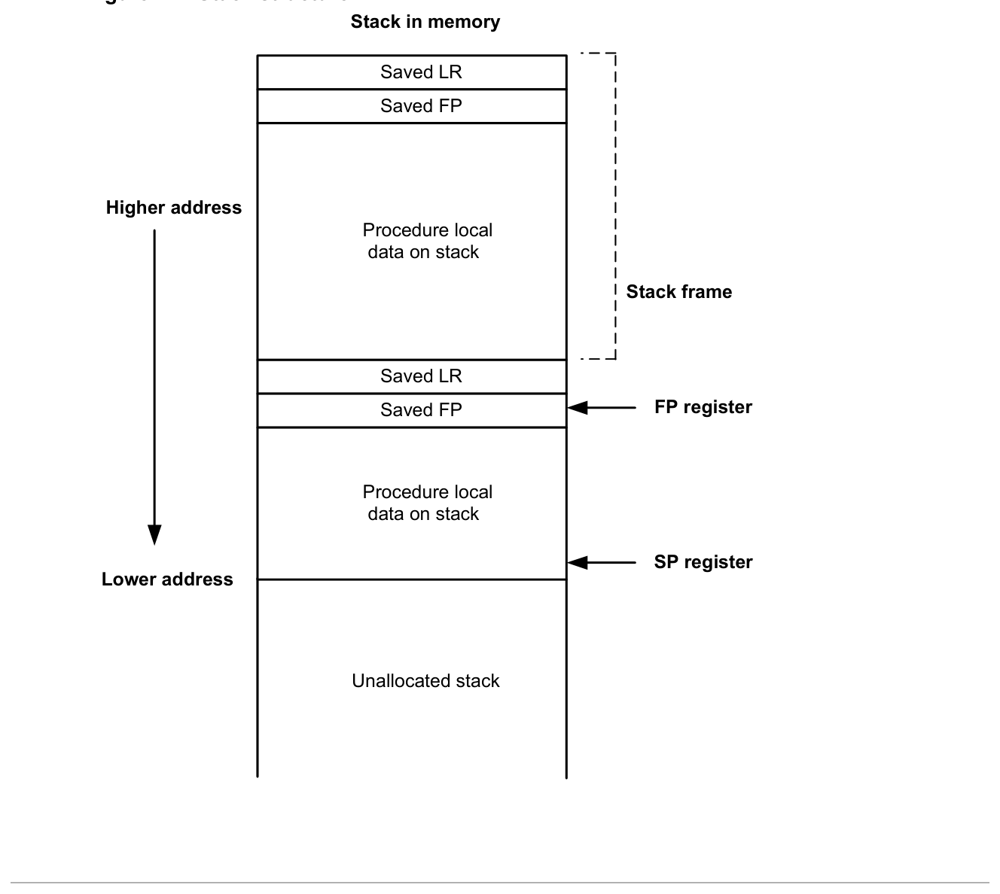

# 7 Software Stack

The Hexagon processor includes dedicated registers and instructions to support a call stack for subroutine execution.

The stack structure follows standard C conventions.

## 7.1 Stack structure

The stack is defined to grow from high addresses to low addresses. The stack pointer register SP points to the data element that is on the top of the stack.



```text
Stack in memory
Saved LR
Saved FP
Higher address
Procedure local
data on stack
Stack frame
Saved LR
Saved FP FP register
Procedure local
data on stack
SP register
Lower address
Unallocated stack
```

**Figure 7-1  Stack structure**

NOTE: The Hexagon processor supports three dedicated stack instructions: allocframe, deallocframe, and dealloc_return (Section 7.5).

The SP address must always remain 8-byte aligned for the stack instructions to work properly.

## 7.2 Stack frames

The stack stores stack frames, which are data structures that store state information on the active subroutines in a program (for example, those that were called but have not yet returned). Each stack frame corresponds to an active subroutine in the program.

A stack frame contains the following elements:

- The local variables and data used by the subroutine
- The return address for the subroutine call (pushed from the link register LR)
- The address of the previous stack frame allocated on the stack (pushed from the frame pointer register FP)

The frame pointer register FP always contains the address of the saved frame pointer in the current stack frame. It facilitates debugging by enabling a debugger to examine the stack in memory and easily determine the call sequence, function parameters, and so on.

NOTE: For leaf functions, it is often unnecessary to save FP and LR. In this case, FP contains the frame pointer of the calling function, not the current function.

## 7.3 Stack protection

The Hexagon processor supports the following features to protect the integrity of the software stack.

### 7.3.1 Stack bounds checking

Stack bounds checking prevents a stack frame from being allocated past the lower boundary of the software stack.

FRAMELIMIT is a 32-bit control register that stores a memory address that specifies the lower bound of the memory area reserved for the software stack. When the allocframe instruction allocates a new stack frame, it compares the new stack pointer value in SP with the stack bound value in FRAMELIMIT. If SP is less than FRAMELIMIT, the Hexagon processor raises exception 0x27 (Section 8.10).

NOTE: Stack bounds checking is performed when the processor is in User and Guest modes but not in Monitor mode.

### 7.3.2 Stack smashing protection

Stack smashing is a technique malicious code uses to gain control over an executing program. Malicious code causes buffer overflows to occur in the local data of a procedure, with the goal of modifying the subroutine return address stored in a stack frame so it points to the malicious code instead of the intended return code.

Stack smashing protection prevents stack smashing by scrambling the subroutine return address when a new stack frame is allocated, and then unscrambling the return address when the frame is deallocated. Because the value in FRAMEKEY changes regularly and varies from device to device, it becomes difficult to precalculate a malicious return address.

FRAMEKEY is a 32-bit control register which scrambles return addresses stored on the stack:

- In the allocframe instruction, the 32-bit return address in link register LR is XOR-scrambled with the value in FRAMEKEY before it is stored in the new stack frame.
- In deallocframe and dealloc_return, the return address loaded from the stack frame is unscrambled with the value in FRAMEKEY before it is stored in LR.

After a processor reset, the default value of FRAMEKEY is 0. If this value is not changed, stack smashing protection is effectively disabled.

NOTE: Each hardware thread has its own instance of the FRAMEKEY register.

## 7.4 Stack registers

**Table 7-1  Stack registers**

| Register | Name | Description | Alias |
|---|---|---|---|
| SP | Stack pointer | Points to topmost stack element in memory | R29 |
| FP | Frame pointer | Points to previous stack frame on stack | R30 |
| LR | Link register | Contains return address of subroutine call | R31 |
| FRAMELIMIT | Frame limit register | Contains lowest address of stack area | C16 |
| FRAMEKEY | Frame key register | Contains scrambling key for return addresses | C17 |

NOTE: SP, FP, and LR are aliases of three General registers. These general registers are conventionally dedicated for use as stack registers.

## 7.5 Stack instructions

The Hexagon processor includes the allocframe and deallocframe instructions to efficiently allocate and deallocate stack frames on the call stack.

**Table 7-2  Stack instructions**

| Syntax | Operation |
|---|---|
| `allocframe(#u11:3)` | Allocate stack frame.<br>This instruction is used after a call. It first XORs the values in LR and FRAMEKEY, and pushes the resulting scrambled return address and FP to the top of the stack.<br>Next, it subtracts an unsigned immediate from SP to allocate room for local variables. If the resulting SP is less than FRAMELIMIT, the processor raises exception 0x27. Otherwise, SP is set to the new value, and FP is set to the address of the old frame pointer on the stack.<br>The immediate operand as expressed in assembly syntax specifies the byte offset. This value must be 8-byte aligned. The valid range is from 0 to 16 KB. |
| `deallocframe` | Deallocate stack frame.<br>Use this instruction before a return to free a stack frame. It first loads the saved FP and LR values from the address at FP, and XORs the restored LR with the value in FRAMEKEY to unscramble the return address. SP is then pointed back to the previous frame. |
| `dealloc_return` | Subroutine return with stack frame deallocate.<br>Perform the deallocframe operation, and then perform the subroutine return (Section 8.3.3) to the target address loaded from LR by deallocframe. |

NOTE: The allocframe and deallocframe instructions load and store the LR and FP registers on the stack as a single aligned 64-bit register pair (LR:FP).
