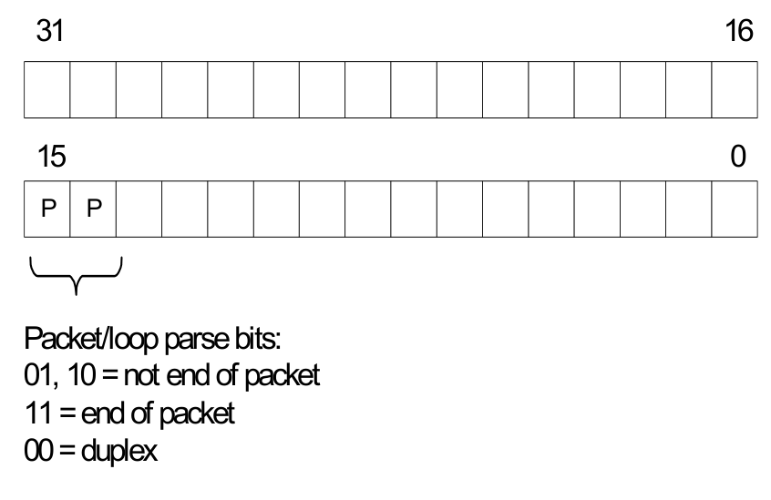

[← Contents](README.md)

# 10 Instruction Encoding

## 10.1 Instructions

Hexagon processor instructions are encoded in a 32-bit instruction word. The instruction word format varies according to the instruction type.

The instruction words contain two types of bit fields:

- Common fields appear in every processor instruction, and are defined the same in all instructions.
- Instruction-specific fields appear only in some instructions, or vary in definition across the instruction set.

**Table 10-1  Instruction bit fields**

| Name | Description | Type |
|---|---|---|
| ICLASS | Instruction class | Common |
| Parse | Packet / loop bits |  |

**Table 10-1  Instruction bit fields**

| Name | Description | Type |
|---|---|---|
| MajOp Maj | Major opcode | Instruction-specific |
| MinOp Min | Minor opcode |  |
| RegType | Register type (32-bit, 64-bit) |  |
| Type | Operand type (byte, halfword, and so on) |  |
| Amode | Addressing mode |  |
| dn | Destination register operand |  |
| sn | Source register operand |  |
| tn | Source register operand #2 |  |
| xn | Source and destination register operand |  |
| un | Predicate or modifier register operand |  |
| sH | Source register bit field (Rs.H or Rs.L) |  |
| tH | Source register #2 bit field (Rt.H or Rt.L) |  |
| UN | Unsigned operand |  |
| Rs | No source register read |  |
| P | Predicate expression |  |
| PS | Predicate sense (Pu or !Pu) |  |
| DN | Dot-new predicate |  |
| PT | Predict taken |  |
| sm | Supervisor mode only |  |

NOTE: In some cases, instruction-specific fields encode instruction attributes other than the ones described for the fields in Table 10-1.

##### Reserved bits

Some instructions contain reserved bits that do not currently encode instruction attributes. Always set these bits to 0 to ensure compatibility with any future changes in the instruction encoding.

NOTE: Reserved bits appear as ‘`-`’ characters in the instruction encoding tables.

## 10.2 Sub-instructions

To reduce code size, the Hexagon processor supports the encoding of certain pairs of instructions in a single 32-bit container. Instructions encoded this way are sub-instructions, and the containers are duplexes (Section 10.3).

Sub-instructions are limited to certain commonly-used instructions:

- Arithmetic and logical operations
- Register transfer
- Loads and stores
- Stack frame allocation/deallocation
- Subroutine return

Table 10-2 lists the sub-instructions along with the group identifiers that encode them in duplexes.

Sub-instructions can access only a subset of the general registers (R0 to R7, R16 to R23). Table 10-3 lists the sub-instruction register encodings.

NOTE: Certain sub-instructions implicitly access registers such as SP (R29).

**Table 10-2  Sub-instructions**

| Group | Instruction | Description |
|---|---|---|
| L1 | `Rd = memw(Rs+#u4:2)` | Word load |
| L1 | `Rd = memub(Rs+#u4:0)` | Unsigned byte load |
| Group | Instruction | Instruction |
| L2 | `Rd = memh/memuh(Rs+#u3:1)` | Halfword loads |
| L2 | `Rd = memb(Rs+#u3:0)` | Signed byte load |
| L2 | `Rd = memw(r29+#u5:2)` | Load word from stack |
| L2 | `Rdd = memd(r29+#u5:3)` | Load pair from stack |
| L2 | `deallocframe` | Deallocate stack frame |
| L2 | `if ([!]P0) dealloc_return`<br>`if ([!]P0.new) dealloc_return:nt` | Deallocate stack frame and return |
| L2 | `jumpr R31`<br>`if ([!]P0) jumpr R31`<br>`if ([!]P0.new) jumpr:nt R31` | Return |
| Group | Instruction | Instruction |
| S1 | `memw(Rs+#u4:2) = Rt` | Store word |
| S1 | `memb(Rs+#u4:0) = Rt` | Store byte |
| Group | Instruction | Instruction |
| S2 | `memh(Rs+#u3:1) = Rt` | Store halfword |
| S2 | `memw(r29+#u5:2) = Rt` | Store word to stack |
| S2 | `memd(r29+#s6:3) = Rtt` | Store pair to stack |
| S2 | `memw(Rs+#u4:2) = #U1` | Store immediate word #0 or #1 |
| S2 | `memb(Rs+#u4) = #U1` | Store immediate byte #0 or #1 |
| S2 | `allocframe(#u5:3)` | Allocate stack frame |
| Group | Instruction | Instruction |
| A | `Rx = add(Rx,#s7)` | Add immediate |
| A | `Rd = Rs` | Transfer |

**Table 10-2  Sub-instructions (cont.)**

| Group | Instruction | Description |
|---|---|---|
| A | `Rd = #u6` | Set to unsigned immediate |
| A | `Rd = #-1` | Set to -1 |
| A | `if ([!]P0[.new]) Rd = #0` | Conditional clear |
| A | `Rd = add(r29,#u6:2)` | Add immediate to stack pointer |
| A | `Rx = add(Rx,Rs)` | Register add |
| A | `P0 = cmp.eq(Rs,#u2)` | Compare register equal immediate |
| A | `Rdd = combine(#0,Rs)` | Combine zero and register into pair |
| A | `Rdd = combine(Rs,#0)` | Combine register and zero into pair |
| A | `Rdd = combine(#u2,#U2)` | Combine immediates into pair |
| A | `Rd = add(Rs,#1)`<br>`Rd = add(Rs,#-1)` | Add and subtract 1 |
| A | `Rd = sxth/sxtb/zxtb/zxth(Rs)` | Sign- and zero-extends |
| A | `Rd = and(Rs,#1)` | And with 1 |

**Table 10-3  Sub-instruction registers**

| Register | Encoding |
|---|---|
| `Rs,Rt,Rd,Rx` | `0000 = R0`<br>`0001 = R1`<br>`0010 = R2`<br>`0011 = R3`<br>`0100 = R4`<br>`0101 = R5`<br>`0110 = R6`<br>`0111 = R7`<br>`1000 = R16`<br>`1001 = R17`<br>`1010 = R18`<br>`1011 = R19`<br>`1100 = R20`<br>`1101 = R21`<br>`1110 = R22`<br>`1111 = R23` |
| `Rdd,Rtt` | `000 = R1:0`<br>`001 = R3:2`<br>`010 = R5:4`<br>`011 = R7:6`<br>`100 = R17:16`<br>`101 = R19:18`<br>`110 = R21:20`<br>`111 = R23:22` |

## 10.3 Duplexes

A duplex is encoded as a 32-bit instruction with bits [15:14] set to 00. The sub-instructions that comprise a duplex are encoded as 13-bit fields in the duplex.

An instruction packet can contain one duplex and up to two other (non-duplex) instructions. The duplex must always appear as the last word in a packet.

The sub-instructions in a duplex always execute in slot 0 and slot 1.

**Table 10-4  Duplex instruction encoding**

| Bits | Name | Description |
|---|---|---|
| 15:14 | Parse bits | 00 = Duplex type, ends the packet and indicates that word contains two sub-instructions |
| 12:0 | Sub-instruction low | Encodes slot 0 sub-instruction |
| 28:16 | Sub-instruction high | Encodes slot 1 sub-instruction |
| 31:29, 13 | 4-bit ICLASS | Indicates the group to which the low and high sub-instructions belong. |

The duplex ICLASS field values that specify the group of each sub-instruction in a duplex are shown in Table 10-5

**Table 10-5  Duplex ICLASS field**

| ICLASS | Low slot 0 subinsn type | High slot 1 subinsn type |
|---|---|---|
| 0x0 | L1-type | L1-type |
| 0x1 | L2-type | L1-type |
| 0x2 | L2-type | L2-type |
| 0x3 | A-type | A-type |
| 0x4 | L1-type | A-type |
| 0x5 | L2-type | A-type |
| 0x6 | S1-type | A-type |
| 0x7 | S2-type | A-type |
| 0x8 | S1-type | L1-type |
| 0x9 | S1-type | L2-type |
| 0xA | S1-type | S1-type |
| 0xB | S2-type | S1-type |
| 0xC | S2-type | L1-type |
| 0xD | S2-type | L2-type |
| 0xE | S2-type | S2-type |
| 0xF | Reserved | Reserved |

Duplexes have the following grouping constraints:

- Constant extenders expand the range of the immediate operand of an instruction to 32 bits, and can expand the following sub-instructions:
  - `Rx = add(Rx,#s7)`
  - `Rd = #u6`

A duplex can contain only one constant-extended instruction, and it must appear in the slot 1 position.

- When the sub-instructions are treated as 13-bit unsigned integer values for two instructions with the same sub-instruction group in a duplex, the instruction that corresponds to the

numerically smaller value must be encoded in the slot 1 position of the duplex.¹

- Sub-instructions must conform to slot assignment grouping rules that apply to the individual instructions, even if a duplex pattern exists that violates those assignments. One exception to this rule is that jumpr R31 must appear in the Slot 0 position

## 10.4 Instruction classes

The instruction class (Section 3.2) is encoded in the four most-significant bits of the instruction word (31:28). These bits are referred to as the ICLASS field of the instruction. The Slots column in Table 10-6 indicates which slots can receive the instruction class.

**Table 10-6  Instruction class encoding**

| Encoding | Instruction class | Slots |
|---|---|---|
| `0000` | Constant extender (Section 10.9) | – |
| `0001` | J | 2,3 |
| `0010` | J | 2,3 |
| `0011` | LD<br>ST | 0,1 |
| `0100` | LD<br>ST<br>(conditional or GP-relative) | 0,1 |
| `0101` | J | 2,3 |
| `0110` | CR | 3 |
| `0111` | ALU32 | 0,1,2,3 |
| `1000` | XTYPE | 2,3 |
| `1001` | LD | 0,1 |
| `1010` | ST | 0 |
| `1011` | ALU32 | 0,1,2,3 |
| `1100` | XTYPE | 2,3 |
|  |  |  |

1

The sub-instruction register and immediate fields are assumed to be 0 when performing this comparison.

**Table 10-6  Instruction class encoding (cont.)**

| Encoding | Instruction class | Slots |
|---|---|---|
| `1101` | XTYPE | 2,3 |
| `1110` | XTYPE | 2,3 |
| `1111` | ALU32 | 0,1,2,3 |

For details on encoding the individual class types, see Chapter 11.

## 10.5 Instruction packets

Instruction packets are encoded using two bits of the instruction word (15:14), which are referred to as the Parse field of the instruction word. The field values have the following definitions:

- ‘11’ indicates that an instruction is the last instruction in a packet (the instruction word at the highest address).
- ‘01’ or ‘10’ indicate that an instruction is not the last instruction in a packet.
- ‘00’ indicates a duplex.

If any sequence of four consecutive instructions occurs without one of them containing ‘11’ or ‘00’, the processor raises an error exception (illegal opcode).



```text
31 16
15 0
P P
Packet/loop parse bits:
01, 10 = not end of packet
11 = end of packet
00 = duplex
```

**Figure 10-1  Parse field instruction packet encoding**

The following examples show how to use the Parse field to encode instruction packets:

```
{ A ; B}
  01 11              // Parse fields of instructions A,B
```

```
{ A ; B ; C}
  01 01  11          // Parse fields of instructions A,B,C
```

```
{ A ; B ; C ; D}
  01 01  01  11      // Parse fields of instructions A,B,C,D
```

## 10.6 Loop packets

In addition to encoding the last instruction in a packet, the Parse field of the instruction word (Section 10.5) encodes the last packet in a hardware loop.

The Hexagon processor supports two Hardware loops, labeled 0 and 1. The last packet in these loops is subject to the following restrictions:

- The last packet in a hardware loop 0 must contain two or more instruction words.
- The last packet in a hardware loop 1 must contain three or more instruction words.

If the last packet in a loop is expressed in assembly language with fewer than the required number of words, the assembler automatically adds one or two NOP instructions to the encoded packet so it contains the minimum required number of instruction words.

The Parse fields in the first and second instruction words (the words at the lowest addresses) of a packet encode whether the packet is the last packet in a hardware loop.

**Table 10-7  Parse field loop packet encoding**

| Packet | Parse field in<br>first Instruction | Parse field in<br>second Instruction |
|---|---|---|
| Not last in loop | 01 or 11 | 01 or 11¹ |
| Last in loop 0 | 10 | 01 or 11 |
| Last in loop 1 | 01 | 10 |
| Last in loops 0 & 1 | 10 | 10 |

¹ Not applicable for single-instruction packets.

The following examples show how to use the Parse field to encode loop packets:

```
{ A   B}:endloop0
  10  11                       // Parse fields of instrs A,B
```

```
{ A   B   C}:endloop0
  10  01  11                   // Parse fields of instrs A,B,C
```

```
{ A   B   C   D}:endloop0
  10  01  01  11               // Parse fields of instrs A,B,C,D
```

```
{ A   B   C}:endloop1
  01  10  11                  // Parse fields of instrs A,B,C
```

```
{ A   B   C   D}:endloop1
  01  10  01  11               // Parse fields of instrs A,B,C,D
```

```
{ A   B   C}:endloop0:endloop1
  10  10  11                  // Parse fields of instrs A,B,C
```

```
{ A   B   C   D}:endloop0:endloop1
  10  10  01  11               // Parse fields of instrs A,B,C,D
```

## 10.7 Immediate values

To conserve encoding space, the Hexagon processor often stores immediate values in instruction fields that are smaller (in bit size) than the values needed in the instruction operation.

When an instruction operates on one of its immediate operands, the processor automatically extends the immediate value to the bit size required by the operation:

- Signed immediate values are sign-extended
- Unsigned immediate values are zero-extended

## 10.8 Scaled immediate values

To minimize the number of bits in instruction words to store certain immediate values, the Hexagon processor stores the values as scaled immediate values. Use scaled immediate values when an immediate value must represent integral multiples of a power of two in a specific range.

For example, consider an instruction operand with the following possible values:

-32, -28, -24, -20, -16, -12, -8, -4, 0, 4, 8, 12, 16, 20, 24, 28

Encoding the full integer range of -32 to 28 normally requires six bits. However, if the operand is stored as a scaled immediate, it can first be shift right by two bits to only store the four remaining bits in the instruction word. When the operand is fetched from the instruction word, the processor automatically shifts the value left by two bits to recreate the original operand value.

NOTE: The scaled immediate value in the example above is represented notationally as `#s4:2`.

Scaled immediate values commonly encode address offsets that apply to data types of varying size. For example, Table 10-8 shows use of the byte offsets in immediate-with-offset addressing mode that are stored as 11-bit scaled immediate values to enable the offsets to span the same range of data elements regardless of the data type.

**Table 10-8  Scaled immediate encoding (indirect offsets)**

| Data type | Offset size<br>(stored) | Scale<br>bits | Offset size<br>(effective) | Offset range<br>(bytes) | Offset range<br>(elements) |
|---|---|---|---|---|---|
| byte | 11 | 0 | 11 | -1024 to 1023 | -1024 to 1023 |
| halfword | 11 | 1 | 12 | -2048 to 2046 | -1024 to 1023 |
| word | 11 | 2 | 13 | -4096 to 4092 | -1024 to 1023 |
| doubleword | 11 | 3 | 14 | -8192 to 8184 | -1024 to 1023 |

## 10.9 Constant extenders

To support the use of 32-bit operands in a number of instructions, the Hexagon processor defines constant extenders, which are an instruction word that solely exists to extend the bit range of an immediate or address operand that is contained in an adjacent instruction in a packet.

For example, absolute addressing mode specifies a 32-bit constant value as the effective address. Instructions that use this addressing mode are encoded in a single packet that contain both the normal instruction word and a second word with a constant extender that increases the range of the normal constant operand of the instruction to a full 32 bits.

NOTE: Constant extended operands can encode symbols.

A constant extender is encoded as a 32-bit instruction with the 4-bit ICLASS field set to 0 and the 2-bit Parse field set to its usual value (Section 10.5). The remaining 26 bits in the instruction word store the data bits that are prepended to an operand as small as six bits to create a full 32-bit value.

**Table 10-9  Constant extender encoding**

| Bits | Name | Description |
|---|---|---|
| 31:28 | ICLASS | Instruction class = 0000 |
| 27:16 | Extender high | High 12 bits of the 26-bit constant extension |
| 15:14 | Parse | Parse bits |
| 13:0 | Extender low | Low 14 bits of 26-bit constant extension |

A constant extender must be positioned in a packet immediately before the instruction that it extends. In terms of memory addresses, the extender word must reside at address (<instr_address> - 4).

The constant extender serves as a prefix for an instruction: it does not execute in a slot, nor does it consume slot resources. All packets must contain four or fewer words, and the constant extender occupies one word.

If the instruction operand to extend is longer than six bits, the overlapping bits in the base instruction must be encoded as zeros. The value in the constant extender always supplies the upper 26 bits.

The Regclass field in Table 10-10 lists the values to set bits [27:24] to in the instruction word to indicate that the instruction might include a constant extender.

NOTE: When the base instruction encodes two constant operands, the extended immediate is the one specified in the table.

Constant extenders appear in disassembly listings as Hexagon instructions with the immext name.

**Table 10-10  Constant extender instructions**

| ICLASS | Regclass | Instructions |
|---|---|---|
| LD | ---1 | `Rd = mem{b,ub,h,uh,w,d}(##U32) `<br>`if ([!]Pt[.new]) Rd = mem{b,ub,h,uh,w,d} (Rs + ##U32) `<br>`// predicated loads` |
| LD | ---- | `Rd = mem{b,ub,h,uh,w,d} (Rs + ##U32)`<br>`Rd = mem{b,ub,h,uh,w,d} (Re=##U32)`<br>`Rd = mem{b,ub,h,uh,w,d} (Rt<<#u2 + ##U32)`<br>`if ([!]Pt[.new]) Rd = mem{b,ub,h,uh,w,d} (##U32)` |
| ST | ---0 | `mem{b,h,w,d}(##U32) = Rs[.new] // GP-stores`<br>`if ([!]Pt[.new]) mem{b,h,w,d}(Rs + ##U32) = Rt[.new] `<br>`// Predicated stores` |
| ST | ---- | `mem{b,h,w,d}(Rs + ##U32) = Rt[.new]`<br>`mem{b,h,w,d}(Rd=##U32) = Rt[.new]`<br>`mem{b,h,w,d}(Ru<<#u2 + ##U32) = Rt[.new]`<br>`if ([!]Pt[.new]) mem{b,h,w,d}(##U32) = Rt[.new]` |

**Table 10-10  Constant extender instructions (cont.)**

| ICLASS | Regclass | Instructions |
|---|---|---|
| MEMOP | ---- | `[if [!]Ps] memw(Rs + #u6) = ##U32 // Constant store`<br>`memw(Rs + Rt<<#u2) = ##U32 // Constant store` |
| NV | ---- | `if (cmp.xx(Rs.new,##U32)) jump:hint target` |
| ALU32 | ---- | `Rd = ##u32`<br>`Rdd = combine(Rs,##u32)`<br>`Rdd = combine(##u32,Rs)`<br>`Rdd = combine(##u32,#s8)`<br>`Rdd = combine(#s8,##u32)`<br>`Rd = mux (Pu, Rs,##u32)`<br>`Rd = mux (Pu, ##u32, Rs)`<br>`Rd = mux(Pu,##u32,#s8)`<br>`if ([!]Pu[.new]) Rd = add(Rs,##u32)`<br>`if ([!]Pu[.new]) Rd = ##u32`<br>`Pd = [!]cmp.eq (Rs,##u32)`<br>`Pd = [!]cmp.gt (Rs,##u32)`<br>`Pd = [!]cmp.gtu (Rs,##u32)`<br>`Rd = [!]cmp.eq(Rs,##u32)`<br>`Rd = and(Rs,##u32)`<br>`Rd = or(Rs,##u32)`<br>`Rd = sub(##u32,Rs)` |
| ALU32 | ---- | `Rd = add(Rs,##s32)` |
| XTYPE | 00-- | `Rd = mpyi(Rs,##u32)`<br>`Rd += mpyi(Rs,##u32)`<br>`Rd -= mpyi(Rs,##u32)`<br>`Rx += add(Rs,##u32)`<br>`Rx -= add(Rs,##u32)` |
| ALU32 | ----¹ | `Rd = ##u32`<br>`Rd = add(Rs,##s32)` |
| J | 1--- | `jump (PC + ##s32)`<br>`call (PC + ##s32)`<br>`if ([!]Pu) call (PC + ##s32)` |
| CR | ---- | `Pd = spNloop0(PC+##s32,Rs/#U10)`<br>`loop0/1 (PC+##s32,#Rs/#U10)` |
| XTYPE | 1--- | `Rd = add(pc,##s32)`<br>`Rd = add(##u32,mpyi(Rs,#u6)) `<br>`Rd = add(##u32,mpyi(Rs,Rt))`<br>`Rd = add(Rs,add(Rt,##u32))`<br>`Rd = add(Rs,sub(##u32,Rt))`<br>`Rd = sub(##u32,add(Rs,Rt))`<br>`Rd = or(Rs,and(Rt,##u32))`<br>`Rx = add/sub/and/or (##u32,asl/asr/lsr(Rx,#U5))`<br>`Rx = add/sub/and/or (##u32,asl/asr/lsr(Rs,Rx))`<br>`Rx = add/sub/and/or (##u32,asl/asr/lsr(Rx,Rs))`<br>`Pd = cmpb/h.{eq,gt,gtu} (Rs,##u32)` |

¹ Constant extension is only for a Slot 1 sub-instruction.

NOTE: If a constant extender is encoded in a packet for an instruction that does not accept a constant extender, the execution result is undefined. The assembler normally ensures that only valid constant extenders are generated.

##### Encoding 32-bit address operands in load/stores

Two methods exist for encoding a 32-bit absolute address in a load or store instruction:

- For unconditional load/stores, the GP-relative load/store instruction is used. The assembler encodes the absolute 32-bit address as follows:
  - The upper 26 bits are encoded in a constant extender
  - The lower 6 bits are encoded in the 6 operand bits contained in the GP-relative instruction

In this case the 32-bit value encoded must be a plain address, and the value stored in the GP register is ignored.

NOTE: When a constant extender is explicitly specified with a GP-relative load/store, the processor ignores the value in GP and creates the effective address directly from the 32-bit constant value.

- For conditional load/store instructions that have their base address encoded only by a 6-bit immediate operand, a constant extender must be explicitly specified; otherwise, the execution result is undefined. The assembler ensures that these instructions always include a constant extender.

This case applies also to instructions that use the absolute-set addressing mode or absolute-plus-register-offset addressing mode.

##### Encoding 32-bit immediate operands

The immediate operands of certain instructions use scaled immediates (Section 10.8) to increase their addressable range. When using constant extenders, scaled immediates are not scaled by the processor. Instead, the assembler must encode the full 32-bit unscaled value as follows:

- The upper 26 bits are encoded in the constant extender
- The lower six 6 bits are encoded in the base instruction in the LSB positions of the immediate operand field.
- Overlapping bits in the base instruction are encoded as zeros.

##### Encoding 32-bit jump/call target addresses

When a jump/call has a constant extender, the resulting target address is forced to a 32-bit alignment (bits 1:0 in the address are cleared by hardware). The resulting jump/call operation never causes an alignment violation.

## 10.10 New-value operands

Instructions that include a new-value register operand specify in their encodings which instruction in the packet has its destination register accessed as the new-value register.

New-value consumers include a 3-bit instruction field named Nt that specifies this information.

- Nt[0] is reserved and must always be encoded as zero. A nonzero value produces undefined results.
- Nt[2:1] encodes the distance (in instructions) from the producer to the consumer, as follows:

|  |  |
|---|---|
| Nt[2:1] = 00 | `// Reserved` |
| Nt[2:1] = 01 | `// Producer is +1 instruction ahead of consumer` |
| Nt[2:1] = 10 | `// Producer is +2 instructions ahead of consumer` |
| Nt[2:1] = 11 | `// Producer is +3 instructions ahead of consumer` |

“ahead” is defined here as the instruction encoded at a lower memory address than the consumer instruction, not counting empty slots or constant extenders. For example, the following producer/consumer relationship is encoded with `Nt[2:1]` set to 01.

```
...
<producer instruction word>
<consumer constant extender word>
<consumer instruction word>
...
```

NOTE: Instructions with 64-bit register pair destinations cannot produce new-values. The assembler flags this case with an error, as the result is undefined.

## 10.11 Instruction mapping

The assembler encodes some Hexagon processor instructions as variants of other instructions. This encoding as a variant done for Operations that are functionally equivalent to other instructions, but are still defined as separate instructions because of their programming utility as common operations.

**Table 10-11  Instructions mapped to other instructions**

| Instruction | Mapping |
|---|---|
| `Rd = not(Rs)` | `Rd = sub(#-1,Rs)` |
| `Rd = neg(Rs)` | `Rd = sub(#0,Rs)` |
| `Rdd = Rss` | `Rdd = combine(Rss.H32, Rss.L32)` |
