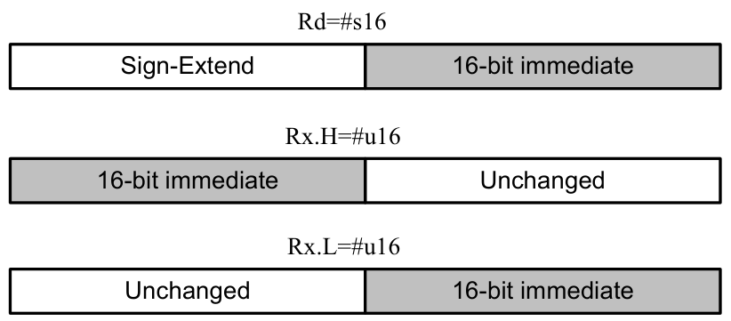
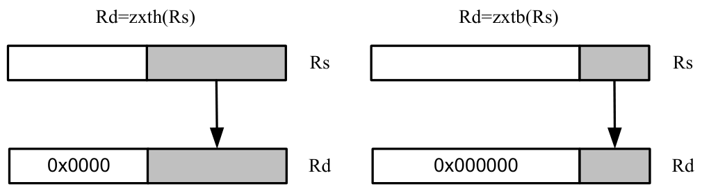
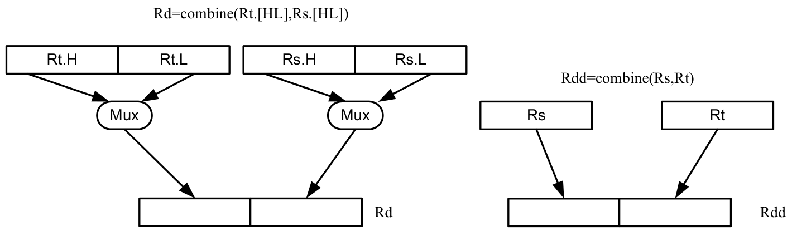
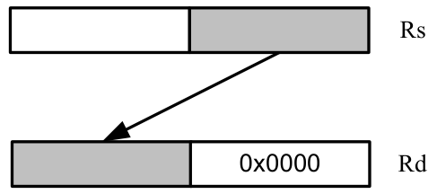
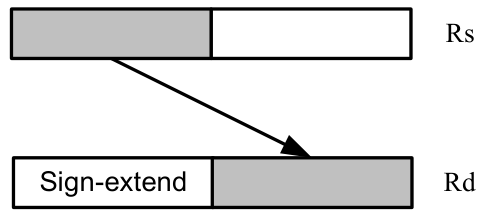
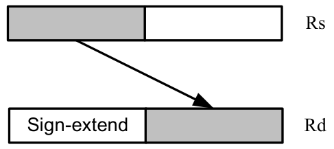
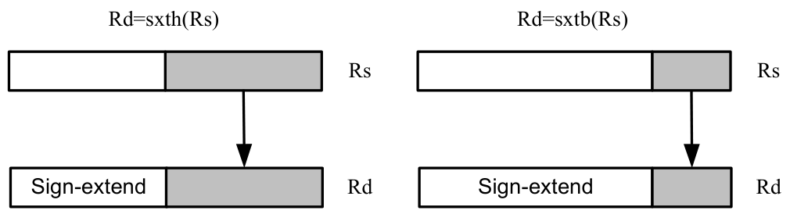
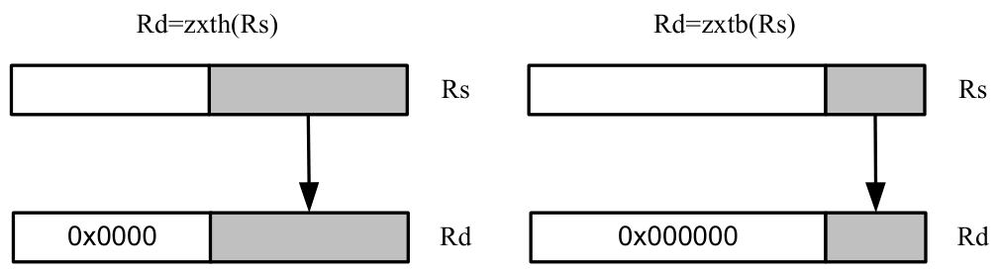

# 11 Instruction Set

This chapter lists the following information for the Hexagon Processor version 7 instruction set:

- Instruction name
- Brief description of the instruction
- High-level functional description (syntax and behavior) with operand types
- Instruction class and slot information for grouping instructions in packets
- C intrinsic functions that provide access to the instruction
- Instruction encoding

## 11.1 ALU32

The ALU32 instruction class includes instructions that perform arithmetic and logical operations on 32-bit data.

ALU32 instructions are executable on any slot.

### 11.1.1 ALU32 ALU

The ALU32 ALU instruction subclass includes instructions that perform arithmetic and logical operations on 32-bit items.

#### Add

Add a source register either to another source register or to a signed 16-bit immediate value. Store the result in destination register. Source and destination registers are 32 bits. If the result overflows 32 bits, it wraps around. Optionally saturate result to a signed value between 0x80000000 and 0x7fffffff.

For 64-bit versions of this operation, see the XTYPE add instructions.

| Syntax | Behavior |
|---|---|
| `Rd = add(Rs,#s16)` | `apply_extension(#s);`<br>`Rd = Rs + #s;` |
| `Rd = add(Rs,Rt)` | `Rd = Rs + Rt;` |
| `Rd = add(Rs,Rt):sat` | `Rd = sat₃₂(Rs + Rt);` |

##### Class: ALU32 (slots 0,1,2,3)

##### Notes

- If saturation occurs during execution of this instruction (a result is clamped to either maximum or minimum values), the OVF bit in the status register is set. OVF remains set until explicitly cleared by a transfer to the status register.

##### Intrinsics

|  |  |
|---|---|
| `Rd=add(Rs,#s16)` | `Word32 Q6_R_add_RI(Word32 Rs, Word32 Is16)` |
| `Rd=add(Rs,Rt)` | `Word32 Q6_R_add_RR(Word32 Rs, Word32 Rt)` |
| `Rd=add(Rs,Rt):sat` | `Word32 Q6_R_add_RR_sat(Word32 Rs, Word32 Rt)` |

##### Encoding

| 31 | 30 | 29 | 28 | 27 | 26 | 25 | 24 | 23 | 22 | 21 | 20 | 19 | 18 | 17 | 16 | 15 | 14 | 13 | 12 | 11 | 10 | 9 | 8 | 7 | 6 | 5 | 4 | 3 | 2 | 1 | 0 |  |
|---|---|---|---|---|---|---|---|---|---|---|---|---|---|---|---|---|---|---|---|---|---|---|---|---|---|---|---|---|---|---|---|---|
| ICLASS | ICLASS | ICLASS | ICLASS |  |  |  |  |  |  |  | s5 | s5 | s5 | s5 | s5 | Parse | Parse |  |  |  |  |  |  |  |  |  | d5 | d5 | d5 | d5 | d5 |  |
| 1 | 0 | 1 | 1 | i | i | i | i | i | i | i | s | s | s | s | s | P | P | i | i | i | i | i | i | i | i | i | d | d | d | d | d | Rd=add(Rs,#s16) |
| ICLASS | ICLASS | ICLASS | ICLASS | P | MajOp | MajOp | MajOp | MinOp | MinOp | MinOp | s5 | s5 | s5 | s5 | s5 | Parse | Parse |  | t5 | t5 | t5 | t5 | t5 |  |  |  | d5 | d5 | d5 | d5 | d5 |  |
| 1 | 1 | 1 | 1 | 0 | 0 | 1 | 1 | 0 | 0 | 0 | s | s | s | s | s | P | P | - | t | t | t | t | t | - | - | - | d | d | d | d | d | Rd=add(Rs,Rt) |
| 1 | 1 | 1 | 1 | 0 | 1 | 1 | 0 | 0 | 1 | 0 | s | s | s | s | s | P | P | - | t | t | t | t | t | - | - | - | d | d | d | d | d | Rd=add(Rs,Rt):sat |

| Field name | Description |
|---|---|
| `MajOp` | Major opcode |
| `MinOp` | Minor opcode |
| `P` | Predicated |
| `ICLASS` | Instruction class |
| `Parse` | Packet/loop parse bits |
| `d5` | Field to encode register d |
| `s5` | Field to encode register s |
| `t5` | Field to encode register t |

#### Logical operations

Perform bitwise logical operations (AND, OR, XOR, NOT) either on two source registers or on a source register and a signed 10-bit immediate value. Store result in destination register. Source and destination registers are 32 bits.

For 64-bit versions of these operations, see the XTYPE logical instructions.

| Syntax | Behavior |
|---|---|
| `Rd=and(Rs,#s10)` | `apply_extension(#s);`<br>`Rd=Rs&#s;` |
| `Rd=and(Rs,Rt)` | `Rd=Rs&Rt;` |
| `Rd=and(Rt,~Rs)` | `Rd = (Rt & ~Rs);` |
| `Rd=not(Rs)` | `Assembler mapped to: "Rd=sub(#-1,Rs)"` |
| `Rd=or(Rs,#s10)` | `apply_extension(#s);`<br>`Rd=Rs\|#s;` |
| `Rd=or(Rs,Rt)` | `Rd=Rs\|Rt;` |
| `Rd=or(Rt,~Rs)` | `Rd = (Rt \| ~Rs);` |
| `Rd=xor(Rs,Rt)` | `Rd=Rs^Rt;` |

##### Class: ALU32 (slots 0,1,2,3)

##### Intrinsics

|  |  |
|---|---|
| `Rd=and(Rs,#s10)` | `Word32 Q6_R_and_RI(Word32 Rs, Word32 Is10)` |
| `Rd=and(Rs,Rt)` | `Word32 Q6_R_and_RR(Word32 Rs, Word32 Rt)` |
| `Rd=and(Rt,~Rs)` | `Word32 Q6_R_and_RnR(Word32 Rt, Word32 Rs)` |
| `Rd=not(Rs)` | `Word32 Q6_R_not_R(Word32 Rs)` |
| `Rd=or(Rs,#s10)` | `Word32 Q6_R_or_RI(Word32 Rs, Word32 Is10)` |
| `Rd=or(Rs,Rt)` | `Word32 Q6_R_or_RR(Word32 Rs, Word32 Rt)` |
| `Rd=or(Rt,~Rs)` | `Word32 Q6_R_or_RnR(Word32 Rt, Word32 Rs)` |
| `Rd=xor(Rs,Rt)` | `Word32 Q6_R_xor_RR(Word32 Rs, Word32 Rt)` |

##### Encoding

| 31 | 30 | 29 | 28 | 27 | 26 | 25 | 24 | 23 | 22 | 21 | 20 | 19 | 18 | 17 | 16 15 | 15 | 14 | 13 | 12 | 11 | 10 | 9 | 8 | 7 | 6 | 5 | 4 | 3 | 2 | 1 | 0 |  |
|---|---|---|---|---|---|---|---|---|---|---|---|---|---|---|---|---|---|---|---|---|---|---|---|---|---|---|---|---|---|---|---|---|
| ICLASS | ICLASS | ICLASS | ICLASS | Rs | MajOp | MajOp | MajOp | MinOp | MinOp | MinOp | s5 | s5 | s5 | s5 | s5 | Parse | Parse |  |  |  |  |  |  |  |  |  | d5 | d5 | d5 | d5 | d5 |  |
| 0 | 1 | 1 | 1 | 0 | 1 | 1 | 0 | 0 | 0 | i | s | s | s | s | s P | P | P | i | i | i | i | i | i | i | i | i | d | d | d | d | d | Rd=and(Rs,#s10) |
| 0 | 1 | 1 | 1 | 0 | 1 | 1 | 0 | 1 | 0 | i | s | s | s | s | s P | P | P | i | i | i | i | i | i | i | i | i | d | d | d | d | d | Rd=or(Rs,#s10) |
| ICLASS | ICLASS | ICLASS | ICLASS | P | MajOp | MajOp | MajOp | MinOp | MinOp | MinOp | s5 | s5 | s5 | s5 | s5 | Parse | Parse |  | t5 | t5 | t5 | t5 | t5 |  |  |  | d5 | d5 | d5 | d5 | d5 |  |

| 31 | 30 | 29 | 28 | 27 | 26 | 25 | 24 | 23 | 22 | 21 | 20 | 19 | 18 | 17 | 16 | 15 | 14 | 13 | 12 | 11 | 10 | 9 | 8 | 7 | 6 | 5 | 4 | 3 | 2 | 1 | 0 |  |
|---|---|---|---|---|---|---|---|---|---|---|---|---|---|---|---|---|---|---|---|---|---|---|---|---|---|---|---|---|---|---|---|---|
| 1 | 1 | 1 | 1 | 0 | 0 | 0 | 1 | 0 | 0 | 0 | s | s | s | s | s | P | P | - | t | t | t | t | t | - | - | - | d | d | d | d | d | Rd=and(Rs,Rt) |
| 1 | 1 | 1 | 1 | 0 | 0 | 0 | 1 | 0 | 0 | 1 | s | s | s | s | s | P | P | - | t | t | t | t | t | - | - | - | d | d | d | d | d | Rd=or(Rs,Rt) |
| 1 | 1 | 1 | 1 | 0 | 0 | 0 | 1 | 0 | 1 | 1 | s | s | s | s | s | P | P | - | t | t | t | t | t | - | - | - | d | d | d | d | d | Rd=xor(Rs,Rt) |
| 1 | 1 | 1 | 1 | 0 | 0 | 0 | 1 | 1 | 0 | 0 | s | s | s | s | s | P | P | - | t | t | t | t | t | - | - | - | d | d | d | d | d | Rd=and(Rt,~Rs) |
| 1 | 1 | 1 | 1 | 0 | 0 | 0 | 1 | 1 | 0 | 1 | s | s | s | s | s | P | P | - | t | t | t | t | t | - | - | - | d | d | d | d | d | Rd=or(Rt,~Rs) |

| Field name | Description |
|---|---|
| `MajOp` | Major opcode |
| `MinOp` | Minor opcode |
| `Rs` | No Rs read |
| `P` | Predicated |
| `ICLASS` | Instruction class |
| `Parse` | Packet/loop parse bits |
| `d5` | Field to encode register d |
| `s5` | Field to encode register s |
| `t5` | Field to encode register t |

#### Negate

Perform arithmetic negation on a source register. Store result in destination register. Source and destination registers are 32 bits.

For 64-bit and saturating versions of this instruction, see the XTYPE-class negate instructions.

| Syntax | Behavior |
|---|---|
| `Rd=neg(Rs)` | `Assembler mapped to: "Rd = sub(#0, Rs)"` |

##### Class: N/A

##### Intrinsics

```
Rd=neg(Rs)Word32 Q6_R_neg_R(Word32 Rs)
```

#### NOP

Perform no operation. This instruction for padding and alignment.

Within a packet, it can be positioned in any slot 0 through 3.

| Syntax | Behavior |
|---|---|
| `nop` |  |

##### Class: ALU32 (slots 0,1,2,3)

##### Encoding

| 31 | 30 | 29 | 28 | 27 | 26 | 25 | 24 | 23 | 22 | 21 | 20 | 19 | 18 | 17 | 16 | 15 | 14 | 13 | 12 | 11 | 10 | 9 | 8 | 7 | 6 | 5 | 4 | 3 | 2 | 1 | 0 |  |
|---|---|---|---|---|---|---|---|---|---|---|---|---|---|---|---|---|---|---|---|---|---|---|---|---|---|---|---|---|---|---|---|---|
| ICLASS | ICLASS | ICLASS | ICLASS | Rs | MajOp | MajOp | MajOp |  |  |  |  |  |  |  |  | Parse | Parse |  |  |  |  |  |  |  |  |  |  |  |  |  |  |  |
| 0 | 1 | 1 | 1 | 1 | 1 | 1 | 1 | - | - | - | - | - | - | - | - | P | P | - | - | - | - | - | - | - | - | - | - | - | - | - | - | nop |

| Field name | Description |
|---|---|
| `MajOp` | Major opcode |
| `Rs` | No Rs read |
| `ICLASS` | Instruction class |
| `Parse` | Packet/loop parse bits |

#### Subtract

Subtract a source register from either another source register or from a signed 10-bit immediate value. Store the result in the destination register. Source and destination registers are 32 bits. If the result underflows 32 bits, it wraps around. Optionally saturate result to a signed value between 0x8000_0000 and 0x7fff_ffff.

For 64-bit versions of this operation, see the XTYPE subtract instructions.

| Syntax | Behavior |
|---|---|
| `Rd=sub(#s10,Rs)` | `apply_extension(#s);`<br>`Rd=#s-Rs;` |
| `Rd=sub(Rt,Rs)` | `Rd=Rt-Rs;` |
| `Rd=sub(Rt,Rs):sat` | `Rd=sat₃₂(Rt - Rs);` |

##### Class: ALU32 (slots 0,1,2,3)

##### Notes

- If saturation occurs during execution of this instruction (a result is clamped to either maximum or minimum values), the OVF bit in the status register is set. OVF remains set until explicitly cleared by a transfer to the status register.

##### Intrinsics

|  |  |
|---|---|
| `Rd=sub(#s10,Rs)` | `Word32 Q6_R_sub_IR(Word32 Is10, Word32 Rs)` |
| `Rd=sub(Rt,Rs)` | `Word32 Q6_R_sub_RR(Word32 Rt, Word32 Rs)` |
| `Rd=sub(Rt,Rs):sat` | `Word32 Q6_R_sub_RR_sat(Word32 Rt, Word32 Rs)` |

##### Encoding

| 31 | 30 | 29 | 28 | 27 | 26 | 25 | 24 | 23 | 22 | 21 | 20 | 19 | 18 | 17 | 16 | 15 | 14 | 13 | 12 | 11 | 10 | 9 | 8 | 7 | 6 | 5 | 4 | 3 | 2 | 1 | 0 |  |
|---|---|---|---|---|---|---|---|---|---|---|---|---|---|---|---|---|---|---|---|---|---|---|---|---|---|---|---|---|---|---|---|---|
| ICLASS | ICLASS | ICLASS | ICLASS | Rs | MajOp | MajOp | MajOp | MinOp | MinOp | MinOp | s5 | s5 | s5 | s5 | s5 | Parse | Parse |  |  |  |  |  |  |  |  |  | d5 | d5 | d5 | d5 | d5 |  |
| 0 | 1 | 1 | 1 | 0 | 1 | 1 | 0 | 0 | 1 | i | s | s | s | s | s | P | P | i | i | i | i | i | i | i | i | i | d | d | d | d | d | Rd=sub(#s10,Rs) |
| ICLASS | ICLASS | ICLASS | ICLASS | P | MajOp | MajOp | MajOp | MinOp | MinOp | MinOp | s5 | s5 | s5 | s5 | s5 | Parse | Parse |  | t5 | t5 | t5 | t5 | t5 |  |  |  | d5 | d5 | d5 | d5 | d5 |  |
| 1 | 1 | 1 | 1 | 0 | 0 | 1 | 1 | 0 | 0 | 1 | s | s | s | s | s | P | P | - | t | t | t | t | t | - | - | - | d | d | d | d | d | Rd=sub(Rt,Rs) |
| 1 | 1 | 1 | 1 | 0 | 1 | 1 | 0 | 1 | 1 | 0 | s | s | s | s | s | P | P | - | t | t | t | t | t | - | - | - | d | d | d | d | d | Rd=sub(Rt,Rs):sat |

| Field name | Description |
|---|---|
| `MajOp` | Major opcode |
| `MinOp` | Minor opcode |
| `Rs` | No Rs read |
| `P` | Predicated |
| `ICLASS` | Instruction class |
| `Parse` | Packet/loop parse bits |
| Field name | Description |
| `d5` | Field to encode register d |
| `s5` | Field to encode register s |
| `t5` | Field to encode register t |

#### Sign extend

Sign-extend the least-significant byte or halfword from the source register and place the 32-bit result in the destination register.


```text
Rd=sxth(Rs) Rd=sxtb(Rs)
Rs Rs
Sign-extend Rd Sign-extend Rd
```

| Syntax | Behavior |
|---|---|
| `Rd=sxtb(Rs)` | `Rd = sxt<sub>8->32</sub>(Rs);` |
| `Rd=sxth(Rs)` | `Rd = sxt<sub>16->32</sub>(Rs);` |

##### Class: ALU32 (slots 0,1,2,3)

##### Intrinsics

|  |  |
|---|---|
| `Rd=sxtb(Rs)` | `Word32 Q6_R_sxtb_R(Word32 Rs)` |
| `Rd=sxth(Rs)` | `Word32 Q6_R_sxth_R(Word32 Rs)` |

##### Encoding

| 31 | 30 | 29 | 28 | 27 | 26 | 25 | 24 | 23 | 22 | 21 | 20 | 19 | 18 | 17 | 16 | 15 | 14 | 13 | 12 | 11 | 10 | 9 | 8 | 7 | 6 | 5 | 4 | 3 | 2 | 1 | 0 |  |
|---|---|---|---|---|---|---|---|---|---|---|---|---|---|---|---|---|---|---|---|---|---|---|---|---|---|---|---|---|---|---|---|---|
| ICLASS | ICLASS | ICLASS | ICLASS | Rs | MajOp | MajOp | MajOp | MinOp | MinOp | MinOp | s5 | s5 | s5 | s5 | s5 | Parse | Parse | C |  |  |  |  |  |  |  |  | d5 | d5 | d5 | d5 | d5 |  |
| 0 | 1 | 1 | 1 | 0 | 0 | 0 | 0 | 1 | 0 | 1 | s | s | s | s | s | P | P | 0 | - | - | - | - | - | - | - | - | d | d | d | d | d | Rd=sxtb(Rs) |
| 0 | 1 | 1 | 1 | 0 | 0 | 0 | 0 | 1 | 1 | 1 | s | s | s | s | s | P | P | 0 | - | - | - | - | - | - | - | - | d | d | d | d | d | Rd=sxth(Rs) |

| Field name | Description |
|---|---|
| `MajOp` | Major opcode |
| `MinOp` | Minor opcode |
| `Rs` | No Rs read |
| `C` | Conditional |
| `ICLASS` | Instruction class |
| `Parse` | Packet/loop parse bits |
| `d5` | Field to encode register d |
| `s5` | Field to encode register s |

#### Transfer immediate

Assign an immediate value to a 32-bit destination register.

Two types of assignment are supported. The first sign-extends a 16-bit signed immediate value to 32 bits. The second assigns a 16-bit unsigned immediate value to either the upper or lower 16 bits of the destination register, leaving the other 16 bits unchanged.



```text
Rd=#s16
Sign-Extend 16-bit immediate
Rx.H=#u16
16-bit immediate Unchanged
Rx.L=#u16
Unchanged 16-bit immediate
```

| Syntax | Behavior |
|---|---|
| `Rd=#s16` | `apply_extension(#s);`<br>`Rd=#s;` |
| `Rdd=#s8` | `if ("#s8<0") {`<br>`Assembler mapped to: "Rdd=combine(#-1,#s8)";`<br>`} else {`<br>`Assembler mapped to: "Rdd=combine(#0,#s8)";`<br>`}` |
| `Rx.[HL]=#u16` | `Rx.h[01]=#u;` |

##### Class: ALU32 (slots 0,1,2,3)

##### Intrinsics

|  |  |
|---|---|
| `Rd=#s16` | `Word32 Q6_R_equals_I(Word32 Is16)` |
| `Rdd=#s8` | `Word64 Q6_P_equals_I(Word32 Is8)` |
| `Rx.H=#u16` | `Word32 Q6_Rh_equals_I(Word32 Rx, Word32 Iu16)` |
| `Rx.L=#u16` | `Word32 Q6_Rl_equals_I(Word32 Rx, Word32 Iu16)` |

##### Encoding

| 31 | 30 | 29 | 28 | 27 | 26 | 25 | 24 | 23 | 22 | 21 | 20 | 19 | 18 | 17 | 16 | 15 | 14 | 13 | 12 | 11 | 10 | 9 | 8 | 7 | 6 | 5 | 4 | 3 | 2 | 1 | 0 |  |
|---|---|---|---|---|---|---|---|---|---|---|---|---|---|---|---|---|---|---|---|---|---|---|---|---|---|---|---|---|---|---|---|---|
| ICLASS | ICLASS | ICLASS | ICLASS | Rs | MajOp | MajOp | MajOp | MinOp | MinOp | MinOp | x5 | x5 | x5 | x5 | x5 | Parse | Parse |  |  |  |  |  |  |  |  |  |  |  |  |  |  |  |
| 0 | 1 | 1 | 1 | 0 | 0 | 0 | 1 | i | i | 1 | x | x | x | x | x | P | P | i | i | i | i | i | i | i | i | i | i | i | i | i | i | Rx.L=#u16 |
| 0 | 1 | 1 | 1 | 0 | 0 | 1 | 0 | i | i | 1 | x | x | x | x | x | P | P | i | i | i | i | i | i | i | i | i | i | i | i | i | i | Rx.H=#u16 |
| ICLASS | ICLASS | ICLASS | ICLASS | Rs | MajOp | MajOp | MajOp | MinOp | MinOp | MinOp |  |  |  |  |  | Parse | Parse |  |  |  |  |  |  |  |  |  | d5 | d5 | d5 | d5 | d5 |  |
| 0 | 1 | 1 | 1 | 1 | 0 | 0 | 0 | i | i | - | i | i | i | i | i | P | P | i | i | i | i | i | i | i | i | i | d | d | d | d | d | Rd=#s16 |

| Field name | Description |
|---|---|
| `MajOp` | Major opcode |
| `MinOp` | Minor opcode |
| `Rs` | No Rs read |
| `ICLASS` | Instruction class |
| `Parse` | Packet/loop parse bits |
| `d5` | Field to encode register d |
| `x5` | Field to encode register x |

#### Transfer register

Transfer a source register to a destination register. Source and destination registers are either 32 bits or 64 bits.

| Syntax | Behavior |
|---|---|
| `Rd=Rs` | `Rd=Rs;` |
| `Rdd=Rss` | `Assembler mapped to: `<br>`"Rdd=combine(Rss.H32,Rss.L32)"` |

##### Class: ALU32 (slots 0,1,2,3)

##### Intrinsics

|  |  |
|---|---|
| `Rd=Rs` | `Word32 Q6_R_equals_R(Word32 Rs)` |
| `Rdd=Rss` | `Word64 Q6_P_equals_P(Word64 Rss)` |

##### Encoding

| 31 | 30 | 29 | 28 | 27 | 26 | 25 | 24 | 23 | 22 | 21 | 20 | 19 | 18 | 17 | 16 | 15 | 14 | 13 | 12 | 11 | 10 | 9 | 8 | 7 | 6 | 5 | 4 | 3 | 2 | 1 | 0 |  |
|---|---|---|---|---|---|---|---|---|---|---|---|---|---|---|---|---|---|---|---|---|---|---|---|---|---|---|---|---|---|---|---|---|
| ICLASS | ICLASS | ICLASS | ICLASS | Rs | MajOp | MajOp | MajOp | MinOp | MinOp | MinOp | s5 | s5 | s5 | s5 | s5 | Parse | Parse | C |  |  |  |  |  |  |  |  | d5 | d5 | d5 | d5 | d5 |  |
| 0 | 1 | 1 | 1 | 0 | 0 | 0 | 0 | 0 | 1 | 1 | s | s | s | s | s | P | P | 0 | - | - | - | - | - | - | - | - | d | d | d | d | d | Rd=Rs |

| Field name | Description |
|---|---|
| `MajOp` | Major opcode |
| `MinOp` | Minor opcode |
| `Rs` | No Rs read |
| `C` | Conditional |
| `ICLASS` | Instruction class |
| `Parse` | Packet/loop parse bits |
| `d5` | Field to encode register d |
| `s5` | Field to encode register s |

#### Vector add halfwords

Add the two 16-bit halfwords of Rs to the two 16-bit halfwords of Rt. The results are optionally saturated to signed or unsigned 16-bit values.

| Syntax | Behavior |
|---|---|
| `Rd=vaddh(Rs,Rt)[:sat]` | `for (i=0;i<2;i++) {`<br>`Rd.h[i]=[sat₁₆](Rs.h[i]+Rt.h[i]);`<br>`}` |
| `Rd=vadduh(Rs,Rt):sat` | `for (i=0;i<2;i++) {`<br>`Rd.h[i]=usat₁₆(Rs.uh[i]+Rt.uh[i]);`<br>`}` |

##### Class: ALU32 (slots 0,1,2,3)

##### Notes

- If saturation occurs during execution of this instruction (a result is clamped to either maximum or minimum values), the OVF bit in the Status Register is set. OVF remains set until explicitly cleared by a transfer to the status register.

##### Intrinsics

|  |  |
|---|---|
| `Rd=vaddh(Rs,Rt)` | `Word32 Q6_R_vaddh_RR(Word32 Rs, Word32 Rt)` |
| `Rd=vaddh(Rs,Rt):sat` | `Word32 Q6_R_vaddh_RR_sat(Word32 Rs, Word32 Rt)` |
| `Rd=vadduh(Rs,Rt):sat` | `Word32 Q6_R_vadduh_RR_sat(Word32 Rs, Word32 Rt)` |

##### Encoding

| 31 | 30 | 29 | 28 | 27 | 26 | 25 | 24 | 23 | 22 | 21 | 20 | 19 | 18 | 17 | 16 | 15 | 14 | 13 | 12 | 11 | 10 | 9 | 8 | 7 | 6 | 5 | 4 | 3 | 2 | 1 | 0 |  |
|---|---|---|---|---|---|---|---|---|---|---|---|---|---|---|---|---|---|---|---|---|---|---|---|---|---|---|---|---|---|---|---|---|
| ICLASS | ICLASS | ICLASS | ICLASS | P | MajOp | MajOp | MajOp | MinOp | MinOp | MinOp | s5 | s5 | s5 | s5 | s5 | Parse | Parse |  | t5 | t5 | t5 | t5 | t5 |  |  |  | d5 | d5 | d5 | d5 | d5 |  |
| 1 | 1 | 1 | 1 | 0 | 1 | 1 | 0 | 0 | 0 | 0 | s | s | s | s | s | P | P | - | t | t | t | t | t | - | - | - | d | d | d | d | d | Rd=vaddh(Rs,Rt) |
| 1 | 1 | 1 | 1 | 0 | 1 | 1 | 0 | 0 | 0 | 1 | s | s | s | s | s | P | P | - | t | t | t | t | t | - | - | - | d | d | d | d | d | Rd=vaddh(Rs,Rt):sat |
| 1 | 1 | 1 | 1 | 0 | 1 | 1 | 0 | 0 | 1 | 1 | s | s | s | s | s | P | P | - | t | t | t | t | t | - | - | - | d | d | d | d | d | Rd=vadduh(Rs,Rt):sat |

| Field name | Description |
|---|---|
| `MajOp` | Major opcode |
| `MinOp` | Minor opcode |
| `P` | Predicated |
| `ICLASS` | Instruction class |
| `Parse` | Packet/loop parse bits |
| `d5` | Field to encode register d |
| `s5` | Field to encode register s |
| `t5` | Field to encode register t |

#### Vector average halfwords

The vavgh instruction adds the two 16-bit halfwords of Rs to the two 16-bit halfwords of Rd, and shifts the result right by 1 bit. Optionally, a rounding constant is added before shifting.

The vnavgh instruction subtracts the two 16-bit halfwords of Rt from the two 16-bit halfwords of Rs, and shifts the result right by 1 bit. For vector negative average with rounding, see the XTYPE VNAVGH instruction (Vector average halfwords).

| Syntax | Behavior |
|---|---|
| `Rd=vavgh(Rs,Rt)` | `for (i=0;i<2;i++) {`<br>`Rd.h[i]=((Rs.h[i]+Rt.h[i])>>1);`<br>`}` |
| `Rd=vavgh(Rs,Rt):rnd` | `for (i=0;i<2;i++) {`<br>`Rd.h[i]=((Rs.h[i]+Rt.h[i]+1)>>1);`<br>`}` |
| `Rd=vnavgh(Rt,Rs)` | `for (i=0;i<2;i++) {`<br>`Rd.h[i]=((Rt.h[i]-Rs.h[i])>>1);`<br>`}` |

##### Class: ALU32 (slots 0,1,2,3)

##### Intrinsics

|  |  |
|---|---|
| `Rd=vavgh(Rs,Rt)` | `Word32 Q6_R_vavgh_RR(Word32 Rs, Word32 Rt)` |
| `Rd=vavgh(Rs,Rt):rnd` | `Word32 Q6_R_vavgh_RR_rnd(Word32 Rs, Word32 Rt)` |
| `Rd=vnavgh(Rt,Rs)` | `Word32 Q6_R_vnavgh_RR(Word32 Rt, Word32 Rs)` |

##### Encoding

| 31 | 30 | 29 | 28 | 27 | 26 | 25 | 24 | 23 | 22 | 21 | 20 | 19 | 18 | 17 | 16 | 15 | 14 | 13 | 12 | 11 | 10 | 9 | 8 | 7 | 6 | 5 | 4 | 3 | 2 | 1 | 0 |  |
|---|---|---|---|---|---|---|---|---|---|---|---|---|---|---|---|---|---|---|---|---|---|---|---|---|---|---|---|---|---|---|---|---|
| ICLASS | ICLASS | ICLASS | ICLASS | P | MajOp | MajOp | MajOp | MinOp | MinOp | MinOp | s5 | s5 | s5 | s5 | s5 | Parse | Parse |  | t5 | t5 | t5 | t5 | t5 |  |  |  | d5 | d5 | d5 | d5 | d5 |  |
| 1 | 1 | 1 | 1 | 0 | 1 | 1 | 1 | - | 0 | 0 | s | s | s | s | s | P | P | - | t | t | t | t | t | - | - | - | d | d | d | d | d | Rd=vavgh(Rs,Rt) |
| 1 | 1 | 1 | 1 | 0 | 1 | 1 | 1 | - | 0 | 1 | s | s | s | s | s | P | P | - | t | t | t | t | t | - | - | - | d | d | d | d | d | Rd=vavgh(Rs,Rt):rnd |
| 1 | 1 | 1 | 1 | 0 | 1 | 1 | 1 | - | 1 | 1 | s | s | s | s | s | P | P | - | t | t | t | t | t | - | - | - | d | d | d | d | d | Rd=vnavgh(Rt,Rs) |

| Field name | Description |
|---|---|
| `MajOp` | Major opcode |
| `MinOp` | Minor opcode |
| `P` | Predicated |
| `ICLASS` | Instruction class |
| `Parse` | Packet/loop parse bits |
| `d5` | Field to encode register d |
| `s5` | Field to encode register s |
| `t5` | Field to encode register t |

#### Vector subtract halfwords

Subtract each of the two halfwords in 32-bit vector Rs from the corresponding halfword in vector Rt. Optionally, saturate each 16-bit addition to either a signed or unsigned 16-bit value.

Applying saturation to the vsubh instruction clamps the result to the signed range 0x8000 to 0x7fff, whereas applying saturation to vsubuh ensures that the unsigned result is in the range 0 to 0xffff. When saturation is not needed, use vsubh.

| Syntax | Behavior |
|---|---|
| `Rd=vsubh(Rt,Rs)[:sat]` | `for (i=0;i<2;i++) {`<br>`Rd.h[i]=[sat₁₆](Rt.h[i]-Rs.h[i]);`<br>`}` |
| `Rd=vsubuh(Rt,Rs):sat` | `for (i=0;i<2;i++) {`<br>`Rd.h[i]=usat₁₆(Rt.uh[i]-Rs.uh[i]);`<br>`}` |

##### Class: ALU32 (slots 0,1,2,3)

##### Notes

- If saturation occurs during execution of this instruction (a result is clamped to either maximum or minimum values), the OVF bit in the status register is set. OVF remains set until explicitly cleared by a transfer to the status register.

##### Intrinsics

|  |  |
|---|---|
| `Rd=vsubh(Rt,Rs)` | `Word32 Q6_R_vsubh_RR(Word32 Rt, Word32 Rs)` |
| `Rd=vsubh(Rt,Rs):sat` | `Word32 Q6_R_vsubh_RR_sat(Word32 Rt, Word32 Rs)` |
| `Rd=vsubuh(Rt,Rs):sat` | `Word32 Q6_R_vsubuh_RR_sat(Word32 Rt, Word32 Rs)` |

##### Encoding

| 31 | 30 | 29 | 28 | 27 | 26 | 25 | 24 | 23 | 22 | 21 | 20 | 19 | 18 | 17 | 16 | 15 | 14 | 13 | 12 | 11 | 10 | 9 | 8 | 7 | 6 | 5 | 4 | 3 | 2 | 1 | 0 |  |
|---|---|---|---|---|---|---|---|---|---|---|---|---|---|---|---|---|---|---|---|---|---|---|---|---|---|---|---|---|---|---|---|---|
| ICLASS | ICLASS | ICLASS | ICLASS | P | MajOp | MajOp | MajOp | MinOp | MinOp | MinOp | s5 | s5 | s5 | s5 | s5 | Parse | Parse |  | t5 | t5 | t5 | t5 | t5 |  |  |  | d5 | d5 | d5 | d5 | d5 |  |
| 1 | 1 | 1 | 1 | 0 | 1 | 1 | 0 | 1 | 0 | 0 | s | s | s | s | s | P | P | - | t | t | t | t | t | - | - | - | d | d | d | d | d | Rd=vsubh(Rt,Rs) |
| 1 | 1 | 1 | 1 | 0 | 1 | 1 | 0 | 1 | 0 | 1 | s | s | s | s | s | P | P | - | t | t | t | t | t | - | - | - | d | d | d | d | d | Rd=vsubh(Rt,Rs):sat |
| 1 | 1 | 1 | 1 | 0 | 1 | 1 | 0 | 1 | 1 | 1 | s | s | s | s | s | P | P | - | t | t | t | t | t | - | - | - | d | d | d | d | d | Rd=vsubuh(Rt,Rs):sat |

| Field name | Description |
|---|---|
| `MajOp` | Major opcode |
| `MinOp` | Minor opcode |
| `P` | Predicated |
| `ICLASS` | Instruction class |
| `Parse` | Packet/loop parse bits |
| `d5` | Field to encode register d |
| `s5` | Field to encode register s |
| `t5` | Field to encode register t |

#### Zero extend

Zero-extend the least significant byte or halfword from Rs and place the 32-bit result in Rd.



```text
Rd=zxth(Rs) Rd=zxtb(Rs)
Rs Rs
0x0000 Rd 0x000000 Rd
```

| Syntax | Behavior |
|---|---|
| `Rd=zxtb(Rs)` | `Assembler mapped to: "Rd=and(Rs,#255)"` |
| `Rd=zxth(Rs)` | `Rd = zxt<sub>16->32</sub>(Rs);` |

##### Class: ALU32 (slots 0,1,2,3)

##### Intrinsics

|  |  |
|---|---|
| `Rd=zxtb(Rs)` | `Word32 Q6_R_zxtb_R(Word32 Rs)` |
| `Rd=zxth(Rs)` | `Word32 Q6_R_zxth_R(Word32 Rs)` |

##### Encoding

| 31 | 30 | 29 | 28 | 27 | 26 | 25 | 24 | 23 | 22 | 21 | 20 | 19 | 18 | 17 | 16 | 15 | 14 | 13 | 12 | 11 | 10 | 9 | 8 | 7 | 6 | 5 | 4 | 3 | 2 | 1 | 0 |  |
|---|---|---|---|---|---|---|---|---|---|---|---|---|---|---|---|---|---|---|---|---|---|---|---|---|---|---|---|---|---|---|---|---|
| ICLASS | ICLASS | ICLASS | ICLASS | Rs | MajOp | MajOp | MajOp | MinOp | MinOp | MinOp | s5 | s5 | s5 | s5 | s5 | Parse | Parse | C |  |  |  |  |  |  |  |  | d5 | d5 | d5 | d5 | d5 |  |
| 0 | 1 | 1 | 1 | 0 | 0 | 0 | 0 | 1 | 1 | 0 | s | s | s | s | s | P | P | 0 | - | - | - | - | - | - | - | - | d | d | d | d | d | Rd=zxth(Rs) |

| Field name | Description |
|---|---|
| `MajOp` | Major opcode |
| `MinOp` | Minor opcode |
| `Rs` | No Rs read |
| `C` | Conditional |
| `ICLASS` | Instruction class |
| `Parse` | Packet/loop parse bits |
| `d5` | Field to encode register d |
| `s5` | Field to encode register s |

### 11.1.2 ALU32 PERM

The ALU32 PERM instruction subclass includes instructions that rearrange or perform format conversion on vector data types.

#### Combine words into doubleword

Combine halfwords or words into larger values.

In a halfword combine, either the high or low halfword of the first source register is transferred to the most-significant halfword of the destination register, while either the high or low halfword of the second source register is transferred to the least-significant halfword of the destination register. Source and destination registers are 32 bits.

In a word combine, the first source register is transferred to the most-significant word of the destination register, while the second source register is transferred to the least-significant word of the destination register. Source registers are 32 bits and the destination register is 64 bits.

In a variant of word combine, signed 8-bit immediate values (instead of registers) are transferred to the most- and least-significant words of the 64-bit destination register. Optionally, one of the immediate values can be 32 bits.



```text
Rd=combine(Rt.[HL],Rs.[HL])
Rt.H Rt.L Rs.H Rs.L
Rdd=combine(Rs,Rt)
Mux Mux Rs Rt
Rd Rdd
```

| Syntax | Behavior |
|---|---|
| `Rd=combine(Rt.[HL],Rs.[HL])` | `Rd = (Rt.uh[01]<<16) \| Rs.uh[01];` |
| `Rdd=combine(#s8,#S8)` | `apply_extension(#s);`<br>`Rdd.w[0]=#S;`<br>`Rdd.w[1]=#s;` |
| `Rdd=combine(#s8,#U6)` | `apply_extension(#U);`<br>`Rdd.w[0]=#U;`<br>`Rdd.w[1]=#s;` |
| `Rdd=combine(#s8,Rs)` | `apply_extension(#s);`<br>`Rdd.w[0]=Rs;`<br>`Rdd.w[1]=#s;` |
| `Rdd=combine(Rs,#s8)` | `apply_extension(#s);`<br>`Rdd.w[0]=#s;`<br>`Rdd.w[1]=Rs;` |
| `Rdd=combine(Rs,Rt)` | `Rdd.w[0]=Rt;`<br>`Rdd.w[1]=Rs;` |

##### Class: ALU32 (slots 0,1,2,3)

##### Intrinsics

|  |  |
|---|---|
| `Rd=combine(Rt.H,Rs.H)` | `Word32 Q6_R_combine_RhRh(Word32 Rt, Word32 Rs)` |
| `Rd=combine(Rt.H,Rs.L)` | `Word32 Q6_R_combine_RhRl(Word32 Rt, Word32 Rs)` |
| `Rd=combine(Rt.L,Rs.H)` | `Word32 Q6_R_combine_RlRh(Word32 Rt, Word32 Rs)` |
| `Rd=combine(Rt.L,Rs.L)` | `Word32 Q6_R_combine_RlRl(Word32 Rt, Word32 Rs)` |
| `Rdd=combine(#s8,#S8)` | `Word64 Q6_P_combine_II(Word32 Is8, Word32 IS8)` |
| `Rdd=combine(#s8,Rs)` | `Word64 Q6_P_combine_IR(Word32 Is8, Word32 Rs)` |
| `Rdd=combine(Rs,#s8)` | `Word64 Q6_P_combine_RI(Word32 Rs, Word32 Is8)` |
| `Rdd=combine(Rs,Rt)` | `Word64 Q6_P_combine_RR(Word32 Rs, Word32 Rt)` |

##### Encoding

| 31 | 30 | 29 | 28 | 27 | 26 | 25 | 24 | 23 | 22 | 21 | 20 | 19 | 18 | 17 | 16 | 15 | 14 | 13 | 12 | 11 | 10 | 9 | 8 | 7 | 6 | 5 | 4 | 3 | 2 | 1 | 0 |  |
|---|---|---|---|---|---|---|---|---|---|---|---|---|---|---|---|---|---|---|---|---|---|---|---|---|---|---|---|---|---|---|---|---|
| ICLASS | ICLASS | ICLASS | ICLASS | Rs | MajOp | MajOp | MajOp | MinOp | MinOp | MinOp | s5 | s5 | s5 | s5 | s5 | Parse | Parse |  |  |  |  |  |  |  |  |  | d5 | d5 | d5 | d5 | d5 |  |
| 0 | 1 | 1 | 1 | 0 | 0 | 1 | 1 | - | 0 | 0 | s | s | s | s | s | P | P | 1 | i | i | i | i | i | i | i | i | d | d | d | d | d | Rdd=combine(Rs,#s8) |
| 0 | 1 | 1 | 1 | 0 | 0 | 1 | 1 | - | 0 | 1 | s | s | s | s | s | P | P | 1 | i | i | i | i | i | i | i | i | d | d | d | d | d | Rdd=combine(#s8,Rs) |
| ICLASS | ICLASS | ICLASS | ICLASS | Rs | MajOp | MajOp | MajOp | MinOp | MinOp | MinOp |  |  |  |  |  | Parse | Parse |  |  |  |  |  |  |  |  |  | d5 | d5 | d5 | d5 | d5 |  |
| 0 | 1 | 1 | 1 | 1 | 1 | 0 | 0 | 0 | I | I | I | I | I | I | I | P | P | I | i | i | i | i | i | i | i | i | d | d | d | d | d | Rdd=combine(#s8,#S8) |
| 0 | 1 | 1 | 1 | 1 | 1 | 0 | 0 | 1 | - | - | I | I | I | I | I | P | P | I | i | i | i | i | i | i | i | i | d | d | d | d | d | Rdd=combine(#s8,#U6) |
| ICLASS | ICLASS | ICLASS | ICLASS | P | MajOp | MajOp | MajOp | MinOp | MinOp | MinOp | s5 | s5 | s5 | s5 | s5 | Parse | Parse |  | t5 | t5 | t5 | t5 | t5 |  |  |  | d5 | d5 | d5 | d5 | d5 |  |
| 1 | 1 | 1 | 1 | 0 | 0 | 1 | 1 | 1 | 0 | 0 | s | s | s | s | s | P | P | - | t | t | t | t | t | - | - | - | d | d | d | d | d | Rd=combine(Rt.H,Rs.H) |
| 1 | 1 | 1 | 1 | 0 | 0 | 1 | 1 | 1 | 0 | 1 | s | s | s | s | s | P | P | - | t | t | t | t | t | - | - | - | d | d | d | d | d | Rd=combine(Rt.H,Rs.L) |
| 1 | 1 | 1 | 1 | 0 | 0 | 1 | 1 | 1 | 1 | 0 | s | s | s | s | s | P | P | - | t | t | t | t | t | - | - | - | d | d | d | d | d | Rd=combine(Rt.L,Rs.H) |
| 1 | 1 | 1 | 1 | 0 | 0 | 1 | 1 | 1 | 1 | 1 | s | s | s | s | s | P | P | - | t | t | t | t | t | - | - | - | d | d | d | d | d | Rd=combine(Rt.L,Rs.L) |
| 1 | 1 | 1 | 1 | 0 | 1 | 0 | 1 | 0 | - | - | s | s | s | s | s | P | P | - | t | t | t | t | t | - | - | - | d | d | d | d | d | Rdd=combine(Rs,Rt) |

| Field name | Description |
|---|---|
| `MajOp` | Major opcode |
| `MinOp` | Minor opcode |
| `Rs` | No Rs read |
| `P` | Predicated |
| `ICLASS` | Instruction class |
| `Parse` | Packet/loop parse bits |
| `d5` | Field to encode register d |
| `s5` | Field to encode register s |
| `t5` | Field to encode register t |

#### Mux

Select between two source registers based on the least-significant bit of a predicate register. If the bit is 1, transfer the first source register to the destination register; otherwise, transfer the second source register. Source and destination registers are 32 bits.

In a variant of mux, signed 8-bit immediate values are used instead of registers for either or both source operands.

For 64-bit versions of this instruction, see the XTYPE vmux (Vector mux) instruction.

| Syntax | Behavior |
|---|---|
| `Rd=mux(Pu,#s8,#S8)` | `PREDUSE_TIMING;`<br>`apply_extension(#s);`<br>`Rd = (Pu[0] ? #s : #S);` |
| `Rd=mux(Pu,#s8,Rs)` | `PREDUSE_TIMING;`<br>`apply_extension(#s);`<br>`Rd = (Pu[0] ? #s : Rs);` |
| `Rd=mux(Pu,Rs,#s8)` | `PREDUSE_TIMING;`<br>`apply_extension(#s);`<br>`Rd = (Pu[0] ? Rs : #s);` |
| `Rd=mux(Pu,Rs,Rt)` | `PREDUSE_TIMING;`<br>`Rd = (Pu[0] ? Rs : Rt);` |

##### Class: ALU32 (slots 0,1,2,3)

##### Intrinsics

|  |  |
|---|---|
| `Rd=mux(Pu,#s8,#S8)` | `Word32 Q6_R_mux_pII(Byte Pu, Word32 Is8, Word32 IS8)` |
| `Rd=mux(Pu,#s8,Rs)` | `Word32 Q6_R_mux_pIR(Byte Pu, Word32 Is8, Word32 Rs)` |
| `Rd=mux(Pu,Rs,#s8)` | `Word32 Q6_R_mux_pRI(Byte Pu, Word32 Rs, Word32 Is8)` |
| `Rd=mux(Pu,Rs,Rt)` | `Word32 Q6_R_mux_pRR(Byte Pu, Word32 Rs, Word32 Rt)` |

##### Encoding

| 31 | 30 | 29 | 28 | 27 | 26 | 25 | 24 | 23 | 22 | 21 | 20 | 19 | 18 | 17 | 16 | 15 | 14 | 13 | 12 | 11 | 10 | 9 | 8 | 7 | 6 | 5 | 4 | 3 | 2 | 1 | 0 |  |
|---|---|---|---|---|---|---|---|---|---|---|---|---|---|---|---|---|---|---|---|---|---|---|---|---|---|---|---|---|---|---|---|---|
| ICLASS | ICLASS | ICLASS | ICLASS | Rs | MajOp | MajOp | MajOp |  | u2 | u2 | s5 | s5 | s5 | s5 | s5 | Parse | Parse |  |  |  |  |  |  |  |  |  | d5 | d5 | d5 | d5 | d5 |  |
| 0 | 1 | 1 | 1 | 0 | 0 | 1 | 1 | 0 | u | u | s | s | s | s | s | P | P | 0 | i | i | i | i | i | i | i | i | d | d | d | d | d | Rd=mux(Pu,Rs,#s8) |
| 0 | 1 | 1 | 1 | 0 | 0 | 1 | 1 | 1 | u | u | s | s | s | s | s | P | P | 0 | i | i | i | i | i | i | i | i | d | d | d | d | d | Rd=mux(Pu,#s8,Rs) |
| ICLASS | ICLASS | ICLASS | ICLASS | Rs |  |  | u1 | u1 |  |  |  |  |  |  |  | Parse | Parse |  |  |  |  |  |  |  |  |  | d5 | d5 | d5 | d5 | d5 |  |
| 0 | 1 | 1 | 1 | 1 | 0 | 1 | u | u | I | I | I | I | I | I | I | P | P | I | i | i | i | i | i | i | i | i | d | d | d | d | d | Rd=mux(Pu,#s8,#S8) |
| ICLASS | ICLASS | ICLASS | ICLASS | P | MajOp | MajOp | MajOp |  |  |  | s5 | s5 | s5 | s5 | s5 | Parse | Parse |  | t5 | t5 | t5 | t5 | t5 |  | u2 | u2 | d5 | d5 | d5 | d5 | d5 |  |
| 1 | 1 | 1 | 1 | 0 | 1 | 0 | 0 | - | - | - | s | s | s | s | s | P | P | - | t | t | t | t | t | - | u | u | d | d | d | d | d | Rd=mux(Pu,Rs,Rt) |

| Field name | Description |
|---|---|
| `MajOp` | Major opcode |
| `MinOp` | Minor opcode |
| `Rs` | No Rs read |
| `P` | Predicated |
| `ICLASS` | Instruction class |
| `Parse` | Packet/loop parse bits |
| `d5` | Field to encode register d |
| `s5` | Field to encode register s |
| `t5` | Field to encode register t |
| `u1` | Field to encode register u |
| `u2` | Field to encode register u |

#### Shift word by 16

ASLH performs an arithmetic left shift of the 32-bit source register by 16 bits (one halfword). The lower 16 bits of the destination are zero-filled.



```text
Rs
0x0000 Rd
```

ASRH performs an arithmetic right shift of the 32-bit source register by 16 bits (one halfword). The upper 16 bits of the destination are sign-extended.



```text
Rs
Sign-extend Rd
```

| Syntax | Behavior |
|---|---|
| `Rd=aslh(Rs)` | `Rd=Rs<<16;` |
| `Rd=asrh(Rs)` | `Rd=Rs>>16;` |

##### Class: ALU32 (slots 0,1,2,3)

##### Intrinsics

|  |  |
|---|---|
| `Rd=aslh(Rs)` | `Word32 Q6_R_aslh_R(Word32 Rs)` |
| `Rd=asrh(Rs)` | `Word32 Q6_R_asrh_R(Word32 Rs)` |

##### Encoding

| 31 | 30 | 29 | 28 | 27 | 26 | 25 | 24 | 23 | 22 | 21 | 20 | 19 | 18 | 17 | 16 | 15 | 14 | 13 | 12 | 11 | 10 | 9 | 8 | 7 | 6 | 5 | 4 | 3 | 2 | 1 | 0 |  |
|---|---|---|---|---|---|---|---|---|---|---|---|---|---|---|---|---|---|---|---|---|---|---|---|---|---|---|---|---|---|---|---|---|
| ICLASS | ICLASS | ICLASS | ICLASS | Rs | MajOp | MajOp | MajOp | MinOp | MinOp | MinOp | s5 | s5 | s5 | s5 | s5 | Parse | Parse | C |  |  |  |  |  |  |  |  | d5 | d5 | d5 | d5 | d5 |  |
| 0 | 1 | 1 | 1 | 0 | 0 | 0 | 0 | 0 | 0 | 0 | s | s | s | s | s | P | P | 0 | - | - | - | - | - | - | - | - | d | d | d | d | d | Rd=aslh(Rs) |
| 0 | 1 | 1 | 1 | 0 | 0 | 0 | 0 | 0 | 0 | 1 | s | s | s | s | s | P | P | 0 | - | - | - | - | - | - | - | - | d | d | d | d | d | Rd=asrh(Rs) |

| Field name | Description |
|---|---|
| `MajOp` | Major opcode |
| `MinOp` | Minor opcode |
| `Rs` | No Rs read |
| `C` | Conditional |
| `ICLASS` | Instruction class |
| `Parse` | Packet/loop parse bits |
| `d5` | Field to encode register d |
| `s5` | Field to encode register s |

#### Pack high and low halfwords

Pack together the most-significant halfwords from Rs and Rt into the most-significant word of register pair Rdd, and the least-significant halfwords from Rs and Rt into the least-significant halfword of Rdd.

Rs Rt

|  |  |
|---|---|
|  |  |

|  |  |  |  |
|---|---|---|---|
|  |  |  |  |

Rdd

| Syntax | Behavior |
|---|---|
| `Rdd=packhl(Rs,Rt)` | `Rdd.h[0]=Rt.h[0];`<br>`Rdd.h[1]=Rs.h[0];`<br>`Rdd.h[2]=Rt.h[1];`<br>`Rdd.h[3]=Rs.h[1];` |

##### Class: ALU32 (slots 0,1,2,3)

##### Intrinsics

```
Rdd=packhl(Rs,Rt)Word64 Q6_P_packhl_RR(Word32 Rs, Word32 Rt)
```

##### Encoding

| 31 | 30 | 29 | 28 | 27 | 26 | 25 | 24 | 23 | 22 | 21 | 20 | 19 | 18 | 17 | 16 | 15 | 14 | 13 | 12 | 11 | 10 | 9 | 8 | 7 | 6 | 5 | 4 | 3 | 2 | 1 | 0 |  |
|---|---|---|---|---|---|---|---|---|---|---|---|---|---|---|---|---|---|---|---|---|---|---|---|---|---|---|---|---|---|---|---|---|
| ICLASS | ICLASS | ICLASS | ICLASS | P | MajOp | MajOp | MajOp | MinOp | MinOp | MinOp | s5 | s5 | s5 | s5 | s5 | Parse | Parse |  | t5 | t5 | t5 | t5 | t5 |  |  |  | d5 | d5 | d5 | d5 | d5 |  |
| 1 | 1 | 1 | 1 | 0 | 1 | 0 | 1 | 1 | - | - | s | s | s | s | s | P | P | - | t | t | t | t | t | - | - | - | d | d | d | d | d | Rdd=packhl(Rs,Rt) |

| Field name | Description |
|---|---|
| `MajOp` | Major opcode |
| `MinOp` | Minor opcode |
| `P` | Predicated |
| `ICLASS` | Instruction class |
| `Parse` | Packet/loop parse bits |
| `d5` | Field to encode register d |
| `s5` | Field to encode register s |
| `t5` | Field to encode register t |

### 11.1.3 ALU32 PRED

The ALU32 PRED instruction subclass includes instructions that perform conditional arithmetic and logical operations based on the values stored in a predicate register, and which produce predicate results. They are executable on any slot.

#### Conditional add

If the least-significant bit of predicate Pu is set, add a 32-bit source register to either another register or an immediate value. The result is placed in 32-bit destination register. If the predicate is false, the instruction does nothing.

| Syntax | Behavior |
|---|---|
| `if ([!]Pu[.new]) `<br>`Rd=add(Rs,#s8)` | `if([!]Pu[.new][0]){`<br>`apply_extension(#s);`<br>`Rd=Rs+#s;`<br>`} else {`<br>`NOP;`<br>`}` |
| `if ([!]Pu[.new]) `<br>`Rd=add(Rs,Rt)` | `if([!]Pu[.new][0]){`<br>`Rd=Rs+Rt;`<br>`} else {`<br>`NOP;`<br>`}` |

##### Class: ALU32 (slots 0,1,2,3)

##### Encoding

| 31 | 30 | 29 | 28 | 27 | 26 | 25 | 24 | 23 | 22 | 21 | 20 | 19 | 18 | 17 | 16 | 15 | 14 | 13 | 12 | 11 | 10 | 9 | 8 | 7 | 6 | 5 | 4 | 3 | 2 | 1 | 0 |  |
|---|---|---|---|---|---|---|---|---|---|---|---|---|---|---|---|---|---|---|---|---|---|---|---|---|---|---|---|---|---|---|---|---|
| ICLASS | ICLASS | ICLASS | ICLASS | Rs | MajOp | MajOp | MajOp | PS | u2 | u2 | s5 | s5 | s5 | s5 | s5 | Parse | Parse | D N |  |  |  |  |  |  |  |  | d5 | d5 | d5 | d5 | d5 |  |
| 0 | 1 | 1 | 1 | 0 | 1 | 0 | 0 | 0 | u | u | s | s | s | s | s | P | P | 0 | i | i | i | i | i | i | i | i | d | d | d | d | d | if (Pu) Rd=add(Rs,#s8) |
| 0 | 1 | 1 | 1 | 0 | 1 | 0 | 0 | 0 | u | u | s | s | s | s | s | P | P | 1 | i | i | i | i | i | i | i | i | d | d | d | d | d | if (Pu.new) Rd=add(Rs,#s8) |
| 0 | 1 | 1 | 1 | 0 | 1 | 0 | 0 | 1 | u | u | s | s | s | s | s | P | P | 0 | i | i | i | i | i | i | i | i | d | d | d | d | d | if (!Pu) Rd=add(Rs,#s8) |
| 0 | 1 | 1 | 1 | 0 | 1 | 0 | 0 | 1 | u | u | s | s | s | s | s | P | P | 1 | i | i | i | i | i | i | i | i | d | d | d | d | d | if (!Pu.new) Rd=add(Rs,#s8) |
| ICLASS | ICLASS | ICLASS | ICLASS | P | MajOp | MajOp | MajOp | MinOp | MinOp | MinOp | s5 | s5 | s5 | s5 | s5 | Parse | Parse | D N | t5 | t5 | t5 | t5 | t5 | PS | u2 | u2 | d5 | d5 | d5 | d5 | d5 |  |
| 1 | 1 | 1 | 1 | 1 | 0 | 1 | 1 | 0 | - | 0 | s | s | s | s | s | P | P | 0 | t | t | t | t | t | 0 | u | u | d | d | d | d | d | if (Pu) Rd=add(Rs,Rt) |
| 1 | 1 | 1 | 1 | 1 | 0 | 1 | 1 | 0 | - | 0 | s | s | s | s | s | P | P | 0 | t | t | t | t | t | 1 | u | u | d | d | d | d | d | if (!Pu) Rd=add(Rs,Rt) |
| 1 | 1 | 1 | 1 | 1 | 0 | 1 | 1 | 0 | - | 0 | s | s | s | s | s | P | P | 1 | t | t | t | t | t | 0 | u | u | d | d | d | d | d | if (Pu.new) Rd=add(Rs,Rt) |
| 1 | 1 | 1 | 1 | 1 | 0 | 1 | 1 | 0 | - | 0 | s | s | s | s | s | P | P | 1 | t | t | t | t | t | 1 | u | u | d | d | d | d | d | if (!Pu.new) Rd=add(Rs,Rt) |

| Field name | Description |
|---|---|
| `MajOp` | Major opcode |
| `MinOp` | Minor opcode |
| `Rs` | No Rs read |
| `DN` | Dot-new |
| `PS` | Predicate sense |
| `P` | Predicated |
| Field name | Description |
| `ICLASS` | Instruction class |
| `Parse` | Packet/loop parse bits |
| `d5` | Field to encode register d |
| `s5` | Field to encode register s |
| `t5` | Field to encode register t |
| `u2` | Field to encode register u |

#### Conditional shift halfword

Conditionally shift a halfword.

The aslh instruction performs an arithmetic left shift of the 32-bit source register by 16 bits (one halfword). The lower 16 bits of the destination are zero-filled.


```text
Rs
0x0000 Rd
```

The asrh instruction performs an arithmetic right shift of the 32-bit source register by 16 bits (one halfword). The upper 16 bits of the destination are sign-extended.



```text
Rs
Sign-extend Rd
```

| Syntax | Behavior |
|---|---|
| `if ([!]Pu[.new]) Rd=aslh(Rs)` | `if([!]Pu[.new][0]){`<br>`Rd=Rs<<16;`<br>`} else {`<br>`NOP;`<br>`}` |
| `if ([!]Pu[.new]) Rd=asrh(Rs)` | `if([!]Pu[.new][0]){`<br>`Rd=Rs>>16;`<br>`} else {`<br>`NOP;`<br>`}` |

##### Class: ALU32 (slots 0,1,2,3)

##### Encoding

| 31 | 30 | 29 | 28 | 27 | 26 | 25 | 24 | 23 | 22 | 21 | 20 | 19 | 18 | 17 | 16 | 15 | 14 | 13 | 12 | 11 | 10 | 9 | 8 | 7 | 6 | 5 | 4 | 3 | 2 | 1 | 0 |  |
|---|---|---|---|---|---|---|---|---|---|---|---|---|---|---|---|---|---|---|---|---|---|---|---|---|---|---|---|---|---|---|---|---|
| ICLASS | ICLASS | ICLASS | ICLASS | Rs | MajOp | MajOp | MajOp | MinOp | MinOp | MinOp | s5 | s5 | s5 | s5 | s5 | Parse | Parse | C |  | S | dn | u2 | u2 |  |  |  | d5 | d5 | d5 | d5 | d5 |  |
| 0 | 1 | 1 | 1 | 0 | 0 | 0 | 0 | 0 | 0 | 0 | s | s | s | s | s | P | P | 1 | - | 0 | 0 | u | u | - | - | - | d | d | d | d | d | if (Pu) Rd=aslh(Rs) |
| 0 | 1 | 1 | 1 | 0 | 0 | 0 | 0 | 0 | 0 | 0 | s | s | s | s | s | P | P | 1 | - | 0 | 1 | u | u | - | - | - | d | d | d | d | d | if (Pu.new) Rd=aslh(Rs) |
| 0 | 1 | 1 | 1 | 0 | 0 | 0 | 0 | 0 | 0 | 0 | s | s | s | s | s | P | P | 1 | - | 1 | 0 | u | u | - | - | - | d | d | d | d | d | if (!Pu) Rd=aslh(Rs) |
| 0 | 1 | 1 | 1 | 0 | 0 | 0 | 0 | 0 | 0 | 0 | s | s | s | s | s | P | P | 1 | - | 1 | 1 | u | u | - | - | - | d | d | d | d | d | if (!Pu.new) Rd=aslh(Rs) |
| 0 | 1 | 1 | 1 | 0 | 0 | 0 | 0 | 0 | 0 | 1 | s | s | s | s | s | P | P | 1 | - | 0 | 0 | u | u | - | - | - | d | d | d | d | d | if (Pu) Rd=asrh(Rs) |
| 0 | 1 | 1 | 1 | 0 | 0 | 0 | 0 | 0 | 0 | 1 | s | s | s | s | s | P | P | 1 | - | 0 | 1 | u | u | - | - | - | d | d | d | d | d | if (Pu.new) Rd=asrh(Rs) |
| 0 | 1 | 1 | 1 | 0 | 0 | 0 | 0 | 0 | 0 | 1 | s | s | s | s | s | P | P | 1 | - | 1 | 0 | u | u | - | - | - | d | d | d | d | d | if (!Pu) Rd=asrh(Rs) |
| 0 | 1 | 1 | 1 | 0 | 0 | 0 | 0 | 0 | 0 | 1 | s | s | s | s | s | P | P | 1 | - | 1 | 1 | u | u | - | - | - | d | d | d | d | d | if (!Pu.new) Rd=asrh(Rs) |

| Field name | Description |
|---|---|
| `MajOp` | Major opcode |
| `MinOp` | Minor opcode |
| `Rs` | No Rs read |
| `C` | Conditional |
| `S` | Predicate sense |
| `dn` | Dot-new |
| `ICLASS` | Instruction class |
| `Parse` | Packet/loop parse bits |
| `d5` | Field to encode register d |
| `s5` | Field to encode register s |
| `u2` | Field to encode register u |

#### Conditional combine

If the least-significant bit of predicate Pu is set, the most-significant word of destination Rdd is taken from the first source register Rs, while the least-significant word is taken from the second source register Rt. If the predicate is false, this instruction does nothing.

| Syntax | Behavior |
|---|---|
| `if ([!]Pu[.new]) `<br>`Rdd=combine(Rs,Rt)` | `if ([!]Pu[.new][0]) {`<br>`Rdd.w[0]=Rt;`<br>`Rdd.w[1]=Rs;`<br>`} else {`<br>`NOP;`<br>`}` |

##### Class: ALU32 (slots 0,1,2,3)

##### Encoding

| 31 | 30 | 29 | 28 | 27 | 26 | 25 | 24 | 23 | 22 | 21 | 20 | 19 | 18 | 17 | 16 | 15 | 14 | 13 | 12 | 11 | 10 | 9 | 8 | 7 | 6 | 5 | 4 | 3 | 2 | 1 | 0 |  |
|---|---|---|---|---|---|---|---|---|---|---|---|---|---|---|---|---|---|---|---|---|---|---|---|---|---|---|---|---|---|---|---|---|
| ICLASS | ICLASS | ICLASS | ICLASS | P | MajOp | MajOp | MajOp | MinOp | MinOp | MinOp | s5 | s5 | s5 | s5 | s5 | Parse | Parse | D N | t5 | t5 | t5 | t5 | t5 | PS | u2 | u2 | d5 | d5 | d5 | d5 | d5 |  |
| 1 | 1 | 1 | 1 | 1 | 1 | 0 | 1 | 0 | 0 | 0 | s | s | s | s | s | P | P | 0 | t | t | t | t | t | 0 | u | u | d | d | d | d | d | if (Pu) Rdd=combine(Rs,Rt) |
| 1 | 1 | 1 | 1 | 1 | 1 | 0 | 1 | 0 | 0 | 0 | s | s | s | s | s | P | P | 0 | t | t | t | t | t | 1 | u | u | d | d | d | d | d | if (!Pu) Rdd=combine(Rs,Rt) |
| 1 | 1 | 1 | 1 | 1 | 1 | 0 | 1 | 0 | 0 | 0 | s | s | s | s | s | P | P | 1 | t | t | t | t | t | 0 | u | u | d | d | d | d | d | if (Pu.new) Rdd=combine(Rs,Rt) |
| 1 | 1 | 1 | 1 | 1 | 1 | 0 | 1 | 0 | 0 | 0 | s | s | s | s | s | P | P | 1 | t | t | t | t | t | 1 | u | u | d | d | d | d | d | if (!Pu.new) Rdd=combine(Rs,Rt) |

| Field name | Description |
|---|---|
| `DN` | Dot-new |
| `MajOp` | Major opcode |
| `MinOp` | Minor opcode |
| `P` | Predicated |
| `PS` | Predicate sense |
| `ICLASS` | Instruction class |
| `Parse` | Packet/loop parse bits |
| `d5` | Field to encode register d |
| `s5` | Field to encode register s |
| `t5` | Field to encode register t |
| `u2` | Field to encode register u |

#### Conditional logical operations

If the least-significant bit of predicate Pu is set, do a logical operation on the source values. The result is placed in 32-bit destination register. If the predicate is false, the instruction does nothing.

| Syntax | Behavior |
|---|---|
| `if ([!]Pu[.new]) `<br>`Rd=and(Rs,Rt)` | `if([!]Pu[.new][0]){`<br>`Rd=Rs&Rt;`<br>`} else {`<br>`NOP;`<br>`}` |
| `if ([!]Pu[.new]) `<br>`Rd=or(Rs,Rt)` | `if([!]Pu[.new][0]){`<br>`Rd=Rs\|Rt;`<br>`} else {`<br>`NOP;`<br>`}` |
| `if ([!]Pu[.new]) `<br>`Rd=xor(Rs,Rt)` | `if([!]Pu[.new][0]){`<br>`Rd=Rs^Rt;`<br>`} else {`<br>`NOP;`<br>`}` |

##### Class: ALU32 (slots 0,1,2,3)

##### Encoding

| 31 | 30 | 29 | 28 | 27 | 26 | 25 | 24 | 23 | 22 | 21 | 20 | 19 | 18 | 17 | 16 | 15 | 14 | 13 | 12 | 11 | 10 | 9 | 8 | 7 | 6 | 5 | 4 | 3 | 2 | 1 | 0 |  |
|---|---|---|---|---|---|---|---|---|---|---|---|---|---|---|---|---|---|---|---|---|---|---|---|---|---|---|---|---|---|---|---|---|
| ICLASS | ICLASS | ICLASS | ICLASS | P | MajOp | MajOp | MajOp | MinOp | MinOp | MinOp | s5 | s5 | s5 | s5 | s5 | Parse | Parse | D N | t5 | t5 | t5 | t5 | t5 | PS | u2 | u2 | d5 | d5 | d5 | d5 | d5 |  |
| 1 | 1 | 1 | 1 | 1 | 0 | 0 | 1 | - | 0 | 0 | s | s | s | s | s | P | P | 0 | t | t | t | t | t | 0 | u | u | d | d | d | d | d | if (Pu) Rd=and(Rs,Rt) |
| 1 | 1 | 1 | 1 | 1 | 0 | 0 | 1 | - | 0 | 0 | s | s | s | s | s | P | P | 0 | t | t | t | t | t | 1 | u | u | d | d | d | d | d | if (!Pu) Rd=and(Rs,Rt) |
| 1 | 1 | 1 | 1 | 1 | 0 | 0 | 1 | - | 0 | 0 | s | s | s | s | s | P | P | 1 | t | t | t | t | t | 0 | u | u | d | d | d | d | d | if (Pu.new) Rd=and(Rs,Rt) |
| 1 | 1 | 1 | 1 | 1 | 0 | 0 | 1 | - | 0 | 0 | s | s | s | s | s | P | P | 1 | t | t | t | t | t | 1 | u | u | d | d | d | d | d | if (!Pu.new) Rd=and(Rs,Rt) |
| 1 | 1 | 1 | 1 | 1 | 0 | 0 | 1 | - | 0 | 1 | s | s | s | s | s | P | P | 0 | t | t | t | t | t | 0 | u | u | d | d | d | d | d | if (Pu) Rd=or(Rs,Rt) |
| 1 | 1 | 1 | 1 | 1 | 0 | 0 | 1 | - | 0 | 1 | s | s | s | s | s | P | P | 0 | t | t | t | t | t | 1 | u | u | d | d | d | d | d | if (!Pu) Rd=or(Rs,Rt) |
| 1 | 1 | 1 | 1 | 1 | 0 | 0 | 1 | - | 0 | 1 | s | s | s | s | s | P | P | 1 | t | t | t | t | t | 0 | u | u | d | d | d | d | d | if (Pu.new) Rd=or(Rs,Rt) |
| 1 | 1 | 1 | 1 | 1 | 0 | 0 | 1 | - | 0 | 1 | s | s | s | s | s | P | P | 1 | t | t | t | t | t | 1 | u | u | d | d | d | d | d | if (!Pu.new) Rd=or(Rs,Rt) |
| 1 | 1 | 1 | 1 | 1 | 0 | 0 | 1 | - | 1 | 1 | s | s | s | s | s | P | P | 0 | t | t | t | t | t | 0 | u | u | d | d | d | d | d | if (Pu) Rd=xor(Rs,Rt) |
| 1 | 1 | 1 | 1 | 1 | 0 | 0 | 1 | - | 1 | 1 | s | s | s | s | s | P | P | 0 | t | t | t | t | t | 1 | u | u | d | d | d | d | d | if (!Pu) Rd=xor(Rs,Rt) |
| 1 | 1 | 1 | 1 | 1 | 0 | 0 | 1 | - | 1 | 1 | s | s | s | s | s | P | P | 1 | t | t | t | t | t | 0 | u | u | d | d | d | d | d | if (Pu.new) Rd=xor(Rs,Rt) |
| 1 | 1 | 1 | 1 | 1 | 0 | 0 | 1 | - | 1 | 1 | s | s | s | s | s | P | P | 1 | t | t | t | t | t | 1 | u | u | d | d | d | d | d | if (!Pu.new) Rd=xor(Rs,Rt) |

| Field name | Description |
|---|---|
| `DN` | Dot-new |
| `MajOp` | Major opcode |
| `MinOp` | Minor opcode |
| `P` | Predicated |
| `PS` | Predicate sense |
| `ICLASS` | Instruction class |
| `Parse` | Packet/loop parse bits |
| Field name | Description |
| `d5` | Field to encode register d |
| `s5` | Field to encode register s |
| `t5` | Field to encode register t |
| `u2` | Field to encode register u |

#### Conditional subtract

If the least-significant bit of predicate Pu is set, subtract a 32-bit source register Rt from register Rs. The result is placed in a 32-bit destination register. If the predicate is false, the instruction does nothing.

| Syntax | Behavior |
|---|---|
| `if ([!]Pu[.new]) `<br>`Rd=sub(Rt,Rs)` | `if([!]Pu[.new][0]){`<br>`Rd=Rt-Rs;`<br>`} else {`<br>`NOP;`<br>`}` |

##### Class: ALU32 (slots 0,1,2,3)

##### Encoding

| 31 | 30 | 29 | 28 | 27 | 26 | 25 | 24 | 23 | 22 | 21 | 20 | 19 | 18 | 17 | 16 | 15 | 14 | 13 | 12 | 11 | 10 | 9 | 8 | 7 | 6 | 5 | 4 | 3 | 2 | 1 | 0 |  |
|---|---|---|---|---|---|---|---|---|---|---|---|---|---|---|---|---|---|---|---|---|---|---|---|---|---|---|---|---|---|---|---|---|
| ICLASS | ICLASS | ICLASS | ICLASS | P | MajOp | MajOp | MajOp | MinOp | MinOp | MinOp | s5 | s5 | s5 | s5 | s5 | Parse | Parse | D N | t5 | t5 | t5 | t5 | t5 | PS | u2 | u2 | d5 | d5 | d5 | d5 | d5 |  |
| 1 | 1 | 1 | 1 | 1 | 0 | 1 | 1 | 0 | - | 1 | s | s | s | s | s | P | P | 0 | t | t | t | t | t | 0 | u | u | d | d | d | d | d | if (Pu) Rd=sub(Rt,Rs) |
| 1 | 1 | 1 | 1 | 1 | 0 | 1 | 1 | 0 | - | 1 | s | s | s | s | s | P | P | 0 | t | t | t | t | t | 1 | u | u | d | d | d | d | d | if (!Pu) Rd=sub(Rt,Rs) |
| 1 | 1 | 1 | 1 | 1 | 0 | 1 | 1 | 0 | - | 1 | s | s | s | s | s | P | P | 1 | t | t | t | t | t | 0 | u | u | d | d | d | d | d | if (Pu.new) Rd=sub(Rt,Rs) |
| 1 | 1 | 1 | 1 | 1 | 0 | 1 | 1 | 0 | - | 1 | s | s | s | s | s | P | P | 1 | t | t | t | t | t | 1 | u | u | d | d | d | d | d | if (!Pu.new) Rd=sub(Rt,Rs) |

| Field name | Description |
|---|---|
| `DN` | Dot-new |
| `MajOp` | Major opcode |
| `MinOp` | Minor opcode |
| `P` | Predicated |
| `PS` | Predicate sense |
| `ICLASS` | Instruction class |
| `Parse` | Packet/loop parse bits |
| `d5` | Field to encode register d |
| `s5` | Field to encode register s |
| `t5` | Field to encode register t |
| `u2` | Field to encode register u |

#### Conditional sign extend

Conditionally sign-extend the least-significant byte or halfword from Rs and put the 32-bit result in Rd.



```text
Rd=sxth(Rs) Rd=sxtb(Rs)
Rs Rs
Sign-extend Rd Sign-extend Rd
```

| Syntax | Behavior |
|---|---|
| `if ([!]Pu[.new]) Rd=sxtb(Rs)` | `if([!]Pu[.new][0]){`<br>`Rd=sxt<sub>8->32</sub>(Rs);`<br>`} else {`<br>`NOP;`<br>`}` |
| `if ([!]Pu[.new]) Rd=sxth(Rs)` | `if([!]Pu[.new][0]){`<br>`Rd=sxt<sub>16->32</sub>(Rs);`<br>`} else {`<br>`NOP;`<br>`}` |

##### Class: ALU32 (slots 0,1,2,3)

##### Encoding

| 31 | 30 | 29 | 28 | 27 | 26 | 25 | 24 | 23 | 22 | 21 | 20 | 19 | 18 | 17 | 16 | 15 | 14 | 13 | 12 | 11 | 10 | 9 | 8 | 7 | 6 | 5 | 4 | 3 | 2 | 1 | 0 |  |
|---|---|---|---|---|---|---|---|---|---|---|---|---|---|---|---|---|---|---|---|---|---|---|---|---|---|---|---|---|---|---|---|---|
| ICLASS | ICLASS | ICLASS | ICLASS | Rs | MajOp | MajOp | MajOp | MinOp | MinOp | MinOp | s5 | s5 | s5 | s5 | s5 | Parse | Parse | C |  | S | dn | u2 | u2 |  |  |  | d5 | d5 | d5 | d5 | d5 |  |
| 0 | 1 | 1 | 1 | 0 | 0 | 0 | 0 | 1 | 0 | 1 | s | s | s | s | s | P | P | 1 | - | 0 | 0 | u | u | - | - | - | d | d | d | d | d | if (Pu) Rd=sxtb(Rs) |
| 0 | 1 | 1 | 1 | 0 | 0 | 0 | 0 | 1 | 0 | 1 | s | s | s | s | s | P | P | 1 | - | 0 | 1 | u | u | - | - | - | d | d | d | d | d | if (Pu.new) Rd=sxtb(Rs) |
| 0 | 1 | 1 | 1 | 0 | 0 | 0 | 0 | 1 | 0 | 1 | s | s | s | s | s | P | P | 1 | - | 1 | 0 | u | u | - | - | - | d | d | d | d | d | if (!Pu) Rd=sxtb(Rs) |
| 0 | 1 | 1 | 1 | 0 | 0 | 0 | 0 | 1 | 0 | 1 | s | s | s | s | s | P | P | 1 | - | 1 | 1 | u | u | - | - | - | d | d | d | d | d | if (!Pu.new) Rd=sxtb(Rs) |
| 0 | 1 | 1 | 1 | 0 | 0 | 0 | 0 | 1 | 1 | 1 | s | s | s | s | s | P | P | 1 | - | 0 | 0 | u | u | - | - | - | d | d | d | d | d | if (Pu) Rd=sxth(Rs) |
| 0 | 1 | 1 | 1 | 0 | 0 | 0 | 0 | 1 | 1 | 1 | s | s | s | s | s | P | P | 1 | - | 0 | 1 | u | u | - | - | - | d | d | d | d | d | if (Pu.new) Rd=sxth(Rs) |
| 0 | 1 | 1 | 1 | 0 | 0 | 0 | 0 | 1 | 1 | 1 | s | s | s | s | s | P | P | 1 | - | 1 | 0 | u | u | - | - | - | d | d | d | d | d | if (!Pu) Rd=sxth(Rs) |
| 0 | 1 | 1 | 1 | 0 | 0 | 0 | 0 | 1 | 1 | 1 | s | s | s | s | s | P | P | 1 | - | 1 | 1 | u | u | - | - | - | d | d | d | d | d | if (!Pu.new) Rd=sxth(Rs) |

| Field name | Description |
|---|---|
| `MajOp` | Major opcode |
| `MinOp` | Minor opcode |
| `Rs` | No Rs read |
| `C` | Conditional |
| `S` | Predicate sense |
| `dn` | Dot-new |
| `ICLASS` | Instruction class |
| Field name | Description |
| `Parse` | Packet/loop parse bits |
| `d5` | Field to encode register d |
| `s5` | Field to encode register s |
| `u2` | Field to encode register u |

#### Conditional transfer

If the LSB of predicate Pu is set, transfer register Rs or a signed immediate into destination Rd. If the predicate is false, this instruction does nothing.

| Syntax | Behavior |
|---|---|
| `if ([!]Pu[.new]) `<br>`Rd=#s12` | `apply_extension(#s);`<br>`if ([!]Pu[.new][0]) Rd=#s;`<br>`else NOP;` |
| `if ([!]Pu[.new]) Rd=Rs` | `Assembler mapped to: "if ([!]Pu[.new]) Rd=add(Rs,#0)"` |
| `if ([!]Pu[.new]) `<br>`Rdd=Rss` | `Assembler mapped to: "if ([!]Pu[.new]) `<br>`Rdd=combine(Rss.H32,Rss.L32)"` |

##### Class: ALU32 (slots 0,1,2,3)

##### Encoding

| 31 | 30 | 29 | 28 | 27 | 26 | 25 | 24 | 23 | 22 | 21 | 20 | 19 | 18 | 17 | 16 | 15 | 14 | 13 | 12 | 11 | 10 | 9 | 8 | 7 | 6 | 5 | 4 | 3 | 2 | 1 | 0 |  |
|---|---|---|---|---|---|---|---|---|---|---|---|---|---|---|---|---|---|---|---|---|---|---|---|---|---|---|---|---|---|---|---|---|
| ICLASS | ICLASS | ICLASS | ICLASS | Rs | MajOp | MajOp | MajOp | PS | u2 | u2 |  |  |  |  |  | Parse | Parse | D N |  |  |  |  |  |  |  |  | d5 | d5 | d5 | d5 | d5 |  |
| 0 | 1 | 1 | 1 | 1 | 1 | 1 | 0 | 0 | u | u | 0 | i | i | i | i | P | P | 0 | i | i | i | i | i | i | i | i | d | d | d | d | d | if (Pu) Rd=#s12 |
| 0 | 1 | 1 | 1 | 1 | 1 | 1 | 0 | 0 | u | u | 0 | i | i | i | i | P | P | 1 | i | i | i | i | i | i | i | i | d | d | d | d | d | if (Pu.new) Rd=#s12 |
| 0 | 1 | 1 | 1 | 1 | 1 | 1 | 0 | 1 | u | u | 0 | i | i | i | i | P | P | 0 | i | i | i | i | i | i | i | i | d | d | d | d | d | if (!Pu) Rd=#s12 |
| 0 | 1 | 1 | 1 | 1 | 1 | 1 | 0 | 1 | u | u | 0 | i | i | i | i | P | P | 1 | i | i | i | i | i | i | i | i | d | d | d | d | d | if (!Pu.new) Rd=#s12 |

| Field name | Description |
|---|---|
| `MajOp` | Major opcode |
| `MinOp` | Minor opcode |
| `Rs` | No Rs read |
| `DN` | Dot-new |
| `PS` | Predicate sense |
| `ICLASS` | Instruction class |
| `Parse` | Packet/loop parse bits |
| `d5` | Field to encode register d |
| `u2` | Field to encode register u |

#### Conditional zero extend

Conditionally zero-extend the least-significant byte or halfword from Rs and put the 32-bit result in Rd.



```text
Rd=zxth(Rs) Rd=zxtb(Rs)
Rs Rs
0x0000 Rd 0x000000 Rd
```

| Syntax | Behavior |
|---|---|
| `if ([!]Pu[.new]) Rd=zxtb(Rs)` | `if([!]Pu[.new][0]){`<br>`Rd=zxt<sub>8->32</sub>(Rs);`<br>`} else {`<br>`NOP;`<br>`}` |
| `if ([!]Pu[.new]) Rd=zxth(Rs)` | `if([!]Pu[.new][0]){`<br>`Rd=zxt<sub>16->32</sub>(Rs);`<br>`} else {`<br>`NOP;`<br>`}` |

##### Class: ALU32 (slots 0,1,2,3)

##### Encoding

| 31 | 30 | 29 | 28 | 27 | 26 | 25 | 24 | 23 | 22 | 21 | 20 | 19 | 18 | 17 | 16 | 15 | 14 | 13 | 12 | 11 | 10 | 9 | 8 | 7 | 6 | 5 | 4 | 3 | 2 | 1 | 0 |  |
|---|---|---|---|---|---|---|---|---|---|---|---|---|---|---|---|---|---|---|---|---|---|---|---|---|---|---|---|---|---|---|---|---|
| ICLASS | ICLASS | ICLASS | ICLASS | Rs | MajOp | MajOp | MajOp | MinOp | MinOp | MinOp | s5 | s5 | s5 | s5 | s5 | Parse | Parse | C |  | S | dn | u2 | u2 |  |  |  | d5 | d5 | d5 | d5 | d5 |  |
| 0 | 1 | 1 | 1 | 0 | 0 | 0 | 0 | 1 | 0 | 0 | s | s | s | s | s | P | P | 1 | - | 0 | 0 | u | u | - | - | - | d | d | d | d | d | if (Pu) Rd=zxtb(Rs) |
| 0 | 1 | 1 | 1 | 0 | 0 | 0 | 0 | 1 | 0 | 0 | s | s | s | s | s | P | P | 1 | - | 0 | 1 | u | u | - | - | - | d | d | d | d | d | if (Pu.new) Rd=zxtb(Rs) |
| 0 | 1 | 1 | 1 | 0 | 0 | 0 | 0 | 1 | 0 | 0 | s | s | s | s | s | P | P | 1 | - | 1 | 0 | u | u | - | - | - | d | d | d | d | d | if (!Pu) Rd=zxtb(Rs) |
| 0 | 1 | 1 | 1 | 0 | 0 | 0 | 0 | 1 | 0 | 0 | s | s | s | s | s | P | P | 1 | - | 1 | 1 | u | u | - | - | - | d | d | d | d | d | if (!Pu.new) Rd=zxtb(Rs) |
| 0 | 1 | 1 | 1 | 0 | 0 | 0 | 0 | 1 | 1 | 0 | s | s | s | s | s | P | P | 1 | - | 0 | 0 | u | u | - | - | - | d | d | d | d | d | if (Pu) Rd=zxth(Rs) |
| 0 | 1 | 1 | 1 | 0 | 0 | 0 | 0 | 1 | 1 | 0 | s | s | s | s | s | P | P | 1 | - | 0 | 1 | u | u | - | - | - | d | d | d | d | d | if (Pu.new) Rd=zxth(Rs) |
| 0 | 1 | 1 | 1 | 0 | 0 | 0 | 0 | 1 | 1 | 0 | s | s | s | s | s | P | P | 1 | - | 1 | 0 | u | u | - | - | - | d | d | d | d | d | if (!Pu) Rd=zxth(Rs) |
| 0 | 1 | 1 | 1 | 0 | 0 | 0 | 0 | 1 | 1 | 0 | s | s | s | s | s | P | P | 1 | - | 1 | 1 | u | u | - | - | - | d | d | d | d | d | if (!Pu.new) Rd=zxth(Rs) |

| Field name | Description |
|---|---|
| `MajOp` | Major opcode |
| `MinOp` | Minor opcode |
| `Rs` | No Rs read |
| `C` | Conditional |
| `S` | Predicate sense |
| `dn` | Dot-new |
| `ICLASS` | Instruction class |
| `Parse` | Packet/loop parse bits |
| Field name | Description |
| `d5` | Field to encode register d |
| `s5` | Field to encode register s |
| `u2` | Field to encode register u |

#### Compare

The register form compares two 32-bit registers for unsigned greater than, greater than, or equal.

The immediate form compares a register against a signed or unsigned immediate value. The 8-bit predicate register Pd is set to all 1's or all 0's depending on the result. For 64-bit versions of this instruction, see the XTYPE compare instructions.

| Syntax | Behavior |
|---|---|
| `Pd=[!]cmp.eq(Rs,#s10)` | `apply_extension(#s);`<br>`Pd=Rs[!]=#s ? 0xff : 0x00;` |
| `Pd=[!]cmp.eq(Rs,Rt)` | `Pd=Rs[!]=Rt ? 0xff : 0x00;` |
| `Pd=[!]cmp.gt(Rs,#s10)` | `apply_extension(#s);`<br>`Pd=Rs<=#s ? 0xff : 0x00;` |
| `Pd=[!]cmp.gt(Rs,Rt)` | `Pd=Rs<=Rt ? 0xff : 0x00;` |
| `Pd=[!]cmp.gtu(Rs,#u9)` | `apply_extension(#u);`<br>`Pd=Rs.uw[0]<=#u.uw[0] ? 0xff : 0x00;` |
| `Pd=[!]cmp.gtu(Rs,Rt)` | `Pd=Rs.uw[0]<=Rt.uw[0] ? 0xff : 0x00;` |
| `Pd=cmp.ge(Rs,#s8)` | `Assembler mapped to: "Pd=cmp.gt(Rs,#s8-1)"` |
| `Pd=cmp.geu(Rs,#u8)` | `if ("#u8==0") {`<br>`Assembler mapped to: `<br>`"Pd=cmp.eq(Rs,Rs)";`<br>`} else {`<br>`Assembler mapped to: `<br>`"Pd=cmp.gtu(Rs,#u8-1)";`<br>`}` |
| `Pd=cmp.lt(Rs,Rt)` | `Assembler mapped to: "Pd=cmp.gt(Rt,Rs)"` |
| `Pd=cmp.ltu(Rs,Rt)` | `Assembler mapped to: "Pd=cmp.gtu(Rt,Rs)"` |

##### Class: ALU32 (slots 0,1,2,3)

##### Intrinsics

|  |  |
|---|---|
| `Pd=!cmp.eq(Rs,#s10)` | `Byte Q6_p_not_cmp_eq_RI(Word32 Rs, Word32 Is10)` |
| `Pd=!cmp.eq(Rs,Rt)` | `Byte Q6_p_not_cmp_eq_RR(Word32 Rs, Word32 Rt)` |
| `Pd=!cmp.gt(Rs,#s10)` | `Byte Q6_p_not_cmp_gt_RI(Word32 Rs, Word32 Is10)` |
| `Pd=!cmp.gt(Rs,Rt)` | `Byte Q6_p_not_cmp_gt_RR(Word32 Rs, Word32 Rt)` |
| `Pd=!cmp.gtu(Rs,#u9)` | `Byte Q6_p_not_cmp_gtu_RI(Word32 Rs, Word32 Iu9)` |
| `Pd=!cmp.gtu(Rs,Rt)` | `Byte Q6_p_not_cmp_gtu_RR(Word32 Rs, Word32 Rt)` |
| `Pd=cmp.eq(Rs,#s10)` | `Byte Q6_p_cmp_eq_RI(Word32 Rs, Word32 Is10)` |
| `Pd=cmp.eq(Rs,Rt)` | `Byte Q6_p_cmp_eq_RR(Word32 Rs, Word32 Rt)` |
| `Pd=cmp.ge(Rs,#s8)` | `Byte Q6_p_cmp_ge_RI(Word32 Rs, Word32 Is8)` |
| `Pd=cmp.geu(Rs,#u8)` | `Byte Q6_p_cmp_geu_RI(Word32 Rs, Word32 Iu8)` |
| `Pd=cmp.gt(Rs,#s10)` | `Byte Q6_p_cmp_gt_RI(Word32 Rs, Word32 Is10)` |
| `Pd=cmp.gt(Rs,Rt)` | `Byte Q6_p_cmp_gt_RR(Word32 Rs, Word32 Rt)` |
| `Pd=cmp.gtu(Rs,#u9)` | `Byte Q6_p_cmp_gtu_RI(Word32 Rs, Word32 Iu9)` |
| `Pd=cmp.gtu(Rs,Rt)` | `Byte Q6_p_cmp_gtu_RR(Word32 Rs, Word32 Rt)` |
| `Pd=cmp.lt(Rs,Rt)` | `Byte Q6_p_cmp_lt_RR(Word32 Rs, Word32 Rt)` |
| `Pd=cmp.ltu(Rs,Rt)` | `Byte Q6_p_cmp_ltu_RR(Word32 Rs, Word32 Rt)` |

##### Encoding

| 31 | 30 | 29 | 28 | 27 | 26 | 25 | 24 | 23 | 22 | 21 | 20 | 19 | 18 | 17 | 16 | 15 | 14 | 13 | 12 | 11 | 10 | 9 | 8 | 7 | 6 | 5 | 4 | 3 | 2 | 1 | 0 |  |
|---|---|---|---|---|---|---|---|---|---|---|---|---|---|---|---|---|---|---|---|---|---|---|---|---|---|---|---|---|---|---|---|---|
| ICLASS | ICLASS | ICLASS | ICLASS | Rs | MajOp | MajOp | MajOp | MinOp | MinOp | MinOp | s5 | s5 | s5 | s5 | s5 | Parse | Parse |  |  |  |  |  |  |  |  |  |  |  |  | d2 | d2 |  |
| 0 | 1 | 1 | 1 | 0 | 1 | 0 | 1 | 0 | 0 | i | s | s | s | s | s | P | P | i | i | i | i | i | i | i | i | i | 0 | 0 | 0 | d | d | Pd=cmp.eq(Rs,#s10) |
| 0 | 1 | 1 | 1 | 0 | 1 | 0 | 1 | 0 | 0 | i | s | s | s | s | s | P | P | i | i | i | i | i | i | i | i | i | 1 | 0 | 0 | d | d | Pd=!cmp.eq(Rs,#s10) |
| 0 | 1 | 1 | 1 | 0 | 1 | 0 | 1 | 0 | 1 | i | s | s | s | s | s | P | P | i | i | i | i | i | i | i | i | i | 0 | 0 | 0 | d | d | Pd=cmp.gt(Rs,#s10) |
| 0 | 1 | 1 | 1 | 0 | 1 | 0 | 1 | 0 | 1 | i | s | s | s | s | s | P | P | i | i | i | i | i | i | i | i | i | 1 | 0 | 0 | d | d | Pd=!cmp.gt(Rs,#s10) |
| 0 | 1 | 1 | 1 | 0 | 1 | 0 | 1 | 1 | 0 | 0 | s | s | s | s | s | P | P | i | i | i | i | i | i | i | i | i | 0 | 0 | 0 | d | d | Pd=cmp.gtu(Rs,#u9) |
| 0 | 1 | 1 | 1 | 0 | 1 | 0 | 1 | 1 | 0 | 0 | s | s | s | s | s | P | P | i | i | i | i | i | i | i | i | i | 1 | 0 | 0 | d | d | Pd=!cmp.gtu(Rs,#u9) |
| ICLASS | ICLASS | ICLASS | ICLASS | P | MajOp | MajOp | MajOp | MinOp | MinOp | MinOp | s5 | s5 | s5 | s5 | s5 | Parse | Parse |  | t5 | t5 | t5 | t5 | t5 |  |  |  |  |  |  | d2 | d2 |  |
| 1 | 1 | 1 | 1 | 0 | 0 | 1 | 0 | - | 0 | 0 | s | s | s | s | s | P | P | - | t | t | t | t | t | - | - | - | 0 | 0 | 0 | d | d | Pd=cmp.eq(Rs,Rt) |
| 1 | 1 | 1 | 1 | 0 | 0 | 1 | 0 | - | 0 | 0 | s | s | s | s | s | P | P | - | t | t | t | t | t | - | - | - | 1 | 0 | 0 | d | d | Pd=!cmp.eq(Rs,Rt) |
| 1 | 1 | 1 | 1 | 0 | 0 | 1 | 0 | - | 1 | 0 | s | s | s | s | s | P | P | - | t | t | t | t | t | - | - | - | 0 | 0 | 0 | d | d | Pd=cmp.gt(Rs,Rt) |
| 1 | 1 | 1 | 1 | 0 | 0 | 1 | 0 | - | 1 | 0 | s | s | s | s | s | P | P | - | t | t | t | t | t | - | - | - | 1 | 0 | 0 | d | d | Pd=!cmp.gt(Rs,Rt) |
| 1 | 1 | 1 | 1 | 0 | 0 | 1 | 0 | - | 1 | 1 | s | s | s | s | s | P | P | - | t | t | t | t | t | - | - | - | 0 | 0 | 0 | d | d | Pd=cmp.gtu(Rs,Rt) |
| 1 | 1 | 1 | 1 | 0 | 0 | 1 | 0 | - | 1 | 1 | s | s | s | s | s | P | P | - | t | t | t | t | t | - | - | - | 1 | 0 | 0 | d | d | Pd=!cmp.gtu(Rs,Rt) |

| Field name | Description |
|---|---|
| `MajOp` | Major opcode |
| `MinOp` | Minor opcode |
| `Rs` | No Rs read |
| `P` | Predicated |
| `ICLASS` | Instruction class |
| `Parse` | Packet/loop parse bits |
| `d2` | Field to encode register d |
| `s5` | Field to encode register s |
| `t5` | Field to encode register t |

#### Compare to general register

The register form compares two 32-bit registers for unsigned greater than, greater than, or equal. The immediate form compares a register against a signed or unsigned immediate value. The resulting zero or one is placed in a general register.

| Syntax | Behavior |
|---|---|
| `Rd=[!]cmp.eq(Rs,#s8)` | `apply_extension(#s);`<br>`Rd=(Rs[!]=#s);` |
| `Rd=[!]cmp.eq(Rs,Rt)` | `Rd=(Rs[!]=Rt);` |

##### Class: ALU32 (slots 0,1,2,3)

##### Intrinsics

|  |  |
|---|---|
| `Rd=!cmp.eq(Rs,#s8)` | `Word32 Q6_R_not_cmp_eq_RI(Word32 Rs, Word32 Is8)` |
| `Rd=!cmp.eq(Rs,Rt)` | `Word32 Q6_R_not_cmp_eq_RR(Word32 Rs, Word32 Rt)` |
| `Rd=cmp.eq(Rs,#s8)` | `Word32 Q6_R_cmp_eq_RI(Word32 Rs, Word32 Is8)` |
| `Rd=cmp.eq(Rs,Rt)` | `Word32 Q6_R_cmp_eq_RR(Word32 Rs, Word32 Rt)` |

##### Encoding

| 31 | 30 | 29 | 28 | 27 | 26 | 25 | 24 | 23 | 22 | 21 | 20 | 19 | 18 | 17 | 16 | 15 | 14 | 13 | 12 | 11 | 10 | 9 | 8 | 7 | 6 | 5 | 4 | 3 | 2 | 1 | 0 |  |
|---|---|---|---|---|---|---|---|---|---|---|---|---|---|---|---|---|---|---|---|---|---|---|---|---|---|---|---|---|---|---|---|---|
| ICLASS | ICLASS | ICLASS | ICLASS | Rs | MajOp | MajOp | MajOp | MinOp | MinOp | MinOp | s5 | s5 | s5 | s5 | s5 | Parse | Parse |  |  |  |  |  |  |  |  |  | d5 | d5 | d5 | d5 | d5 |  |
| 0 | 1 | 1 | 1 | 0 | 0 | 1 | 1 | - | 1 | 0 | s | s | s | s | s | P | P | 1 | i | i | i | i | i | i | i | i | d | d | d | d | d | Rd=cmp.eq(Rs,#s8) |
| 0 | 1 | 1 | 1 | 0 | 0 | 1 | 1 | - | 1 | 1 | s | s | s | s | s | P | P | 1 | i | i | i | i | i | i | i | i | d | d | d | d | d | Rd=!cmp.eq(Rs,#s8) |
| ICLASS | ICLASS | ICLASS | ICLASS | P | MajOp | MajOp | MajOp | MinOp | MinOp | MinOp | s5 | s5 | s5 | s5 | s5 | Parse | Parse |  | t5 | t5 | t5 | t5 | t5 |  |  |  | d5 | d5 | d5 | d5 | d5 |  |
| 1 | 1 | 1 | 1 | 0 | 0 | 1 | 1 | 0 | 1 | 0 | s | s | s | s | s | P | P | - | t | t | t | t | t | - | - | - | d | d | d | d | d | Rd=cmp.eq(Rs,Rt) |
| 1 | 1 | 1 | 1 | 0 | 0 | 1 | 1 | 0 | 1 | 1 | s | s | s | s | s | P | P | - | t | t | t | t | t | - | - | - | d | d | d | d | d | Rd=!cmp.eq(Rs,Rt) |

| Field name | Description |
|---|---|
| `MajOp` | Major opcode |
| `MinOp` | Minor opcode |
| `Rs` | No Rs read |
| `P` | Predicated |
| `ICLASS` | Instruction class |
| `Parse` | Packet/loop parse bits |
| `d5` | Field to encode register d |
| `s5` | Field to encode register s |
| `t5` | Field to encode register t |
