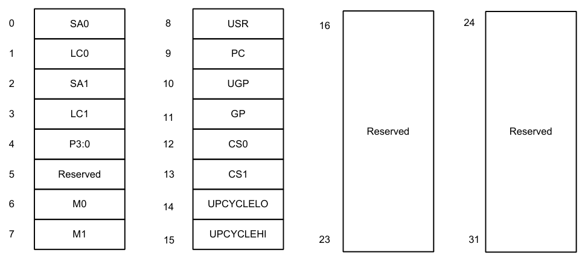

[← Contents](README.md)

## 11.2 CR

The CR instruction class includes instructions which manage control registers, including hardware looping, modulo addressing, and status flags.

CR instructions are executable on slot 3.

#### End loop instructions

The endloop instructions mark the end of a hardware loop. If the loop count (LC) register indicates that a loop should continue to iterate, the LC register is decremented and the program flow changes to the address in the start address (SA) register.

The endloopN instruction is actually a pseudo-instruction encoded in bits 15:14 of each instruction. Therefore, no distinct 32-bit encoding exists for this instruction.

| Syntax | Behavior |
|---|---|
| `endloop0` | `if (USR.LPCFG) {`<br>`if (USR.LPCFG==1) {`<br>`P3=0xff;`<br>`}`<br>`USR.LPCFG=USR.LPCFG-1;`<br>`}`<br>`if (LC0>1) {`<br>`PC=SA0;`<br>`LC0=LC0-1;`<br>`}` |
| `endloop01` | `if (USR.LPCFG) {`<br>`if (USR.LPCFG==1) {`<br>`P3=0xff;`<br>`}`<br>`USR.LPCFG=USR.LPCFG-1;`<br>`}`<br>`if (LC0>1) {`<br>`PC=SA0;`<br>`LC0=LC0-1;`<br>`} else {`<br>`if (LC1>1) {`<br>`PC=SA1;`<br>`LC1=LC1-1;`<br>`}`<br>`}` |
| `endloop1` | `if (LC1>1) {`<br>`PC=SA1;`<br>`LC1=LC1-1;`<br>`}` |

##### Class: N/A

##### Notes

- This instruction cannot be grouped in a packet with any program flow instructions.
- The Next PC value is the address immediately following the last instruction in the packet containing this instruction.
- The PC value is the address of the start of the packet

#### Corner detection acceleration

The FASTCORNER9 instruction takes the Ps and Pt values and treats them as a circular bit string. If any contiguous nine bits are set around the circle, the result is true, false otherwise. The sense may be optionally inverted. This instruction is used to accelerate FAST corner detection.

| Syntax | Behavior |
|---|---|
| `Pd=[!]fastcorner9(Ps,Pt)` | `PREDUSE_TIMING;`<br>`tmp.h[0]=(Ps<<8)\|Pt;`<br>`tmp.h[1]=(Ps<<8)\|Pt;`<br>`for (i = 1; i < 9; i++) {`<br>`tmp &= tmp >> 1;`<br>`}`<br>`Pd = tmp == 0 ? 0xff : 0x00;` |

##### Class: CR (slot 2,3)

##### Notes

- This instruction may execute on either slot2 or slot3, even though it is a CR-type

##### Intrinsics

|  |  |
|---|---|
| `Pd=!fastcorner9(Ps,Pt)` | `Byte Q6_p_not_fastcorner9_pp(Byte Ps, Byte Pt)` |
| `Pd=fastcorner9(Ps,Pt)` | `Byte Q6_p_fastcorner9_pp(Byte Ps, Byte Pt)` |

##### Encoding

| 31 | 30 | 29 | 28 | 27 | 26 | 25 | 24 | 23 | 22 | 21 | 20 | 19 | 18 | 17 | 16 | 15 | 14 | 13 | 12 | 11 | 10 | 9 | 8 | 7 | 6 | 5 | 4 | 3 | 2 | 1 | 0 |  |
|---|---|---|---|---|---|---|---|---|---|---|---|---|---|---|---|---|---|---|---|---|---|---|---|---|---|---|---|---|---|---|---|---|
| ICLASS | ICLASS | ICLASS | ICLASS |  | sm |  |  |  |  |  |  |  |  | s2 | s2 | Parse | Parse |  |  |  |  | t2 | t2 |  |  |  |  |  |  | d2 | d2 |  |
| 0 | 1 | 1 | 0 | 1 | 0 | 1 | 1 | 0 | 0 | 0 | 0 | - | - | s | s | P | P | 1 | - | - | - | t | t | 1 | - | - | 1 | - | - | d | d | Pd=fastcorner9(Ps,Pt) |
| 0 | 1 | 1 | 0 | 1 | 0 | 1 | 1 | 0 | 0 | 0 | 1 | - | - | s | s | P | P | 1 | - | - | - | t | t | 1 | - | - | 1 | - | - | d | d | Pd=!fastcorner9(Ps,Pt) |

| Field name | Description |
|---|---|
| `sm` | Supervisor mode only |
| `ICLASS` | Instruction class |
| `Parse` | Packet/loop parse bits |
| `d2` | Field to encode register d |
| `s2` | Field to encode register s |
| `t2` | Field to encode register t |

#### Logical reductions on predicates

The any8 instruction sets a destination predicate register to 0xff if any of the low eight bits in source predicate register Ps are set. Otherwise, the predicate is set to 0x00.

The all8 instruction sets a destination predicate register to 0xff if all of the low eight bits in the source predicate register Ps are set. Otherwise, the predicate is set to 0x00.

| Syntax | Behavior |
|---|---|
| `Pd=all8(Ps)` | `PREDUSE_TIMING;`<br>`Pd = (Ps == 0xff ? 0xff : 0x00);` |
| `Pd=any8(Ps)` | `PREDUSE_TIMING;`<br>`Pd = (Ps ? 0xff : 0x00);` |

##### Class: CR (slot 2,3)

##### Notes

- This instruction may execute on either slot2 or slot3, even though it is a CR-type

##### Intrinsics

|  |  |
|---|---|
| `Pd=all8(Ps)` | `Byte Q6_p_all8_p(Byte Ps)` |
| `Pd=any8(Ps)` | `Byte Q6_p_any8_p(Byte Ps)` |

##### Encoding

| 31 | 30 | 29 | 28 | 27 | 26 | 25 | 24 | 23 | 22 | 21 | 20 | 19 | 18 | 17 | 16 | 15 | 14 | 13 | 12 | 11 | 10 | 9 | 8 | 7 | 6 | 5 | 4 | 3 | 2 | 1 | 0 |  |
|---|---|---|---|---|---|---|---|---|---|---|---|---|---|---|---|---|---|---|---|---|---|---|---|---|---|---|---|---|---|---|---|---|
| ICLASS | ICLASS | ICLASS | ICLASS |  | sm |  |  |  |  |  |  |  |  | s2 | s2 | Parse | Parse |  |  |  |  |  |  |  |  |  |  |  |  | d2 | d2 |  |
| 0 | 1 | 1 | 0 | 1 | 0 | 1 | 1 | 1 | 0 | 0 | 0 | - | - | s | s | P | P | 0 | - | - | - | - | - | - | - | - | - | - | - | d | d | Pd=any8(Ps) |
| 0 | 1 | 1 | 0 | 1 | 0 | 1 | 1 | 1 | 0 | 1 | 0 | - | - | s | s | P | P | 0 | - | - | - | - | - | - | - | - | - | - | - | d | d | Pd=all8(Ps) |

| Field name | Description |
|---|---|
| `sm` | Supervisor mode only |
| `ICLASS` | Instruction class |
| `Parse` | Packet/loop parse bits |
| `d2` | Field to encode register d |
| `s2` | Field to encode register s |

#### Looping instructions

loopN is a single instruction which sets up a hardware loop. The N in the instruction name indicates the set of loop registers to use. Loop0 is the innermost loop, while loop1 is the outer loop. The loopN instruction first sets the start address (SA) register based on a PC-relative immediate add. The relative immediate is added to the PC and stored in SA. The loop count (LC) register is set to either an unsigned immediate or to a register value.

| Syntax | Behavior |
|---|---|
| `loop0(#r7:2,#U10)` | `apply_extension(#r);`<br>`#r=#r & ~PCALIGN_MASK;`<br>`SA0=PC+#r;`<br>`LC0=#U;`<br>`USR.LPCFG=0;` |
| `loop0(#r7:2,Rs)` | `apply_extension(#r);`<br>`#r=#r & ~PCALIGN_MASK;`<br>`SA0=PC+#r;`<br>`LC0=Rs;`<br>`USR.LPCFG=0;` |
| `loop1(#r7:2,#U10)` | `apply_extension(#r);`<br>`#r=#r & ~PCALIGN_MASK;`<br>`SA1=PC+#r;`<br>`LC1=#U;` |
| `loop1(#r7:2,Rs)` | `apply_extension(#r);`<br>`#r=#r & ~PCALIGN_MASK;`<br>`SA1=PC+#r;`<br>`LC1=Rs;` |

##### Class: CR (slot 3)

##### Notes

- This instruction cannot execute in the last address of a hardware loop.
- The Next PC value is the address immediately following the last instruction in the packet containing this instruction.
- The PC value is the address of the start of the packet
- A PC-relative address is formed by taking the decoded immediate value and adding it to the current PC value.

##### Encoding

| 31 | 30 | 29 | 28 | 27 | 26 | 25 | 24 | 23 | 22 | 21 | 20 | 19 | 18 | 17 | 16 | 15 | 14 | 13 | 12 | 11 | 10 | 9 | 8 | 7 | 6 | 5 | 4 | 3 | 2 | 1 | 0 |  |
|---|---|---|---|---|---|---|---|---|---|---|---|---|---|---|---|---|---|---|---|---|---|---|---|---|---|---|---|---|---|---|---|---|
| ICLASS | ICLASS | ICLASS | ICLASS |  | sm |  |  |  |  |  | s5 | s5 | s5 | s5 | s5 | Parse | Parse |  |  |  |  |  |  |  |  |  |  |  |  |  |  |  |
| 0 | 1 | 1 | 0 | 0 | 0 | 0 | 0 | 0 | 0 | 0 | s | s | s | s | s | P | P | - | i | i | i | i | i | - | - | - | i | i | - | - | - | loop0(#r7:2,Rs) |
| 0 | 1 | 1 | 0 | 0 | 0 | 0 | 0 | 0 | 0 | 1 | s | s | s | s | s | P | P | - | i | i | i | i | i | - | - | - | i | i | - | - | - | loop1(#r7:2,Rs) |
| ICLASS | ICLASS | ICLASS | ICLASS |  | sm |  |  |  |  |  |  |  |  |  |  | Parse | Parse |  |  |  |  |  |  |  |  |  |  |  |  |  |  |  |
| 0 | 1 | 1 | 0 | 1 | 0 | 0 | 1 | 0 | 0 | 0 | I | I | I | I | I | P | P | - | i | i | i | i | i | I | I | I | i | i | - | I | I | loop0(#r7:2,#U10) |
| 0 | 1 | 1 | 0 | 1 | 0 | 0 | 1 | 0 | 0 | 1 | I | I | I | I | I | P | P | - | i | i | i | i | i | I | I | I | i | i | - | I | I | loop1(#r7:2,#U10) |

| Field name | Description |
|---|---|
| `sm` | Supervisor mode only |
| `ICLASS` | Instruction class |
| `Parse` | Packet/loop parse bits |
| `s5` | Field to encode register s |

#### Add to PC

Add an immediate value to the program counter (PC) and place the result in a destination register. This instruction is typically used with a constant extender to add a 32-bit immediate value to PC.

| Syntax | Behavior |
|---|---|
| `Rd=add(pc,#u6)` | `Rd=PC+apply_extension(#u);` |

##### Class: CR (slot 3)

##### Encoding

| 31 | 30 | 29 | 28 | 27 | 26 | 25 | 24 | 23 | 22 | 21 | 20 | 19 | 18 | 17 | 16 | 15 | 14 | 13 | 12 | 11 | 10 | 9 | 8 | 7 | 6 | 5 | 4 | 3 | 2 | 1 | 0 |  |
|---|---|---|---|---|---|---|---|---|---|---|---|---|---|---|---|---|---|---|---|---|---|---|---|---|---|---|---|---|---|---|---|---|
| ICLASS | ICLASS | ICLASS | ICLASS |  | sm |  |  |  |  |  |  |  |  |  |  | Parse | Parse |  |  |  |  |  |  |  |  |  | d5 | d5 | d5 | d5 | d5 |  |
| 0 | 1 | 1 | 0 | 1 | 0 | 1 | 0 | 0 | 1 | 0 | 0 | 1 | 0 | 0 | 1 | P | P | - | i | i | i | i | i | i | - | - | d | d | d | d | d | Rd=add(pc,#u6) |

| Field name | Description |
|---|---|
| `sm` | Supervisor mode only |
| `ICLASS` | Instruction class |
| `Parse` | Packet/loop parse bits |
| `d5` | Field to encode register d |

#### Pipelined loop instructions

The spNloop0 instruction is a single instruction that sets up a hardware loop with automatic predicate control. This saves code size by enabling many software pipelined loops to generate without prologue code. Upon executing this instruction, the P3 register automatically clears. After the loop executes N times (where N is selectable from 1-3), the P3 register is set. This ensures that store instructions in the loop are predicated with P3 and thus not enabled during the pipeline warm-up.

In the spNloop0 instruction, the loop 0 (inner-loop) registers are used. This instruction sets the start address (SA0) register based on a PC-relative immediate add. The relative immediate is added to the PC and stored in SA0. The loop count (LC0) is set to either an unsigned immediate or to a register value. The predicate P3 is cleared. The USR.LPCFG bits are set based on the N value.

| Syntax | Behavior |
|---|---|
| `p3=sp1loop0(#r7:2,#U10)` | `apply_extension(#r);`<br>`#r=#r & ~PCALIGN_MASK;`<br>`SA0=PC+#r;`<br>`LC0=#U;`<br>`USR.LPCFG=1;`<br>`P3=0;` |
| `p3=sp1loop0(#r7:2,Rs)` | `apply_extension(#r);`<br>`#r=#r & ~PCALIGN_MASK;`<br>`SA0=PC+#r;`<br>`LC0=Rs;`<br>`USR.LPCFG=1;`<br>`P3=0;` |
| `p3=sp2loop0(#r7:2,#U10)` | `apply_extension(#r);`<br>`#r=#r & ~PCALIGN_MASK;`<br>`SA0=PC+#r;`<br>`LC0=#U;`<br>`USR.LPCFG=2;`<br>`P3=0;` |
| `p3=sp2loop0(#r7:2,Rs)` | `apply_extension(#r);`<br>`#r=#r & ~PCALIGN_MASK;`<br>`SA0=PC+#r;`<br>`LC0=Rs;`<br>`USR.LPCFG=2;`<br>`P3=0;` |
| `p3=sp3loop0(#r7:2,#U10)` | `apply_extension(#r);`<br>`#r=#r & ~PCALIGN_MASK;`<br>`SA0=PC+#r;`<br>`LC0=#U;`<br>`USR.LPCFG=3;`<br>`P3=0;` |
| `p3=sp3loop0(#r7:2,Rs)` | `apply_extension(#r);`<br>`#r=#r & ~PCALIGN_MASK;`<br>`SA0=PC+#r;`<br>`LC0=Rs;`<br>`USR.LPCFG=3;`<br>`P3=0;` |

##### Class: CR (slot 3)

##### Notes

- The predicate generated by this instruction can not be used as a .new predicate, nor can it be automatically ANDed with another predicate.
- This instruction cannot execute in the last address of a hardware loop.
- The Next PC value is the address immediately following the last instruction in the packet containing this instruction.
- The PC value is the address of the start of the packet
- A PC-relative address is formed by taking the decoded immediate value and adding it to the current PC value.

##### Encoding

| 31 | 30 | 29 | 28 | 27 | 26 | 25 | 24 | 23 | 22 | 21 | 20 | 19 | 18 | 17 | 16 | 15 | 14 | 13 | 12 | 11 | 10 | 9 | 8 | 7 | 6 | 5 | 4 | 3 | 2 | 1 | 0 |  |
|---|---|---|---|---|---|---|---|---|---|---|---|---|---|---|---|---|---|---|---|---|---|---|---|---|---|---|---|---|---|---|---|---|
| ICLASS | ICLASS | ICLASS | ICLASS |  | sm |  |  |  |  |  | s5 | s5 | s5 | s5 | s5 | Parse | Parse |  |  |  |  |  |  |  |  |  |  |  |  |  |  |  |
| 0 | 1 | 1 | 0 | 0 | 0 | 0 | 0 | 1 | 0 | 1 | s | s | s | s | s | P | P | - | i | i | i | i | i | - | - | - | i | i | - | - | - | p3=sp1loop0(#r7:2,Rs) |
| 0 | 1 | 1 | 0 | 0 | 0 | 0 | 0 | 1 | 1 | 0 | s | s | s | s | s | P | P | - | i | i | i | i | i | - | - | - | i | i | - | - | - | p3=sp2loop0(#r7:2,Rs) |
| 0 | 1 | 1 | 0 | 0 | 0 | 0 | 0 | 1 | 1 | 1 | s | s | s | s | s | P | P | - | i | i | i | i | i | - | - | - | i | i | - | - | - | p3=sp3loop0(#r7:2,Rs) |
| ICLASS | ICLASS | ICLASS | ICLASS |  | sm |  |  |  |  |  |  |  |  |  |  | Parse | Parse |  |  |  |  |  |  |  |  |  |  |  |  |  |  |  |
| 0 | 1 | 1 | 0 | 1 | 0 | 0 | 1 | 1 | 0 | 1 | I | I | I | I | I | P | P | - | i | i | i | i | i | I | I | I | i | i | - | I | I | p3=sp1loop0(#r7:2,#U10) |
| 0 | 1 | 1 | 0 | 1 | 0 | 0 | 1 | 1 | 1 | 0 | I | I | I | I | I | P | P | - | i | i | i | i | i | I | I | I | i | i | - | I | I | p3=sp2loop0(#r7:2,#U10) |
| 0 | 1 | 1 | 0 | 1 | 0 | 0 | 1 | 1 | 1 | 1 | I | I | I | I | I | P | P | - | i | i | i | i | i | I | I | I | i | i | - | I | I | p3=sp3loop0(#r7:2,#U10) |

| Field name | Description |
|---|---|
| `sm` | Supervisor mode only |
| `ICLASS` | Instruction class |
| `Parse` | Packet/loop parse bits |
| `s5` | Field to encode register s |

#### Logical operations on predicates

Perform bitwise logical operations on predicate registers.

| Syntax | Behavior |
|---|---|
| `Pd=Ps` | `Assembler mapped to: "Pd=or(Ps,Ps)"` |
| `Pd=and(Ps,and(Pt,[!]Pu))` | `PREDUSE_TIMING;`<br>`Pd = Ps & Pt & (~Pu);` |
| `Pd=and(Ps,or(Pt,[!]Pu))` | `PREDUSE_TIMING;`<br>`Pd = Ps & (Pt \| (~Pu));` |
| `Pd=and(Pt,[!]Ps)` | `PREDUSE_TIMING;`<br>`Pd=Pt & (~Ps);` |
| `Pd=not(Ps)` | `PREDUSE_TIMING;`<br>`Pd=~Ps;` |
| `Pd=or(Ps,and(Pt,[!]Pu))` | `PREDUSE_TIMING;`<br>`Pd = Ps \| (Pt & (~Pu));` |
| `Pd=or(Ps,or(Pt,[!]Pu))` | `PREDUSE_TIMING;`<br>`Pd = Ps \| Pt \| (~Pu);` |
| `Pd=or(Pt,[!]Ps)` | `PREDUSE_TIMING;`<br>`Pd=Pt \| (~Ps);` |
| `Pd=xor(Ps,Pt)` | `PREDUSE_TIMING;`<br>`Pd=Ps ^ Pt;` |

##### Class: CR (slot 2,3)

##### Notes

- This instruction may execute on either slot2 or slot3, even though it is a CR-type

##### Intrinsics

|  |  |
|---|---|
| `Pd=Ps` | `Byte Q6_p_equals_p(Byte Ps)` |
| `Pd=and(Ps,and(Pt,!Pu))` | `Byte Q6_p_and_and_ppnp(Byte Ps, Byte Pt, Byte Pu)` |
| `Pd=and(Ps,and(Pt,Pu))` | `Byte Q6_p_and_and_ppp(Byte Ps, Byte Pt, Byte Pu)` |
| `Pd=and(Ps,or(Pt,!Pu))` | `Byte Q6_p_and_or_ppnp(Byte Ps, Byte Pt, Byte Pu)` |
| `Pd=and(Ps,or(Pt,Pu))` | `Byte Q6_p_and_or_ppp(Byte Ps, Byte Pt, Byte Pu)` |
| `Pd=and(Pt,!Ps)` | `Byte Q6_p_and_pnp(Byte Pt, Byte Ps)` |
| `Pd=and(Pt,Ps)` | `Byte Q6_p_and_pp(Byte Pt, Byte Ps)` |
| `Pd=not(Ps)` | `Byte Q6_p_not_p(Byte Ps)` |
| `Pd=or(Ps,and(Pt,!Pu))` | `Byte Q6_p_or_and_ppnp(Byte Ps, Byte Pt, Byte Pu)` |
| `Pd=or(Ps,and(Pt,Pu))` | `Byte Q6_p_or_and_ppp(Byte Ps, Byte Pt, Byte Pu)` |
| `Pd=or(Ps,or(Pt,!Pu))` | `Byte Q6_p_or_or_ppnp(Byte Ps, Byte Pt, Byte Pu)` |
| `Pd=or(Ps,or(Pt,Pu))` | `Byte Q6_p_or_or_ppp(Byte Ps, Byte Pt, Byte Pu)` |
| `Pd=or(Pt,!Ps)` | `Byte Q6_p_or_pnp(Byte Pt, Byte Ps)` |
| `Pd=or(Pt,Ps)` | `Byte Q6_p_or_pp(Byte Pt, Byte Ps)` |
| `Pd=xor(Ps,Pt)` | `Byte Q6_p_xor_pp(Byte Ps, Byte Pt)` |

##### Encoding

| 31 | 30 | 29 | 28 | 27 | 26 | 25 | 24 | 23 | 22 | 21 | 20 | 19 | 18 | 17 | 16 | 15 | 14 | 13 | 12 | 11 | 10 | 9 | 8 | 7 | 6 | 5 | 4 | 3 | 2 | 1 | 0 |  |
|---|---|---|---|---|---|---|---|---|---|---|---|---|---|---|---|---|---|---|---|---|---|---|---|---|---|---|---|---|---|---|---|---|
| ICLASS | ICLASS | ICLASS | ICLASS |  | sm |  |  |  |  |  |  |  |  | s2 | s2 | Parse | Parse |  |  |  |  | t2 | t2 |  |  |  |  |  |  | d2 | d2 |  |
| 0 | 1 | 1 | 0 | 1 | 0 | 1 | 1 | 0 | 0 | 0 | 0 | - | - | s | s | P | P | 0 | - | - | - | t | t | - | - | - | - | - | - | d | d | Pd=and(Pt,Ps) |
| ICLASS | ICLASS | ICLASS | ICLASS |  | sm |  |  |  |  |  |  |  |  | s2 | s2 | Parse | Parse |  |  |  |  | t2 | t2 | u2 | u2 |  |  |  |  | d2 | d2 |  |
| 0 | 1 | 1 | 0 | 1 | 0 | 1 | 1 | 0 | 0 | 0 | 1 | - | - | s | s | P | P | 0 | - | - | - | t | t | u | u | - | - | - | - | d | d | Pd=and(Ps,and(Pt,Pu)) |
| ICLASS | ICLASS | ICLASS | ICLASS |  | sm |  |  |  |  |  |  |  |  | s2 | s2 | Parse | Parse |  |  |  |  | t2 | t2 |  |  |  |  |  |  | d2 | d2 |  |
| 0 | 1 | 1 | 0 | 1 | 0 | 1 | 1 | 0 | 0 | 1 | 0 | - | - | s | s | P | P | 0 | - | - | - | t | t | - | - | - | - | - | - | d | d | Pd=or(Pt,Ps) |
| ICLASS | ICLASS | ICLASS | ICLASS |  | sm |  |  |  |  |  |  |  |  | s2 | s2 | Parse | Parse |  |  |  |  | t2 | t2 | u2 | u2 |  |  |  |  | d2 | d2 |  |
| 0 | 1 | 1 | 0 | 1 | 0 | 1 | 1 | 0 | 0 | 1 | 1 | - | - | s | s | P | P | 0 | - | - | - | t | t | u | u | - | - | - | - | d | d | Pd=and(Ps,or(Pt,Pu)) |
| ICLASS | ICLASS | ICLASS | ICLASS |  | sm |  |  |  |  |  |  |  |  | s2 | s2 | Parse | Parse |  |  |  |  | t2 | t2 |  |  |  |  |  |  | d2 | d2 |  |
| 0 | 1 | 1 | 0 | 1 | 0 | 1 | 1 | 0 | 1 | 0 | 0 | - | - | s | s | P | P | 0 | - | - | - | t | t | - | - | - | - | - | - | d | d | Pd=xor(Ps,Pt) |
| ICLASS | ICLASS | ICLASS | ICLASS |  | sm |  |  |  |  |  |  |  |  | s2 | s2 | Parse | Parse |  |  |  |  | t2 | t2 | u2 | u2 |  |  |  |  | d2 | d2 |  |
| 0 | 1 | 1 | 0 | 1 | 0 | 1 | 1 | 0 | 1 | 0 | 1 | - | - | s | s | P | P | 0 | - | - | - | t | t | u | u | - | - | - | - | d | d | Pd=or(Ps,and(Pt,Pu)) |
| ICLASS | ICLASS | ICLASS | ICLASS |  | sm |  |  |  |  |  |  |  |  | s2 | s2 | Parse | Parse |  |  |  |  | t2 | t2 |  |  |  |  |  |  | d2 | d2 |  |
| 0 | 1 | 1 | 0 | 1 | 0 | 1 | 1 | 0 | 1 | 1 | 0 | - | - | s | s | P | P | 0 | - | - | - | t | t | - | - | - | - | - | - | d | d | Pd=and(Pt,!Ps) |
| ICLASS | ICLASS | ICLASS | ICLASS |  | sm |  |  |  |  |  |  |  |  | s2 | s2 | Parse | Parse |  |  |  |  | t2 | t2 | u2 | u2 |  |  |  |  | d2 | d2 |  |
| 0 | 1 | 1 | 0 | 1 | 0 | 1 | 1 | 0 | 1 | 1 | 1 | - | - | s | s | P | P | 0 | - | - | - | t | t | u | u | - | - | - | - | d | d | Pd=or(Ps,or(Pt,Pu)) |
| 0 | 1 | 1 | 0 | 1 | 0 | 1 | 1 | 1 | 0 | 0 | 1 | - | - | s | s | P | P | 0 | - | - | - | t | t | u | u | - | - | - | - | d | d | Pd=and(Ps,and(Pt,!Pu)) |
| 0 | 1 | 1 | 0 | 1 | 0 | 1 | 1 | 1 | 0 | 1 | 1 | - | - | s | s | P | P | 0 | - | - | - | t | t | u | u | - | - | - | - | d | d | Pd=and(Ps,or(Pt,!Pu)) |
| ICLASS | ICLASS | ICLASS | ICLASS |  | sm |  |  |  |  |  |  |  |  | s2 | s2 | Parse | Parse |  |  |  |  |  |  |  |  |  |  |  |  | d2 | d2 |  |
| 0 | 1 | 1 | 0 | 1 | 0 | 1 | 1 | 1 | 1 | 0 | 0 | - | - | s | s | P | P | 0 | - | - | - | - | - | - | - | - | - | - | - | d | d | Pd=not(Ps) |
| ICLASS | ICLASS | ICLASS | ICLASS |  | sm |  |  |  |  |  |  |  |  | s2 | s2 | Parse | Parse |  |  |  |  | t2 | t2 | u2 | u2 |  |  |  |  | d2 | d2 |  |
| 0 | 1 | 1 | 0 | 1 | 0 | 1 | 1 | 1 | 1 | 0 | 1 | - | - | s | s | P | P | 0 | - | - | - | t | t | u | u | - | - | - | - | d | d | Pd=or(Ps,and(Pt,!Pu)) |
| ICLASS | ICLASS | ICLASS | ICLASS |  | sm |  |  |  |  |  |  |  |  | s2 | s2 | Parse | Parse |  |  |  |  | t2 | t2 |  |  |  |  |  |  | d2 | d2 |  |
| 0 | 1 | 1 | 0 | 1 | 0 | 1 | 1 | 1 | 1 | 1 | 0 | - | - | s | s | P | P | 0 | - | - | - | t | t | - | - | - | - | - | - | d | d | Pd=or(Pt,!Ps) |
| ICLASS | ICLASS | ICLASS | ICLASS |  | sm |  |  |  |  |  |  |  |  | s2 | s2 | Parse | Parse |  |  |  |  | t2 | t2 | u2 | u2 |  |  |  |  | d2 | d2 |  |
| 0 | 1 | 1 | 0 | 1 | 0 | 1 | 1 | 1 | 1 | 1 | 1 | - | - | s | s | P | P | 0 | - | - | - | t | t | u | u | - | - | - | - | d | d | Pd=or(Ps,or(Pt,!Pu)) |

| Field name | Description |
|---|---|
| `sm` | Supervisor mode only |
| `ICLASS` | Instruction class |
| `Parse` | Packet/loop parse bits |
| `d2` | Field to encode register d |
| `s2` | Field to encode register s |
| `t2` | Field to encode register t |
| `u2` | Field to encode register u |

#### User control register transfer

Move 32- or 64-bit values between a user control register and a general register. The user control registers include SA, LC, Predicates, M, USR, PC, UGP, GP, and CS, and UPCYCLE. Registers are moved as singles or as aligned 64-bit pairs.

The PC register is not writable. A program flow instruction must be used to change the PC value.



```text
0 SA0 8 USR 16 24
1 LC0 9 PC
2 SA1 10 UGP
3 LC1 GP
11
Reserved Reserved
4 P3:0 12 CS0
5 Reserved 13 CS1
6 M0 UPCYCLELO
14
7 M1 UPCYCLEHI
15 23 31
```

**Figure 11-1  User control registers and their register field encodings**

| Syntax | Behavior |
|---|---|
| `Cd=Rs` | `Cd=Rs;` |
| `Cdd=Rss` | `Cdd=Rss;` |
| `Rd=Cs` | `Rd=Cs;` |
| `Rdd=Css` | `Rdd=Css;` |

##### Class: CR (slot 3)

##### Encoding

| 31 | 30 | 29 | 28 | 27 | 26 | 25 | 24 | 23 | 22 | 21 | 20 | 19 | 18 | 17 | 16 | 15 | 14 | 13 | 12 | 11 | 10 | 9 | 8 | 7 | 6 | 5 | 4 | 3 | 2 | 1 | 0 |  |
|---|---|---|---|---|---|---|---|---|---|---|---|---|---|---|---|---|---|---|---|---|---|---|---|---|---|---|---|---|---|---|---|---|
| ICLASS | ICLASS | ICLASS | ICLASS |  | sm |  |  |  |  |  | s5 | s5 | s5 | s5 | s5 | Parse | Parse |  |  |  |  |  |  |  |  |  | d5 | d5 | d5 | d5 | d5 |  |
| 0 | 1 | 1 | 0 | 0 | 0 | 1 | 0 | 0 | 0 | 1 | s | s | s | s | s | P | P | - | - | - | - | - | - | - | - | - | d | d | d | d | d | Cd=Rs |
| 0 | 1 | 1 | 0 | 0 | 0 | 1 | 1 | 0 | 0 | 1 | s | s | s | s | s | P | P | - | - | - | - | - | - | - | - | - | d | d | d | d | d | Cdd=Rss |
| 0 | 1 | 1 | 0 | 1 | 0 | 0 | 0 | 0 | 0 | 0 | s | s | s | s | s | P | P | - | - | - | - | - | - | - | - | - | d | d | d | d | d | Rdd=Css |
| 0 | 1 | 1 | 0 | 1 | 0 | 1 | 0 | 0 | 0 | 0 | s | s | s | s | s | P | P | - | - | - | - | - | - | - | - | - | d | d | d | d | d | Rd=Cs |

| Field name | Description |
|---|---|
| `sm` | Supervisor mode only |
| `ICLASS` | Instruction class |
| `Parse` | Packet/loop parse bits |
| `d5` | Field to encode register d |
| `s5` | Field to encode register s |
