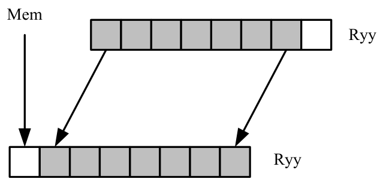
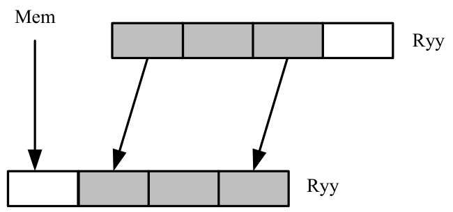
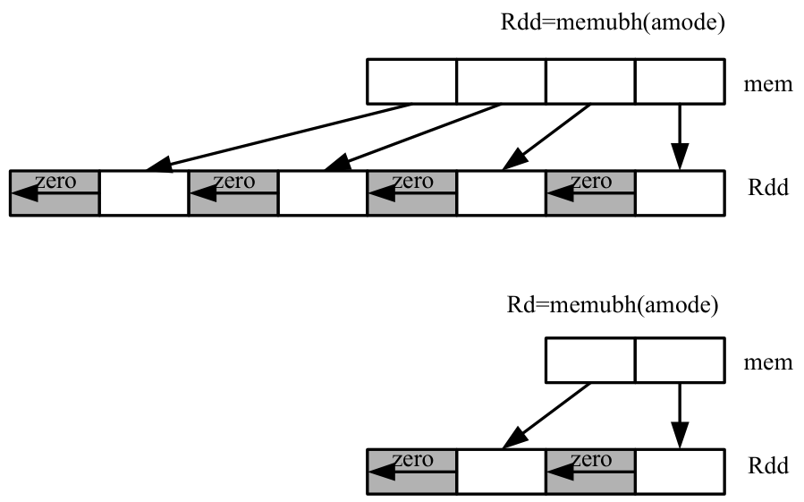

## 11.5 LD

The LD instruction class includes load instructions, which are used to load values into registers.

LD instructions are executable on slot 0 and slot 1.

#### Load doubleword

Load a 64-bit doubleword from memory and place in a destination register pair.

| Syntax | Behavior |
|---|---|
| `Rdd=memd(Re=#U6)` | `apply_extension(#U);`<br>`EA=#U;`<br>`Rdd = *EA;`<br>`Re=#U;` |
| `Rdd=memd(Rs+#s11:3)` | `apply_extension(#s);`<br>`EA=Rs+#s;`<br>`Rdd = *EA;` |
| `Rdd=memd(Rs+Rt<<#u2)` | `EA=Rs+(Rt<<#u);`<br>`Rdd = *EA;` |
| `Rdd=memd(Rt<<#u2+#U6)` | `apply_extension(#U);`<br>`EA=#U+(Rt<<#u);`<br>`Rdd = *EA;` |
| `Rdd=memd(Rx++#s4:3)` | `EA=Rx;`<br>`Rx=Rx+#s;`<br>`Rdd = *EA;` |
| `Rdd=memd(Rx++#s4:3:circ(Mu))` | `EA=Rx;`<br>`Rx=Rx=circ_add(Rx,#s,MuV);`<br>`Rdd = *EA;` |
| `Rdd=memd(Rx++I:circ(Mu))` | `EA=Rx;`<br>`Rx=Rx=circ_add(Rx,I<<3,MuV);`<br>`Rdd = *EA;` |
| `Rdd=memd(Rx++Mu)` | `EA=Rx;`<br>`Rx=Rx+MuV;`<br>`Rdd = *EA;` |
| `Rdd=memd(Rx++Mu:brev)` | `EA=Rx.h[1] \| brev(Rx.h[0]);`<br>`Rx=Rx+MuV;`<br>`Rdd = *EA;` |
| `Rdd=memd(gp+#u16:3)` | `apply_extension(#u);`<br>`EA=(Constant_extended ? (0) : GP)+#u;`<br>`Rdd = *EA;` |

##### Class: LD (slots 0,1)

##### Intrinsics

|  |  |
|---|---|
| `Rdd=memd(Rx++#s4:3:circ(Mu))` | `Word32 Q6_R_memd_IM_circ(void** StartAddress, Word32 Is4_3, Word32 Mu, void* BaseAddress)` |
| `Rdd=memd(Rx++I:circ(Mu))` | `Word32 Q6_R_memd_M_circ(void** StartAddress, Word32 Mu, void* BaseAddress)` |

##### Encoding

| 31 | 30 | 29 | 28 | 27 | 26 | 25 | 24 | 23 | 22 | 21 | 20 | 19 | 18 | 17 | 16 | 15 | 14 | 13 | 12 | 11 | 10 | 9 | 8 | 7 | 6 | 5 | 4 | 3 | 2 | 1 | 0 |  |
|---|---|---|---|---|---|---|---|---|---|---|---|---|---|---|---|---|---|---|---|---|---|---|---|---|---|---|---|---|---|---|---|---|
| ICLASS | ICLASS | ICLASS | ICLASS |  |  |  |  |  |  |  | s5 | s5 | s5 | s5 | s5 | Parse | Parse |  | t5 | t5 | t5 | t5 | t5 |  |  |  | d5 | d5 | d5 | d5 | d5 |  |
| 0 | 0 | 1 | 1 | 1 | 0 | 1 | 0 | 1 | 1 | 0 | s | s | s | s | s | P | P | i | t | t | t | t | t | i | - | - | d | d | d | d | d | Rdd=memd(Rs+Rt<<#u2) |
| ICLASS | ICLASS | ICLASS | ICLASS |  |  |  |  | Type | Type | U N |  |  |  |  |  | Parse | Parse |  |  |  |  |  |  |  |  |  | d5 | d5 | d5 | d5 | d5 |  |
| 0 | 1 | 0 | 0 | 1 | i | i | 1 | 1 | 1 | 0 | i | i | i | i | i | P | P | i | i | i | i | i | i | i | i | i | d | d | d | d | d | Rdd=memd(gp+#u16:3) |
| ICLASS | ICLASS | ICLASS | ICLASS | Amode | Amode | Amode | Type | Type | Type | U N | s5 | s5 | s5 | s5 | s5 | Parse | Parse |  |  |  |  |  |  |  |  |  | d5 | d5 | d5 | d5 | d5 |  |
| 1 | 0 | 0 | 1 | 0 | i | i | 1 | 1 | 1 | 0 | s | s | s | s | s | P | P | i | i | i | i | i | i | i | i | i | d | d | d | d | d | Rdd=memd(Rs+#s11:3) |
| ICLASS | ICLASS | ICLASS | ICLASS | Amode | Amode | Amode | Type | Type | Type | U N | x5 | x5 | x5 | x5 | x5 | Parse | Parse | u1 |  |  |  |  |  |  |  |  | d5 | d5 | d5 | d5 | d5 |  |
| 1 | 0 | 0 | 1 | 1 | 0 | 0 | 1 | 1 | 1 | 0 | x | x | x | x | x | P | P | u | 0 | - | - | 0 | i | i | i | i | d | d | d | d | d | Rdd=memd(Rx++#s4:3:circ(Mu)) |
| 1 | 0 | 0 | 1 | 1 | 0 | 0 | 1 | 1 | 1 | 0 | x | x | x | x | x | P | P | u | 0 | - | - | 1 | - | 0 | - | - | d | d | d | d | d | Rdd=memd(Rx++I:circ(Mu)) |
| ICLASS | ICLASS | ICLASS | ICLASS | Amode | Amode | Amode | Type | Type | Type | U N | e5 | e5 | e5 | e5 | e5 | Parse | Parse |  |  |  |  |  |  |  |  |  | d5 | d5 | d5 | d5 | d5 |  |
| 1 | 0 | 0 | 1 | 1 | 0 | 1 | 1 | 1 | 1 | 0 | e | e | e | e | e | P | P | 0 | 1 | I | I | I | I | - | I | I | d | d | d | d | d | Rdd=memd(Re=#U6) |
| ICLASS | ICLASS | ICLASS | ICLASS | Amode | Amode | Amode | Type | Type | Type | U N | x5 | x5 | x5 | x5 | x5 | Parse | Parse |  |  |  |  |  |  |  |  |  | d5 | d5 | d5 | d5 | d5 |  |
| 1 | 0 | 0 | 1 | 1 | 0 | 1 | 1 | 1 | 1 | 0 | x | x | x | x | x | P | P | 0 | 0 | - | - | - | i | i | i | i | d | d | d | d | d | Rdd=memd(Rx++#s4:3) |
| ICLASS | ICLASS | ICLASS | ICLASS | Amode | Amode | Amode | Type | Type | Type | U N | t5 | t5 | t5 | t5 | t5 | Parse | Parse |  |  |  |  |  |  |  |  |  | d5 | d5 | d5 | d5 | d5 |  |
| 1 | 0 | 0 | 1 | 1 | 1 | 0 | 1 | 1 | 1 | 0 | t | t | t | t | t | P | P | i | 1 | I | I | I | I | i | I | I | d | d | d | d | d | Rdd=memd(Rt<<#u2+#U6) |
| ICLASS | ICLASS | ICLASS | ICLASS | Amode | Amode | Amode | Type | Type | Type | U N | x5 | x5 | x5 | x5 | x5 | Parse | Parse | u1 |  |  |  |  |  |  |  |  | d5 | d5 | d5 | d5 | d5 |  |
| 1 | 0 | 0 | 1 | 1 | 1 | 0 | 1 | 1 | 1 | 0 | x | x | x | x | x | P | P | u | 0 | - | - | - | - | 0 | - | - | d | d | d | d | d | Rdd=memd(Rx++Mu) |
| 1 | 0 | 0 | 1 | 1 | 1 | 1 | 1 | 1 | 1 | 0 | x | x | x | x | x | P | P | u | 0 | - | - | - | - | 0 | - | - | d | d | d | d | d | Rdd=memd(Rx++Mu:brev) |

| Field name | Description |
|---|---|
| `ICLASS` | Instruction class |
| `Amode` | Amode |
| `Type` | Type |
| `UN` | Unsigned |
| `Parse` | Packet/loop parse bits |
| `d5` | Field to encode register d |
| `e5` | Field to encode register e |
| `s5` | Field to encode register s |
| `t5` | Field to encode register t |
| `u1` | Field to encode register u |
| `x5` | Field to encode register x |

#### Load-acquire doubleword

Load a 64-bit doubleword from memory and place in a destination register pair. The load-acquire memory operation is observed before any following memory operations (in program order) have been observed at the local point of serialization. A different order may be observed at the global point of serialization. (see Ordering and Synchronization).

| Syntax | Behavior |
|---|---|
| `Rdd=memd_aq(Rs)` | `EA=Rs;`<br>`Rdd = *EA` |

##### Class: LD (slots 0)

##### Encoding

| 31 | 30 | 29 | 28 | 27 | 26 | 25 | 24 | 23 | 22 | 21 | 20 | 19 | 18 | 17 | 16 | 15 | 14 | 13 | 12 | 11 | 10 | 9 | 8 | 7 | 6 | 5 | 4 | 3 | 2 | 1 | 0 |  |
|---|---|---|---|---|---|---|---|---|---|---|---|---|---|---|---|---|---|---|---|---|---|---|---|---|---|---|---|---|---|---|---|---|
| ICLASS | ICLASS | ICLASS | ICLASS | Amode | Amode | Amode | Type | Type | Type | U N | s5 | s5 | s5 | s5 | s5 | Parse | Parse |  |  |  |  |  |  |  |  |  | d5 | d5 | d5 | d5 | d5 |  |
| 1 | 0 | 0 | 1 | 0 | 0 | 1 | 0 | 0 | 0 | 0 | s | s | s | s | s | P | P | 0 | 1 | 1 | - | - | - | 0 | 0 | 0 | d | d | d | d | d | Rdd=memd_aq(Rs) |

| Field name | Description |
|---|---|
| `ICLASS` | Instruction class |
| `Amode` | Amode |
| `Type` | Type |
| `UN` | Unsigned |
| `Parse` | Packet/loop parse bits |
| `d5` | Field to encode register d |
| `s5` | Field to encode register s |

#### Load doubleword conditionally

Load a 64-bit doubleword from memory and place in a destination register pair.

This instruction is conditional based on a predicate value. If the predicate is true, the instruction is performed, otherwise it is treated as a NOP.

| Syntax | Behavior |
|---|---|
| `if ([!]Pt[.new]) Rdd=memd(#u6)` | `apply_extension(#u);`<br>`EA=#u;`<br>`if ([!]Pt[.new][0]) {`<br>`Rdd = *EA;`<br>`} else {`<br>`NOP;`<br>`}` |
| `if ([!]Pt[.new]) `<br>`Rdd=memd(Rs+#u6:3)` | `apply_extension(#u);`<br>`EA=Rs+#u;`<br>`if ([!]Pt[.new][0]) {`<br>`Rdd = *EA;`<br>`} else {`<br>`NOP;`<br>`}` |
| `if ([!]Pt[.new]) `<br>`Rdd=memd(Rx++#s4:3)` | `EA=Rx;`<br>`if([!]Pt[.new][0]){`<br>`Rx=Rx+#s;`<br>`Rdd = *EA;`<br>`} else {`<br>`NOP;`<br>`}` |
| `if ([!]Pv[.new]) `<br>`Rdd=memd(Rs+Rt<<#u2)` | `EA=Rs+(Rt<<#u);`<br>`if ([!]Pv[.new][0]) {`<br>`Rdd = *EA;`<br>`} else {`<br>`NOP;`<br>`}` |

##### Class: LD (slots 0,1)

##### Encoding

| 31 | 30 | 29 | 28 | 27 | 26 | 25 | 24 | 23 | 22 | 21 | 20 | 19 | 18 | 17 | 16 | 15 | 14 | 13 | 12 | 11 | 10 | 9 | 8 | 7 | 6 | 5 | 4 | 3 | 2 | 1 | 0 |  |
|---|---|---|---|---|---|---|---|---|---|---|---|---|---|---|---|---|---|---|---|---|---|---|---|---|---|---|---|---|---|---|---|---|
| ICLASS | ICLASS | ICLASS | ICLASS |  |  |  |  |  |  |  | s5 | s5 | s5 | s5 | s5 | Parse | Parse |  | t5 | t5 | t5 | t5 | t5 |  |  |  | d5 | d5 | d5 | d5 | d5 |  |
| 0 | 0 | 1 | 1 | 0 | 0 | 0 | 0 | 1 | 1 | 0 | s | s | s | s | s | P | P | i | t | t | t | t | t | i | v | v | d | d | d | d | d | if (Pv) Rdd=memd(Rs+Rt<<#u2) |
| 0 | 0 | 1 | 1 | 0 | 0 | 0 | 1 | 1 | 1 | 0 | s | s | s | s | s | P | P | i | t | t | t | t | t | i | v | v | d | d | d | d | d | if (!Pv) Rdd=memd(Rs+Rt<<#u2) |
| 0 | 0 | 1 | 1 | 0 | 0 | 1 | 0 | 1 | 1 | 0 | s | s | s | s | s | P | P | i | t | t | t | t | t | i | v | v | d | d | d | d | d | if (Pv.new) Rdd=memd(Rs+Rt<<#u2) |
| 0 | 0 | 1 | 1 | 0 | 0 | 1 | 1 | 1 | 1 | 0 | s | s | s | s | s | P | P | i | t | t | t | t | t | i | v | v | d | d | d | d | d | if (!Pv.new) Rdd=memd(Rs+Rt<<#u2) |
| ICLASS | ICLASS | ICLASS | ICLASS |  | Se ns e | Pr ed Ne w |  | Type | Type | U N | s5 | s5 | s5 | s5 | s5 | Parse | Parse |  | t2 | t2 |  |  |  |  |  |  | d5 | d5 | d5 | d5 | d5 |  |
| 0 | 1 | 0 | 0 | 0 | 0 | 0 | 1 | 1 | 1 | 0 | s | s | s | s | s | P | P | 0 | t | t | i | i | i | i | i | i | d | d | d | d | d | if (Pt) Rdd=memd(Rs+#u6:3) |
| 0 | 1 | 0 | 0 | 0 | 0 | 1 | 1 | 1 | 1 | 0 | s | s | s | s | s | P | P | 0 | t | t | i | i | i | i | i | i | d | d | d | d | d | if (Pt.new) Rdd=memd(Rs+#u6:3) |
| 0 | 1 | 0 | 0 | 0 | 1 | 0 | 1 | 1 | 1 | 0 | s | s | s | s | s | P | P | 0 | t | t | i | i | i | i | i | i | d | d | d | d | d | if (!Pt) Rdd=memd(Rs+#u6:3) |
| 0 | 1 | 0 | 0 | 0 | 1 | 1 | 1 | 1 | 1 | 0 | s | s | s | s | s | P | P | 0 | t | t | i | i | i | i | i | i | d | d | d | d | d | if (!Pt.new) Rdd=memd(Rs+#u6:3) |
| ICLASS | ICLASS | ICLASS | ICLASS | Amode | Amode | Amode | Type | Type | Type | U N | x5 | x5 | x5 | x5 | x5 | Parse | Parse |  |  |  | t2 | t2 |  |  |  |  | d5 | d5 | d5 | d5 | d5 |  |
| 1 | 0 | 0 | 1 | 1 | 0 | 1 | 1 | 1 | 1 | 0 | x | x | x | x | x | P | P | 1 | 0 | 0 | t | t | i | i | i | i | d | d | d | d | d | if (Pt) Rdd=memd(Rx++#s4:3) |
| 1 | 0 | 0 | 1 | 1 | 0 | 1 | 1 | 1 | 1 | 0 | x | x | x | x | x | P | P | 1 | 0 | 1 | t | t | i | i | i | i | d | d | d | d | d | if (!Pt) Rdd=memd(Rx++#s4:3) |
| 1 | 0 | 0 | 1 | 1 | 0 | 1 | 1 | 1 | 1 | 0 | x | x | x | x | x | P | P | 1 | 1 | 0 | t | t | i | i | i | i | d | d | d | d | d | if (Pt.new) Rdd=memd(Rx++#s4:3) |
| 1 | 0 | 0 | 1 | 1 | 0 | 1 | 1 | 1 | 1 | 0 | x | x | x | x | x | P | P | 1 | 1 | 1 | t | t | i | i | i | i | d | d | d | d | d | if (!Pt.new) Rdd=memd(Rx++#s4:3) |
| ICLASS | ICLASS | ICLASS | ICLASS | Amode | Amode | Amode | Type | Type | Type | U N |  |  |  |  |  | Parse | Parse |  |  |  | t2 | t2 |  |  |  |  | d5 | d5 | d5 | d5 | d5 |  |
| 1 | 0 | 0 | 1 | 1 | 1 | 1 | 1 | 1 | 1 | 0 | i | i | i | i | i | P | P | 1 | 0 | 0 | t | t | i | 1 | - | - | d | d | d | d | d | if (Pt) Rdd=memd(#u6) |
| 1 | 0 | 0 | 1 | 1 | 1 | 1 | 1 | 1 | 1 | 0 | i | i | i | i | i | P | P | 1 | 0 | 1 | t | t | i | 1 | - | - | d | d | d | d | d | if (!Pt) Rdd=memd(#u6) |
| 1 | 0 | 0 | 1 | 1 | 1 | 1 | 1 | 1 | 1 | 0 | i | i | i | i | i | P | P | 1 | 1 | 0 | t | t | i | 1 | - | - | d | d | d | d | d | if (Pt.new) Rdd=memd(#u6) |
| 1 | 0 | 0 | 1 | 1 | 1 | 1 | 1 | 1 | 1 | 0 | i | i | i | i | i | P | P | 1 | 1 | 1 | t | t | i | 1 | - | - | d | d | d | d | d | if (!Pt.new) Rdd=memd(#u6) |

| Field name | Description |
|---|---|
| `ICLASS` | Instruction class |
| `Amode` | Amode |
| `Type` | Type |
| `UN` | Unsigned |
| `PredNew` | PredNew |
| `Sense` | Sense |
| `Parse` | Packet/loop parse bits |
| `d5` | Field to encode register d |
| `s5` | Field to encode register s |
| `t2` | Field to encode register t |
| `t5` | Field to encode register t |
| `v2` | Field to encode register v |
| `x5` | Field to encode register x |

#### Load byte

Load a signed byte from memory. The byte at the effective address in memory is placed in the least-significant 8 bits of the destination register. The destination register is then sign-extended from 8 bits to 32.

| Syntax | Behavior |
|---|---|
| `Rd=memb(Re=#U6)` | `apply_extension(#U);`<br>`EA=#U;`<br>`Rd = *EA;`<br>`Re=#U;` |
| `Rd=memb(Rs+#s11:0)` | `apply_extension(#s);`<br>`EA=Rs+#s;`<br>`Rd = *EA;` |
| `Rd=memb(Rs+Rt<<#u2)` | `EA=Rs+(Rt<<#u);`<br>`Rd = *EA;` |
| `Rd=memb(Rt<<#u2+#U6)` | `apply_extension(#U);`<br>`EA=#U+(Rt<<#u);`<br>`Rd = *EA;` |
| `Rd=memb(Rx++#s4:0)` | `EA=Rx;`<br>`Rx=Rx+#s;`<br>`Rd = *EA;` |
| `Rd=memb(Rx++#s4:0:circ(Mu))` | `EA=Rx;`<br>`Rx=Rx=circ_add(Rx,#s,MuV);`<br>`Rd = *EA;` |
| `Rd=memb(Rx++I:circ(Mu))` | `EA=Rx;`<br>`Rx=Rx=circ_add(Rx,I<<0,MuV);`<br>`Rd = *EA;` |
| `Rd=memb(Rx++Mu)` | `EA=Rx;`<br>`Rx=Rx+MuV;`<br>`Rd = *EA;` |
| `Rd=memb(Rx++Mu:brev)` | `EA=Rx.h[1] \| brev(Rx.h[0]);`<br>`Rx=Rx+MuV;`<br>`Rd = *EA;` |
| `Rd=memb(gp+#u16:0)` | `apply_extension(#u);`<br>`EA=(Constant_extended ? (0) : GP)+#u;`<br>`Rd = *EA;` |

##### Class: LD (slots 0,1)

##### Intrinsics

|  |  |
|---|---|
| `Rd=memb(Rx++#s4:0:circ(Mu` | `Word32 Q6_R_memb_IM_circ(void** StartAddress, Word32` |
| `))` | `Is4_0, Word32 Mu, void* BaseAddress)` |
| `Rd=memb(Rx++I:circ(Mu))` | `Word32 Q6_R_memb_M_circ(void** StartAddress, Word32 Mu, void* BaseAddress)` |

##### Encoding

| 31 | 30 | 29 | 28 | 27 | 26 | 25 | 24 | 23 | 22 | 21 | 20 | 19 | 18 | 17 | 16 | 15 | 14 | 13 | 12 | 11 | 10 | 9 | 8 | 7 | 6 | 5 | 4 | 3 | 2 | 1 | 0 |  |
|---|---|---|---|---|---|---|---|---|---|---|---|---|---|---|---|---|---|---|---|---|---|---|---|---|---|---|---|---|---|---|---|---|
| ICLASS | ICLASS | ICLASS | ICLASS |  |  |  |  |  |  |  | s5 | s5 | s5 | s5 | s5 | Parse | Parse |  | t5 | t5 | t5 | t5 | t5 |  |  |  | d5 | d5 | d5 | d5 | d5 |  |
| 0 | 0 | 1 | 1 | 1 | 0 | 1 | 0 | 0 | 0 | 0 | s | s | s | s | s | P | P | i | t | t | t | t | t | i | - | - | d | d | d | d | d | Rd=memb(Rs+Rt<<#u2) |
| ICLASS | ICLASS | ICLASS | ICLASS |  |  |  |  | Type | Type | U N |  |  |  |  |  | Parse | Parse |  |  |  |  |  |  |  |  |  | d5 | d5 | d5 | d5 | d5 |  |
| 0 | 1 | 0 | 0 | 1 | i | i | 1 | 0 | 0 | 0 | i | i | i | i | i | P | P | i | i | i | i | i | i | i | i | i | d | d | d | d | d | Rd=memb(gp+#u16:0) |
| ICLASS | ICLASS | ICLASS | ICLASS | Amode | Amode | Amode | Type | Type | Type | U N | s5 | s5 | s5 | s5 | s5 | Parse | Parse |  |  |  |  |  |  |  |  |  | d5 | d5 | d5 | d5 | d5 |  |
| 1 | 0 | 0 | 1 | 0 | i | i | 1 | 0 | 0 | 0 | s | s | s | s | s | P | P | i | i | i | i | i | i | i | i | i | d | d | d | d | d | Rd=memb(Rs+#s11:0) |
| ICLASS | ICLASS | ICLASS | ICLASS | Amode | Amode | Amode | Type | Type | Type | U N | x5 | x5 | x5 | x5 | x5 | Parse | Parse | u1 |  |  |  |  |  |  |  |  | d5 | d5 | d5 | d5 | d5 |  |
| 1 | 0 | 0 | 1 | 1 | 0 | 0 | 1 | 0 | 0 | 0 | x | x | x | x | x | P | P | u | 0 | - | - | 0 | i | i | i | i | d | d | d | d | d | Rd=memb(Rx++#s4:0:circ(Mu)) |
| 1 | 0 | 0 | 1 | 1 | 0 | 0 | 1 | 0 | 0 | 0 | x | x | x | x | x | P | P | u | 0 | - | - | 1 | - | 0 | - | - | d | d | d | d | d | Rd=memb(Rx++I:circ(Mu)) |
| ICLASS | ICLASS | ICLASS | ICLASS | Amode | Amode | Amode | Type | Type | Type | U N | e5 | e5 | e5 | e5 | e5 | Parse | Parse |  |  |  |  |  |  |  |  |  | d5 | d5 | d5 | d5 | d5 |  |
| 1 | 0 | 0 | 1 | 1 | 0 | 1 | 1 | 0 | 0 | 0 | e | e | e | e | e | P | P | 0 | 1 | I | I | I | I | - | I | I | d | d | d | d | d | Rd=memb(Re=#U6) |
| ICLASS | ICLASS | ICLASS | ICLASS | Amode | Amode | Amode | Type | Type | Type | U N | x5 | x5 | x5 | x5 | x5 | Parse | Parse |  |  |  |  |  |  |  |  |  | d5 | d5 | d5 | d5 | d5 |  |
| 1 | 0 | 0 | 1 | 1 | 0 | 1 | 1 | 0 | 0 | 0 | x | x | x | x | x | P | P | 0 | 0 | - | - | - | i | i | i | i | d | d | d | d | d | Rd=memb(Rx++#s4:0) |
| ICLASS | ICLASS | ICLASS | ICLASS | Amode | Amode | Amode | Type | Type | Type | U N | t5 | t5 | t5 | t5 | t5 | Parse | Parse |  |  |  |  |  |  |  |  |  | d5 | d5 | d5 | d5 | d5 |  |
| 1 | 0 | 0 | 1 | 1 | 1 | 0 | 1 | 0 | 0 | 0 | t | t | t | t | t | P | P | i | 1 | I | I | I | I | i | I | I | d | d | d | d | d | Rd=memb(Rt<<#u2+#U6) |
| ICLASS | ICLASS | ICLASS | ICLASS | Amode | Amode | Amode | Type | Type | Type | U N | x5 | x5 | x5 | x5 | x5 | Parse | Parse | u1 |  |  |  |  |  |  |  |  | d5 | d5 | d5 | d5 | d5 |  |
| 1 | 0 | 0 | 1 | 1 | 1 | 0 | 1 | 0 | 0 | 0 | x | x | x | x | x | P | P | u | 0 | - | - | - | - | 0 | - | - | d | d | d | d | d | Rd=memb(Rx++Mu) |
| 1 | 0 | 0 | 1 | 1 | 1 | 1 | 1 | 0 | 0 | 0 | x | x | x | x | x | P | P | u | 0 | - | - | - | - | 0 | - | - | d | d | d | d | d | Rd=memb(Rx++Mu:brev) |

| Field name | Description |
|---|---|
| `ICLASS` | Instruction class |
| `Amode` | Amode |
| `Type` | Type |
| `UN` | Unsigned |
| `Parse` | Packet/loop parse bits |
| `d5` | Field to encode register d |
| `e5` | Field to encode register e |
| `s5` | Field to encode register s |
| `t5` | Field to encode register t |
| `u1` | Field to encode register u |
| `x5` | Field to encode register x |

#### Load byte conditionally

Load a signed byte from memory. The byte at the effective address in memory is placed in the least-significant 8 bits of the destination register. The destination register is then sign-extended from 8 bits to 32.

This instruction is conditional based on a predicate value. If the predicate is true, the instruction is performed, otherwise it is treated as a NOP.

| Syntax | Behavior |
|---|---|
| `if ([!]Pt[.new]) Rd=memb(#u6)` | `apply_extension(#u);`<br>`EA=#u;`<br>`if ([!]Pt[.new][0]) {`<br>`Rd = *EA;`<br>`} else {`<br>`NOP;`<br>`}` |
| `if ([!]Pt[.new]) Rd=memb(Rs+#u6:0)` | `apply_extension(#u);`<br>`EA=Rs+#u;`<br>`if ([!]Pt[.new][0]) {`<br>`Rd = *EA;`<br>`} else {`<br>`NOP;`<br>`}` |
| `if ([!]Pt[.new]) Rd=memb(Rx++#s4:0)` | `EA=Rx;`<br>`if([!]Pt[.new][0]){`<br>`Rx=Rx+#s;`<br>`Rd = *EA;`<br>`} else {`<br>`NOP;`<br>`}` |
| `if ([!]Pv[.new]) Rd=memb(Rs+Rt<<#u2)` | `EA=Rs+(Rt<<#u);`<br>`if ([!]Pv[.new][0]) {`<br>`Rd = *EA;`<br>`} else {`<br>`NOP;`<br>`}` |

##### Class: LD (slots 0,1)

##### Encoding

| 31 | 30 | 29 | 28 | 27 | 26 | 25 | 24 | 23 | 22 | 21 | 20 | 19 | 18 | 17 | 16 | 15 | 14 | 13 | 12 | 11 | 10 | 9 | 8 | 7 | 6 | 5 | 4 | 3 | 2 | 1 | 0 |  |
|---|---|---|---|---|---|---|---|---|---|---|---|---|---|---|---|---|---|---|---|---|---|---|---|---|---|---|---|---|---|---|---|---|
| ICLASS | ICLASS | ICLASS | ICLASS |  |  |  |  |  |  |  | s5 | s5 | s5 | s5 | s5 | Parse | Parse |  | t5 | t5 | t5 | t5 | t5 |  |  |  | d5 | d5 | d5 | d5 | d5 |  |
| 0 | 0 | 1 | 1 | 0 | 0 | 0 | 0 | 0 | 0 | 0 | s | s | s | s | s | P | P | i | t | t | t | t | t | i | v | v | d | d | d | d | d | if (Pv) Rd=memb(Rs+Rt<<#u2) |
| 0 | 0 | 1 | 1 | 0 | 0 | 0 | 1 | 0 | 0 | 0 | s | s | s | s | s | P | P | i | t | t | t | t | t | i | v | v | d | d | d | d | d | if (!Pv) Rd=memb(Rs+Rt<<#u2) |
| 0 | 0 | 1 | 1 | 0 | 0 | 1 | 0 | 0 | 0 | 0 | s | s | s | s | s | P | P | i | t | t | t | t | t | i | v | v | d | d | d | d | d | if (Pv.new) Rd=memb(Rs+Rt<<#u2) |
| 0 | 0 | 1 | 1 | 0 | 0 | 1 | 1 | 0 | 0 | 0 | s | s | s | s | s | P | P | i | t | t | t | t | t | i | v | v | d | d | d | d | d | if (!Pv.new) Rd=memb(Rs+Rt<<#u2) |
| ICLASS | ICLASS | ICLASS | ICLASS |  | Se ns e | Pr ed Ne w |  | Type | Type | U N | s5 | s5 | s5 | s5 | s5 | Parse | Parse |  | t2 | t2 |  |  |  |  |  |  | d5 | d5 | d5 | d5 | d5 |  |
| 0 | 1 | 0 | 0 | 0 | 0 | 0 | 1 | 0 | 0 | 0 | s | s | s | s | s | P | P | 0 | t | t | i | i | i | i | i | i | d | d | d | d | d | if (Pt) Rd=memb(Rs+#u6:0) |
| 0 | 1 | 0 | 0 | 0 | 0 | 1 | 1 | 0 | 0 | 0 | s | s | s | s | s | P | P | 0 | t | t | i | i | i | i | i | i | d | d | d | d | d | if (Pt.new) Rd=memb(Rs+#u6:0) |
| 0 | 1 | 0 | 0 | 0 | 1 | 0 | 1 | 0 | 0 | 0 | s | s | s | s | s | P | P | 0 | t | t | i | i | i | i | i | i | d | d | d | d | d | if (!Pt) Rd=memb(Rs+#u6:0) |
| 0 | 1 | 0 | 0 | 0 | 1 | 1 | 1 | 0 | 0 | 0 | s | s | s | s | s | P | P | 0 | t | t | i | i | i | i | i | i | d | d | d | d | d | if (!Pt.new) Rd=memb(Rs+#u6:0) |
| ICLASS | ICLASS | ICLASS | ICLASS | Amode | Amode | Amode | Type | Type | Type | U N | x5 | x5 | x5 | x5 | x5 | Parse | Parse |  |  |  | t2 | t2 |  |  |  |  | d5 | d5 | d5 | d5 | d5 |  |
| 1 | 0 | 0 | 1 | 1 | 0 | 1 | 1 | 0 | 0 | 0 | x | x | x | x | x | P | P | 1 | 0 | 0 | t | t | i | i | i | i | d | d | d | d | d | if (Pt) Rd=memb(Rx++#s4:0) |
| 1 | 0 | 0 | 1 | 1 | 0 | 1 | 1 | 0 | 0 | 0 | x | x | x | x | x | P | P | 1 | 0 | 1 | t | t | i | i | i | i | d | d | d | d | d | if (!Pt) Rd=memb(Rx++#s4:0) |
| 1 | 0 | 0 | 1 | 1 | 0 | 1 | 1 | 0 | 0 | 0 | x | x | x | x | x | P | P | 1 | 1 | 0 | t | t | i | i | i | i | d | d | d | d | d | if (Pt.new) Rd=memb(Rx++#s4:0) |
| 1 | 0 | 0 | 1 | 1 | 0 | 1 | 1 | 0 | 0 | 0 | x | x | x | x | x | P | P | 1 | 1 | 1 | t | t | i | i | i | i | d | d | d | d | d | if (!Pt.new) Rd=memb(Rx++#s4:0) |
| ICLASS | ICLASS | ICLASS | ICLASS | Amode | Amode | Amode | Type | Type | Type | U N |  |  |  |  |  | Parse | Parse |  |  |  | t2 | t2 |  |  |  |  | d5 | d5 | d5 | d5 | d5 |  |
| 1 | 0 | 0 | 1 | 1 | 1 | 1 | 1 | 0 | 0 | 0 | i | i | i | i | i | P | P | 1 | 0 | 0 | t | t | i | 1 | - | - | d | d | d | d | d | if (Pt) Rd=memb(#u6) |
| 1 | 0 | 0 | 1 | 1 | 1 | 1 | 1 | 0 | 0 | 0 | i | i | i | i | i | P | P | 1 | 0 | 1 | t | t | i | 1 | - | - | d | d | d | d | d | if (!Pt) Rd=memb(#u6) |
| 1 | 0 | 0 | 1 | 1 | 1 | 1 | 1 | 0 | 0 | 0 | i | i | i | i | i | P | P | 1 | 1 | 0 | t | t | i | 1 | - | - | d | d | d | d | d | if (Pt.new) Rd=memb(#u6) |
| 1 | 0 | 0 | 1 | 1 | 1 | 1 | 1 | 0 | 0 | 0 | i | i | i | i | i | P | P | 1 | 1 | 1 | t | t | i | 1 | - | - | d | d | d | d | d | if (!Pt.new) Rd=memb(#u6) |

| Field name | Description |
|---|---|
| `ICLASS` | Instruction class |
| `Amode` | Amode |
| `Type` | Type |
| `UN` | Unsigned |
| `PredNew` | PredNew |
| `Sense` | Sense |
| `Parse` | Packet/loop parse bits |
| `d5` | Field to encode register d |
| `s5` | Field to encode register s |
| `t2` | Field to encode register t |
| `t5` | Field to encode register t |
| `v2` | Field to encode register v |
| `x5` | Field to encode register x |

#### Load byte into shifted vector

Shift a 64-bit vector right by one byte. Insert a byte from memory into the vacated upper byte of the vector.



```text
Mem
Ryy
Ryy
```

| Syntax | Behavior |
|---|---|
| `Ryy=memb_fifo(Re=#U6)` | `apply_extension(#U);`<br>`EA=#U;`<br>`{`<br>`tmpV = *EA;`<br>`Ryy = (((size8u_t)Ryy)>>8)\|(tmpV<<56);`<br>`}`<br>`Re=#U;` |
| `Ryy=memb_fifo(Rs)` | `Assembler mapped to: `<br>`"Ryy=memb_fifo""(Rs+#0)"` |
| `Ryy=memb_fifo(Rs+#s11:0)` | `apply_extension(#s);`<br>`EA=Rs+#s;`<br>`{`<br>`tmpV = *EA;`<br>`Ryy = (((size8u_t)Ryy)>>8)\|(tmpV<<56);`<br>`}` |
| `Ryy=memb_fifo(Rt<<#u2+#U6)` | `apply_extension(#U);`<br>`EA=#U+(Rt<<#u);`<br>`{`<br>`tmpV = *EA;`<br>`Ryy = (((size8u_t)Ryy)>>8)\|(tmpV<<56);`<br>`}` |
| `Ryy=memb_fifo(Rx++#s4:0)` | `EA=Rx;`<br>`Rx=Rx+#s;`<br>`{`<br>`tmpV = *EA;`<br>`Ryy = (((size8u_t)Ryy)>>8)\|(tmpV<<56);`<br>`}` |
| `Ryy= `<br>`memb_fifo(Rx++#s4:0:circ(Mu))` | `EA=Rx;`<br>`Rx=Rx=circ_add(Rx,#s,MuV);`<br>`{`<br>`tmpV = *EA;`<br>`Ryy = (((size8u_t)Ryy)>>8)\|(tmpV<<56);`<br>`}` |
| `Ryy=memb_fifo(Rx++I:circ(Mu))` | `EA=Rx;`<br>`Rx=Rx=circ_add(Rx,I<<0,MuV);`<br>`{`<br>`tmpV = *EA;`<br>`Ryy = (((size8u_t)Ryy)>>8)\|(tmpV<<56);`<br>`}` |
| `Ryy=memb_fifo(Rx++Mu)` | `EA=Rx;`<br>`Rx=Rx+MuV;`<br>`{`<br>`tmpV = *EA;`<br>`Ryy = (((size8u_t)Ryy)>>8)\|(tmpV<<56);`<br>`}` |
| `Ryy=memb_fifo(Rx++Mu:brev)` | `EA=Rx.h[1] \| brev(Rx.h[0]);`<br>`Rx=Rx+MuV;`<br>`{`<br>`tmpV = *EA;`<br>`Ryy = (((size8u_t)Ryy)>>8)\|(tmpV<<56);`<br>`}` |

##### Class: LD (slots 0,1)

##### Encoding

| 31 | 30 | 29 | 28 | 27 | 26 | 25 | 24 | 23 | 22 | 21 | 20 | 19 | 18 | 17 | 16 | 15 | 14 | 13 | 12 | 11 | 10 | 9 | 8 | 7 | 6 | 5 | 4 | 3 | 2 | 1 | 0 |  |
|---|---|---|---|---|---|---|---|---|---|---|---|---|---|---|---|---|---|---|---|---|---|---|---|---|---|---|---|---|---|---|---|---|
| ICLASS | ICLASS | ICLASS | ICLASS | Amode | Amode | Amode | Type | Type | Type | U N | s5 | s5 | s5 | s5 | s5 | Parse | Parse |  |  |  |  |  |  |  |  |  | y5 | y5 | y5 | y5 | y5 |  |
| 1 | 0 | 0 | 1 | 0 | i | i | 0 | 1 | 0 | 0 | s | s | s | s | s | P | P | i | i | i | i | i | i | i | i | i | y | y | y | y | y | Ryy=memb_fifo(Rs+#s11:0) |
| ICLASS | ICLASS | ICLASS | ICLASS | Amode | Amode | Amode | Type | Type | Type | U N | x5 | x5 | x5 | x5 | x5 | Parse | Parse | u1 |  |  |  |  |  |  |  |  | y5 | y5 | y5 | y5 | y5 |  |
| 1 | 0 | 0 | 1 | 1 | 0 | 0 | 0 | 1 | 0 | 0 | x | x | x | x | x | P | P | u | 0 | - | - | 0 | i | i | i | i | y | y | y | y | y | Ryy=memb_fifo(Rx++#s4:0:circ(Mu)) |
| 1 | 0 | 0 | 1 | 1 | 0 | 0 | 0 | 1 | 0 | 0 | x | x | x | x | x | P | P | u | 0 | - | - | 1 | - | 0 | - | - | y | y | y | y | y | Ryy=memb_fifo(Rx++I:circ(Mu)) |
| ICLASS | ICLASS | ICLASS | ICLASS | Amode | Amode | Amode | Type | Type | Type | U N | e5 | e5 | e5 | e5 | e5 | Parse | Parse |  |  |  |  |  |  |  |  |  | y5 | y5 | y5 | y5 | y5 |  |
| 1 | 0 | 0 | 1 | 1 | 0 | 1 | 0 | 1 | 0 | 0 | e | e | e | e | e | P | P | 0 | 1 | I | I | I | I | - | I | I | y | y | y | y | y | Ryy=memb_fifo(Re=#U6) |
| ICLASS | ICLASS | ICLASS | ICLASS | Amode | Amode | Amode | Type | Type | Type | U N | x5 | x5 | x5 | x5 | x5 | Parse | Parse |  |  |  |  |  |  |  |  |  | y5 | y5 | y5 | y5 | y5 |  |
| 1 | 0 | 0 | 1 | 1 | 0 | 1 | 0 | 1 | 0 | 0 | x | x | x | x | x | P | P | 0 | 0 | - | - | - | i | i | i | i | y | y | y | y | y | Ryy=memb_fifo(Rx++#s4:0) |
| ICLASS | ICLASS | ICLASS | ICLASS | Amode | Amode | Amode | Type | Type | Type | U N | t5 | t5 | t5 | t5 | t5 | Parse | Parse |  |  |  |  |  |  |  |  |  | y5 | y5 | y5 | y5 | y5 |  |
| 1 | 0 | 0 | 1 | 1 | 1 | 0 | 0 | 1 | 0 | 0 | t | t | t | t | t | P | P | i | 1 | I | I | I | I | i | I | I | y | y | y | y | y | Ryy=memb_fifo(Rt<<#u2+#U6) |
| ICLASS | ICLASS | ICLASS | ICLASS | Amode | Amode | Amode | Type | Type | Type | U N | x5 | x5 | x5 | x5 | x5 | Parse | Parse | u1 |  |  |  |  |  |  |  |  | y5 | y5 | y5 | y5 | y5 |  |
| 1 | 0 | 0 | 1 | 1 | 1 | 0 | 0 | 1 | 0 | 0 | x | x | x | x | x | P | P | u | 0 | - | - | - | - | 0 | - | - | y | y | y | y | y | Ryy=memb_fifo(Rx++Mu) |
| 1 | 0 | 0 | 1 | 1 | 1 | 1 | 0 | 1 | 0 | 0 | x | x | x | x | x | P | P | u | 0 | - | - | - | - | 0 | - | - | y | y | y | y | y | Ryy=memb_fifo(Rx++Mu:brev) |

| Field name | Description |
|---|---|
| `ICLASS` | Instruction class |
| `Amode` | Amode |
| `Type` | Type |
| Field name | Description |
| `UN` | Unsigned |
| `Parse` | Packet/loop parse bits |
| `e5` | Field to encode register e |
| `s5` | Field to encode register s |
| `t5` | Field to encode register t |
| `u1` | Field to encode register u |
| `x5` | Field to encode register x |
| `y5` | Field to encode register y |

#### Load half into shifted vector

Shift a 64-bit vector right by one halfword. Insert a halfword from memory into the vacated upper halfword of the vector.



```text
Mem
Ryy
Ryy
```

| Syntax | Behavior |
|---|---|
| `Ryy=memh_fifo(Re=#U6)` | `apply_extension(#U);`<br>`EA=#U;`<br>`{`<br>`tmpV = *EA;`<br>`Ryy = (((size8u_t)Ryy)>>16)\|(tmpV<<48);`<br>`}`<br>`Re=#U;` |
| `Ryy=memh_fifo(Rs)` | `Assembler mapped to: `<br>`"Ryy=memh_fifo""(Rs+#0)"` |
| `Ryy=memh_fifo(Rs+#s11:1)` | `apply_extension(#s);`<br>`EA=Rs+#s;`<br>`{`<br>`tmpV = *EA;`<br>`Ryy = (((size8u_t)Ryy)>>16)\|(tmpV<<48);`<br>`}` |
| `Ryy=memh_fifo(Rt<<#u2+#U6)` | `apply_extension(#U);`<br>`EA=#U+(Rt<<#u);`<br>`{`<br>`tmpV = *EA;`<br>`Ryy = (((size8u_t)Ryy)>>16)\|(tmpV<<48);`<br>`}` |
| `Ryy=memh_fifo(Rx++#s4:1)` | `EA=Rx;`<br>`Rx=Rx+#s;`<br>`{`<br>`tmpV = *EA;`<br>`Ryy = (((size8u_t)Ryy)>>16)\|(tmpV<<48);`<br>`}` |
| `Ryy= `<br>`memh_fifo(Rx++#s4:1:circ(Mu))` | `EA=Rx;`<br>`Rx=Rx=circ_add(Rx,#s,MuV);`<br>`{`<br>`tmpV = *EA;`<br>`Ryy = (((size8u_t)Ryy)>>16)\|(tmpV<<48);`<br>`}` |
| `Ryy=memh_fifo(Rx++I:circ(Mu))` | `EA=Rx;`<br>`Rx=Rx=circ_add(Rx,I<<1,MuV);`<br>`{`<br>`tmpV = *EA;`<br>`Ryy = (((size8u_t)Ryy)>>16)\|(tmpV<<48);`<br>`}` |
| `Ryy=memh_fifo(Rx++Mu)` | `EA=Rx;`<br>`Rx=Rx+MuV;`<br>`{`<br>`tmpV = *EA;`<br>`Ryy = (((size8u_t)Ryy)>>16)\|(tmpV<<48);`<br>`}` |
| `Ryy=memh_fifo(Rx++Mu:brev)` | `EA=Rx.h[1] \| brev(Rx.h[0]);`<br>`Rx=Rx+MuV;`<br>`{`<br>`tmpV = *EA;`<br>`Ryy = (((size8u_t)Ryy)>>16)\|(tmpV<<48);`<br>`}` |

##### Class: LD (slots 0,1)

##### Encoding

| 31 | 30 | 29 | 28 | 27 | 26 | 25 | 24 | 23 | 22 | 21 | 20 | 19 | 18 | 17 | 16 | 15 | 14 | 13 | 12 | 11 | 10 | 9 | 8 | 7 | 6 | 5 | 4 | 3 | 2 | 1 | 0 |  |
|---|---|---|---|---|---|---|---|---|---|---|---|---|---|---|---|---|---|---|---|---|---|---|---|---|---|---|---|---|---|---|---|---|
| ICLASS | ICLASS | ICLASS | ICLASS | Amode | Amode | Amode | Type | Type | Type | U N | s5 | s5 | s5 | s5 | s5 | Parse | Parse |  |  |  |  |  |  |  |  |  | y5 | y5 | y5 | y5 | y5 |  |
| 1 | 0 | 0 | 1 | 0 | i | i | 0 | 0 | 1 | 0 | s | s | s | s | s | P | P | i | i | i | i | i | i | i | i | i | y | y | y | y | y | Ryy=memh_fifo(Rs+#s11:1) |
| ICLASS | ICLASS | ICLASS | ICLASS | Amode | Amode | Amode | Type | Type | Type | U N | x5 | x5 | x5 | x5 | x5 | Parse | Parse | u1 |  |  |  |  |  |  |  |  | y5 | y5 | y5 | y5 | y5 |  |
| 1 | 0 | 0 | 1 | 1 | 0 | 0 | 0 | 0 | 1 | 0 | x | x | x | x | x | P | P | u | 0 | - | - | 0 | i | i | i | i | y | y | y | y | y | Ryy=memh_fifo(Rx++#s4:1:circ(Mu)) |
| 1 | 0 | 0 | 1 | 1 | 0 | 0 | 0 | 0 | 1 | 0 | x | x | x | x | x | P | P | u | 0 | - | - | 1 | - | 0 | - | - | y | y | y | y | y | Ryy=memh_fifo(Rx++I:circ(Mu)) |
| ICLASS | ICLASS | ICLASS | ICLASS | Amode | Amode | Amode | Type | Type | Type | U N | e5 | e5 | e5 | e5 | e5 | Parse | Parse |  |  |  |  |  |  |  |  |  | y5 | y5 | y5 | y5 | y5 |  |
| 1 | 0 | 0 | 1 | 1 | 0 | 1 | 0 | 0 | 1 | 0 | e | e | e | e | e | P | P | 0 | 1 | I | I | I | I | - | I | I | y | y | y | y | y | Ryy=memh_fifo(Re=#U6) |
| ICLASS | ICLASS | ICLASS | ICLASS | Amode | Amode | Amode | Type | Type | Type | U N | x5 | x5 | x5 | x5 | x5 | Parse | Parse |  |  |  |  |  |  |  |  |  | y5 | y5 | y5 | y5 | y5 |  |
| 1 | 0 | 0 | 1 | 1 | 0 | 1 | 0 | 0 | 1 | 0 | x | x | x | x | x | P | P | 0 | 0 | - | - | - | i | i | i | i | y | y | y | y | y | Ryy=memh_fifo(Rx++#s4:1) |
| ICLASS | ICLASS | ICLASS | ICLASS | Amode | Amode | Amode | Type | Type | Type | U N | t5 | t5 | t5 | t5 | t5 | Parse | Parse |  |  |  |  |  |  |  |  |  | y5 | y5 | y5 | y5 | y5 |  |
| 1 | 0 | 0 | 1 | 1 | 1 | 0 | 0 | 0 | 1 | 0 | t | t | t | t | t | P | P | i | 1 | I | I | I | I | i | I | I | y | y | y | y | y | Ryy=memh_fifo(Rt<<#u2+#U6) |
| ICLASS | ICLASS | ICLASS | ICLASS | Amode | Amode | Amode | Type | Type | Type | U N | x5 | x5 | x5 | x5 | x5 | Parse | Parse | u1 |  |  |  |  |  |  |  |  | y5 | y5 | y5 | y5 | y5 |  |
| 1 | 0 | 0 | 1 | 1 | 1 | 0 | 0 | 0 | 1 | 0 | x | x | x | x | x | P | P | u | 0 | - | - | - | - | 0 | - | - | y | y | y | y | y | Ryy=memh_fifo(Rx++Mu) |
| 1 | 0 | 0 | 1 | 1 | 1 | 1 | 0 | 0 | 1 | 0 | x | x | x | x | x | P | P | u | 0 | - | - | - | - | 0 | - | - | y | y | y | y | y | Ryy=memh_fifo(Rx++Mu:brev) |

| Field name | Description |
|---|---|
| `ICLASS` | Instruction class |
| `Amode` | Amode |
| `Type` | Type |
| Field name | Description |
| `UN` | Unsigned |
| `Parse` | Packet/loop parse bits |
| `e5` | Field to encode register e |
| `s5` | Field to encode register s |
| `t5` | Field to encode register t |
| `u1` | Field to encode register u |
| `x5` | Field to encode register x |
| `y5` | Field to encode register y |

#### Load halfword

Load a signed halfword from memory. The 16-bit halfword at the effective address in memory is placed in the least-significant 16 bits of the destination register. The destination register is then sign-extended from 16 bits to 32.

| Syntax | Behavior |
|---|---|
| `Rd=memh(Re=#U6)` | `apply_extension(#U);`<br>`EA=#U;`<br>`Rd = *EA;`<br>`Re=#U;` |
| `Rd=memh(Rs+#s11:1)` | `apply_extension(#s);`<br>`EA=Rs+#s;`<br>`Rd = *EA;` |
| `Rd=memh(Rs+Rt<<#u2)` | `EA=Rs+(Rt<<#u);`<br>`Rd = *EA;` |
| `Rd=memh(Rt<<#u2+#U6)` | `apply_extension(#U);`<br>`EA=#U+(Rt<<#u);`<br>`Rd = *EA;` |
| `Rd=memh(Rx++#s4:1)` | `EA=Rx;`<br>`Rx=Rx+#s;`<br>`Rd = *EA;` |
| `Rd=memh(Rx++#s4:1:circ(Mu))` | `EA=Rx;`<br>`Rx=Rx=circ_add(Rx,#s,MuV);`<br>`Rd = *EA;` |
| `Rd=memh(Rx++I:circ(Mu))` | `EA=Rx;`<br>`Rx=Rx=circ_add(Rx,I<<1,MuV);`<br>`Rd = *EA;` |
| `Rd=memh(Rx++Mu)` | `EA=Rx;`<br>`Rx=Rx+MuV;`<br>`Rd = *EA;` |
| `Rd=memh(Rx++Mu:brev)` | `EA=Rx.h[1] \| brev(Rx.h[0]);`<br>`Rx=Rx+MuV;`<br>`Rd = *EA;` |
| `Rd=memh(gp+#u16:1)` | `apply_extension(#u);`<br>`EA=(Constant_extended ? (0) : GP)+#u;`<br>`Rd = *EA;` |

##### Class: LD (slots 0,1)

##### Intrinsics

|  |  |
|---|---|
| `Rd=memh(Rx++#s4:1:circ(Mu` | `Word32 Q6_R_memh_IM_circ(void** StartAddress, Word32` |
| `))` | `Is4_1, Word32 Mu, void* BaseAddress)` |
| `Rd=memh(Rx++I:circ(Mu))` | `Word32 Q6_R_memh_M_circ(void** StartAddress, Word32 Mu, void* BaseAddress)` |

##### Encoding

| 31 | 30 | 29 | 28 | 27 | 26 | 25 | 24 | 23 | 22 | 21 | 20 | 19 | 18 | 17 | 16 | 15 | 14 | 13 | 12 | 11 | 10 | 9 | 8 | 7 | 6 | 5 | 4 | 3 | 2 | 1 | 0 |  |
|---|---|---|---|---|---|---|---|---|---|---|---|---|---|---|---|---|---|---|---|---|---|---|---|---|---|---|---|---|---|---|---|---|
| ICLASS | ICLASS | ICLASS | ICLASS |  |  |  |  |  |  |  | s5 | s5 | s5 | s5 | s5 | Parse | Parse |  | t5 | t5 | t5 | t5 | t5 |  |  |  | d5 | d5 | d5 | d5 | d5 |  |
| 0 | 0 | 1 | 1 | 1 | 0 | 1 | 0 | 0 | 1 | 0 | s | s | s | s | s | P | P | i | t | t | t | t | t | i | - | - | d | d | d | d | d | Rd=memh(Rs+Rt<<#u2) |
| ICLASS | ICLASS | ICLASS | ICLASS |  |  |  |  | Type | Type | U N |  |  |  |  |  | Parse | Parse |  |  |  |  |  |  |  |  |  | d5 | d5 | d5 | d5 | d5 |  |
| 0 | 1 | 0 | 0 | 1 | i | i | 1 | 0 | 1 | 0 | i | i | i | i | i | P | P | i | i | i | i | i | i | i | i | i | d | d | d | d | d | Rd=memh(gp+#u16:1) |
| ICLASS | ICLASS | ICLASS | ICLASS | Amode | Amode | Amode | Type | Type | Type | U N | s5 | s5 | s5 | s5 | s5 | Parse | Parse |  |  |  |  |  |  |  |  |  | d5 | d5 | d5 | d5 | d5 |  |
| 1 | 0 | 0 | 1 | 0 | i | i | 1 | 0 | 1 | 0 | s | s | s | s | s | P | P | i | i | i | i | i | i | i | i | i | d | d | d | d | d | Rd=memh(Rs+#s11:1) |
| ICLASS | ICLASS | ICLASS | ICLASS | Amode | Amode | Amode | Type | Type | Type | U N | x5 | x5 | x5 | x5 | x5 | Parse | Parse | u1 |  |  |  |  |  |  |  |  | d5 | d5 | d5 | d5 | d5 |  |
| 1 | 0 | 0 | 1 | 1 | 0 | 0 | 1 | 0 | 1 | 0 | x | x | x | x | x | P | P | u | 0 | - | - | 0 | i | i | i | i | d | d | d | d | d | Rd=memh(Rx++#s4:1:circ(Mu)) |
| 1 | 0 | 0 | 1 | 1 | 0 | 0 | 1 | 0 | 1 | 0 | x | x | x | x | x | P | P | u | 0 | - | - | 1 | - | 0 | - | - | d | d | d | d | d | Rd=memh(Rx++I:circ(Mu)) |
| ICLASS | ICLASS | ICLASS | ICLASS | Amode | Amode | Amode | Type | Type | Type | U N | e5 | e5 | e5 | e5 | e5 | Parse | Parse |  |  |  |  |  |  |  |  |  | d5 | d5 | d5 | d5 | d5 |  |
| 1 | 0 | 0 | 1 | 1 | 0 | 1 | 1 | 0 | 1 | 0 | e | e | e | e | e | P | P | 0 | 1 | I | I | I | I | - | I | I | d | d | d | d | d | Rd=memh(Re=#U6) |
| ICLASS | ICLASS | ICLASS | ICLASS | Amode | Amode | Amode | Type | Type | Type | U N | x5 | x5 | x5 | x5 | x5 | Parse | Parse |  |  |  |  |  |  |  |  |  | d5 | d5 | d5 | d5 | d5 |  |
| 1 | 0 | 0 | 1 | 1 | 0 | 1 | 1 | 0 | 1 | 0 | x | x | x | x | x | P | P | 0 | 0 | - | - | - | i | i | i | i | d | d | d | d | d | Rd=memh(Rx++#s4:1) |
| ICLASS | ICLASS | ICLASS | ICLASS | Amode | Amode | Amode | Type | Type | Type | U N | t5 | t5 | t5 | t5 | t5 | Parse | Parse |  |  |  |  |  |  |  |  |  | d5 | d5 | d5 | d5 | d5 |  |
| 1 | 0 | 0 | 1 | 1 | 1 | 0 | 1 | 0 | 1 | 0 | t | t | t | t | t | P | P | i | 1 | I | I | I | I | i | I | I | d | d | d | d | d | Rd=memh(Rt<<#u2+#U6) |
| ICLASS | ICLASS | ICLASS | ICLASS | Amode | Amode | Amode | Type | Type | Type | U N | x5 | x5 | x5 | x5 | x5 | Parse | Parse | u1 |  |  |  |  |  |  |  |  | d5 | d5 | d5 | d5 | d5 |  |
| 1 | 0 | 0 | 1 | 1 | 1 | 0 | 1 | 0 | 1 | 0 | x | x | x | x | x | P | P | u | 0 | - | - | - | - | 0 | - | - | d | d | d | d | d | Rd=memh(Rx++Mu) |
| 1 | 0 | 0 | 1 | 1 | 1 | 1 | 1 | 0 | 1 | 0 | x | x | x | x | x | P | P | u | 0 | - | - | - | - | 0 | - | - | d | d | d | d | d | Rd=memh(Rx++Mu:brev) |

| Field name | Description |
|---|---|
| `ICLASS` | Instruction class |
| `Amode` | Amode |
| `Type` | Type |
| `UN` | Unsigned |
| `Parse` | Packet/loop parse bits |
| `d5` | Field to encode register d |
| `e5` | Field to encode register e |
| `s5` | Field to encode register s |
| `t5` | Field to encode register t |
| `u1` | Field to encode register u |
| `x5` | Field to encode register x |

#### Load halfword conditionally

Load a signed halfword from memory. The 16-bit halfword at the effective address in memory is placed in the least-significant 16 bits of the destination register. The destination register is then sign-extended from 16 bits to 32.

This instruction is conditional based on a predicate value. If the predicate is true, the instruction is performed, otherwise it is treated as a NOP.

| Syntax | Behavior |
|---|---|
| `if ([!]Pt[.new]) Rd=memh(#u6)` | `apply_extension(#u);`<br>`EA=#u;`<br>`if ([!]Pt[.new][0]) {`<br>`Rd = *EA;`<br>`} else {`<br>`NOP;`<br>`}` |
| `if ([!]Pt[.new]) `<br>`Rd=memh(Rs+#u6:1)` | `apply_extension(#u);`<br>`EA=Rs+#u;`<br>`if ([!]Pt[.new][0]) {`<br>`Rd = *EA;`<br>`} else {`<br>`NOP;`<br>`}` |
| `if ([!]Pt[.new]) `<br>`Rd=memh(Rx++#s4:1)` | `EA=Rx;`<br>`if([!]Pt[.new][0]){`<br>`Rx=Rx+#s;`<br>`Rd = *EA;`<br>`} else {`<br>`NOP;`<br>`}` |
| `if ([!]Pv[.new]) `<br>`Rd=memh(Rs+Rt<<#u2)` | `EA=Rs+(Rt<<#u);`<br>`if ([!]Pv[.new][0]) {`<br>`Rd = *EA;`<br>`} else {`<br>`NOP;`<br>`}` |

##### Class: LD (slots 0,1)

##### Encoding

| 31 | 30 | 29 | 28 | 27 | 26 | 25 | 24 | 23 | 22 | 21 | 20 | 19 | 18 | 17 | 16 | 15 | 14 | 13 | 12 | 11 | 10 | 9 | 8 | 7 | 6 | 5 | 4 | 3 | 2 | 1 | 0 |  |
|---|---|---|---|---|---|---|---|---|---|---|---|---|---|---|---|---|---|---|---|---|---|---|---|---|---|---|---|---|---|---|---|---|
| ICLASS | ICLASS | ICLASS | ICLASS |  |  |  |  |  |  |  | s5 | s5 | s5 | s5 | s5 | Parse | Parse |  | t5 | t5 | t5 | t5 | t5 |  |  |  | d5 | d5 | d5 | d5 | d5 |  |
| 0 | 0 | 1 | 1 | 0 | 0 | 0 | 0 | 0 | 1 | 0 | s | s | s | s | s | P | P | i | t | t | t | t | t | i | v | v | d | d | d | d | d | if (Pv) Rd=memh(Rs+Rt<<#u2) |
| 0 | 0 | 1 | 1 | 0 | 0 | 0 | 1 | 0 | 1 | 0 | s | s | s | s | s | P | P | i | t | t | t | t | t | i | v | v | d | d | d | d | d | if (!Pv) Rd=memh(Rs+Rt<<#u2) |
| 0 | 0 | 1 | 1 | 0 | 0 | 1 | 0 | 0 | 1 | 0 | s | s | s | s | s | P | P | i | t | t | t | t | t | i | v | v | d | d | d | d | d | if (Pv.new) Rd=memh(Rs+Rt<<#u2) |
| 0 | 0 | 1 | 1 | 0 | 0 | 1 | 1 | 0 | 1 | 0 | s | s | s | s | s | P | P | i | t | t | t | t | t | i | v | v | d | d | d | d | d | if (!Pv.new) Rd=memh(Rs+Rt<<#u2) |
| ICLASS | ICLASS | ICLASS | ICLASS |  | Se ns e | Pr ed Ne w |  | Type | Type | U N | s5 | s5 | s5 | s5 | s5 | Parse | Parse |  | t2 | t2 |  |  |  |  |  |  | d5 | d5 | d5 | d5 | d5 |  |
| 0 | 1 | 0 | 0 | 0 | 0 | 0 | 1 | 0 | 1 | 0 | s | s | s | s | s | P | P | 0 | t | t | i | i | i | i | i | i | d | d | d | d | d | if (Pt) Rd=memh(Rs+#u6:1) |
| 0 | 1 | 0 | 0 | 0 | 0 | 1 | 1 | 0 | 1 | 0 | s | s | s | s | s | P | P | 0 | t | t | i | i | i | i | i | i | d | d | d | d | d | if (Pt.new) Rd=memh(Rs+#u6:1) |
| 0 | 1 | 0 | 0 | 0 | 1 | 0 | 1 | 0 | 1 | 0 | s | s | s | s | s | P | P | 0 | t | t | i | i | i | i | i | i | d | d | d | d | d | if (!Pt) Rd=memh(Rs+#u6:1) |
| 0 | 1 | 0 | 0 | 0 | 1 | 1 | 1 | 0 | 1 | 0 | s | s | s | s | s | P | P | 0 | t | t | i | i | i | i | i | i | d | d | d | d | d | if (!Pt.new) Rd=memh(Rs+#u6:1) |
| ICLASS | ICLASS | ICLASS | ICLASS | Amode | Amode | Amode | Type | Type | Type | U N | x5 | x5 | x5 | x5 | x5 | Parse | Parse |  |  |  | t2 | t2 |  |  |  |  | d5 | d5 | d5 | d5 | d5 |  |
| 1 | 0 | 0 | 1 | 1 | 0 | 1 | 1 | 0 | 1 | 0 | x | x | x | x | x | P | P | 1 | 0 | 0 | t | t | i | i | i | i | d | d | d | d | d | if (Pt) Rd=memh(Rx++#s4:1) |
| 1 | 0 | 0 | 1 | 1 | 0 | 1 | 1 | 0 | 1 | 0 | x | x | x | x | x | P | P | 1 | 0 | 1 | t | t | i | i | i | i | d | d | d | d | d | if (!Pt) Rd=memh(Rx++#s4:1) |
| 1 | 0 | 0 | 1 | 1 | 0 | 1 | 1 | 0 | 1 | 0 | x | x | x | x | x | P | P | 1 | 1 | 0 | t | t | i | i | i | i | d | d | d | d | d | if (Pt.new) Rd=memh(Rx++#s4:1) |
| 1 | 0 | 0 | 1 | 1 | 0 | 1 | 1 | 0 | 1 | 0 | x | x | x | x | x | P | P | 1 | 1 | 1 | t | t | i | i | i | i | d | d | d | d | d | if (!Pt.new) Rd=memh(Rx++#s4:1) |
| ICLASS | ICLASS | ICLASS | ICLASS | Amode | Amode | Amode | Type | Type | Type | U N |  |  |  |  |  | Parse | Parse |  |  |  | t2 | t2 |  |  |  |  | d5 | d5 | d5 | d5 | d5 |  |
| 1 | 0 | 0 | 1 | 1 | 1 | 1 | 1 | 0 | 1 | 0 | i | i | i | i | i | P | P | 1 | 0 | 0 | t | t | i | 1 | - | - | d | d | d | d | d | if (Pt) Rd=memh(#u6) |
| 1 | 0 | 0 | 1 | 1 | 1 | 1 | 1 | 0 | 1 | 0 | i | i | i | i | i | P | P | 1 | 0 | 1 | t | t | i | 1 | - | - | d | d | d | d | d | if (!Pt) Rd=memh(#u6) |
| 1 | 0 | 0 | 1 | 1 | 1 | 1 | 1 | 0 | 1 | 0 | i | i | i | i | i | P | P | 1 | 1 | 0 | t | t | i | 1 | - | - | d | d | d | d | d | if (Pt.new) Rd=memh(#u6) |
| 1 | 0 | 0 | 1 | 1 | 1 | 1 | 1 | 0 | 1 | 0 | i | i | i | i | i | P | P | 1 | 1 | 1 | t | t | i | 1 | - | - | d | d | d | d | d | if (!Pt.new) Rd=memh(#u6) |

| Field name | Description |
|---|---|
| `ICLASS` | Instruction class |
| `Amode` | Amode |
| `Type` | Type |
| `UN` | Unsigned |
| `PredNew` | PredNew |
| `Sense` | Sense |
| `Parse` | Packet/loop parse bits |
| `d5` | Field to encode register d |
| `s5` | Field to encode register s |
| `t2` | Field to encode register t |
| `t5` | Field to encode register t |
| `v2` | Field to encode register v |
| `x5` | Field to encode register x |

#### Memory copy

Copy Mu + 1 (length) bytes from the address in Rt (source base) to the address in Rs (destination base). The source base, destination base, and length values must be aligned to the L2 cache-line size. Behavior is undefined for non-aligned values and for source or destination buffers partially in illegal space. The accesses by the memcpy instruction are noncoherent with the cache-hierarchy of the Q6.

In addition to normal translation exceptions, a coprocessor memory exception occurs if any of the following are true:

- Source or destination base address in illegal space
- Source or destination buffer crosses a page boundary
- Source base address is NOT in AXI space
- Destination base address is NOT in VTCM

This instruction is only available on cores with VTCM.

| Syntax | Behavior |
|---|---|
| `Rdd=pmemcpy(Rx,Rtt)` |  |

##### Class: LD (slots 0,1)

##### Notes

- This is a solo instruction. It must not be grouped with other instructions in a packet.

##### Encoding

| 31 | 30 | 29 | 28 | 27 | 26 | 25 | 24 | 23 | 22 | 21 | 20 | 19 | 18 | 17 | 16 | 15 | 14 | 13 | 12 | 11 | 10 | 9 | 8 | 7 | 6 | 5 | 4 | 3 | 2 | 1 | 0 |  |
|---|---|---|---|---|---|---|---|---|---|---|---|---|---|---|---|---|---|---|---|---|---|---|---|---|---|---|---|---|---|---|---|---|
| ICLASS | ICLASS | ICLASS | ICLASS | Amode | Amode | Amode | Type | Type | Type | U N | t5 | t5 | t5 | t5 | t5 | Parse | Parse |  | x5 | x5 | x5 | x5 | x5 |  |  |  | d5 | d5 | d5 | d5 | d5 |  |
| 1 | 0 | 0 | 1 | 1 | 0 | 0 | 1 | 1 | 1 | 1 | t | t | t | t | t | P | P | 0 | x | x | x | x | x | 0 | 0 | 0 | d | d | d | d | d | Rdd=pmemcpy(Rx,Rtt) |

| Field name | Description |
|---|---|
| `ICLASS` | Instruction class |
| `Amode` | Amode |
| `Type` | Type |
| `UN` | Unsigned |
| `Parse` | Packet/loop parse bits |
| `d5` | Field to encode register d |
| `t5` | Field to encode register t |
| `x5` | Field to encode register x |

#### Piecemeal memory copy

Piecemeal memory copy.

| Syntax | Behavior |
|---|---|
| `Rd=movlen(Rs,Rtt)` |  |
| `Rdd=linecpy(Rs,Rtt)` |  |
| `Rdd=pmemcpy(Rx,Rtt)` |  |

##### Class: CR (slot 3)

##### Notes

- This is a solo instruction. It must not be grouped with other instructions in a packet.

##### Encoding

| 31 | 30 | 29 | 28 | 27 | 26 | 25 | 24 | 23 | 22 | 21 | 20 | 19 | 18 | 17 | 16 | 15 | 14 | 13 | 12 | 11 | 10 | 9 | 8 | 7 | 6 | 5 | 4 | 3 | 2 | 1 | 0 |  |
|---|---|---|---|---|---|---|---|---|---|---|---|---|---|---|---|---|---|---|---|---|---|---|---|---|---|---|---|---|---|---|---|---|
| ICLASS | ICLASS | ICLASS | ICLASS |  | sm |  |  |  |  |  | t5 | t5 | t5 | t5 | t5 | Parse | Parse |  | s5 | s5 | s5 | s5 | s5 |  |  |  | d5 | d5 | d5 | d5 | d5 |  |
| 0 | 1 | 1 | 0 | 1 | 1 | 1 | 1 | 1 | 1 | 1 | t | t | t | t | t | P | P | 0 | s | s | s | s | s | 0 | 1 | 0 | d | d | d | d | d | Rd=movlen(Rs,Rtt) |
| ICLASS | ICLASS | ICLASS | ICLASS | Amode | Amode | Amode | Type | Type | Type | U N | t5 | t5 | t5 | t5 | t5 | Parse | Parse |  | s5 | s5 | s5 | s5 | s5 |  |  |  | d5 | d5 | d5 | d5 | d5 |  |
| 1 | 0 | 0 | 1 | 1 | 0 | 0 | 1 | 1 | 1 | 1 | t | t | t | t | t | P | P | 0 | s | s | s | s | s | 0 | 0 | 1 | d | d | d | d | d | Rdd=linecpy(Rs,Rtt) |
| ICLASS | ICLASS | ICLASS | ICLASS | Amode | Amode | Amode | Type | Type | Type | U N | t5 | t5 | t5 | t5 | t5 | Parse | Parse |  | x5 | x5 | x5 | x5 | x5 |  |  |  | d5 | d5 | d5 | d5 | d5 |  |
| 1 | 0 | 0 | 1 | 1 | 0 | 0 | 1 | 1 | 1 | 1 | t | t | t | t | t | P | P | 0 | x | x | x | x | x | 0 | 0 | 0 | d | d | d | d | d | Rdd=pmemcpy(Rx,Rtt) |

| Field name | Description |
|---|---|
| `sm` | Supervisor mode only |
| `ICLASS` | Instruction class |
| `Amode` | Amode |
| `Type` | Type |
| `UN` | Unsigned |
| `Parse` | Packet/loop parse bits |
| `d5` | Field to encode register d |
| `s5` | Field to encode register s |
| `t5` | Field to encode register t |
| `x5` | Field to encode register x |

#### Load unsigned byte

Load an unsigned byte from memory. The byte at the effective address in memory is placed in the least-significant 8 bits of the destination register. The destination register is then zero-extended from 8 bits to 32.

| Syntax | Behavior |
|---|---|
| `Rd=memub(Re=#U6)` | `apply_extension(#U);`<br>`EA=#U;`<br>`Rd = *EA;`<br>`Re=#U;` |
| `Rd=memub(Rs+#s11:0)` | `apply_extension(#s);`<br>`EA=Rs+#s;`<br>`Rd = *EA;` |
| `Rd=memub(Rs+Rt<<#u2)` | `EA=Rs+(Rt<<#u);`<br>`Rd = *EA;` |
| `Rd=memub(Rt<<#u2+#U6)` | `apply_extension(#U);`<br>`EA=#U+(Rt<<#u);`<br>`Rd = *EA;` |
| `Rd=memub(Rx++#s4:0)` | `EA=Rx;`<br>`Rx=Rx+#s;`<br>`Rd = *EA;` |
| `Rd=memub(Rx++#s4:0:circ(Mu))` | `EA=Rx;`<br>`Rx=Rx=circ_add(Rx,#s,MuV);`<br>`Rd = *EA;` |
| `Rd=memub(Rx++I:circ(Mu))` | `EA=Rx;`<br>`Rx=Rx=circ_add(Rx,I<<0,MuV);`<br>`Rd = *EA;` |
| `Rd=memub(Rx++Mu)` | `EA=Rx;`<br>`Rx=Rx+MuV;`<br>`Rd = *EA;` |
| `Rd=memub(Rx++Mu:brev)` | `EA=Rx.h[1] \| brev(Rx.h[0]);`<br>`Rx=Rx+MuV;`<br>`Rd = *EA;` |
| `Rd=memub(gp+#u16:0)` | `apply_extension(#u);`<br>`EA=(Constant_extended ? (0) : GP)+#u;`<br>`Rd = *EA;` |

##### Class: LD (slots 0,1)

##### Intrinsics

|  |  |
|---|---|
| `Rd=memub(Rx++#s4:0:circ(Mu` | `Word32 Q6_R_memub_IM_circ(void** StartAddress,` |
| `))` | `Word32 Is4_0, Word32 Mu, void* BaseAddress)` |
| `Rd=memub(Rx++I:circ(Mu))` | `Word32 Q6_R_memub_M_circ(void** StartAddress, Word32 Mu, void* BaseAddress)` |

##### Encoding

| 31 | 30 | 29 | 28 | 27 | 26 | 25 | 24 | 23 | 22 | 21 | 20 | 19 | 18 | 17 | 16 | 15 | 14 | 13 | 12 | 11 | 10 | 9 | 8 | 7 | 6 | 5 | 4 | 3 | 2 | 1 | 0 |  |
|---|---|---|---|---|---|---|---|---|---|---|---|---|---|---|---|---|---|---|---|---|---|---|---|---|---|---|---|---|---|---|---|---|
| ICLASS | ICLASS | ICLASS | ICLASS |  |  |  |  |  |  |  | s5 | s5 | s5 | s5 | s5 | Parse | Parse |  | t5 | t5 | t5 | t5 | t5 |  |  |  | d5 | d5 | d5 | d5 | d5 |  |
| 0 | 0 | 1 | 1 | 1 | 0 | 1 | 0 | 0 | 0 | 1 | s | s | s | s | s | P | P | i | t | t | t | t | t | i | - | - | d | d | d | d | d | Rd=memub(Rs+Rt<<#u2) |
| ICLASS | ICLASS | ICLASS | ICLASS |  |  |  |  | Type | Type | U N |  |  |  |  |  | Parse | Parse |  |  |  |  |  |  |  |  |  | d5 | d5 | d5 | d5 | d5 |  |
| 0 | 1 | 0 | 0 | 1 | i | i | 1 | 0 | 0 | 1 | i | i | i | i | i | P | P | i | i | i | i | i | i | i | i | i | d | d | d | d | d | Rd=memub(gp+#u16:0) |
| ICLASS | ICLASS | ICLASS | ICLASS | Amode | Amode | Amode | Type | Type | Type | U N | s5 | s5 | s5 | s5 | s5 | Parse | Parse |  |  |  |  |  |  |  |  |  | d5 | d5 | d5 | d5 | d5 |  |
| 1 | 0 | 0 | 1 | 0 | i | i | 1 | 0 | 0 | 1 | s | s | s | s | s | P | P | i | i | i | i | i | i | i | i | i | d | d | d | d | d | Rd=memub(Rs+#s11:0) |
| ICLASS | ICLASS | ICLASS | ICLASS | Amode | Amode | Amode | Type | Type | Type | U N | x5 | x5 | x5 | x5 | x5 | Parse | Parse | u1 |  |  |  |  |  |  |  |  | d5 | d5 | d5 | d5 | d5 |  |
| 1 | 0 | 0 | 1 | 1 | 0 | 0 | 1 | 0 | 0 | 1 | x | x | x | x | x | P | P | u | 0 | - | - | 0 | i | i | i | i | d | d | d | d | d | Rd=memub(Rx++#s4:0:circ(Mu)) |
| 1 | 0 | 0 | 1 | 1 | 0 | 0 | 1 | 0 | 0 | 1 | x | x | x | x | x | P | P | u | 0 | - | - | 1 | - | 0 | - | - | d | d | d | d | d | Rd=memub(Rx++I:circ(Mu)) |
| ICLASS | ICLASS | ICLASS | ICLASS | Amode | Amode | Amode | Type | Type | Type | U N | e5 | e5 | e5 | e5 | e5 | Parse | Parse |  |  |  |  |  |  |  |  |  | d5 | d5 | d5 | d5 | d5 |  |
| 1 | 0 | 0 | 1 | 1 | 0 | 1 | 1 | 0 | 0 | 1 | e | e | e | e | e | P | P | 0 | 1 | I | I | I | I | - | I | I | d | d | d | d | d | Rd=memub(Re=#U6) |
| ICLASS | ICLASS | ICLASS | ICLASS | Amode | Amode | Amode | Type | Type | Type | U N | x5 | x5 | x5 | x5 | x5 | Parse | Parse |  |  |  |  |  |  |  |  |  | d5 | d5 | d5 | d5 | d5 |  |
| 1 | 0 | 0 | 1 | 1 | 0 | 1 | 1 | 0 | 0 | 1 | x | x | x | x | x | P | P | 0 | 0 | - | - | - | i | i | i | i | d | d | d | d | d | Rd=memub(Rx++#s4:0) |
| ICLASS | ICLASS | ICLASS | ICLASS | Amode | Amode | Amode | Type | Type | Type | U N | t5 | t5 | t5 | t5 | t5 | Parse | Parse |  |  |  |  |  |  |  |  |  | d5 | d5 | d5 | d5 | d5 |  |
| 1 | 0 | 0 | 1 | 1 | 1 | 0 | 1 | 0 | 0 | 1 | t | t | t | t | t | P | P | i | 1 | I | I | I | I | i | I | I | d | d | d | d | d | Rd=memub(Rt<<#u2+#U6) |
| ICLASS | ICLASS | ICLASS | ICLASS | Amode | Amode | Amode | Type | Type | Type | U N | x5 | x5 | x5 | x5 | x5 | Parse | Parse | u1 |  |  |  |  |  |  |  |  | d5 | d5 | d5 | d5 | d5 |  |
| 1 | 0 | 0 | 1 | 1 | 1 | 0 | 1 | 0 | 0 | 1 | x | x | x | x | x | P | P | u | 0 | - | - | - | - | 0 | - | - | d | d | d | d | d | Rd=memub(Rx++Mu) |
| 1 | 0 | 0 | 1 | 1 | 1 | 1 | 1 | 0 | 0 | 1 | x | x | x | x | x | P | P | u | 0 | - | - | - | - | 0 | - | - | d | d | d | d | d | Rd=memub(Rx++Mu:brev) |

| Field name | Description |
|---|---|
| `ICLASS` | Instruction class |
| `Amode` | Amode |
| `Type` | Type |
| `UN` | Unsigned |
| `Parse` | Packet/loop parse bits |
| `d5` | Field to encode register d |
| `e5` | Field to encode register e |
| `s5` | Field to encode register s |
| `t5` | Field to encode register t |
| `u1` | Field to encode register u |
| `x5` | Field to encode register x |

#### Load unsigned byte conditionally

Load an unsigned byte from memory. The byte at the effective address in memory is placed in the least-significant 8 bits of the destination register. The destination register is then zero-extended from 8 bits to 32.

This instruction is conditional based on a predicate value. If the predicate is true, the instruction is performed, otherwise it is treated as a NOP.

| Syntax | Behavior |
|---|---|
| `if ([!]Pt[.new]) `<br>`Rd=memub(#u6)` | `apply_extension(#u);`<br>`EA=#u;`<br>`if ([!]Pt[.new][0]) {`<br>`Rd = *EA;`<br>`} else {`<br>`NOP;`<br>`}` |
| `if ([!]Pt[.new]) `<br>`Rd=memub(Rs+#u6:0)` | `apply_extension(#u);`<br>`EA=Rs+#u;`<br>`if ([!]Pt[.new][0]) {`<br>`Rd = *EA;`<br>`} else {`<br>`NOP;`<br>`}` |
| `if ([!]Pt[.new]) `<br>`Rd=memub(Rx++#s4:0)` | `EA=Rx;`<br>`if([!]Pt[.new][0]){`<br>`Rx=Rx+#s;`<br>`Rd = *EA;`<br>`} else {`<br>`NOP;`<br>`}` |
| `if ([!]Pv[.new]) `<br>`Rd=memub(Rs+Rt<<#u2)` | `EA=Rs+(Rt<<#u);`<br>`if ([!]Pv[.new][0]) {`<br>`Rd = *EA;`<br>`} else {`<br>`NOP;`<br>`}` |

##### Class: LD (slots 0,1)

##### Encoding

| 31 | 30 | 29 | 28 | 27 | 26 | 25 | 24 | 23 | 22 | 21 | 20 | 19 | 18 | 17 | 16 | 15 | 14 | 13 | 12 | 11 | 10 | 9 | 8 | 7 | 6 | 5 | 4 | 3 | 2 | 1 | 0 |  |
|---|---|---|---|---|---|---|---|---|---|---|---|---|---|---|---|---|---|---|---|---|---|---|---|---|---|---|---|---|---|---|---|---|
| ICLASS | ICLASS | ICLASS | ICLASS |  |  |  |  |  |  |  | s5 | s5 | s5 | s5 | s5 | Parse | Parse |  | t5 | t5 | t5 | t5 | t5 |  |  |  | d5 | d5 | d5 | d5 | d5 |  |
| 0 | 0 | 1 | 1 | 0 | 0 | 0 | 0 | 0 | 0 | 1 | s | s | s | s | s | P | P | i | t | t | t | t | t | i | v | v | d | d | d | d | d | if (Pv) Rd=memub(Rs+Rt<<#u2) |
| 0 | 0 | 1 | 1 | 0 | 0 | 0 | 1 | 0 | 0 | 1 | s | s | s | s | s | P | P | i | t | t | t | t | t | i | v | v | d | d | d | d | d | if (!Pv) Rd=memub(Rs+Rt<<#u2) |
| 0 | 0 | 1 | 1 | 0 | 0 | 1 | 0 | 0 | 0 | 1 | s | s | s | s | s | P | P | i | t | t | t | t | t | i | v | v | d | d | d | d | d | if (Pv.new) Rd=memub(Rs+Rt<<#u2) |
| 0 | 0 | 1 | 1 | 0 | 0 | 1 | 1 | 0 | 0 | 1 | s | s | s | s | s | P | P | i | t | t | t | t | t | i | v | v | d | d | d | d | d | if (!Pv.new) Rd=memub(Rs+Rt<<#u2) |
| ICLASS | ICLASS | ICLASS | ICLASS |  | Se ns e | Pr ed Ne w |  | Type | Type | U N | s5 | s5 | s5 | s5 | s5 | Parse | Parse |  | t2 | t2 |  |  |  |  |  |  | d5 | d5 | d5 | d5 | d5 |  |
| 0 | 1 | 0 | 0 | 0 | 0 | 0 | 1 | 0 | 0 | 1 | s | s | s | s | s | P | P | 0 | t | t | i | i | i | i | i | i | d | d | d | d | d | if (Pt) Rd=memub(Rs+#u6:0) |
| 0 | 1 | 0 | 0 | 0 | 0 | 1 | 1 | 0 | 0 | 1 | s | s | s | s | s | P | P | 0 | t | t | i | i | i | i | i | i | d | d | d | d | d | if (Pt.new) Rd=memub(Rs+#u6:0) |
| 0 | 1 | 0 | 0 | 0 | 1 | 0 | 1 | 0 | 0 | 1 | s | s | s | s | s | P | P | 0 | t | t | i | i | i | i | i | i | d | d | d | d | d | if (!Pt) Rd=memub(Rs+#u6:0) |
| 0 | 1 | 0 | 0 | 0 | 1 | 1 | 1 | 0 | 0 | 1 | s | s | s | s | s | P | P | 0 | t | t | i | i | i | i | i | i | d | d | d | d | d | if (!Pt.new) Rd=memub(Rs+#u6:0) |
| ICLASS | ICLASS | ICLASS | ICLASS | Amode | Amode | Amode | Type | Type | Type | U N | x5 | x5 | x5 | x5 | x5 | Parse | Parse |  |  |  | t2 | t2 |  |  |  |  | d5 | d5 | d5 | d5 | d5 |  |
| 1 | 0 | 0 | 1 | 1 | 0 | 1 | 1 | 0 | 0 | 1 | x | x | x | x | x | P | P | 1 | 0 | 0 | t | t | i | i | i | i | d | d | d | d | d | if (Pt) Rd=memub(Rx++#s4:0) |
| 1 | 0 | 0 | 1 | 1 | 0 | 1 | 1 | 0 | 0 | 1 | x | x | x | x | x | P | P | 1 | 0 | 1 | t | t | i | i | i | i | d | d | d | d | d | if (!Pt) Rd=memub(Rx++#s4:0) |
| 1 | 0 | 0 | 1 | 1 | 0 | 1 | 1 | 0 | 0 | 1 | x | x | x | x | x | P | P | 1 | 1 | 0 | t | t | i | i | i | i | d | d | d | d | d | if (Pt.new) Rd=memub(Rx++#s4:0) |
| 1 | 0 | 0 | 1 | 1 | 0 | 1 | 1 | 0 | 0 | 1 | x | x | x | x | x | P | P | 1 | 1 | 1 | t | t | i | i | i | i | d | d | d | d | d | if (!Pt.new) Rd=memub(Rx++#s4:0) |
| ICLASS | ICLASS | ICLASS | ICLASS | Amode | Amode | Amode | Type | Type | Type | U N |  |  |  |  |  | Parse | Parse |  |  |  | t2 | t2 |  |  |  |  | d5 | d5 | d5 | d5 | d5 |  |
| 1 | 0 | 0 | 1 | 1 | 1 | 1 | 1 | 0 | 0 | 1 | i | i | i | i | i | P | P | 1 | 0 | 0 | t | t | i | 1 | - | - | d | d | d | d | d | if (Pt) Rd=memub(#u6) |
| 1 | 0 | 0 | 1 | 1 | 1 | 1 | 1 | 0 | 0 | 1 | i | i | i | i | i | P | P | 1 | 0 | 1 | t | t | i | 1 | - | - | d | d | d | d | d | if (!Pt) Rd=memub(#u6) |
| 1 | 0 | 0 | 1 | 1 | 1 | 1 | 1 | 0 | 0 | 1 | i | i | i | i | i | P | P | 1 | 1 | 0 | t | t | i | 1 | - | - | d | d | d | d | d | if (Pt.new) Rd=memub(#u6) |
| 1 | 0 | 0 | 1 | 1 | 1 | 1 | 1 | 0 | 0 | 1 | i | i | i | i | i | P | P | 1 | 1 | 1 | t | t | i | 1 | - | - | d | d | d | d | d | if (!Pt.new) Rd=memub(#u6) |

| Field name | Description |
|---|---|
| `ICLASS` | Instruction class |
| `Amode` | Amode |
| `Type` | Type |
| `UN` | Unsigned |
| `PredNew` | PredNew |
| `Sense` | Sense |
| `Parse` | Packet/loop parse bits |
| `d5` | Field to encode register d |
| `s5` | Field to encode register s |
| `t2` | Field to encode register t |
| `t5` | Field to encode register t |
| `v2` | Field to encode register v |
| `x5` | Field to encode register x |

#### Load unsigned halfword

Load an unsigned halfword from memory. The 16-bit halfword at the effective address in memory is placed in the least-significant 16 bits of the destination register. The destination register is zero-extended from 16 bits to 32.

| Syntax | Behavior |
|---|---|
| `Rd=memuh(Re=#U6)` | `apply_extension(#U);`<br>`EA=#U;`<br>`Rd = *EA;`<br>`Re=#U;` |
| `Rd=memuh(Rs+#s11:1)` | `apply_extension(#s);`<br>`EA=Rs+#s;`<br>`Rd = *EA;` |
| `Rd=memuh(Rs+Rt<<#u2)` | `EA=Rs+(Rt<<#u);`<br>`Rd = *EA;` |
| `Rd=memuh(Rt<<#u2+#U6)` | `apply_extension(#U);`<br>`EA=#U+(Rt<<#u);`<br>`Rd = *EA;` |
| `Rd=memuh(Rx++#s4:1)` | `EA=Rx;`<br>`Rx=Rx+#s;`<br>`Rd = *EA;` |
| `Rd=memuh(Rx++#s4:1:circ(Mu))` | `EA=Rx;`<br>`Rx=Rx=circ_add(Rx,#s,MuV);`<br>`Rd = *EA;` |
| `Rd=memuh(Rx++I:circ(Mu))` | `EA=Rx;`<br>`Rx=Rx=circ_add(Rx,I<<1,MuV);`<br>`Rd = *EA;` |
| `Rd=memuh(Rx++Mu)` | `EA=Rx;`<br>`Rx=Rx+MuV;`<br>`Rd = *EA;` |
| `Rd=memuh(Rx++Mu:brev)` | `EA=Rx.h[1] \| brev(Rx.h[0]);`<br>`Rx=Rx+MuV;`<br>`Rd = *EA;` |
| `Rd=memuh(gp+#u16:1)` | `apply_extension(#u);`<br>`EA=(Constant_extended ? (0) : GP)+#u;`<br>`Rd = *EA;` |

##### Class: LD (slots 0,1)

##### Intrinsics

|  |  |
|---|---|
| `Rd=memuh(Rx++#s4:1:circ(Mu` | `Word32 Q6_R_memuh_IM_circ(void** StartAddress,` |
| `))` | `Word32 Is4_1, Word32 Mu, void* BaseAddress)` |
| `Rd=memuh(Rx++I:circ(Mu))` | `Word32 Q6_R_memuh_M_circ(void** StartAddress, Word32 Mu, void* BaseAddress)` |

##### Encoding

| 31 | 30 | 29 | 28 | 27 | 26 | 25 | 24 | 23 | 22 | 21 | 20 | 19 | 18 | 17 | 16 | 15 | 14 | 13 | 12 | 11 | 10 | 9 | 8 | 7 | 6 | 5 | 4 | 3 | 2 | 1 | 0 |  |
|---|---|---|---|---|---|---|---|---|---|---|---|---|---|---|---|---|---|---|---|---|---|---|---|---|---|---|---|---|---|---|---|---|
| ICLASS | ICLASS | ICLASS | ICLASS |  |  |  |  |  |  |  | s5 | s5 | s5 | s5 | s5 | Parse | Parse |  | t5 | t5 | t5 | t5 | t5 |  |  |  | d5 | d5 | d5 | d5 | d5 |  |
| 0 | 0 | 1 | 1 | 1 | 0 | 1 | 0 | 0 | 1 | 1 | s | s | s | s | s | P | P | i | t | t | t | t | t | i | - | - | d | d | d | d | d | Rd=memuh(Rs+Rt<<#u2) |
| ICLASS | ICLASS | ICLASS | ICLASS |  |  |  |  | Type | Type | U N |  |  |  |  |  | Parse | Parse |  |  |  |  |  |  |  |  |  | d5 | d5 | d5 | d5 | d5 |  |
| 0 | 1 | 0 | 0 | 1 | i | i | 1 | 0 | 1 | 1 | i | i | i | i | i | P | P | i | i | i | i | i | i | i | i | i | d | d | d | d | d | Rd=memuh(gp+#u16:1) |
| ICLASS | ICLASS | ICLASS | ICLASS | Amode | Amode | Amode | Type | Type | Type | U N | s5 | s5 | s5 | s5 | s5 | Parse | Parse |  |  |  |  |  |  |  |  |  | d5 | d5 | d5 | d5 | d5 |  |
| 1 | 0 | 0 | 1 | 0 | i | i | 1 | 0 | 1 | 1 | s | s | s | s | s | P | P | i | i | i | i | i | i | i | i | i | d | d | d | d | d | Rd=memuh(Rs+#s11:1) |
| ICLASS | ICLASS | ICLASS | ICLASS | Amode | Amode | Amode | Type | Type | Type | U N | x5 | x5 | x5 | x5 | x5 | Parse | Parse | u1 |  |  |  |  |  |  |  |  | d5 | d5 | d5 | d5 | d5 |  |
| 1 | 0 | 0 | 1 | 1 | 0 | 0 | 1 | 0 | 1 | 1 | x | x | x | x | x | P | P | u | 0 | - | - | 0 | i | i | i | i | d | d | d | d | d | Rd=memuh(Rx++#s4:1:circ(Mu)) |
| 1 | 0 | 0 | 1 | 1 | 0 | 0 | 1 | 0 | 1 | 1 | x | x | x | x | x | P | P | u | 0 | - | - | 1 | - | 0 | - | - | d | d | d | d | d | Rd=memuh(Rx++I:circ(Mu)) |
| ICLASS | ICLASS | ICLASS | ICLASS | Amode | Amode | Amode | Type | Type | Type | U N | e5 | e5 | e5 | e5 | e5 | Parse | Parse |  |  |  |  |  |  |  |  |  | d5 | d5 | d5 | d5 | d5 |  |
| 1 | 0 | 0 | 1 | 1 | 0 | 1 | 1 | 0 | 1 | 1 | e | e | e | e | e | P | P | 0 | 1 | I | I | I | I | - | I | I | d | d | d | d | d | Rd=memuh(Re=#U6) |
| ICLASS | ICLASS | ICLASS | ICLASS | Amode | Amode | Amode | Type | Type | Type | U N | x5 | x5 | x5 | x5 | x5 | Parse | Parse |  |  |  |  |  |  |  |  |  | d5 | d5 | d5 | d5 | d5 |  |
| 1 | 0 | 0 | 1 | 1 | 0 | 1 | 1 | 0 | 1 | 1 | x | x | x | x | x | P | P | 0 | 0 | - | - | - | i | i | i | i | d | d | d | d | d | Rd=memuh(Rx++#s4:1) |
| ICLASS | ICLASS | ICLASS | ICLASS | Amode | Amode | Amode | Type | Type | Type | U N | t5 | t5 | t5 | t5 | t5 | Parse | Parse |  |  |  |  |  |  |  |  |  | d5 | d5 | d5 | d5 | d5 |  |
| 1 | 0 | 0 | 1 | 1 | 1 | 0 | 1 | 0 | 1 | 1 | t | t | t | t | t | P | P | i | 1 | I | I | I | I | i | I | I | d | d | d | d | d | Rd=memuh(Rt<<#u2+#U6) |
| ICLASS | ICLASS | ICLASS | ICLASS | Amode | Amode | Amode | Type | Type | Type | U N | x5 | x5 | x5 | x5 | x5 | Parse | Parse | u1 |  |  |  |  |  |  |  |  | d5 | d5 | d5 | d5 | d5 |  |
| 1 | 0 | 0 | 1 | 1 | 1 | 0 | 1 | 0 | 1 | 1 | x | x | x | x | x | P | P | u | 0 | - | - | - | - | 0 | - | - | d | d | d | d | d | Rd=memuh(Rx++Mu) |
| 1 | 0 | 0 | 1 | 1 | 1 | 1 | 1 | 0 | 1 | 1 | x | x | x | x | x | P | P | u | 0 | - | - | - | - | 0 | - | - | d | d | d | d | d | Rd=memuh(Rx++Mu:brev) |

| Field name | Description |
|---|---|
| `ICLASS` | Instruction class |
| `Amode` | Amode |
| `Type` | Type |
| `UN` | Unsigned |
| `Parse` | Packet/loop parse bits |
| `d5` | Field to encode register d |
| `e5` | Field to encode register e |
| `s5` | Field to encode register s |
| `t5` | Field to encode register t |
| `u1` | Field to encode register u |
| `x5` | Field to encode register x |

#### Load unsigned halfword conditionally

Load an unsigned halfword from memory. The 16-bit halfword at the effective address in memory is placed in the least-significant 16 bits of the destination register. The destination register is zero-extended from 16 bits to 32.

This instruction is conditional based on a predicate value. If the predicate is true, the instruction is performed, otherwise it is treated as a NOP.

| Syntax | Behavior |
|---|---|
| `if ([!]Pt[.new]) `<br>`Rd=memuh(#u6)` | `apply_extension(#u);`<br>`EA=#u;`<br>`if ([!]Pt[.new][0]) {`<br>`Rd = *EA;`<br>`} else {`<br>`NOP;`<br>`}` |
| `if ([!]Pt[.new]) `<br>`Rd=memuh(Rs+#u6:1)` | `apply_extension(#u);`<br>`EA=Rs+#u;`<br>`if ([!]Pt[.new][0]) {`<br>`Rd = *EA;`<br>`} else {`<br>`NOP;`<br>`}` |
| `if ([!]Pt[.new]) `<br>`Rd=memuh(Rx++#s4:1)` | `EA=Rx;`<br>`if([!]Pt[.new][0]){`<br>`Rx=Rx+#s;`<br>`Rd = *EA;`<br>`} else {`<br>`NOP;`<br>`}` |
| `if ([!]Pv[.new]) `<br>`Rd=memuh(Rs+Rt<<#u2)` | `EA=Rs+(Rt<<#u);`<br>`if ([!]Pv[.new][0]) {`<br>`Rd = *EA;`<br>`} else {`<br>`NOP;`<br>`}` |

##### Class: LD (slots 0,1)

##### Encoding

| 31 | 30 | 29 | 28 | 27 | 26 | 25 | 24 | 23 | 22 | 21 | 20 | 19 | 18 | 17 | 16 | 15 | 14 | 13 | 12 | 11 | 10 | 9 | 8 | 7 | 6 | 5 | 4 | 3 | 2 | 1 | 0 |  |
|---|---|---|---|---|---|---|---|---|---|---|---|---|---|---|---|---|---|---|---|---|---|---|---|---|---|---|---|---|---|---|---|---|
| ICLASS | ICLASS | ICLASS | ICLASS |  |  |  |  |  |  |  | s5 | s5 | s5 | s5 | s5 | Parse | Parse |  | t5 | t5 | t5 | t5 | t5 |  |  |  | d5 | d5 | d5 | d5 | d5 |  |
| 0 | 0 | 1 | 1 | 0 | 0 | 0 | 0 | 0 | 1 | 1 | s | s | s | s | s | P | P | i | t | t | t | t | t | i | v | v | d | d | d | d | d | if (Pv) Rd=memuh(Rs+Rt<<#u2) |
| 0 | 0 | 1 | 1 | 0 | 0 | 0 | 1 | 0 | 1 | 1 | s | s | s | s | s | P | P | i | t | t | t | t | t | i | v | v | d | d | d | d | d | if (!Pv) Rd=memuh(Rs+Rt<<#u2) |
| 0 | 0 | 1 | 1 | 0 | 0 | 1 | 0 | 0 | 1 | 1 | s | s | s | s | s | P | P | i | t | t | t | t | t | i | v | v | d | d | d | d | d | if (Pv.new) Rd=memuh(Rs+Rt<<#u2) |
| 0 | 0 | 1 | 1 | 0 | 0 | 1 | 1 | 0 | 1 | 1 | s | s | s | s | s | P | P | i | t | t | t | t | t | i | v | v | d | d | d | d | d | if (!Pv.new) Rd=memuh(Rs+Rt<<#u2) |
| ICLASS | ICLASS | ICLASS | ICLASS |  | Se ns e | Pr ed Ne w |  | Type | Type | U N | s5 | s5 | s5 | s5 | s5 | Parse | Parse |  | t2 | t2 |  |  |  |  |  |  | d5 | d5 | d5 | d5 | d5 |  |
| 0 | 1 | 0 | 0 | 0 | 0 | 0 | 1 | 0 | 1 | 1 | s | s | s | s | s | P | P | 0 | t | t | i | i | i | i | i | i | d | d | d | d | d | if (Pt) Rd=memuh(Rs+#u6:1) |
| 0 | 1 | 0 | 0 | 0 | 0 | 1 | 1 | 0 | 1 | 1 | s | s | s | s | s | P | P | 0 | t | t | i | i | i | i | i | i | d | d | d | d | d | if (Pt.new) Rd=memuh(Rs+#u6:1) |
| 0 | 1 | 0 | 0 | 0 | 1 | 0 | 1 | 0 | 1 | 1 | s | s | s | s | s | P | P | 0 | t | t | i | i | i | i | i | i | d | d | d | d | d | if (!Pt) Rd=memuh(Rs+#u6:1) |
| 0 | 1 | 0 | 0 | 0 | 1 | 1 | 1 | 0 | 1 | 1 | s | s | s | s | s | P | P | 0 | t | t | i | i | i | i | i | i | d | d | d | d | d | if (!Pt.new) Rd=memuh(Rs+#u6:1) |
| ICLASS | ICLASS | ICLASS | ICLASS | Amode | Amode | Amode | Type | Type | Type | U N | x5 | x5 | x5 | x5 | x5 | Parse | Parse |  |  |  | t2 | t2 |  |  |  |  | d5 | d5 | d5 | d5 | d5 |  |
| 1 | 0 | 0 | 1 | 1 | 0 | 1 | 1 | 0 | 1 | 1 | x | x | x | x | x | P | P | 1 | 0 | 0 | t | t | i | i | i | i | d | d | d | d | d | if (Pt) Rd=memuh(Rx++#s4:1) |
| 1 | 0 | 0 | 1 | 1 | 0 | 1 | 1 | 0 | 1 | 1 | x | x | x | x | x | P | P | 1 | 0 | 1 | t | t | i | i | i | i | d | d | d | d | d | if (!Pt) Rd=memuh(Rx++#s4:1) |
| 1 | 0 | 0 | 1 | 1 | 0 | 1 | 1 | 0 | 1 | 1 | x | x | x | x | x | P | P | 1 | 1 | 0 | t | t | i | i | i | i | d | d | d | d | d | if (Pt.new) Rd=memuh(Rx++#s4:1) |
| 1 | 0 | 0 | 1 | 1 | 0 | 1 | 1 | 0 | 1 | 1 | x | x | x | x | x | P | P | 1 | 1 | 1 | t | t | i | i | i | i | d | d | d | d | d | if (!Pt.new) Rd=memuh(Rx++#s4:1) |
| ICLASS | ICLASS | ICLASS | ICLASS | Amode | Amode | Amode | Type | Type | Type | U N |  |  |  |  |  | Parse | Parse |  |  |  | t2 | t2 |  |  |  |  | d5 | d5 | d5 | d5 | d5 |  |
| 1 | 0 | 0 | 1 | 1 | 1 | 1 | 1 | 0 | 1 | 1 | i | i | i | i | i | P | P | 1 | 0 | 0 | t | t | i | 1 | - | - | d | d | d | d | d | if (Pt) Rd=memuh(#u6) |
| 1 | 0 | 0 | 1 | 1 | 1 | 1 | 1 | 0 | 1 | 1 | i | i | i | i | i | P | P | 1 | 0 | 1 | t | t | i | 1 | - | - | d | d | d | d | d | if (!Pt) Rd=memuh(#u6) |
| 1 | 0 | 0 | 1 | 1 | 1 | 1 | 1 | 0 | 1 | 1 | i | i | i | i | i | P | P | 1 | 1 | 0 | t | t | i | 1 | - | - | d | d | d | d | d | if (Pt.new) Rd=memuh(#u6) |
| 1 | 0 | 0 | 1 | 1 | 1 | 1 | 1 | 0 | 1 | 1 | i | i | i | i | i | P | P | 1 | 1 | 1 | t | t | i | 1 | - | - | d | d | d | d | d | if (!Pt.new) Rd=memuh(#u6) |

| Field name | Description |
|---|---|
| `ICLASS` | Instruction class |
| `Amode` | Amode |
| `Type` | Type |
| `UN` | Unsigned |
| `PredNew` | PredNew |
| `Sense` | Sense |
| `Parse` | Packet/loop parse bits |
| `d5` | Field to encode register d |
| `s5` | Field to encode register s |
| `t2` | Field to encode register t |
| `t5` | Field to encode register t |
| `v2` | Field to encode register v |
| `x5` | Field to encode register x |

#### Load word

Load a 32-bit word from memory and place in a destination register.

| Syntax | Behavior |
|---|---|
| `Rd=memw(Re=#U6)` | `apply_extension(#U);`<br>`EA=#U;`<br>`Rd = *EA;`<br>`Re=#U;` |
| `Rd=memw(Rs+#s11:2)` | `apply_extension(#s);`<br>`EA=Rs+#s;`<br>`Rd = *EA;` |
| `Rd=memw(Rs+Rt<<#u2)` | `EA=Rs+(Rt<<#u);`<br>`Rd = *EA;` |
| `Rd=memw(Rt<<#u2+#U6)` | `apply_extension(#U);`<br>`EA=#U+(Rt<<#u);`<br>`Rd = *EA;` |
| `Rd=memw(Rx++#s4:2)` | `EA=Rx;`<br>`Rx=Rx+#s;`<br>`Rd = *EA;` |
| `Rd=memw(Rx++#s4:2:circ(Mu))` | `EA=Rx;`<br>`Rx=Rx=circ_add(Rx,#s,MuV);`<br>`Rd = *EA;` |
| `Rd=memw(Rx++I:circ(Mu))` | `EA=Rx;`<br>`Rx=Rx=circ_add(Rx,I<<2,MuV);`<br>`Rd = *EA;` |
| `Rd=memw(Rx++Mu)` | `EA=Rx;`<br>`Rx=Rx+MuV;`<br>`Rd = *EA;` |
| `Rd=memw(Rx++Mu:brev)` | `EA=Rx.h[1] \| brev(Rx.h[0]);`<br>`Rx=Rx+MuV;`<br>`Rd = *EA;` |
| `Rd=memw(gp+#u16:2)` | `apply_extension(#u);`<br>`EA=(Constant_extended ? (0) : GP)+#u;`<br>`Rd = *EA;` |

##### Class: LD (slots 0,1)

##### Intrinsics

|  |  |
|---|---|
| `Rd=memw(Rx++#s4:2:circ(Mu` | `Word32 Q6_R_memw_IM_circ(void** StartAddress, Word32` |
| `))` | `Is4_2, Word32 Mu, void* BaseAddress)` |
| `Rd=memw(Rx++I:circ(Mu))` | `Word32 Q6_R_memw_M_circ(void** StartAddress, Word32 Mu, void* BaseAddress)` |

##### Encoding

| 31 | 30 | 29 | 28 | 27 | 26 | 25 | 24 | 23 | 22 | 21 | 20 | 19 | 18 | 17 | 16 | 15 | 14 | 13 | 12 | 11 | 10 | 9 | 8 | 7 | 6 | 5 | 4 | 3 | 2 | 1 | 0 |  |
|---|---|---|---|---|---|---|---|---|---|---|---|---|---|---|---|---|---|---|---|---|---|---|---|---|---|---|---|---|---|---|---|---|
| ICLASS | ICLASS | ICLASS | ICLASS |  |  |  |  |  |  |  | s5 | s5 | s5 | s5 | s5 | Parse | Parse |  | t5 | t5 | t5 | t5 | t5 |  |  |  | d5 | d5 | d5 | d5 | d5 |  |
| 0 | 0 | 1 | 1 | 1 | 0 | 1 | 0 | 1 | 0 | 0 | s | s | s | s | s | P | P | i | t | t | t | t | t | i | - | - | d | d | d | d | d | Rd=memw(Rs+Rt<<#u2) |
| ICLASS | ICLASS | ICLASS | ICLASS |  |  |  |  | Type | Type | U N |  |  |  |  |  | Parse | Parse |  |  |  |  |  |  |  |  |  | d5 | d5 | d5 | d5 | d5 |  |
| 0 | 1 | 0 | 0 | 1 | i | i | 1 | 1 | 0 | 0 | i | i | i | i | i | P | P | i | i | i | i | i | i | i | i | i | d | d | d | d | d | Rd=memw(gp+#u16:2) |
| ICLASS | ICLASS | ICLASS | ICLASS | Amode | Amode | Amode | Type | Type | Type | U N | s5 | s5 | s5 | s5 | s5 | Parse | Parse |  |  |  |  |  |  |  |  |  | d5 | d5 | d5 | d5 | d5 |  |
| 1 | 0 | 0 | 1 | 0 | i | i | 1 | 1 | 0 | 0 | s | s | s | s | s | P | P | i | i | i | i | i | i | i | i | i | d | d | d | d | d | Rd=memw(Rs+#s11:2) |
| ICLASS | ICLASS | ICLASS | ICLASS | Amode | Amode | Amode | Type | Type | Type | U N | x5 | x5 | x5 | x5 | x5 | Parse | Parse | u1 |  |  |  |  |  |  |  |  | d5 | d5 | d5 | d5 | d5 |  |
| 1 | 0 | 0 | 1 | 1 | 0 | 0 | 1 | 1 | 0 | 0 | x | x | x | x | x | P | P | u | 0 | - | - | 0 | i | i | i | i | d | d | d | d | d | Rd=memw(Rx++#s4:2:circ(Mu)) |
| 1 | 0 | 0 | 1 | 1 | 0 | 0 | 1 | 1 | 0 | 0 | x | x | x | x | x | P | P | u | 0 | - | - | 1 | - | 0 | - | - | d | d | d | d | d | Rd=memw(Rx++I:circ(Mu)) |
| ICLASS | ICLASS | ICLASS | ICLASS | Amode | Amode | Amode | Type | Type | Type | U N | e5 | e5 | e5 | e5 | e5 | Parse | Parse |  |  |  |  |  |  |  |  |  | d5 | d5 | d5 | d5 | d5 |  |
| 1 | 0 | 0 | 1 | 1 | 0 | 1 | 1 | 1 | 0 | 0 | e | e | e | e | e | P | P | 0 | 1 | I | I | I | I | - | I | I | d | d | d | d | d | Rd=memw(Re=#U6) |
| ICLASS | ICLASS | ICLASS | ICLASS | Amode | Amode | Amode | Type | Type | Type | U N | x5 | x5 | x5 | x5 | x5 | Parse | Parse |  |  |  |  |  |  |  |  |  | d5 | d5 | d5 | d5 | d5 |  |
| 1 | 0 | 0 | 1 | 1 | 0 | 1 | 1 | 1 | 0 | 0 | x | x | x | x | x | P | P | 0 | 0 | - | - | - | i | i | i | i | d | d | d | d | d | Rd=memw(Rx++#s4:2) |
| ICLASS | ICLASS | ICLASS | ICLASS | Amode | Amode | Amode | Type | Type | Type | U N | t5 | t5 | t5 | t5 | t5 | Parse | Parse |  |  |  |  |  |  |  |  |  | d5 | d5 | d5 | d5 | d5 |  |
| 1 | 0 | 0 | 1 | 1 | 1 | 0 | 1 | 1 | 0 | 0 | t | t | t | t | t | P | P | i | 1 | I | I | I | I | i | I | I | d | d | d | d | d | Rd=memw(Rt<<#u2+#U6) |
| ICLASS | ICLASS | ICLASS | ICLASS | Amode | Amode | Amode | Type | Type | Type | U N | x5 | x5 | x5 | x5 | x5 | Parse | Parse | u1 |  |  |  |  |  |  |  |  | d5 | d5 | d5 | d5 | d5 |  |
| 1 | 0 | 0 | 1 | 1 | 1 | 0 | 1 | 1 | 0 | 0 | x | x | x | x | x | P | P | u | 0 | - | - | - | - | 0 | - | - | d | d | d | d | d | Rd=memw(Rx++Mu) |
| 1 | 0 | 0 | 1 | 1 | 1 | 1 | 1 | 1 | 0 | 0 | x | x | x | x | x | P | P | u | 0 | - | - | - | - | 0 | - | - | d | d | d | d | d | Rd=memw(Rx++Mu:brev) |

| Field name | Description |
|---|---|
| `ICLASS` | Instruction class |
| `Amode` | Amode |
| `Type` | Type |
| `UN` | Unsigned |
| `Parse` | Packet/loop parse bits |
| `d5` | Field to encode register d |
| `e5` | Field to encode register e |
| `s5` | Field to encode register s |
| `t5` | Field to encode register t |
| `u1` | Field to encode register u |
| `x5` | Field to encode register x |

#### Load-acquire word

Load a 32-bit word from memory and place in a destination register. The load-acquire memory operation is observed before any following memory operations (in program order) are observed at the local point of serialization. A different order can be observed at the global point of serialization (see Ordering and Synchronization).

| Syntax | Behavior |
|---|---|
| `Rd=memw_aq(Rs)` | `EA=Rs;`<br>`Rd = *EA` |

##### Class: LD (slots 0)

##### Encoding

| 31 | 30 | 29 | 28 | 27 | 26 | 25 | 24 | 23 | 22 | 21 | 20 | 19 | 18 | 17 | 16 | 15 | 14 | 13 | 12 | 11 | 10 | 9 | 8 | 7 | 6 | 5 | 4 | 3 | 2 | 1 | 0 |  |
|---|---|---|---|---|---|---|---|---|---|---|---|---|---|---|---|---|---|---|---|---|---|---|---|---|---|---|---|---|---|---|---|---|
| ICLASS | ICLASS | ICLASS | ICLASS | Amode | Amode | Amode | Type | Type | Type | U N | s5 | s5 | s5 | s5 | s5 | Parse | Parse |  |  |  |  |  |  |  |  |  | d5 | d5 | d5 | d5 | d5 |  |
| 1 | 0 | 0 | 1 | 0 | 0 | 1 | 0 | 0 | 0 | 0 | s | s | s | s | s | P | P | 0 | 0 | 1 | - | - | - | 0 | 0 | 0 | d | d | d | d | d | Rd=memw_aq(Rs) |

| Field name | Description |
|---|---|
| `ICLASS` | Instruction class |
| `Amode` | Amode |
| `Type` | Type |
| `UN` | Unsigned |
| `Parse` | Packet/loop parse bits |
| `d5` | Field to encode register d |
| `s5` | Field to encode register s |

#### Load word conditionally

Load a 32-bit word from memory and place in a destination register.

This instruction is conditional based on a predicate value. If the predicate is true, the instruction is performed, otherwise it is treated as a NOP.

| Syntax | Behavior |
|---|---|
| `if ([!]Pt[.new]) Rd=memw(#u6)` | `apply_extension(#u);`<br>`EA=#u;`<br>`if ([!]Pt[.new][0]) {`<br>`Rd = *EA;`<br>`} else {`<br>`NOP;`<br>`}` |
| `if ([!]Pt[.new]) Rd=memw(Rs+#u6:2)` | `apply_extension(#u);`<br>`EA=Rs+#u;`<br>`if ([!]Pt[.new][0]) {`<br>`Rd = *EA;`<br>`} else {`<br>`NOP;`<br>`}` |
| `if ([!]Pt[.new]) Rd=memw(Rx++#s4:2)` | `EA=Rx;`<br>`if([!]Pt[.new][0]){`<br>`Rx=Rx+#s;`<br>`Rd = *EA;`<br>`} else {`<br>`NOP;`<br>`}` |
| `if ([!]Pv[.new]) Rd=memw(Rs+Rt<<#u2)` | `EA=Rs+(Rt<<#u);`<br>`if ([!]Pv[.new][0]) {`<br>`Rd = *EA;`<br>`} else {`<br>`NOP;`<br>`}` |

##### Class: LD (slots 0,1)

##### Encoding

| 31 | 30 | 29 | 28 | 27 | 26 | 25 | 24 | 23 | 22 | 21 | 20 | 19 | 18 | 17 | 16 | 15 | 14 | 13 | 12 | 11 | 10 | 9 | 8 | 7 | 6 | 5 | 4 | 3 | 2 | 1 | 0 |  |
|---|---|---|---|---|---|---|---|---|---|---|---|---|---|---|---|---|---|---|---|---|---|---|---|---|---|---|---|---|---|---|---|---|
| ICLASS | ICLASS | ICLASS | ICLASS |  |  |  |  |  |  |  | s5 | s5 | s5 | s5 | s5 | Parse | Parse |  | t5 | t5 | t5 | t5 | t5 |  |  |  | d5 | d5 | d5 | d5 | d5 |  |
| 0 | 0 | 1 | 1 | 0 | 0 | 0 | 0 | 1 | 0 | 0 | s | s | s | s | s | P | P | i | t | t | t | t | t | i | v | v | d | d | d | d | d | if (Pv) Rd=memw(Rs+Rt<<#u2) |
| 0 | 0 | 1 | 1 | 0 | 0 | 0 | 1 | 1 | 0 | 0 | s | s | s | s | s | P | P | i | t | t | t | t | t | i | v | v | d | d | d | d | d | if (!Pv) Rd=memw(Rs+Rt<<#u2) |
| 0 | 0 | 1 | 1 | 0 | 0 | 1 | 0 | 1 | 0 | 0 | s | s | s | s | s | P | P | i | t | t | t | t | t | i | v | v | d | d | d | d | d | if (Pv.new) Rd=memw(Rs+Rt<<#u2) |
| 0 | 0 | 1 | 1 | 0 | 0 | 1 | 1 | 1 | 0 | 0 | s | s | s | s | s | P | P | i | t | t | t | t | t | i | v | v | d | d | d | d | d | if (!Pv.new) Rd=memw(Rs+Rt<<#u2) |
| ICLASS | ICLASS | ICLASS | ICLASS |  | Se ns e | Pr ed Ne w |  | Type | Type | U N | s5 | s5 | s5 | s5 | s5 | Parse | Parse |  | t2 | t2 |  |  |  |  |  |  | d5 | d5 | d5 | d5 | d5 |  |
| 0 | 1 | 0 | 0 | 0 | 0 | 0 | 1 | 1 | 0 | 0 | s | s | s | s | s | P | P | 0 | t | t | i | i | i | i | i | i | d | d | d | d | d | if (Pt) Rd=memw(Rs+#u6:2) |
| 0 | 1 | 0 | 0 | 0 | 0 | 1 | 1 | 1 | 0 | 0 | s | s | s | s | s | P | P | 0 | t | t | i | i | i | i | i | i | d | d | d | d | d | if (Pt.new) Rd=memw(Rs+#u6:2) |
| 0 | 1 | 0 | 0 | 0 | 1 | 0 | 1 | 1 | 0 | 0 | s | s | s | s | s | P | P | 0 | t | t | i | i | i | i | i | i | d | d | d | d | d | if (!Pt) Rd=memw(Rs+#u6:2) |
| 0 | 1 | 0 | 0 | 0 | 1 | 1 | 1 | 1 | 0 | 0 | s | s | s | s | s | P | P | 0 | t | t | i | i | i | i | i | i | d | d | d | d | d | if (!Pt.new) Rd=memw(Rs+#u6:2) |
| ICLASS | ICLASS | ICLASS | ICLASS | Amode | Amode | Amode | Type | Type | Type | U N | x5 | x5 | x5 | x5 | x5 | Parse | Parse |  |  |  | t2 | t2 |  |  |  |  | d5 | d5 | d5 | d5 | d5 |  |
| 1 | 0 | 0 | 1 | 1 | 0 | 1 | 1 | 1 | 0 | 0 | x | x | x | x | x | P | P | 1 | 0 | 0 | t | t | i | i | i | i | d | d | d | d | d | if (Pt) Rd=memw(Rx++#s4:2) |
| 1 | 0 | 0 | 1 | 1 | 0 | 1 | 1 | 1 | 0 | 0 | x | x | x | x | x | P | P | 1 | 0 | 1 | t | t | i | i | i | i | d | d | d | d | d | if (!Pt) Rd=memw(Rx++#s4:2) |
| 1 | 0 | 0 | 1 | 1 | 0 | 1 | 1 | 1 | 0 | 0 | x | x | x | x | x | P | P | 1 | 1 | 0 | t | t | i | i | i | i | d | d | d | d | d | if (Pt.new) Rd=memw(Rx++#s4:2) |
| 1 | 0 | 0 | 1 | 1 | 0 | 1 | 1 | 1 | 0 | 0 | x | x | x | x | x | P | P | 1 | 1 | 1 | t | t | i | i | i | i | d | d | d | d | d | if (!Pt.new) Rd=memw(Rx++#s4:2) |
| ICLASS | ICLASS | ICLASS | ICLASS | Amode | Amode | Amode | Type | Type | Type | U N |  |  |  |  |  | Parse | Parse |  |  |  | t2 | t2 |  |  |  |  | d5 | d5 | d5 | d5 | d5 |  |
| 1 | 0 | 0 | 1 | 1 | 1 | 1 | 1 | 1 | 0 | 0 | i | i | i | i | i | P | P | 1 | 0 | 0 | t | t | i | 1 | - | - | d | d | d | d | d | if (Pt) Rd=memw(#u6) |
| 1 | 0 | 0 | 1 | 1 | 1 | 1 | 1 | 1 | 0 | 0 | i | i | i | i | i | P | P | 1 | 0 | 1 | t | t | i | 1 | - | - | d | d | d | d | d | if (!Pt) Rd=memw(#u6) |
| 1 | 0 | 0 | 1 | 1 | 1 | 1 | 1 | 1 | 0 | 0 | i | i | i | i | i | P | P | 1 | 1 | 0 | t | t | i | 1 | - | - | d | d | d | d | d | if (Pt.new) Rd=memw(#u6) |
| 1 | 0 | 0 | 1 | 1 | 1 | 1 | 1 | 1 | 0 | 0 | i | i | i | i | i | P | P | 1 | 1 | 1 | t | t | i | 1 | - | - | d | d | d | d | d | if (!Pt.new) Rd=memw(#u6) |

| Field name | Description |
|---|---|
| `ICLASS` | Instruction class |
| `Amode` | Amode |
| `Type` | Type |
| `UN` | Unsigned |
| `PredNew` | PredNew |
| `Sense` | Sense |
| `Parse` | Packet/loop parse bits |
| `d5` | Field to encode register d |
| `s5` | Field to encode register s |
| `t2` | Field to encode register t |
| `t5` | Field to encode register t |
| `v2` | Field to encode register v |
| `x5` | Field to encode register x |

#### Deallocate stack frame

Deallocate a stack frame from the call stack. The instruction first loads the saved FP and saved LR values from the address at FP. It then points SP back to the previous frame.

The following figure shows the stack layout.

Stack in memory

Saved LR

Saved FP

Higher address

Procedure local data on stack

Stack frame

Saved LR

Saved FP FP register

Procedure local data on stack

SP register

Lower address

Unallocated stack

| Syntax | Behavior |
|---|---|
| `Rdd=deallocframe(Rs):raw` | `EA=Rs;`<br>`tmp = *EA;`<br>`Rdd = frame_unscramble(tmp);`<br>`SP=EA+8;` |
| `deallocframe` | `Assembler mapped to: "r31:30=deallocframe(r30):raw"` |

##### Class: LD (slots 0,1)

##### Encoding

| 31 | 30 | 29 | 28 | 27 | 26 | 25 | 24 | 23 | 22 | 21 | 20 | 19 | 18 | 17 | 16 | 15 | 14 | 13 | 12 | 11 | 10 | 9 | 8 | 7 | 6 | 5 | 4 | 3 | 2 | 1 | 0 |  |
|---|---|---|---|---|---|---|---|---|---|---|---|---|---|---|---|---|---|---|---|---|---|---|---|---|---|---|---|---|---|---|---|---|
| ICLASS | ICLASS | ICLASS | ICLASS | Amode | Amode | Amode | Type | Type | Type | U N | s5 | s5 | s5 | s5 | s5 | Parse | Parse |  |  |  |  |  |  |  |  |  | d5 | d5 | d5 | d5 | d5 |  |
| 1 | 0 | 0 | 1 | 0 | 0 | 0 | 0 | 0 | 0 | 0 | s | s | s | s | s | P | P | 0 | - | - | - | - | - | - | - | - | d | d | d | d | d | Rdd=deallocframe(Rs):raw |

| Field name | Description |
|---|---|
| `ICLASS` | Instruction class |
| `Amode` | Amode |
| `Type` | Type |
| `UN` | Unsigned |
| `Parse` | Packet/loop parse bits |
| `d5` | Field to encode register d |
| `s5` | Field to encode register s |

#### Deallocate frame and return

Return from a function with a stack frame. This instruction is equivalent to deallocframe followed by jumpr R31.

| Syntax | Behavior |
|---|---|
| `Rdd=dealloc_return(Rs):raw` | `EA=Rs;`<br>`tmp = *EA;`<br>`Rdd = frame_unscramble(tmp);`<br>`SP=EA+8;`<br>`PC=Rdd.w[1];` |
| `dealloc_return` | `Assembler mapped to: `<br>`"r31:30=dealloc_return(r30):raw"` |
| `if ([!]Pv) Rdd=dealloc_return(Rs):raw` | `EA=Rs;`<br>`if ([!]Pv[0]) {`<br>`tmp = *EA;`<br>`Rdd = frame_unscramble(tmp);`<br>`SP=EA+8;`<br>`PC=Rdd.w[1];`<br>`} else {`<br>`NOP;`<br>`}` |
| `if ([!]Pv) dealloc_return` | `Assembler mapped to: "if ([!]Pv"") `<br>`r31:30=dealloc_return(r30)"":raw"` |
| `if ([!]Pv.new) `<br>`Rdd=dealloc_return(Rs):nt:raw` | `EA=Rs;`<br>`if ([!]Pv.new[0]) {`<br>`tmp = *EA;`<br>`Rdd = frame_unscramble(tmp);`<br>`SP=EA+8;`<br>`PC=Rdd.w[1];`<br>`} else {`<br>`NOP;`<br>`}` |
| `if ([!]Pv.new) `<br>`Rdd=dealloc_return(Rs):t:raw` | `EA=Rs;`<br>`if ([!]Pv.new[0]) {`<br>`tmp = *EA;`<br>`Rdd = frame_unscramble(tmp);`<br>`SP=EA+8;`<br>`PC=Rdd.w[1];`<br>`} else {`<br>`NOP;`<br>`}` |
| `if ([!]Pv.new) dealloc_return:nt` | `Assembler mapped to: "if `<br>`([!]Pv"".new"") `<br>`r31:30=dealloc_return(r30)"":nt"":raw"` |
| `if ([!]Pv.new) dealloc_return:t` | `Assembler mapped to: "if `<br>`([!]Pv"".new"") `<br>`r31:30=dealloc_return(r30)"":t"":raw"` |

##### Class: LD (slots 0)

##### Encoding

| 31 | 30 | 29 | 28 | 27 | 26 | 25 | 24 | 23 | 22 | 21 | 20 | 19 | 18 | 17 | 16 | 15 | 14 | 13 | 12 | 11 | 10 | 9 | 8 | 7 | 6 | 5 | 4 | 3 | 2 | 1 | 0 |  |
|---|---|---|---|---|---|---|---|---|---|---|---|---|---|---|---|---|---|---|---|---|---|---|---|---|---|---|---|---|---|---|---|---|
| ICLASS | ICLASS | ICLASS | ICLASS | Amode | Amode | Amode | Type | Type | Type | U N | s5 | s5 | s5 | s5 | s5 | Parse | Parse |  |  |  |  |  |  |  |  |  | d5 | d5 | d5 | d5 | d5 |  |
| 1 | 0 | 0 | 1 | 0 | 1 | 1 | 0 | 0 | 0 | 0 | s | s | s | s | s | P | P | 0 | 0 | 0 | 0 | - | - | - | - | - | d | d | d | d | d | Rdd=dealloc_return(Rs):raw |
| 1 | 0 | 0 | 1 | 0 | 1 | 1 | 0 | 0 | 0 | 0 | s | s | s | s | s | P | P | 0 | 0 | 1 | 0 | v | v | - | - | - | d | d | d | d | d | if (Pv.new) Rdd=dealloc_return(Rs):nt: raw |
| 1 | 0 | 0 | 1 | 0 | 1 | 1 | 0 | 0 | 0 | 0 | s | s | s | s | s | P | P | 0 | 1 | 0 | 0 | v | v | - | - | - | d | d | d | d | d | if (Pv) Rdd=dealloc_return(Rs):raw |
| 1 | 0 | 0 | 1 | 0 | 1 | 1 | 0 | 0 | 0 | 0 | s | s | s | s | s | P | P | 0 | 1 | 1 | 0 | v | v | - | - | - | d | d | d | d | d | if (Pv.new) Rdd=dealloc_return(Rs):t:raw |
| 1 | 0 | 0 | 1 | 0 | 1 | 1 | 0 | 0 | 0 | 0 | s | s | s | s | s | P | P | 1 | 0 | 1 | 0 | v | v | - | - | - | d | d | d | d | d | if (!Pv.new) Rdd=dealloc_return(Rs):nt: raw |
| 1 | 0 | 0 | 1 | 0 | 1 | 1 | 0 | 0 | 0 | 0 | s | s | s | s | s | P | P | 1 | 1 | 0 | 0 | v | v | - | - | - | d | d | d | d | d | if (!Pv) Rdd=dealloc_return(Rs):raw |
| 1 | 0 | 0 | 1 | 0 | 1 | 1 | 0 | 0 | 0 | 0 | s | s | s | s | s | P | P | 1 | 1 | 1 | 0 | v | v | - | - | - | d | d | d | d | d | if (!Pv.new) Rdd=dealloc_return(Rs):t:raw |

| Field name | Description |
|---|---|
| `ICLASS` | Instruction class |
| `Amode` | Amode |
| `Type` | Type |
| `UN` | Unsigned |
| `Parse` | Packet/loop parse bits |
| `d5` | Field to encode register d |
| `s5` | Field to encode register s |
| `v2` | Field to encode register v |

#### Load and unpack bytes to halfwords

Load contiguous bytes from memory and vector unpack them into halfwords.



```text
Rdd=memubh(amode)
mem
zero zero zero zero
Rdd
Rd=memubh(amode)
mem
zero zero
Rdd
```

| Syntax | Behavior |
|---|---|
| `Rd=membh(Re=#U6)` | `apply_extension(#U);`<br>`EA=#U;`<br>`{`<br>`tmpV = *EA;`<br>`for (i=0;i<2;i++) {`<br>`Rd.h[i]=tmpV.b[i];`<br>`}`<br>`}`<br>`Re=#U;` |
| `Rd=membh(Rs)` | `Assembler mapped to: "Rd=membh""(Rs+#0)"` |
| `Rd=membh(Rs+#s11:1)` | `apply_extension(#s);`<br>`EA=Rs+#s;`<br>`{`<br>`tmpV = *EA;`<br>`for (i=0;i<2;i++) {`<br>`Rd.h[i]=tmpV.b[i];`<br>`}`<br>`}` |
| `Rd=membh(Rt<<#u2+#U6)` | `apply_extension(#U);`<br>`EA=#U+(Rt<<#u);`<br>`{`<br>`tmpV = *EA;`<br>`for (i=0;i<2;i++) {`<br>`Rd.h[i]=tmpV.b[i];`<br>`}`<br>`}` |
| `Rd=membh(Rx++#s4:1)` | `EA=Rx;`<br>`Rx=Rx+#s;`<br>`{`<br>`tmpV = *EA;`<br>`for (i=0;i<2;i++) {`<br>`Rd.h[i]=tmpV.b[i];`<br>`}`<br>`}` |
| `Rd=membh(Rx++#s4:1:circ(Mu))` | `EA=Rx;`<br>`Rx=Rx=circ_add(Rx,#s,MuV);`<br>`{`<br>`tmpV = *EA;`<br>`for (i=0;i<2;i++) {`<br>`Rd.h[i]=tmpV.b[i];`<br>`}`<br>`}` |
| `Rd=membh(Rx++I:circ(Mu))` | `EA=Rx;`<br>`Rx=Rx=circ_add(Rx,I<<1,MuV);`<br>`{`<br>`tmpV = *EA;`<br>`for (i=0;i<2;i++) {`<br>`Rd.h[i]=tmpV.b[i];`<br>`}`<br>`}` |
| `Rd=membh(Rx++Mu)` | `EA=Rx;`<br>`Rx=Rx+MuV;`<br>`{`<br>`tmpV = *EA;`<br>`for (i=0;i<2;i++) {`<br>`Rd.h[i]=tmpV.b[i];`<br>`}`<br>`}` |
| `Rd=membh(Rx++Mu:brev)` | `EA=Rx.h[1] \| brev(Rx.h[0]);`<br>`Rx=Rx+MuV;`<br>`{`<br>`tmpV = *EA;`<br>`for (i=0;i<2;i++) {`<br>`Rd.h[i]=tmpV.b[i];`<br>`}`<br>`}` |
| `Rd=memubh(Re=#U6)` | `apply_extension(#U);`<br>`EA=#U;`<br>`{`<br>`tmpV = *EA;`<br>`for (i=0;i<2;i++) {`<br>`Rd.h[i]=tmpV.ub[i];`<br>`}`<br>`}`<br>`Re=#U;` |
| `Rd=memubh(Rs+#s11:1)` | `apply_extension(#s);`<br>`EA=Rs+#s;`<br>`{`<br>`tmpV = *EA;`<br>`for (i=0;i<2;i++) {`<br>`Rd.h[i]=tmpV.ub[i];`<br>`}`<br>`}` |
| `Rd=memubh(Rt<<#u2+#U6)` | `apply_extension(#U);`<br>`EA=#U+(Rt<<#u);`<br>`{`<br>`tmpV = *EA;`<br>`for (i=0;i<2;i++) {`<br>`Rd.h[i]=tmpV.ub[i];`<br>`}`<br>`}` |
| `Rd=memubh(Rx++#s4:1)` | `EA=Rx;`<br>`Rx=Rx+#s;`<br>`{`<br>`tmpV = *EA;`<br>`for (i=0;i<2;i++) {`<br>`Rd.h[i]=tmpV.ub[i];`<br>`}`<br>`}` |
| `Rd= `<br>`memubh(Rx++#s4:1:circ(Mu))` | `EA=Rx;`<br>`Rx=Rx=circ_add(Rx,#s,MuV);`<br>`{`<br>`tmpV = *EA;`<br>`for (i=0;i<2;i++) {`<br>`Rd.h[i]=tmpV.ub[i];`<br>`}`<br>`}` |
| `Rd=memubh(Rx++I:circ(Mu))` | `EA=Rx;`<br>`Rx=Rx=circ_add(Rx,I<<1,MuV);`<br>`{`<br>`tmpV = *EA;`<br>`for (i=0;i<2;i++) {`<br>`Rd.h[i]=tmpV.ub[i];`<br>`}`<br>`}` |
| `Rd=memubh(Rx++Mu)` | `EA=Rx;`<br>`Rx=Rx+MuV;`<br>`{`<br>`tmpV = *EA;`<br>`for (i=0;i<2;i++) {`<br>`Rd.h[i]=tmpV.ub[i];`<br>`}`<br>`}` |
| `Rd=memubh(Rx++Mu:brev)` | `EA=Rx.h[1] \| brev(Rx.h[0]);`<br>`Rx=Rx+MuV;`<br>`{`<br>`tmpV = *EA;`<br>`for (i=0;i<2;i++) {`<br>`Rd.h[i]=tmpV.ub[i];`<br>`}`<br>`}` |
| `Rdd=membh(Re=#U6)` | `apply_extension(#U);`<br>`EA=#U;`<br>`{`<br>`tmpV = *EA;`<br>`for (i=0;i<4;i++) {`<br>`Rdd.h[i]=tmpV.b[i];`<br>`}`<br>`}`<br>`Re=#U;` |
| `Rdd=membh(Rs)` | `Assembler mapped to: "Rdd=membh""(Rs+#0)"` |
| `Rdd=membh(Rs+#s11:2)` | `apply_extension(#s);`<br>`EA=Rs+#s;`<br>`{`<br>`tmpV = *EA;`<br>`for (i=0;i<4;i++) {`<br>`Rdd.h[i]=tmpV.b[i];`<br>`}`<br>`}` |
| `Rdd=membh(Rt<<#u2+#U6)` | `apply_extension(#U);`<br>`EA=#U+(Rt<<#u);`<br>`{`<br>`tmpV = *EA;`<br>`for (i=0;i<4;i++) {`<br>`Rdd.h[i]=tmpV.b[i];`<br>`}`<br>`}` |
| `Rdd=membh(Rx++#s4:2)` | `EA=Rx;`<br>`Rx=Rx+#s;`<br>`{`<br>`tmpV = *EA;`<br>`for (i=0;i<4;i++) {`<br>`Rdd.h[i]=tmpV.b[i];`<br>`}`<br>`}` |
| `Rdd= `<br>`membh(Rx++#s4:2:circ(Mu))` | `EA=Rx;`<br>`Rx=Rx=circ_add(Rx,#s,MuV);`<br>`{`<br>`tmpV = *EA;`<br>`for (i=0;i<4;i++) {`<br>`Rdd.h[i]=tmpV.b[i];`<br>`}`<br>`}` |
| `Rdd=membh(Rx++I:circ(Mu))` | `EA=Rx;`<br>`Rx=Rx=circ_add(Rx,I<<2,MuV);`<br>`{`<br>`tmpV = *EA;`<br>`for (i=0;i<4;i++) {`<br>`Rdd.h[i]=tmpV.b[i];`<br>`}`<br>`}` |
| `Rdd=membh(Rx++Mu)` | `EA=Rx;`<br>`Rx=Rx+MuV;`<br>`{`<br>`tmpV = *EA;`<br>`for (i=0;i<4;i++) {`<br>`Rdd.h[i]=tmpV.b[i];`<br>`}`<br>`}` |
| `Rdd=membh(Rx++Mu:brev)` | `EA=Rx.h[1] \| brev(Rx.h[0]);`<br>`Rx=Rx+MuV;`<br>`{`<br>`tmpV = *EA;`<br>`for (i=0;i<4;i++) {`<br>`Rdd.h[i]=tmpV.b[i];`<br>`}`<br>`}` |
| `Rdd=memubh(Re=#U6)` | `apply_extension(#U);`<br>`EA=#U;`<br>`{`<br>`tmpV = *EA;`<br>`for (i=0;i<4;i++) {`<br>`Rdd.h[i]=tmpV.ub[i];`<br>`}`<br>`}`<br>`Re=#U;` |
| `Rdd=memubh(Rs+#s11:2)` | `apply_extension(#s);`<br>`EA=Rs+#s;`<br>`{`<br>`tmpV = *EA;`<br>`for (i=0;i<4;i++) {`<br>`Rdd.h[i]=tmpV.ub[i];`<br>`}`<br>`}` |
| `Rdd=memubh(Rt<<#u2+#U6)` | `apply_extension(#U);`<br>`EA=#U+(Rt<<#u);`<br>`{`<br>`tmpV = *EA;`<br>`for (i=0;i<4;i++) {`<br>`Rdd.h[i]=tmpV.ub[i];`<br>`}`<br>`}` |
| `Rdd=memubh(Rx++#s4:2)` | `EA=Rx;`<br>`Rx=Rx+#s;`<br>`{`<br>`tmpV = *EA;`<br>`for (i=0;i<4;i++) {`<br>`Rdd.h[i]=tmpV.ub[i];`<br>`}`<br>`}` |
| `Rdd= `<br>`memubh(Rx++#s4:2:circ(Mu))` | `EA=Rx;`<br>`Rx=Rx=circ_add(Rx,#s,MuV);`<br>`{`<br>`tmpV = *EA;`<br>`for (i=0;i<4;i++) {`<br>`Rdd.h[i]=tmpV.ub[i];`<br>`}`<br>`}` |
| `Rdd=memubh(Rx++I:circ(Mu))` | `EA=Rx;`<br>`Rx=Rx=circ_add(Rx,I<<2,MuV);`<br>`{`<br>`tmpV = *EA;`<br>`for (i=0;i<4;i++) {`<br>`Rdd.h[i]=tmpV.ub[i];`<br>`}`<br>`}` |
| `Rdd=memubh(Rx++Mu)` | `EA=Rx;`<br>`Rx=Rx+MuV;`<br>`{`<br>`tmpV = *EA;`<br>`for (i=0;i<4;i++) {`<br>`Rdd.h[i]=tmpV.ub[i];`<br>`}`<br>`}` |
| `Rdd=memubh(Rx++Mu:brev)` | `EA=Rx.h[1] \| brev(Rx.h[0]);`<br>`Rx=Rx+MuV;`<br>`{`<br>`tmpV = *EA;`<br>`for (i=0;i<4;i++) {`<br>`Rdd.h[i]=tmpV.ub[i];`<br>`}`<br>`}` |

##### Class: LD (slots 0,1)

##### Encoding

| 31 | 30 | 29 | 28 | 27 | 26 | 25 | 24 | 23 | 22 | 21 | 20 | 19 | 18 | 17 | 16 | 15 | 14 | 13 | 12 | 11 | 10 | 9 | 8 | 7 | 6 | 5 | 4 | 3 | 2 | 1 | 0 |  |
|---|---|---|---|---|---|---|---|---|---|---|---|---|---|---|---|---|---|---|---|---|---|---|---|---|---|---|---|---|---|---|---|---|
| ICLASS | ICLASS | ICLASS | ICLASS | Amode | Amode | Amode | Type | Type | Type | U N | s5 | s5 | s5 | s5 | s5 | Parse | Parse |  |  |  |  |  |  |  |  |  | d5 | d5 | d5 | d5 | d5 |  |
| 1 | 0 | 0 | 1 | 0 | i | i | 0 | 0 | 0 | 1 | s | s | s | s | s | P | P | i | i | i | i | i | i | i | i | i | d | d | d | d | d | Rd=membh(Rs+#s11:1) |
| 1 | 0 | 0 | 1 | 0 | i | i | 0 | 0 | 1 | 1 | s | s | s | s | s | P | P | i | i | i | i | i | i | i | i | i | d | d | d | d | d | Rd=memubh(Rs+#s11:1) |
| 1 | 0 | 0 | 1 | 0 | i | i | 0 | 1 | 0 | 1 | s | s | s | s | s | P | P | i | i | i | i | i | i | i | i | i | d | d | d | d | d | Rdd=memubh(Rs+#s11:2) |
| 1 | 0 | 0 | 1 | 0 | i | i | 0 | 1 | 1 | 1 | s | s | s | s | s | P | P | i | i | i | i | i | i | i | i | i | d | d | d | d | d | Rdd=membh(Rs+#s11:2) |
| ICLASS | ICLASS | ICLASS | ICLASS | Amode | Amode | Amode | Type | Type | Type | U N | x5 | x5 | x5 | x5 | x5 | Parse | Parse | u1 |  |  |  |  |  |  |  |  | d5 | d5 | d5 | d5 | d5 |  |
| 1 | 0 | 0 | 1 | 1 | 0 | 0 | 0 | 0 | 0 | 1 | x | x | x | x | x | P | P | u | 0 | - | - | 0 | i | i | i | i | d | d | d | d | d | Rd=membh(Rx++#s4:1:circ(Mu)) |
| 1 | 0 | 0 | 1 | 1 | 0 | 0 | 0 | 0 | 0 | 1 | x | x | x | x | x | P | P | u | 0 | - | - | 1 | - | 0 | - | - | d | d | d | d | d | Rd=membh(Rx++I:circ(Mu)) |
| 1 | 0 | 0 | 1 | 1 | 0 | 0 | 0 | 0 | 1 | 1 | x | x | x | x | x | P | P | u | 0 | - | - | 0 | i | i | i | i | d | d | d | d | d | Rd=memubh(Rx++#s4:1:circ(Mu)) |
| 1 | 0 | 0 | 1 | 1 | 0 | 0 | 0 | 0 | 1 | 1 | x | x | x | x | x | P | P | u | 0 | - | - | 1 | - | 0 | - | - | d | d | d | d | d | Rd=memubh(Rx++I:circ(Mu)) |
| 1 | 0 | 0 | 1 | 1 | 0 | 0 | 0 | 1 | 0 | 1 | x | x | x | x | x | P | P | u | 0 | - | - | 0 | i | i | i | i | d | d | d | d | d | Rdd=memubh(Rx++#s4:2:circ(Mu)) |
| 1 | 0 | 0 | 1 | 1 | 0 | 0 | 0 | 1 | 0 | 1 | x | x | x | x | x | P | P | u | 0 | - | - | 1 | - | 0 | - | - | d | d | d | d | d | Rdd=memubh(Rx++I:circ(Mu)) |
| 1 | 0 | 0 | 1 | 1 | 0 | 0 | 0 | 1 | 1 | 1 | x | x | x | x | x | P | P | u | 0 | - | - | 0 | i | i | i | i | d | d | d | d | d | Rdd=membh(Rx++#s4:2:circ(Mu)) |
| 1 | 0 | 0 | 1 | 1 | 0 | 0 | 0 | 1 | 1 | 1 | x | x | x | x | x | P | P | u | 0 | - | - | 1 | - | 0 | - | - | d | d | d | d | d | Rdd=membh(Rx++I:circ(Mu)) |
| ICLASS | ICLASS | ICLASS | ICLASS | Amode | Amode | Amode | Type | Type | Type | U N | e5 | e5 | e5 | e5 | e5 | Parse | Parse |  |  |  |  |  |  |  |  |  | d5 | d5 | d5 | d5 | d5 |  |
| 1 | 0 | 0 | 1 | 1 | 0 | 1 | 0 | 0 | 0 | 1 | e | e | e | e | e | P | P | 0 | 1 | I | I | I | I | - | I | I | d | d | d | d | d | Rd=membh(Re=#U6) |
| ICLASS | ICLASS | ICLASS | ICLASS | Amode | Amode | Amode | Type | Type | Type | U N | x5 | x5 | x5 | x5 | x5 | Parse | Parse |  |  |  |  |  |  |  |  |  | d5 | d5 | d5 | d5 | d5 |  |
| 1 | 0 | 0 | 1 | 1 | 0 | 1 | 0 | 0 | 0 | 1 | x | x | x | x | x | P | P | 0 | 0 | - | - | - | i | i | i | i | d | d | d | d | d | Rd=membh(Rx++#s4:1) |
| ICLASS | ICLASS | ICLASS | ICLASS | Amode | Amode | Amode | Type | Type | Type | U N | e5 | e5 | e5 | e5 | e5 | Parse | Parse |  |  |  |  |  |  |  |  |  | d5 | d5 | d5 | d5 | d5 |  |
| 1 | 0 | 0 | 1 | 1 | 0 | 1 | 0 | 0 | 1 | 1 | e | e | e | e | e | P | P | 0 | 1 | I | I | I | I | - | I | I | d | d | d | d | d | Rd=memubh(Re=#U6) |
| ICLASS | ICLASS | ICLASS | ICLASS | Amode | Amode | Amode | Type | Type | Type | U N | x5 | x5 | x5 | x5 | x5 | Parse | Parse |  |  |  |  |  |  |  |  |  | d5 | d5 | d5 | d5 | d5 |  |
| 1 | 0 | 0 | 1 | 1 | 0 | 1 | 0 | 0 | 1 | 1 | x | x | x | x | x | P | P | 0 | 0 | - | - | - | i | i | i | i | d | d | d | d | d | Rd=memubh(Rx++#s4:1) |
| ICLASS | ICLASS | ICLASS | ICLASS | Amode | Amode | Amode | Type | Type | Type | U N | e5 | e5 | e5 | e5 | e5 | Parse | Parse |  |  |  |  |  |  |  |  |  | d5 | d5 | d5 | d5 | d5 |  |
| 1 | 0 | 0 | 1 | 1 | 0 | 1 | 0 | 1 | 0 | 1 | e | e | e | e | e | P | P | 0 | 1 | I | I | I | I | - | I | I | d | d | d | d | d | Rdd=memubh(Re=#U6) |
| ICLASS | ICLASS | ICLASS | ICLASS | Amode | Amode | Amode | Type | Type | Type | U N | x5 | x5 | x5 | x5 | x5 | Parse | Parse |  |  |  |  |  |  |  |  |  | d5 | d5 | d5 | d5 | d5 |  |
| 1 | 0 | 0 | 1 | 1 | 0 | 1 | 0 | 1 | 0 | 1 | x | x | x | x | x | P | P | 0 | 0 | - | - | - | i | i | i | i | d | d | d | d | d | Rdd=memubh(Rx++#s4:2) |
| ICLASS | ICLASS | ICLASS | ICLASS | Amode | Amode | Amode | Type | Type | Type | U N | e5 | e5 | e5 | e5 | e5 | Parse | Parse |  |  |  |  |  |  |  |  |  | d5 | d5 | d5 | d5 | d5 |  |
| 1 | 0 | 0 | 1 | 1 | 0 | 1 | 0 | 1 | 1 | 1 | e | e | e | e | e | P | P | 0 | 1 | I | I | I | I | - | I | I | d | d | d | d | d | Rdd=membh(Re=#U6) |
| ICLASS | ICLASS | ICLASS | ICLASS | Amode | Amode | Amode | Type | Type | Type | U N | x5 | x5 | x5 | x5 | x5 | Parse | Parse |  |  |  |  |  |  |  |  |  | d5 | d5 | d5 | d5 | d5 |  |
| 1 | 0 | 0 | 1 | 1 | 0 | 1 | 0 | 1 | 1 | 1 | x | x | x | x | x | P | P | 0 | 0 | - | - | - | i | i | i | i | d | d | d | d | d | Rdd=membh(Rx++#s4:2) |
| ICLASS | ICLASS | ICLASS | ICLASS | Amode | Amode | Amode | Type | Type | Type | U N | t5 | t5 | t5 | t5 | t5 | Parse | Parse |  |  |  |  |  |  |  |  |  | d5 | d5 | d5 | d5 | d5 |  |
| 1 | 0 | 0 | 1 | 1 | 1 | 0 | 0 | 0 | 0 | 1 | t | t | t | t | t | P | P | i | 1 | I | I | I | I | i | I | I | d | d | d | d | d | Rd=membh(Rt<<#u2+#U6) |
| ICLASS | ICLASS | ICLASS | ICLASS | Amode | Amode | Amode | Type | Type | Type | U N | x5 | x5 | x5 | x5 | x5 | Parse | Parse | u1 |  |  |  |  |  |  |  |  | d5 | d5 | d5 | d5 | d5 |  |
| 1 | 0 | 0 | 1 | 1 | 1 | 0 | 0 | 0 | 0 | 1 | x | x | x | x | x | P | P | u | 0 | - | - | - | - | 0 | - | - | d | d | d | d | d | Rd=membh(Rx++Mu) |
| ICLASS | ICLASS | ICLASS | ICLASS | Amode | Amode | Amode | Type | Type | Type | U N | t5 | t5 | t5 | t5 | t5 | Parse | Parse |  |  |  |  |  |  |  |  |  | d5 | d5 | d5 | d5 | d5 |  |
| 1 | 0 | 0 | 1 | 1 | 1 | 0 | 0 | 0 | 1 | 1 | t | t | t | t | t | P | P | i | 1 | I | I | I | I | i | I | I | d | d | d | d | d | Rd=memubh(Rt<<#u2+#U 6) |
| ICLASS | ICLASS | ICLASS | ICLASS | Amode | Amode | Amode | Type | Type | Type | U N | x5 | x5 | x5 | x5 | x5 | Parse | Parse | u1 |  |  |  |  |  |  |  |  | d5 | d5 | d5 | d5 | d5 |  |
| 1 | 0 | 0 | 1 | 1 | 1 | 0 | 0 | 0 | 1 | 1 | x | x | x | x | x | P | P | u | 0 | - | - | - | - | 0 | - | - | d | d | d | d | d | Rd=memubh(Rx++Mu) |
| ICLASS | ICLASS | ICLASS | ICLASS | Amode | Amode | Amode | Type | Type | Type | U N | t5 | t5 | t5 | t5 | t5 | Parse | Parse |  |  |  |  |  |  |  |  |  | d5 | d5 | d5 | d5 | d5 |  |
| 1 | 0 | 0 | 1 | 1 | 1 | 0 | 0 | 1 | 0 | 1 | t | t | t | t | t | P | P | i | 1 | I | I | I | I | i | I | I | d | d | d | d | d | Rdd=memubh(Rt<<#u2+# U6) |
| ICLASS | ICLASS | ICLASS | ICLASS | Amode | Amode | Amode | Type | Type | Type | U N | x5 | x5 | x5 | x5 | x5 | Parse | Parse | u1 |  |  |  |  |  |  |  |  | d5 | d5 | d5 | d5 | d5 |  |
| 1 | 0 | 0 | 1 | 1 | 1 | 0 | 0 | 1 | 0 | 1 | x | x | x | x | x | P | P | u | 0 | - | - | - | - | 0 | - | - | d | d | d | d | d | Rdd=memubh(Rx++Mu) |
| ICLASS | ICLASS | ICLASS | ICLASS | Amode | Amode | Amode | Type | Type | Type | U N | t5 | t5 | t5 | t5 | t5 | Parse | Parse |  |  |  |  |  |  |  |  |  | d5 | d5 | d5 | d5 | d5 |  |
| 1 | 0 | 0 | 1 | 1 | 1 | 0 | 0 | 1 | 1 | 1 | t | t | t | t | t | P | P | i | 1 | I | I | I | I | i | I | I | d | d | d | d | d | Rdd=membh(Rt<<#u2+#U 6) |
| ICLASS | ICLASS | ICLASS | ICLASS | Amode | Amode | Amode | Type | Type | Type | U N | x5 | x5 | x5 | x5 | x5 | Parse | Parse | u1 |  |  |  |  |  |  |  |  | d5 | d5 | d5 | d5 | d5 |  |
| 1 | 0 | 0 | 1 | 1 | 1 | 0 | 0 | 1 | 1 | 1 | x | x | x | x | x | P | P | u | 0 | - | - | - | - | 0 | - | - | d | d | d | d | d | Rdd=membh(Rx++Mu) |
| 1 | 0 | 0 | 1 | 1 | 1 | 1 | 0 | 0 | 0 | 1 | x | x | x | x | x | P | P | u | 0 | - | - | - | - | 0 | - | - | d | d | d | d | d | Rd=membh(Rx++Mu:brev) |
| 1 | 0 | 0 | 1 | 1 | 1 | 1 | 0 | 0 | 1 | 1 | x | x | x | x | x | P | P | u | 0 | - | - | - | - | 0 | - | - | d | d | d | d | d | Rd=memubh(Rx++Mu:brev) |
| 1 | 0 | 0 | 1 | 1 | 1 | 1 | 0 | 1 | 0 | 1 | x | x | x | x | x | P | P | u | 0 | - | - | - | - | 0 | - | - | d | d | d | d | d | Rdd=memubh(Rx++Mu:brev) |
| 1 | 0 | 0 | 1 | 1 | 1 | 1 | 0 | 1 | 1 | 1 | x | x | x | x | x | P | P | u | 0 | - | - | - | - | 0 | - | - | d | d | d | d | d | Rdd=membh(Rx++Mu:brev) |

| Field name | Description |
|---|---|
| `ICLASS` | Instruction class |
| `Amode` | Amode |
| `Type` | Type |
| `UN` | Unsigned |
| `Parse` | Packet/loop parse bits |
| `d5` | Field to encode register d |
| `e5` | Field to encode register e |
| `s5` | Field to encode register s |
| `t5` | Field to encode register t |
| `u1` | Field to encode register u |
| `x5` | Field to encode register x |
