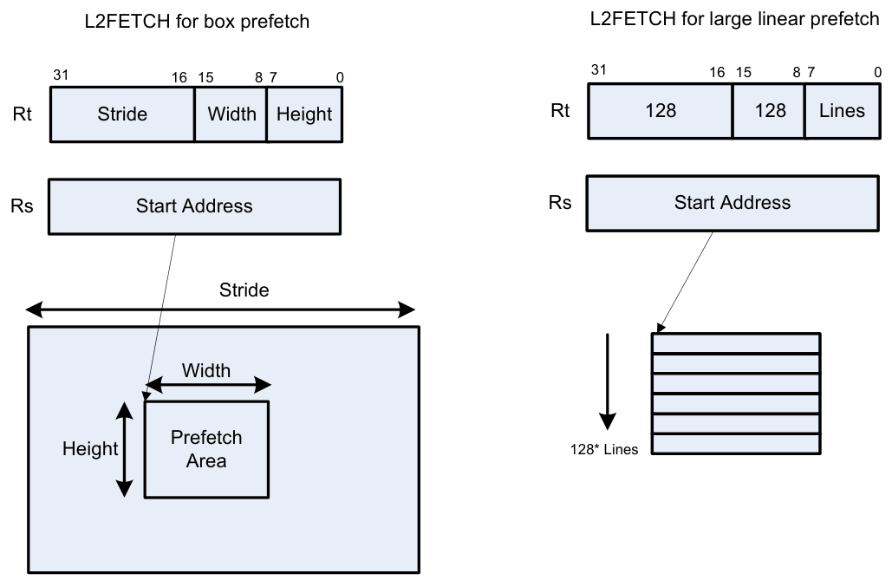

## 11.9 SYSTEM

The SYSTEM instruction class includes instructions for managing system resources.

### 11.9.1 SYSTEM USER

The SYSTEM USER instruction subclass includes instructions which allow user access to system resources.

#### Load locked

This memory lock instruction performs a word or double-word locked load.

This instruction returns the contents of the memory at address Rs and also reserves a lock reservation at that address. For more information, see Atomic operations.

| Syntax | Behavior |
|---|---|
| `Rd=memw_locked(Rs)` | `EA=Rs;`<br>`Rd = *EA;` |
| `Rdd=memd_locked(Rs)` | `EA=Rs;`<br>`Rdd = *EA;` |

##### Class: SYSTEM (slots 0)

##### Notes

- This instruction is only grouped with ALU32 or nonfloating point XTYPE instructions.

##### Encoding

| 31 | 30 | 29 | 28 | 27 | 26 | 25 | 24 | 23 | 22 | 21 | 20 | 19 | 18 | 17 | 16 | 15 | 14 | 13 | 12 | 11 | 10 | 9 | 8 | 7 | 6 | 5 | 4 | 3 | 2 | 1 | 0 |  |
|---|---|---|---|---|---|---|---|---|---|---|---|---|---|---|---|---|---|---|---|---|---|---|---|---|---|---|---|---|---|---|---|---|
| ICLASS | ICLASS | ICLASS | ICLASS | Amode | Amode | Amode | Type | Type | Type | U N | s5 | s5 | s5 | s5 | s5 | Parse | Parse |  |  |  |  |  |  |  |  |  | d5 | d5 | d5 | d5 | d5 |  |
| 1 | 0 | 0 | 1 | 0 | 0 | 1 | 0 | 0 | 0 | 0 | s | s | s | s | s | P | P | 0 | 0 | 0 | - | - | - | 0 | 0 | 0 | d | d | d | d | d | Rd=memw_locked(Rs) |
| 1 | 0 | 0 | 1 | 0 | 0 | 1 | 0 | 0 | 0 | 0 | s | s | s | s | s | P | P | 0 | 1 | 0 | - | - | - | 0 | 0 | 0 | d | d | d | d | d | Rdd=memd_locked(Rs) |

| Field name | Description |
|---|---|
| `ICLASS` | Instruction class |
| `Amode` | Amode |
| `Type` | Type |
| `UN` | Unsigned |
| `Parse` | Packet/loop parse bits |
| `d5` | Field to encode register d |
| `s5` | Field to encode register s |

#### Store conditional

This memory lock instruction performs a word or double-word conditional store operation.

If the address reservation is held by this thread and there have been no intervening accesses to the memory location, the store is performed and the predicate is set to true. Otherwise, the store is not performed and the predicate returns false. For more information, see Atomic operations.

| Syntax | Behavior |
|---|---|
| `memd_locked(Rs,Pd)=Rtt` | `EA=Rs;`<br>`if (lock_valid) {`<br>`*EA = Rtt;`<br>`Pd = 0xff;`<br>`lock_valid = 0;`<br>`} else {`<br>`Pd = 0;`<br>`}` |
| `memw_locked(Rs,Pd)=Rt` | `EA=Rs;`<br>`if (lock_valid) {`<br>`*EA = Rt;`<br>`Pd = 0xff;`<br>`lock_valid = 0;`<br>`} else {`<br>`Pd = 0;`<br>`}` |

##### Class: SYSTEM (slots 0)

##### Notes

- This instruction can only be grouped with ALU32 or non-floating-point XTYPE instructions.
- The predicate generated by this instruction can not be used as a .new predicate, nor can it be automatically AND’d with another predicate.

##### Encoding

| 31 | 30 | 29 | 28 | 27 | 26 | 25 | 24 | 23 | 22 | 21 | 20 | 19 | 18 | 17 | 16 | 15 | 14 | 13 | 12 | 11 | 10 | 9 | 8 | 7 | 6 | 5 | 4 | 3 | 2 | 1 | 0 |  |
|---|---|---|---|---|---|---|---|---|---|---|---|---|---|---|---|---|---|---|---|---|---|---|---|---|---|---|---|---|---|---|---|---|
| ICLASS | ICLASS | ICLASS | ICLASS | Amode | Amode | Amode | Type | Type | Type | U N | s5 | s5 | s5 | s5 | s5 | Parse | Parse |  | t5 | t5 | t5 | t5 | t5 |  |  |  |  |  |  | d2 | d2 |  |
| 1 | 0 | 1 | 0 | 0 | 0 | 0 | 0 | 1 | 0 | 1 | s | s | s | s | s | P | P | - | t | t | t | t | t | - | - | - | - | 0 | 0 | d | d | memw_locked(Rs,Pd)=Rt |
| 1 | 0 | 1 | 0 | 0 | 0 | 0 | 0 | 1 | 1 | 1 | s | s | s | s | s | P | P | 0 | t | t | t | t | t | - | - | - | - | 0 | 0 | d | d | memd_locked(Rs,Pd)=Rtt |

| Field name | Description |
|---|---|
| `ICLASS` | Instruction class |
| `Parse` | Packet/loop parse bits |
| `d2` | Field to encode register d |
| `s5` | Field to encode register s |
| `t5` | Field to encode register t |
| `Amode` | Amode |
| `Type` | Type |
| `UN` | Unsigned |

#### Zero a cache line

The dczeroa instruction clears 32 bytes of memory.

If the memory is marked write-back cacheable, a cache line is allocated in the data cache and 32 bytes are cleared.

If the memory is write-through or write-back, 32 bytes of zeros are sent to memory.

This instruction is useful for efficiently handling write-only data by pre-allocating lines in the cache.

The address must be 32-byte aligned. If not, an unaligned error exception is raised.

If this instruction appears in a packet, slot 1 must be A-type or empty.

| Syntax | Behavior |
|---|---|
| `dczeroa(Rs)` | `EA=Rs;`<br>`dcache_zero_addr(EA);` |

##### Class: SYSTEM (slots 0)

##### Notes

- A packet containing this instruction must have slot 1 either empty or executing an ALU32 instruction.

##### Intrinsics

```
dczeroa(Rs)void Q6_dczeroa_A(Address a)
```

##### Encoding

| 31 | 30 | 29 | 28 | 27 | 26 | 25 | 24 | 23 | 22 | 21 | 20 | 19 | 18 | 17 | 16 | 15 | 14 | 13 | 12 | 11 | 10 | 9 | 8 | 7 | 6 | 5 | 4 | 3 | 2 | 1 | 0 |  |
|---|---|---|---|---|---|---|---|---|---|---|---|---|---|---|---|---|---|---|---|---|---|---|---|---|---|---|---|---|---|---|---|---|
| ICLASS | ICLASS | ICLASS | ICLASS | Amode | Amode | Amode | Type | Type | Type | U N | s5 | s5 | s5 | s5 | s5 | Parse | Parse |  |  |  |  |  |  |  |  |  |  |  |  |  |  |  |
| 1 | 0 | 1 | 0 | 0 | 0 | 0 | 0 | 1 | 1 | 0 | s | s | s | s | s | P | P | 0 | - | - | - | - | - | - | - | - | - | - | - | - | - | dczeroa(Rs) |

| Field name | Description |
|---|---|
| `ICLASS` | Instruction class |
| `Parse` | Packet/loop parse bits |
| `s5` | Field to encode register s |
| `Amode` | Amode |
| `Type` | Type |
| `UN` | Unsigned |

#### Memory barrier

The barrier instruction establishes a memory barrier to ensure proper ordering between load/store accesses within a consistency domain before the barrier instruction and accesses after the barrier instruction.

All scalar loads, stores, and cache operation by address within a consistency domain before the barrier are globally observable before any access after the barrier can be observed.

The use of this instruction is system-dependent.

| Syntax | Behavior |
|---|---|
| `barrier` | `memory_barrier;` |

##### Class: SYSTEM (slots 0)

##### Notes

- This is a solo instruction. It must not be grouped with other instructions in a packet.

##### Encoding

| 31 | 30 | 29 | 28 | 27 | 26 | 25 | 24 | 23 | 22 | 21 | 20 | 19 | 18 | 17 | 16 | 15 | 14 | 13 | 12 | 11 | 10 | 9 | 8 | 7 | 6 | 5 | 4 | 3 | 2 | 1 | 0 |  |
|---|---|---|---|---|---|---|---|---|---|---|---|---|---|---|---|---|---|---|---|---|---|---|---|---|---|---|---|---|---|---|---|---|
| ICLASS | ICLASS | ICLASS | ICLASS | Amode | Amode | Amode | Type | Type | Type | U N |  |  |  |  |  | Parse | Parse |  |  |  |  |  |  |  |  |  |  |  |  |  |  |  |
| 1 | 0 | 1 | 0 | 1 | 0 | 0 | 0 | 0 | 0 | 0 | - | - | - | - | - | P | P | - | - | - | - | - | - | 0 | 0 | 0 | - | - | - | - | - | barrier |

| Field name | Description |
|---|---|
| `ICLASS` | Instruction class |
| `Parse` | Packet/loop parse bits |
| `Amode` | Amode |
| `Type` | Type |
| `UN` | Unsigned |

#### Breakpoint

The brkpt instruction causes the program to enter Debug mode if enabled by ISDB.

Execution control is handed to ISDB and the program does not proceed until directed by the debugger.

If ISDB is disabled, this instruction is treated as a NOP.

| Syntax | Behavior |
|---|---|
| `brkpt` | `Enter Debug mode;` |

##### Class: SYSTEM (slot 3)

##### Notes

- This is a solo instruction. It must not be grouped with other instructions in a packet.

##### Encoding

| 31 | 30 | 29 | 28 | 27 | 26 | 25 | 24 | 23 | 22 | 21 | 20 | 19 | 18 | 17 | 16 | 15 | 14 | 13 | 12 | 11 | 10 | 9 | 8 | 7 | 6 | 5 | 4 | 3 | 2 | 1 | 0 |  |
|---|---|---|---|---|---|---|---|---|---|---|---|---|---|---|---|---|---|---|---|---|---|---|---|---|---|---|---|---|---|---|---|---|
| ICLASS | ICLASS | ICLASS | ICLASS |  | sm |  |  |  |  |  |  |  |  |  |  | Parse | Parse |  |  |  |  |  |  |  |  |  |  |  |  |  |  |  |
| 0 | 1 | 1 | 0 | 1 | 1 | 0 | 0 | 0 | 0 | 1 | - | - | - | - | - | P | P | - | - | - | - | - | - | 0 | 0 | 0 | - | - | - | - | - | brkpt |

| Field name | Description |
|---|---|
| `sm` | Supervisor mode only |
| `ICLASS` | Instruction class |
| `Parse` | Packet/loop parse bits |

#### Data cache prefetch

The dcfetch instruction prefetches the data at address Rs + unsigned immediate.

This instruction is a hint to the memory system, and is handled in an implementation-dependent manner.

| Syntax | Behavior |
|---|---|
| `dcfetch(Rs)` | `Assembler mapped to: "dcfetch(Rs+#0)"` |
| `dcfetch(Rs+#u11:3)` | `EA=Rs+#u;`<br>`dcache_fetch(EA);` |

##### Class: SYSTEM (slots 0)

##### Intrinsics

```
dcfetch(Rs)void Q6_dcfetch_A(Address a)
```

##### Encoding

| 31 | 30 | 29 | 28 | 27 | 26 | 25 | 24 | 23 | 22 | 21 | 20 | 19 | 18 | 17 | 16 | 15 | 14 | 13 | 12 | 11 | 10 | 9 | 8 | 7 | 6 | 5 | 4 | 3 | 2 | 1 | 0 |  |
|---|---|---|---|---|---|---|---|---|---|---|---|---|---|---|---|---|---|---|---|---|---|---|---|---|---|---|---|---|---|---|---|---|
| ICLASS | ICLASS | ICLASS | ICLASS | Amode | Amode | Amode | Type | Type | Type | U N | s5 | s5 | s5 | s5 | s5 | Parse | Parse |  |  |  |  |  |  |  |  |  |  |  |  |  |  |  |
| 1 | 0 | 0 | 1 | 0 | 1 | 0 | 0 | 0 | 0 | 0 | s | s | s | s | s | P | P | 0 | - | - | i | i | i | i | i | i | i | i | i | i | i | dcfetch(Rs+#u11:3) |

| Field name | Description |
|---|---|
| `ICLASS` | Instruction class |
| `Amode` | Amode |
| `Type` | Type |
| `UN` | Unsigned |
| `Parse` | Packet/loop parse bits |
| `s5` | Field to encode register s |

#### Data cache maintenance user operations

Perform maintenance operations on the data cache.

The dccleaninva instruction looks up the data cache at address Rs. If this address is in the cache and has dirty data, the data is flushed out to memory and the line is then invalidated.

The dccleana instruction looks up the data cache at address Rs. If this address is in the cache and has dirty data, the data is flushed out to memory.

The dcinva instruction looks up the data cache at address Rs. If this address is in the cache, the line containing the data is invalidated.

If an instruction appears in a packet, slot 1 must be A-type or empty.

In implementations that support L2 cache, these instructions operate on both L1 data and L2 caches.

| Syntax | Behavior |
|---|---|
| `dccleana(Rs)` | `EA=Rs;`<br>`dcache_clean_addr(EA);` |
| `dccleaninva(Rs)` | `EA=Rs;`<br>`dcache_cleaninv_addr(EA);` |
| `dcinva(Rs)` | `EA=Rs;`<br>`dcache_cleaninv_addr(EA);` |

##### Class: SYSTEM (slots 0)

##### Notes

- A packet containing this instruction must have slot 1 either empty or executing an ALU32 instruction.

##### Intrinsics

|  |  |
|---|---|
| `dccleana(Rs)` | `void Q6_dccleana_A(Address a)` |
| `dccleaninva(Rs)` | `void Q6_dccleaninva_A(Address a)` |
| `dcinva(Rs)` | `void Q6_dcinva_A(Address a)` |

##### Encoding

| 31 | 30 | 29 | 28 | 27 | 26 | 25 | 24 | 23 | 22 | 21 | 20 | 19 | 18 | 17 | 16 | 15 | 14 | 13 | 12 | 11 | 10 | 9 | 8 | 7 | 6 | 5 | 4 | 3 | 2 | 1 | 0 |  |
|---|---|---|---|---|---|---|---|---|---|---|---|---|---|---|---|---|---|---|---|---|---|---|---|---|---|---|---|---|---|---|---|---|
| ICLASS | ICLASS | ICLASS | ICLASS | Amode | Amode | Amode | Type | Type | Type | U N | s5 | s5 | s5 | s5 | s5 | Parse | Parse |  |  |  |  |  |  |  |  |  |  |  |  |  |  |  |
| 1 | 0 | 1 | 0 | 0 | 0 | 0 | 0 | 0 | 0 | 0 | s | s | s | s | s | P | P | - | - | - | - | - | - | - | - | - | - | - | - | - | - | dccleana(Rs) |
| 1 | 0 | 1 | 0 | 0 | 0 | 0 | 0 | 0 | 0 | 1 | s | s | s | s | s | P | P | - | - | - | - | - | - | - | - | - | - | - | - | - | - | dcinva(Rs) |
| 1 | 0 | 1 | 0 | 0 | 0 | 0 | 0 | 0 | 1 | 0 | s | s | s | s | s | P | P | - | - | - | - | - | - | - | - | - | - | - | - | - | - | dccleaninva(Rs) |

| Field name | Description |
|---|---|
| `ICLASS` | Instruction class |
| `Parse` | Packet/loop parse bits |
| `s5` | Field to encode register s |
| `Amode` | Amode |
| `Type` | Type |
| `UN` | Unsigned |

#### Send value to DIAG trace

These instructions send the sources to the external DIAG trace.

| Syntax | Behavior |
|---|---|
| `diag(Rs)` |  |
| `diag0(Rss,Rtt)` |  |
| `diag1(Rss,Rtt)` |  |

##### Class: SYSTEM (slot 3)

##### Encoding

| 31 | 30 | 29 | 28 | 27 | 26 | 25 | 24 | 23 | 22 | 21 | 20 | 19 | 18 | 17 | 16 | 15 | 14 | 13 | 12 | 11 | 10 | 9 | 8 | 7 | 6 | 5 | 4 | 3 | 2 | 1 | 0 |  |
|---|---|---|---|---|---|---|---|---|---|---|---|---|---|---|---|---|---|---|---|---|---|---|---|---|---|---|---|---|---|---|---|---|
| ICLASS | ICLASS | ICLASS | ICLASS |  | sm |  |  |  |  |  | s5 | s5 | s5 | s5 | s5 | Parse | Parse |  |  |  |  |  |  |  |  |  |  |  |  |  |  |  |
| 0 | 1 | 1 | 0 | 0 | 0 | 1 | 0 | 0 | 1 | 0 | s | s | s | s | s | P | P | - | - | - | - | - | - | 0 | 0 | 1 | - | - | - | - | - | diag(Rs) |
| ICLASS | ICLASS | ICLASS | ICLASS |  | sm |  |  |  |  |  | s5 | s5 | s5 | s5 | s5 | Parse | Parse |  | t5 | t5 | t5 | t5 | t5 |  |  |  |  |  |  |  |  |  |
| 0 | 1 | 1 | 0 | 0 | 0 | 1 | 0 | 0 | 1 | 0 | s | s | s | s | s | P | P | - | t | t | t | t | t | 0 | 1 | 0 | - | - | - | - | - | diag0(Rss,Rtt) |
| 0 | 1 | 1 | 0 | 0 | 0 | 1 | 0 | 0 | 1 | 0 | s | s | s | s | s | P | P | - | t | t | t | t | t | 0 | 1 | 1 | - | - | - | - | - | diag1(Rss,Rtt) |

| Field name | Description |
|---|---|
| `sm` | Supervisor mode only |
| `ICLASS` | Instruction class |
| `Parse` | Packet/loop parse bits |
| `s5` | Field to encode register s |
| `t5` | Field to encode register t |

#### Instruction cache maintenance user operations

The icinva instruction looks up the address given in Rs in the instruction cache. If a translation for Rs cannot be found, a TLB-miss-X exception with cause code 0x62 is indicated.

If a translation is found but the user does not have proper permissions to the page to invalidate, the instruction converts to a NOP.

If a translation is found and the user has proper permissions, all ways of all 32 byte segments matching Rs[11:5] in any instruction cache are invalidated.

| Syntax | Behavior |
|---|---|
| `icinva(Rs)` | `EA=Rs;`<br>`icache_inv_addr(EA);` |

##### Class: SYSTEM (slot 2)

##### Notes

- This is a solo instruction. It must not be grouped with other instructions in a packet.

##### Encoding

| 31 | 30 | 29 | 28 | 27 | 26 | 25 | 24 | 23 | 22 | 21 | 20 | 19 | 18 | 17 | 16 | 15 | 14 | 13 | 12 | 11 | 10 | 9 | 8 | 7 | 6 | 5 | 4 | 3 | 2 | 1 | 0 |  |
|---|---|---|---|---|---|---|---|---|---|---|---|---|---|---|---|---|---|---|---|---|---|---|---|---|---|---|---|---|---|---|---|---|
| ICLASS | ICLASS | ICLASS | ICLASS |  |  |  |  |  |  |  | s5 | s5 | s5 | s5 | s5 | Parse | Parse |  |  |  |  |  |  |  |  |  |  |  |  |  |  |  |
| 0 | 1 | 0 | 1 | 0 | 1 | 1 | 0 | 1 | 1 | 0 | s | s | s | s | s | P | P | 0 | 0 | 0 | - | - | - | - | - | - | - | - | - | - | - | icinva(Rs) |

| Field name | Description |
|---|---|
| `ICLASS` | Instruction class |
| `Parse` | Packet/loop parse bits |
| `s5` | Field to encode register s |

#### Instruction synchronization

The isync instruction ensures that all previous instructions have committed before continuing to the next instruction.

This instruction should execute after the following events (when subsequent instructions must observe the results of the event):

- After modifying the TLB with a TLBW instruction
- After modifying the SSR register
- After modifying the SYSCFG register
- After any instruction cache maintenance operation
- After modifying the TID register

| Syntax | Behavior |
|---|---|
| `isync` | `instruction_sync;` |

##### Class: SYSTEM (slot 2)

##### Notes

- This is a solo instruction. It must not be grouped with other instructions in a packet.

##### Encoding

| 31 | 30 | 29 | 28 | 27 | 26 | 25 | 24 | 23 | 22 | 21 | 20 | 19 | 18 | 17 | 16 | 15 | 14 | 13 | 12 | 11 | 10 | 9 | 8 | 7 | 6 | 5 | 4 | 3 | 2 | 1 | 0 |  |
|---|---|---|---|---|---|---|---|---|---|---|---|---|---|---|---|---|---|---|---|---|---|---|---|---|---|---|---|---|---|---|---|---|
| ICLASS | ICLASS | ICLASS | ICLASS |  |  |  |  |  |  |  |  |  |  |  |  | Parse | Parse |  |  |  |  |  |  |  |  |  |  |  |  |  |  |  |
| 0 | 1 | 0 | 1 | 0 | 1 | 1 | 1 | 1 | 1 | 0 | 0 | 0 | 0 | 0 | 0 | P | P | 0 | - | - | - | 0 | 0 | 0 | 0 | 0 | 0 | 0 | 0 | 1 | 0 | isync |

| Field name | Description |
|---|---|
| `ICLASS` | Instruction class |
| `Parse` | Packet/loop parse bits |

#### L2 cache prefetch

The L2fetch instruction initiates background prefetching into the L2 cache.

Rs specifies the 32-bit virtual start address. There are two forms of this instruction.

In the first form, the dimensions of the area to prefetch are encoded in source register Rt as follows:

Rt[15:8] = Width of a fetch block in bytes.

Rt[7:0] = Height: the number of Width-sized blocks to fetch.

Rt[31:16] = Stride: an unsigned byte offset which is used to increment the pointer after each Width-sized block is fetched.

In the second form, the operands are encoded in register pair Rtt as follows:

Rtt[31:16] = Width of a fetch block in bytes.

Rtt[15:0] = Height: the number of Width-sized blocks to fetch.

Rtt[47:32] = Stride: an unsigned byte offset that is used to increment the pointer after each Width-sized block is fetched.

Rtt[48] = Direction. If clear, perform the prefetches in row major form, meaning fetch cache lines in a row before proceeding to the next row. If the bit is set, prefetch in column major form, meaning fetch all cache lines in a column before proceeding to the next column.

The following figure shows two examples of using the L2FETCH instruction.



```text
L2FETCH for box prefetch L2FETCH for large linear prefetch
31 16 15 8 7 0
31 16 15 8 7 0
Rt Stride Width Height Rt 128 128 Lines
Rs Start Address Rs Start Address
Stride
Width
Prefetch
Height128 Lines
Area
```

In the box prefetch, a 2D range of memory is defined within a larger frame. The second example shows prefetch for a large linear area of memory with size Lines * 128.

L2FETCH is nonblocking. After the instruction is initiated, the program continues to the next instruction while the prefetching is performed in the background. L2fetch can bring in either code or data to the L2 cache. If the lines of interest are already in the L2, no action is performed. If the lines are missing from the L2$, the hardware attempts to fetch them from the system memory.

The hardware prefetch engine continues to request lines in the programmed memory range. The prefetching hardware makes a best-effort to prefetch the requested data, and attempts to perform prefetching at a lower priority than demand fetches. This prevents prefetch from adding traffic while the system is under heavy load.

If a program initiates a new L2FETCH while an older L2FETCH operation is pending, the new request is queued up to three deep. If three L2FETCHes are already pending, the oldest request is dropped. During the time a L2 prefetch is active for a thread, the USR:PFA status bit is set to indicate that prefetches are in progress. The programmer can use this bit to decide whether to start a new L2FETCH before the previous L2FETCH completes.

Executing an L2fetch with any subfield programmed as zero cancels pending prefetches by the calling thread. The implementation is free to drop prefetches when needed.

| Syntax | Behavior |
|---|---|
| `l2fetch(Rs,Rt)` | `l2fetch(Rs,INFO);` |
| `l2fetch(Rs,Rtt)` | `l2fetch(Rs,INFO);` |

##### Class: SYSTEM (slots 0)

##### Notes

- This instruction can only be grouped with ALU32 or non-floating point XTYPE instructions.

##### Intrinsics

|  |  |
|---|---|
| `l2fetch(Rs,Rt)` | `void Q6_l2fetch_AR(Address a, Word32 Rt)` |
| `l2fetch(Rs,Rtt)` | `void Q6_l2fetch_AP(Address a, Word64 Rtt)` |

##### Encoding

| 31 | 30 | 29 | 28 | 27 | 26 | 25 | 24 | 23 | 22 | 21 | 20 | 19 | 18 | 17 | 16 | 15 | 14 | 13 | 12 | 11 | 10 | 9 | 8 | 7 | 6 | 5 | 4 | 3 | 2 | 1 | 0 |  |
|---|---|---|---|---|---|---|---|---|---|---|---|---|---|---|---|---|---|---|---|---|---|---|---|---|---|---|---|---|---|---|---|---|
| ICLASS | ICLASS | ICLASS | ICLASS | Amode | Amode | Amode | Type | Type | Type | U N | s5 | s5 | s5 | s5 | s5 | Parse | Parse |  | t5 | t5 | t5 | t5 | t5 |  |  |  |  |  |  |  |  |  |
| 1 | 0 | 1 | 0 | 0 | 1 | 1 | 0 | 0 | 0 | 0 | s | s | s | s | s | P | P | - | t | t | t | t | t | 0 | 0 | 0 | - | - | - | - | - | l2fetch(Rs,Rt) |
| 1 | 0 | 1 | 0 | 0 | 1 | 1 | 0 | 1 | 0 | 0 | s | s | s | s | s | P | P | - | t | t | t | t | t | - | - | - | - | - | - | - | - | l2fetch(Rs,Rtt) |

| Field name | Description |
|---|---|
| `ICLASS` | Instruction class |
| `Parse` | Packet/loop parse bits |
| `s5` | Field to encode register s |
| `t5` | Field to encode register t |
| `Amode` | Amode |
| `Type` | Type |
| `UN` | Unsigned |

#### Pause

The PAUSE instruction pauses execution for a specified period of time.

During the pause duration, the program enters a low-power state and does not fetch and execute instructions. The instruction provides a short immediate that indicates the pause duration. The program will pause for at most the number of cycles specified in the immediate plus 8. The minimum pause is 0 cycles, and the maximum pause is implementation-defined.

An interrupt to the program exits the paused state.

System events, such as hardware or DMA completion, can trigger exits from Pause mode.

An implementation is free to pause for durations shorter than (immediate+8), but not longer.

This instruction is useful for implementing user-level low-power synchronization operations, such as spin locks or wait-for-event signaling.

| Syntax | Behavior |
|---|---|
| `pause(#u10)` | `Pause for #u cycles;` |

##### Class: SYSTEM (slot 2)

##### Notes

- This is a solo instruction. It must not be grouped with other instructions in a packet.

##### Encoding

| 31 | 30 | 29 | 28 | 27 | 26 | 25 | 24 | 23 | 22 | 21 | 20 | 19 | 18 | 17 | 16 | 15 | 14 | 13 | 12 | 11 | 10 | 9 | 8 | 7 | 6 | 5 | 4 | 3 | 2 | 1 | 0 |  |
|---|---|---|---|---|---|---|---|---|---|---|---|---|---|---|---|---|---|---|---|---|---|---|---|---|---|---|---|---|---|---|---|---|
| ICLASS | ICLASS | ICLASS | ICLASS |  |  |  |  |  |  |  |  |  |  |  |  | Parse | Parse |  |  |  |  |  |  |  |  |  |  |  |  |  |  |  |
| 0 | 1 | 0 | 1 | 0 | 1 | 0 | 0 | 0 | 1 | - | - | - | - | i | i | P | P | - | i | i | i | i | i | - | - | - | i | i | i | - | - | pause(#u10) |

| Field name | Description |
|---|---|
| `ICLASS` | Instruction class |
| `Parse` | Packet/loop parse bits |

#### Memory thread synchronization

The syncht instruction synchronizes memory.

Outstanding memory operations, including cached and uncached loads and stores, are completed before the processor continues to the next instruction. This ensures that certain memory operations are performed in the desired order (for example, when accessing I/O devices).

After performing a syncht operation, the processor ceases fetching and executing instructions from the program until all outstanding memory operations of that program complete.

In multithreaded or multi-core environments, SYNCHT is not concerned with other execution contexts.

The use of this instruction is system-dependent.

| Syntax | Behavior |
|---|---|
| `Rd=dmsyncht` | `Rd = DM0;` |
| `syncht` | `memory_synch;` |

##### Class: SYSTEM (slots 0)

##### Notes

- This is a solo instruction. It must not be grouped with other instructions in a packet.
- This is a monitor-level feature. If performed in User or Guest mode, a privilege error exception occurs.

##### Intrinsics

```
Rd=dmsynchtWord32 Q6_R_dmsyncht()
```

##### Encoding

| 31 | 30 | 29 | 28 | 27 | 26 | 25 | 24 | 23 | 22 | 21 | 20 | 19 | 18 | 17 | 16 | 15 | 14 | 13 | 12 | 11 | 10 | 9 | 8 | 7 | 6 | 5 | 4 | 3 | 2 | 1 | 0 |  |
|---|---|---|---|---|---|---|---|---|---|---|---|---|---|---|---|---|---|---|---|---|---|---|---|---|---|---|---|---|---|---|---|---|
| ICLASS | ICLASS | ICLASS | ICLASS | Amode | Amode | Amode | Type | Type | Type | U N |  |  |  |  |  | Parse | Parse |  |  |  |  |  |  |  |  |  | d5 | d5 | d5 | d5 | d5 |  |
| 1 | 0 | 1 | 0 | 1 | 0 | 0 | 0 | 0 | 0 | 0 | - | - | - | - | - | P | P | - | - | - | - | - | 0 | 1 | 1 | 1 | d | d | d | d | d | Rd=dmsyncht |
| ICLASS | ICLASS | ICLASS | ICLASS | Amode | Amode | Amode | Type | Type | Type | U N |  |  |  |  |  | Parse | Parse |  |  |  |  |  |  |  |  |  |  |  |  |  |  |  |
| 1 | 0 | 1 | 0 | 1 | 0 | 0 | 0 | 0 | 1 | 0 | - | - | - | - | - | P | P | - | - | - | - | - | - | - | - | - | - | - | - | - | - | syncht |

| Field name | Description |
|---|---|
| `ICLASS` | Instruction class |
| `Parse` | Packet/loop parse bits |
| `d5` | Field to encode register d |
| `Amode` | Amode |
| `Type` | Type |
| `UN` | Unsigned |

#### Send value to ETM trace

The trace instruction takes the value of register Rs and emits it to the ETM trace.

The ETM block must be enabled, and the thread must have permissions to perform tracing. The contents of Rs are user-defined.

| Syntax | Behavior |
|---|---|
| `trace(Rs)` | `Send value to ETM trace;` |

##### Class: SYSTEM (slot 3)

##### Notes

- This instruction may only be grouped with ALU32 or non-floating-point XTYPE instructions.

##### Encoding

| 31 | 30 | 29 | 28 | 27 | 26 | 25 | 24 | 23 | 22 | 21 | 20 | 19 | 18 | 17 | 16 | 15 | 14 | 13 | 12 | 11 | 10 | 9 | 8 | 7 | 6 | 5 | 4 | 3 | 2 | 1 | 0 |  |
|---|---|---|---|---|---|---|---|---|---|---|---|---|---|---|---|---|---|---|---|---|---|---|---|---|---|---|---|---|---|---|---|---|
| ICLASS | ICLASS | ICLASS | ICLASS |  | sm |  |  |  |  |  | s5 | s5 | s5 | s5 | s5 | Parse | Parse |  |  |  |  |  |  |  |  |  |  |  |  |  |  |  |
| 0 | 1 | 1 | 0 | 0 | 0 | 1 | 0 | 0 | 1 | 0 | s | s | s | s | s | P | P | - | - | - | - | - | - | 0 | 0 | 0 | - | - | - | - | - | trace(Rs) |

| Field name | Description |
|---|---|
| `sm` | Supervisor mode only |
| `ICLASS` | Instruction class |
| `Parse` | Packet/loop parse bits |
| `s5` | Field to encode register s |

#### Trap

The trap instruction causes a precise exception.

Executing a trap instruction sets the EX bit in SSR to 1, which disables interrupts and enables Supervisor mode. The program then jumps to the vector location (either TRAP0 or TRAP1). The instruction specifies a n 8-bit immediate field. This field is copied into the system status register cause field.

Upon returning from the service routine with a RTE, execution resumes at the packet after the TRAP instruction.

These instructions are generally intended for user code to request services from the operating system. Two TRAP instructions are provided so the OS can optimize for fast service routines and slower service routines.

| Syntax | Behavior |
|---|---|
| `trap0(#u8)` | `SSR.CAUSE = #u;`<br>`TRAP "0";` |
| `trap1(#u8)` | `Assembler mapped to: "trap1(R0,#u8)"` |
| `trap1(Rx,#u8)` | `if (!can_handle_trap1_virtinsn(#u)) {`<br>`SSR.CAUSE = #u;`<br>`TRAP "1";`<br>`} else if (#u == 1) {`<br>`VMRTE;`<br>`} else if (#u == 3) {`<br>`VMSETIE;`<br>`} else if (#u == 4) {`<br>`VMGETIE;`<br>`} else if (#u == 6) {`<br>`VMSPSWAP;` |

##### Class: SYSTEM (slot 2)

##### Notes

- This is a solo instruction. It must not be grouped with other instructions in a packet.

##### Encoding

| 31 | 30 | 29 | 28 | 27 | 26 | 25 | 24 | 23 | 22 | 21 | 20 | 19 | 18 | 17 | 16 | 15 | 14 | 13 | 12 | 11 | 10 | 9 | 8 | 7 | 6 | 5 | 4 | 3 | 2 | 1 | 0 |  |
|---|---|---|---|---|---|---|---|---|---|---|---|---|---|---|---|---|---|---|---|---|---|---|---|---|---|---|---|---|---|---|---|---|
| ICLASS | ICLASS | ICLASS | ICLASS |  |  |  |  |  |  |  |  |  |  |  |  | Parse | Parse |  |  |  |  |  |  |  |  |  |  |  |  |  |  |  |
| 0 | 1 | 0 | 1 | 0 | 1 | 0 | 0 | 0 | 0 | - | - | - | - | - | - | P | P | - | i | i | i | i | i | - | - | - | i | i | i | - | - | trap0(#u8) |
| ICLASS | ICLASS | ICLASS | ICLASS |  |  |  |  |  |  |  | x5 | x5 | x5 | x5 | x5 | Parse | Parse |  |  |  |  |  |  |  |  |  |  |  |  |  |  |  |
| 0 | 1 | 0 | 1 | 0 | 1 | 0 | 0 | 1 | 0 | - | x | x | x | x | x | P | P | - | i | i | i | i | i | - | - | - | i | i | i | - | - | trap1(Rx,#u8) |

| Field name | Description |
|---|---|
| `ICLASS` | Instruction class |
| `Parse` | Packet/loop parse bits |
| `x5` | Field to encode register x |

#### Unpause

The unpause instruction resumes threads whose execution has stalled with a pause instruction.

| Syntax | Behavior |
|---|---|
| `unpause` | `Unpause threads currently in pause state;` |

##### Class: SYSTEM (slot 2)

##### Notes

- This is a solo instruction. It must not be grouped with other instructions in a packet.

##### Encoding

| 31 | 30 | 29 | 28 | 27 | 26 | 25 | 24 | 23 | 22 | 21 | 20 | 19 | 18 | 17 | 16 | 15 | 14 | 13 | 12 | 11 | 10 | 9 | 8 | 7 | 6 | 5 | 4 | 3 | 2 | 1 | 0 |  |
|---|---|---|---|---|---|---|---|---|---|---|---|---|---|---|---|---|---|---|---|---|---|---|---|---|---|---|---|---|---|---|---|---|
| ICLASS | ICLASS | ICLASS | ICLASS |  |  |  |  |  |  |  |  |  |  |  |  | Parse | Parse |  |  |  |  |  |  |  |  |  |  |  |  |  |  |  |
| 0 | 1 | 0 | 1 | 0 | 1 | 1 | 1 | 1 | 1 | 1 | - | - | - | - | - | P | P | 0 | 1 | - | - | - | - | 0 | 0 | 0 | - | - | - | - | - | unpause |

| Field name | Description |
|---|---|
| `ICLASS` | Instruction class |
| `Parse` | Packet/loop parse bits |
