## 11.10 XTYPE

The XTYPE instruction class includes instructions that perform most of the data processing done by the Hexagon processor.

XTYPE instructions are executable on slot 2 or slot 3.

### 11.10.1 XTYPE ALU

The XTYPE ALU instruction subclass includes instructions that perform arithmetic and logical operations.

#### Absolute value doubleword

Take the absolute value of the 64-bit source register and place it in the destination register.

| Syntax | Behavior |
|---|---|
| `Rdd=abs(Rss)` | `Rdd = ABS(Rss);` |

##### Class: XTYPE (slots 2,3)

##### Intrinsics

```
Rdd=abs(Rss)Word64 Q6_P_abs_P(Word64 Rss)
```

##### Encoding

| 31 | 30 | 29 | 28 | 27 | 26 | 25 | 24 | 23 | 22 | 21 | 20 | 19 | 18 | 17 | 16 | 15 | 14 | 13 | 12 | 11 | 10 | 9 | 8 | 7 | 6 | 5 | 4 | 3 | 2 | 1 | 0 |  |
|---|---|---|---|---|---|---|---|---|---|---|---|---|---|---|---|---|---|---|---|---|---|---|---|---|---|---|---|---|---|---|---|---|
| ICLASS | ICLASS | ICLASS | ICLASS | RegType | RegType | RegType | RegType | MajOp | MajOp |  | s5 | s5 | s5 | s5 | s5 | Parse | Parse |  |  |  |  |  |  | MinOp | MinOp | MinOp | d5 | d5 | d5 | d5 | d5 |  |
| 1 | 0 | 0 | 0 | 0 | 0 | 0 | 0 | 1 | 0 | 0 | s | s | s | s | s | P | P | - | - | - | - | - | - | 1 | 1 | 0 | d | d | d | d | d | Rdd=abs(Rss) |

| Field name | Description |
|---|---|
| `ICLASS` | Instruction class |
| `Parse` | Packet/loop parse bits |
| `d5` | Field to encode register d |
| `s5` | Field to encode register s |
| `MajOp` | Major opcode |
| `MinOp` | Minor opcode |
| `RegType` | Register type |

#### Absolute value word

Take the absolute value of the source register and place it in the destination register.

The 32-bit absolute value is available with optional saturation. The single case of saturation is when the source register is equal to 0x8000_0000, the destination saturates to 0x7fff_ffff.

| Syntax | Behavior |
|---|---|
| `Rd=abs(Rs)[:sat]` | `Rd = [sat₃₂](ABS(sxt<sub>32->64</sub>(Rs)));` |

##### Class: XTYPE (slots 2,3)

##### Notes

- If saturation occurs during execution of this instruction (a result is clamped to either maximum or minimum values), the OVF bit in the status register is set. OVF remains set until explicitly cleared by a transfer to the status register.

##### Intrinsics

|  |  |
|---|---|
| `Rd=abs(Rs)` | `Word32 Q6_R_abs_R(Word32 Rs)` |
| `Rd=abs(Rs):sat` | `Word32 Q6_R_abs_R_sat(Word32 Rs)` |

##### Encoding

| 31 | 30 | 29 | 28 | 27 | 26 | 25 | 24 | 23 | 22 | 21 | 20 | 19 | 18 | 17 | 16 | 15 | 14 | 13 | 12 | 11 | 10 | 9 | 8 | 7 | 6 | 5 | 4 | 3 | 2 | 1 | 0 |  |
|---|---|---|---|---|---|---|---|---|---|---|---|---|---|---|---|---|---|---|---|---|---|---|---|---|---|---|---|---|---|---|---|---|
| ICLASS | ICLASS | ICLASS | ICLASS | RegType | RegType | RegType | RegType | MajOp | MajOp |  | s5 | s5 | s5 | s5 | s5 | Parse | Parse |  |  |  |  |  |  | MinOp | MinOp | MinOp | d5 | d5 | d5 | d5 | d5 |  |
| 1 | 0 | 0 | 0 | 1 | 1 | 0 | 0 | 1 | 0 | 0 | s | s | s | s | s | P | P | - | - | - | - | - | - | 1 | 0 | 0 | d | d | d | d | d | Rd=abs(Rs) |
| 1 | 0 | 0 | 0 | 1 | 1 | 0 | 0 | 1 | 0 | 0 | s | s | s | s | s | P | P | - | - | - | - | - | - | 1 | 0 | 1 | d | d | d | d | d | Rd=abs(Rs):sat |

| Field name | Description |
|---|---|
| `ICLASS` | Instruction class |
| `Parse` | Packet/loop parse bits |
| `d5` | Field to encode register d |
| `s5` | Field to encode register s |
| `MajOp` | Major opcode |
| `MinOp` | Minor opcode |
| `RegType` | Register type |

#### Add and accumulate

Add Rs and Rt or a signed immediate, then add or subtract the resulting value. The result is saved in Rx.

| Syntax | Behavior |
|---|---|
| `Rd=add(Rs,add(Ru,#s6))` | `Rd = Rs + Ru + apply_extension(#s);` |
| `Rd=add(Rs,sub(#s6,Ru))` | `Rd = Rs - Ru + apply_extension(#s);` |
| `Rx+=add(Rs,#s8)` | `apply_extension(#s);`<br>`Rx=Rx + Rs + #s;` |
| `Rx+=add(Rs,Rt)` | `Rx=Rx + Rs + Rt;` |
| `Rx-=add(Rs,#s8)` | `apply_extension(#s);`<br>`Rx=Rx - (Rs + #s);` |
| `Rx-=add(Rs,Rt)` | `Rx=Rx - (Rs + Rt);` |

##### Class: XTYPE (slots 2,3)

##### Intrinsics

|  |  |
|---|---|
| `Rd=add(Rs,add(Ru,#s6))` | `Word32 Q6_R_add_add_RRI(Word32 Rs, Word32 Ru, Word32 Is6)` |
| `Rd=add(Rs,sub(#s6,Ru))` | `Word32 Q6_R_add_sub_RIR(Word32 Rs, Word32 Is6, Word32 Ru)` |
| `Rx+=add(Rs,#s8)` | `Word32 Q6_R_addacc_RI(Word32 Rx, Word32 Rs, Word32 Is8)` |
| `Rx+=add(Rs,Rt)` | `Word32 Q6_R_addacc_RR(Word32 Rx, Word32 Rs, Word32 Rt)` |
| `Rx-=add(Rs,#s8)` | `Word32 Q6_R_addnac_RI(Word32 Rx, Word32 Rs, Word32 Is8)` |
| `Rx-=add(Rs,Rt)` | `Word32 Q6_R_addnac_RR(Word32 Rx, Word32 Rs, Word32 Rt)` |

##### Encoding

| 31 | 30 | 29 | 28 | 27 | 26 | 25 | 24 | 23 | 22 | 21 | 20 | 19 | 18 | 17 | 16 | 15 | 14 | 13 | 12 | 11 | 10 | 9 | 8 | 7 | 6 | 5 | 4 | 3 | 2 | 1 | 0 |  |
|---|---|---|---|---|---|---|---|---|---|---|---|---|---|---|---|---|---|---|---|---|---|---|---|---|---|---|---|---|---|---|---|---|
| ICLASS | ICLASS | ICLASS | ICLASS | RegType | RegType | RegType | RegType |  |  |  | s5 | s5 | s5 | s5 | s5 | Parse | Parse |  | d5 | d5 | d5 | d5 | d5 |  |  |  | u5 | u5 | u5 | u5 | u5 |  |
| 1 | 1 | 0 | 1 | 1 | 0 | 1 | 1 | 0 | i | i | s | s | s | s | s | P | P | i | d | d | d | d | d | i | i | i | u | u | u | u | u | Rd=add(Rs,add(Ru,#s6)) |
| 1 | 1 | 0 | 1 | 1 | 0 | 1 | 1 | 1 | i | i | s | s | s | s | s | P | P | i | d | d | d | d | d | i | i | i | u | u | u | u | u | Rd=add(Rs,sub(#s6,Ru)) |
| ICLASS | ICLASS | ICLASS | ICLASS | RegType | RegType | RegType | RegType | MajOp | MajOp | MajOp | s5 | s5 | s5 | s5 | s5 | Parse | Parse |  |  |  |  |  |  | MinOp | MinOp | MinOp | x5 | x5 | x5 | x5 | x5 |  |
| 1 | 1 | 1 | 0 | 0 | 0 | 1 | 0 | 0 | - | - | s | s | s | s | s | P | P | 0 | i | i | i | i | i | i | i | i | x | x | x | x | x | Rx+=add(Rs,#s8) |
| 1 | 1 | 1 | 0 | 0 | 0 | 1 | 0 | 1 | - | - | s | s | s | s | s | P | P | 0 | i | i | i | i | i | i | i | i | x | x | x | x | x | Rx-=add(Rs,#s8) |
| ICLASS | ICLASS | ICLASS | ICLASS | RegType | RegType | RegType | RegType | MajOp | MajOp | MajOp | s5 | s5 | s5 | s5 | s5 | Parse | Parse |  | t5 | t5 | t5 | t5 | t5 | MinOp | MinOp | MinOp | x5 | x5 | x5 | x5 | x5 |  |
| 1 | 1 | 1 | 0 | 1 | 1 | 1 | 1 | 0 | 0 | 0 | s | s | s | s | s | P | P | 0 | t | t | t | t | t | 0 | 0 | 1 | x | x | x | x | x | Rx+=add(Rs,Rt) |
| 1 | 1 | 1 | 0 | 1 | 1 | 1 | 1 | 1 | 0 | 0 | s | s | s | s | s | P | P | 0 | t | t | t | t | t | 0 | 0 | 1 | x | x | x | x | x | Rx-=add(Rs,Rt) |

| Field name | Description |
|---|---|
| `RegType` | Register type |
| `ICLASS` | Instruction class |
| `MajOp` | Major opcode |
| `MinOp` | Minor opcode |
| `Parse` | Packet/loop parse bits |
| `d5` | Field to encode register d |
| `s5` | Field to encode register s |
| `t5` | Field to encode register t |
| `u5` | Field to encode register u |
| `x5` | Field to encode register x |

#### Add doublewords

The first form of this instruction adds two 32-bit registers. If the result overflows 32 bits, the result is saturated to 0x7FFF_FFFF for a positive result, or 0x8000_0000 for a negative result. A 32-bit nonsaturating register add is a ALU32-class instruction and can execute on any slot.

The second instruction form sign-extends a 32-bit register Rt to 64-bits and performs a 64-bit add with Rss. The result is stored in Rdd.

The third instruction form adds 64-bit registers Rss and Rtt and places the result in Rdd.

The final instruction form adds two 64-bit registers Rss and Rtt. If the result overflows 64 bits, it is saturated to 0x7fff_ffff_ffff_ffff for a positive result, or 0x8000_0000_0000_0000 for a negative result.

| Syntax | Behavior |
|---|---|
| `Rd=add(Rs,Rt):sat:depreca`<br>`ted` | `Rd=sat₃₂(Rs+Rt);` |
| `Rdd=add(Rs,Rtt)` | `if ("Rs & 1") {`<br>`Assembler mapped to: "Rdd=add(Rss,Rtt):raw:hi";`<br>`} else {`<br>`Assembler mapped to: "Rdd=add(Rss,Rtt):raw:lo";`<br>`}` |
| `Rdd=add(Rss,Rtt)` | `Rdd=Rss+Rtt;` |
| `Rdd=add(Rss,Rtt):raw:hi` | `Rdd=Rtt+sxt<sub>32->64</sub>(Rss.w[1]);` |
| `Rdd=add(Rss,Rtt):raw:lo` | `Rdd=Rtt+sxt<sub>32->64</sub>(Rss.w[0]);` |
| `Rdd=add(Rss,Rtt):sat` | `Rdd=sat64(Rss+Rtt);` |

##### Class: XTYPE (slots 2,3)

##### Notes

- If saturation occurs during execution of this instruction (a result is clamped to either maximum or minimum values), the OVF bit in the Status Register is set. OVF remains set until explicitly cleared by a transfer to the status register.

##### Intrinsics

|  |  |
|---|---|
| `Rdd=add(Rs,Rtt)` | `Word64 Q6_P_add_RP(Word32 Rs, Word64 Rtt)` |
| `Rdd=add(Rss,Rtt)` | `Word64 Q6_P_add_PP(Word64 Rss, Word64 Rtt)` |
| `Rdd=add(Rss,Rtt):sat` | `Word64 Q6_P_add_PP_sat(Word64 Rss, Word64 Rtt)` |

##### Encoding

| 31 | 30 | 29 | 28 | 27 | 26 | 25 | 24 | 23 | 22 | 21 | 20 | 19 | 18 | 17 | 16 | 15 | 14 | 13 | 12 | 11 | 10 | 9 | 8 | 7 | 6 | 5 | 4 | 3 | 2 | 1 | 0 |  |
|---|---|---|---|---|---|---|---|---|---|---|---|---|---|---|---|---|---|---|---|---|---|---|---|---|---|---|---|---|---|---|---|---|
| ICLASS | ICLASS | ICLASS | ICLASS | RegType | RegType | RegType | RegType |  |  |  | s5 | s5 | s5 | s5 | s5 | Parse | Parse |  | t5 | t5 | t5 | t5 | t5 | MinOp | MinOp | MinOp | d5 | d5 | d5 | d5 | d5 |  |
| 1 | 1 | 0 | 1 | 0 | 0 | 1 | 1 | 0 | 0 | 0 | s | s | s | s | s | P | P | - | t | t | t | t | t | 1 | 1 | 1 | d | d | d | d | d | Rdd=add(Rss,Rtt) |
| 1 | 1 | 0 | 1 | 0 | 0 | 1 | 1 | 0 | 1 | 1 | s | s | s | s | s | P | P | - | t | t | t | t | t | 1 | 0 | 1 | d | d | d | d | d | Rdd=add(Rss,Rtt):sat |
| 1 | 1 | 0 | 1 | 0 | 0 | 1 | 1 | 0 | 1 | 1 | s | s | s | s | s | P | P | - | t | t | t | t | t | 1 | 1 | 0 | d | d | d | d | d | Rdd=add(Rss,Rtt):raw:lo |
| 1 | 1 | 0 | 1 | 0 | 0 | 1 | 1 | 0 | 1 | 1 | s | s | s | s | s | P | P | - | t | t | t | t | t | 1 | 1 | 1 | d | d | d | d | d | Rdd=add(Rss,Rtt):raw:hi |
| 1 | 1 | 0 | 1 | 0 | 1 | 0 | 1 | 1 | 0 | 0 | s | s | s | s | s | P | P | - | t | t | t | t | t | 0 | - | - | d | d | d | d | d | Rd=add(Rs,Rt):sat:deprecated |

| Field name | Description |
|---|---|
| `RegType` | Register type |
| `MinOp` | Minor opcode |
| `ICLASS` | Instruction class |
| `Parse` | Packet/loop parse bits |
| `d5` | Field to encode register d |
| `s5` | Field to encode register s |
| `t5` | Field to encode register t |

#### Add halfword

Perform a 16-bit add with optional saturation, and place the result in either the upper or lower half of a register. If the result goes in the upper half, the sources are any high or low halfword of Rs and Rt. The lower 16 bits of the result are zeroed.

If the result is placed in the lower 16 bits of Rd, the Rs source can be either high or low, but the other source must be the low halfword of Rt. In this case, the upper halfword of Rd is the sign-extension of the low halfword.

Rd=add(Rs.[hl],Rt.[hl])[:sat]

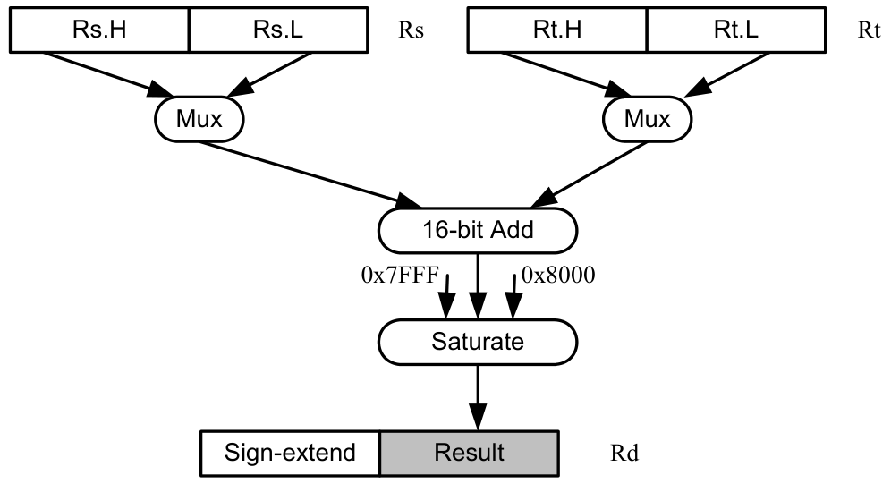

```text
Rs.H Rs.L Rs Rt.H Rt.L Rt
Mux Mux
16-bit Add
0x7FFF 0x8000
Saturate
Sign-extend Result Rd
```

| Syntax | Behavior |
|---|---|
| `Rd=add(Rt.L,Rs.[HL])[:sat]` | `Rd=[sat₁₆](Rt.h[0]+Rs.h[01]);` |
| `Rd=add(Rt.[HL],Rs.[HL])[:sat]:`<br>`<<16` | `Rd=([sat₁₆](Rt.h[01]+Rs.h[01]))<<16;` |

##### Class: XTYPE (slots 2,3)

##### Notes

- If saturation occurs during execution of this instruction (a result is clamped to either maximum or minimum values), the OVF bit in the status register is set. OVF remains set until explicitly cleared by a transfer to the status register.

##### Intrinsics

|  |  |
|---|---|
| `Rd=add(Rt.H,Rs.H):<<16` | `Word32 Q6_R_add_RhRh_s16(Word32 Rt, Word32 Rs)` |
| `Rd=add(Rt.H,Rs.H):sat:<<16` | `Word32 Q6_R_add_RhRh_sat_s16(Word32 Rt, Word32 Rs)` |
| `Rd=add(Rt.H,Rs.L):<<16` | `Word32 Q6_R_add_RhRl_s16(Word32 Rt, Word32 Rs)` |
| `Rd=add(Rt.H,Rs.L):sat:<<16` | `Word32 Q6_R_add_RhRl_sat_s16(Word32 Rt, Word32 Rs)` |
| `Rd=add(Rt.L,Rs.H)` | `Word32 Q6_R_add_RlRh(Word32 Rt, Word32 Rs)` |
| `Rd=add(Rt.L,Rs.H):<<16` | `Word32 Q6_R_add_RlRh_s16(Word32 Rt, Word32 Rs)` |
| `Rd=add(Rt.L,Rs.H):sat` | `Word32 Q6_R_add_RlRh_sat(Word32 Rt, Word32 Rs)` |
| `Rd=add(Rt.L,Rs.H):sat:<<16` | `Word32 Q6_R_add_RlRh_sat_s16(Word32 Rt, Word32 Rs)` |
| `Rd=add(Rt.L,Rs.L)` | `Word32 Q6_R_add_RlRl(Word32 Rt, Word32 Rs)` |
| `Rd=add(Rt.L,Rs.L):<<16` | `Word32 Q6_R_add_RlRl_s16(Word32 Rt, Word32 Rs)` |
| `Rd=add(Rt.L,Rs.L):sat` | `Word32 Q6_R_add_RlRl_sat(Word32 Rt, Word32 Rs)` |
| `Rd=add(Rt.L,Rs.L):sat:<<16` | `Word32 Q6_R_add_RlRl_sat_s16(Word32 Rt, Word32 Rs)` |

##### Encoding

| 31 | 30 | 29 | 28 | 27 | 26 | 25 | 24 | 23 | 22 | 21 | 20 | 19 | 18 | 17 | 16 | 15 | 14 | 13 | 12 | 11 | 10 | 9 | 8 | 7 | 6 | 5 | 4 | 3 | 2 | 1 | 0 |  |
|---|---|---|---|---|---|---|---|---|---|---|---|---|---|---|---|---|---|---|---|---|---|---|---|---|---|---|---|---|---|---|---|---|
| ICLASS | ICLASS | ICLASS | ICLASS | RegType | RegType | RegType | RegType |  |  |  | s5 | s5 | s5 | s5 | s5 | Parse | Parse |  | t5 | t5 | t5 | t5 | t5 | MinOp | MinOp | MinOp | d5 | d5 | d5 | d5 | d5 |  |
| 1 | 1 | 0 | 1 | 0 | 1 | 0 | 1 | 0 | 0 | 0 | s | s | s | s | s | P | P | - | t | t | t | t | t | 0 | 0 | - | d | d | d | d | d | Rd=add(Rt.L,Rs.L) |
| 1 | 1 | 0 | 1 | 0 | 1 | 0 | 1 | 0 | 0 | 0 | s | s | s | s | s | P | P | - | t | t | t | t | t | 0 | 1 | - | d | d | d | d | d | Rd=add(Rt.L,Rs.H) |
| 1 | 1 | 0 | 1 | 0 | 1 | 0 | 1 | 0 | 0 | 0 | s | s | s | s | s | P | P | - | t | t | t | t | t | 1 | 0 | - | d | d | d | d | d | Rd=add(Rt.L,Rs.L):sat |
| 1 | 1 | 0 | 1 | 0 | 1 | 0 | 1 | 0 | 0 | 0 | s | s | s | s | s | P | P | - | t | t | t | t | t | 1 | 1 | - | d | d | d | d | d | Rd=add(Rt.L,Rs.H):sat |
| 1 | 1 | 0 | 1 | 0 | 1 | 0 | 1 | 0 | 1 | 0 | s | s | s | s | s | P | P | - | t | t | t | t | t | 0 | 0 | 0 | d | d | d | d | d | Rd=add(Rt.L,Rs.L):<<16 |
| 1 | 1 | 0 | 1 | 0 | 1 | 0 | 1 | 0 | 1 | 0 | s | s | s | s | s | P | P | - | t | t | t | t | t | 0 | 0 | 1 | d | d | d | d | d | Rd=add(Rt.L,Rs.H):<<16 |
| 1 | 1 | 0 | 1 | 0 | 1 | 0 | 1 | 0 | 1 | 0 | s | s | s | s | s | P | P | - | t | t | t | t | t | 0 | 1 | 0 | d | d | d | d | d | Rd=add(Rt.H,Rs.L):<<16 |
| 1 | 1 | 0 | 1 | 0 | 1 | 0 | 1 | 0 | 1 | 0 | s | s | s | s | s | P | P | - | t | t | t | t | t | 0 | 1 | 1 | d | d | d | d | d | Rd=add(Rt.H,Rs.H):<<16 |
| 1 | 1 | 0 | 1 | 0 | 1 | 0 | 1 | 0 | 1 | 0 | s | s | s | s | s | P | P | - | t | t | t | t | t | 1 | 0 | 0 | d | d | d | d | d | Rd=add(Rt.L,Rs.L):sat:<<16 |
| 1 | 1 | 0 | 1 | 0 | 1 | 0 | 1 | 0 | 1 | 0 | s | s | s | s | s | P | P | - | t | t | t | t | t | 1 | 0 | 1 | d | d | d | d | d | Rd=add(Rt.L,Rs.H):sat:<<16 |
| 1 | 1 | 0 | 1 | 0 | 1 | 0 | 1 | 0 | 1 | 0 | s | s | s | s | s | P | P | - | t | t | t | t | t | 1 | 1 | 0 | d | d | d | d | d | Rd=add(Rt.H,Rs.L):sat:<<16 |
| 1 | 1 | 0 | 1 | 0 | 1 | 0 | 1 | 0 | 1 | 0 | s | s | s | s | s | P | P | - | t | t | t | t | t | 1 | 1 | 1 | d | d | d | d | d | Rd=add(Rt.H,Rs.H):sat:<<16 |

| Field name | Description |
|---|---|
| `RegType` | Register type |
| `MinOp` | Minor opcode |
| `ICLASS` | Instruction class |
| `Parse` | Packet/loop parse bits |
| `d5` | Field to encode register d |
| `s5` | Field to encode register s |
| `t5` | Field to encode register t |

#### Add or subtract doublewords with carry

Add or subtract with carry. Predicate register Px is used as an extra input and output.

For adds, add the LSB of the predicate to the sum of the two input pairs.

For subtracts, the predicate is considered a not-borrow. The LSB of the predicate is added to the first source register and the logical complement of the second argument.

The carry-out from the sum is saved in predicate Px.

These instructions allow efficient addition or subtraction of numbers larger than 64 bits.

| Syntax | Behavior |
|---|---|
| `Rdd=add(Rss,Rtt,Px):carry` | `PREDUSE_TIMING;`<br>`Rdd = Rss + Rtt + Px[0];`<br>`Px = carry_from_add(Rss,Rtt,Px[0]) ? 0xff : 0x00;` |
| `Rdd=sub(Rss,Rtt,Px):carry` | `PREDUSE_TIMING;`<br>`Rdd = Rss + ~Rtt + Px[0];`<br>`Px = carry_from_add(Rss,~Rtt,Px[0]) ? 0xff : 0x00;` |

##### Class: XTYPE (slots 2,3)

##### Notes

- The predicate generated by this instruction can not be used as a .new predicate, nor can it be automatically ANDed with another predicate.

##### Encoding

| 31 | 30 | 29 | 28 | 27 | 26 | 25 | 24 | 23 | 22 | 21 | 20 | 19 | 18 | 17 | 16 | 15 | 14 | 13 | 12 | 11 | 10 | 9 | 8 | 7 | 6 | 5 | 4 | 3 | 2 | 1 | 0 |  |
|---|---|---|---|---|---|---|---|---|---|---|---|---|---|---|---|---|---|---|---|---|---|---|---|---|---|---|---|---|---|---|---|---|
| ICLASS | ICLASS | ICLASS | ICLASS | RegType | RegType | RegType | RegType | Maj | Maj |  | s5 | s5 | s5 | s5 | s5 | Parse | Parse |  | t5 | t5 | t5 | t5 | t5 |  | x2 | x2 | d5 | d5 | d5 | d5 | d5 |  |
| 1 | 1 | 0 | 0 | 0 | 0 | 1 | 0 | 1 | 1 | 0 | s | s | s | s | s | P | P | - | t | t | t | t | t | - | x | x | d | d | d | d | d | Rdd=add(Rss,Rtt,Px):carry |
| 1 | 1 | 0 | 0 | 0 | 0 | 1 | 0 | 1 | 1 | 1 | s | s | s | s | s | P | P | - | t | t | t | t | t | - | x | x | d | d | d | d | d | Rdd=sub(Rss,Rtt,Px):carry |

| Field name | Description |
|---|---|
| `ICLASS` | Instruction class |
| `Parse` | Packet/loop parse bits |
| `d5` | Field to encode register d |
| `s5` | Field to encode register s |
| `t5` | Field to encode register t |
| `x2` | Field to encode register x |
| `Maj` | Major opcode |
| `Min` | Minor opcode |
| `RegType` | Register type |

#### Clip to unsigned

Clip input to unsigned integer.

| Syntax | Behavior |
|---|---|
| `Rd=clip(Rs,#u5)` | `Rd=MIN((1<<#u)- 1,MAX(Rs,-(1<<#u)));` |

##### Class: XTYPE (slots 2,3)

##### Notes

- This instruction can only execute on a core with the Hexagon audio extensions

##### Intrinsics

```
Rd=clip(Rs,#u5)Word32 Q6_R_clip_RI(Word32 Rs, Word32 Iu5)
```

##### Encoding

| 31 | 30 | 29 | 28 | 27 | 26 | 25 | 24 | 23 | 22 | 21 | 20 | 19 | 18 | 17 | 16 | 15 | 14 | 13 | 12 | 11 | 10 | 9 | 8 | 7 | 6 | 5 | 4 | 3 | 2 | 1 | 0 |  |
|---|---|---|---|---|---|---|---|---|---|---|---|---|---|---|---|---|---|---|---|---|---|---|---|---|---|---|---|---|---|---|---|---|
| ICLASS | ICLASS | ICLASS | ICLASS | RegType | RegType | RegType | RegType | MajOp | MajOp |  | s5 | s5 | s5 | s5 | s5 | Parse | Parse |  |  |  |  |  |  | MinOp | MinOp | MinOp | d5 | d5 | d5 | d5 | d5 |  |
| 1 | 0 | 0 | 0 | 1 | 0 | 0 | 0 | 1 | 1 | 0 | s | s | s | s | s | P | P | 0 | i | i | i | i | i | 1 | 0 | 1 | d | d | d | d | d | Rd=clip(Rs,#u5) |

| Field name | Description |
|---|---|
| `ICLASS` | Instruction class |
| `Parse` | Packet/loop parse bits |
| `d5` | Field to encode register d |
| `s5` | Field to encode register s |
| `MajOp` | Major opcode |
| `MinOp` | Minor opcode |
| `RegType` | Register type |

#### Logical doublewords

Perform bitwise logical AND, OR, XOR, and NOT operations. The source and destination registers are 64-bit.

For 32-bit logical operations, see the ALU32 logical instructions.

| Syntax | Behavior |
|---|---|
| `Rdd=and(Rss,Rtt)` | `Rdd=Rss&Rtt;` |
| `Rdd=and(Rtt,~Rss)` | `Rdd = (Rtt & ~Rss);` |
| `Rdd=not(Rss)` | `Rdd=~Rss;` |
| `Rdd=or(Rss,Rtt)` | `Rdd=Rss\|Rtt;` |
| `Rdd=or(Rtt,~Rss)` | `Rdd = (Rtt \| ~Rss);` |
| `Rdd=xor(Rss,Rtt)` | `Rdd=Rss^Rtt;` |

##### Class: XTYPE (slots 2,3)

##### Intrinsics

|  |  |
|---|---|
| `Rdd=and(Rss,Rtt)` | `Word64 Q6_P_and_PP(Word64 Rss, Word64 Rtt)` |
| `Rdd=and(Rtt,~Rss)` | `Word64 Q6_P_and_PnP(Word64 Rtt, Word64 Rss)` |
| `Rdd=not(Rss)` | `Word64 Q6_P_not_P(Word64 Rss)` |
| `Rdd=or(Rss,Rtt)` | `Word64 Q6_P_or_PP(Word64 Rss, Word64 Rtt)` |
| `Rdd=or(Rtt,~Rss)` | `Word64 Q6_P_or_PnP(Word64 Rtt, Word64 Rss)` |
| `Rdd=xor(Rss,Rtt)` | `Word64 Q6_P_xor_PP(Word64 Rss, Word64 Rtt)` |

##### Encoding

| 31 | 30 | 29 | 28 | 27 | 26 | 25 | 24 | 23 | 22 | 21 | 20 | 19 | 18 | 17 | 16 | 15 | 14 | 13 | 12 | 11 | 10 | 9 | 8 | 7 | 6 | 5 | 4 | 3 | 2 | 1 | 0 |  |
|---|---|---|---|---|---|---|---|---|---|---|---|---|---|---|---|---|---|---|---|---|---|---|---|---|---|---|---|---|---|---|---|---|
| ICLASS | ICLASS | ICLASS | ICLASS | RegType | RegType | RegType | RegType | MajOp | MajOp |  | s5 | s5 | s5 | s5 | s5 | Parse | Parse |  |  |  |  |  |  | MinOp | MinOp | MinOp | d5 | d5 | d5 | d5 | d5 |  |
| 1 | 0 | 0 | 0 | 0 | 0 | 0 | 0 | 1 | 0 | 0 | s | s | s | s | s | P | P | - | - | - | - | - | - | 1 | 0 | 0 | d | d | d | d | d | Rdd=not(Rss) |
| ICLASS | ICLASS | ICLASS | ICLASS | RegType | RegType | RegType | RegType |  |  |  | s5 | s5 | s5 | s5 | s5 | Parse | Parse |  | t5 | t5 | t5 | t5 | t5 | MinOp | MinOp | MinOp | d5 | d5 | d5 | d5 | d5 |  |
| 1 | 1 | 0 | 1 | 0 | 0 | 1 | 1 | 1 | 1 | 1 | s | s | s | s | s | P | P | - | t | t | t | t | t | 0 | 0 | 0 | d | d | d | d | d | Rdd=and(Rss,Rtt) |
| 1 | 1 | 0 | 1 | 0 | 0 | 1 | 1 | 1 | 1 | 1 | s | s | s | s | s | P | P | - | t | t | t | t | t | 0 | 0 | 1 | d | d | d | d | d | Rdd=and(Rtt,~Rss) |
| 1 | 1 | 0 | 1 | 0 | 0 | 1 | 1 | 1 | 1 | 1 | s | s | s | s | s | P | P | - | t | t | t | t | t | 0 | 1 | 0 | d | d | d | d | d | Rdd=or(Rss,Rtt) |
| 1 | 1 | 0 | 1 | 0 | 0 | 1 | 1 | 1 | 1 | 1 | s | s | s | s | s | P | P | - | t | t | t | t | t | 0 | 1 | 1 | d | d | d | d | d | Rdd=or(Rtt,~Rss) |
| 1 | 1 | 0 | 1 | 0 | 0 | 1 | 1 | 1 | 1 | 1 | s | s | s | s | s | P | P | - | t | t | t | t | t | 1 | 0 | 0 | d | d | d | d | d | Rdd=xor(Rss,Rtt) |

| Field name | Description |
|---|---|
| `RegType` | Register type |
| `MinOp` | Minor opcode |
| `ICLASS` | Instruction class |
| `Parse` | Packet/loop parse bits |
| `d5` | Field to encode register d |
| `s5` | Field to encode register s |
| `t5` | Field to encode register t |
| `MajOp` | Major opcode |

#### Logical-logical doublewords

Perform a logical operation of the two source operands, then perform a second logical operation of the result with the destination register Rxx.

The source and destination registers are 64-bit.

| Syntax | Behavior |
|---|---|
| `Rxx^=xor(Rss,Rtt)` | `Rxx^=Rss^Rtt;` |

##### Class: XTYPE (slots 2,3)

##### Intrinsics

```
Rxx^=xor(Rss,Rtt)Word64 Q6_P_xorxacc_PP(Word64 Rxx, Word64
                             Rss, Word64 Rtt)
```

##### Encoding

| 31 | 30 | 29 | 28 | 27 | 26 | 25 | 24 | 23 | 22 | 21 | 20 | 19 | 18 | 17 | 16 | 15 | 14 | 13 | 12 | 11 | 10 | 9 | 8 | 7 | 6 | 5 | 4 | 3 | 2 | 1 | 0 |  |
|---|---|---|---|---|---|---|---|---|---|---|---|---|---|---|---|---|---|---|---|---|---|---|---|---|---|---|---|---|---|---|---|---|
| ICLASS | ICLASS | ICLASS | ICLASS | RegType | RegType | RegType | RegType | Maj | Maj |  | s5 | s5 | s5 | s5 | s5 | Parse | Parse |  | t5 | t5 | t5 | t5 | t5 | Min | Min |  | x5 | x5 | x5 | x5 | x5 |  |
| 1 | 1 | 0 | 0 | 1 | 0 | 1 | 0 | 1 | 0 | - | s | s | s | s | s | P | P | 0 | t | t | t | t | t | 0 | 0 | 0 | x | x | x | x | x | Rxx^=xor(Rss,Rtt) |

| Field name | Description |
|---|---|
| `ICLASS` | Instruction class |
| `Parse` | Packet/loop parse bits |
| `s5` | Field to encode register s |
| `t5` | Field to encode register t |
| `x5` | Field to encode register x |
| `Maj` | Major opcode |
| `Min` | Minor opcode |
| `RegType` | Register type |

#### Logical-logical words

Perform a logical operation of the two source operands, then perform a second logical operation of the result with the destination register Rx.

The source and destination registers are 32-bit.

| Syntax | Behavior |
|---|---|
| `Rx=or(Ru,and(Rx,#s10))` | `Rx = Ru \| (Rx & apply_extension(#s));` |
| `Rx[&\|^]=and(Rs,Rt)` | `Rx [\|&^]= (Rs [\|&^] Rt);` |
| `Rx[&\|^]=and(Rs,~Rt)` | `Rx [\|&^]= (Rs [\|&^] ~Rt);` |
| `Rx[&\|^]=or(Rs,Rt)` | `Rx [\|&^]= (Rs [\|&^] Rt);` |
| `Rx[&\|^]=xor(Rs,Rt)` | `Rx[\|&^]=Rs[\|&^]Rt;` |
| `Rx\|=and(Rs,#s10)` | `Rx = Rx \| (Rs & apply_extension(#s));` |
| `Rx\|=or(Rs,#s10)` | `Rx = Rx \| (Rs \| apply_extension(#s));` |

##### Class: XTYPE (slots 2,3)

##### Intrinsics

|  |  |
|---|---|
| `Rx&=and(Rs,Rt)` | `Word32 Q6_R_andand_RR(Word32 Rx, Word32 Rs, Word32 Rt)` |
| `Rx&=and(Rs,~Rt)` | `Word32 Q6_R_andand_RnR(Word32 Rx, Word32 Rs, Word32 Rt)` |
| `Rx&=or(Rs,Rt)` | `Word32 Q6_R_orand_RR(Word32 Rx, Word32 Rs, Word32 Rt)` |
| `Rx&=xor(Rs,Rt)` | `Word32 Q6_R_xorand_RR(Word32 Rx, Word32 Rs, Word32 Rt)` |
| `Rx=or(Ru,and(Rx,#s10))` | `Word32 Q6_R_or_and_RRI(Word32 Ru, Word32 Rx, Word32 Is10)` |
| `Rx^=and(Rs,Rt)` | `Word32 Q6_R_andxacc_RR(Word32 Rx, Word32 Rs, Word32 Rt)` |
| `Rx^=and(Rs,~Rt)` | `Word32 Q6_R_andxacc_RnR(Word32 Rx, Word32 Rs, Word32 Rt)` |
| `Rx^=or(Rs,Rt)` | `Word32 Q6_R_orxacc_RR(Word32 Rx, Word32 Rs, Word32 Rt)` |
| `Rx^=xor(Rs,Rt)` | `Word32 Q6_R_xorxacc_RR(Word32 Rx, Word32 Rs, Word32 Rt)` |
| `Rx\|=and(Rs,#s10)` | `Word32 Q6_R_andor_RI(Word32 Rx, Word32 Rs, Word32 Is10)` |
| `Rx\|=and(Rs,Rt)` | `Word32 Q6_R_andor_RR(Word32 Rx, Word32 Rs, Word32 Rt)` |
| `Rx\|=and(Rs,~Rt)` | `Word32 Q6_R_andor_RnR(Word32 Rx, Word32 Rs, Word32 Rt)` |
| `Rx\|=or(Rs,#s10)` | `Word32 Q6_R_oror_RI(Word32 Rx, Word32 Rs, Word32 Is10)` |
| `Rx\|=or(Rs,Rt)` | `Word32 Q6_R_oror_RR(Word32 Rx, Word32 Rs, Word32 Rt)` |
| `Rx\|=xor(Rs,Rt)` | `Word32 Q6_R_xoror_RR(Word32 Rx, Word32 Rs, Word32 Rt)` |

##### Encoding

| 31 | 30 | 29 | 28 | 27 | 26 | 25 | 24 | 23 | 22 | 21 | 20 | 19 | 18 | 17 | 16 | 15 | 14 | 13 | 12 | 11 | 10 | 9 | 8 | 7 | 6 | 5 | 4 | 3 | 2 | 1 | 0 |  |
|---|---|---|---|---|---|---|---|---|---|---|---|---|---|---|---|---|---|---|---|---|---|---|---|---|---|---|---|---|---|---|---|---|
| ICLASS | ICLASS | ICLASS | ICLASS | RegType | RegType | RegType | RegType |  |  |  | s5 | s5 | s5 | s5 | s5 | Parse | Parse |  |  |  |  |  |  |  |  |  | x5 | x5 | x5 | x5 | x5 |  |
| 1 | 1 | 0 | 1 | 1 | 0 | 1 | 0 | 0 | 0 | i | s | s | s | s | s | P | P | i | i | i | i | i | i | i | i | i | x | x | x | x | x | Rx\|=and(Rs,#s10) |
| ICLASS | ICLASS | ICLASS | ICLASS | RegType | RegType | RegType | RegType |  |  |  | x5 | x5 | x5 | x5 | x5 | Parse | Parse |  |  |  |  |  |  |  |  |  | u5 | u5 | u5 | u5 | u5 |  |
| 1 | 1 | 0 | 1 | 1 | 0 | 1 | 0 | 0 | 1 | i | x | x | x | x | x | P | P | i | i | i | i | i | i | i | i | i | u | u | u | u | u | Rx=or(Ru,and(Rx,#s10)) |
| ICLASS | ICLASS | ICLASS | ICLASS | RegType | RegType | RegType | RegType |  |  |  | s5 | s5 | s5 | s5 | s5 | Parse | Parse |  |  |  |  |  |  |  |  |  | x5 | x5 | x5 | x5 | x5 |  |
| 1 | 1 | 0 | 1 | 1 | 0 | 1 | 0 | 1 | 0 | i | s | s | s | s | s | P | P | i | i | i | i | i | i | i | i | i | x | x | x | x | x | Rx\|=or(Rs,#s10) |
| ICLASS | ICLASS | ICLASS | ICLASS | RegType | RegType | RegType | RegType | MajOp | MajOp | MajOp | s5 | s5 | s5 | s5 | s5 | Parse | Parse |  | t5 | t5 | t5 | t5 | t5 | MinOp | MinOp | MinOp | x5 | x5 | x5 | x5 | x5 |  |
| 1 | 1 | 1 | 0 | 1 | 1 | 1 | 1 | 0 | 0 | 1 | s | s | s | s | s | P | P | 0 | t | t | t | t | t | 0 | 0 | 0 | x | x | x | x | x | Rx\|=and(Rs,~Rt) |
| 1 | 1 | 1 | 0 | 1 | 1 | 1 | 1 | 0 | 0 | 1 | s | s | s | s | s | P | P | 0 | t | t | t | t | t | 0 | 0 | 1 | x | x | x | x | x | Rx&=and(Rs,~Rt) |
| 1 | 1 | 1 | 0 | 1 | 1 | 1 | 1 | 0 | 0 | 1 | s | s | s | s | s | P | P | 0 | t | t | t | t | t | 0 | 1 | 0 | x | x | x | x | x | Rx^=and(Rs,~Rt) |
| 1 | 1 | 1 | 0 | 1 | 1 | 1 | 1 | 0 | 1 | 0 | s | s | s | s | s | P | P | 0 | t | t | t | t | t | 0 | 0 | 0 | x | x | x | x | x | Rx&=and(Rs,Rt) |
| 1 | 1 | 1 | 0 | 1 | 1 | 1 | 1 | 0 | 1 | 0 | s | s | s | s | s | P | P | 0 | t | t | t | t | t | 0 | 0 | 1 | x | x | x | x | x | Rx&=or(Rs,Rt) |
| 1 | 1 | 1 | 0 | 1 | 1 | 1 | 1 | 0 | 1 | 0 | s | s | s | s | s | P | P | 0 | t | t | t | t | t | 0 | 1 | 0 | x | x | x | x | x | Rx&=xor(Rs,Rt) |
| 1 | 1 | 1 | 0 | 1 | 1 | 1 | 1 | 0 | 1 | 0 | s | s | s | s | s | P | P | 0 | t | t | t | t | t | 0 | 1 | 1 | x | x | x | x | x | Rx\|=and(Rs,Rt) |
| 1 | 1 | 1 | 0 | 1 | 1 | 1 | 1 | 1 | 0 | 0 | s | s | s | s | s | P | P | 0 | t | t | t | t | t | 0 | 1 | 1 | x | x | x | x | x | Rx^=xor(Rs,Rt) |
| 1 | 1 | 1 | 0 | 1 | 1 | 1 | 1 | 1 | 1 | 0 | s | s | s | s | s | P | P | 0 | t | t | t | t | t | 0 | 0 | 0 | x | x | x | x | x | Rx\|=or(Rs,Rt) |
| 1 | 1 | 1 | 0 | 1 | 1 | 1 | 1 | 1 | 1 | 0 | s | s | s | s | s | P | P | 0 | t | t | t | t | t | 0 | 0 | 1 | x | x | x | x | x | Rx\|=xor(Rs,Rt) |
| 1 | 1 | 1 | 0 | 1 | 1 | 1 | 1 | 1 | 1 | 0 | s | s | s | s | s | P | P | 0 | t | t | t | t | t | 0 | 1 | 0 | x | x | x | x | x | Rx^=and(Rs,Rt) |
| 1 | 1 | 1 | 0 | 1 | 1 | 1 | 1 | 1 | 1 | 0 | s | s | s | s | s | P | P | 0 | t | t | t | t | t | 0 | 1 | 1 | x | x | x | x | x | Rx^=or(Rs,Rt) |

| Field name | Description |
|---|---|
| `RegType` | Register type |
| `ICLASS` | Instruction class |
| `MajOp` | Major opcode |
| `MinOp` | Minor opcode |
| `Parse` | Packet/loop parse bits |
| `s5` | Field to encode register s |
| `t5` | Field to encode register t |
| `u5` | Field to encode register u |
| `x5` | Field to encode register x |

#### Maximum words

Select either the signed or unsigned maximum of two source registers and place in a destination register Rdd.

| Syntax | Behavior |
|---|---|
| `Rd=max(Rs,Rt)` | `Rd = max(Rs,Rt);` |
| `Rd=maxu(Rs,Rt)` | `Rd = max(Rs.uw[0],Rt.uw[0]);` |

##### Class: XTYPE (slots 2,3)

##### Intrinsics

|  |  |
|---|---|
| `Rd=max(Rs,Rt)` | `Word32 Q6_R_max_RR(Word32 Rs, Word32 Rt)` |
| `Rd=maxu(Rs,Rt)` | `UWord32 Q6_R_maxu_RR(Word32 Rs, Word32 Rt)` |

##### Encoding

| 31 | 30 | 29 | 28 | 27 | 26 | 25 | 24 | 23 | 22 | 21 | 20 | 19 | 18 | 17 | 16 | 15 | 14 | 13 | 12 | 11 | 10 | 9 | 8 | 7 | 6 | 5 | 4 | 3 | 2 | 1 | 0 |  |
|---|---|---|---|---|---|---|---|---|---|---|---|---|---|---|---|---|---|---|---|---|---|---|---|---|---|---|---|---|---|---|---|---|
| ICLASS | ICLASS | ICLASS | ICLASS | RegType | RegType | RegType | RegType |  |  |  | s5 | s5 | s5 | s5 | s5 | Parse | Parse |  | t5 | t5 | t5 | t5 | t5 | MinOp | MinOp | MinOp | d5 | d5 | d5 | d5 | d5 |  |
| 1 | 1 | 0 | 1 | 0 | 1 | 0 | 1 | 1 | 1 | 0 | s | s | s | s | s | P | P | - | t | t | t | t | t | 0 | - | - | d | d | d | d | d | Rd=max(Rs,Rt) |
| 1 | 1 | 0 | 1 | 0 | 1 | 0 | 1 | 1 | 1 | 0 | s | s | s | s | s | P | P | - | t | t | t | t | t | 1 | - | - | d | d | d | d | d | Rd=maxu(Rs,Rt) |

| Field name | Description |
|---|---|
| `RegType` | Register type |
| `MinOp` | Minor opcode |
| `ICLASS` | Instruction class |
| `Parse` | Packet/loop parse bits |
| `d5` | Field to encode register d |
| `s5` | Field to encode register s |
| `t5` | Field to encode register t |

#### Maximum doublewords

Select either the signed or unsigned maximum of two 64-bit source registers and place in a destination register.

| Syntax | Behavior |
|---|---|
| `Rdd=max(Rss,Rtt)` | `Rdd = max(Rss,Rtt);` |
| `Rdd=maxu(Rss,Rtt)` | `Rdd = max(Rss.u64,Rtt.u64);` |

##### Class: XTYPE (slots 2,3)

##### Intrinsics

|  |  |
|---|---|
| `Rdd=max(Rss,Rtt)` | `Word64 Q6_P_max_PP(Word64 Rss, Word64 Rtt)` |
| `Rdd=maxu(Rss,Rtt)` | `UWord64 Q6_P_maxu_PP(Word64 Rss, Word64 Rtt)` |

##### Encoding

| 31 | 30 | 29 | 28 | 27 | 26 | 25 | 24 | 23 | 22 | 21 | 20 | 19 | 18 | 17 | 16 | 15 | 14 | 13 | 12 | 11 | 10 | 9 | 8 | 7 | 6 | 5 | 4 | 3 | 2 | 1 | 0 |  |
|---|---|---|---|---|---|---|---|---|---|---|---|---|---|---|---|---|---|---|---|---|---|---|---|---|---|---|---|---|---|---|---|---|
| ICLASS | ICLASS | ICLASS | ICLASS | RegType | RegType | RegType | RegType |  |  |  | s5 | s5 | s5 | s5 | s5 | Parse | Parse |  | t5 | t5 | t5 | t5 | t5 | MinOp | MinOp | MinOp | d5 | d5 | d5 | d5 | d5 |  |
| 1 | 1 | 0 | 1 | 0 | 0 | 1 | 1 | 1 | 1 | 0 | s | s | s | s | s | P | P | - | t | t | t | t | t | 1 | 0 | 0 | d | d | d | d | d | Rdd=max(Rss,Rtt) |
| 1 | 1 | 0 | 1 | 0 | 0 | 1 | 1 | 1 | 1 | 0 | s | s | s | s | s | P | P | - | t | t | t | t | t | 1 | 0 | 1 | d | d | d | d | d | Rdd=maxu(Rss,Rtt) |

| Field name | Description |
|---|---|
| `RegType` | Register type |
| `MinOp` | Minor opcode |
| `ICLASS` | Instruction class |
| `Parse` | Packet/loop parse bits |
| `d5` | Field to encode register d |
| `s5` | Field to encode register s |
| `t5` | Field to encode register t |

#### Minimum words

Select either the signed or unsigned minimum of two source registers and place in destination register Rd.

| Syntax | Behavior |
|---|---|
| `Rd=min(Rt,Rs)` | `Rd = min(Rt,Rs);` |
| `Rd=minu(Rt,Rs)` | `Rd = min(Rt.uw[0],Rs.uw[0]);` |

##### Class: XTYPE (slots 2,3)

##### Intrinsics

|  |  |
|---|---|
| `Rd=min(Rt,Rs)` | `Word32 Q6_R_min_RR(Word32 Rt, Word32 Rs)` |
| `Rd=minu(Rt,Rs)` | `UWord32 Q6_R_minu_RR(Word32 Rt, Word32 Rs)` |

##### Encoding

| 31 | 30 | 29 | 28 | 27 | 26 | 25 | 24 | 23 | 22 | 21 | 20 | 19 | 18 | 17 | 16 | 15 | 14 | 13 | 12 | 11 | 10 | 9 | 8 | 7 | 6 | 5 | 4 | 3 | 2 | 1 | 0 |  |
|---|---|---|---|---|---|---|---|---|---|---|---|---|---|---|---|---|---|---|---|---|---|---|---|---|---|---|---|---|---|---|---|---|
| ICLASS | ICLASS | ICLASS | ICLASS | RegType | RegType | RegType | RegType |  |  |  | s5 | s5 | s5 | s5 | s5 | Parse | Parse |  | t5 | t5 | t5 | t5 | t5 | MinOp | MinOp | MinOp | d5 | d5 | d5 | d5 | d5 |  |
| 1 | 1 | 0 | 1 | 0 | 1 | 0 | 1 | 1 | 0 | 1 | s | s | s | s | s | P | P | - | t | t | t | t | t | 0 | - | - | d | d | d | d | d | Rd=min(Rt,Rs) |
| 1 | 1 | 0 | 1 | 0 | 1 | 0 | 1 | 1 | 0 | 1 | s | s | s | s | s | P | P | - | t | t | t | t | t | 1 | - | - | d | d | d | d | d | Rd=minu(Rt,Rs) |

| Field name | Description |
|---|---|
| `RegType` | Register type |
| `MinOp` | Minor opcode |
| `ICLASS` | Instruction class |
| `Parse` | Packet/loop parse bits |
| `d5` | Field to encode register d |
| `s5` | Field to encode register s |
| `t5` | Field to encode register t |

#### Minimum doublewords

Select either the signed or unsigned minimum of two 64-bit source registers and place in the destination register Rdd.

| Syntax | Behavior |
|---|---|
| `Rdd=min(Rtt,Rss)` | `Rdd = min(Rtt,Rss);` |
| `Rdd=minu(Rtt,Rss)` | `Rdd = min(Rtt.u64,Rss.u64);` |

##### Class: XTYPE (slots 2,3)

##### Intrinsics

|  |  |
|---|---|
| `Rdd=min(Rtt,Rss)` | `Word64 Q6_P_min_PP(Word64 Rtt, Word64 Rss)` |
| `Rdd=minu(Rtt,Rss)` | `UWord64 Q6_P_minu_PP(Word64 Rtt, Word64 Rss)` |

##### Encoding

| 31 | 30 | 29 | 28 | 27 | 26 | 25 | 24 | 23 | 22 | 21 | 20 | 19 | 18 | 17 | 16 | 15 | 14 | 13 | 12 | 11 | 10 | 9 | 8 | 7 | 6 | 5 | 4 | 3 | 2 | 1 | 0 |  |
|---|---|---|---|---|---|---|---|---|---|---|---|---|---|---|---|---|---|---|---|---|---|---|---|---|---|---|---|---|---|---|---|---|
| ICLASS | ICLASS | ICLASS | ICLASS | RegType | RegType | RegType | RegType |  |  |  | s5 | s5 | s5 | s5 | s5 | Parse | Parse |  | t5 | t5 | t5 | t5 | t5 | MinOp | MinOp | MinOp | d5 | d5 | d5 | d5 | d5 |  |
| 1 | 1 | 0 | 1 | 0 | 0 | 1 | 1 | 1 | 0 | 1 | s | s | s | s | s | P | P | - | t | t | t | t | t | 1 | 1 | 0 | d | d | d | d | d | Rdd=min(Rtt,Rss) |
| 1 | 1 | 0 | 1 | 0 | 0 | 1 | 1 | 1 | 0 | 1 | s | s | s | s | s | P | P | - | t | t | t | t | t | 1 | 1 | 1 | d | d | d | d | d | Rdd=minu(Rtt,Rss) |

| Field name | Description |
|---|---|
| `RegType` | Register type |
| `MinOp` | Minor opcode |
| `ICLASS` | Instruction class |
| `Parse` | Packet/loop parse bits |
| `d5` | Field to encode register d |
| `s5` | Field to encode register s |
| `t5` | Field to encode register t |

#### Modulo wrap

Wrap the Rs value into the modulo range from 0 to Rt.

If Rs is greater than or equal to Rt, wrap it to the bottom of the range by subtracting Rt.

If Rs is less than zero, wrap it to the top of the range by adding Rt.

Otherwise, when Rs fits within the range, no adjustment is necessary. The result is returned in register Rd.

| Syntax | Behavior |
|---|---|
| `Rd=modwrap(Rs,Rt)` | `if (Rs < 0) {`<br>`Rd = Rs + Rt.uw[0];`<br>`} else if (Rs.uw[0] >= Rt.uw[0]) {`<br>`Rd = Rs - Rt.uw[0];`<br>`} else {`<br>`Rd = Rs;`<br>`}` |

##### Class: XTYPE (slots 2,3)

##### Intrinsics

```
Rd=modwrap(Rs,Rt)Word32 Q6_R_modwrap_RR(Word32 Rs, Word32
                             Rt)
```

##### Encoding

| 31 | 30 | 29 | 28 | 27 | 26 | 25 | 24 | 23 | 22 | 21 | 20 | 19 | 18 | 17 | 16 | 15 | 14 | 13 | 12 | 11 | 10 | 9 | 8 | 7 | 6 | 5 | 4 | 3 | 2 | 1 | 0 |  |
|---|---|---|---|---|---|---|---|---|---|---|---|---|---|---|---|---|---|---|---|---|---|---|---|---|---|---|---|---|---|---|---|---|
| ICLASS | ICLASS | ICLASS | ICLASS | RegType | RegType | RegType | RegType |  |  |  | s5 | s5 | s5 | s5 | s5 | Parse | Parse |  | t5 | t5 | t5 | t5 | t5 | MinOp | MinOp | MinOp | d5 | d5 | d5 | d5 | d5 |  |
| 1 | 1 | 0 | 1 | 0 | 0 | 1 | 1 | 1 | 1 | 1 | s | s | s | s | s | P | P | - | t | t | t | t | t | 1 | 1 | 1 | d | d | d | d | d | Rd=modwrap(Rs,Rt) |

| Field name | Description |
|---|---|
| `RegType` | Register type |
| `MinOp` | Minor opcode |
| `ICLASS` | Instruction class |
| `Parse` | Packet/loop parse bits |
| `d5` | Field to encode register d |
| `s5` | Field to encode register s |
| `t5` | Field to encode register t |

#### Negate

The first form of this instruction performs a negate on a 32-bit register with saturation. If the input is 0x80000000, the result is saturated to 0x7fffffff. The nonsaturating 32-bit register negate is a ALU32-class instruction and can execute on any slot.

The second form of this instruction negates a 64-bit source register and places the result in destination Rdd.

| Syntax | Behavior |
|---|---|
| `Rd=neg(Rs):sat` | `Rd = sat₃₂(-Rs.s64);` |
| `Rdd=neg(Rss)` | `Rdd = -Rss;` |

##### Class: XTYPE (slots 2,3)

##### Notes

- If saturation occurs during execution of this instruction (a result is clamped to either maximum or minimum values), the OVF bit in the status register is set. OVF remains set until explicitly cleared by a transfer to the status register.

##### Intrinsics

|  |  |
|---|---|
| `Rd=neg(Rs):sat` | `Word32 Q6_R_neg_R_sat(Word32 Rs)` |
| `Rdd=neg(Rss)` | `Word64 Q6_P_neg_P(Word64 Rss)` |

##### Encoding

| 31 | 30 | 29 | 28 | 27 | 26 | 25 | 24 | 23 | 22 | 21 | 20 | 19 | 18 | 17 | 16 | 15 | 14 | 13 | 12 | 11 | 10 | 9 | 8 | 7 | 6 | 5 | 4 | 3 | 2 | 1 | 0 |  |
|---|---|---|---|---|---|---|---|---|---|---|---|---|---|---|---|---|---|---|---|---|---|---|---|---|---|---|---|---|---|---|---|---|
| ICLASS | ICLASS | ICLASS | ICLASS | RegType | RegType | RegType | RegType | MajOp | MajOp |  | s5 | s5 | s5 | s5 | s5 | Parse | Parse |  |  |  |  |  |  | MinOp | MinOp | MinOp | d5 | d5 | d5 | d5 | d5 |  |
| 1 | 0 | 0 | 0 | 0 | 0 | 0 | 0 | 1 | 0 | 0 | s | s | s | s | s | P | P | - | - | - | - | - | - | 1 | 0 | 1 | d | d | d | d | d | Rdd=neg(Rss) |
| 1 | 0 | 0 | 0 | 1 | 1 | 0 | 0 | 1 | 0 | 0 | s | s | s | s | s | P | P | - | - | - | - | - | - | 1 | 1 | 0 | d | d | d | d | d | Rd=neg(Rs):sat |

| Field name | Description |
|---|---|
| `ICLASS` | Instruction class |
| `Parse` | Packet/loop parse bits |
| `d5` | Field to encode register d |
| `s5` | Field to encode register s |
| `MajOp` | Major opcode |
| `MinOp` | Minor opcode |
| `RegType` | Register type |

#### Round

Perform either arithmetic (.5 is rounded up) or convergent (.5 is rounded towards even) rounding to any bit location.

Arithmetic rounding has optional saturation. In this version, the result is saturated to a 32-bit number after adding the rounding constant. After the rounding and saturation have been performed, the final result is right shifted using a sign-extending shift.

| Syntax | Behavior |
|---|---|
| `Rd=cround(Rs,#u5)` | `Rd = (#u==0)?Rs:convround(Rs,2**(#u-1))>>#u;` |
| `Rd=cround(Rs,Rt)` | `Rd = (zxt<sub>5->32</sub>(Rt)==0)?Rs:convround(Rs,2**(zxt<sub>5->32</sub>(Rt)-`<br>`1))>>zxt<sub>5->32</sub>(Rt);` |
| `Rd= `<br>`round(Rs,#u5)[:sat]` | `Rd = ([sat₃₂]((#u==0)?(Rs):round(Rs,2**(#u-1))))>>#u;` |
| `Rd= `<br>`round(Rs,Rt)[:sat]` | `Rd = ([sat₃₂]((zxt<sub>5->32</sub>(Rt)==0)?(Rs):round(Rs,2**(zxt₅₋`<br>`<sub>>32</sub>(Rt)-1))))>>zxt<sub>5->32</sub>(Rt);` |
| `Rd=round(Rss):sat` | `tmp=sat₆₄(Rss+0x080000000ULL);`<br>`Rd = tmp.w[1];` |
| `Rdd=cround(Rss,#u6)` | `if (#u == 0) {`<br>`Rdd = Rss;`<br>`} else if ((Rss & (size8s_t)((1LL << (#u - 1)) - 1LL)) == `<br>`0) {`<br>`src_128 = sxt<sub>64->128</sub>(Rss);`<br>`rndbit_128 = sxt<sub>64->128</sub>(1LL);`<br>`rndbit_128 = (rndbit_128 << #u);`<br>`rndbit_128 = (rndbit_128 & src_128);`<br>`rndbit_128 = (size8s_t) (rndbit_128 >> 1);`<br>`tmp128 = src_128+rndbit_128;`<br>`tmp128 = (size8s_t) (tmp128 >> #u);`<br>`Rdd = sxt<sub>128->64</sub>(tmp128);`<br>`} else {`<br>`size16s_t rndbit_128 = sxt<sub>64->128</sub>((1LL << (#u - 1)));`<br>`size16s_t src_128 = sxt<sub>64->128</sub>(Rss);`<br>`size16s_t tmp128 = src_128+rndbit_128;`<br>`tmp128 = (size8s_t) (tmp128 >> #u);`<br>`Rdd = sxt<sub>128->64</sub>(tmp128);`<br>`}` |
| `Rdd=cround(Rss,Rt)` | `if (zxt<sub>6->32</sub>(Rt) == 0) {`<br>`Rdd = Rss;`<br>`} else if ((Rss & (size8s_t)((1LL << (zxt<sub>6->32</sub>(Rt) - 1)) - `<br>`1LL)) == 0) {`<br>`src_128 = sxt<sub>64->128</sub>(Rss);`<br>`rndbit_128 = sxt<sub>64->128</sub>(1LL);`<br>`rndbit_128 = (rndbit_128 << zxt<sub>6->32</sub>(Rt));`<br>`rndbit_128 = (rndbit_128 & src_128);`<br>`rndbit_128 = (size8s_t) (rndbit_128 >> 1);`<br>`tmp128 = src_128+rndbit_128;`<br>`tmp128 = (size8s_t) (tmp128 >> zxt<sub>6->32</sub>(Rt));`<br>`Rdd = sxt<sub>128->64</sub>(tmp128);`<br>`} else {`<br>`size16s_t rndbit_128 = sxt<sub>64->128</sub>((1LL << (zxt<sub>6->32</sub>(Rt) `<br>`- 1)));`<br>`size16s_t src_128 = sxt<sub>64->128</sub>(Rss);`<br>`size16s_t tmp128 = src_128+rndbit_128;`<br>`tmp128 = (size8s_t) (tmp128 >> zxt<sub>6->32</sub>(Rt));`<br>`Rdd = sxt<sub>128->64</sub>(tmp128);`<br>`}` |

##### Class: XTYPE (slots 2,3)

##### Notes

- This instruction can only execute on a core with the Hexagon audio extensions
- If saturation occurs during execution of this instruction (a result is clamped to either maximum or minimum values), the OVF bit in the status register is set. OVF remains set until explicitly cleared by a transfer to the status register.

##### Intrinsics

|  |  |
|---|---|
| `Rd=cround(Rs,#u5)` | `Word32 Q6_R_cround_RI(Word32 Rs, Word32 Iu5)` |
| `Rd=cround(Rs,Rt)` | `Word32 Q6_R_cround_RR(Word32 Rs, Word32 Rt)` |
| `Rd=round(Rs,#u5)` | `Word32 Q6_R_round_RI(Word32 Rs, Word32 Iu5)` |
| `Rd=round(Rs,#u5):sat` | `Word32 Q6_R_round_RI_sat(Word32 Rs, Word32 Iu5)` |
| `Rd=round(Rs,Rt)` | `Word32 Q6_R_round_RR(Word32 Rs, Word32 Rt)` |
| `Rd=round(Rs,Rt):sat` | `Word32 Q6_R_round_RR_sat(Word32 Rs, Word32 Rt)` |
| `Rd=round(Rss):sat` | `Word32 Q6_R_round_P_sat(Word64 Rss)` |
| `Rdd=cround(Rss,#u6)` | `Word64 Q6_P_cround_PI(Word64 Rss, Word32 Iu6)` |
| `Rdd=cround(Rss,Rt)` | `Word64 Q6_P_cround_PR(Word64 Rss, Word32 Rt)` |

##### Encoding

| 31 | 30 | 29 | 28 | 27 | 26 | 25 | 24 | 23 | 22 | 21 | 20 | 19 | 18 | 17 | 16 | 15 | 14 | 13 | 12 | 11 | 10 | 9 | 8 | 7 | 6 | 5 | 4 | 3 | 2 | 1 | 0 |  |
|---|---|---|---|---|---|---|---|---|---|---|---|---|---|---|---|---|---|---|---|---|---|---|---|---|---|---|---|---|---|---|---|---|
| ICLASS | ICLASS | ICLASS | ICLASS | RegType | RegType | RegType | RegType | MajOp | MajOp |  | s5 | s5 | s5 | s5 | s5 | Parse | Parse |  |  |  |  |  |  | MinOp | MinOp | MinOp | d5 | d5 | d5 | d5 | d5 |  |
| 1 | 0 | 0 | 0 | 1 | 0 | 0 | 0 | 1 | 1 | 0 | s | s | s | s | s | P | P | - | - | - | - | - | - | 0 | 0 | 1 | d | d | d | d | d | Rd=round(Rss):sat |
| 1 | 0 | 0 | 0 | 1 | 1 | 0 | 0 | 1 | 1 | 1 | s | s | s | s | s | P | P | 0 | i | i | i | i | i | 0 | 0 | - | d | d | d | d | d | Rd=cround(Rs,#u5) |
| 1 | 0 | 0 | 0 | 1 | 1 | 0 | 0 | 1 | 1 | 1 | s | s | s | s | s | P | P | 0 | i | i | i | i | i | 1 | 0 | - | d | d | d | d | d | Rd=round(Rs,#u5) |
| 1 | 0 | 0 | 0 | 1 | 1 | 0 | 0 | 1 | 1 | 1 | s | s | s | s | s | P | P | 0 | i | i | i | i | i | 1 | 1 | - | d | d | d | d | d | Rd=round(Rs,#u5):sat |
| 1 | 0 | 0 | 0 | 1 | 1 | 0 | 0 | 1 | 1 | 1 | s | s | s | s | s | P | P | i | i | i | i | i | i | 0 | 1 | - | d | d | d | d | d | Rdd=cround(Rss,#u6) |
| ICLASS | ICLASS | ICLASS | ICLASS | RegType | RegType | RegType | RegType | Maj | Maj |  | s5 | s5 | s5 | s5 | s5 | Parse | Parse |  | t5 | t5 | t5 | t5 | t5 | Min | Min |  | d5 | d5 | d5 | d5 | d5 |  |
| 1 | 1 | 0 | 0 | 0 | 1 | 1 | 0 | 1 | 1 | - | s | s | s | s | s | P | P | - | t | t | t | t | t | 0 | 0 | - | d | d | d | d | d | Rd=cround(Rs,Rt) |
| 1 | 1 | 0 | 0 | 0 | 1 | 1 | 0 | 1 | 1 | - | s | s | s | s | s | P | P | - | t | t | t | t | t | 0 | 1 | - | d | d | d | d | d | Rdd=cround(Rss,Rt) |
| 1 | 1 | 0 | 0 | 0 | 1 | 1 | 0 | 1 | 1 | - | s | s | s | s | s | P | P | - | t | t | t | t | t | 1 | 0 | - | d | d | d | d | d | Rd=round(Rs,Rt) |
| 1 | 1 | 0 | 0 | 0 | 1 | 1 | 0 | 1 | 1 | - | s | s | s | s | s | P | P | - | t | t | t | t | t | 1 | 1 | - | d | d | d | d | d | Rd=round(Rs,Rt):sat |

| Field name | Description |
|---|---|
| `ICLASS` | Instruction class |
| `Parse` | Packet/loop parse bits |
| `d5` | Field to encode register d |
| `s5` | Field to encode register s |
| `t5` | Field to encode register t |
| `MajOp` | Major opcode |
| `MinOp` | Minor opcode |
| `Maj` | Major opcode |
| `Min` | Minor opcode |
| `RegType` | Register type |

#### Subtract doublewords

Subtract the 64-bit register Rss from register Rtt.

| Syntax | Behavior |
|---|---|
| `Rd=sub(Rt,Rs):sat:deprecated` | `Rd=sat₃₂(Rt - Rs);` |
| `Rdd=sub(Rtt,Rss)` | `Rdd=Rtt-Rss;` |

##### Class: XTYPE (slots 2,3)

##### Notes

- If saturation occurs during execution of this instruction (a result is clamped to either maximum or minimum values), the OVF bit in the status register is set. OVF remains set until explicitly cleared by a transfer to the status register.

##### Intrinsics

```
Rdd=sub(Rtt,Rss)Word64 Q6_P_sub_PP(Word64 Rtt, Word64 Rss)
```

##### Encoding

| 31 | 30 | 29 | 28 | 27 | 26 | 25 | 24 | 23 | 22 | 21 | 20 | 19 | 18 | 17 | 16 | 15 | 14 | 13 | 12 | 11 | 10 | 9 | 8 | 7 | 6 | 5 | 4 | 3 | 2 | 1 | 0 |  |
|---|---|---|---|---|---|---|---|---|---|---|---|---|---|---|---|---|---|---|---|---|---|---|---|---|---|---|---|---|---|---|---|---|
| ICLASS | ICLASS | ICLASS | ICLASS | RegType | RegType | RegType | RegType |  |  |  | s5 | s5 | s5 | s5 | s5 | Parse | Parse |  | t5 | t5 | t5 | t5 | t5 | MinOp | MinOp | MinOp | d5 | d5 | d5 | d5 | d5 |  |
| 1 | 1 | 0 | 1 | 0 | 0 | 1 | 1 | 0 | 0 | 1 | s | s | s | s | s | P | P | - | t | t | t | t | t | 1 | 1 | 1 | d | d | d | d | d | Rdd=sub(Rtt,Rss) |
| 1 | 1 | 0 | 1 | 0 | 1 | 0 | 1 | 1 | 0 | 0 | s | s | s | s | s | P | P | - | t | t | t | t | t | 1 | - | - | d | d | d | d | d | Rd=sub(Rt,Rs):sat:deprecated |

| Field name | Description |
|---|---|
| `RegType` | Register type |
| `MinOp` | Minor opcode |
| `ICLASS` | Instruction class |
| `Parse` | Packet/loop parse bits |
| `d5` | Field to encode register d |
| `s5` | Field to encode register s |
| `t5` | Field to encode register t |

#### Subtract and accumulate words

Subtract Rs from Rt, then add the resulting value with Rx. The result is saved in Rx.

| Syntax | Behavior |
|---|---|
| `Rx+=sub(Rt,Rs)` | `Rx=Rx + Rt - Rs;` |

##### Class: XTYPE (slots 2,3)

##### Intrinsics

```
Rx+=sub(Rt,Rs)Word32 Q6_R_subacc_RR(Word32 Rx, Word32 Rt,
                             Word32 Rs)
```

##### Encoding

| 31 | 30 | 29 | 28 | 27 | 26 | 25 | 24 | 23 | 22 | 21 | 20 | 19 | 18 | 17 | 16 | 15 | 14 | 13 | 12 | 11 | 10 | 9 | 8 | 7 | 6 | 5 | 4 | 3 | 2 | 1 | 0 |  |
|---|---|---|---|---|---|---|---|---|---|---|---|---|---|---|---|---|---|---|---|---|---|---|---|---|---|---|---|---|---|---|---|---|
| ICLASS | ICLASS | ICLASS | ICLASS | RegType | RegType | RegType | RegType | MajOp | MajOp | MajOp | s5 | s5 | s5 | s5 | s5 | Parse | Parse |  | t5 | t5 | t5 | t5 | t5 | MinOp | MinOp | MinOp | x5 | x5 | x5 | x5 | x5 |  |
| 1 | 1 | 1 | 0 | 1 | 1 | 1 | 1 | 0 | 0 | 0 | s | s | s | s | s | P | P | 0 | t | t | t | t | t | 0 | 1 | 1 | x | x | x | x | x | Rx+=sub(Rt,Rs) |

| Field name | Description |
|---|---|
| `ICLASS` | Instruction class |
| `MajOp` | Major opcode |
| `MinOp` | Minor opcode |
| `RegType` | Register type |
| `Parse` | Packet/loop parse bits |
| `s5` | Field to encode register s |
| `t5` | Field to encode register t |
| `x5` | Field to encode register x |

#### Subtract halfword

Perform a 16-bit subtract with optional saturation and place the result in either the upper or lower half of a register. If the result goes in the upper half, the sources can be any high or low halfword of Rs and Rt. The lower 16 bits of the result are zeroed.

If the result is placed in the lower 16 bits of Rd, the Rs source can be either high or low, but the other source must be the low halfword of Rt. In this case, the upper halfword of Rd is the sign-extension of the low halfword.

Rd=sub(Rt.[hl],Rs.l)[:sat] Rd=sub(Rt.[hl],Rs.[hl])[:sat]:<<16

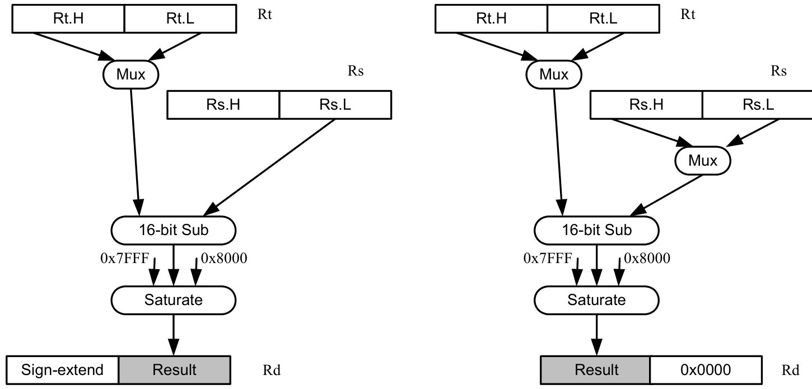

```text
Rt Rt
Rt.H Rt.L Rt.H Rt.L
Mux Rs Mux Rs
Rs.H Rs.L Rs.H Rs.L
Mux
16-bit Sub 16-bit Sub
0x7FFF 0x8000 0x7FFF 0x8000
Saturate Saturate
Sign-extend Result Rd Result 0x0000 Rd
```

| Syntax | Behavior |
|---|---|
| `Rd=sub(Rt.L,Rs.[HL])[:sat]` | `Rd=[sat₁₆](Rt.h[0]-Rs.h[01]);` |
| `Rd=sub(Rt.[HL],Rs.[HL])[:sat]:<<`<br>`16` | `Rd=([sat₁₆](Rt.h[01]-Rs.h[01]))<<16;` |

##### Class: XTYPE (slots 2,3)

##### Notes

- If saturation occurs during execution of this instruction (a result is clamped to either maximum or minimum values), the OVF bit in the status register is set. OVF remains set until explicitly cleared by a transfer to the status register.

##### Intrinsics

|  |  |
|---|---|
| `Rd=sub(Rt.H,Rs.H):<<16` | `Word32 Q6_R_sub_RhRh_s16(Word32 Rt, Word32 Rs)` |
| `Rd=sub(Rt.H,Rs.H):sat:<<1` | `Word32 Q6_R_sub_RhRh_sat_s16(Word32 Rt, Word32` |
| `6` | `Rs)` |
| `Rd=sub(Rt.H,Rs.L):<<16` | `Word32 Q6_R_sub_RhRl_s16(Word32 Rt, Word32 Rs)` |
| `Rd=sub(Rt.H,Rs.L):sat:<<1` | `Word32 Q6_R_sub_RhRl_sat_s16(Word32 Rt, Word32` |
| `6` | `Rs)` |
| `Rd=sub(Rt.L,Rs.H)` | `Word32 Q6_R_sub_RlRh(Word32 Rt, Word32 Rs)` |
| `Rd=sub(Rt.L,Rs.H):<<16` | `Word32 Q6_R_sub_RlRh_s16(Word32 Rt, Word32 Rs)` |
| `Rd=sub(Rt.L,Rs.H):sat` | `Word32 Q6_R_sub_RlRh_sat(Word32 Rt, Word32 Rs)` |
| `Rd=sub(Rt.L,Rs.H):sat:<<1` | `Word32 Q6_R_sub_RlRh_sat_s16(Word32 Rt, Word32` |
| `6` | `Rs)` |
| `Rd=sub(Rt.L,Rs.L)` | `Word32 Q6_R_sub_RlRl(Word32 Rt, Word32 Rs)` |
| `Rd=sub(Rt.L,Rs.L):<<16` | `Word32 Q6_R_sub_RlRl_s16(Word32 Rt, Word32 Rs)` |
| `Rd=sub(Rt.L,Rs.L):sat` | `Word32 Q6_R_sub_RlRl_sat(Word32 Rt, Word32 Rs)` |
| `Rd=sub(Rt.L,Rs.L):sat:<<1` | `Word32 Q6_R_sub_RlRl_sat_s16(Word32 Rt, Word32` |
| `6` | `Rs)` |

##### Encoding

| 31 | 30 | 29 | 28 | 27 | 26 | 25 | 24 | 23 | 22 | 21 | 20 | 19 | 18 | 17 | 16 | 15 | 14 | 13 | 12 | 11 | 10 | 9 | 8 | 7 | 6 | 5 | 4 | 3 | 2 | 1 | 0 |  |
|---|---|---|---|---|---|---|---|---|---|---|---|---|---|---|---|---|---|---|---|---|---|---|---|---|---|---|---|---|---|---|---|---|
| ICLASS | ICLASS | ICLASS | ICLASS | RegType | RegType | RegType | RegType |  |  |  | s5 | s5 | s5 | s5 | s5 | Parse | Parse |  | t5 | t5 | t5 | t5 | t5 | MinOp | MinOp | MinOp | d5 | d5 | d5 | d5 | d5 |  |
| 1 | 1 | 0 | 1 | 0 | 1 | 0 | 1 | 0 | 0 | 1 | s | s | s | s | s | P | P | - | t | t | t | t | t | 0 | 0 | - | d | d | d | d | d | Rd=sub(Rt.L,Rs.L) |
| 1 | 1 | 0 | 1 | 0 | 1 | 0 | 1 | 0 | 0 | 1 | s | s | s | s | s | P | P | - | t | t | t | t | t | 0 | 1 | - | d | d | d | d | d | Rd=sub(Rt.L,Rs.H) |
| 1 | 1 | 0 | 1 | 0 | 1 | 0 | 1 | 0 | 0 | 1 | s | s | s | s | s | P | P | - | t | t | t | t | t | 1 | 0 | - | d | d | d | d | d | Rd=sub(Rt.L,Rs.L):sat |
| 1 | 1 | 0 | 1 | 0 | 1 | 0 | 1 | 0 | 0 | 1 | s | s | s | s | s | P | P | - | t | t | t | t | t | 1 | 1 | - | d | d | d | d | d | Rd=sub(Rt.L,Rs.H):sat |
| 1 | 1 | 0 | 1 | 0 | 1 | 0 | 1 | 0 | 1 | 1 | s | s | s | s | s | P | P | - | t | t | t | t | t | 0 | 0 | 0 | d | d | d | d | d | Rd=sub(Rt.L,Rs.L):<<16 |
| 1 | 1 | 0 | 1 | 0 | 1 | 0 | 1 | 0 | 1 | 1 | s | s | s | s | s | P | P | - | t | t | t | t | t | 0 | 0 | 1 | d | d | d | d | d | Rd=sub(Rt.L,Rs.H):<<16 |
| 1 | 1 | 0 | 1 | 0 | 1 | 0 | 1 | 0 | 1 | 1 | s | s | s | s | s | P | P | - | t | t | t | t | t | 0 | 1 | 0 | d | d | d | d | d | Rd=sub(Rt.H,Rs.L):<<16 |
| 1 | 1 | 0 | 1 | 0 | 1 | 0 | 1 | 0 | 1 | 1 | s | s | s | s | s | P | P | - | t | t | t | t | t | 0 | 1 | 1 | d | d | d | d | d | Rd=sub(Rt.H,Rs.H):<<16 |
| 1 | 1 | 0 | 1 | 0 | 1 | 0 | 1 | 0 | 1 | 1 | s | s | s | s | s | P | P | - | t | t | t | t | t | 1 | 0 | 0 | d | d | d | d | d | Rd=sub(Rt.L,Rs.L):sat:<<16 |
| 1 | 1 | 0 | 1 | 0 | 1 | 0 | 1 | 0 | 1 | 1 | s | s | s | s | s | P | P | - | t | t | t | t | t | 1 | 0 | 1 | d | d | d | d | d | Rd=sub(Rt.L,Rs.H):sat:<<16 |
| 1 | 1 | 0 | 1 | 0 | 1 | 0 | 1 | 0 | 1 | 1 | s | s | s | s | s | P | P | - | t | t | t | t | t | 1 | 1 | 0 | d | d | d | d | d | Rd=sub(Rt.H,Rs.L):sat:<<16 |
| 1 | 1 | 0 | 1 | 0 | 1 | 0 | 1 | 0 | 1 | 1 | s | s | s | s | s | P | P | - | t | t | t | t | t | 1 | 1 | 1 | d | d | d | d | d | Rd=sub(Rt.H,Rs.H):sat:<<16 |

| Field name | Description |
|---|---|
| `RegType` | Register type |
| `MinOp` | Minor opcode |
| `ICLASS` | Instruction class |
| `Parse` | Packet/loop parse bits |
| `d5` | Field to encode register d |
| `s5` | Field to encode register s |
| `t5` | Field to encode register t |

#### Sign extend word to doubleword

Sign-extend a 32-bit word to a 64-bit doubleword.

| Syntax | Behavior |
|---|---|
| `Rdd=sxtw(Rs)` | `Rdd = sxt<sub>32->64</sub>(Rs);` |

##### Class: XTYPE (slots 2,3)

##### Intrinsics

```
Rdd=sxtw(Rs)Word64 Q6_P_sxtw_R(Word32 Rs)
```

##### Encoding

| 31 | 30 | 29 | 28 | 27 | 26 | 25 | 24 | 23 | 22 | 21 | 20 | 19 | 18 | 17 | 16 | 15 | 14 | 13 | 12 | 11 | 10 | 9 | 8 | 7 | 6 | 5 | 4 | 3 | 2 | 1 | 0 |  |
|---|---|---|---|---|---|---|---|---|---|---|---|---|---|---|---|---|---|---|---|---|---|---|---|---|---|---|---|---|---|---|---|---|
| ICLASS | ICLASS | ICLASS | ICLASS | RegType | RegType | RegType | RegType | MajOp | MajOp |  | s5 | s5 | s5 | s5 | s5 | Parse | Parse |  |  |  |  |  |  | MinOp | MinOp | MinOp | d5 | d5 | d5 | d5 | d5 |  |
| 1 | 0 | 0 | 0 | 0 | 1 | 0 | 0 | 0 | 1 | - | s | s | s | s | s | P | P | - | - | - | - | - | - | 0 | 0 | - | d | d | d | d | d | Rdd=sxtw(Rs) |

| Field name | Description |
|---|---|
| `ICLASS` | Instruction class |
| `Parse` | Packet/loop parse bits |
| `d5` | Field to encode register d |
| `s5` | Field to encode register s |
| `MajOp` | Major opcode |
| `MinOp` | Minor opcode |
| `RegType` | Register type |

#### Vector absolute value halfwords

Take the absolute value of each of the four halfwords in the 64-bit source vector Rss. Place the result in Rdd.

Saturation is optionally available.

| Syntax | Behavior |
|---|---|
| `Rdd=vabsh(Rss)` | `for (i=0;i<4;i++) {`<br>`Rdd.h[i]=ABS(Rss.h[i]);`<br>`}` |
| `Rdd=vabsh(Rss):sat` | `for (i=0;i<4;i++) {`<br>`Rdd.h[i]=sat₁₆(ABS(Rss.h[i]));`<br>`}` |

##### Class: XTYPE (slots 2,3)

##### Notes

- If saturation occurs during execution of this instruction (a result is clamped to either maximum or minimum values), the OVF bit in the status register is set. OVF remains set until explicitly cleared by a transfer to the status register.

##### Intrinsics

|  |  |
|---|---|
| `Rdd=vabsh(Rss)` | `Word64 Q6_P_vabsh_P(Word64 Rss)` |
| `Rdd=vabsh(Rss):sat` | `Word64 Q6_P_vabsh_P_sat(Word64 Rss)` |

##### Encoding

| 31 | 30 | 29 | 28 | 27 | 26 | 25 | 24 | 23 | 22 | 21 | 20 | 19 | 18 | 17 | 16 | 15 | 14 | 13 | 12 | 11 | 10 | 9 | 8 | 7 | 6 | 5 | 4 | 3 | 2 | 1 | 0 |  |
|---|---|---|---|---|---|---|---|---|---|---|---|---|---|---|---|---|---|---|---|---|---|---|---|---|---|---|---|---|---|---|---|---|
| ICLASS | ICLASS | ICLASS | ICLASS | RegType | RegType | RegType | RegType | MajOp | MajOp |  | s5 | s5 | s5 | s5 | s5 | Parse | Parse |  |  |  |  |  |  | MinOp | MinOp | MinOp | d5 | d5 | d5 | d5 | d5 |  |
| 1 | 0 | 0 | 0 | 0 | 0 | 0 | 0 | 0 | 1 | 0 | s | s | s | s | s | P | P | - | - | - | - | - | - | 1 | 0 | 0 | d | d | d | d | d | Rdd=vabsh(Rss) |
| 1 | 0 | 0 | 0 | 0 | 0 | 0 | 0 | 0 | 1 | 0 | s | s | s | s | s | P | P | - | - | - | - | - | - | 1 | 0 | 1 | d | d | d | d | d | Rdd=vabsh(Rss):sat |

| Field name | Description |
|---|---|
| `ICLASS` | Instruction class |
| `Parse` | Packet/loop parse bits |
| `d5` | Field to encode register d |
| `s5` | Field to encode register s |
| `MajOp` | Major opcode |
| `MinOp` | Minor opcode |
| `RegType` | Register type |

#### Vector absolute value words

Take the absolute value of each of the two words in the 64-bit source vector Rss. Place the result in Rdd.

Saturation is optionally available.

| Syntax | Behavior |
|---|---|
| `Rdd=vabsw(Rss)` | `for (i=0;i<2;i++) {`<br>`Rdd.w[i]=ABS(Rss.w[i]);`<br>`}` |
| `Rdd=vabsw(Rss):sat` | `for (i=0;i<2;i++) {`<br>`Rdd.w[i]=sat₃₂(ABS(Rss.w[i]));`<br>`}` |

##### Class: XTYPE (slots 2,3)

##### Notes

- If saturation occurs during execution of this instruction (a result is clamped to either maximum or minimum values), the OVF bit in the status register is set. OVF remains set until explicitly cleared by a transfer to the status register.

##### Intrinsics

|  |  |
|---|---|
| `Rdd=vabsw(Rss)` | `Word64 Q6_P_vabsw_P(Word64 Rss)` |
| `Rdd=vabsw(Rss):sat` | `Word64 Q6_P_vabsw_P_sat(Word64 Rss)` |

##### Encoding

| 31 | 30 | 29 | 28 | 27 | 26 | 25 | 24 | 23 | 22 | 21 | 20 | 19 | 18 | 17 | 16 | 15 | 14 | 13 | 12 | 11 | 10 | 9 | 8 | 7 | 6 | 5 | 4 | 3 | 2 | 1 | 0 |  |
|---|---|---|---|---|---|---|---|---|---|---|---|---|---|---|---|---|---|---|---|---|---|---|---|---|---|---|---|---|---|---|---|---|
| ICLASS | ICLASS | ICLASS | ICLASS | RegType | RegType | RegType | RegType | MajOp | MajOp |  | s5 | s5 | s5 | s5 | s5 | Parse | Parse |  |  |  |  |  |  | MinOp | MinOp | MinOp | d5 | d5 | d5 | d5 | d5 |  |
| 1 | 0 | 0 | 0 | 0 | 0 | 0 | 0 | 0 | 1 | 0 | s | s | s | s | s | P | P | - | - | - | - | - | - | 1 | 1 | 0 | d | d | d | d | d | Rdd=vabsw(Rss) |
| 1 | 0 | 0 | 0 | 0 | 0 | 0 | 0 | 0 | 1 | 0 | s | s | s | s | s | P | P | - | - | - | - | - | - | 1 | 1 | 1 | d | d | d | d | d | Rdd=vabsw(Rss):sat |

| Field name | Description |
|---|---|
| `ICLASS` | Instruction class |
| `Parse` | Packet/loop parse bits |
| `d5` | Field to encode register d |
| `s5` | Field to encode register s |
| `MajOp` | Major opcode |
| `MinOp` | Minor opcode |
| `RegType` | Register type |

#### Vector absolute difference bytes

For each element in the source vector Rss, subtract the corresponding element in source vector Rtt. Take the absolute value of the results, and store into Rdd.

| Syntax | Behavior |
|---|---|
| `Rdd=vabsdiffb(Rtt,Rss)` | `for (i=0;i<8;i++) {`<br>`Rdd.b[i]=ABS(Rtt.b[i] - Rss.b[i]);`<br>`}` |
| `Rdd=vabsdiffub(Rtt,Rss)` | `for (i=0;i<8;i++) {`<br>`Rdd.b[i]=ABS(Rtt.ub[i] - Rss.ub[i]);`<br>`}` |

##### Class: XTYPE (slots 2,3)

##### Intrinsics

|  |  |
|---|---|
| `Rdd=vabsdiffb(Rtt,Rss)` | `Word64 Q6_P_vabsdiffb_PP(Word64 Rtt, Word64 Rss)` |
| `Rdd=vabsdiffub(Rtt,Rss)` | `Word64 Q6_P_vabsdiffub_PP(Word64 Rtt, Word64 Rss)` |

##### Encoding

| 31 | 30 | 29 | 28 | 27 | 26 | 25 | 24 | 23 | 22 | 21 | 20 | 19 | 18 | 17 | 16 | 15 | 14 | 13 | 12 | 11 | 10 | 9 | 8 | 7 | 6 | 5 | 4 | 3 | 2 | 1 | 0 |  |
|---|---|---|---|---|---|---|---|---|---|---|---|---|---|---|---|---|---|---|---|---|---|---|---|---|---|---|---|---|---|---|---|---|
| ICLASS | ICLASS | ICLASS | ICLASS | RegType | RegType | RegType | RegType | MajOp | MajOp | MajOp | s5 | s5 | s5 | s5 | s5 | Parse | Parse |  | t5 | t5 | t5 | t5 | t5 | MinOp | MinOp | MinOp | d5 | d5 | d5 | d5 | d5 |  |
| 1 | 1 | 1 | 0 | 1 | 0 | 0 | 0 | 1 | 0 | 1 | s | s | s | s | s | P | P | 0 | t | t | t | t | t | 0 | 0 | 0 | d | d | d | d | d | Rdd=vabsdiffub(Rtt,Rss) |
| 1 | 1 | 1 | 0 | 1 | 0 | 0 | 0 | 1 | 1 | 1 | s | s | s | s | s | P | P | 0 | t | t | t | t | t | 0 | 0 | 0 | d | d | d | d | d | Rdd=vabsdiffb(Rtt,Rss) |

| Field name | Description |
|---|---|
| `ICLASS` | Instruction class |
| `MajOp` | Major opcode |
| `MinOp` | Minor opcode |
| `RegType` | Register type |
| `Parse` | Packet/loop parse bits |
| `d5` | Field to encode register d |
| `s5` | Field to encode register s |
| `t5` | Field to encode register t |

#### Vector absolute difference halfwords

For each element in the source vector Rss, subtract the corresponding element in source vector Rtt. Take the absolute value of the results, and store into Rdd.

| Syntax | Behavior |
|---|---|
| `Rdd=vabsdiffh(Rtt,Rss)` | `for (i=0;i<4;i++) {`<br>`Rdd.h[i]=ABS(Rtt.h[i] - Rss.h[i]);`<br>`}` |

##### Class: XTYPE (slots 2,3)

##### Intrinsics

```
Rdd=vabsdiffh(Rtt,Rss)Word64 Q6_P_vabsdiffh_PP(Word64 Rtt, Word64
                             Rss)
```

##### Encoding

| 31 | 30 | 29 | 28 | 27 | 26 | 25 | 24 | 23 | 22 | 21 | 20 | 19 | 18 | 17 | 16 | 15 | 14 | 13 | 12 | 11 | 10 | 9 | 8 | 7 | 6 | 5 | 4 | 3 | 2 | 1 | 0 |  |
|---|---|---|---|---|---|---|---|---|---|---|---|---|---|---|---|---|---|---|---|---|---|---|---|---|---|---|---|---|---|---|---|---|
| ICLASS | ICLASS | ICLASS | ICLASS | RegType | RegType | RegType | RegType | MajOp | MajOp | MajOp | s5 | s5 | s5 | s5 | s5 | Parse | Parse |  | t5 | t5 | t5 | t5 | t5 | MinOp | MinOp | MinOp | d5 | d5 | d5 | d5 | d5 |  |
| 1 | 1 | 1 | 0 | 1 | 0 | 0 | 0 | 0 | 1 | 1 | s | s | s | s | s | P | P | 0 | t | t | t | t | t | 0 | 0 | 0 | d | d | d | d | d | Rdd=vabsdiffh(Rtt,Rss) |

| Field name | Description |
|---|---|
| `ICLASS` | Instruction class |
| `MajOp` | Major opcode |
| `MinOp` | Minor opcode |
| `RegType` | Register type |
| `Parse` | Packet/loop parse bits |
| `d5` | Field to encode register d |
| `s5` | Field to encode register s |
| `t5` | Field to encode register t |

#### Vector absolute difference words

For each element in the source vector Rss, subtract the corresponding element in source vector Rtt. Take the absolute value of the results, and store into Rdd.

| Syntax | Behavior |
|---|---|
| `Rdd=vabsdiffw(Rtt,Rss)` | `for (i=0;i<2;i++) {`<br>`Rdd.w[i]=ABS(Rtt.w[i] - Rss.w[i]);`<br>`}` |

##### Class: XTYPE (slots 2,3)

##### Intrinsics

```
Rdd=vabsdiffw(Rtt,Rss)Word64 Q6_P_vabsdiffw_PP(Word64 Rtt, Word64
                             Rss)
```

##### Encoding

| 31 | 30 | 29 | 28 | 27 | 26 | 25 | 24 | 23 | 22 | 21 | 20 | 19 | 18 | 17 | 16 | 15 | 14 | 13 | 12 | 11 | 10 | 9 | 8 | 7 | 6 | 5 | 4 | 3 | 2 | 1 | 0 |  |
|---|---|---|---|---|---|---|---|---|---|---|---|---|---|---|---|---|---|---|---|---|---|---|---|---|---|---|---|---|---|---|---|---|
| ICLASS | ICLASS | ICLASS | ICLASS | RegType | RegType | RegType | RegType | MajOp | MajOp | MajOp | s5 | s5 | s5 | s5 | s5 | Parse | Parse |  | t5 | t5 | t5 | t5 | t5 | MinOp | MinOp | MinOp | d5 | d5 | d5 | d5 | d5 |  |
| 1 | 1 | 1 | 0 | 1 | 0 | 0 | 0 | 0 | 0 | 1 | s | s | s | s | s | P | P | 0 | t | t | t | t | t | 0 | 0 | 0 | d | d | d | d | d | Rdd=vabsdiffw(Rtt,Rss) |

| Field name | Description |
|---|---|
| `ICLASS` | Instruction class |
| `MajOp` | Major opcode |
| `MinOp` | Minor opcode |
| `RegType` | Register type |
| `Parse` | Packet/loop parse bits |
| `d5` | Field to encode register d |
| `s5` | Field to encode register s |
| `t5` | Field to encode register t |

#### Vector add compare and select maximum bytes

Add each byte element in Rxx and Rtt, and compare the resulting sums with the corresponding differences between Rss and Rtt. Store the maximum value of each compare in Rxx, and set the corresponding bits in a predicate destination to '1' if the compare result is greater, '0' if not. Each sum and difference is saturated to 8 bits before the compare, and the compare operation is a signed byte compare.

|  |  |  |  |
|---|---|---|---|
| Rxx.H3 | Rxx.H2 | Rxx.H1 | Rxx.H0 |

Rxx

|  |  |  |  |  |  |  |  |  |  |  |  |  |  |  |
|---|---|---|---|---|---|---|---|---|---|---|---|---|---|---|
|  | Rss.H3 |  |  |  |  |  |  |  |  |  |  |  |  |  |
|  |  | Rss.H3 |  |  |  | Rss.H2 | Rss.H2 |  | Rss.H1 |  |  |  | Rss.H0 | Rss.H0 |
|  |  |  |  |  |  |  |  |  |  |  |  |  |  |  |
|  | Rtt.H3 | Rtt.H3 |  |  | Rtt.H2 | Rtt.H2 |  | Rtt.H1 | Rtt.H1 |  |  | Rtt.H0 | Rtt.H0 |  |

Rss

Rtt

⁺ -⁺ -⁺ -₊ -

Rxx,Pd=vacsh(Rss,Rtt)

|  |  |
|---|---|
| sat16 | sat16 |

sat16 sat16 sat16 sat16 sat16 sat16 sat16

|  |  |
|---|---|
| sat16 | sat16 |

sat16 sat16 sat16 sat16 sat16 sat16 sat16

|  |  |
|---|---|
| sat16 | sat16 |

sat16 sat16 sat16 sat16 sat16 sat16 sat16

|  |  |
|---|---|
| sat16 | sat16 |

sat16 sat16 sat16 sat16 sat16 sat16 sat16

|  |  |
|---|---|
| sat16 |  |

sat16 sat16 sat16 sat16 sat16 sat16 sat16

|  |  |
|---|---|
| sat16 | sat16 |

sat16 sat16 sat16 sat16 sat16 sat16 sat16

|  |  |
|---|---|
| sat16 | sat16 |

sat16 sat16 sat16 sat16 sat16 sat16 sat16

|  |  |
|---|---|
| sat16 | sat16 |

sat16 sat16 sat16 sat16 sat16 sat16 sat16

>

>

|  |  |
|---|---|
| 1 | 0 |

>

> 1bit

|  |  |
|---|---|
| 1 | 0 |

16bits

|  |  |
|---|---|
| 1 | 0 |

|  |  |
|---|---|
| 1 | 0 |

|  |  |  |  |
|---|---|---|---|
| Rxx.H3 | Rxx.H2 | Rxx.H1 | Rxx.H0 |

Pd

| Syntax | Behavior |
|---|---|
|  |  |

##### Class: N/A

#### Vector add compare and select maximum halfwords

Add each halfword element in Rxx and Rtt, and compare the resulting sums with the corresponding differences between Rss and Rtt. Store the maximum value of each compare in Rxx, and set the corresponding bits in a predicate destination to '11' if the compare result is greater, '00' if not. Each sum and difference is saturated to 16 bits before the compare, and the compare operation is a signed halfword compare.

|  |  |  |  |
|---|---|---|---|
| Rxx.H3 | Rxx.H2 | Rxx.H1 | Rxx.H0 |

Rxx

|  |  |  |  |  |  |  |  |  |  |  |  |  |  |  |
|---|---|---|---|---|---|---|---|---|---|---|---|---|---|---|
|  | Rss.H3 |  |  |  |  |  |  |  |  |  |  |  |  |  |
|  |  | Rss.H3 |  |  |  | Rss.H2 | Rss.H2 |  | Rss.H1 |  |  |  | Rss.H0 | Rss.H0 |
|  |  |  |  |  |  |  |  |  |  |  |  |  |  |  |
|  | Rtt.H3 | Rtt.H3 |  |  | Rtt.H2 | Rtt.H2 |  | Rtt.H1 | Rtt.H1 |  |  | Rtt.H0 | Rtt.H0 |  |

Rss

Rtt

⁺ -⁺ -⁺ -₊ -

Rxx,Pd=vacsh(Rss,Rtt)

|  |  |
|---|---|
| sat16 | sat16 |

sat16 sat16 sat16 sat16 sat16 sat16 sat16

|  |  |
|---|---|
| sat16 | sat16 |

sat16 sat16 sat16 sat16 sat16 sat16 sat16

|  |  |
|---|---|
| sat16 | sat16 |

sat16 sat16 sat16 sat16 sat16 sat16 sat16

|  |  |
|---|---|
| sat16 | sat16 |

sat16 sat16 sat16 sat16 sat16 sat16 sat16

|  |  |
|---|---|
| sat16 |  |

sat16 sat16 sat16 sat16 sat16 sat16 sat16

|  |  |
|---|---|
| sat16 | sat16 |

sat16 sat16 sat16 sat16 sat16 sat16 sat16

|  |  |
|---|---|
| sat16 | sat16 |

sat16 sat16 sat16 sat16 sat16 sat16 sat16

|  |  |
|---|---|
| sat16 | sat16 |

sat16 sat16 sat16 sat16 sat16 sat16 sat16

>

>

|  |  |
|---|---|
| 1 | 0 |

>

> 1bit

|  |  |
|---|---|
| 1 | 0 |

16bits

|  |  |
|---|---|
| 1 | 0 |

|  |  |
|---|---|
| 1 | 0 |

|  |  |  |  |
|---|---|---|---|
| Rxx.H3 | Rxx.H2 | Rxx.H1 | Rxx.H0 |

Pd

| Syntax | Behavior |
|---|---|
| `Rxx,Pe=vacsh(Rss,Rtt)` | `for (i = 0; i < 4; i++) {`<br>`xv = (int) Rxx.h[i];`<br>`sv = (int) Rss.h[i];`<br>`tv = (int) Rtt.h[i];`<br>`xv = xv + tv;`<br>`sv = sv - tv;`<br>`Pe.i*2 = (xv > sv);`<br>`Pe.i*2+1 = (xv > sv);`<br>`Rxx.h[i]=sat₁₆(max(xv,sv));`<br>`}` |

##### Class: XTYPE (slots 2,3)

##### Notes

- The predicate generated by this instruction cannot be used as a .new predicate, nor can it be automatically AND’d with another predicate.
- If saturation occurs during execution of this instruction (a result is clamped to either maximum or minimum values), the OVF bit in the status register is set. OVF remains set until explicitly cleared by a transfer to the status register.

##### Encoding

| 31 | 30 | 29 | 28 | 27 | 26 | 25 | 24 | 23 | 22 | 21 | 20 | 19 | 18 | 17 | 16 | 15 | 14 | 13 | 12 | 11 | 10 | 9 | 8 | 7 | 6 | 5 | 4 | 3 | 2 | 1 | 0 |  |
|---|---|---|---|---|---|---|---|---|---|---|---|---|---|---|---|---|---|---|---|---|---|---|---|---|---|---|---|---|---|---|---|---|
| ICLASS | ICLASS | ICLASS | ICLASS | RegType | RegType | RegType | RegType | MajOp | MajOp | MajOp | s5 | s5 | s5 | s5 | s5 | Parse | Parse |  | t5 | t5 | t5 | t5 | t5 |  | e2 | e2 | x5 | x5 | x5 | x5 | x5 |  |
| 1 | 1 | 1 | 0 | 1 | 0 | 1 | 0 | 1 | 0 | 1 | s | s | s | s | s | P | P | 0 | t | t | t | t | t | 0 | e | e | x | x | x | x | x | Rxx,Pe=vacsh(Rss,Rtt) |

| Field name | Description |
|---|---|
| `ICLASS` | Instruction class |
| `MajOp` | Major opcode |
| `MinOp` | Minor opcode |
| `RegType` | Register type |
| `Parse` | Packet/loop parse bits |
| `e2` | Field to encode register e |
| `s5` | Field to encode register s |
| `t5` | Field to encode register t |
| `x5` | Field to encode register x |

#### Vector add halfwords

Add each of the four halfwords in 64-bit vector Rss to the corresponding halfword in vector Rtt.

Optionally saturate each 16-bit addition to either a signed or unsigned 16-bit value. Applying saturation to the vaddh instruction clamps the result to the signed range 0x8000 to 0x7fff, whereas applying saturation to the vadduh instruction ensures that the unsigned result falls within the range 0 to 0xffff. When saturation is not needed, use the vaddh form.

For the 32-bit version of this vector operation, see the ALU32 instructions.

| Syntax | Behavior |
|---|---|
| `Rdd=vaddh(Rss,Rtt)[:sat]` | `for (i=0;i<4;i++) {`<br>`Rdd.h[i]=[sat₁₆](Rss.h[i]+Rtt.h[i]);`<br>`}` |
| `Rdd=vadduh(Rss,Rtt):sat` | `for (i=0;i<4;i++) {`<br>`Rdd.h[i]=usat₁₆(Rss.uh[i]+Rtt.uh[i]);`<br>`}` |

##### Class: XTYPE (slots 2,3)

##### Notes

- If saturation occurs during execution of this instruction (a result is clamped to either maximum or minimum values), the OVF bit in the status register is set. OVF remains set until explicitly cleared by a transfer to the status register.

##### Intrinsics

|  |  |
|---|---|
| `Rdd=vaddh(Rss,Rtt)` | `Word64 Q6_P_vaddh_PP(Word64 Rss, Word64 Rtt)` |
| `Rdd=vaddh(Rss,Rtt):sat` | `Word64 Q6_P_vaddh_PP_sat(Word64 Rss, Word64 Rtt)` |
| `Rdd=vadduh(Rss,Rtt):sat` | `Word64 Q6_P_vadduh_PP_sat(Word64 Rss, Word64 Rtt)` |

##### Encoding

| 31 | 30 | 29 | 28 | 27 | 26 | 25 | 24 | 23 | 22 | 21 | 20 | 19 | 18 | 17 | 16 | 15 | 14 | 13 | 12 | 11 | 10 | 9 | 8 | 7 | 6 | 5 | 4 | 3 | 2 | 1 | 0 |  |
|---|---|---|---|---|---|---|---|---|---|---|---|---|---|---|---|---|---|---|---|---|---|---|---|---|---|---|---|---|---|---|---|---|
| ICLASS | ICLASS | ICLASS | ICLASS | RegType | RegType | RegType | RegType |  |  |  | s5 | s5 | s5 | s5 | s5 | Parse | Parse |  | t5 | t5 | t5 | t5 | t5 | MinOp | MinOp | MinOp | d5 | d5 | d5 | d5 | d5 |  |
| 1 | 1 | 0 | 1 | 0 | 0 | 1 | 1 | 0 | 0 | 0 | s | s | s | s | s | P | P | - | t | t | t | t | t | 0 | 1 | 0 | d | d | d | d | d | Rdd=vaddh(Rss,Rtt) |
| 1 | 1 | 0 | 1 | 0 | 0 | 1 | 1 | 0 | 0 | 0 | s | s | s | s | s | P | P | - | t | t | t | t | t | 0 | 1 | 1 | d | d | d | d | d | Rdd=vaddh(Rss,Rtt):sat |
| 1 | 1 | 0 | 1 | 0 | 0 | 1 | 1 | 0 | 0 | 0 | s | s | s | s | s | P | P | - | t | t | t | t | t | 1 | 0 | 0 | d | d | d | d | d | Rdd=vadduh(Rss,Rtt):sat |

| Field name | Description |
|---|---|
| `RegType` | Register type |
| `MinOp` | Minor opcode |
| `ICLASS` | Instruction class |
| `Parse` | Packet/loop parse bits |
| Field name | Description |
| `d5` | Field to encode register d |
| `s5` | Field to encode register s |
| `t5` | Field to encode register t |

#### Vector add halfwords with saturate and pack to unsigned bytes

Add the four 16-bit halfwords of Rss to the four 16-bit halfwords of Rtt. The results are saturated to unsigned 8-bits and packed in destination register Rd.

| Syntax | Behavior |
|---|---|
| `Rd=vaddhub(Rss,Rtt):sat` | `for (i=0;i<4;i++) {`<br>`Rd.b[i]=usat₈(Rss.h[i]+Rtt.h[i]);`<br>`}` |

##### Class: XTYPE (slots 2,3)

##### Notes

- If saturation occurs during execution of this instruction (a result is clamped to either maximum or minimum values), the OVF bit in the status register is set. OVF remains set until explicitly cleared by a transfer to the status register.

##### Intrinsics

```
Rd=vaddhub(Rss,Rtt):satWord32 Q6_R_vaddhub_PP_sat(Word64 Rss, Word64
                         Rtt)
```

##### Encoding

| 31 | 30 | 29 | 28 | 27 | 26 | 25 | 24 | 23 | 22 | 21 | 20 | 19 | 18 | 17 | 16 | 15 | 14 | 13 | 12 | 11 | 10 | 9 | 8 | 7 | 6 | 5 | 4 | 3 | 2 | 1 | 0 |  |
|---|---|---|---|---|---|---|---|---|---|---|---|---|---|---|---|---|---|---|---|---|---|---|---|---|---|---|---|---|---|---|---|---|
| ICLASS | ICLASS | ICLASS | ICLASS | RegType | RegType | RegType | RegType | Maj | Maj |  | s5 | s5 | s5 | s5 | s5 | Parse | Parse |  | t5 | t5 | t5 | t5 | t5 | Min | Min |  | d5 | d5 | d5 | d5 | d5 |  |
| 1 | 1 | 0 | 0 | 0 | 0 | 0 | 1 | 0 | 1 | - | s | s | s | s | s | P | P | - | t | t | t | t | t | 0 | 0 | 1 | d | d | d | d | d | Rd=vaddhub(Rss,Rtt):sat |

| Field name | Description |
|---|---|
| `ICLASS` | Instruction class |
| `Parse` | Packet/loop parse bits |
| `d5` | Field to encode register d |
| `s5` | Field to encode register s |
| `t5` | Field to encode register t |
| `Maj` | Major opcode |
| `Min` | Minor opcode |
| `RegType` | Register type |

#### Vector reduce add unsigned bytes

For each byte in the source vector Rss, add the corresponding byte in the source vector Rtt. Add the four upper intermediate results and optionally the upper word of the destination. Add the four lower results and optionally the lower word of the destination.

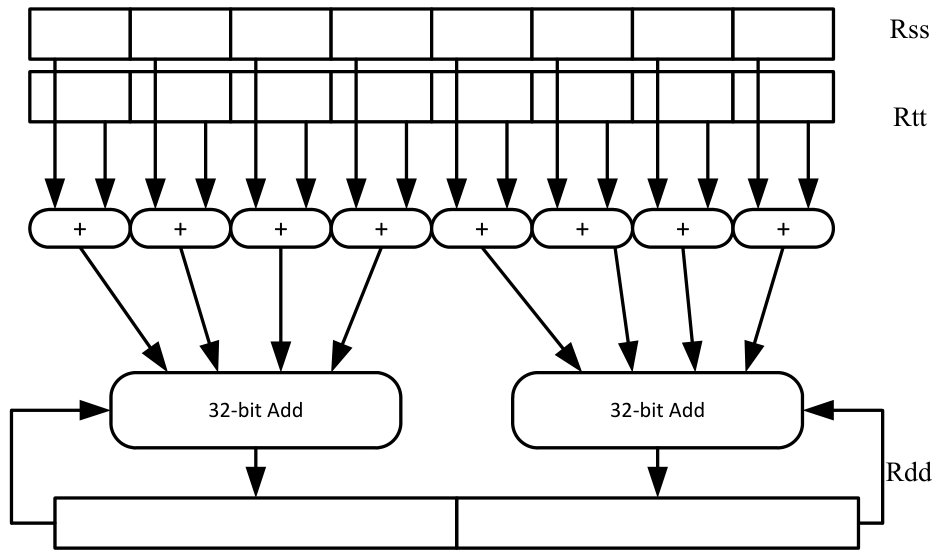

```text
Rss
Rtt
+ + + + + + + +
32-bit Add 32-bit Add
Rdd
```

| Syntax | Behavior |
|---|---|
| `Rdd=vraddub(Rss,Rtt)` | `Rdd = 0;`<br>`for (i=0;i<4;i++) {`<br>`Rdd.w[0]=(Rdd.w[0] + (Rss.ub[i]+Rtt.ub[i]));`<br>`}`<br>`for (i=4;i<8;i++) {`<br>`Rdd.w[1]=(Rdd.w[1] + (Rss.ub[i]+Rtt.ub[i]));`<br>`}` |
| `Rxx+=vraddub(Rss,Rtt)` | `for (i = 0; i < 4; i++) {`<br>`Rxx.w[0]=(Rxx.w[0] + (Rss.ub[i]+Rtt.ub[i]));`<br>`}`<br>`for (i = 4; i < 8; i++) {`<br>`Rxx.w[1]=(Rxx.w[1] + (Rss.ub[i]+Rtt.ub[i]));`<br>`}` |

##### Class: XTYPE (slots 2,3)

##### Intrinsics

|  |  |
|---|---|
| `Rdd=vraddub(Rss,Rtt)` | `Word64 Q6_P_vraddub_PP(Word64 Rss, Word64 Rtt)` |
| `Rxx+=vraddub(Rss,Rtt)` | `Word64 Q6_P_vraddubacc_PP(Word64 Rxx, Word64 Rss, Word64 Rtt)` |

##### Encoding

| 31 | 30 | 29 | 28 | 27 | 26 | 25 | 24 | 23 | 22 | 21 | 20 | 19 | 18 | 17 | 16 | 15 | 14 | 13 | 12 | 11 | 10 | 9 | 8 | 7 | 6 | 5 | 4 | 3 | 2 | 1 | 0 |  |
|---|---|---|---|---|---|---|---|---|---|---|---|---|---|---|---|---|---|---|---|---|---|---|---|---|---|---|---|---|---|---|---|---|
| ICLASS | ICLASS | ICLASS | ICLASS | RegType | RegType | RegType | RegType | MajOp | MajOp | MajOp | s5 | s5 | s5 | s5 | s5 | Parse | Parse |  | t5 | t5 | t5 | t5 | t5 | MinOp | MinOp | MinOp | d5 | d5 | d5 | d5 | d5 |  |
| 1 | 1 | 1 | 0 | 1 | 0 | 0 | 0 | 0 | 1 | 0 | s | s | s | s | s | P | P | 0 | t | t | t | t | t | 0 | 0 | 1 | d | d | d | d | d | Rdd=vraddub(Rss,Rtt) |
| ICLASS | ICLASS | ICLASS | ICLASS | RegType | RegType | RegType | RegType | MajOp | MajOp | MajOp | s5 | s5 | s5 | s5 | s5 | Parse | Parse |  | t5 | t5 | t5 | t5 | t5 | MinOp | MinOp | MinOp | x5 | x5 | x5 | x5 | x5 |  |
| 1 | 1 | 1 | 0 | 1 | 0 | 1 | 0 | 0 | 1 | 0 | s | s | s | s | s | P | P | 0 | t | t | t | t | t | 0 | 0 | 1 | x | x | x | x | x | Rxx+=vraddub(Rss,Rtt) |

| Field name | Description |
|---|---|
| `ICLASS` | Instruction class |
| `MajOp` | Major opcode |
| `MinOp` | Minor opcode |
| `RegType` | Register type |
| `Parse` | Packet/loop parse bits |
| `d5` | Field to encode register d |
| `s5` | Field to encode register s |
| `t5` | Field to encode register t |
| `x5` | Field to encode register x |

#### Vector reduce add halfwords

For each halfword in the source vector Rss, add the corresponding halfword in the source vector Rtt. Add these intermediate results together, and place the result in Rd.

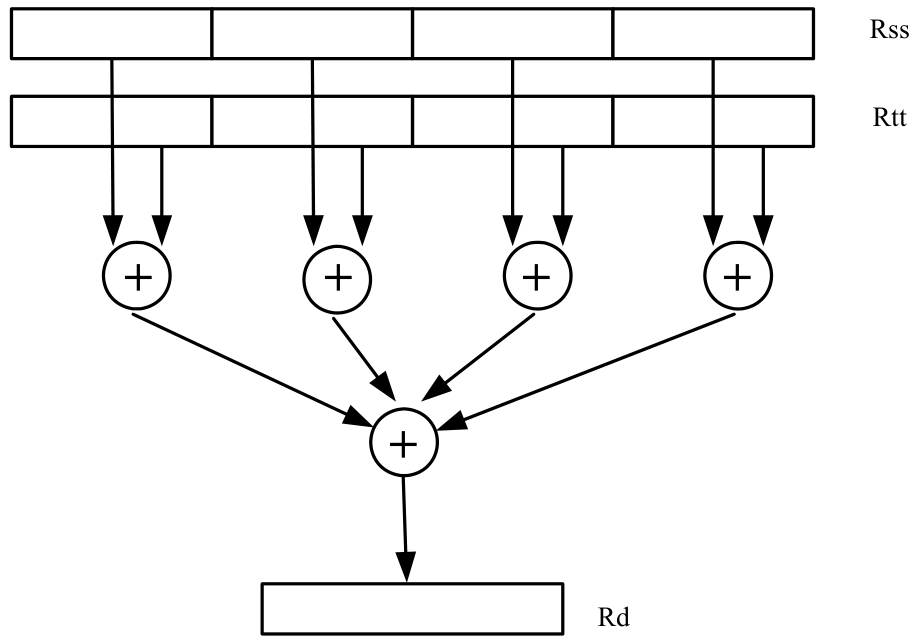

```text
Rss
Rtt
+ + + +
+
Rd
```

| Syntax | Behavior |
|---|---|
| `Rd=vraddh(Rss,Rtt)` | `Rd = 0;`<br>`for (i=0;i<4;i++) {`<br>`Rd += (Rss.h[i]+Rtt.h[i]);`<br>`}` |
| `Rd=vradduh(Rss,Rtt)` | `Rd = 0;`<br>`for (i=0;i<4;i++) {`<br>`Rd += (Rss.uh[i]+Rtt.uh[i]);`<br>`}` |

##### Class: XTYPE (slots 2,3)

##### Intrinsics

|  |  |
|---|---|
| `Rd=vraddh(Rss,Rtt)` | `Word32 Q6_R_vraddh_PP(Word64 Rss, Word64 Rtt)` |
| `Rd=vradduh(Rss,Rtt)` | `Word32 Q6_R_vradduh_PP(Word64 Rss, Word64 Rtt)` |

##### Encoding

| 31 | 30 | 29 | 28 | 27 | 26 | 25 | 24 | 23 | 22 | 21 | 20 | 19 | 18 | 17 | 16 | 15 | 14 | 13 | 12 | 11 | 10 | 9 | 8 | 7 | 6 | 5 | 4 | 3 | 2 | 1 | 0 |  |
|---|---|---|---|---|---|---|---|---|---|---|---|---|---|---|---|---|---|---|---|---|---|---|---|---|---|---|---|---|---|---|---|---|
| ICLASS | ICLASS | ICLASS | ICLASS | RegType | RegType | RegType | RegType | MajOp | MajOp | MajOp | s5 | s5 | s5 | s5 | s5 | Parse | Parse |  | t5 | t5 | t5 | t5 | t5 | MinOp | MinOp | MinOp | d5 | d5 | d5 | d5 | d5 |  |
| 1 | 1 | 1 | 0 | 1 | 0 | 0 | 1 | 0 | - | - | s | s | s | s | s | P | P | 0 | t | t | t | t | t | - | 0 | 1 | d | d | d | d | d | Rd=vradduh(Rss,Rtt) |
| 1 | 1 | 1 | 0 | 1 | 0 | 0 | 1 | 0 | - | 1 | s | s | s | s | s | P | P | 0 | t | t | t | t | t | 1 | 1 | 1 | d | d | d | d | d | Rd=vraddh(Rss,Rtt) |

| Field name | Description |
|---|---|
| `ICLASS` | Instruction class |
| `MajOp` | Major opcode |
| `MinOp` | Minor opcode |
| `RegType` | Register type |
| `Parse` | Packet/loop parse bits |
| `d5` | Field to encode register d |
| `s5` | Field to encode register s |
| `t5` | Field to encode register t |

#### Vector add bytes

Add each of the eight bytes in 64-bit vector Rss to the corresponding byte in vector Rtt. Optionally, saturate each 8-bit addition to an unsigned value between 0 and 255. The eight results are stored in destination register Rdd.

| Syntax | Behavior |
|---|---|
| `Rdd=vaddb(Rss,Rtt)` | `Assembler mapped to: "Rdd=vaddub(Rss,Rtt)"` |
| `Rdd=vaddub(Rss,Rtt)[:sat]` | `for (i = 0; i < 8; i++) {`<br>`Rdd.b[i]=[usat₈](Rss.ub[i]+Rtt.ub[i]);`<br>`}` |

##### Class: XTYPE (slots 2,3)

##### Notes

- If saturation occurs during execution of this instruction (a result is clamped to either maximum or minimum values), the OVF bit in the status register is set. OVF remains set until explicitly cleared by a transfer to the status register.

##### Intrinsics

|  |  |
|---|---|
| `Rdd=vaddb(Rss,Rtt)` | `Word64 Q6_P_vaddb_PP(Word64 Rss, Word64 Rtt)` |
| `Rdd=vaddub(Rss,Rtt)` | `Word64 Q6_P_vaddub_PP(Word64 Rss, Word64 Rtt)` |
| `Rdd=vaddub(Rss,Rtt):s` | `Word64 Q6_P_vaddub_PP_sat(Word64 Rss, Word64 Rtt)` |

```
at
```

##### Encoding

| 31 | 30 | 29 | 28 | 27 | 26 | 25 | 24 | 23 | 22 | 21 | 20 | 19 | 18 | 17 | 16 | 15 | 14 | 13 | 12 | 11 | 10 | 9 | 8 | 7 | 6 | 5 | 4 | 3 | 2 | 1 | 0 |  |
|---|---|---|---|---|---|---|---|---|---|---|---|---|---|---|---|---|---|---|---|---|---|---|---|---|---|---|---|---|---|---|---|---|
| ICLASS | ICLASS | ICLASS | ICLASS | RegType | RegType | RegType | RegType |  |  |  | s5 | s5 | s5 | s5 | s5 | Parse | Parse |  | t5 | t5 | t5 | t5 | t5 | MinOp | MinOp | MinOp | d5 | d5 | d5 | d5 | d5 |  |
| 1 | 1 | 0 | 1 | 0 | 0 | 1 | 1 | 0 | 0 | 0 | s | s | s | s | s | P | P | - | t | t | t | t | t | 0 | 0 | 0 | d | d | d | d | d | Rdd=vaddub(Rss,Rtt) |
| 1 | 1 | 0 | 1 | 0 | 0 | 1 | 1 | 0 | 0 | 0 | s | s | s | s | s | P | P | - | t | t | t | t | t | 0 | 0 | 1 | d | d | d | d | d | Rdd=vaddub(Rss,Rtt):sat |

| Field name | Description |
|---|---|
| `RegType` | Register type |
| `MinOp` | Minor opcode |
| `ICLASS` | Instruction class |
| `Parse` | Packet/loop parse bits |
| `d5` | Field to encode register d |
| `s5` | Field to encode register s |
| `t5` | Field to encode register t |

#### Vector add words

Add each of the two words in 64-bit vector Rss to the corresponding word in vector Rtt. Optionally, saturate each 32-bit addition to a signed value between 0x80000000 and 0x7fffffff. The two word results are stored in destination register Rdd.

| Syntax | Behavior |
|---|---|
| `Rdd=vaddw(Rss,Rtt)[:sat]` | `for (i=0;i<2;i++) {`<br>`Rdd.w[i]=[sat₃₂](Rss.w[i]+Rtt.w[i]);`<br>`}` |

##### Class: XTYPE (slots 2,3)

##### Notes

- If saturation occurs during execution of this instruction (a result is clamped to either maximum or minimum values), the OVF bit in the status register is set. OVF remains set until explicitly cleared by a transfer to the status register.

##### Intrinsics

|  |  |
|---|---|
| `Rdd=vaddw(Rss,Rtt)` | `Word64 Q6_P_vaddw_PP(Word64 Rss, Word64 Rtt)` |
| `Rdd=vaddw(Rss,Rtt):sat` | `Word64 Q6_P_vaddw_PP_sat(Word64 Rss, Word64 Rtt)` |

##### Encoding

| 31 | 30 | 29 | 28 | 27 | 26 | 25 | 24 | 23 | 22 | 21 | 20 | 19 | 18 | 17 | 16 | 15 | 14 | 13 | 12 | 11 | 10 | 9 | 8 | 7 | 6 | 5 | 4 | 3 | 2 | 1 | 0 |  |
|---|---|---|---|---|---|---|---|---|---|---|---|---|---|---|---|---|---|---|---|---|---|---|---|---|---|---|---|---|---|---|---|---|
| ICLASS | ICLASS | ICLASS | ICLASS | RegType | RegType | RegType | RegType |  |  |  | s5 | s5 | s5 | s5 | s5 | Parse | Parse |  | t5 | t5 | t5 | t5 | t5 | MinOp | MinOp | MinOp | d5 | d5 | d5 | d5 | d5 |  |
| 1 | 1 | 0 | 1 | 0 | 0 | 1 | 1 | 0 | 0 | 0 | s | s | s | s | s | P | P | - | t | t | t | t | t | 1 | 0 | 1 | d | d | d | d | d | Rdd=vaddw(Rss,Rtt) |
| 1 | 1 | 0 | 1 | 0 | 0 | 1 | 1 | 0 | 0 | 0 | s | s | s | s | s | P | P | - | t | t | t | t | t | 1 | 1 | 0 | d | d | d | d | d | Rdd=vaddw(Rss,Rtt):sat |

| Field name | Description |
|---|---|
| `RegType` | Register type |
| `MinOp` | Minor opcode |
| `ICLASS` | Instruction class |
| `Parse` | Packet/loop parse bits |
| `d5` | Field to encode register d |
| `s5` | Field to encode register s |
| `t5` | Field to encode register t |

#### Vector average halfwords

Average each of the four halfwords in the 64-bit source vector Rss with the corresponding halfword in Rtt. The average operation performed on each halfword adds the two halfwords and shifts the result right by one bit. Unsigned average uses a logical right shift (shift in 0), whereas signed average uses an arithmetic right shift (shift in the sign bit). If the round option is used, 0x0001 is also added to each result before shifting. This operation does not overflow. When a summation (before right shift by 1) causes an overflow of 32 bits, the value shifted in is the most-significant carry out.

The signed average and negative average halfwords is available with optional convergent rounding. In convergent rounding, if the two LSBs after the addition/subtraction are 11, a rounding constant of 1 is added, otherwise a 0 is added. This result is then shifted right by one bit. Convergent rounding accumulates less error than arithmetic rounding.

| Syntax | Behavior |
|---|---|
| `Rdd=vavgh(Rss,Rtt)` | `for (i=0;i<4;i++) {`<br>`Rdd.h[i]=(Rss.h[i]+Rtt.h[i])>>1;`<br>`}` |
| `Rdd=vavgh(Rss,Rtt):crnd` | `for (i=0;i<4;i++) {`<br>`Rdd.h[i]=convround(Rss.h[i]+Rtt.h[i])>>1;`<br>`}` |
| `Rdd=vavgh(Rss,Rtt):rnd` | `for (i=0;i<4;i++) {`<br>`Rdd.h[i]=(Rss.h[i]+Rtt.h[i]+1)>>1;`<br>`}` |
| `Rdd=vavguh(Rss,Rtt)` | `for (i=0;i<4;i++) {`<br>`Rdd.h[i]=(Rss.uh[i]+Rtt.uh[i])>>1;`<br>`}` |
| `Rdd=vavguh(Rss,Rtt):rnd` | `for (i=0;i<4;i++) {`<br>`Rdd.h[i]=(Rss.uh[i]+Rtt.uh[i]+1)>>1;`<br>`}` |
| `Rdd=vnavgh(Rtt,Rss)` | `for (i=0;i<4;i++) {`<br>`Rdd.h[i]=(Rtt.h[i]-Rss.h[i])>>1;`<br>`}` |
| `Rdd=vnavgh(Rtt,Rss):crnd:`<br>`sat` | `for (i=0;i<4;i++) {`<br>`Rdd.h[i]=sat₁₆(convround(Rtt.h[i]-`<br>`Rss.h[i])>>1);`<br>`}` |
| `Rdd=vnavgh(Rtt,Rss):rnd:s`<br>`at` | `for (i=0;i<4;i++) {`<br>`Rdd.h[i]=sat₁₆((Rtt.h[i]-Rss.h[i]+1)>>1);`<br>`}` |

##### Class: XTYPE (slots 2,3)

##### Notes

- If saturation occurs during execution of this instruction (a result is clamped to either maximum or minimum values), the OVF bit in the status register is set. OVF remains set until explicitly cleared by a transfer to the status register.

##### Intrinsics

|  |  |
|---|---|
| `Rdd=vavgh(Rss,Rtt)` | `Word64 Q6_P_vavgh_PP(Word64 Rss, Word64 Rtt)` |
| `Rdd=vavgh(Rss,Rtt):crnd` | `Word64 Q6_P_vavgh_PP_crnd(Word64 Rss, Word64 Rtt)` |
| `Rdd=vavgh(Rss,Rtt):rnd` | `Word64 Q6_P_vavgh_PP_rnd(Word64 Rss, Word64 Rtt)` |
| `Rdd=vavguh(Rss,Rtt)` | `Word64 Q6_P_vavguh_PP(Word64 Rss, Word64 Rtt)` |
| `Rdd=vavguh(Rss,Rtt):rnd` | `Word64 Q6_P_vavguh_PP_rnd(Word64 Rss, Word64 Rtt)` |
| `Rdd=vnavgh(Rtt,Rss)` | `Word64 Q6_P_vnavgh_PP(Word64 Rtt, Word64 Rss)` |
| `Rdd=vnavgh(Rtt,Rss):crnd:s` | `Word64 Q6_P_vnavgh_PP_crnd_sat(Word64 Rtt,` |
| `at` | `Word64 Rss)` |
| `Rdd=vnavgh(Rtt,Rss):rnd:sa` | `Word64 Q6_P_vnavgh_PP_rnd_sat(Word64 Rtt,` |
| `t` | `Word64 Rss)` |

##### Encoding

| 31 | 30 | 29 | 28 | 27 | 26 | 25 | 24 | 23 | 22 | 21 | 20 | 19 | 18 | 17 | 16 | 15 | 14 | 13 | 12 | 11 | 10 | 9 | 8 | 7 | 6 | 5 | 4 | 3 | 2 | 1 | 0 |  |
|---|---|---|---|---|---|---|---|---|---|---|---|---|---|---|---|---|---|---|---|---|---|---|---|---|---|---|---|---|---|---|---|---|
| ICLASS | ICLASS | ICLASS | ICLASS | RegType | RegType | RegType | RegType |  |  |  | s5 | s5 | s5 | s5 | s5 | Parse | Parse |  | t5 | t5 | t5 | t5 | t5 | MinOp | MinOp | MinOp | d5 | d5 | d5 | d5 | d5 |  |
| 1 | 1 | 0 | 1 | 0 | 0 | 1 | 1 | 0 | 1 | 0 | s | s | s | s | s | P | P | - | t | t | t | t | t | 0 | 1 | 0 | d | d | d | d | d | Rdd=vavgh(Rss,Rtt) |
| 1 | 1 | 0 | 1 | 0 | 0 | 1 | 1 | 0 | 1 | 0 | s | s | s | s | s | P | P | - | t | t | t | t | t | 0 | 1 | 1 | d | d | d | d | d | Rdd=vavgh(Rss,Rtt):rnd |
| 1 | 1 | 0 | 1 | 0 | 0 | 1 | 1 | 0 | 1 | 0 | s | s | s | s | s | P | P | - | t | t | t | t | t | 1 | 0 | 0 | d | d | d | d | d | Rdd=vavgh(Rss,Rtt):crnd |
| 1 | 1 | 0 | 1 | 0 | 0 | 1 | 1 | 0 | 1 | 0 | s | s | s | s | s | P | P | - | t | t | t | t | t | 1 | 0 | 1 | d | d | d | d | d | Rdd=vavguh(Rss,Rtt) |
| 1 | 1 | 0 | 1 | 0 | 0 | 1 | 1 | 0 | 1 | 0 | s | s | s | s | s | P | P | - | t | t | t | t | t | 1 | 1 | - | d | d | d | d | d | Rdd=vavguh(Rss,Rtt):rnd |
| 1 | 1 | 0 | 1 | 0 | 0 | 1 | 1 | 1 | 0 | 0 | s | s | s | s | s | P | P | - | t | t | t | t | t | 0 | 0 | 0 | d | d | d | d | d | Rdd=vnavgh(Rtt,Rss) |
| 1 | 1 | 0 | 1 | 0 | 0 | 1 | 1 | 1 | 0 | 0 | s | s | s | s | s | P | P | - | t | t | t | t | t | 0 | 0 | 1 | d | d | d | d | d | Rdd=vnavgh(Rtt,Rss):rnd:sat |
| 1 | 1 | 0 | 1 | 0 | 0 | 1 | 1 | 1 | 0 | 0 | s | s | s | s | s | P | P | - | t | t | t | t | t | 0 | 1 | 0 | d | d | d | d | d | Rdd=vnavgh(Rtt,Rss):crnd: sat |

| Field name | Description |
|---|---|
| `RegType` | Register type |
| `MinOp` | Minor opcode |
| `ICLASS` | Instruction class |
| `Parse` | Packet/loop parse bits |
| `d5` | Field to encode register d |
| `s5` | Field to encode register s |
| `t5` | Field to encode register t |

#### Vector average unsigned bytes

Average each of the eight unsigned bytes in the 64-bit source vector Rss with the corresponding byte in Rtt. The average operation performed on each byte is the sum of the two bytes shifted right by 1 bit. When the round option is used, 0x01 is also added to each result before shifting. This operation does not overflow. When a summation (before right shift by 1) causes an overflow of 8 bits, the value shifted in is the most-significant carry out.

| Syntax | Behavior |
|---|---|
| `Rdd=vavgub(Rss,Rtt)` | `for (i = 0; i < 8; i++) {`<br>`Rdd.b[i]=((Rss.ub[i] + Rtt.ub[i])>>1);`<br>`}` |
| `Rdd=vavgub(Rss,Rtt):rnd` | `for (i = 0; i < 8; i++) {`<br>`Rdd.b[i]=((Rss.ub[i]+Rtt.ub[i]+1)>>1);`<br>`}` |

##### Class: XTYPE (slots 2,3)

##### Intrinsics

|  |  |
|---|---|
| `Rdd=vavgub(Rss,Rtt)` | `Word64 Q6_P_vavgub_PP(Word64 Rss, Word64 Rtt)` |
| `Rdd=vavgub(Rss,Rtt):rnd` | `Word64 Q6_P_vavgub_PP_rnd(Word64 Rss, Word64 Rtt)` |

##### Encoding

| 31 | 30 | 29 | 28 | 27 | 26 | 25 | 24 | 23 | 22 | 21 | 20 | 19 | 18 | 17 | 16 | 15 | 14 | 13 | 12 | 11 | 10 | 9 | 8 | 7 | 6 | 5 | 4 | 3 | 2 | 1 | 0 |  |
|---|---|---|---|---|---|---|---|---|---|---|---|---|---|---|---|---|---|---|---|---|---|---|---|---|---|---|---|---|---|---|---|---|
| ICLASS | ICLASS | ICLASS | ICLASS | RegType | RegType | RegType | RegType |  |  |  | s5 | s5 | s5 | s5 | s5 | Parse | Parse |  | t5 | t5 | t5 | t5 | t5 | MinOp | MinOp | MinOp | d5 | d5 | d5 | d5 | d5 |  |
| 1 | 1 | 0 | 1 | 0 | 0 | 1 | 1 | 0 | 1 | 0 | s | s | s | s | s | P | P | - | t | t | t | t | t | 0 | 0 | 0 | d | d | d | d | d | Rdd=vavgub(Rss,Rtt) |
| 1 | 1 | 0 | 1 | 0 | 0 | 1 | 1 | 0 | 1 | 0 | s | s | s | s | s | P | P | - | t | t | t | t | t | 0 | 0 | 1 | d | d | d | d | d | Rdd=vavgub(Rss,Rtt):rnd |

| Field name | Description |
|---|---|
| `RegType` | Register type |
| `MinOp` | Minor opcode |
| `ICLASS` | Instruction class |
| `Parse` | Packet/loop parse bits |
| `d5` | Field to encode register d |
| `s5` | Field to encode register s |
| `t5` | Field to encode register t |

#### Vector average words

Average each of the two words in the 64-bit source vector Rss with the corresponding word in Rtt. The average operation performed on each halfword adds the two words and shifts the result right by 1 bit. Unsigned average uses a logical right shift (shift in 0), whereas signed average uses an arithmetic right shift (shift in the sign bit). When the round option is used, 0x1 is also added to each result before shifting. This operation does not overflow. When a summation (before right shift by 1) causes an overflow of 32 bits, the value shifted in is the most-significant carry out.

The signed average and negative average words are available with optional convergent rounding. In convergent rounding, if the two LSBs after the addition/subtraction are 11, a rounding constant of 1 is added, otherwise a 0 is added. This result is then shifted right by one bit. Convergent rounding accumulates less error than arithmetic rounding.

| Syntax | Behavior |
|---|---|
| `Rdd=vavguw(Rss,Rtt)[:rnd]` | `for (i=0;i<2;i++) {`<br>`Rdd.w[i]=(zxt<sub>32->33</sub>(Rss.uw[i])+zxt₃₂₋`<br>`<sub>>33</sub>(Rtt.uw[i])+1)>>1;`<br>`}` |
| `Rdd=vavgw(Rss,Rtt):crnd` | `for (i=0;i<2;i++) {`<br>`Rdd.w[i]=(convround(sxt<sub>32->33</sub>(Rss.w[i])+sxt₃₂₋`<br>`<sub>>33</sub>(Rtt.w[i]))>>1);`<br>`}` |
| `Rdd=vavgw(Rss,Rtt)[:rnd]` | `for (i=0;i<2;i++) {`<br>`Rdd.w[i]=(sxt<sub>32->33</sub>(Rss.w[i])+sxt₃₂₋`<br>`<sub>>33</sub>(Rtt.w[i])+1)>>1;`<br>`}` |
| `Rdd=vnavgw(Rtt,Rss)` | `for (i=0;i<2;i++) {`<br>`Rdd.w[i]=(sxt<sub>32->33</sub>(Rtt.w[i])-sxt₃₂₋`<br>`<sub>>33</sub>(Rss.w[i]))>>1;`<br>`}` |
| `Rdd=vnavgw(Rtt,Rss):crnd:`<br>`sat` | `for (i=0;i<2;i++) {`<br>`Rdd.w[i]=sat₃₂(convround(sxt<sub>32->33</sub>(Rtt.w[i])-`<br>`sxt<sub>32->33</sub>(Rss.w[i]))>>1);`<br>`}` |
| `Rdd=vnavgw(Rtt,Rss):rnd:s`<br>`at` | `for (i=0;i<2;i++) {`<br>`Rdd.w[i]=sat₃₂((sxt<sub>32->33</sub>(Rtt.w[i])-sxt₃₂₋`<br>`<sub>>33</sub>(Rss.w[i])+1)>>1);`<br>`}` |

##### Class: XTYPE (slots 2,3)

##### Notes

- If saturation occurs during execution of this instruction (a result is clamped to either maximum or minimum values), the OVF bit in the status register is set. OVF remains set until explicitly cleared by a transfer to the status register.

##### Intrinsics

|  |  |
|---|---|
| `Rdd=vavguw(Rss,Rtt)` | `Word64 Q6_P_vavguw_PP(Word64 Rss, Word64 Rtt)` |
| `Rdd=vavguw(Rss,Rtt):rnd` | `Word64 Q6_P_vavguw_PP_rnd(Word64 Rss, Word64 Rtt)` |
| `Rdd=vavgw(Rss,Rtt)` | `Word64 Q6_P_vavgw_PP(Word64 Rss, Word64 Rtt)` |
| `Rdd=vavgw(Rss,Rtt):crnd` | `Word64 Q6_P_vavgw_PP_crnd(Word64 Rss, Word64 Rtt)` |
| `Rdd=vavgw(Rss,Rtt):rnd` | `Word64 Q6_P_vavgw_PP_rnd(Word64 Rss, Word64 Rtt)` |
| `Rdd=vnavgw(Rtt,Rss)` | `Word64 Q6_P_vnavgw_PP(Word64 Rtt, Word64 Rss)` |
| `Rdd=vnavgw(Rtt,Rss):crnd:` | `Word64 Q6_P_vnavgw_PP_crnd_sat(Word64 Rtt, Word64` |
| `sat` | `Rss)` |
| `Rdd=vnavgw(Rtt,Rss):rnd:s` | `Word64 Q6_P_vnavgw_PP_rnd_sat(Word64 Rtt, Word64` |
| `at` | `Rss)` |

##### Encoding

| 31 | 30 | 29 | 28 | 27 | 26 | 25 | 24 | 23 | 22 | 21 | 20 | 19 | 18 | 17 | 16 | 15 | 14 | 13 | 12 | 11 | 10 | 9 | 8 | 7 | 6 | 5 | 4 | 3 | 2 | 1 | 0 |  |
|---|---|---|---|---|---|---|---|---|---|---|---|---|---|---|---|---|---|---|---|---|---|---|---|---|---|---|---|---|---|---|---|---|
| ICLASS | ICLASS | ICLASS | ICLASS | RegType | RegType | RegType | RegType |  |  |  | s5 | s5 | s5 | s5 | s5 | Parse | Parse |  | t5 | t5 | t5 | t5 | t5 | MinOp | MinOp | MinOp | d5 | d5 | d5 | d5 | d5 |  |
| 1 | 1 | 0 | 1 | 0 | 0 | 1 | 1 | 0 | 1 | 1 | s | s | s | s | s | P | P | - | t | t | t | t | t | 0 | 0 | 0 | d | d | d | d | d | Rdd=vavgw(Rss,Rtt) |
| 1 | 1 | 0 | 1 | 0 | 0 | 1 | 1 | 0 | 1 | 1 | s | s | s | s | s | P | P | - | t | t | t | t | t | 0 | 0 | 1 | d | d | d | d | d | Rdd=vavgw(Rss,Rtt):rnd |
| 1 | 1 | 0 | 1 | 0 | 0 | 1 | 1 | 0 | 1 | 1 | s | s | s | s | s | P | P | - | t | t | t | t | t | 0 | 1 | 0 | d | d | d | d | d | Rdd=vavgw(Rss,Rtt):crnd |
| 1 | 1 | 0 | 1 | 0 | 0 | 1 | 1 | 0 | 1 | 1 | s | s | s | s | s | P | P | - | t | t | t | t | t | 0 | 1 | 1 | d | d | d | d | d | Rdd=vavguw(Rss,Rtt) |
| 1 | 1 | 0 | 1 | 0 | 0 | 1 | 1 | 0 | 1 | 1 | s | s | s | s | s | P | P | - | t | t | t | t | t | 1 | 0 | 0 | d | d | d | d | d | Rdd=vavguw(Rss,Rtt):rnd |
| 1 | 1 | 0 | 1 | 0 | 0 | 1 | 1 | 1 | 0 | 0 | s | s | s | s | s | P | P | - | t | t | t | t | t | 0 | 1 | 1 | d | d | d | d | d | Rdd=vnavgw(Rtt,Rss) |
| 1 | 1 | 0 | 1 | 0 | 0 | 1 | 1 | 1 | 0 | 0 | s | s | s | s | s | P | P | - | t | t | t | t | t | 1 | 0 | - | d | d | d | d | d | Rdd=vnavgw(Rtt,Rss):rnd:sat |
| 1 | 1 | 0 | 1 | 0 | 0 | 1 | 1 | 1 | 0 | 0 | s | s | s | s | s | P | P | - | t | t | t | t | t | 1 | 1 | - | d | d | d | d | d | Rdd=vnavgw(Rtt,Rss):crnd: sat |

| Field name | Description |
|---|---|
| `RegType` | Register type |
| `MinOp` | Minor opcode |
| `ICLASS` | Instruction class |
| `Parse` | Packet/loop parse bits |
| `d5` | Field to encode register d |
| `s5` | Field to encode register s |
| `t5` | Field to encode register t |

#### Vector clip to unsigned

Clip input to an unsigned integer.

| Syntax | Behavior |
|---|---|
| `Rdd=vclip(Rss,#u5)` | `tmp=MIN((1<<#u)-1,MAX(Rss.w[0],-(1<<#u)));`<br>`Rdd.w[0]=tmp;`<br>`tmp=MIN((1<<#u)-1,MAX(Rss.w[1],-(1<<#u)));`<br>`Rdd.w[1]=tmp;` |

##### Class: XTYPE (slots 2,3)

##### Notes

- This instruction can only execute on a core with the Hexagon audio extensions

##### Intrinsics

```
Rdd=vclip(Rss,#u5)Word64 Q6_P_vclip_PI(Word64 Rss, Word32
                             Iu5)
```

##### Encoding

| 31 | 30 | 29 | 28 | 27 | 26 | 25 | 24 | 23 | 22 | 21 | 20 | 19 | 18 | 17 | 16 | 15 | 14 | 13 | 12 | 11 | 10 | 9 | 8 | 7 | 6 | 5 | 4 | 3 | 2 | 1 | 0 |  |
|---|---|---|---|---|---|---|---|---|---|---|---|---|---|---|---|---|---|---|---|---|---|---|---|---|---|---|---|---|---|---|---|---|
| ICLASS | ICLASS | ICLASS | ICLASS | RegType | RegType | RegType | RegType | MajOp | MajOp |  | s5 | s5 | s5 | s5 | s5 | Parse | Parse |  |  |  |  |  |  | MinOp | MinOp | MinOp | d5 | d5 | d5 | d5 | d5 |  |
| 1 | 0 | 0 | 0 | 1 | 0 | 0 | 0 | 1 | 1 | 0 | s | s | s | s | s | P | P | 0 | i | i | i | i | i | 1 | 1 | 0 | d | d | d | d | d | Rdd=vclip(Rss,#u5) |

| Field name | Description |
|---|---|
| `ICLASS` | Instruction class |
| `Parse` | Packet/loop parse bits |
| `d5` | Field to encode register d |
| `s5` | Field to encode register s |
| `MajOp` | Major opcode |
| `MinOp` | Minor opcode |
| `RegType` | Register type |

#### Vector conditional negate

Based on bits in Rt, conditionally negate halves in Rss.

| Syntax | Behavior |
|---|---|
| `Rdd=vcnegh(Rss,Rt)` | `for (i = 0; i < 4; i++) {`<br>`if (Rt.i) {`<br>`Rdd.h[i]=sat₁₆(-Rss.h[i]);`<br>`} else {`<br>`Rdd.h[i]=Rss.h[i];`<br>`}`<br>`}` |
| `Rxx+=vrcnegh(Rss,Rt)` | `for (i = 0; i < 4; i++) {`<br>`if (Rt.i) {`<br>`Rxx += -Rss.h[i];`<br>`} else {`<br>`Rxx += Rss.h[i];`<br>`}`<br>`}` |

##### Class: XTYPE (slots 2,3)

##### Notes

- If saturation occurs during execution of this instruction (a result is clamped to either maximum or minimum values), the OVF bit in the status register is set. OVF remains set until explicitly cleared by a transfer to the status register.

##### Intrinsics

|  |  |
|---|---|
| `Rdd=vcnegh(Rss,Rt)` | `Word64 Q6_P_vcnegh_PR(Word64 Rss, Word32 Rt)` |
| `Rxx+=vrcnegh(Rss,Rt` | `Word64 Q6_P_vrcneghacc_PR(Word64 Rxx, Word64 Rss,` |
| `)` | `Word32 Rt)` |

##### Encoding

| 31 | 30 | 29 | 28 | 27 | 26 | 25 | 24 | 23 | 22 | 21 | 20 | 19 | 18 | 17 | 16 | 15 | 14 | 13 | 12 | 11 | 10 | 9 | 8 | 7 | 6 | 5 | 4 | 3 | 2 | 1 | 0 |  |
|---|---|---|---|---|---|---|---|---|---|---|---|---|---|---|---|---|---|---|---|---|---|---|---|---|---|---|---|---|---|---|---|---|
| ICLASS | ICLASS | ICLASS | ICLASS | RegType | RegType | RegType | RegType | Maj | Maj |  | s5 | s5 | s5 | s5 | s5 | Parse | Parse |  | t5 | t5 | t5 | t5 | t5 | Min | Min |  | d5 | d5 | d5 | d5 | d5 |  |
| 1 | 1 | 0 | 0 | 0 | 0 | 1 | 1 | 1 | 1 | - | s | s | s | s | s | P | P | - | t | t | t | t | t | 0 | 1 | - | d | d | d | d | d | Rdd=vcnegh(Rss,Rt) |
| ICLASS | ICLASS | ICLASS | ICLASS | RegType | RegType | RegType | RegType | Maj | Maj |  | s5 | s5 | s5 | s5 | s5 | Parse | Parse |  | t5 | t5 | t5 | t5 | t5 | Min | Min |  | x5 | x5 | x5 | x5 | x5 |  |
| 1 | 1 | 0 | 0 | 1 | 0 | 1 | 1 | 0 | 0 | 1 | s | s | s | s | s | P | P | 1 | t | t | t | t | t | 1 | 1 | 1 | x | x | x | x | x | Rxx+=vrcnegh(Rss,Rt) |

| Field name | Description |
|---|---|
| `ICLASS` | Instruction class |
| `Parse` | Packet/loop parse bits |
| `d5` | Field to encode register d |
| `s5` | Field to encode register s |
| `t5` | Field to encode register t |
| `x5` | Field to encode register x |
| Field name | Description |
| `Maj` | Major opcode |
| `Min` | Minor opcode |
| `RegType` | Register type |

#### Vector maximum bytes

Compare each of the eight unsigned bytes in the 64-bit source vector Rss to the corresponding byte in Rtt. For each comparison, select the maximum of the two bytes and place that byte in the corresponding location in Rdd.

| Syntax | Behavior |
|---|---|
| `Rdd=vmaxb(Rtt,Rss)` | `for (i = 0; i < 8; i++) {`<br>`Rdd.b[i]=max(Rtt.b[i],Rss.b[i]);`<br>`}` |
| `Rdd=vmaxub(Rtt,Rss)` | `for (i = 0; i < 8; i++) {`<br>`Rdd.b[i]=max(Rtt.ub[i],Rss.ub[i]);`<br>`}` |

##### Class: XTYPE (slots 2,3)

##### Intrinsics

|  |  |
|---|---|
| `Rdd=vmaxb(Rtt,Rss)` | `Word64 Q6_P_vmaxb_PP(Word64 Rtt, Word64 Rss)` |
| `Rdd=vmaxub(Rtt,Rss)` | `Word64 Q6_P_vmaxub_PP(Word64 Rtt, Word64 Rss)` |

##### Encoding

| 31 | 30 | 29 | 28 | 27 | 26 | 25 | 24 | 23 | 22 | 21 | 20 | 19 | 18 | 17 | 16 | 15 | 14 | 13 | 12 | 11 | 10 | 9 | 8 | 7 | 6 | 5 | 4 | 3 | 2 | 1 | 0 |  |
|---|---|---|---|---|---|---|---|---|---|---|---|---|---|---|---|---|---|---|---|---|---|---|---|---|---|---|---|---|---|---|---|---|
| ICLASS | ICLASS | ICLASS | ICLASS | RegType | RegType | RegType | RegType |  |  |  | s5 | s5 | s5 | s5 | s5 | Parse | Parse |  | t5 | t5 | t5 | t5 | t5 | MinOp | MinOp | MinOp | d5 | d5 | d5 | d5 | d5 |  |
| 1 | 1 | 0 | 1 | 0 | 0 | 1 | 1 | 1 | 1 | 0 | s | s | s | s | s | P | P | - | t | t | t | t | t | 0 | 0 | 0 | d | d | d | d | d | Rdd=vmaxub(Rtt,Rss) |
| 1 | 1 | 0 | 1 | 0 | 0 | 1 | 1 | 1 | 1 | 0 | s | s | s | s | s | P | P | - | t | t | t | t | t | 1 | 1 | 0 | d | d | d | d | d | Rdd=vmaxb(Rtt,Rss) |

| Field name | Description |
|---|---|
| `RegType` | Register type |
| `MinOp` | Minor opcode |
| `ICLASS` | Instruction class |
| `Parse` | Packet/loop parse bits |
| `d5` | Field to encode register d |
| `s5` | Field to encode register s |
| `t5` | Field to encode register t |

#### Vector maximum halfwords

Compare each of the four halfwords in the 64-bit source vector Rss to the corresponding halfword in Rtt. For each comparison, select the maximum of the two halfwords and place that halfword in the corresponding location in Rdd. Comparisons are available in both signed and unsigned form.

| Syntax | Behavior |
|---|---|
| `Rdd=vmaxh(Rtt,Rss)` | `for (i = 0; i < 4; i++) {`<br>`Rdd.h[i]=max(Rtt.h[i],Rss.h[i]);`<br>`}` |
| `Rdd=vmaxuh(Rtt,Rss)` | `for (i = 0; i < 4; i++) {`<br>`Rdd.h[i]=max(Rtt.uh[i],Rss.uh[i]);`<br>`}` |

##### Class: XTYPE (slots 2,3)

##### Intrinsics

|  |  |
|---|---|
| `Rdd=vmaxh(Rtt,Rss)` | `Word64 Q6_P_vmaxh_PP(Word64 Rtt, Word64 Rss)` |
| `Rdd=vmaxuh(Rtt,Rss)` | `Word64 Q6_P_vmaxuh_PP(Word64 Rtt, Word64 Rss)` |

##### Encoding

| 31 | 30 | 29 | 28 | 27 | 26 | 25 | 24 | 23 | 22 | 21 | 20 | 19 | 18 | 17 | 16 | 15 | 14 | 13 | 12 | 11 | 10 | 9 | 8 | 7 | 6 | 5 | 4 | 3 | 2 | 1 | 0 |  |
|---|---|---|---|---|---|---|---|---|---|---|---|---|---|---|---|---|---|---|---|---|---|---|---|---|---|---|---|---|---|---|---|---|
| ICLASS | ICLASS | ICLASS | ICLASS | RegType | RegType | RegType | RegType |  |  |  | s5 | s5 | s5 | s5 | s5 | Parse | Parse |  | t5 | t5 | t5 | t5 | t5 | MinOp | MinOp | MinOp | d5 | d5 | d5 | d5 | d5 |  |
| 1 | 1 | 0 | 1 | 0 | 0 | 1 | 1 | 1 | 1 | 0 | s | s | s | s | s | P | P | - | t | t | t | t | t | 0 | 0 | 1 | d | d | d | d | d | Rdd=vmaxh(Rtt,Rss) |
| 1 | 1 | 0 | 1 | 0 | 0 | 1 | 1 | 1 | 1 | 0 | s | s | s | s | s | P | P | - | t | t | t | t | t | 0 | 1 | 0 | d | d | d | d | d | Rdd=vmaxuh(Rtt,Rss) |

| Field name | Description |
|---|---|
| `RegType` | Register type |
| `MinOp` | Minor opcode |
| `ICLASS` | Instruction class |
| `Parse` | Packet/loop parse bits |
| `d5` | Field to encode register d |
| `s5` | Field to encode register s |
| `t5` | Field to encode register t |

#### Vector reduce maximum halfwords

Register Rxx contains a maximum value in the low word and the address of that maximum value in the high word. Register Rss contains a vector of four halfword values, and register Ru contains the address of this data. The instruction finds the maximum halfword between the previous maximum in Rxx[0] and the four values in Rss. The address of the new maximum is stored in Rxx[1].

| Syntax | Behavior |
|---|---|
| `Rxx=vrmaxh(Rss,Ru)` | `max = Rxx.h[0];`<br>`addr = Rxx.w[1];`<br>`for (i = 0; i < 4; i++) {`<br>`if (max < Rss.h[i]) {`<br>`max = Rss.h[i];`<br>`addr = Ru \| i<<1;`<br>`}`<br>`}`<br>`Rxx.w[0]=max;`<br>`Rxx.w[1]=addr;` |
| `Rxx=vrmaxuh(Rss,Ru)` | `max = Rxx.uh[0];`<br>`addr = Rxx.w[1];`<br>`for (i = 0; i < 4; i++) {`<br>`if (max < Rss.uh[i]) {`<br>`max = Rss.uh[i];`<br>`addr = Ru \| i<<1;`<br>`}`<br>`}`<br>`Rxx.w[0]=max;`<br>`Rxx.w[1]=addr;` |

##### Class: XTYPE (slots 2,3)

##### Intrinsics

|  |  |
|---|---|
| `Rxx=vrmaxh(Rss,Ru)` | `Word64 Q6_P_vrmaxh_PR(Word64 Rxx, Word64 Rss, Word32 Ru)` |
| `Rxx=vrmaxuh(Rss,Ru)` | `Word64 Q6_P_vrmaxuh_PR(Word64 Rxx, Word64 Rss, Word32 Ru)` |

##### Encoding

| 31 | 30 | 29 | 28 | 27 | 26 | 25 | 24 | 23 | 22 | 21 | 20 | 19 | 18 | 17 | 16 | 15 | 14 | 13 | 12 | 11 | 10 | 9 | 8 | 7 | 6 | 5 | 4 | 3 | 2 | 1 | 0 |  |
|---|---|---|---|---|---|---|---|---|---|---|---|---|---|---|---|---|---|---|---|---|---|---|---|---|---|---|---|---|---|---|---|---|
| ICLASS | ICLASS | ICLASS | ICLASS | RegType | RegType | RegType | RegType | Maj | Maj |  | s5 | s5 | s5 | s5 | s5 | Parse | Parse |  | x5 | x5 | x5 | x5 | x5 | Min | Min |  | u5 | u5 | u5 | u5 | u5 |  |
| 1 | 1 | 0 | 0 | 1 | 0 | 1 | 1 | 0 | 0 | 1 | s | s | s | s | s | P | P | 0 | x | x | x | x | x | 0 | 0 | 1 | u | u | u | u | u | Rxx=vrmaxh(Rss,Ru) |
| 1 | 1 | 0 | 0 | 1 | 0 | 1 | 1 | 0 | 0 | 1 | s | s | s | s | s | P | P | 1 | x | x | x | x | x | 0 | 0 | 1 | u | u | u | u | u | Rxx=vrmaxuh(Rss,Ru) |

| Field name | Description |
|---|---|
| `ICLASS` | Instruction class |
| `Parse` | Packet/loop parse bits |
| `s5` | Field to encode register s |
| `u5` | Field to encode register u |
| `x5` | Field to encode register x |
| Field name | Description |
| `Maj` | Major opcode |
| `Min` | Minor opcode |
| `RegType` | Register type |

#### Vector reduce maximum words

Find the maximum word between the previous maximum in Rxx[0] and the two values in Rss. The address of the new maximum is stored in Rxx[1].

Register Rxx contains a maximum value in the low word and the address of that maximum value in the high word. Register Rss contains a vector of two word values, and register Ru contains the address of this data.

| Syntax | Behavior |
|---|---|
| `Rxx=vrmaxuw(Rss,Ru)` | `max = Rxx.uw[0];`<br>`addr = Rxx.w[1];`<br>`for (i = 0; i < 2; i++) {`<br>`if (max < Rss.uw[i]) {`<br>`max = Rss.uw[i];`<br>`addr = Ru \| i<<2;`<br>`}`<br>`}`<br>`Rxx.w[0]=max;`<br>`Rxx.w[1]=addr;` |
| `Rxx=vrmaxw(Rss,Ru)` | `max = Rxx.w[0];`<br>`addr = Rxx.w[1];`<br>`for (i = 0; i < 2; i++) {`<br>`if (max < Rss.w[i]) {`<br>`max = Rss.w[i];`<br>`addr = Ru \| i<<2;`<br>`}`<br>`}`<br>`Rxx.w[0]=max;`<br>`Rxx.w[1]=addr;` |

##### Class: XTYPE (slots 2,3)

##### Intrinsics

|  |  |
|---|---|
| `Rxx=vrmaxuw(Rss,Ru)` | `Word64 Q6_P_vrmaxuw_PR(Word64 Rxx, Word64 Rss, Word32 Ru)` |
| `Rxx=vrmaxw(Rss,Ru)` | `Word64 Q6_P_vrmaxw_PR(Word64 Rxx, Word64 Rss, Word32 Ru)` |

##### Encoding

| 31 | 30 | 29 | 28 | 27 | 26 | 25 | 24 | 23 | 22 | 21 | 20 | 19 | 18 | 17 | 16 | 15 | 14 | 13 | 12 | 11 | 10 | 9 | 8 | 7 | 6 | 5 | 4 | 3 | 2 | 1 | 0 |  |
|---|---|---|---|---|---|---|---|---|---|---|---|---|---|---|---|---|---|---|---|---|---|---|---|---|---|---|---|---|---|---|---|---|
| ICLASS | ICLASS | ICLASS | ICLASS | RegType | RegType | RegType | RegType | Maj | Maj |  | s5 | s5 | s5 | s5 | s5 | Parse | Parse |  | x5 | x5 | x5 | x5 | x5 | Min | Min |  | u5 | u5 | u5 | u5 | u5 |  |
| 1 | 1 | 0 | 0 | 1 | 0 | 1 | 1 | 0 | 0 | 1 | s | s | s | s | s | P | P | 0 | x | x | x | x | x | 0 | 1 | 0 | u | u | u | u | u | Rxx=vrmaxw(Rss,Ru) |
| 1 | 1 | 0 | 0 | 1 | 0 | 1 | 1 | 0 | 0 | 1 | s | s | s | s | s | P | P | 1 | x | x | x | x | x | 0 | 1 | 0 | u | u | u | u | u | Rxx=vrmaxuw(Rss,Ru) |

| Field name | Description |
|---|---|
| `ICLASS` | Instruction class |
| `Parse` | Packet/loop parse bits |
| `s5` | Field to encode register s |
| `u5` | Field to encode register u |
| Field name | Description |
| `x5` | Field to encode register x |
| `Maj` | Major opcode |
| `Min` | Minor opcode |
| `RegType` | Register type |

#### Vector maximum words

Compare each of the two words in the 64-bit source vector Rss to the corresponding word in Rtt. For each comparison, select the maximum of the two words and place that word in the corresponding location in Rdd.

Comparisons are available in both signed and unsigned form.

| Syntax | Behavior |
|---|---|
| `Rdd=vmaxuw(Rtt,Rss)` | `for (i = 0; i < 2; i++) {`<br>`Rdd.w[i]=max(Rtt.uw[i],Rss.uw[i]);`<br>`}` |
| `Rdd=vmaxw(Rtt,Rss)` | `for (i = 0; i < 2; i++) {`<br>`Rdd.w[i]=max(Rtt.w[i],Rss.w[i]);`<br>`}` |

##### Class: XTYPE (slots 2,3)

##### Intrinsics

|  |  |
|---|---|
| `Rdd=vmaxuw(Rtt,Rss)` | `Word64 Q6_P_vmaxuw_PP(Word64 Rtt, Word64 Rss)` |
| `Rdd=vmaxw(Rtt,Rss)` | `Word64 Q6_P_vmaxw_PP(Word64 Rtt, Word64 Rss)` |

##### Encoding

| 31 | 30 | 29 | 28 | 27 | 26 | 25 | 24 | 23 | 22 | 21 | 20 | 19 | 18 | 17 | 16 | 15 | 14 | 13 | 12 | 11 | 10 | 9 | 8 | 7 | 6 | 5 | 4 | 3 | 2 | 1 | 0 |  |
|---|---|---|---|---|---|---|---|---|---|---|---|---|---|---|---|---|---|---|---|---|---|---|---|---|---|---|---|---|---|---|---|---|
| ICLASS | ICLASS | ICLASS | ICLASS | RegType | RegType | RegType | RegType |  |  |  | s5 | s5 | s5 | s5 | s5 | Parse | Parse |  | t5 | t5 | t5 | t5 | t5 | MinOp | MinOp | MinOp | d5 | d5 | d5 | d5 | d5 |  |
| 1 | 1 | 0 | 1 | 0 | 0 | 1 | 1 | 1 | 0 | 1 | s | s | s | s | s | P | P | - | t | t | t | t | t | 1 | 0 | 1 | d | d | d | d | d | Rdd=vmaxuw(Rtt,Rss) |
| 1 | 1 | 0 | 1 | 0 | 0 | 1 | 1 | 1 | 1 | 0 | s | s | s | s | s | P | P | - | t | t | t | t | t | 0 | 1 | 1 | d | d | d | d | d | Rdd=vmaxw(Rtt,Rss) |

| Field name | Description |
|---|---|
| `RegType` | Register type |
| `MinOp` | Minor opcode |
| `ICLASS` | Instruction class |
| `Parse` | Packet/loop parse bits |
| `d5` | Field to encode register d |
| `s5` | Field to encode register s |
| `t5` | Field to encode register t |

#### Vector minimum bytes

Compare each of the eight unsigned bytes in the 64-bit source vector Rss to the corresponding byte in Rtt. For each comparison, select the minimum of the two bytes and place that byte in the corresponding location in Rdd.

| Syntax | Behavior |
|---|---|
| `Rdd,Pe=vminub(Rtt,Rss)` | `for (i = 0; i < 8; i++) {`<br>`Pe.i = (Rtt.ub[i] > Rss.ub[i]);`<br>`Rdd.b[i]=min(Rtt.ub[i],Rss.ub[i]);`<br>`}` |
| `Rdd=vminb(Rtt,Rss)` | `for (i = 0; i < 8; i++) {`<br>`Rdd.b[i]=min(Rtt.b[i],Rss.b[i]);`<br>`}` |
| `Rdd=vminub(Rtt,Rss)` | `for (i = 0; i < 8; i++) {`<br>`Rdd.b[i]=min(Rtt.ub[i],Rss.ub[i]);`<br>`}` |

##### Class: XTYPE (slots 2,3)

##### Notes

- The predicate generated by this instruction cannot be used as a .new predicate, nor can it be automatically ANDed with another predicate.

##### Intrinsics

|  |  |
|---|---|
| `Rdd=vminb(Rtt,Rss)` | `Word64 Q6_P_vminb_PP(Word64 Rtt, Word64 Rss)` |
| `Rdd=vminub(Rtt,Rss)` | `Word64 Q6_P_vminub_PP(Word64 Rtt, Word64 Rss)` |

##### Encoding

| 31 | 30 | 29 | 28 | 27 | 26 | 25 | 24 | 23 | 22 | 21 | 20 | 19 | 18 | 17 | 16 | 15 | 14 | 13 | 12 | 11 | 10 | 9 | 8 | 7 | 6 | 5 | 4 | 3 | 2 | 1 | 0 |  |
|---|---|---|---|---|---|---|---|---|---|---|---|---|---|---|---|---|---|---|---|---|---|---|---|---|---|---|---|---|---|---|---|---|
| ICLASS | ICLASS | ICLASS | ICLASS | RegType | RegType | RegType | RegType |  |  |  | s5 | s5 | s5 | s5 | s5 | Parse | Parse |  | t5 | t5 | t5 | t5 | t5 | MinOp | MinOp | MinOp | d5 | d5 | d5 | d5 | d5 |  |
| 1 | 1 | 0 | 1 | 0 | 0 | 1 | 1 | 1 | 0 | 1 | s | s | s | s | s | P | P | - | t | t | t | t | t | 0 | 0 | 0 | d | d | d | d | d | Rdd=vminub(Rtt,Rss) |
| 1 | 1 | 0 | 1 | 0 | 0 | 1 | 1 | 1 | 1 | 0 | s | s | s | s | s | P | P | - | t | t | t | t | t | 1 | 1 | 1 | d | d | d | d | d | Rdd=vminb(Rtt,Rss) |
| ICLASS | ICLASS | ICLASS | ICLASS | RegType | RegType | RegType | RegType | MajOp | MajOp | MajOp | s5 | s5 | s5 | s5 | s5 | Parse | Parse |  | t5 | t5 | t5 | t5 | t5 |  | e2 | e2 | d5 | d5 | d5 | d5 | d5 |  |
| 1 | 1 | 1 | 0 | 1 | 0 | 1 | 0 | 1 | 1 | 1 | s | s | s | s | s | P | P | 0 | t | t | t | t | t | 0 | e | e | d | d | d | d | d | Rdd,Pe=vminub(Rtt,Rss) |

| Field name | Description |
|---|---|
| `RegType` | Register type |
| `ICLASS` | Instruction class |
| `MajOp` | Major opcode |
| `MinOp` | Minor opcode |
| `Parse` | Packet/loop parse bits |
| `d5` | Field to encode register d |
| Field name | Description |
| `e2` | Field to encode register e |
| `s5` | Field to encode register s |
| `t5` | Field to encode register t |

#### Vector minimum halfwords

Compare each of the four halfwords in the 64-bit source vector Rss to the corresponding halfword in Rtt. For each comparison, select the minimum of the two halfwords and place that halfword in the corresponding location in Rdd.

Comparisons are available in both signed and unsigned form.

| Syntax | Behavior |
|---|---|
| `Rdd=vminh(Rtt,Rss)` | `for (i = 0; i < 4; i++) {`<br>`Rdd.h[i]=min(Rtt.h[i],Rss.h[i]);`<br>`}` |
| `Rdd=vminuh(Rtt,Rss)` | `for (i = 0; i < 4; i++) {`<br>`Rdd.h[i]=min(Rtt.uh[i],Rss.uh[i]);`<br>`}` |

##### Class: XTYPE (slots 2,3)

##### Intrinsics

|  |  |
|---|---|
| `Rdd=vminh(Rtt,Rss)` | `Word64 Q6_P_vminh_PP(Word64 Rtt, Word64 Rss)` |
| `Rdd=vminuh(Rtt,Rss)` | `Word64 Q6_P_vminuh_PP(Word64 Rtt, Word64 Rss)` |

##### Encoding

| 31 | 30 | 29 | 28 | 27 | 26 | 25 | 24 | 23 | 22 | 21 | 20 | 19 | 18 | 17 | 16 | 15 | 14 | 13 | 12 | 11 | 10 | 9 | 8 | 7 | 6 | 5 | 4 | 3 | 2 | 1 | 0 |  |
|---|---|---|---|---|---|---|---|---|---|---|---|---|---|---|---|---|---|---|---|---|---|---|---|---|---|---|---|---|---|---|---|---|
| ICLASS | ICLASS | ICLASS | ICLASS | RegType | RegType | RegType | RegType |  |  |  | s5 | s5 | s5 | s5 | s5 | Parse | Parse |  | t5 | t5 | t5 | t5 | t5 | MinOp | MinOp | MinOp | d5 | d5 | d5 | d5 | d5 |  |
| 1 | 1 | 0 | 1 | 0 | 0 | 1 | 1 | 1 | 0 | 1 | s | s | s | s | s | P | P | - | t | t | t | t | t | 0 | 0 | 1 | d | d | d | d | d | Rdd=vminh(Rtt,Rss) |
| 1 | 1 | 0 | 1 | 0 | 0 | 1 | 1 | 1 | 0 | 1 | s | s | s | s | s | P | P | - | t | t | t | t | t | 0 | 1 | 0 | d | d | d | d | d | Rdd=vminuh(Rtt,Rss) |

| Field name | Description |
|---|---|
| `RegType` | Register type |
| `MinOp` | Minor opcode |
| `ICLASS` | Instruction class |
| `Parse` | Packet/loop parse bits |
| `d5` | Field to encode register d |
| `s5` | Field to encode register s |
| `t5` | Field to encode register t |

#### Vector reduce minimum halfwords

Find the minimum halfword between the previous minimum in Rxx[0] and the four values in Rss. The address of the new minimum is stored in Rxx[1].

Register Rxx contains a minimum value in the low word and the address of that minimum value in the high word. Register Rss contains a vector of four halfword values, and register Ru contains the address of this data.

| Syntax | Behavior |
|---|---|
| `Rxx=vrminh(Rss,Ru)` | `min = Rxx.h[0];`<br>`addr = Rxx.w[1];`<br>`for (i = 0; i < 4; i++) {`<br>`if (min > Rss.h[i]) {`<br>`min = Rss.h[i];`<br>`addr = Ru \| i<<1;`<br>`}`<br>`}`<br>`Rxx.w[0]=min;`<br>`Rxx.w[1]=addr;` |
| `Rxx=vrminuh(Rss,Ru)` | `min = Rxx.uh[0];`<br>`addr = Rxx.w[1];`<br>`for (i = 0; i < 4; i++) {`<br>`if (min > Rss.uh[i]) {`<br>`min = Rss.uh[i];`<br>`addr = Ru \| i<<1;`<br>`}`<br>`}`<br>`Rxx.w[0]=min;`<br>`Rxx.w[1]=addr;` |

##### Class: XTYPE (slots 2,3)

##### Intrinsics

|  |  |
|---|---|
| `Rxx=vrminh(Rss,Ru)` | `Word64 Q6_P_vrminh_PR(Word64 Rxx, Word64 Rss, Word32 Ru)` |
| `Rxx=vrminuh(Rss,Ru)` | `Word64 Q6_P_vrminuh_PR(Word64 Rxx, Word64 Rss, Word32 Ru)` |

##### Encoding

| 31 | 30 | 29 | 28 | 27 | 26 | 25 | 24 | 23 | 22 | 21 | 20 | 19 | 18 | 17 | 16 | 15 | 14 | 13 | 12 | 11 | 10 | 9 | 8 | 7 | 6 | 5 | 4 | 3 | 2 | 1 | 0 |  |
|---|---|---|---|---|---|---|---|---|---|---|---|---|---|---|---|---|---|---|---|---|---|---|---|---|---|---|---|---|---|---|---|---|
| ICLASS | ICLASS | ICLASS | ICLASS | RegType | RegType | RegType | RegType | Maj | Maj |  | s5 | s5 | s5 | s5 | s5 | Parse | Parse |  | x5 | x5 | x5 | x5 | x5 | Min | Min |  | u5 | u5 | u5 | u5 | u5 |  |
| 1 | 1 | 0 | 0 | 1 | 0 | 1 | 1 | 0 | 0 | 1 | s | s | s | s | s | P | P | 0 | x | x | x | x | x | 1 | 0 | 1 | u | u | u | u | u | Rxx=vrminh(Rss,Ru) |
| 1 | 1 | 0 | 0 | 1 | 0 | 1 | 1 | 0 | 0 | 1 | s | s | s | s | s | P | P | 1 | x | x | x | x | x | 1 | 0 | 1 | u | u | u | u | u | Rxx=vrminuh(Rss,Ru) |

| Field name | Description |
|---|---|
| `ICLASS` | Instruction class |
| `Parse` | Packet/loop parse bits |
| `s5` | Field to encode register s |
| `u5` | Field to encode register u |
| Field name | Description |
| `x5` | Field to encode register x |
| `Maj` | Major opcode |
| `Min` | Minor opcode |
| `RegType` | Register type |

#### Vector reduce minimum words

Find the minimum word between the previous minimum in Rxx[0] and the two values in Rss. The address of the new minimum is stored in Rxx[1].

Register Rxx contains a minimum value in the low word and the address of that minimum value in the high word. Register Rss contains a vector of two word values, and register Ru contains the address of this data.

| Syntax | Behavior |
|---|---|
| `Rxx=vrminuw(Rss,Ru)` | `min = Rxx.uw[0];`<br>`addr = Rxx.w[1];`<br>`for (i = 0; i < 2; i++) {`<br>`if (min > Rss.uw[i]) {`<br>`min = Rss.uw[i];`<br>`addr = Ru \| i<<2;`<br>`}`<br>`}`<br>`Rxx.w[0]=min;`<br>`Rxx.w[1]=addr;` |
| `Rxx=vrminw(Rss,Ru)` | `min = Rxx.w[0];`<br>`addr = Rxx.w[1];`<br>`for (i = 0; i < 2; i++) {`<br>`if (min > Rss.w[i]) {`<br>`min = Rss.w[i];`<br>`addr = Ru \| i<<2;`<br>`}`<br>`}`<br>`Rxx.w[0]=min;`<br>`Rxx.w[1]=addr;` |

##### Class: XTYPE (slots 2,3)

##### Intrinsics

|  |  |
|---|---|
| `Rxx=vrminuw(Rss,Ru)` | `Word64 Q6_P_vrminuw_PR(Word64 Rxx, Word64 Rss, Word32 Ru)` |
| `Rxx=vrminw(Rss,Ru)` | `Word64 Q6_P_vrminw_PR(Word64 Rxx, Word64 Rss, Word32 Ru)` |

##### Encoding

| 31 | 30 | 29 | 28 | 27 | 26 | 25 | 24 | 23 | 22 | 21 | 20 | 19 | 18 | 17 | 16 | 15 | 14 | 13 | 12 | 11 | 10 | 9 | 8 | 7 | 6 | 5 | 4 | 3 | 2 | 1 | 0 |  |
|---|---|---|---|---|---|---|---|---|---|---|---|---|---|---|---|---|---|---|---|---|---|---|---|---|---|---|---|---|---|---|---|---|
| ICLASS | ICLASS | ICLASS | ICLASS | RegType | RegType | RegType | RegType | Maj | Maj |  | s5 | s5 | s5 | s5 | s5 | Parse | Parse |  | x5 | x5 | x5 | x5 | x5 | Min | Min |  | u5 | u5 | u5 | u5 | u5 |  |
| 1 | 1 | 0 | 0 | 1 | 0 | 1 | 1 | 0 | 0 | 1 | s | s | s | s | s | P | P | 0 | x | x | x | x | x | 1 | 1 | 0 | u | u | u | u | u | Rxx=vrminw(Rss,Ru) |
| 1 | 1 | 0 | 0 | 1 | 0 | 1 | 1 | 0 | 0 | 1 | s | s | s | s | s | P | P | 1 | x | x | x | x | x | 1 | 1 | 0 | u | u | u | u | u | Rxx=vrminuw(Rss,Ru) |

| Field name | Description |
|---|---|
| `ICLASS` | Instruction class |
| `Parse` | Packet/loop parse bits |
| `s5` | Field to encode register s |
| `u5` | Field to encode register u |
| Field name | Description |
| `x5` | Field to encode register x |
| `Maj` | Major opcode |
| `Min` | Minor opcode |
| `RegType` | Register type |

#### Vector minimum words

Compare each of the two words in the 64-bit source vector Rss to the corresponding word in Rtt. For each comparison, select the minimum of the two words and place that word in the corresponding location in Rdd.

Comparisons are available in both signed and unsigned form.

| Syntax | Behavior |
|---|---|
| `Rdd=vminuw(Rtt,Rss)` | `for (i = 0; i < 2; i++) {`<br>`Rdd.w[i]=min(Rtt.uw[i],Rss.uw[i]);`<br>`}` |
| `Rdd=vminw(Rtt,Rss)` | `for (i = 0; i < 2; i++) {`<br>`Rdd.w[i]=min(Rtt.w[i],Rss.w[i]);`<br>`}` |

##### Class: XTYPE (slots 2,3)

##### Intrinsics

|  |  |
|---|---|
| `Rdd=vminuw(Rtt,Rss)` | `Word64 Q6_P_vminuw_PP(Word64 Rtt, Word64 Rss)` |
| `Rdd=vminw(Rtt,Rss)` | `Word64 Q6_P_vminw_PP(Word64 Rtt, Word64 Rss)` |

##### Encoding

| 31 | 30 | 29 | 28 | 27 | 26 | 25 | 24 | 23 | 22 | 21 | 20 | 19 | 18 | 17 | 16 | 15 | 14 | 13 | 12 | 11 | 10 | 9 | 8 | 7 | 6 | 5 | 4 | 3 | 2 | 1 | 0 |  |
|---|---|---|---|---|---|---|---|---|---|---|---|---|---|---|---|---|---|---|---|---|---|---|---|---|---|---|---|---|---|---|---|---|
| ICLASS | ICLASS | ICLASS | ICLASS | RegType | RegType | RegType | RegType |  |  |  | s5 | s5 | s5 | s5 | s5 | Parse | Parse |  | t5 | t5 | t5 | t5 | t5 | MinOp | MinOp | MinOp | d5 | d5 | d5 | d5 | d5 |  |
| 1 | 1 | 0 | 1 | 0 | 0 | 1 | 1 | 1 | 0 | 1 | s | s | s | s | s | P | P | - | t | t | t | t | t | 0 | 1 | 1 | d | d | d | d | d | Rdd=vminw(Rtt,Rss) |
| 1 | 1 | 0 | 1 | 0 | 0 | 1 | 1 | 1 | 0 | 1 | s | s | s | s | s | P | P | - | t | t | t | t | t | 1 | 0 | 0 | d | d | d | d | d | Rdd=vminuw(Rtt,Rss) |

| Field name | Description |
|---|---|
| `RegType` | Register type |
| `MinOp` | Minor opcode |
| `ICLASS` | Instruction class |
| `Parse` | Packet/loop parse bits |
| `d5` | Field to encode register d |
| `s5` | Field to encode register s |
| `t5` | Field to encode register t |

#### Vector sum of absolute differences unsigned bytes

For each byte in the source vector Rss, subtract the corresponding byte in source vector Rtt. Take the absolute value of the intermediate results, and the upper four together and add the lower four together. Optionally, add the destination upper and lower words to these results.

This instruction is useful in determining distance between two vectors, in applications such as motion estimation.

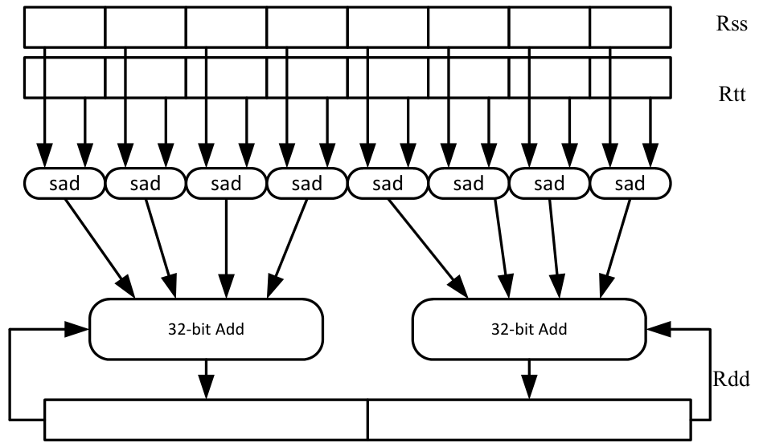

```text
Rss
Rtt
sad sad sad sad sad sad sad sad
32-bit Add 32-bit Add
Rdd
```

| Syntax | Behavior |
|---|---|
| `Rdd=vrsadub(Rss,Rtt)` | `Rdd = 0;`<br>`for (i = 0; i < 4; i++) {`<br>`Rdd.w[0]=(Rdd.w[0] + ABS((Rss.ub[i] - `<br>`Rtt.ub[i])));`<br>`}`<br>`for (i = 4; i < 8; i++) {`<br>`Rdd.w[1]=(Rdd.w[1] + ABS((Rss.ub[i] - `<br>`Rtt.ub[i])));`<br>`}` |
| `Rxx+=vrsadub(Rss,Rtt`<br>`)` | `for (i = 0; i < 4; i++) {`<br>`Rxx.w[0]=(Rxx.w[0] + ABS((Rss.ub[i] - `<br>`Rtt.ub[i])));`<br>`}`<br>`for (i = 4; i < 8; i++) {`<br>`Rxx.w[1]=(Rxx.w[1] + ABS((Rss.ub[i] - `<br>`Rtt.ub[i])));`<br>`}` |

##### Class: XTYPE (slots 2,3)

##### Intrinsics

|  |  |
|---|---|
| `Rdd=vrsadub(Rss,Rtt)` | `Word64 Q6_P_vrsadub_PP(Word64 Rss, Word64 Rtt)` |
| `Rxx+=vrsadub(Rss,Rtt)` | `Word64 Q6_P_vrsadubacc_PP(Word64 Rxx, Word64 Rss, Word64 Rtt)` |

##### Encoding

| 31 | 30 | 29 | 28 | 27 | 26 | 25 | 24 | 23 | 22 | 21 | 20 | 19 | 18 | 17 | 16 | 15 | 14 | 13 | 12 | 11 | 10 | 9 | 8 | 7 | 6 | 5 | 4 | 3 | 2 | 1 | 0 |  |
|---|---|---|---|---|---|---|---|---|---|---|---|---|---|---|---|---|---|---|---|---|---|---|---|---|---|---|---|---|---|---|---|---|
| ICLASS | ICLASS | ICLASS | ICLASS | RegType | RegType | RegType | RegType | MajOp | MajOp | MajOp | s5 | s5 | s5 | s5 | s5 | Parse | Parse |  | t5 | t5 | t5 | t5 | t5 | MinOp | MinOp | MinOp | d5 | d5 | d5 | d5 | d5 |  |
| 1 | 1 | 1 | 0 | 1 | 0 | 0 | 0 | 0 | 1 | 0 | s | s | s | s | s | P | P | 0 | t | t | t | t | t | 0 | 1 | 0 | d | d | d | d | d | Rdd=vrsadub(Rss,Rtt) |
| ICLASS | ICLASS | ICLASS | ICLASS | RegType | RegType | RegType | RegType | MajOp | MajOp | MajOp | s5 | s5 | s5 | s5 | s5 | Parse | Parse |  | t5 | t5 | t5 | t5 | t5 | MinOp | MinOp | MinOp | x5 | x5 | x5 | x5 | x5 |  |
| 1 | 1 | 1 | 0 | 1 | 0 | 1 | 0 | 0 | 1 | 0 | s | s | s | s | s | P | P | 0 | t | t | t | t | t | 0 | 1 | 0 | x | x | x | x | x | Rxx+=vrsadub(Rss,Rtt) |

| Field name | Description |
|---|---|
| `ICLASS` | Instruction class |
| `MajOp` | Major opcode |
| `MinOp` | Minor opcode |
| `RegType` | Register type |
| `Parse` | Packet/loop parse bits |
| `d5` | Field to encode register d |
| `s5` | Field to encode register s |
| `t5` | Field to encode register t |
| `x5` | Field to encode register x |

#### Vector subtract halfwords

Subtract each of the four halfwords in 64-bit vector Rss from the corresponding halfword in vector Rtt.

Optionally, saturate each 16-bit addition to either a signed or unsigned 16-bit value. Applying saturation to the vsubh instruction clamps the result to the signed range 0x8000 to 0x7fff, whereas applying saturation to the vsubuh instruction ensures that the unsigned result falls within the range 0 to 0xffff.

When saturation is not needed, use the vsubh instruction.

| Syntax | Behavior |
|---|---|
| `Rdd=vsubh(Rtt,Rss)[:sat]` | `for (i=0;i<4;i++) {`<br>`Rdd.h[i]=[sat₁₆](Rtt.h[i]-Rss.h[i]);`<br>`}` |
| `Rdd=vsubuh(Rtt,Rss):sat` | `for (i=0;i<4;i++) {`<br>`Rdd.h[i]=usat₁₆(Rtt.uh[i]-Rss.uh[i]);`<br>`}` |

##### Class: XTYPE (slots 2,3)

##### Notes

- If saturation occurs during execution of this instruction (a result is clamped to either maximum or minimum values), the OVF bit in the status register is set. OVF remains set until explicitly cleared by a transfer to the status register.

##### Intrinsics

|  |  |
|---|---|
| `Rdd=vsubh(Rtt,Rss)` | `Word64 Q6_P_vsubh_PP(Word64 Rtt, Word64 Rss)` |
| `Rdd=vsubh(Rtt,Rss):sat` | `Word64 Q6_P_vsubh_PP_sat(Word64 Rtt, Word64 Rss)` |
| `Rdd=vsubuh(Rtt,Rss):sat` | `Word64 Q6_P_vsubuh_PP_sat(Word64 Rtt, Word64 Rss)` |

##### Encoding

| 31 | 30 | 29 | 28 | 27 | 26 | 25 | 24 | 23 | 22 | 21 | 20 | 19 | 18 | 17 | 16 | 15 | 14 | 13 | 12 | 11 | 10 | 9 | 8 | 7 | 6 | 5 | 4 | 3 | 2 | 1 | 0 |  |
|---|---|---|---|---|---|---|---|---|---|---|---|---|---|---|---|---|---|---|---|---|---|---|---|---|---|---|---|---|---|---|---|---|
| ICLASS | ICLASS | ICLASS | ICLASS | RegType | RegType | RegType | RegType |  |  |  | s5 | s5 | s5 | s5 | s5 | Parse | Parse |  | t5 | t5 | t5 | t5 | t5 | MinOp | MinOp | MinOp | d5 | d5 | d5 | d5 | d5 |  |
| 1 | 1 | 0 | 1 | 0 | 0 | 1 | 1 | 0 | 0 | 1 | s | s | s | s | s | P | P | - | t | t | t | t | t | 0 | 1 | 0 | d | d | d | d | d | Rdd=vsubh(Rtt,Rss) |
| 1 | 1 | 0 | 1 | 0 | 0 | 1 | 1 | 0 | 0 | 1 | s | s | s | s | s | P | P | - | t | t | t | t | t | 0 | 1 | 1 | d | d | d | d | d | Rdd=vsubh(Rtt,Rss):sat |
| 1 | 1 | 0 | 1 | 0 | 0 | 1 | 1 | 0 | 0 | 1 | s | s | s | s | s | P | P | - | t | t | t | t | t | 1 | 0 | 0 | d | d | d | d | d | Rdd=vsubuh(Rtt,Rss):sat |

| Field name | Description |
|---|---|
| `RegType` | Register type |
| `MinOp` | Minor opcode |
| `ICLASS` | Instruction class |
| `Parse` | Packet/loop parse bits |
| Field name | Description |
| `d5` | Field to encode register d |
| `s5` | Field to encode register s |
| `t5` | Field to encode register t |

#### Vector subtract bytes

Subtract each of the eight bytes in 64-bit vector Rss from the corresponding byte in vector Rtt.

Optionally, saturate each 8-bit subtraction to an unsigned value between 0 and 255. The eight results are stored in destination register Rdd.

| Syntax | Behavior |
|---|---|
| `Rdd=vsubb(Rss,Rtt)` | `Assembler mapped to: "Rdd=vsubub(Rss,Rtt)"` |
| `Rdd=vsubub(Rtt,Rss)[:sat]` | `for (i = 0; i < 8; i++) {`<br>`Rdd.b[i]=[usat₈](Rtt.ub[i]-Rss.ub[i]);`<br>`}` |

##### Class: XTYPE (slots 2,3)

##### Notes

- If saturation occurs during execution of this instruction (a result is clamped to either maximum or minimum values), the OVF bit in the status register is set. OVF remains set until explicitly cleared by a transfer to the status register.

##### Intrinsics

|  |  |
|---|---|
| `Rdd=vsubb(Rss,Rtt)` | `Word64 Q6_P_vsubb_PP(Word64 Rss, Word64 Rtt)` |
| `Rdd=vsubub(Rtt,Rss)` | `Word64 Q6_P_vsubub_PP(Word64 Rtt, Word64 Rss)` |
| `Rdd=vsubub(Rtt,Rss):sat` | `Word64 Q6_P_vsubub_PP_sat(Word64 Rtt, Word64 Rss)` |

##### Encoding

| 31 | 30 | 29 | 28 | 27 | 26 | 25 | 24 | 23 | 22 | 21 | 20 | 19 | 18 | 17 | 16 | 15 | 14 | 13 | 12 | 11 | 10 | 9 | 8 | 7 | 6 | 5 | 4 | 3 | 2 | 1 | 0 |  |
|---|---|---|---|---|---|---|---|---|---|---|---|---|---|---|---|---|---|---|---|---|---|---|---|---|---|---|---|---|---|---|---|---|
| ICLASS | ICLASS | ICLASS | ICLASS | RegType | RegType | RegType | RegType |  |  |  | s5 | s5 | s5 | s5 | s5 | Parse | Parse |  | t5 | t5 | t5 | t5 | t5 | MinOp | MinOp | MinOp | d5 | d5 | d5 | d5 | d5 |  |
| 1 | 1 | 0 | 1 | 0 | 0 | 1 | 1 | 0 | 0 | 1 | s | s | s | s | s | P | P | - | t | t | t | t | t | 0 | 0 | 0 | d | d | d | d | d | Rdd=vsubub(Rtt,Rss) |
| 1 | 1 | 0 | 1 | 0 | 0 | 1 | 1 | 0 | 0 | 1 | s | s | s | s | s | P | P | - | t | t | t | t | t | 0 | 0 | 1 | d | d | d | d | d | Rdd=vsubub(Rtt,Rss):sat |

| Field name | Description |
|---|---|
| `RegType` | Register type |
| `MinOp` | Minor opcode |
| `ICLASS` | Instruction class |
| `Parse` | Packet/loop parse bits |
| `d5` | Field to encode register d |
| `s5` | Field to encode register s |
| `t5` | Field to encode register t |

#### Vector subtract words

Subtract each of the two words in 64-bit vector Rss from the corresponding word in vector Rtt.

Optionally, saturate each 32-bit subtraction to a signed value between 0x8000_0000 and 0x7fff_ffff. The two word results are stored in destination register Rdd.

| Syntax | Behavior |
|---|---|
| `Rdd=vsubw(Rtt,Rss)[:sat]` | `for (i=0;i<2;i++) {`<br>`Rdd.w[i]=[sat₃₂](Rtt.w[i]-Rss.w[i]);`<br>`}` |

##### Class: XTYPE (slots 2,3)

##### Notes

- If saturation occurs during execution of this instruction (a result is clamped to either maximum or minimum values), the OVF bit in the status register is set. OVF remains set until explicitly cleared by a transfer to the status register.

##### Intrinsics

|  |  |
|---|---|
| `Rdd=vsubw(Rtt,Rss)` | `Word64 Q6_P_vsubw_PP(Word64 Rtt, Word64 Rss)` |
| `Rdd=vsubw(Rtt,Rss):sat` | `Word64 Q6_P_vsubw_PP_sat(Word64 Rtt, Word64 Rss)` |

##### Encoding

| 31 | 30 | 29 | 28 | 27 | 26 | 25 | 24 | 23 | 22 | 21 | 20 | 19 | 18 | 17 | 16 | 15 | 14 | 13 | 12 | 11 | 10 | 9 | 8 | 7 | 6 | 5 | 4 | 3 | 2 | 1 | 0 |  |
|---|---|---|---|---|---|---|---|---|---|---|---|---|---|---|---|---|---|---|---|---|---|---|---|---|---|---|---|---|---|---|---|---|
| ICLASS | ICLASS | ICLASS | ICLASS | RegType | RegType | RegType | RegType |  |  |  | s5 | s5 | s5 | s5 | s5 | Parse | Parse |  | t5 | t5 | t5 | t5 | t5 | MinOp | MinOp | MinOp | d5 | d5 | d5 | d5 | d5 |  |
| 1 | 1 | 0 | 1 | 0 | 0 | 1 | 1 | 0 | 0 | 1 | s | s | s | s | s | P | P | - | t | t | t | t | t | 1 | 0 | 1 | d | d | d | d | d | Rdd=vsubw(Rtt,Rss) |
| 1 | 1 | 0 | 1 | 0 | 0 | 1 | 1 | 0 | 0 | 1 | s | s | s | s | s | P | P | - | t | t | t | t | t | 1 | 1 | 0 | d | d | d | d | d | Rdd=vsubw(Rtt,Rss):sat |

| Field name | Description |
|---|---|
| `RegType` | Register type |
| `MinOp` | Minor opcode |
| `ICLASS` | Instruction class |
| `Parse` | Packet/loop parse bits |
| `d5` | Field to encode register d |
| `s5` | Field to encode register s |
| `t5` | Field to encode register t |

### 11.10.2 XTYPE BIT

The XTYPE BIT instruction subclass includes instructions for bit manipulation.

#### Count leading

Count leading zeros (cl0) counts the number of consecutive zeros starting with the most significant bit.

Count leading ones (cl1) counts the number of consecutive ones starting with the most significant bit.

Count leading bits (clb) counts both leading ones and leading zeros and then selects the maximum.

The normamt instruction returns the number of leading bits minus one.

For a two's-complement number, the number of leading zeros is zero for negative numbers. The number of leading ones is zero for positive numbers.

The number of leading bits can be used to judge the magnitude of the value.

| Syntax | Behavior |
|---|---|
| `Rd=add(clb(Rs), `<br>`#s6)` | `Rd = `<br>`(max(count_leading_ones(Rs),count_leading_ones(~Rs)))+#s;` |
| `Rd=add(clb(Rss), `<br>`#s6)` | `Rd = `<br>`(max(count_leading_ones(Rss),count_leading_ones(~Rss)))+#s;` |
| `Rd=cl0(Rs)` | `Rd = count_leading_ones(~Rs);` |
| `Rd=cl0(Rss)` | `Rd = count_leading_ones(~Rss);` |
| `Rd=cl1(Rs)` | `Rd = count_leading_ones(Rs);` |
| `Rd=cl1(Rss)` | `Rd = count_leading_ones(Rss);` |
| `Rd=clb(Rs)` | `Rd = max(count_leading_ones(Rs),count_leading_ones(~Rs));` |
| `Rd=clb(Rss)` | `Rd = max(count_leading_ones(Rss),count_leading_ones(~Rss));` |
| `Rd=normamt(Rs)` | `if (Rs == 0) {`<br>`Rd = 0;`<br>`} else {`<br>`Rd = `<br>`(max(count_leading_ones(Rs),count_leading_ones(~Rs)))-1;`<br>`}` |
| `Rd=normamt(Rss)` | `if (Rss == 0) {`<br>`Rd = 0;`<br>`} else {`<br>`Rd = (max(count_leading_ones(Rss), `<br>`count_leading_ones(~Rss)))-1;`<br>`}` |

##### Class: XTYPE (slots 2,3)

##### Intrinsics

|  |  |
|---|---|
| `Rd=add(clb(Rs),#s6)` | `Word32 Q6_R_add_clb_RI(Word32 Rs, Word32 Is6)` |
| `Rd=add(clb(Rss),#s6)` | `Word32 Q6_R_add_clb_PI(Word64 Rss, Word32 Is6)` |
| `Rd=cl0(Rs)` | `Word32 Q6_R_cl0_R(Word32 Rs)` |
| `Rd=cl0(Rss)` | `Word32 Q6_R_cl0_P(Word64 Rss)` |
| `Rd=cl1(Rs)` | `Word32 Q6_R_cl1_R(Word32 Rs)` |
| `Rd=cl1(Rss)` | `Word32 Q6_R_cl1_P(Word64 Rss)` |
| `Rd=clb(Rs)` | `Word32 Q6_R_clb_R(Word32 Rs)` |
| `Rd=clb(Rss)` | `Word32 Q6_R_clb_P(Word64 Rss)` |
| `Rd=normamt(Rs)` | `Word32 Q6_R_normamt_R(Word32 Rs)` |
| `Rd=normamt(Rss)` | `Word32 Q6_R_normamt_P(Word64 Rss)` |

##### Encoding

| 31 | 30 | 29 | 28 | 27 | 26 | 25 | 24 | 23 | 22 | 21 | 20 | 19 | 18 | 17 | 16 | 15 | 14 | 13 | 12 | 11 | 10 | 9 | 8 | 7 | 6 | 5 | 4 | 3 | 2 | 1 | 0 |  |
|---|---|---|---|---|---|---|---|---|---|---|---|---|---|---|---|---|---|---|---|---|---|---|---|---|---|---|---|---|---|---|---|---|
| ICLASS | ICLASS | ICLASS | ICLASS | RegType | RegType | RegType | RegType | MajOp | MajOp |  | s5 | s5 | s5 | s5 | s5 | Parse | Parse |  |  |  |  |  |  | MinOp | MinOp | MinOp | d5 | d5 | d5 | d5 | d5 |  |
| 1 | 0 | 0 | 0 | 1 | 0 | 0 | 0 | 0 | 1 | 0 | s | s | s | s | s | P | P | - | - | - | - | - | - | 0 | 0 | 0 | d | d | d | d | d | Rd=clb(Rss) |
| 1 | 0 | 0 | 0 | 1 | 0 | 0 | 0 | 0 | 1 | 0 | s | s | s | s | s | P | P | - | - | - | - | - | - | 0 | 1 | 0 | d | d | d | d | d | Rd=cl0(Rss) |
| 1 | 0 | 0 | 0 | 1 | 0 | 0 | 0 | 0 | 1 | 0 | s | s | s | s | s | P | P | - | - | - | - | - | - | 1 | 0 | 0 | d | d | d | d | d | Rd=cl1(Rss) |
| 1 | 0 | 0 | 0 | 1 | 0 | 0 | 0 | 0 | 1 | 1 | s | s | s | s | s | P | P | - | - | - | - | - | - | 0 | 0 | 0 | d | d | d | d | d | Rd=normamt(Rss) |
| 1 | 0 | 0 | 0 | 1 | 0 | 0 | 0 | 0 | 1 | 1 | s | s | s | s | s | P | P | i | i | i | i | i | i | 0 | 1 | 0 | d | d | d | d | d | Rd=add(clb(Rss),#s6) |
| 1 | 0 | 0 | 0 | 1 | 1 | 0 | 0 | 0 | 0 | 1 | s | s | s | s | s | P | P | i | i | i | i | i | i | 0 | 0 | 0 | d | d | d | d | d | Rd=add(clb(Rs),#s6) |
| 1 | 0 | 0 | 0 | 1 | 1 | 0 | 0 | 0 | 0 | 0 | s | s | s | s | s | P | P | - | - | - | - | - | - | 1 | 0 | 0 | d | d | d | d | d | Rd=clb(Rs) |
| 1 | 0 | 0 | 0 | 1 | 1 | 0 | 0 | 0 | 0 | 0 | s | s | s | s | s | P | P | - | - | - | - | - | - | 1 | 0 | 1 | d | d | d | d | d | Rd=cl0(Rs) |
| 1 | 0 | 0 | 0 | 1 | 1 | 0 | 0 | 0 | 0 | 0 | s | s | s | s | s | P | P | - | - | - | - | - | - | 1 | 1 | 0 | d | d | d | d | d | Rd=cl1(Rs) |
| 1 | 0 | 0 | 0 | 1 | 1 | 0 | 0 | 0 | 0 | 0 | s | s | s | s | s | P | P | - | - | - | - | - | - | 1 | 1 | 1 | d | d | d | d | d | Rd=normamt(Rs) |

| Field name | Description |
|---|---|
| `ICLASS` | Instruction class |
| `Parse` | Packet/loop parse bits |
| `d5` | Field to encode register d |
| `s5` | Field to encode register s |
| `MajOp` | Major opcode |
| `MinOp` | Minor opcode |
| `RegType` | Register type |

#### Count population

The population count (popcount) instruction counts the number set bits in Rss.

| Syntax | Behavior |
|---|---|
| `Rd=popcount(Rss)` | `Rd = count_ones(Rss);` |

##### Class: XTYPE (slots 2,3)

##### Intrinsics

```
Rd=popcount(Rss)Word32 Q6_R_popcount_P(Word64 Rss)
```

##### Encoding

| 31 | 30 | 29 | 28 | 27 | 26 | 25 | 24 | 23 | 22 | 21 | 20 | 19 | 18 | 17 | 16 | 15 | 14 | 13 | 12 | 11 | 10 | 9 | 8 | 7 | 6 | 5 | 4 | 3 | 2 | 1 | 0 |  |
|---|---|---|---|---|---|---|---|---|---|---|---|---|---|---|---|---|---|---|---|---|---|---|---|---|---|---|---|---|---|---|---|---|
| ICLASS | ICLASS | ICLASS | ICLASS | RegType | RegType | RegType | RegType | MajOp | MajOp |  | s5 | s5 | s5 | s5 | s5 | Parse | Parse |  |  |  |  |  |  | MinOp | MinOp | MinOp | d5 | d5 | d5 | d5 | d5 |  |
| 1 | 0 | 0 | 0 | 1 | 0 | 0 | 0 | 0 | 1 | 1 | s | s | s | s | s | P | P | - | - | - | - | - | - | 0 | 1 | 1 | d | d | d | d | d | Rd=popcount(Rss) |

| Field name | Description |
|---|---|
| `ICLASS` | Instruction class |
| `Parse` | Packet/loop parse bits |
| `d5` | Field to encode register d |
| `s5` | Field to encode register s |
| `MajOp` | Major opcode |
| `MinOp` | Minor opcode |
| `RegType` | Register type |

#### Count trailing

Count trailing zeros (ct0) counts the number of consecutive zeros starting with the least significant bit.

Count trailing ones (ct1) counts the number of consecutive ones starting with the least significant bit.

| Syntax | Behavior |
|---|---|
| `Rd=ct0(Rs)` | `Rd = count_leading_ones(~reverse_bits(Rs));` |
| `Rd=ct0(Rss)` | `Rd = `<br>`count_leading_ones(~reverse_bits(Rss));` |
| `Rd=ct1(Rs)` | `Rd = count_leading_ones(reverse_bits(Rs));` |
| `Rd=ct1(Rss)` | `Rd = count_leading_ones(reverse_bits(Rss));` |

##### Class: XTYPE (slots 2,3)

##### Intrinsics

|  |  |
|---|---|
| `Rd=ct0(Rs)` | `Word32 Q6_R_ct0_R(Word32 Rs)` |
| `Rd=ct0(Rss)` | `Word32 Q6_R_ct0_P(Word64 Rss)` |
| `Rd=ct1(Rs)` | `Word32 Q6_R_ct1_R(Word32 Rs)` |
| `Rd=ct1(Rss)` | `Word32 Q6_R_ct1_P(Word64 Rss)` |

##### Encoding

| 31 | 30 | 29 | 28 | 27 | 26 | 25 | 24 | 23 | 22 | 21 | 20 | 19 | 18 | 17 | 16 | 15 | 14 | 13 | 12 | 11 | 10 | 9 | 8 | 7 | 6 | 5 | 4 | 3 | 2 | 1 | 0 |  |
|---|---|---|---|---|---|---|---|---|---|---|---|---|---|---|---|---|---|---|---|---|---|---|---|---|---|---|---|---|---|---|---|---|
| ICLASS | ICLASS | ICLASS | ICLASS | RegType | RegType | RegType | RegType | MajOp | MajOp |  | s5 | s5 | s5 | s5 | s5 | Parse | Parse |  |  |  |  |  |  | MinOp | MinOp | MinOp | d5 | d5 | d5 | d5 | d5 |  |
| 1 | 0 | 0 | 0 | 1 | 0 | 0 | 0 | 1 | 1 | 1 | s | s | s | s | s | P | P | - | - | - | - | - | - | 0 | 1 | 0 | d | d | d | d | d | Rd=ct0(Rss) |
| 1 | 0 | 0 | 0 | 1 | 0 | 0 | 0 | 1 | 1 | 1 | s | s | s | s | s | P | P | - | - | - | - | - | - | 1 | 0 | 0 | d | d | d | d | d | Rd=ct1(Rss) |
| 1 | 0 | 0 | 0 | 1 | 1 | 0 | 0 | 0 | 1 | 0 | s | s | s | s | s | P | P | - | - | - | - | - | - | 1 | 0 | 0 | d | d | d | d | d | Rd=ct0(Rs) |
| 1 | 0 | 0 | 0 | 1 | 1 | 0 | 0 | 0 | 1 | 0 | s | s | s | s | s | P | P | - | - | - | - | - | - | 1 | 0 | 1 | d | d | d | d | d | Rd=ct1(Rs) |

| Field name | Description |
|---|---|
| `ICLASS` | Instruction class |
| `Parse` | Packet/loop parse bits |
| `d5` | Field to encode register d |
| `s5` | Field to encode register s |
| `MajOp` | Major opcode |
| `MinOp` | Minor opcode |
| `RegType` | Register type |

#### Extract bit field

Extract a bit field from the source register (or register pair) and deposit into the least significant bits of the destination register (or register pair). The other, more significant bits in the destination are either cleared or sign-extended, depending on the instruction.

The width of the extracted field is obtained from the first immediate or from the most-significant word of Rtt. The field offset is obtained from either the second immediate or from the least-significant word of Rtt.

For register-based extract, where Rtt supplies the offset and width, the offset value is treated as a signed 7-bit number. If this value is negative, the source register Rss is shifted left (the reverse direction). Width number of bits are then taken from the least-significant portion of this result.

When the shift amount and/or offset captures data beyond the most significant end of the input, these bits are taken as zero.

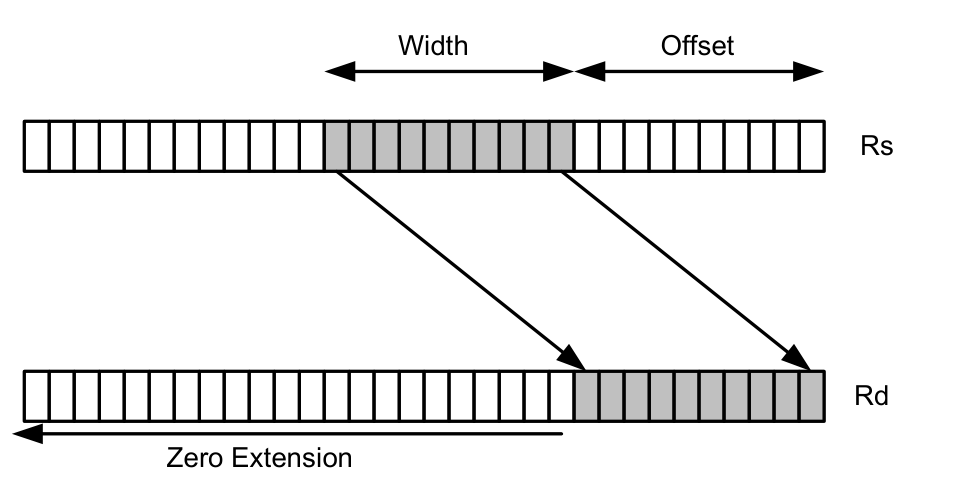

```text
Width Offset
Rs
Rd
Zero Extension
```

| Syntax | Behavior |
|---|---|
| `Rd=extract(Rs,#u5,#U5)` | `width=#u;`<br>`offset=#U;`<br>`Rd = sxt<sub>width->32</sub>((Rs >> offset));` |
| `Rd=extract(Rs,Rtt)` | `width=zxt<sub>6->32</sub>((Rtt.w[1]));`<br>`offset=sxt<sub>7->32</sub>((Rtt.w[0]));`<br>`Rd = sxt<sub>width->64</sub>((offset>0)?(zxt<sub>32->64</sub>(zxt<sub>32->64</sub>(Rs))>>> `<br>`offset): (zxt<sub>32->64</sub>(zxt<sub>32->64</sub>(Rs))<<offset));` |
| `Rd=extractu(Rs,#u5, `<br>`#U5)` | `width=#u;`<br>`offset=#U;`<br>`Rd = zxt<sub>width->32</sub>((Rs >> offset));` |
| `Rd=extractu(Rs,Rtt)` | `width=zxt<sub>6->32</sub>((Rtt.w[1]));`<br>`offset=sxt<sub>7->32</sub>((Rtt.w[0]));`<br>`Rd = zxt<sub>width->64</sub>((offset>0)?(zxt<sub>32->64</sub>(zxt<sub>32->64</sub>(Rs))>>> `<br>`offset): (zxt<sub>32->64</sub>(zxt<sub>32->64</sub>(Rs))<<offset));` |
| `Rdd=extract(Rss,#u6, `<br>`#U6)` | `width=#u;`<br>`offset=#U;`<br>`Rdd = sxt<sub>width->64</sub>((Rss >> offset));` |
| `Rdd=extract(Rss,Rtt)` | `width=zxt<sub>6->32</sub>((Rtt.w[1]));`<br>`offset=sxt<sub>7->32</sub>((Rtt.w[0]));`<br>`Rdd = sxt<sub>width-</sub>`<br>`<sub>>64</sub>((offset>0)?(Rss>>>offset):(Rss<<offset));` |
| `Rdd= `<br>`extractu(Rss,#u6,#U6)` | `width=#u;`<br>`offset=#U;`<br>`Rdd = zxt<sub>width->64</sub>((Rss >> offset));` |
| `Rdd=extractu(Rss,Rtt)` | `width=zxt<sub>6->32</sub>((Rtt.w[1]));`<br>`offset=sxt<sub>7->32</sub>((Rtt.w[0]));`<br>`Rdd = zxt<sub>width->64</sub>((offset >0)?(Rss>>> offset):(Rss<< `<br>`offset));` |

##### Class: XTYPE (slots 2,3)

##### Intrinsics

|  |  |
|---|---|
| `Rd=extract(Rs,#u5,#U5)` | `Word32 Q6_R_extract_RII(Word32 Rs, Word32 Iu5, Word32 IU5)` |
| `Rd=extract(Rs,Rtt)` | `Word32 Q6_R_extract_RP(Word32 Rs, Word64 Rtt)` |
| `Rd=extractu(Rs,#u5,#U5)` | `Word32 Q6_R_extractu_RII(Word32 Rs, Word32 Iu5, Word32 IU5)` |
| `Rd=extractu(Rs,Rtt)` | `Word32 Q6_R_extractu_RP(Word32 Rs, Word64 Rtt)` |
| `Rdd=extract(Rss,#u6,#U6)` | `Word64 Q6_P_extract_PII(Word64 Rss, Word32 Iu6, Word32 IU6)` |
| `Rdd=extract(Rss,Rtt)` | `Word64 Q6_P_extract_PP(Word64 Rss, Word64 Rtt)` |
| `Rdd=` | `Word64 Q6_P_extractu_PII(Word64 Rss, Word32 Iu6,` |
| `extractu(Rss,#u6,#U6)` | `Word32 IU6)` |
| `Rdd=extractu(Rss,Rtt)` | `Word64 Q6_P_extractu_PP(Word64 Rss, Word64 Rtt)` |

##### Encoding

| 31 | 30 | 29 | 28 | 27 | 26 | 25 | 24 | 23 | 22 | 21 | 20 | 19 | 18 | 17 | 16 | 15 | 14 | 13 | 12 | 11 | 10 | 9 | 8 | 7 | 6 | 5 | 4 | 3 | 2 | 1 | 0 |  |
|---|---|---|---|---|---|---|---|---|---|---|---|---|---|---|---|---|---|---|---|---|---|---|---|---|---|---|---|---|---|---|---|---|
| ICLASS | ICLASS | ICLASS | ICLASS | RegType | RegType | RegType | RegType | MajOp | MajOp |  | s5 | s5 | s5 | s5 | s5 | Parse | Parse |  |  |  |  |  |  | MinOp | MinOp | MinOp | d5 | d5 | d5 | d5 | d5 |  |
| 1 | 0 | 0 | 0 | 0 | 0 | 0 | 1 | I | I | I | s | s | s | s | s | P | P | i | i | i | i | i | i | I | I | I | d | d | d | d | d | Rdd=extractu(Rss,#u6,#U6 ) |
| 1 | 0 | 0 | 0 | 1 | 0 | 1 | 0 | I | I | I | s | s | s | s | s | P | P | i | i | i | i | i | i | I | I | I | d | d | d | d | d | Rdd=extract(Rss,#u6,#U6) |
| 1 | 0 | 0 | 0 | 1 | 1 | 0 | 1 | 0 | I | I | s | s | s | s | s | P | P | 0 | i | i | i | i | i | I | I | I | d | d | d | d | d | Rd=extractu(Rs,#u5,#U5) |
| 1 | 0 | 0 | 0 | 1 | 1 | 0 | 1 | 1 | I | I | s | s | s | s | s | P | P | 0 | i | i | i | i | i | I | I | I | d | d | d | d | d | Rd=extract(Rs,#u5,#U5) |
| ICLASS | ICLASS | ICLASS | ICLASS | RegType | RegType | RegType | RegType | Maj | Maj |  | s5 | s5 | s5 | s5 | s5 | Parse | Parse |  | t5 | t5 | t5 | t5 | t5 | Min | Min |  | d5 | d5 | d5 | d5 | d5 |  |
| 1 | 1 | 0 | 0 | 0 | 0 | 0 | 1 | 0 | 0 | - | s | s | s | s | s | P | P | - | t | t | t | t | t | 0 | 0 | - | d | d | d | d | d | Rdd=extractu(Rss,Rtt) |
| 1 | 1 | 0 | 0 | 0 | 0 | 0 | 1 | 1 | 1 | - | s | s | s | s | s | P | P | - | t | t | t | t | t | 1 | 0 | - | d | d | d | d | d | Rdd=extract(Rss,Rtt) |
| 1 | 1 | 0 | 0 | 1 | 0 | 0 | 1 | 0 | 0 | - | s | s | s | s | s | P | P | - | t | t | t | t | t | 0 | 0 | - | d | d | d | d | d | Rd=extractu(Rs,Rtt) |
| 1 | 1 | 0 | 0 | 1 | 0 | 0 | 1 | 0 | 0 | - | s | s | s | s | s | P | P | - | t | t | t | t | t | 0 | 1 | - | d | d | d | d | d | Rd=extract(Rs,Rtt) |

| Field name | Description |
|---|---|
| `ICLASS` | Instruction class |
| `Parse` | Packet/loop parse bits |
| `d5` | Field to encode register d |
| `s5` | Field to encode register s |
| `t5` | Field to encode register t |
| `MajOp` | Major opcode |
| `MinOp` | Minor opcode |
| `Maj` | Major opcode |
| `Min` | Minor opcode |
| `RegType` | Register type |

#### Insert bit field

Replace a bit field in the destination register (or register pair) with bits from the least significant portion of Rs/Rss. The number of bits is obtained from the first immediate or the most-significant word of Rtt. The bits are shifted by the second immediate or the least significant word of Rtt.

When register Rtt specifies the offset, the low 7-bits of Rtt are treated as a signed 7-bit value. If this value is negative, the result is zero.

Shift amounts and offsets that are too large may push bits beyond the end of the destination register., and the bits do not appear in the destination register.

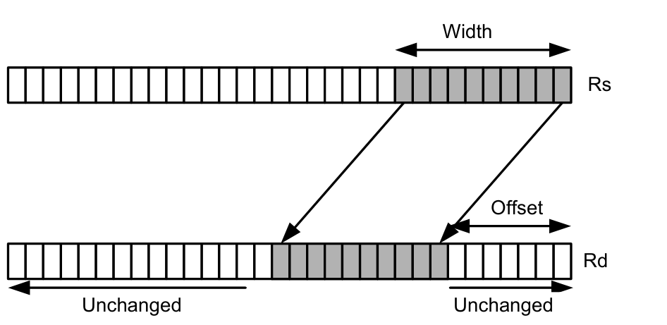

```text
Width
Rs
Offset
Rd
Unchanged Unchanged
```

| Syntax | Behavior |
|---|---|
| `Rx=insert(Rs,#u5,#U5)` | `width=#u;`<br>`offset=#U;`<br>`Rx &= ~(((1<<width)-1)<<offset);`<br>`Rx \|= ((Rs & ((1<<width)-1)) << offset);` |
| `Rx=insert(Rs,Rtt)` | `width=zxt<sub>6->32</sub>((Rtt.w[1]));`<br>`offset=sxt<sub>7->32</sub>((Rtt.w[0]));`<br>`mask = ((1<<width)-1);`<br>`if (offset < 0) {`<br>`Rx = 0;`<br>`} else {`<br>`Rx &= ~(mask<<offset);`<br>`Rx \|= ((Rs & mask) << offset);`<br>`}` |
| `Rxx= `<br>`insert(Rss,#u6,#U6)` | `width=#u;`<br>`offset=#U;`<br>`Rxx &= ~(((1<<width)-1)<<offset);`<br>`Rxx \|= ((Rss & ((1<<width)-1)) << offset);` |
| `Rxx=insert(Rss,Rtt)` | `width=zxt<sub>6->32</sub>((Rtt.w[1]));`<br>`offset=sxt<sub>7->32</sub>((Rtt.w[0]));`<br>`mask = ((1<<width)-1);`<br>`if (offset < 0) {`<br>`Rxx = 0;`<br>`} else {`<br>`Rxx &= ~(mask<<offset);`<br>`Rxx \|= ((Rss & mask) << offset);`<br>`}` |

##### Class: XTYPE (slots 2,3)

##### Intrinsics

|  |  |
|---|---|
| `Rx=insert(Rs,#u5,#U5)` | `Word32 Q6_R_insert_RII(Word32 Rx, Word32 Rs, Word32 Iu5, Word32 IU5)` |
| `Rx=insert(Rs,Rtt)` | `Word32 Q6_R_insert_RP(Word32 Rx, Word32 Rs, Word64 Rtt)` |
| `Rxx= insert(Rss,#u6,` | `Word64 Q6_P_insert_PII(Word64 Rxx, Word64 Rss, Word32` |
| `#U6)` | `Iu6, Word32 IU6)` |
| `Rxx=insert(Rss,Rtt)` | `Word64 Q6_P_insert_PP(Word64 Rxx, Word64 Rss, Word64 Rtt)` |

##### Encoding

| 31 | 30 | 29 | 28 | 27 | 26 | 25 | 24 | 23 | 22 | 21 | 20 | 19 | 18 | 17 | 16 | 15 | 14 | 13 | 12 | 11 | 10 | 9 | 8 | 7 | 6 | 5 | 4 | 3 | 2 | 1 | 0 |  |
|---|---|---|---|---|---|---|---|---|---|---|---|---|---|---|---|---|---|---|---|---|---|---|---|---|---|---|---|---|---|---|---|---|
| ICLASS | ICLASS | ICLASS | ICLASS | RegType | RegType | RegType | RegType | MajOp | MajOp |  | s5 | s5 | s5 | s5 | s5 | Parse | Parse |  |  |  |  |  |  | MinOp | MinOp | MinOp | x5 | x5 | x5 | x5 | x5 |  |
| 1 | 0 | 0 | 0 | 0 | 0 | 1 | 1 | I | I | I | s | s | s | s | s | P | P | i | i | i | i | i | i | I | I | I | x | x | x | x | x | Rxx=insert(Rss,#u6,#U6) |
| 1 | 0 | 0 | 0 | 1 | 1 | 1 | 1 | 0 | I | I | s | s | s | s | s | P | P | 0 | i | i | i | i | i | I | I | I | x | x | x | x | x | Rx=insert(Rs,#u5,#U5) |
| ICLASS | ICLASS | ICLASS | ICLASS | RegType | RegType | RegType | RegType |  |  |  | s5 | s5 | s5 | s5 | s5 | Parse | Parse |  | t5 | t5 | t5 | t5 | t5 |  |  |  | x5 | x5 | x5 | x5 | x5 |  |
| 1 | 1 | 0 | 0 | 1 | 0 | 0 | 0 | - | - | - | s | s | s | s | s | P | P | - | t | t | t | t | t | - | - | - | x | x | x | x | x | Rx=insert(Rs,Rtt) |
| ICLASS | ICLASS | ICLASS | ICLASS | RegType | RegType | RegType | RegType | Maj | Maj |  | s5 | s5 | s5 | s5 | s5 | Parse | Parse |  | t5 | t5 | t5 | t5 | t5 |  |  |  | x5 | x5 | x5 | x5 | x5 |  |
| 1 | 1 | 0 | 0 | 1 | 0 | 1 | 0 | 0 | - | - | s | s | s | s | s | P | P | 0 | t | t | t | t | t | - | - | - | x | x | x | x | x | Rxx=insert(Rss,Rtt) |

| Field name | Description |
|---|---|
| `ICLASS` | Instruction class |
| `Parse` | Packet/loop parse bits |
| `s5` | Field to encode register s |
| `t5` | Field to encode register t |
| `x5` | Field to encode register x |
| `MajOp` | Major opcode |
| `MinOp` | Minor opcode |
| `Maj` | Major opcode |
| `RegType` | Register type |

#### Interleave/deinterleave

For interleave, bits I+32 of Rss (which are the bits from the upper source word) are placed in the odd bits (I*2)+1 of Rdd, while bits I of Rss (which are the bits from the lower source word) are placed in the even bits (I*2) of Rdd.

For deinterleave, the even bits of the source register are placed in the even register of the result pair, and the odd bits of the source register are placed in the odd register of the result pair.

"r1:0 = deinterleave(r1:0)" is the inverse of "r1:0 = interleave(r1:0)".

| Syntax | Behavior |
|---|---|
| `Rdd=deinterleave(Rss)` | `Rdd = deinterleave(ODD,EVEN);` |
| `Rdd=interleave(Rss)` | `Rdd = interleave(Rss.w[1],Rss.w[0]);` |

##### Class: XTYPE (slots 2,3)

##### Intrinsics

|  |  |
|---|---|
| `Rdd=deinterleave(Rss)` | `Word64 Q6_P_deinterleave_P(Word64 Rss)` |
| `Rdd=interleave(Rss)` | `Word64 Q6_P_interleave_P(Word64 Rss)` |

##### Encoding

| 31 | 30 | 29 | 28 | 27 | 26 | 25 | 24 | 23 | 22 | 21 | 20 | 19 | 18 | 17 | 16 | 15 | 14 | 13 | 12 | 11 | 10 | 9 | 8 | 7 | 6 | 5 | 4 | 3 | 2 | 1 | 0 |  |
|---|---|---|---|---|---|---|---|---|---|---|---|---|---|---|---|---|---|---|---|---|---|---|---|---|---|---|---|---|---|---|---|---|
| ICLASS | ICLASS | ICLASS | ICLASS | RegType | RegType | RegType | RegType | MajOp | MajOp |  | s5 | s5 | s5 | s5 | s5 | Parse | Parse |  |  |  |  |  |  | MinOp | MinOp | MinOp | d5 | d5 | d5 | d5 | d5 |  |
| 1 | 0 | 0 | 0 | 0 | 0 | 0 | 0 | 1 | 1 | 0 | s | s | s | s | s | P | P | - | - | - | - | - | - | 1 | 0 | 0 | d | d | d | d | d | Rdd=deinterleave(Rss) |
| 1 | 0 | 0 | 0 | 0 | 0 | 0 | 0 | 1 | 1 | 0 | s | s | s | s | s | P | P | - | - | - | - | - | - | 1 | 0 | 1 | d | d | d | d | d | Rdd=interleave(Rss) |

| Field name | Description |
|---|---|
| `ICLASS` | Instruction class |
| `Parse` | Packet/loop parse bits |
| `d5` | Field to encode register d |
| `s5` | Field to encode register s |
| `MajOp` | Major opcode |
| `MinOp` | Minor opcode |
| `RegType` | Register type |

#### Linear feedback-shift iteration

Count the number of ones of the logical AND of the two source input values, and take the least significant value of that sum. The first source value is shifted right by one bit, and the parity is placed in the MSB.

| Syntax | Behavior |
|---|---|
| `Rdd=lfs(Rss,Rtt)` | `Rdd = (Rss.u64 >> 1) \| ((1&count_ones(Rss & `<br>`Rtt)).u64<<63);` |

##### Class: XTYPE (slots 2,3)

##### Intrinsics

```
Rdd=lfs(Rss,Rtt)Word64 Q6_P_lfs_PP(Word64 Rss, Word64 Rtt)
```

##### Encoding

| 31 | 30 | 29 | 28 | 27 | 26 | 25 | 24 | 23 | 22 | 21 | 20 | 19 | 18 | 17 | 16 | 15 | 14 | 13 | 12 | 11 | 10 | 9 | 8 | 7 | 6 | 5 | 4 | 3 | 2 | 1 | 0 |  |
|---|---|---|---|---|---|---|---|---|---|---|---|---|---|---|---|---|---|---|---|---|---|---|---|---|---|---|---|---|---|---|---|---|
| ICLASS | ICLASS | ICLASS | ICLASS | RegType | RegType | RegType | RegType | Maj | Maj |  | s5 | s5 | s5 | s5 | s5 | Parse | Parse |  | t5 | t5 | t5 | t5 | t5 | Min | Min |  | d5 | d5 | d5 | d5 | d5 |  |
| 1 | 1 | 0 | 0 | 0 | 0 | 0 | 1 | 1 | 0 | - | s | s | s | s | s | P | P | - | t | t | t | t | t | 1 | 1 | 0 | d | d | d | d | d | Rdd=lfs(Rss,Rtt) |

| Field name | Description |
|---|---|
| `ICLASS` | Instruction class |
| `Parse` | Packet/loop parse bits |
| `d5` | Field to encode register d |
| `s5` | Field to encode register s |
| `t5` | Field to encode register t |
| `Maj` | Major opcode |
| `Min` | Minor opcode |
| `RegType` | Register type |

#### Masked parity

Count the number of ones of the logical AND of the two source input values, and take the least significant bit of that sum.

| Syntax | Behavior |
|---|---|
| `Rd=parity(Rs,Rt)` | `Rd = 1&count_ones(Rs & Rt);` |
| `Rd=parity(Rss,Rtt)` | `Rd = 1&count_ones(Rss & Rtt);` |

##### Class: XTYPE (slots 2,3)

##### Intrinsics

|  |  |
|---|---|
| `Rd=parity(Rs,Rt)` | `Word32 Q6_R_parity_RR(Word32 Rs, Word32 Rt)` |
| `Rd=parity(Rss,Rtt)` | `Word32 Q6_R_parity_PP(Word64 Rss, Word64 Rtt)` |

##### Encoding

| 31 | 30 | 29 | 28 | 27 | 26 | 25 | 24 | 23 | 22 | 21 | 20 | 19 | 18 | 17 | 16 | 15 | 14 | 13 | 12 | 11 | 10 | 9 | 8 | 7 | 6 | 5 | 4 | 3 | 2 | 1 | 0 |  |
|---|---|---|---|---|---|---|---|---|---|---|---|---|---|---|---|---|---|---|---|---|---|---|---|---|---|---|---|---|---|---|---|---|
| ICLASS | ICLASS | ICLASS | ICLASS | RegType | RegType | RegType | RegType |  |  |  | s5 | s5 | s5 | s5 | s5 | Parse | Parse |  | t5 | t5 | t5 | t5 | t5 |  |  |  | d5 | d5 | d5 | d5 | d5 |  |
| 1 | 1 | 0 | 1 | 0 | 0 | 0 | 0 | - | - | - | s | s | s | s | s | P | P | - | t | t | t | t | t | - | - | - | d | d | d | d | d | Rd=parity(Rss,Rtt) |
| 1 | 1 | 0 | 1 | 0 | 1 | 0 | 1 | 1 | 1 | 1 | s | s | s | s | s | P | P | - | t | t | t | t | t | - | - | - | d | d | d | d | d | Rd=parity(Rs,Rt) |

| Field name | Description |
|---|---|
| `RegType` | Register type |
| `ICLASS` | Instruction class |
| `Parse` | Packet/loop parse bits |
| `d5` | Field to encode register d |
| `s5` | Field to encode register s |
| `t5` | Field to encode register t |

#### Bit reverse

Reverse the order of bits. The most significant swap with the least significant, bit 30 swaps with bit 1, and so on.

| Syntax | Behavior |
|---|---|
| `Rd=brev(Rs)` | `Rd = reverse_bits(Rs);` |
| `Rdd=brev(Rss)` | `Rdd = reverse_bits(Rss);` |

##### Class: XTYPE (slots 2,3)

##### Intrinsics

|  |  |
|---|---|
| `Rd=brev(Rs)` | `Word32 Q6_R_brev_R(Word32 Rs)` |
| `Rdd=brev(Rss)` | `Word64 Q6_P_brev_P(Word64 Rss)` |

##### Encoding

| 31 | 30 | 29 | 28 | 27 | 26 | 25 | 24 | 23 | 22 | 21 | 20 | 19 | 18 | 17 | 16 | 15 | 14 | 13 | 12 | 11 | 10 | 9 | 8 | 7 | 6 | 5 | 4 | 3 | 2 | 1 | 0 |  |
|---|---|---|---|---|---|---|---|---|---|---|---|---|---|---|---|---|---|---|---|---|---|---|---|---|---|---|---|---|---|---|---|---|
| ICLASS | ICLASS | ICLASS | ICLASS | RegType | RegType | RegType | RegType | MajOp | MajOp |  | s5 | s5 | s5 | s5 | s5 | Parse | Parse |  |  |  |  |  |  | MinOp | MinOp | MinOp | d5 | d5 | d5 | d5 | d5 |  |
| 1 | 0 | 0 | 0 | 0 | 0 | 0 | 0 | 1 | 1 | 0 | s | s | s | s | s | P | P | - | - | - | - | - | - | 1 | 1 | 0 | d | d | d | d | d | Rdd=brev(Rss) |
| 1 | 0 | 0 | 0 | 1 | 1 | 0 | 0 | 0 | 1 | 0 | s | s | s | s | s | P | P | - | - | - | - | - | - | 1 | 1 | 0 | d | d | d | d | d | Rd=brev(Rs) |

| Field name | Description |
|---|---|
| `ICLASS` | Instruction class |
| `Parse` | Packet/loop parse bits |
| `d5` | Field to encode register d |
| `s5` | Field to encode register s |
| `MajOp` | Major opcode |
| `MinOp` | Minor opcode |
| `RegType` | Register type |

#### Set/clear/toggle bit

Set (to 1), clear (to 0), or toggle a single bit in the source, and place the resulting value in the destination. Indicate the bit to manipulate using an immediate or register value.

If a register is used to indicate the bit position, and the value of the least-significant 7 bits of Rt is out of range, the destination register is unchanged.

| Syntax | Behavior |
|---|---|
| `Rd=clrbit(Rs,#u5)` | `Rd = (Rs & (~(1<<#u)));` |
| `Rd=clrbit(Rs,Rt)` | `Rd = (Rs & (~((sxt<sub>7->32</sub>(Rt)>0)?(zxt<sub>32->64</sub>(1)<<sxt₇₋`<br>`<sub>>32</sub>(Rt)):(zxt<sub>32->64</sub>(1)>>>sxt<sub>7->32</sub>(Rt)))));` |
| `Rd=setbit(Rs,#u5)` | `Rd = (Rs \| (1<<#u));` |
| `Rd=setbit(Rs,Rt)` | `Rd = (Rs \| (sxt<sub>7->32</sub>(Rt)>0)?(zxt<sub>32->64</sub>(1)<<sxt₇₋`<br>`<sub>>32</sub>(Rt)):(zxt<sub>32->64</sub>(1)>>>sxt<sub>7->32</sub>(Rt)));` |
| `Rd=togglebit(Rs,#u5)` | `Rd = (Rs ^ (1<<#u));` |
| `Rd=togglebit(Rs,Rt)` | `Rd = (Rs ^ (sxt<sub>7->32</sub>(Rt)>0)?(zxt<sub>32->64</sub>(1)<<sxt₇₋`<br>`<sub>>32</sub>(Rt)):(zxt<sub>32->64</sub>(1)>>>sxt<sub>7->32</sub>(Rt)));` |

##### Class: XTYPE (slots 2,3)

##### Intrinsics

|  |  |
|---|---|
| `Rd=clrbit(Rs,#u5)` | `Word32 Q6_R_clrbit_RI(Word32 Rs, Word32 Iu5)` |
| `Rd=clrbit(Rs,Rt)` | `Word32 Q6_R_clrbit_RR(Word32 Rs, Word32 Rt)` |
| `Rd=setbit(Rs,#u5)` | `Word32 Q6_R_setbit_RI(Word32 Rs, Word32 Iu5)` |
| `Rd=setbit(Rs,Rt)` | `Word32 Q6_R_setbit_RR(Word32 Rs, Word32 Rt)` |
| `Rd=togglebit(Rs,#u5)` | `Word32 Q6_R_togglebit_RI(Word32 Rs, Word32 Iu5)` |
| `Rd=togglebit(Rs,Rt)` | `Word32 Q6_R_togglebit_RR(Word32 Rs, Word32 Rt)` |

##### Encoding

| 31 | 30 | 29 | 28 | 27 | 26 | 25 | 24 | 23 | 22 | 21 | 20 | 19 | 18 | 17 | 16 | 15 | 14 | 13 | 12 | 11 | 10 | 9 | 8 | 7 | 6 | 5 | 4 | 3 | 2 | 1 | 0 |  |
|---|---|---|---|---|---|---|---|---|---|---|---|---|---|---|---|---|---|---|---|---|---|---|---|---|---|---|---|---|---|---|---|---|
| ICLASS | ICLASS | ICLASS | ICLASS | RegType | RegType | RegType | RegType | MajOp | MajOp |  | s5 | s5 | s5 | s5 | s5 | Parse | Parse |  |  |  |  |  |  | MinOp | MinOp | MinOp | d5 | d5 | d5 | d5 | d5 |  |
| 1 | 0 | 0 | 0 | 1 | 1 | 0 | 0 | 1 | 1 | 0 | s | s | s | s | s | P | P | 0 | i | i | i | i | i | 0 | 0 | 0 | d | d | d | d | d | Rd=setbit(Rs,#u5) |
| 1 | 0 | 0 | 0 | 1 | 1 | 0 | 0 | 1 | 1 | 0 | s | s | s | s | s | P | P | 0 | i | i | i | i | i | 0 | 0 | 1 | d | d | d | d | d | Rd=clrbit(Rs,#u5) |
| 1 | 0 | 0 | 0 | 1 | 1 | 0 | 0 | 1 | 1 | 0 | s | s | s | s | s | P | P | 0 | i | i | i | i | i | 0 | 1 | 0 | d | d | d | d | d | Rd=togglebit(Rs,#u5) |
| ICLASS | ICLASS | ICLASS | ICLASS | RegType | RegType | RegType | RegType | Maj | Maj |  | s5 | s5 | s5 | s5 | s5 | Parse | Parse |  | t5 | t5 | t5 | t5 | t5 | Min | Min |  | d5 | d5 | d5 | d5 | d5 |  |
| 1 | 1 | 0 | 0 | 0 | 1 | 1 | 0 | 1 | 0 | - | s | s | s | s | s | P | P | - | t | t | t | t | t | 0 | 0 | - | d | d | d | d | d | Rd=setbit(Rs,Rt) |
| 1 | 1 | 0 | 0 | 0 | 1 | 1 | 0 | 1 | 0 | - | s | s | s | s | s | P | P | - | t | t | t | t | t | 0 | 1 | - | d | d | d | d | d | Rd=clrbit(Rs,Rt) |
| 1 | 1 | 0 | 0 | 0 | 1 | 1 | 0 | 1 | 0 | - | s | s | s | s | s | P | P | - | t | t | t | t | t | 1 | 0 | - | d | d | d | d | d | Rd=togglebit(Rs,Rt) |

| Field name | Description |
|---|---|
| `ICLASS` | Instruction class |
| `Parse` | Packet/loop parse bits |
| `d5` | Field to encode register d |
| `s5` | Field to encode register s |
| `t5` | Field to encode register t |
| `MajOp` | Major opcode |
| `MinOp` | Minor opcode |
| `Maj` | Major opcode |
| `Min` | Minor opcode |
| `RegType` | Register type |

#### Split bit field

Split the bit field in a register into upper and lower parts of variable size. The lower part is placed in the lower word of a destination register pair, and the upper part is placed in the upper word of the destination. An immediate value or register Rt is used to determine the bit position of the split.

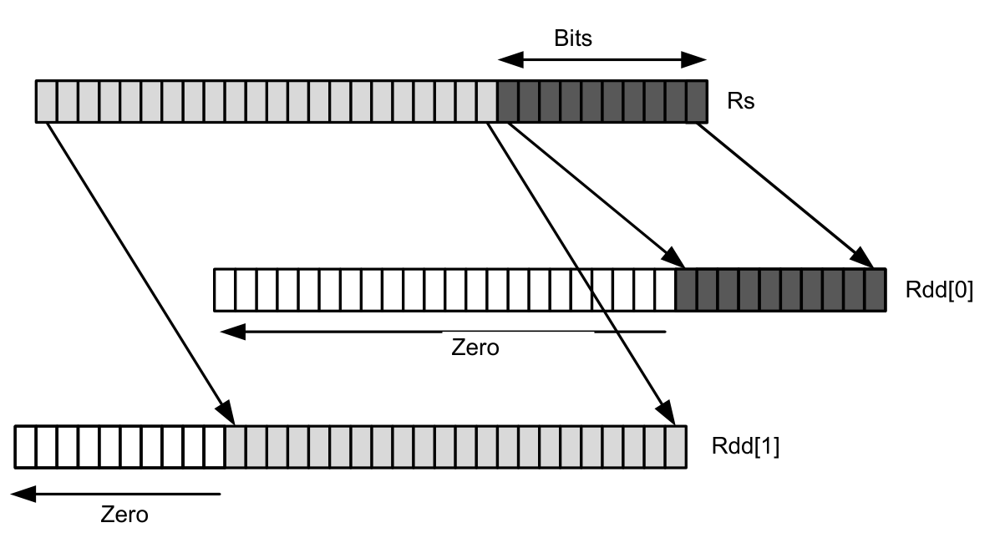

```text
Bits
Rs
Rdd[0]
Zero
Rdd[1]
Zero
```

| Syntax | Behavior |
|---|---|
| `Rdd=bitsplit(Rs,#u5)` | `Rdd.w[1]=(Rs>>#u);`<br>`Rdd.w[0]=zxt<sub>#u->32</sub>(Rs);` |
| `Rdd=bitsplit(Rs,Rt)` | `shamt = zxt<sub>5->32</sub>(Rt);`<br>`Rdd.w[1]=(Rs>>shamt);`<br>`Rdd.w[0]=zxt<sub>shamt->32</sub>(Rs);` |

##### Class: XTYPE (slots 2,3)

##### Intrinsics

|  |  |
|---|---|
| `Rdd=bitsplit(Rs,#u5)` | `Word64 Q6_P_bitsplit_RI(Word32 Rs, Word32 Iu5)` |
| `Rdd=bitsplit(Rs,Rt)` | `Word64 Q6_P_bitsplit_RR(Word32 Rs, Word32 Rt)` |

##### Encoding

| 31 | 30 | 29 | 28 | 27 | 26 | 25 | 24 | 23 | 22 | 21 | 20 | 19 | 18 | 17 | 16 15 | 14 | 13 | 12 | 11 | 10 | 9 | 8 | 7 | 6 | 5 | 4 | 3 | 2 | 1 | 0 |  |
|---|---|---|---|---|---|---|---|---|---|---|---|---|---|---|---|---|---|---|---|---|---|---|---|---|---|---|---|---|---|---|---|
| ICLASS | ICLASS | ICLASS | ICLASS | RegType | RegType | RegType | RegType | MajOp | MajOp |  | s5 | s5 | s5 | s5 | s5 | Parse |  |  |  |  |  |  | MinOp | MinOp | MinOp | d5 | d5 | d5 | d5 | d5 |  |
| 1 | 0 | 0 | 0 | 1 | 0 | 0 | 0 | 1 | 1 | 0 | s | s | s | s | s P | P | 0 | i | i | i | i | i | 1 | 0 | 0 | d | d | d | d | d | Rdd=bitsplit(Rs,#u5) |
| ICLASS | ICLASS | ICLASS | ICLASS | RegType | RegType | RegType | RegType |  |  |  | s5 | s5 | s5 | s5 | s5 | Parse |  | t5 | t5 | t5 | t5 | t5 |  |  |  | d5 | d5 | d5 | d5 | d5 |  |
| 1 | 1 | 0 | 1 | 0 | 1 | 0 | 0 | - | - | 1 | s | s | s | s | s P | P | - | t | t | t | t | t | - | - | - | d | d | d | d | d | Rdd=bitsplit(Rs,Rt) |

| Field name | Description |
|---|---|
| `RegType` | Register type |
| `ICLASS` | Instruction class |
| `Parse` | Packet/loop parse bits |
| `d5` | Field to encode register d |
| `s5` | Field to encode register s |
| `t5` | Field to encode register t |
| `MajOp` | Major opcode |
| `MinOp` | Minor opcode |

#### Table index

The table index instruction supports fast lookup tables where the index into the table is stored in a bit-field. The instruction forms the address of a table element by extracting the bit field and inserting it into the appropriate bits of a pointer to the table element.

Tables are defined to contain entries of bytes, halfwords, words, or doublewords. The table must align to a power-of-two size greater than or equal to the table size. For example, a 4 K byte table should align to a 4 K byte boundary. This instruction supports tables with a maximum of 32 K table entries.

Register Rx contains a pointer to within the table. Register Rs contains a field to extract and use as a table index. This instruction first extracts the field from register Rs and then inserts it into register Rx. The insertion point is bit 0 for tables of bytes, bit 1 for tables of halfwords, bit 2 for tables of words, and bit 3 for tables of doublewords.

In the assembly syntax, the width and offset values represent the field in Rs to extract. Use unsigned constants to specify the width and offsets in assembly. In the encoded instruction, however, the assembler adjusts these values as follows.

- For tableidxb, no adjustment is necessary.
- For tableidxh, the assembler encodes offset-1 in the signed immediate field.
- For tableidxw, the assembler encodes offset-2 in the signed immediate field.
- For tableidxd, the assembler encodes offset-3 in the signed immediate field.

|  |  |
|---|---|
| Rx=TABLEIDXD(Rs,#width,#offset) |  |
|  | Width |
|  |  |

Offset

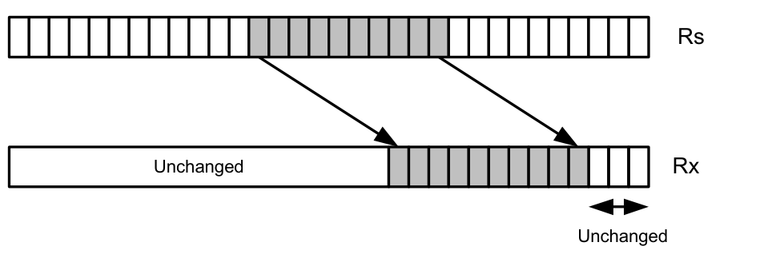

```text
Rs
Unchanged Rx
Unchanged
```

| Syntax | Behavior |
|---|---|
| `Rx=tableidxb(Rs,#u4,#S6):raw` | `width=#u;`<br>`offset=#S;`<br>`field = Rs[(width+offset-1):offset];`<br>`Rx[(width-1+0):0]=field;` |
| `Rx=tableidxb(Rs,#u4,#U5)` | `Assembler mapped to: `<br>`"Rx=tableidxb(Rs,#u4,#U5):raw"` |
| `Rx=tableidxd(Rs,#u4,#S6):raw` | `width=#u;`<br>`offset=#S+3;`<br>`field = Rs[(width+offset-1):offset];`<br>`Rx[(width-1+3):3]=field;` |
| `Rx=tableidxd(Rs,#u4,#U5)` | `Assembler mapped to: "Rx = tableidxd(Rs, #u4, #U5-`<br>`3):raw"` |
| `Rx=tableidxh(Rs,#u4,#S6):raw` | `width=#u;`<br>`offset=#S+1;`<br>`field = Rs[(width+offset-1):offset];`<br>`Rx[(width-1+1):1]=field;` |
| `Rx=tableidxh(Rs,#u4,#U5)` | `Assembler mapped to: "Rx = tableidxh(Rs, #u4, #U5-`<br>`1):raw"` |
| `Rx=tableidxw(Rs,#u4,#S6):raw` | `width=#u;`<br>`offset=#S+2;`<br>`field = Rs[(width+offset-1):offset];`<br>`Rx[(width-1+2):2]=field;` |
| `Rx=tableidxw(Rs,#u4,#U5)` | `Assembler mapped to: "Rx= tableidxw(Rs, #u4, #U5-`<br>`2):raw"` |

##### Class: XTYPE (slots 2,3)

##### Intrinsics

```
Rx=tableidxb(Rs,#u4,#U5)Word32 Q6_R_tableidxb_RII(Word32 Rx, Word32 Rs, Word32
                         Iu4, Word32 IU5)
Rx=tableidxd(Rs,#u4,#U5)Word32 Q6_R_tableidxd_RII(Word32 Rx, Word32 Rs, Word32
                         Iu4, Word32 IU5)
Rx=tableidxh(Rs,#u4,#U5)Word32 Q6_R_tableidxh_RII(Word32 Rx, Word32 Rs, Word32
                         Iu4, Word32 IU5)
Rx=tableidxw(Rs,#u4,#U5)Word32 Q6_R_tableidxw_RII(Word32 Rx, Word32 Rs, Word32
                         Iu4, Word32 IU5)
```

##### Encoding

| 31 | 30 | 29 | 28 | 27 | 26 | 25 | 24 | 23 | 22 | 21 | 20 | 19 | 18 | 17 | 16 | 15 | 14 | 13 | 12 | 11 | 10 | 9 | 8 | 7 | 6 | 5 | 4 | 3 | 2 | 1 | 0 |  |
|---|---|---|---|---|---|---|---|---|---|---|---|---|---|---|---|---|---|---|---|---|---|---|---|---|---|---|---|---|---|---|---|---|
| ICLASS | ICLASS | ICLASS | ICLASS | RegType | RegType | RegType | RegType | MajOp | MajOp |  | s5 | s5 | s5 | s5 | s5 | Parse | Parse |  |  |  |  |  |  | MinOp | MinOp | MinOp | x5 | x5 | x5 | x5 | x5 |  |
| 1 | 0 | 0 | 0 | 0 | 1 | 1 | 1 | 0 | 0 | i | s | s | s | s | s | P | P | I | I | I | I | I | I | i | i | i | x | x | x | x | x | Rx=tableidxb(Rs,#u4,#S6):raw |
| 1 | 0 | 0 | 0 | 0 | 1 | 1 | 1 | 0 | 1 | i | s | s | s | s | s | P | P | I | I | I | I | I | I | i | i | i | x | x | x | x | x | Rx=tableidxh(Rs,#u4,#S6):raw |
| 1 | 0 | 0 | 0 | 0 | 1 | 1 | 1 | 1 | 0 | i | s | s | s | s | s | P | P | I | I | I | I | I | I | i | i | i | x | x | x | x | x | Rx=tableidxw(Rs,#u4,#S6): raw |
| 1 | 0 | 0 | 0 | 0 | 1 | 1 | 1 | 1 | 1 | i | s | s | s | s | s | P | P | I | I | I | I | I | I | i | i | i | x | x | x | x | x | Rx=tableidxd(Rs,#u4,#S6):raw |

| Field name | Description |
|---|---|
| `ICLASS` | Instruction class |
| `Parse` | Packet/loop parse bits |
| `s5` | Field to encode register s |
| `x5` | Field to encode register x |
| `MajOp` | Major opcode |
| `MinOp` | Minor opcode |
| `RegType` | Register type |

### 11.10.3 XTYPE COMPLEX

The XTYPE COMPLEX instruction subclass includes instructions that are for complex math, using imaginary values.

#### Complex add/sub halfwords

Cross vector add-sub or sub-add instructions perform X + jY and X - jY complex operations. Each 16-bit result is saturated to 16 bits.

Rdd=vxaddsubh(Rss,Rtt):sat

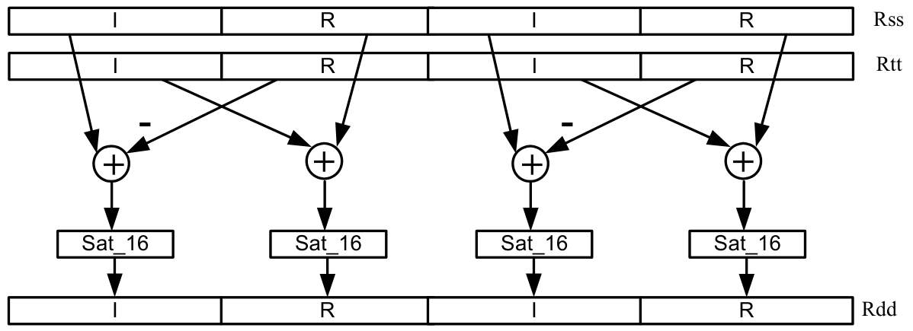

```text
I R I R Rss
I R I R Rtt
- -
+ + + +
Sat_16 Sat_16 Sat_16 Sat_16
I R I R Rdd
```

Rdd=vxsubaddh(Rss,Rt):rnd:>>1:sat

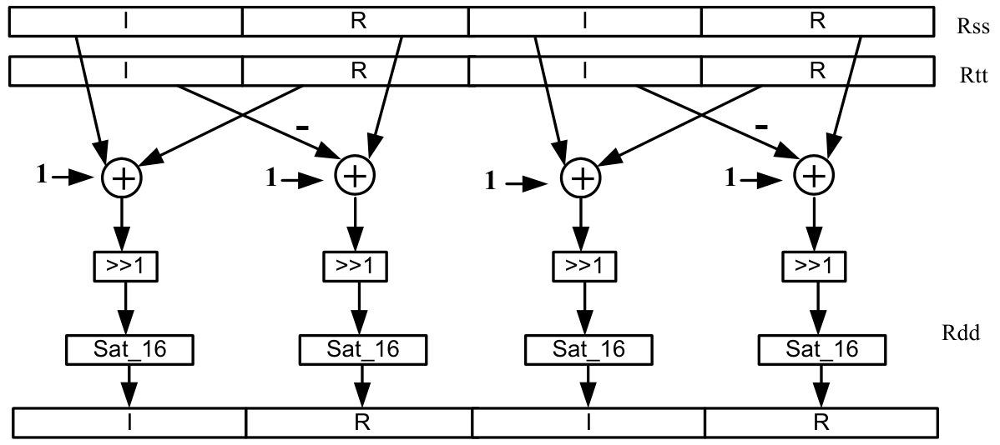

```text
I R I R Rss
I R I R Rtt
- -
¹ +¹ +¹ +¹ +
>>1 >>1 >>1 >>1
Rdd
Sat_16 Sat_16 Sat_16 Sat_16
I R I R
```

##### Class: XTYPE (slots 2,3)

| Syntax | Behavior |
|---|---|
| `Rdd= `<br>`vxaddsubh(Rss,Rtt):rnd:>>1:sat` | `Rdd.h[0]=sat₁₆((Rss.h[0]+Rtt.h[1]+1)>>1);`<br>`Rdd.h[1]=sat₁₆((Rss.h[1]-Rtt.h[0]+1)>>1);`<br>`Rdd.h[2]=sat₁₆((Rss.h[2]+Rtt.h[3]+1)>>1);`<br>`Rdd.h[3]=sat₁₆((Rss.h[3]-Rtt.h[2]+1)>>1);` |
| `Rdd=vxaddsubh(Rss,Rtt):sat` | `Rdd.h[0]=sat₁₆(Rss.h[0]+Rtt.h[1]);`<br>`Rdd.h[1]=sat₁₆(Rss.h[1]-Rtt.h[0]);`<br>`Rdd.h[2]=sat₁₆(Rss.h[2]+Rtt.h[3]);`<br>`Rdd.h[3]=sat₁₆(Rss.h[3]-Rtt.h[2]);` |
| `Rdd= `<br>`vxsubaddh(Rss,Rtt):rnd:>>1:sat` | `Rdd.h[0]=sat₁₆((Rss.h[0]-Rtt.h[1]+1)>>1);`<br>`Rdd.h[1]=sat₁₆((Rss.h[1]+Rtt.h[0]+1)>>1);`<br>`Rdd.h[2]=sat₁₆((Rss.h[2]-Rtt.h[3]+1)>>1);`<br>`Rdd.h[3]=sat₁₆((Rss.h[3]+Rtt.h[2]+1)>>1);` |
| `Rdd=vxsubaddh(Rss,Rtt):sat` | `Rdd.h[0]=sat₁₆(Rss.h[0]-Rtt.h[1]);`<br>`Rdd.h[1]=sat₁₆(Rss.h[1]+Rtt.h[0]);`<br>`Rdd.h[2]=sat₁₆(Rss.h[2]-Rtt.h[3]);`<br>`Rdd.h[3]=sat₁₆(Rss.h[3]+Rtt.h[2]);` |

##### Notes

- If saturation occurs during execution of this instruction (a result clamps to either maximum or minimum values), the OVF bit in the status register is set. OVF remains set until explicitly cleared by a transfer to the status register.

##### Intrinsics

|  |  |
|---|---|
| `Rdd=` | `Word64 Q6_P_vxaddsubh_PP_rnd_rs1_sat(Word64` |
| `vxaddsubh(Rss,Rtt):rnd:>>1:sat` | `Rss, Word64 Rtt)` |
| `Rdd=vxaddsubh(Rss,Rtt):sat` | `Word64 Q6_P_vxaddsubh_PP_sat(Word64 Rss, Word64 Rtt)` |
| `Rdd=` | `Word64 Q6_P_vxsubaddh_PP_rnd_rs1_sat(Word64` |
| `vxsubaddh(Rss,Rtt):rnd:>>1:sat` | `Rss, Word64 Rtt)` |
| `Rdd=vxsubaddh(Rss,Rtt):sat` | `Word64 Q6_P_vxsubaddh_PP_sat(Word64 Rss, Word64 Rtt)` |

##### Encoding

| 31 | 30 | 29 | 28 | 27 | 26 | 25 | 24 | 23 | 22 | 21 | 20 | 19 | 18 | 17 | 16 | 15 | 14 | 13 | 12 | 11 | 10 | 9 | 8 | 7 | 6 | 5 | 4 | 3 | 2 | 1 | 0 |  |
|---|---|---|---|---|---|---|---|---|---|---|---|---|---|---|---|---|---|---|---|---|---|---|---|---|---|---|---|---|---|---|---|---|
| ICLASS | ICLASS | ICLASS | ICLASS | RegType | RegType | RegType | RegType | Maj | Maj |  | s5 | s5 | s5 | s5 | s5 | Parse | Parse |  | t5 | t5 | t5 | t5 | t5 | Min | Min |  | d5 | d5 | d5 | d5 | d5 |  |
| 1 | 1 | 0 | 0 | 0 | 0 | 0 | 1 | 0 | 1 | - | s | s | s | s | s | P | P | - | t | t | t | t | t | 1 | 0 | 0 | d | d | d | d | d | Rdd=vxaddsubh(Rss,Rtt):sat |
| 1 | 1 | 0 | 0 | 0 | 0 | 0 | 1 | 0 | 1 | - | s | s | s | s | s | P | P | - | t | t | t | t | t | 1 | 1 | 0 | d | d | d | d | d | Rdd=vxsubaddh(Rss,Rtt):sat |
| 1 | 1 | 0 | 0 | 0 | 0 | 0 | 1 | 1 | 1 | - | s | s | s | s | s | P | P | - | t | t | t | t | t | 0 | 0 | - | d | d | d | d | d | Rdd=vxaddsubh(Rss,Rtt):rnd:>>1:sat |
| 1 | 1 | 0 | 0 | 0 | 0 | 0 | 1 | 1 | 1 | - | s | s | s | s | s | P | P | - | t | t | t | t | t | 0 | 1 | - | d | d | d | d | d | Rdd=vxsubaddh(Rss,Rtt):rnd:>>1:sat |

| Field name | Description |
|---|---|
| `ICLASS` | Instruction class |
| `Parse` | Packet/loop parse bits |
| `d5` | Field to encode register d |
| `s5` | Field to encode register s |
| `t5` | Field to encode register t |
| `Maj` | Major opcode |
| `Min` | Minor opcode |
| `RegType` | Register type |

#### Complex add/sub words

Cross vector add-sub or sub-add instructions perform X+jY and X-jY complex operations. Each 32-bit result is saturated to 32 bits.

Rdd=vxaddsubw(Rss,Rt):sat Rdd=vxsubaddw(Rss,Rt):sat

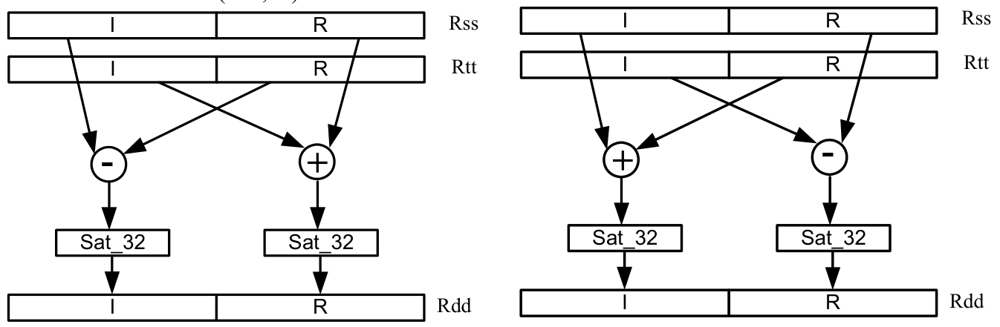

```text
I R Rss I R Rss
I R Rtt I R Rtt
- + + -
Sat_32 Sat_32 Sat_32 Sat_32
I R Rdd I R Rdd
```

| Syntax | Behavior |
|---|---|
| `Rdd=vxaddsubw(Rss,Rtt):sat` | `Rdd.w[0]=sat₃₂(Rss.w[0]+Rtt.w[1]);`<br>`Rdd.w[1]=sat₃₂(Rss.w[1]-Rtt.w[0]);` |
| `Rdd=vxsubaddw(Rss,Rtt):sat` | `Rdd.w[0]=sat₃₂(Rss.w[0]-Rtt.w[1]);`<br>`Rdd.w[1]=sat₃₂(Rss.w[1]+Rtt.w[0]);` |

##### Class: XTYPE (slots 2,3)

##### Notes

- If saturation occurs during execution of this instruction (a result is clamped to either maximum or minimum values), the OVF bit in the status register is set. OVF remains set until explicitly cleared by a transfer to the status register.

##### Intrinsics

|  |  |
|---|---|
| `Rdd=vxaddsubw(Rss,Rtt):sat` | `Word64 Q6_P_vxaddsubw_PP_sat(Word64 Rss, Word64 Rtt)` |
| `Rdd=vxsubaddw(Rss,Rtt):sat` | `Word64 Q6_P_vxsubaddw_PP_sat(Word64 Rss, Word64 Rtt)` |

##### Encoding

| 31 | 30 | 29 | 28 | 27 | 26 | 25 | 24 | 23 | 22 | 21 | 20 | 19 | 18 | 17 | 16 | 15 | 14 | 13 | 12 | 11 | 10 | 9 | 8 | 7 | 6 | 5 | 4 | 3 | 2 | 1 | 0 |  |
|---|---|---|---|---|---|---|---|---|---|---|---|---|---|---|---|---|---|---|---|---|---|---|---|---|---|---|---|---|---|---|---|---|
| ICLASS | ICLASS | ICLASS | ICLASS | RegType | RegType | RegType | RegType | Maj | Maj |  | s5 | s5 | s5 | s5 | s5 | Parse | Parse |  | t5 | t5 | t5 | t5 | t5 | Min | Min |  | d5 | d5 | d5 | d5 | d5 |  |
| 1 | 1 | 0 | 0 | 0 | 0 | 0 | 1 | 0 | 1 | - | s | s | s | s | s | P | P | - | t | t | t | t | t | 0 | 0 | 0 | d | d | d | d | d | Rdd=vxaddsubw(Rss,Rtt):sat |
| 1 | 1 | 0 | 0 | 0 | 0 | 0 | 1 | 0 | 1 | - | s | s | s | s | s | P | P | - | t | t | t | t | t | 0 | 1 | 0 | d | d | d | d | d | Rdd=vxsubaddw(Rss,Rtt):sat |

| Field name | Description |
|---|---|
| `ICLASS` | Instruction class |
| `Parse` | Packet/loop parse bits |
| `d5` | Field to encode register d |
| `s5` | Field to encode register s |
| `t5` | Field to encode register t |
| `Maj` | Major opcode |
| `Min` | Minor opcode |
| `RegType` | Register type |

#### Complex multiply

Multiply complex values Rs and Rt. The inputs have a real 16-bit value in the low halfword and an imaginary 16-bit value in the high halfword. Optionally, scale the result by 0-1 bits. Optionally, add a complex accumulator. Saturate the real and imaginary portions to 32-bits. The output has a real 32-bit value in the low word and an imaginary 32-bit value in the high word. The Rt input can be optionally conjugated. Another option is to subtracted the result from the destination rather than accumulate it.

Rxx+=cmpy(Rs,Rt):sat

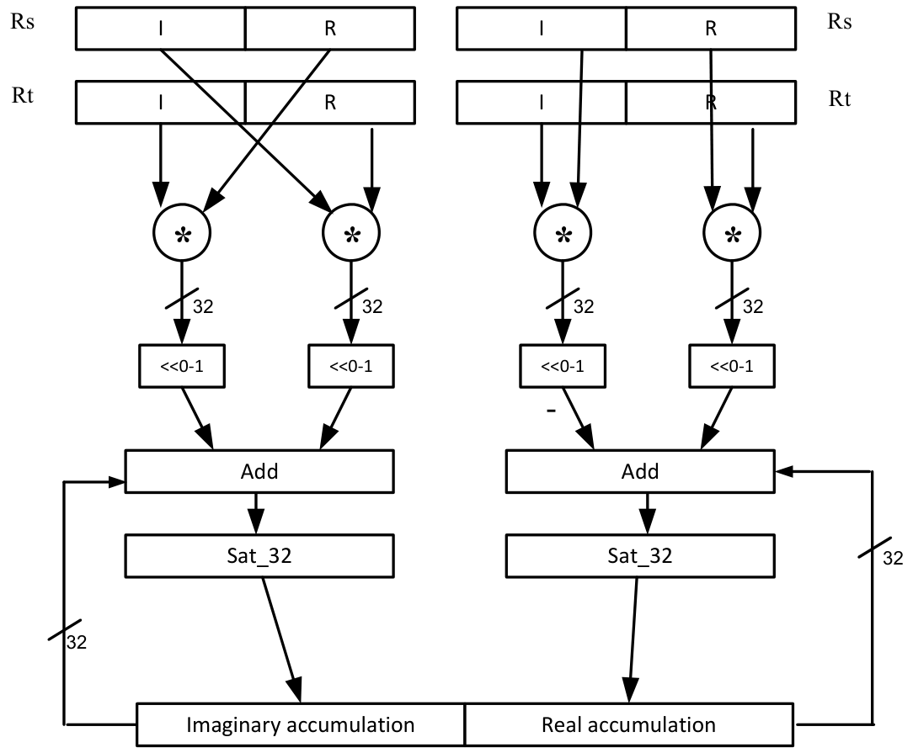

```text
Rs Rs
I R I R
Rt I R I R Rt
32 32 32 32
<<0-1 <<0-1 <<0-1 <<0-1
-
Add Add
Sat_32 Sat_32₃₂
32
Imaginary accumulation Real accumulation
```

Rxx

| Syntax | Behavior |
|---|---|
| `Rdd=cmpy(Rs,Rt)[:<<1]:sat` | `Rdd.w[1]=sat₃₂((Rs.h[1] * Rt.h[0])[<<1] + (Rs.h[0] * `<br>`Rt.h[1])[<<1]);`<br>`Rdd.w[0]=sat₃₂((Rs.h[0] * Rt.h[0])[<<1] - (Rs.h[1] * `<br>`Rt.h[1])[<<1]);` |
| `Rdd= `<br>`cmpy(Rs,Rt*)[:<<1]:sat` | `Rdd.w[1]=sat₃₂((Rs.h[1] * Rt.h[0])[<<1] - (Rs.h[0] * `<br>`Rt.h[1])[<<1]);`<br>`Rdd.w[0]=sat₃₂((Rs.h[0] * Rt.h[0])[<<1] + (Rs.h[1] * `<br>`Rt.h[1])[<<1]);` |
| `Rxx+= `<br>`cmpy(Rs,Rt)[:<<1]:sat` | `Rxx.w[1]=sat₃₂(Rxx.w[1] + (Rs.h[1] * Rt.h[0])[<<1] + `<br>`(Rs.h[0] * Rt.h[1])[<<1]);`<br>`Rxx.w[0]=sat₃₂(Rxx.w[0] + (Rs.h[0] * Rt.h[0])[<<1] - `<br>`(Rs.h[1] * Rt.h[1])[<<1]);` |
| `Rxx+= `<br>`cmpy(Rs,Rt*)[:<<1]:sat` | `Rxx.w[1]=sat₃₂(Rxx.w[1] + (Rs.h[1] * Rt.h[0])[<<1] - `<br>`(Rs.h[0] * Rt.h[1])[<<1]);`<br>`Rxx.w[0]=sat₃₂(Rxx.w[0] + (Rs.h[0] * Rt.h[0])[<<1] + `<br>`(Rs.h[1] * Rt.h[1])[<<1]);` |
| `Rxx-`<br>`=cmpy(Rs,Rt)[:<<1]:sat` | `Rxx.w[1]=sat₃₂(Rxx.w[1] - ((Rs.h[1] * Rt.h[0])[<<1] + `<br>`(Rs.h[0] * Rt.h[1])[<<1]));`<br>`Rxx.w[0]=sat₃₂(Rxx.w[0] - ((Rs.h[0] * Rt.h[0])[<<1] - `<br>`(Rs.h[1] * Rt.h[1])[<<1]));` |
| `Rxx-`<br>`=cmpy(Rs,Rt*)[:<<1]:sat` | `Rxx.w[1]=sat₃₂(Rxx.w[1] - ((Rs.h[1] * Rt.h[0])[<<1] - `<br>`(Rs.h[0] * Rt.h[1])[<<1]));`<br>`Rxx.w[0]=sat₃₂(Rxx.w[0] - ((Rs.h[0] * Rt.h[0])[<<1] + `<br>`(Rs.h[1] * Rt.h[1])[<<1]));` |

##### Class: XTYPE (slots 2,3)

##### Notes

- If saturation occurs during execution of this instruction (a result is clamped to either maximum or minimum values), the OVF bit in the status register is set. OVF remains set until explicitly cleared by a transfer to the status register.

##### Intrinsics

|  |  |
|---|---|
| `Rdd=cmpy(Rs,Rt):<<1:sat` | `Word64 Q6_P_cmpy_RR_s1_sat(Word32 Rs, Word32 Rt)` |
| `Rdd=cmpy(Rs,Rt):sat` | `Word64 Q6_P_cmpy_RR_sat(Word32 Rs, Word32 Rt)` |
| `Rdd=cmpy(Rs,Rt*):<<1:sat` | `Word64 Q6_P_cmpy_RR_conj_s1_sat(Word32 Rs, Word32 Rt)` |
| `Rdd=cmpy(Rs,Rt*):sat` | `Word64 Q6_P_cmpy_RR_conj_sat(Word32 Rs, Word32 Rt)` |
| `Rxx+=cmpy(Rs,Rt):<<1:sat` | `Word64 Q6_P_cmpyacc_RR_s1_sat(Word64 Rxx, Word32 Rs, Word32 Rt)` |
| `Rxx+=cmpy(Rs,Rt):sat` | `Word64 Q6_P_cmpyacc_RR_sat(Word64 Rxx, Word32 Rs, Word32 Rt)` |
| `Rxx+=` | `Word64 Q6_P_cmpyacc_RR_conj_s1_sat(Word64 Rxx, Word32` |
| `cmpy(Rs,Rt*):<<1:sat` | `Rs, Word32 Rt)` |
| `Rxx+=cmpy(Rs,Rt*):sat` | `Word64 Q6_P_cmpyacc_RR_conj_sat(Word64 Rxx, Word32 Rs, Word32 Rt)` |
| `Rxx-=cmpy(Rs,Rt):<<1:sat` | `Word64 Q6_P_cmpynac_RR_s1_sat(Word64 Rxx, Word32 Rs, Word32 Rt)` |
| `Rxx-=cmpy(Rs,Rt):sat` | `Word64 Q6_P_cmpynac_RR_sat(Word64 Rxx, Word32 Rs, Word32 Rt)` |
| `Rxx-` | `Word64 Q6_P_cmpynac_RR_conj_s1_sat(Word64 Rxx, Word32` |
| `=cmpy(Rs,Rt*):<<1:sat` | `Rs, Word32 Rt)` |
| `Rxx-=cmpy(Rs,Rt*):sat` | `Word64 Q6_P_cmpynac_RR_conj_sat(Word64 Rxx, Word32 Rs, Word32 Rt)` |

##### Encoding

| 31 | 30 | 29 | 28 | 27 | 26 | 25 | 24 | 23 | 22 | 21 | 20 | 19 | 18 | 17 | 16 | 15 | 14 | 13 | 12 | 11 | 10 | 9 | 8 | 7 | 6 | 5 | 4 | 3 | 2 | 1 | 0 |  |
|---|---|---|---|---|---|---|---|---|---|---|---|---|---|---|---|---|---|---|---|---|---|---|---|---|---|---|---|---|---|---|---|---|
| ICLASS | ICLASS | ICLASS | ICLASS | RegType | RegType | RegType | RegType | MajOp | MajOp | MajOp | s5 | s5 | s5 | s5 | s5 | Parse | Parse |  | t5 | t5 | t5 | t5 | t5 | MinOp | MinOp | MinOp | d5 | d5 | d5 | d5 | d5 |  |
| 1 | 1 | 1 | 0 | 0 | 1 | 0 | 1 | N | 0 | 0 | s | s | s | s | s | P | P | 0 | t | t | t | t | t | 1 | 1 | 0 | d | d | d | d | d | Rdd=cmpy(Rs,Rt)[:<<N]:sat |
| 1 | 1 | 1 | 0 | 0 | 1 | 0 | 1 | N | 1 | 0 | s | s | s | s | s | P | P | 0 | t | t | t | t | t | 1 | 1 | 0 | d | d | d | d | d | Rdd=cmpy(Rs,Rt*)[:<<N]:sat |
| ICLASS | ICLASS | ICLASS | ICLASS | RegType | RegType | RegType | RegType | MajOp | MajOp | MajOp | s5 | s5 | s5 | s5 | s5 | Parse | Parse |  | t5 | t5 | t5 | t5 | t5 | MinOp | MinOp | MinOp | x5 | x5 | x5 | x5 | x5 |  |
| 1 | 1 | 1 | 0 | 0 | 1 | 1 | 1 | N | 0 | 0 | s | s | s | s | s | P | P | 0 | t | t | t | t | t | 1 | 1 | 0 | x | x | x | x | x | Rxx+=cmpy(Rs,Rt)[:<<N]:sat |
| 1 | 1 | 1 | 0 | 0 | 1 | 1 | 1 | N | 0 | 0 | s | s | s | s | s | P | P | 0 | t | t | t | t | t | 1 | 1 | 1 | x | x | x | x | x | Rxx-=cmpy(Rs,Rt)[:<<N]:sat |
| 1 | 1 | 1 | 0 | 0 | 1 | 1 | 1 | N | 1 | 0 | s | s | s | s | s | P | P | 0 | t | t | t | t | t | 1 | 1 | 0 | x | x | x | x | x | Rxx+=cmpy(Rs,Rt*)[:<<N]: sat |
| 1 | 1 | 1 | 0 | 0 | 1 | 1 | 1 | N | 1 | 0 | s | s | s | s | s | P | P | 0 | t | t | t | t | t | 1 | 1 | 1 | x | x | x | x | x | Rxx-=cmpy(Rs,Rt*)[:<<N]:sat |

| Field name | Description |
|---|---|
| `ICLASS` | Instruction class |
| `MajOp` | Major opcode |
| `MinOp` | Minor opcode |
| `RegType` | Register type |
| `Parse` | Packet/loop parse bits |
| `d5` | Field to encode register d |
| Field name | Description |
| `s5` | Field to encode register s |
| `t5` | Field to encode register t |
| `x5` | Field to encode register x |

#### Complex multiply real or imaginary

Multiply complex values Rs and Rt. The inputs have a real 16-bit value in the low halfword and an imaginary 16-bit value in the high halfword. Take either the real or imaginary result and optionally accumulate with a 64-bit destination.

Rxx+=cmpyi(Rs,Rt)

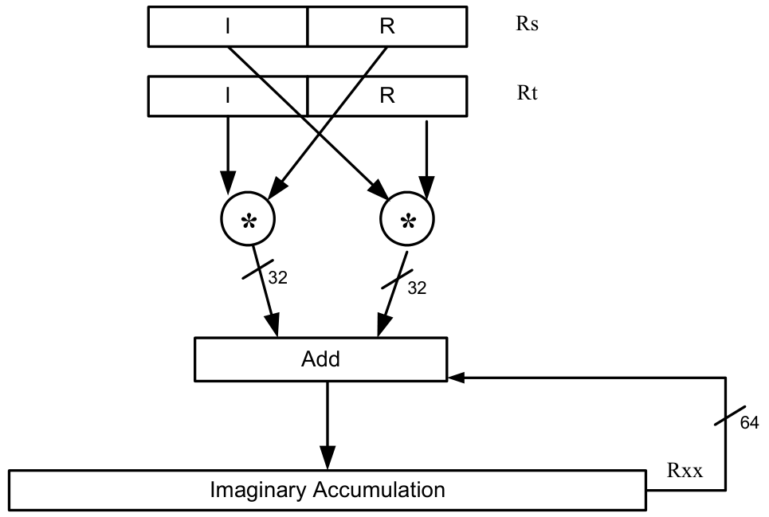

```text
I R Rs
I R Rt
32
32
Add
64
Rxx
Imaginary Accumulation
```

| Syntax | Behavior |
|---|---|
| `Rdd=cmpyi(Rs,Rt)` | `Rdd = (Rs.h[1] * Rt.h[0]) + (Rs.h[0] * Rt.h[1]);` |
| `Rdd=cmpyr(Rs,Rt)` | `Rdd = (Rs.h[0] * Rt.h[0]) - (Rs.h[1] * Rt.h[1]);` |
| `Rxx+=cmpyi(Rs,Rt)` | `Rxx = Rxx + (Rs.h[1] * Rt.h[0]) + (Rs.h[0] * `<br>`Rt.h[1]);` |
| `Rxx+=cmpyr(Rs,Rt)` | `Rxx = Rxx + (Rs.h[0] * Rt.h[0]) - (Rs.h[1] * `<br>`Rt.h[1]);` |

##### Class: XTYPE (slots 2,3)

##### Intrinsics

|  |  |
|---|---|
| `Rdd=cmpyi(Rs,Rt)` | `Word64 Q6_P_cmpyi_RR(Word32 Rs, Word32 Rt)` |
| `Rdd=cmpyr(Rs,Rt)` | `Word64 Q6_P_cmpyr_RR(Word32 Rs, Word32 Rt)` |
| `Rxx+=cmpyi(Rs,Rt)` | `Word64 Q6_P_cmpyiacc_RR(Word64 Rxx, Word32 Rs, Word32 Rt)` |
| `Rxx+=cmpyr(Rs,Rt)` | `Word64 Q6_P_cmpyracc_RR(Word64 Rxx, Word32 Rs, Word32 Rt)` |

##### Encoding

| 31 | 30 | 29 | 28 | 27 | 26 | 25 | 24 | 23 | 22 | 21 | 20 | 19 | 18 | 17 | 16 | 15 | 14 | 13 | 12 | 11 | 10 | 9 | 8 | 7 | 6 | 5 | 4 | 3 | 2 | 1 | 0 |  |
|---|---|---|---|---|---|---|---|---|---|---|---|---|---|---|---|---|---|---|---|---|---|---|---|---|---|---|---|---|---|---|---|---|
| ICLASS | ICLASS | ICLASS | ICLASS | RegType | RegType | RegType | RegType | MajOp | MajOp | MajOp | s5 | s5 | s5 | s5 | s5 | Parse | Parse |  | t5 | t5 | t5 | t5 | t5 | MinOp | MinOp | MinOp | d5 | d5 | d5 | d5 | d5 |  |
| 1 | 1 | 1 | 0 | 0 | 1 | 0 | 1 | 0 | 0 | 0 | s | s | s | s | s | P | P | 0 | t | t | t | t | t | 0 | 0 | 1 | d | d | d | d | d | Rdd=cmpyi(Rs,Rt) |
| 1 | 1 | 1 | 0 | 0 | 1 | 0 | 1 | 0 | 0 | 0 | s | s | s | s | s | P | P | 0 | t | t | t | t | t | 0 | 1 | 0 | d | d | d | d | d | Rdd=cmpyr(Rs,Rt) |
| ICLASS | ICLASS | ICLASS | ICLASS | RegType | RegType | RegType | RegType | MajOp | MajOp | MajOp | s5 | s5 | s5 | s5 | s5 | Parse | Parse |  | t5 | t5 | t5 | t5 | t5 | MinOp | MinOp | MinOp | x5 | x5 | x5 | x5 | x5 |  |
| 1 | 1 | 1 | 0 | 0 | 1 | 1 | 1 | 0 | 0 | 0 | s | s | s | s | s | P | P | 0 | t | t | t | t | t | 0 | 0 | 1 | x | x | x | x | x | Rxx+=cmpyi(Rs,Rt) |
| 1 | 1 | 1 | 0 | 0 | 1 | 1 | 1 | 0 | 0 | 0 | s | s | s | s | s | P | P | 0 | t | t | t | t | t | 0 | 1 | 0 | x | x | x | x | x | Rxx+=cmpyr(Rs,Rt) |

| Field name | Description |
|---|---|
| `ICLASS` | Instruction class |
| `MajOp` | Major opcode |
| `MinOp` | Minor opcode |
| `RegType` | Register type |
| `Parse` | Packet/loop parse bits |
| `d5` | Field to encode register d |
| `s5` | Field to encode register s |
| `t5` | Field to encode register t |
| `x5` | Field to encode register x |

#### Complex multiply with round and pack

Multiply complex values Rs and Rt. The inputs have a real 16-bit value in the low halfword and an imaginary 16-bit value in the high halfword. The Rt input is optionally conjugated. The multiplier results are optionally scaled by 0 to 1 bits. A rounding constant is added to each real and imaginary sum. The real and imaginary parts are individually saturated to 32 bits. The upper 16 bits of each 32-bit results are packed in a 32-bit destination register.

Rd=cmpy(Rs,Rt):rnd:sat

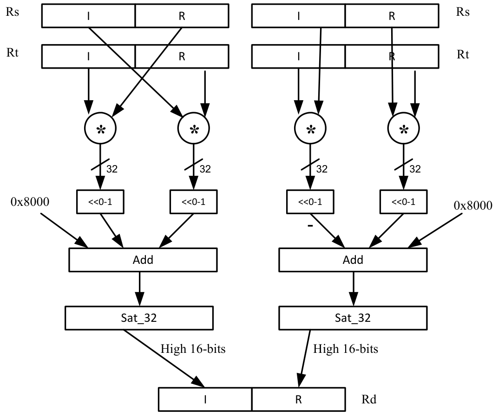

```text
Rs Rs
I R I R
Rt Rt
I R I R
32 32 32 32
0x8000<<0-1<<0-1<<0-1<<0-1 0x8000
-
Add Add
Sat_32 Sat_32
High 16-bits High 16-bits
I R Rd
```

| Syntax | Behavior |
|---|---|
| `Rd=cmpy(Rs,Rt)[:<<1]:rnd:s`<br>`at` | `Rd.h[1]=(sat₃₂((Rs.h[1] * Rt.h[0])[<<1] + (Rs.h[0] `<br>`* Rt.h[1])[<<1] + 0x8000)).h[1];`<br>`Rd.h[0]=(sat₃₂((Rs.h[0] * Rt.h[0])[<<1] - (Rs.h[1] `<br>`* Rt.h[1])[<<1] + 0x8000)).h[1];` |
| `Rd=cmpy(Rs,Rt*)[:<<1]:rnd:`<br>`sat` | `Rd.h[1]=(sat₃₂((Rs.h[1] * Rt.h[0])[<<1] - (Rs.h[0] `<br>`* Rt.h[1])[<<1] + 0x8000)).h[1];`<br>`Rd.h[0]=(sat₃₂((Rs.h[0] * Rt.h[0])[<<1] + (Rs.h[1] `<br>`* Rt.h[1])[<<1] + 0x8000)).h[1];` |

##### Class: XTYPE (slots 2,3)

##### Notes

- If saturation occurs during execution of this instruction (a result is clamped to either maximum or minimum values), the OVF bit in the status register is set. OVF remains set until explicitly cleared by a transfer to the status register.

##### Intrinsics

```
Rd=cmpy(Rs,Rt):<<1:rnd:saWord32 Q6_R_cmpy_RR_s1_rnd_sat(Word32 Rs, Word32 Rt)
t
```

|  |  |
|---|---|
| `Rd=cmpy(Rs,Rt):rnd:sat` | `Word32 Q6_R_cmpy_RR_rnd_sat(Word32 Rs, Word32 Rt)` |
| `Rd=cmpy(Rs,Rt*):<<1:rnd:s` | `Word32 Q6_R_cmpy_RR_conj_s1_rnd_sat(Word32 Rs,` |
| `at` | `Word32 Rt)` |
| `Rd=cmpy(Rs,Rt*):rnd:sat` | `Word32 Q6_R_cmpy_RR_conj_rnd_sat(Word32 Rs, Word32 Rt)` |

##### Encoding

| 31 | 30 | 29 | 28 | 27 | 26 | 25 | 24 | 23 | 22 | 21 | 20 | 19 | 18 | 17 | 16 | 15 | 14 | 13 | 12 | 11 | 10 | 9 | 8 | 7 | 6 | 5 | 4 | 3 | 2 | 1 | 0 |  |
|---|---|---|---|---|---|---|---|---|---|---|---|---|---|---|---|---|---|---|---|---|---|---|---|---|---|---|---|---|---|---|---|---|
| ICLASS | ICLASS | ICLASS | ICLASS | RegType | RegType | RegType | RegType | MajOp | MajOp | MajOp | s5 | s5 | s5 | s5 | s5 | Parse | Parse |  | t5 | t5 | t5 | t5 | t5 | MinOp | MinOp | MinOp | d5 | d5 | d5 | d5 | d5 |  |
| 1 | 1 | 1 | 0 | 1 | 1 | 0 | 1 | N | 0 | 1 | s | s | s | s | s | P | P | 0 | t | t | t | t | t | 1 | 1 | 0 | d | d | d | d | d | Rd=cmpy(Rs,Rt)[:<<N]:rnd: sat |
| 1 | 1 | 1 | 0 | 1 | 1 | 0 | 1 | N | 1 | 1 | s | s | s | s | s | P | P | 0 | t | t | t | t | t | 1 | 1 | 0 | d | d | d | d | d | Rd=cmpy(Rs,Rt*)[:<<N]:rnd:sat |

| Field name | Description |
|---|---|
| `ICLASS` | Instruction class |
| `MajOp` | Major opcode |
| `MinOp` | Minor opcode |
| `RegType` | Register type |
| `Parse` | Packet/loop parse bits |
| `d5` | Field to encode register d |
| `s5` | Field to encode register s |
| `t5` | Field to encode register t |

#### Complex multiply 32 × 16

Multiply 32 by 16 bit complex values Rss and Rt. The inputs have a real value in the low part of a

register and the imaginary value in the upper part. The multiplier results are scaled by 1 bit and

accumulated with a rounding constant. The result is saturated to 32 bits.

Rd=cmpyrwh(Rss,Rt):<<1:rnd:sat Rd=cmpyiwh(Rss,Rt):<<1:rnd:sat

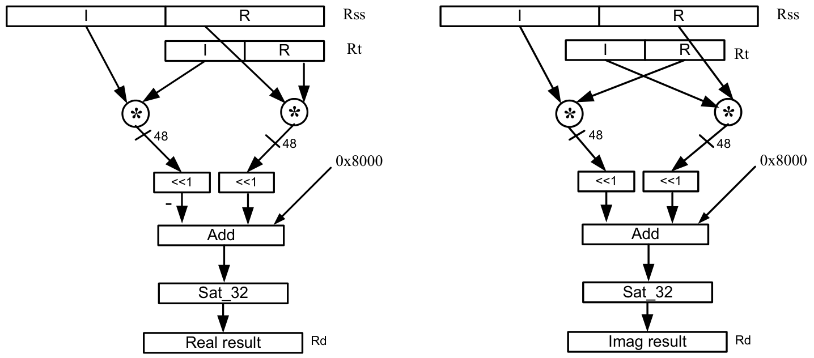

```text
I R Rss I R Rss
I R Rt I R Rt
₄₈₄₈ ₄₈₄₈
0x8000 0x8000
<<1 <<1 <<1 <<1
-
Add Add
Sat_32 Sat_32
Real resultRd Imag resultRd
```

| Syntax | Behavior |
|---|---|
| `Rd=cmpyiwh(Rss,Rt):<<1:rnd:s`<br>`at` | `Rd = sat₃₂(( (Rss.w[0] * Rt.h[1]) + (Rss.w[1] * `<br>`Rt.h[0]) + 0x4000)>>15);` |
| `Rd=cmpyiwh(Rss,Rt*):<<1:rnd:`<br>`sat` | `Rd = sat₃₂(( (Rss.w[1] * Rt.h[0]) - (Rss.w[0] * `<br>`Rt.h[1]) + 0x4000)>>15);` |
| `Rd=cmpyrwh(Rss,Rt):<<1:rnd:s`<br>`at` | `Rd = sat₃₂(( (Rss.w[0] * Rt.h[0]) - (Rss.w[1] * `<br>`Rt.h[1]) + 0x4000)>>15);` |
| `Rd=cmpyrwh(Rss,Rt*):<<1:rnd:`<br>`sat` | `Rd = sat₃₂(( (Rss.w[0] * Rt.h[0]) + (Rss.w[1] * `<br>`Rt.h[1]) + 0x4000)>>15);` |

##### Class: XTYPE (slots 2,3)

##### Notes

- If saturation occurs during execution of this instruction (a result is clamped to either maximum or minimum values), the OVF bit in the status register is set. OVF remains set until explicitly cleared by a transfer to the status register.

##### Intrinsics

|  |  |
|---|---|
| `Rd=cmpyiwh(Rss,Rt):<<1:rnd:s` | `Word32 Q6_R_cmpyiwh_PR_s1_rnd_sat(Word64 Rss,` |
| `at` | `Word32 Rt)` |
| `Rd=cmpyiwh(Rss,Rt*):<<1:rnd:` | `Word32 Q6_R_cmpyiwh_PR_conj_s1_rnd_sat(Word64` |
| `sat` | `Rss, Word32 Rt)` |
| `Rd=cmpyrwh(Rss,Rt):<<1:rnd:s` | `Word32 Q6_R_cmpyrwh_PR_s1_rnd_sat(Word64 Rss,` |
| `at` | `Word32 Rt)` |
| `Rd=cmpyrwh(Rss,Rt*):<<1:rnd:` | `Word32 Q6_R_cmpyrwh_PR_conj_s1_rnd_sat(Word64` |
| `sat` | `Rss, Word32 Rt)` |

##### Encoding

| 31 | 30 | 29 | 28 | 27 | 26 | 25 | 24 | 23 | 22 | 21 | 20 | 19 | 18 | 17 | 16 | 15 | 14 | 13 | 12 | 11 | 10 | 9 | 8 | 7 | 6 | 5 | 4 | 3 | 2 | 1 | 0 |  |
|---|---|---|---|---|---|---|---|---|---|---|---|---|---|---|---|---|---|---|---|---|---|---|---|---|---|---|---|---|---|---|---|---|
| ICLASS | ICLASS | ICLASS | ICLASS | RegType | RegType | RegType | RegType |  |  |  | s5 | s5 | s5 | s5 | s5 | Parse | Parse |  | t5 | t5 | t5 | t5 | t5 | Min | Min |  | d5 | d5 | d5 | d5 | d5 |  |
| 1 | 1 | 0 | 0 | 0 | 1 | 0 | 1 | - | - | - | s | s | s | s | s | P | P | - | t | t | t | t | t | 1 | 0 | 0 | d | d | d | d | d | Rd=cmpyiwh(Rss,Rt):<<1:rnd:sat |
| 1 | 1 | 0 | 0 | 0 | 1 | 0 | 1 | - | - | - | s | s | s | s | s | P | P | - | t | t | t | t | t | 1 | 0 | 1 | d | d | d | d | d | Rd=cmpyiwh(Rss,Rt*):<<1: rnd:sat |
| 1 | 1 | 0 | 0 | 0 | 1 | 0 | 1 | - | - | - | s | s | s | s | s | P | P | - | t | t | t | t | t | 1 | 1 | 0 | d | d | d | d | d | Rd=cmpyrwh(Rss,Rt):<<1:rnd:sat |
| 1 | 1 | 0 | 0 | 0 | 1 | 0 | 1 | - | - | - | s | s | s | s | s | P | P | - | t | t | t | t | t | 1 | 1 | 1 | d | d | d | d | d | Rd=cmpyrwh(Rss,Rt*):<<1: rnd:sat |

| Field name | Description |
|---|---|
| `ICLASS` | Instruction class |
| `Parse` | Packet/loop parse bits |
| `d5` | Field to encode register d |
| `s5` | Field to encode register s |
| `t5` | Field to encode register t |
| `Min` | Minor opcode |
| `RegType` | Register type |

#### Complex multiply real or imaginary 32-bit

Multiply complex values Rss and Rtt. The inputs have a real 32-bit value in the low word and an imaginary 32-bit value in the high word. Take either the real or imaginary result and optionally accumulate with a 64-bit destination.

| Syntax | Behavior |
|---|---|
| `Rd=cmpyiw(Rss,Rtt):<<1:rnd:s`<br>`at` | `tmp128 = sxt<sub>64->128</sub>((Rss.w[0] * Rtt.w[1]));`<br>`acc128 = sxt<sub>64->128</sub>((Rss.w[1] * Rtt.w[0]));`<br>`const128 = sxt<sub>64->128</sub>(0x40000000);`<br>`acc128 = tmp128+acc128;`<br>`acc128 = acc128+const128;`<br>`acc128 = (size8s_t) (acc128 >> 31);`<br>`acc64 = sxt<sub>128->64</sub>(acc128);`<br>`Rd = sat₃₂(acc64);` |
| `Rd=cmpyiw(Rss,Rtt):<<1:sat` | `tmp128 = sxt<sub>64->128</sub>((Rss.w[0] * Rtt.w[1]));`<br>`acc128 = sxt<sub>64->128</sub>((Rss.w[1] * Rtt.w[0]));`<br>`acc128 = tmp128+acc128;`<br>`acc128 = (size8s_t) (acc128 >> 31);`<br>`acc64 = sxt<sub>128->64</sub>(acc128);`<br>`Rd = sat₃₂(acc64);` |
| `Rd=cmpyiw(Rss,Rtt*):<<1:rnd:`<br>`sat` | `tmp128 = sxt<sub>64->128</sub>((Rss.w[1] * Rtt.w[0]));`<br>`acc128 = sxt<sub>64->128</sub>((Rss.w[0] * Rtt.w[1]));`<br>`const128 = sxt<sub>64->128</sub>(0x40000000);`<br>`acc128 = tmp128-acc128;`<br>`acc128 = acc128+const128;`<br>`acc128 = (size8s_t) (acc128 >> 31);`<br>`acc64 = sxt<sub>128->64</sub>(acc128);`<br>`Rd = sat₃₂(acc64);` |
| `Rd=cmpyiw(Rss,Rtt*):<<1:sat` | `tmp128 = sxt<sub>64->128</sub>((Rss.w[1] * Rtt.w[0]));`<br>`acc128 = sxt<sub>64->128</sub>((Rss.w[0] * Rtt.w[1]));`<br>`acc128 = tmp128-acc128;`<br>`acc128 = (size8s_t) (acc128 >> 31);`<br>`acc64 = sxt<sub>128->64</sub>(acc128);`<br>`Rd = sat₃₂(acc64);` |
| `Rd=cmpyrw(Rss,Rtt):<<1:rnd:s`<br>`at` | `tmp128 = sxt<sub>64->128</sub>((Rss.w[0] * Rtt.w[0]));`<br>`acc128 = sxt<sub>64->128</sub>((Rss.w[1] * Rtt.w[1]));`<br>`const128 = sxt<sub>64->128</sub>(0x40000000);`<br>`acc128 = tmp128-acc128;`<br>`acc128 = acc128+const128;`<br>`acc128 = (size8s_t) (acc128 >> 31);`<br>`acc64 = sxt<sub>128->64</sub>(acc128);`<br>`Rd = sat₃₂(acc64);` |
| `Rd=cmpyrw(Rss,Rtt):<<1:sat` | `tmp128 = sxt<sub>64->128</sub>((Rss.w[0] * Rtt.w[0]));`<br>`acc128 = sxt<sub>64->128</sub>((Rss.w[1] * Rtt.w[1]));`<br>`acc128 = tmp128-acc128;`<br>`acc128 = (size8s_t) (acc128 >> 31);`<br>`acc64 = sxt<sub>128->64</sub>(acc128);`<br>`Rd = sat₃₂(acc64);` |
| `Rd=cmpyrw(Rss,Rtt*):<<1:rnd:`<br>`sat` | `tmp128 = sxt<sub>64->128</sub>((Rss.w[0] * Rtt.w[0]));`<br>`acc128 = sxt<sub>64->128</sub>((Rss.w[1] * Rtt.w[1]));`<br>`const128 = sxt<sub>64->128</sub>(0x40000000);`<br>`acc128 = tmp128+acc128;`<br>`acc128 = acc128+const128;`<br>`acc128 = (size8s_t) (acc128 >> 31);`<br>`acc64 = sxt<sub>128->64</sub>(acc128);`<br>`Rd = sat₃₂(acc64);` |
| `Rd=cmpyrw(Rss,Rtt*):<<1:sat` | `tmp128 = sxt<sub>64->128</sub>((Rss.w[0] * Rtt.w[0]));`<br>`acc128 = sxt<sub>64->128</sub>((Rss.w[1] * Rtt.w[1]));`<br>`acc128 = tmp128+acc128;`<br>`acc128 = (size8s_t) (acc128 >> 31);`<br>`acc64 = sxt<sub>128->64</sub>(acc128);`<br>`Rd = sat₃₂(acc64);` |
| `Rdd=cmpyiw(Rss,Rtt)` | `Rdd = ((Rss.w[0] * Rtt.w[1]) + (Rss.w[1] * `<br>`Rtt.w[0]));` |
| `Rdd=cmpyiw(Rss,Rtt*)` | `Rdd = ((Rss.w[1] * Rtt.w[0]) - (Rss.w[0] * `<br>`Rtt.w[1]));` |
| `Rdd=cmpyrw(Rss,Rtt)` | `Rdd = ((Rss.w[0] * Rtt.w[0]) - (Rss.w[1] * `<br>`Rtt.w[1]));` |
| `Rdd=cmpyrw(Rss,Rtt*)` | `Rdd = ((Rss.w[0] * Rtt.w[0]) + (Rss.w[1] * `<br>`Rtt.w[1]));` |
| `Rxx+=cmpyiw(Rss,Rtt)` | `Rxx += ((Rss.w[0] * Rtt.w[1]) + (Rss.w[1] * `<br>`Rtt.w[0]));` |
| `Rxx+=cmpyiw(Rss,Rtt*)` | `Rxx += ((Rss.w[1] * Rtt.w[0]) - (Rss.w[0] * `<br>`Rtt.w[1]));` |
| `Rxx+=cmpyrw(Rss,Rtt)` | `Rxx += ((Rss.w[0] * Rtt.w[0]) - (Rss.w[1] * `<br>`Rtt.w[1]));` |
| `Rxx+=cmpyrw(Rss,Rtt*)` | `Rxx += ((Rss.w[0] * Rtt.w[0]) + (Rss.w[1] * `<br>`Rtt.w[1]));` |

##### Class: XTYPE (slots 3)

##### Notes

- This instruction can only execute on a core with the Hexagon audio extensions
- A packet with this instruction cannot have a slot 2 multiply instruction.
- If saturation occurs during execution of this instruction (a result is clamped to either maximum or minimum values), the OVF bit in the status register is set. OVF remains set until explicitly cleared by a transfer to the status register.

##### Intrinsics

|  |  |
|---|---|
| `Rd=cmpyiw(Rss,Rtt):<<1:rnd:s` | `Word32 Q6_R_cmpyiw_PP_s1_rnd_sat(Word64 Rss,` |
| `at` | `Word64 Rtt)` |
| `Rd=cmpyiw(Rss,Rtt):<<1:sat` | `Word32 Q6_R_cmpyiw_PP_s1_sat(Word64 Rss, Word64 Rtt)` |
| `Rd=cmpyiw(Rss,Rtt*):<<1:rnd:` | `Word32 Q6_R_cmpyiw_PP_conj_s1_rnd_sat(Word64 Rss,` |
| `sat` | `Word64 Rtt)` |
| `Rd=cmpyiw(Rss,Rtt*):<<1:sat` | `Word32 Q6_R_cmpyiw_PP_conj_s1_sat(Word64 Rss, Word64 Rtt)` |
| `Rd=cmpyrw(Rss,Rtt):<<1:rnd:s` | `Word32 Q6_R_cmpyrw_PP_s1_rnd_sat(Word64 Rss,` |
| `at` | `Word64 Rtt)` |
| `Rd=cmpyrw(Rss,Rtt):<<1:sat` | `Word32 Q6_R_cmpyrw_PP_s1_sat(Word64 Rss, Word64 Rtt)` |
| `Rd=cmpyrw(Rss,Rtt*):<<1:rnd:` | `Word32 Q6_R_cmpyrw_PP_conj_s1_rnd_sat(Word64 Rss,` |
| `sat` | `Word64 Rtt)` |
| `Rd=cmpyrw(Rss,Rtt*):<<1:sat` | `Word32 Q6_R_cmpyrw_PP_conj_s1_sat(Word64 Rss, Word64 Rtt)` |
| `Rdd=cmpyiw(Rss,Rtt)` | `Word64 Q6_P_cmpyiw_PP(Word64 Rss, Word64 Rtt)` |
| `Rdd=cmpyiw(Rss,Rtt*)` | `Word64 Q6_P_cmpyiw_PP_conj(Word64 Rss, Word64 Rtt)` |
| `Rdd=cmpyrw(Rss,Rtt)` | `Word64 Q6_P_cmpyrw_PP(Word64 Rss, Word64 Rtt)` |
| `Rdd=cmpyrw(Rss,Rtt*)` | `Word64 Q6_P_cmpyrw_PP_conj(Word64 Rss, Word64 Rtt)` |
| `Rxx+=cmpyiw(Rss,Rtt)` | `Word64 Q6_P_cmpyiwacc_PP(Word64 Rxx, Word64 Rss, Word64 Rtt)` |
| `Rxx+=cmpyiw(Rss,Rtt*)` | `Word64 Q6_P_cmpyiwacc_PP_conj(Word64 Rxx, Word64 Rss, Word64 Rtt)` |
| `Rxx+=cmpyrw(Rss,Rtt)` | `Word64 Q6_P_cmpyrwacc_PP(Word64 Rxx, Word64 Rss, Word64 Rtt)` |
| `Rxx+=cmpyrw(Rss,Rtt*)` | `Word64 Q6_P_cmpyrwacc_PP_conj(Word64 Rxx, Word64 Rss, Word64 Rtt)` |

##### Encoding

| 31 | 30 | 29 | 28 | 27 | 26 | 25 | 24 | 23 | 22 | 21 | 20 | 19 | 18 | 17 | 16 | 15 | 14 | 13 | 12 | 11 | 10 | 9 | 8 | 7 | 6 | 5 | 4 | 3 | 2 | 1 | 0 |  |
|---|---|---|---|---|---|---|---|---|---|---|---|---|---|---|---|---|---|---|---|---|---|---|---|---|---|---|---|---|---|---|---|---|
| ICLASS | ICLASS | ICLASS | ICLASS | RegType | RegType | RegType | RegType | MajOp | MajOp | MajOp | s5 | s5 | s5 | s5 | s5 | Parse | Parse |  | t5 | t5 | t5 | t5 | t5 | MinOp | MinOp | MinOp | d5 | d5 | d5 | d5 | d5 |  |
| 1 | 1 | 1 | 0 | 1 | 0 | 0 | 0 | 0 | 1 | 1 | s | s | s | s | s | P | P | 0 | t | t | t | t | t | 0 | 1 | 0 | d | d | d | d | d | Rdd=cmpyiw(Rss,Rtt) |
| 1 | 1 | 1 | 0 | 1 | 0 | 0 | 0 | 1 | 0 | 0 | s | s | s | s | s | P | P | 0 | t | t | t | t | t | 0 | 1 | 0 | d | d | d | d | d | Rdd=cmpyrw(Rss,Rtt) |
| 1 | 1 | 1 | 0 | 1 | 0 | 0 | 0 | 1 | 1 | 0 | s | s | s | s | s | P | P | 0 | t | t | t | t | t | 0 | 1 | 0 | d | d | d | d | d | Rdd=cmpyrw(Rss,Rtt*) |
| 1 | 1 | 1 | 0 | 1 | 0 | 0 | 0 | 1 | 1 | 1 | s | s | s | s | s | P | P | 0 | t | t | t | t | t | 0 | 1 | 0 | d | d | d | d | d | Rdd=cmpyiw(Rss,Rtt*) |
| 1 | 1 | 1 | 0 | 1 | 0 | 0 | 1 | 0 | 0 | 0 | s | s | s | s | s | P | P | 0 | t | t | t | t | t | 1 | 0 | 0 | d | d | d | d | d | Rd=cmpyiw(Rss,Rtt*):<<1:sat |
| 1 | 1 | 1 | 0 | 1 | 0 | 0 | 1 | 0 | 0 | 1 | s | s | s | s | s | P | P | 0 | t | t | t | t | t | 0 | 0 | 0 | d | d | d | d | d | Rd=cmpyiw(Rss,Rtt):<<1:sat |
| 1 | 1 | 1 | 0 | 1 | 0 | 0 | 1 | 0 | 1 | 0 | s | s | s | s | s | P | P | 0 | t | t | t | t | t | 0 | 0 | 0 | d | d | d | d | d | Rd=cmpyrw(Rss,Rtt):<<1:sat |
| 1 | 1 | 1 | 0 | 1 | 0 | 0 | 1 | 0 | 1 | 1 | s | s | s | s | s | P | P | 0 | t | t | t | t | t | 0 | 0 | 0 | d | d | d | d | d | Rd=cmpyrw(Rss,Rtt*):<<1: sat |
| 1 | 1 | 1 | 0 | 1 | 0 | 0 | 1 | 1 | 0 | 0 | s | s | s | s | s | P | P | 0 | t | t | t | t | t | 1 | 0 | 0 | d | d | d | d | d | Rd=cmpyiw(Rss,Rtt*):<<1:rnd:sat |
| 1 | 1 | 1 | 0 | 1 | 0 | 0 | 1 | 1 | 0 | 1 | s | s | s | s | s | P | P | 0 | t | t | t | t | t | 0 | 0 | 0 | d | d | d | d | d | Rd=cmpyiw(Rss,Rtt):<<1:rnd:sat |
| 1 | 1 | 1 | 0 | 1 | 0 | 0 | 1 | 1 | 1 | 0 | s | s | s | s | s | P | P | 0 | t | t | t | t | t | 0 | 0 | 0 | d | d | d | d | d | Rd=cmpyrw(Rss,Rtt):<<1:rnd:sat |
| 1 | 1 | 1 | 0 | 1 | 0 | 0 | 1 | 1 | 1 | 1 | s | s | s | s | s | P | P | 0 | t | t | t | t | t | 0 | 0 | 0 | d | d | d | d | d | Rd=cmpyrw(Rss,Rtt*):<<1:rnd:sat |
| ICLASS | ICLASS | ICLASS | ICLASS | RegType | RegType | RegType | RegType | MajOp | MajOp | MajOp | s5 | s5 | s5 | s5 | s5 | Parse | Parse |  | t5 | t5 | t5 | t5 | t5 | MinOp | MinOp | MinOp | x5 | x5 | x5 | x5 | x5 |  |
| 1 | 1 | 1 | 0 | 1 | 0 | 1 | 0 | 0 | 1 | 0 | s | s | s | s | s | P | P | 0 | t | t | t | t | t | 1 | 1 | 0 | x | x | x | x | x | Rxx+=cmpyiw(Rss,Rtt*) |
| 1 | 1 | 1 | 0 | 1 | 0 | 1 | 0 | 0 | 1 | 1 | s | s | s | s | s | P | P | 0 | t | t | t | t | t | 0 | 1 | 0 | x | x | x | x | x | Rxx+=cmpyiw(Rss,Rtt) |
| 1 | 1 | 1 | 0 | 1 | 0 | 1 | 0 | 1 | 0 | 0 | s | s | s | s | s | P | P | 0 | t | t | t | t | t | 0 | 1 | 0 | x | x | x | x | x | Rxx+=cmpyrw(Rss,Rtt) |
| 1 | 1 | 1 | 0 | 1 | 0 | 1 | 0 | 1 | 1 | 0 | s | s | s | s | s | P | P | 0 | t | t | t | t | t | 0 | 1 | 0 | x | x | x | x | x | Rxx+=cmpyrw(Rss,Rtt*) |

| Field name | Description |
|---|---|
| `ICLASS` | Instruction class |
| `MajOp` | Major opcode |
| `MinOp` | Minor opcode |
| `RegType` | Register type |
| `Parse` | Packet/loop parse bits |
| `d5` | Field to encode register d |
| `s5` | Field to encode register s |
| `t5` | Field to encode register t |
| `x5` | Field to encode register x |

#### Vector complex multiply real or imaginary

The Rss and Rtt inputs are a vector of two complex values. Each complex value is composed of a 16-bit imaginary portion in the upper halfword and a 16-bit real portion in the lower halfword. Generate two complex results, either the real result or the imaginary result. These results are optionally shifted left by 0 to 1 bits, and optionally accumulated with the destination register.

Rxx+=vcmpyi(Rss,Rtt):sat

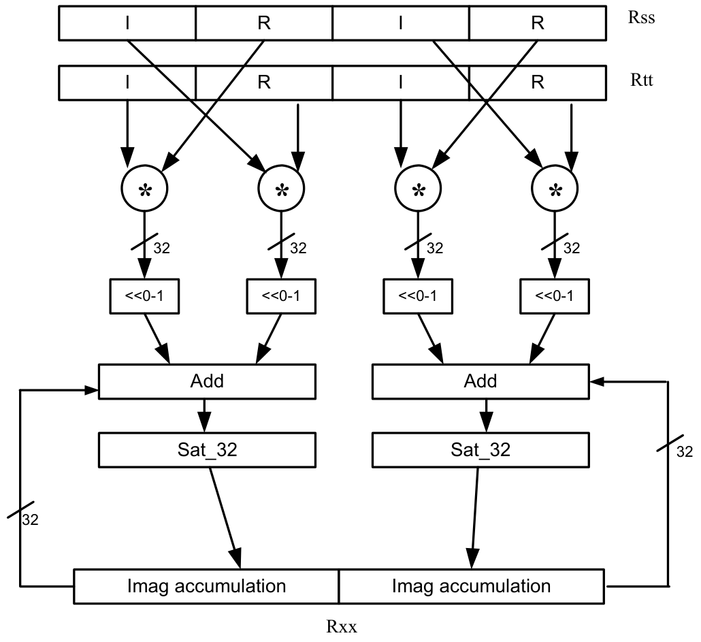

```text
I R I R Rss
I R I R Rtt
32 32 32 32
<<0-1 <<0-1 <<0-1 <<0-1
Add Add
Sat_32 Sat_32₃₂
32
Imag accumulation Imag accumulation
Rxx
```

| Syntax | Behavior |
|---|---|
| `Rdd= `<br>`vcmpyi(Rss,Rtt)[:<<1]:sat` | `Rdd.w[0]=sat₃₂((Rss.h[1] * Rtt.h[0]) + (Rss.h[0] * `<br>`Rtt.h[1])[<<1]);`<br>`Rdd.w[1]=sat₃₂((Rss.h[3] * Rtt.h[2]) + (Rss.h[2] * `<br>`Rtt.h[3])[<<1]);` |
| `Rdd= `<br>`vcmpyr(Rss,Rtt)[:<<1]:sat` | `Rdd.w[0]=sat₃₂((Rss.h[0] * Rtt.h[0]) - (Rss.h[1] * `<br>`Rtt.h[1])[<<1]);`<br>`Rdd.w[1]=sat₃₂((Rss.h[2] * Rtt.h[2]) - (Rss.h[3] * `<br>`Rtt.h[3])[<<1]);` |
| `Rxx+=vcmpyi(Rss,Rtt):sat` | `Rxx.w[0]=sat₃₂(Rxx.w[0] + (Rss.h[1] * Rtt.h[0]) + `<br>`(Rss.h[0] * Rtt.h[1])<<0);`<br>`Rxx.w[1]=sat₃₂(Rxx.w[1] + (Rss.h[3] * Rtt.h[2]) + `<br>`(Rss.h[2] * Rtt.h[3])<<0);` |
| `Rxx+=vcmpyr(Rss,Rtt):sat` | `Rxx.w[0]=sat₃₂(Rxx.w[0] + (Rss.h[0] * Rtt.h[0]) - `<br>`(Rss.h[1] * Rtt.h[1])<<0);`<br>`Rxx.w[1]=sat₃₂(Rxx.w[1] + (Rss.h[2] * Rtt.h[2]) - `<br>`(Rss.h[3] * Rtt.h[3])<<0);` |

##### Class: XTYPE (slots 2,3)

##### Notes

- If saturation occurs during execution of this instruction (a result is clamped to either maximum or minimum values), the OVF bit in the status register is set. OVF remains set until explicitly cleared by a transfer to the status register.

##### Intrinsics

|  |  |
|---|---|
| `Rdd=vcmpyi(Rss,Rtt):<<1:sat` | `Word64 Q6_P_vcmpyi_PP_s1_sat(Word64 Rss, Word64 Rtt)` |
| `Rdd=vcmpyi(Rss,Rtt):sat` | `Word64 Q6_P_vcmpyi_PP_sat(Word64 Rss, Word64 Rtt)` |
| `Rdd=vcmpyr(Rss,Rtt):<<1:sat` | `Word64 Q6_P_vcmpyr_PP_s1_sat(Word64 Rss, Word64 Rtt)` |
| `Rdd=vcmpyr(Rss,Rtt):sat` | `Word64 Q6_P_vcmpyr_PP_sat(Word64 Rss, Word64 Rtt)` |
| `Rxx+=vcmpyi(Rss,Rtt):sat` | `Word64 Q6_P_vcmpyiacc_PP_sat(Word64 Rxx, Word64 Rss, Word64 Rtt)` |
| `Rxx+=vcmpyr(Rss,Rtt):sat` | `Word64 Q6_P_vcmpyracc_PP_sat(Word64 Rxx, Word64 Rss, Word64 Rtt)` |

##### Encoding

| 31 | 30 | 29 | 28 | 27 | 26 | 25 | 24 | 23 | 22 | 21 | 20 | 19 | 18 | 17 | 16 | 15 | 14 | 13 | 12 | 11 | 10 | 9 | 8 | 7 | 6 | 5 | 4 | 3 | 2 | 1 | 0 |  |
|---|---|---|---|---|---|---|---|---|---|---|---|---|---|---|---|---|---|---|---|---|---|---|---|---|---|---|---|---|---|---|---|---|
| ICLASS | ICLASS | ICLASS | ICLASS | RegType | RegType | RegType | RegType | MajOp | MajOp | MajOp | s5 | s5 | s5 | s5 | s5 | Parse | Parse |  | t5 | t5 | t5 | t5 | t5 | MinOp | MinOp | MinOp | d5 | d5 | d5 | d5 | d5 |  |
| 1 | 1 | 1 | 0 | 1 | 0 | 0 | 0 | N | 0 | 1 | s | s | s | s | s | P | P | 0 | t | t | t | t | t | 1 | 1 | 0 | d | d | d | d | d | Rdd=vcmpyr(Rss,Rtt)[:<<N]:sat |
| 1 | 1 | 1 | 0 | 1 | 0 | 0 | 0 | N | 1 | 0 | s | s | s | s | s | P | P | 0 | t | t | t | t | t | 1 | 1 | 0 | d | d | d | d | d | Rdd=vcmpyi(Rss,Rtt)[:<<N]:sat |
| ICLASS | ICLASS | ICLASS | ICLASS | RegType | RegType | RegType | RegType | MajOp | MajOp | MajOp | s5 | s5 | s5 | s5 | s5 | Parse | Parse |  | t5 | t5 | t5 | t5 | t5 | MinOp | MinOp | MinOp | x5 | x5 | x5 | x5 | x5 |  |
| 1 | 1 | 1 | 0 | 1 | 0 | 1 | 0 | 0 | 0 | 1 | s | s | s | s | s | P | P | 0 | t | t | t | t | t | 1 | 0 | 0 | x | x | x | x | x | Rxx+=vcmpyr(Rss,Rtt):sat |
| 1 | 1 | 1 | 0 | 1 | 0 | 1 | 0 | 0 | 1 | 0 | s | s | s | s | s | P | P | 0 | t | t | t | t | t | 1 | 0 | 0 | x | x | x | x | x | Rxx+=vcmpyi(Rss,Rtt):sat |

| Field name | Description |
|---|---|
| `ICLASS` | Instruction class |
| `MajOp` | Major opcode |
| `MinOp` | Minor opcode |
| Field name | Description |
| `RegType` | Register type |
| `Parse` | Packet/loop parse bits |
| `d5` | Field to encode register d |
| `s5` | Field to encode register s |
| `t5` | Field to encode register t |
| `x5` | Field to encode register x |

#### Vector complex conjugate

Perform a vector complex conjugate of both complex values in vector Rss by negating the imaginary halfwords, and placing the result in destination Rdd.

| Syntax | Behavior |
|---|---|
| `Rdd=vconj(Rss):sat` | `Rdd.h[1]=sat₁₆(-Rss.h[1]);`<br>`Rdd.h[0]=Rss.h[0];`<br>`Rdd.h[3]=sat₁₆(-Rss.h[3]);`<br>`Rdd.h[2]=Rss.h[2];` |

##### Class: XTYPE (slots 2,3)

##### Notes

- If saturation occurs during execution of this instruction (a result is clamped to either maximum or minimum values), the OVF bit in the status register is set. OVF remains set until explicitly cleared by a transfer to the status register.

##### Intrinsics

```
Rdd=vconj(Rss):satWord64 Q6_P_vconj_P_sat(Word64 Rss)
```

##### Encoding

| 31 | 30 | 29 | 28 | 27 | 26 | 25 | 24 | 23 | 22 | 21 | 20 | 19 | 18 | 17 | 16 | 15 | 14 | 13 | 12 | 11 | 10 | 9 | 8 | 7 | 6 | 5 | 4 | 3 | 2 | 1 | 0 |  |
|---|---|---|---|---|---|---|---|---|---|---|---|---|---|---|---|---|---|---|---|---|---|---|---|---|---|---|---|---|---|---|---|---|
| ICLASS | ICLASS | ICLASS | ICLASS | RegType | RegType | RegType | RegType | MajOp | MajOp |  | s5 | s5 | s5 | s5 | s5 | Parse | Parse |  |  |  |  |  |  | MinOp | MinOp | MinOp | d5 | d5 | d5 | d5 | d5 |  |
| 1 | 0 | 0 | 0 | 0 | 0 | 0 | 0 | 1 | 0 | 0 | s | s | s | s | s | P | P | - | - | - | - | - | - | 1 | 1 | 1 | d | d | d | d | d | Rdd=vconj(Rss):sat |

| Field name | Description |
|---|---|
| `ICLASS` | Instruction class |
| `Parse` | Packet/loop parse bits |
| `d5` | Field to encode register d |
| `s5` | Field to encode register s |
| `MajOp` | Major opcode |
| `MinOp` | Minor opcode |
| `RegType` | Register type |

#### Vector complex rotate

Take the least significant bits of Rt, and use these bits to rotate each of the two complex values in the source vector a multiple of 90 degrees. Bits 0 and 1 control the rotation factor for word 0, and bits 2 and 3 control the rotation factor for word 1.

If the rotation control bits are 0, the rotation is 0: the real and imaginary halves of the source appear unchanged and unmoved in the destination.

If the rotation control bits are 1, the rotation is -pi/2: the real half of the destination gets the imaginary half of the source, and the imaginary half of the destination gets the negative real half of the source.

If the rotation control bits are 2, the rotation is pi/2: the real half of the destination gets the negative imaginary half of the source, and the imaginary half of the destination gets the real half of the source.

If the rotation control bits are 3, the rotation is pi: the real half of the destination gets the negative real half of the source, and the imaginary half of the destination gets the negative imaginary half of the source.

| Syntax | Behavior |
|---|---|
| `Rdd=vcrotate(Rss,Rt)` | `tmp = Rt[1:0];`<br>`if (tmp == 0) {`<br>`Rdd.h[0]=Rss.h[0];`<br>`Rdd.h[1]=Rss.h[1];`<br>`} else if (tmp == 1) {`<br>`Rdd.h[0]=Rss.h[1];`<br>`Rdd.h[1]=sat₁₆(-Rss.h[0]);`<br>`} else if (tmp == 2) {`<br>`Rdd.h[0]=sat₁₆(-Rss.h[1]);`<br>`Rdd.h[1]=Rss.h[0];`<br>`} else {`<br>`Rdd.h[0]=sat₁₆(-Rss.h[0]);`<br>`Rdd.h[1]=sat₁₆(-Rss.h[1]);`<br>`}`<br>`tmp = Rt[3:2];`<br>`if (tmp == 0) {`<br>`Rdd.h[2]=Rss.h[2];`<br>`Rdd.h[3]=Rss.h[3];`<br>`} else if (tmp == 1) {`<br>`Rdd.h[2]=Rss.h[3];`<br>`Rdd.h[3]=sat₁₆(-Rss.h[2]);`<br>`} else if (tmp == 2) {`<br>`Rdd.h[2]=sat₁₆(-Rss.h[3]);`<br>`Rdd.h[3]=Rss.h[2];`<br>`} else {`<br>`Rdd.h[2]=sat₁₆(-Rss.h[2]);`<br>`Rdd.h[3]=sat₁₆(-Rss.h[3]);`<br>`}` |

##### Class: XTYPE (slots 2,3)

##### Notes

- If saturation occurs during execution of this instruction (a result is clamped to either maximum or minimum values), the OVF bit in the status register is set. OVF remains set until explicitly cleared by a transfer to the status register.

##### Intrinsics

```
Rdd=vcrotate(Rss,Rt)Word64 Q6_P_vcrotate_PR(Word64 Rss, Word32
                             Rt)
```

##### Encoding

| 31 | 30 | 29 | 28 | 27 | 26 | 25 | 24 | 23 | 22 | 21 | 20 | 19 | 18 | 17 | 16 | 15 | 14 | 13 | 12 | 11 | 10 | 9 | 8 | 7 | 6 | 5 | 4 | 3 | 2 | 1 | 0 |  |
|---|---|---|---|---|---|---|---|---|---|---|---|---|---|---|---|---|---|---|---|---|---|---|---|---|---|---|---|---|---|---|---|---|
| ICLASS | ICLASS | ICLASS | ICLASS | RegType | RegType | RegType | RegType | Maj | Maj |  | s5 | s5 | s5 | s5 | s5 | Parse | Parse |  | t5 | t5 | t5 | t5 | t5 | Min | Min |  | d5 | d5 | d5 | d5 | d5 |  |
| 1 | 1 | 0 | 0 | 0 | 0 | 1 | 1 | 1 | 1 | - | s | s | s | s | s | P | P | - | t | t | t | t | t | 0 | 0 | - | d | d | d | d | d | Rdd=vcrotate(Rss,Rt) |

| Field name | Description |
|---|---|
| `ICLASS` | Instruction class |
| `Parse` | Packet/loop parse bits |
| `d5` | Field to encode register d |
| `s5` | Field to encode register s |
| `t5` | Field to encode register t |
| `Maj` | Major opcode |
| `Min` | Minor opcode |
| `RegType` | Register type |

#### Vector reduce complex multiply by scalar

Multiply a complex number by a scalar. Rss contains two complex numbers. The real portions are each multiplied by two scalars contained in register Rt, scaled, summed, optionally accumulated, saturated, and stored in the lower word of Rdd. A similar operation is done on the two imaginary portions of Rss.

Rdd=vrcmpys(Rss,Rt):<<1:sat

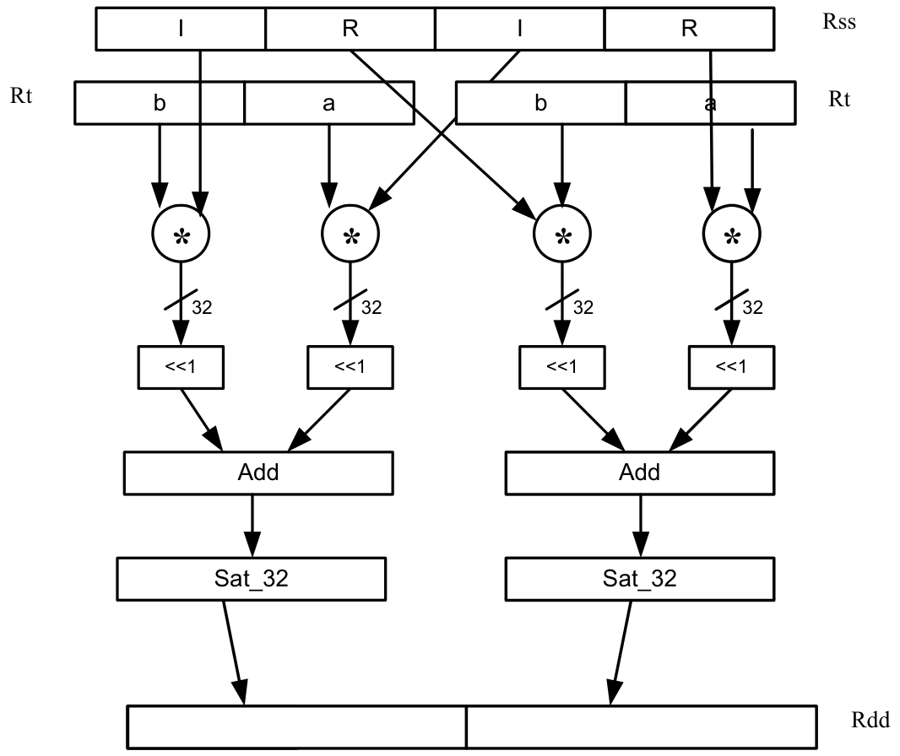

```text
I R I R Rss
Rt b a b a Rt
32 32 32 32
<<1 <<1 <<1 <<1
Add Add
Sat_32 Sat_32
Rdd
I
```

| Syntax | Behavior |
|---|---|
| `Rdd=vrcmpys(Rss,Rt):<<1:sat` | `if ("Rt & 1") {`<br>`Assembler mapped to: `<br>`"Rdd=vrcmpys(Rss,Rtt):<<1:sat:raw:hi";`<br>`} else {`<br>`Assembler mapped to: `<br>`"Rdd=vrcmpys(Rss,Rtt):<<1:sat:raw:lo";`<br>`}` |
| `Rdd= `<br>`vrcmpys(Rss,Rtt):<<1:sat:raw:hi` | `Rdd.w[1]=sat₃₂((Rss.h[1] * Rtt.w[1].h[0])<<1 + `<br>`(Rss.h[3] * Rtt.w[1].h[1])<<1);`<br>`Rdd.w[0]=sat₃₂((Rss.h[0] * Rtt.w[1].h[0])<<1 + `<br>`(Rss.h[2] * Rtt.w[1].h[1])<<1);` |
| `Rdd= `<br>`vrcmpys(Rss,Rtt):<<1:sat:raw:lo` | `Rdd.w[1]=sat₃₂((Rss.h[1] * Rtt.w[0].h[0])<<1 + `<br>`(Rss.h[3] * Rtt.w[0].h[1])<<1);`<br>`Rdd.w[0]=sat₃₂((Rss.h[0] * Rtt.w[0].h[0])<<1 + `<br>`(Rss.h[2] * Rtt.w[0].h[1])<<1);` |
| `Rxx+=vrcmpys(Rss,Rt):<<1:sat` | `if ("Rt & 1") {`<br>`Assembler mapped to: `<br>`"Rxx+=vrcmpys(Rss,Rtt):<<1:sat:raw:hi";`<br>`} else {`<br>`Assembler mapped to: `<br>`"Rxx+=vrcmpys(Rss,Rtt):<<1:sat:raw:lo";`<br>`}` |
| `Rxx+= `<br>`vrcmpys(Rss,Rtt):<<1:sat:raw:hi` | `Rxx.w[1]=sat₃₂(Rxx.w[1] + (Rss.h[1] * `<br>`Rtt.w[1].h[0])<<1 + (Rss.h[3] * `<br>`Rtt.w[1].h[1])<<1);`<br>`Rxx.w[0]=sat₃₂(Rxx.w[0] + (Rss.h[0] * `<br>`Rtt.w[1].h[0])<<1 + (Rss.h[2] * `<br>`Rtt.w[1].h[1])<<1);` |
| `Rxx+= `<br>`vrcmpys(Rss,Rtt):<<1:sat:raw:lo` | `Rxx.w[1]=sat₃₂(Rxx.w[1] + (Rss.h[1] * `<br>`Rtt.w[0].h[0])<<1 + (Rss.h[3] * `<br>`Rtt.w[0].h[1])<<1);`<br>`Rxx.w[0]=sat₃₂(Rxx.w[0] + (Rss.h[0] * `<br>`Rtt.w[0].h[0])<<1 + (Rss.h[2] * `<br>`Rtt.w[0].h[1])<<1);` |

##### Class: XTYPE (slots 2,3)

##### Notes

- If saturation occurs during execution of this instruction (a result is clamped to either maximum or minimum values), the OVF bit in the status register is set. OVF remains set until explicitly cleared by a transfer to the status register.

##### Intrinsics

```
Rdd=vrcmpys(Rss,Rt):<<1:sWord64 Q6_P_vrcmpys_PR_s1_sat(Word64 Rss, Word32 Rt)
at
```

|  |  |
|---|---|
| `Rxx+=vrcmpys(Rss,Rt):<<1:` | `Word64 Q6_P_vrcmpysacc_PR_s1_sat(Word64 Rxx, Word64` |
| `sat` | `Rss, Word32 Rt)` |

##### Encoding

| 31 | 30 | 29 | 28 | 27 | 26 | 25 | 24 | 23 | 22 | 21 | 20 | 19 | 18 | 17 | 16 | 15 | 14 | 13 | 12 | 11 | 10 | 9 | 8 | 7 | 6 | 5 | 4 | 3 | 2 | 1 | 0 |  |
|---|---|---|---|---|---|---|---|---|---|---|---|---|---|---|---|---|---|---|---|---|---|---|---|---|---|---|---|---|---|---|---|---|
| ICLASS | ICLASS | ICLASS | ICLASS | RegType | RegType | RegType | RegType | MajOp | MajOp | MajOp | s5 | s5 | s5 | s5 | s5 | Parse | Parse |  | t5 | t5 | t5 | t5 | t5 | MinOp | MinOp | MinOp | d5 | d5 | d5 | d5 | d5 |  |
| 1 | 1 | 1 | 0 | 1 | 0 | 0 | 0 | 1 | 0 | 1 | s | s | s | s | s | P | P | 0 | t | t | t | t | t | 1 | 0 | 0 | d | d | d | d | d | Rdd=vrcmpys(Rss,Rtt):<<1:sat:raw:hi |
| 1 | 1 | 1 | 0 | 1 | 0 | 0 | 0 | 1 | 1 | 1 | s | s | s | s | s | P | P | 0 | t | t | t | t | t | 1 | 0 | 0 | d | d | d | d | d | Rdd=vrcmpys(Rss,Rtt):<<1:sat:raw:lo |
| ICLASS | ICLASS | ICLASS | ICLASS | RegType | RegType | RegType | RegType | MajOp | MajOp | MajOp | s5 | s5 | s5 | s5 | s5 | Parse | Parse |  | t5 | t5 | t5 | t5 | t5 | MinOp | MinOp | MinOp | x5 | x5 | x5 | x5 | x5 |  |
| 1 | 1 | 1 | 0 | 1 | 0 | 1 | 0 | 1 | 0 | 1 | s | s | s | s | s | P | P | 0 | t | t | t | t | t | 1 | 0 | 0 | x | x | x | x | x | Rxx+=vrcmpys(Rss,Rtt):<<1:sat:raw:hi |
| 1 | 1 | 1 | 0 | 1 | 0 | 1 | 0 | 1 | 1 | 1 | s | s | s | s | s | P | P | 0 | t | t | t | t | t | 1 | 0 | 0 | x | x | x | x | x | Rxx+=vrcmpys(Rss,Rtt):<<1:sat:raw:lo |

| Field name | Description |
|---|---|
| `ICLASS` | Instruction class |
| `MajOp` | Major opcode |
| `MinOp` | Minor opcode |
| `RegType` | Register type |
| `Parse` | Packet/loop parse bits |
| `d5` | Field to encode register d |
| `s5` | Field to encode register s |
| `t5` | Field to encode register t |
| `x5` | Field to encode register x |

#### Vector reduce complex multiply by scalar with round and pack

Multiply a complex number by scalar. Rss contains two complex numbers. The real portions are each multiplied by two scalars contained in register Rt, scaled, summed, rounded, and saturated. The upper 16bits of this result are packed in the lower halfword of Rd. A similar operation is done on the two imaginary portions of Rss.

Rd=vrcmpys(Rss,Rt):<<1:rnd:sat

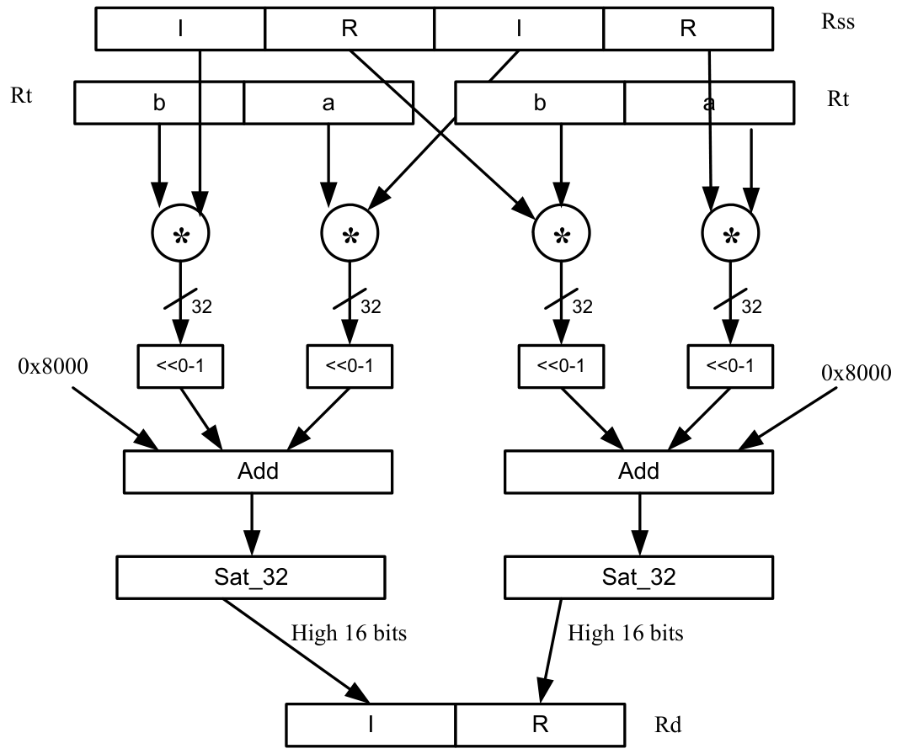

```text
Rss
I R I R
Rt Rt
b a b a
32 32 32 32
0x8000<<0-1<<0-1<<0-1<<0-1 0x8000
Add Add
Sat_32 Sat_32
High 16 bits High 16 bits
I R Rd
```

| Syntax | Behavior |
|---|---|
| `Rd=vrcmpys(Rss,Rt):<<1:rnd:sat` | `if ("Rt & 1") {`<br>`Assembler mapped to: `<br>`"Rd=vrcmpys(Rss,Rtt):<<1:rnd:sat:raw:hi";`<br>`} else {`<br>`Assembler mapped to: `<br>`"Rd=vrcmpys(Rss,Rtt):<<1:rnd:sat:raw:lo";`<br>`}` |
| `Rd= vrcmpys(Rss, `<br>`Rtt):<<1:rnd:sat:raw:hi` | `Rd.h[1]=sat₃₂((Rss.h[1] * Rtt.w[1].h[0])<<1 + `<br>`(Rss.h[3] * Rtt.w[1].h[1])<<1 + 0x8000).h[1];`<br>`Rd.h[0]=sat₃₂((Rss.h[0] * Rtt.w[1].h[0])<<1 + `<br>`(Rss.h[2] * Rtt.w[1].h[1])<<1 + 0x8000).h[1];` |
| `Rd = vrcmpys(Rss, `<br>`Rtt):<<1:rnd:sat:raw:lo` | `Rd.h[1]=sat₃₂((Rss.h[1] * Rtt.w[0].h[0])<<1 + `<br>`(Rss.h[3] * Rtt.w[0].h[1])<<1 + 0x8000).h[1];`<br>`Rd.h[0]=sat₃₂((Rss.h[0] * Rtt.w[0].h[0])<<1 + `<br>`(Rss.h[2] * Rtt.w[0].h[1])<<1 + 0x8000).h[1];` |

##### Class: XTYPE (slots 2,3)

##### Notes

- If saturation occurs during execution of this instruction (a result is clamped to either maximum or minimum values), the OVF bit in the status register is set. OVF remains set until explicitly cleared by a transfer to the status register.

##### Intrinsics

|  |  |
|---|---|
| `Rd=vrcmpys(Rss,Rt):<<1:rnd:s` | `Word32 Q6_R_vrcmpys_PR_s1_rnd_sat(Word64` |
| `at` | `Rss, Word32 Rt)` |

##### Encoding

| 31 | 30 | 29 | 28 | 27 | 26 | 25 | 24 | 23 | 22 | 21 | 20 | 19 | 18 | 17 | 16 | 15 | 14 | 13 | 12 | 11 | 10 | 9 | 8 | 7 | 6 | 5 | 4 | 3 | 2 | 1 | 0 |  |
|---|---|---|---|---|---|---|---|---|---|---|---|---|---|---|---|---|---|---|---|---|---|---|---|---|---|---|---|---|---|---|---|---|
| ICLASS | ICLASS | ICLASS | ICLASS | RegType | RegType | RegType | RegType | MajOp | MajOp | MajOp | s5 | s5 | s5 | s5 | s5 | Parse | Parse |  | t5 | t5 | t5 | t5 | t5 | MinOp | MinOp | MinOp | d5 | d5 | d5 | d5 | d5 |  |
| 1 | 1 | 1 | 0 | 1 | 0 | 0 | 1 | 1 | - | 1 | s | s | s | s | s | P | P | 0 | t | t | t | t | t | 1 | 1 | 0 | d | d | d | d | d | Rd=vrcmpys(Rss,Rtt):<<1:rnd:sat:raw:hi |
| 1 | 1 | 1 | 0 | 1 | 0 | 0 | 1 | 1 | - | 1 | s | s | s | s | s | P | P | 0 | t | t | t | t | t | 1 | 1 | 1 | d | d | d | d | d | Rd=vrcmpys(Rss,Rtt):<<1:rnd:sat:raw:lo |

| Field name | Description |
|---|---|
| `ICLASS` | Instruction class |
| `MajOp` | Major opcode |
| `MinOp` | Minor opcode |
| `RegType` | Register type |
| `Parse` | Packet/loop parse bits |
| `d5` | Field to encode register d |
| `s5` | Field to encode register s |
| `t5` | Field to encode register t |

#### Vector reduce complex rotate

This instruction is useful for CDMA despreading. An unsigned 2-bit immediate specifies a byte to use in Rt. Four 2-bit fields in the specified byte each select a rotation amount for one of the four complex numbers in Rss. The real and imaginary products accumulate and store as a 32-bit complex number in Rd. Optionally, the destination register can also accumulate.

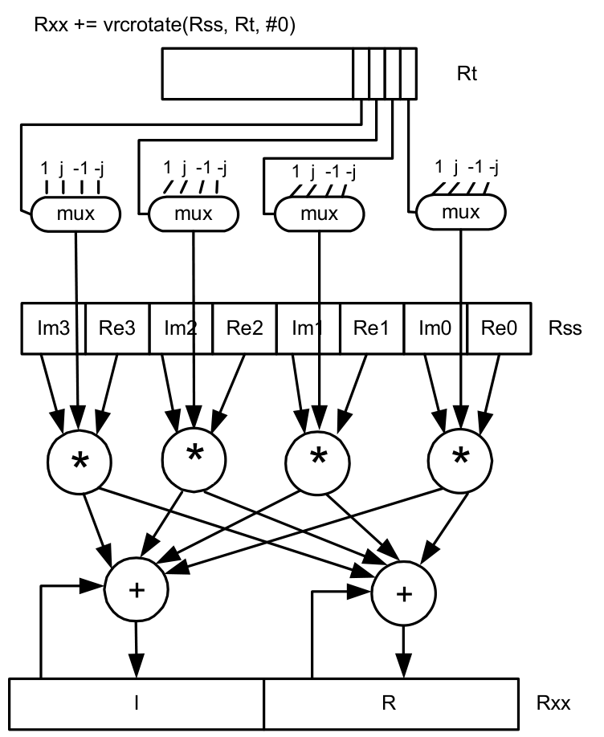

```text
Rxx += vrcrotate(Rss, Rt, #0)
Rt
1 j -1 -j 1 j -1 -j 1 j -1 -j 1 j -1 -j
mux mux mux mux
Im3 Re3 Im2 Re2 Im1 Re1 Im0 Re0 Rss
+ +
I R Rxx
```

##### Class: XTYPE (slots 2,3)

| Syntax | Behavior |
|---|---|
| `Rdd=vrcrotate(Rss,Rt,#u2)` | `sumr = 0;`<br>`sumi = 0;`<br>`control = Rt.ub[#u];`<br>`for (i = 0; i < 8; i += 2) {`<br>`tmpr = Rss.b[i];`<br>`tmpi = Rss.b[i+1];`<br>`switch (control & 3) {`<br>`case 0: sumr += tmpr;`<br>`sumi += tmpi;`<br>`break;`<br>`case 1: sumr += tmpi;`<br>`sumi -= tmpr;`<br>`break;`<br>`case 2: sumr -= tmpi;`<br>`sumi += tmpr;`<br>`break;`<br>`case 3: sumr -= tmpr;`<br>`sumi -= tmpi;`<br>`break;`<br>`}`<br>`control = control >> 2;`<br>`}`<br>`Rdd.w[0]=sumr;`<br>`Rdd.w[1]=sumi;` |
| `Rxx+=vrcrotate(Rss,Rt,#u2)` | `sumr = 0;`<br>`sumi = 0;`<br>`control = Rt.ub[#u];`<br>`for (i = 0; i < 8; i += 2) {`<br>`tmpr = Rss.b[i];`<br>`tmpi = Rss.b[i+1];`<br>`switch (control & 3) {`<br>`case 0: sumr += tmpr;`<br>`sumi += tmpi;`<br>`break;`<br>`case 1: sumr += tmpi;`<br>`sumi -= tmpr;`<br>`break;`<br>`case 2: sumr -= tmpi;`<br>`sumi += tmpr;`<br>`break;`<br>`case 3: sumr -= tmpr;`<br>`sumi -= tmpi;`<br>`break;`<br>`}`<br>`control = control >> 2;`<br>`}`<br>`Rxx.w[0]=Rxx.w[0] + sumr;`<br>`Rxx.w[1]=Rxx.w[1] + sumi;` |

##### Intrinsics

|  |  |
|---|---|
| `Rdd=vrcrotate(Rss,Rt,#u2` | `Word64 Q6_P_vrcrotate_PRI(Word64 Rss, Word32` |
| `)` | `Rt, Word32 Iu2)` |
| `Rxx+=vrcrotate(Rss,Rt,#u` | `Word64 Q6_P_vrcrotateacc_PRI(Word64 Rxx, Word64` |
| `2)` | `Rss, Word32 Rt, Word32 Iu2)` |

##### Encoding

| 31 | 30 | 29 | 28 | 27 | 26 | 25 | 24 | 23 | 22 | 21 | 20 | 19 | 18 | 17 | 16 | 15 | 14 | 13 | 12 | 11 | 10 | 9 | 8 | 7 | 6 | 5 | 4 | 3 | 2 | 1 | 0 |  |
|---|---|---|---|---|---|---|---|---|---|---|---|---|---|---|---|---|---|---|---|---|---|---|---|---|---|---|---|---|---|---|---|---|
| ICLASS | ICLASS | ICLASS | ICLASS | RegType | RegType | RegType | RegType | Maj | Maj |  | s5 | s5 | s5 | s5 | s5 | Parse | Parse |  | t5 | t5 | t5 | t5 | t5 | Min | Min |  | d5 | d5 | d5 | d5 | d5 |  |
| 1 | 1 | 0 | 0 | 0 | 0 | 1 | 1 | 1 | 1 | - | s | s | s | s | s | P | P | i | t | t | t | t | t | 1 | 1 | i | d | d | d | d | d | Rdd=vrcrotate(Rss,Rt,#u2) |
| ICLASS | ICLASS | ICLASS | ICLASS | RegType | RegType | RegType | RegType | Maj | Maj |  | s5 | s5 | s5 | s5 | s5 | Parse | Parse |  | t5 | t5 | t5 | t5 | t5 |  |  |  | x5 | x5 | x5 | x5 | x5 |  |
| 1 | 1 | 0 | 0 | 1 | 0 | 1 | 1 | 1 | 0 | 1 | s | s | s | s | s | P | P | i | t | t | t | t | t | - | - | i | x | x | x | x | x | Rxx+=vrcrotate(Rss,Rt,#u2 ) |

| Field name | Description |
|---|---|
| `ICLASS` | Instruction class |
| `Parse` | Packet/loop parse bits |
| `d5` | Field to encode register d |
| `s5` | Field to encode register s |
| `t5` | Field to encode register t |
| `x5` | Field to encode register x |
| `Maj` | Major opcode |
| `Min` | Minor opcode |
| `RegType` | Register type |

### 11.10.4 XTYPE FP

The XTYPE FP instruction subclass includes instructions for floating point math.

#### Floating point addition

Add two floating point values.

| Syntax | Behavior |
|---|---|
| `Rd=sfadd(Rs,Rt)` | `Rd=Rs+Rt;` |
| `Rdd=dfadd(Rss,Rtt)` | `Rdd=Rss+Rtt;` |

##### Class: XTYPE (slots 2,3)

##### Intrinsics

|  |  |
|---|---|
| `Rd=sfadd(Rs,Rt)` | `Word32 Q6_R_sfadd_RR(Word32 Rs, Word32 Rt)` |
| `Rdd=dfadd(Rss,Rtt)` | `Word64 Q6_P_dfadd_PP(Word64 Rss, Word64 Rtt)` |

##### Encoding

| 31 | 30 | 29 | 28 | 27 | 26 | 25 | 24 | 23 | 22 | 21 | 20 | 19 | 18 | 17 | 16 | 15 | 14 | 13 | 12 | 11 | 10 | 9 | 8 | 7 | 6 | 5 | 4 | 3 | 2 | 1 | 0 |  |
|---|---|---|---|---|---|---|---|---|---|---|---|---|---|---|---|---|---|---|---|---|---|---|---|---|---|---|---|---|---|---|---|---|
| ICLASS | ICLASS | ICLASS | ICLASS | RegType | RegType | RegType | RegType | MajOp | MajOp | MajOp | s5 | s5 | s5 | s5 | s5 | Parse | Parse |  | t5 | t5 | t5 | t5 | t5 | MinOp | MinOp | MinOp | d5 | d5 | d5 | d5 | d5 |  |
| 1 | 1 | 1 | 0 | 1 | 0 | 0 | 0 | 0 | 0 | 0 | s | s | s | s | s | P | P | 0 | t | t | t | t | t | 0 | 1 | 1 | d | d | d | d | d | Rdd=dfadd(Rss,Rtt) |
| 1 | 1 | 1 | 0 | 1 | 0 | 1 | 1 | 0 | 0 | 0 | s | s | s | s | s | P | P | 0 | t | t | t | t | t | 0 | 0 | 0 | d | d | d | d | d | Rd=sfadd(Rs,Rt) |

| Field name | Description |
|---|---|
| `ICLASS` | Instruction class |
| `MajOp` | Major opcode |
| `MinOp` | Minor opcode |
| `RegType` | Register type |
| `Parse` | Packet/loop parse bits |
| `d5` | Field to encode register d |
| `s5` | Field to encode register s |
| `t5` | Field to encode register t |

#### Classify floating point value

Classify floating point values. Classes are normal, subnormal, zero, NaN, or infinity. When the number is one of the specified classes, return true.

| Syntax | Behavior |
|---|---|
| `Pd=dfclass(Rss,#u5)` | `Pd = 0;`<br>`class = fpclassify(Rss);`<br>`if (#u.0 && (class == FP_ZERO)) Pd = 0xff;`<br>`if (#u.1 && (class == FP_NORMAL)) Pd = `<br>`0xff;`<br>`if (#u.2 && (class == FP_SUBNORMAL)) Pd = `<br>`0xff;`<br>`if (#u.3 && (class == FP_INFINITE)) Pd = `<br>`0xff;`<br>`if (#u.4 && (class == FP_NAN)) Pd = 0xff;`<br>`cancel_flags();` |
| `Pd=sfclass(Rs,#u5)` | `Pd = 0;`<br>`class = fpclassify(Rs);`<br>`if (#u.0 && (class == FP_ZERO)) Pd = 0xff;`<br>`if (#u.1 && (class == FP_NORMAL)) Pd = `<br>`0xff;`<br>`if (#u.2 && (class == FP_SUBNORMAL)) Pd = `<br>`0xff;`<br>`if (#u.3 && (class == FP_INFINITE)) Pd = `<br>`0xff;`<br>`if (#u.4 && (class == FP_NAN)) Pd = 0xff;`<br>`cancel_flags();` |

##### Class: XTYPE (slots 2,3)

##### Intrinsics

|  |  |
|---|---|
| `Pd=dfclass(Rss,#u5)` | `Byte Q6_p_dfclass_PI(Word64 Rss, Word32 Iu5)` |
| `Pd=sfclass(Rs,#u5)` | `Byte Q6_p_sfclass_RI(Word32 Rs, Word32 Iu5)` |

##### Encoding

| 31 | 30 | 29 | 28 | 27 | 26 | 25 | 24 | 23 | 22 | 21 | 20 | 19 | 18 | 17 | 16 | 15 | 14 | 13 | 12 | 11 | 10 | 9 | 8 | 7 | 6 | 5 | 4 | 3 | 2 | 1 | 0 |  |
|---|---|---|---|---|---|---|---|---|---|---|---|---|---|---|---|---|---|---|---|---|---|---|---|---|---|---|---|---|---|---|---|---|
| ICLASS | ICLASS | ICLASS | ICLASS | RegType | RegType | RegType | RegType | MajOp | MajOp |  | s5 | s5 | s5 | s5 | s5 | Parse | Parse |  |  |  |  |  |  |  |  |  |  |  |  | d2 | d2 |  |
| 1 | 0 | 0 | 0 | 0 | 1 | 0 | 1 | 1 | 1 | 1 | s | s | s | s | s | P | P | 0 | i | i | i | i | i | - | - | - | - | - | - | d | d | Pd=sfclass(Rs,#u5) |
| ICLASS | ICLASS | ICLASS | ICLASS | RegType | RegType | RegType | RegType |  |  |  | s5 | s5 | s5 | s5 | s5 | Parse | Parse |  |  |  |  |  |  |  |  |  |  |  |  | d2 | d2 |  |
| 1 | 1 | 0 | 1 | 1 | 1 | 0 | 0 | 1 | 0 | 0 | s | s | s | s | s | P | P | - | 0 | 0 | 0 | i | i | i | i | i | 1 | 0 | - | d | d | Pd=dfclass(Rss,#u5) |

| Field name | Description |
|---|---|
| `RegType` | Register type |
| `MajOp` | Major opcode |
| `ICLASS` | Instruction class |
| Field name | Description |
| `Parse` | Packet/loop parse bits |
| `d2` | Field to encode register d |
| `s5` | Field to encode register s |

#### Compare floating point value

Compare floating point values. p0 returns true when at least one value is a NaN, otherwise p0 returns zero.

| Syntax | Behavior |
|---|---|
| `Pd=dfcmp.eq(Rss,Rtt)` | `Pd=Rss==Rtt ? 0xff : 0x00;` |
| `Pd=dfcmp.ge(Rss,Rtt)` | `Pd=Rss>=Rtt ? 0xff : 0x00;` |
| `Pd=dfcmp.gt(Rss,Rtt)` | `Pd=Rss>Rtt ? 0xff : 0x00;` |
| `Pd=dfcmp.uo(Rss,Rtt)` | `Pd=isunordered(Rss,Rtt) ? 0xff : 0x00;` |
| `Pd=sfcmp.eq(Rs,Rt)` | `Pd=Rs==Rt ? 0xff : 0x00;` |
| `Pd=sfcmp.ge(Rs,Rt)` | `Pd=Rs>=Rt ? 0xff : 0x00;` |
| `Pd=sfcmp.gt(Rs,Rt)` | `Pd=Rs>Rt ? 0xff : 0x00;` |
| `Pd=sfcmp.uo(Rs,Rt)` | `Pd=isunordered(Rs,Rt) ? 0xff : 0x00;` |

##### Class: XTYPE (slots 2,3)

##### Intrinsics

|  |  |
|---|---|
| `Pd=dfcmp.eq(Rss,Rtt)` | `Byte Q6_p_dfcmp_eq_PP(Word64 Rss, Word64 Rtt)` |
| `Pd=dfcmp.ge(Rss,Rtt)` | `Byte Q6_p_dfcmp_ge_PP(Word64 Rss, Word64 Rtt)` |
| `Pd=dfcmp.gt(Rss,Rtt)` | `Byte Q6_p_dfcmp_gt_PP(Word64 Rss, Word64 Rtt)` |
| `Pd=dfcmp.uo(Rss,Rtt)` | `Byte Q6_p_dfcmp_uo_PP(Word64 Rss, Word64 Rtt)` |
| `Pd=sfcmp.eq(Rs,Rt)` | `Byte Q6_p_sfcmp_eq_RR(Word32 Rs, Word32 Rt)` |
| `Pd=sfcmp.ge(Rs,Rt)` | `Byte Q6_p_sfcmp_ge_RR(Word32 Rs, Word32 Rt)` |
| `Pd=sfcmp.gt(Rs,Rt)` | `Byte Q6_p_sfcmp_gt_RR(Word32 Rs, Word32 Rt)` |
| `Pd=sfcmp.uo(Rs,Rt)` | `Byte Q6_p_sfcmp_uo_RR(Word32 Rs, Word32 Rt)` |

##### Encoding

| 31 | 30 | 29 | 28 | 27 | 26 | 25 | 24 | 23 | 22 | 21 | 20 | 19 | 18 | 17 | 16 15 | 15 | 14 | 13 | 12 | 11 | 10 | 9 | 8 | 7 | 6 | 5 | 4 | 3 | 2 | 1 | 0 |  |
|---|---|---|---|---|---|---|---|---|---|---|---|---|---|---|---|---|---|---|---|---|---|---|---|---|---|---|---|---|---|---|---|---|
| ICLASS | ICLASS | ICLASS | ICLASS | RegType | RegType | RegType | RegType | Maj | Maj |  | s5 | s5 | s5 | s5 | s5 | Parse | Parse |  | t5 | t5 | t5 | t5 | t5 | Min | Min |  |  |  |  | d2 | d2 |  |
| 1 | 1 | 0 | 0 | 0 | 1 | 1 | 1 | 1 | 1 | 1 | s | s | s | s | s P | P | P | - | t | t | t | t | t | 0 | 0 | 0 | - | - | - | d | d | Pd=sfcmp.ge(Rs,Rt) |
| 1 | 1 | 0 | 0 | 0 | 1 | 1 | 1 | 1 | 1 | 1 | s | s | s | s | s P | P | P | - | t | t | t | t | t | 0 | 0 | 1 | - | - | - | d | d | Pd=sfcmp.uo(Rs,Rt) |
| 1 | 1 | 0 | 0 | 0 | 1 | 1 | 1 | 1 | 1 | 1 | s | s | s | s | s P | P | P | - | t | t | t | t | t | 0 | 1 | 1 | - | - | - | d | d | Pd=sfcmp.eq(Rs,Rt) |
| 1 | 1 | 0 | 0 | 0 | 1 | 1 | 1 | 1 | 1 | 1 | s | s | s | s | s P | P | P | - | t | t | t | t | t | 1 | 0 | 0 | - | - | - | d | d | Pd=sfcmp.gt(Rs,Rt) |

| 31 | 30 | 29 | 28 | 27 | 26 | 25 | 24 | 23 | 22 | 21 | 20 | 19 | 18 | 17 | 16 | 15 | 14 | 13 | 12 | 11 | 10 | 9 | 8 | 7 | 6 | 5 | 4 | 3 | 2 | 1 | 0 |  |
|---|---|---|---|---|---|---|---|---|---|---|---|---|---|---|---|---|---|---|---|---|---|---|---|---|---|---|---|---|---|---|---|---|
| ICLASS | ICLASS | ICLASS | ICLASS | RegType | RegType | RegType | RegType |  |  |  | s5 | s5 | s5 | s5 | s5 | Parse | Parse |  | t5 | t5 | t5 | t5 | t5 | MinOp | MinOp | MinOp |  |  |  | d2 | d2 |  |
| 1 | 1 | 0 | 1 | 0 | 0 | 1 | 0 | 1 | 1 | 1 | s | s | s | s | s | P | P | - | t | t | t | t | t | 0 | 0 | 0 | - | - | - | d | d | Pd=dfcmp.eq(Rss,Rtt) |
| 1 | 1 | 0 | 1 | 0 | 0 | 1 | 0 | 1 | 1 | 1 | s | s | s | s | s | P | P | - | t | t | t | t | t | 0 | 0 | 1 | - | - | - | d | d | Pd=dfcmp.gt(Rss,Rtt) |
| 1 | 1 | 0 | 1 | 0 | 0 | 1 | 0 | 1 | 1 | 1 | s | s | s | s | s | P | P | - | t | t | t | t | t | 0 | 1 | 0 | - | - | - | d | d | Pd=dfcmp.ge(Rss,Rtt) |
| 1 | 1 | 0 | 1 | 0 | 0 | 1 | 0 | 1 | 1 | 1 | s | s | s | s | s | P | P | - | t | t | t | t | t | 0 | 1 | 1 | - | - | - | d | d | Pd=dfcmp.uo(Rss,Rtt) |

| Field name | Description |
|---|---|
| `RegType` | Register type |
| `MinOp` | Minor opcode |
| `ICLASS` | Instruction class |
| `Parse` | Packet/loop parse bits |
| `d2` | Field to encode register d |
| `s5` | Field to encode register s |
| `t5` | Field to encode register t |
| `Maj` | Major opcode |
| `Min` | Minor opcode |

#### Convert floating point value to other format

Convert floating point values. When rounding is required, it occurs according to the rounding mode.

| Syntax | Behavior |
|---|---|
| `Rd=convert_df2sf(Rss)` | `Rd = conv_df_to_sf(Rss);` |
| `Rdd=convert_sf2df(Rs)` | `Rdd = conv_sf_to_df(Rs);` |

##### Class: XTYPE (slots 2,3)

##### Intrinsics

|  |  |
|---|---|
| `Rd=convert_df2sf(Rss)` | `Word32 Q6_R_convert_df2sf_P(Word64 Rss)` |
| `Rdd=convert_sf2df(Rs)` | `Word64 Q6_P_convert_sf2df_R(Word32 Rs)` |

##### Encoding

| 31 | 30 | 29 | 28 | 27 | 26 | 25 | 24 | 23 | 22 | 21 | 20 | 19 | 18 | 17 | 16 | 15 | 14 | 13 | 12 | 11 | 10 | 9 | 8 | 7 | 6 | 5 | 4 | 3 | 2 | 1 | 0 |  |
|---|---|---|---|---|---|---|---|---|---|---|---|---|---|---|---|---|---|---|---|---|---|---|---|---|---|---|---|---|---|---|---|---|
| ICLASS | ICLASS | ICLASS | ICLASS | RegType | RegType | RegType | RegType | MajOp | MajOp |  | s5 | s5 | s5 | s5 | s5 | Parse | Parse |  |  |  |  |  |  | MinOp | MinOp | MinOp | d5 | d5 | d5 | d5 | d5 |  |
| 1 | 0 | 0 | 0 | 0 | 1 | 0 | 0 | 1 | - | - | s | s | s | s | s | P | P | - | - | - | - | - | - | 0 | 0 | 0 | d | d | d | d | d | Rdd=convert_sf2df(Rs) |
| 1 | 0 | 0 | 0 | 1 | 0 | 0 | 0 | 0 | 0 | 0 | s | s | s | s | s | P | P | - | - | - | - | - | - | 0 | 0 | 1 | d | d | d | d | d | Rd=convert_df2sf(Rss) |

| Field name | Description |
|---|---|
| `ICLASS` | Instruction class |
| `Parse` | Packet/loop parse bits |
| `d5` | Field to encode register d |
| `s5` | Field to encode register s |
| `MajOp` | Major opcode |
| `MinOp` | Minor opcode |
| `RegType` | Register type |

#### Convert integer to floating point value

Convert floating point values. When rounding is required, it occurs according to the rounding mode unless the :chop option is specified.

| Syntax | Behavior |
|---|---|
| `Rd=convert_d2sf(Rss)` | `Rd = conv_8s_to_sf(Rss.s64);` |
| `Rd=convert_ud2sf(Rss)` | `Rd = conv_8u_to_sf(Rss.u64);` |
| `Rd=convert_uw2sf(Rs)` | `Rd = conv_4u_to_sf(Rs.uw[0]);` |
| `Rd=convert_w2sf(Rs)` | `Rd = conv_4s_to_sf(Rs.s32);` |
| `Rdd=convert_d2df(Rss)` | `Rdd = conv_8s_to_df(Rss.s64);` |
| `Rdd=convert_ud2df(Rss)` | `Rdd = conv_8u_to_df(Rss.u64);` |
| `Rdd=convert_uw2df(Rs)` | `Rdd = conv_4u_to_df(Rs.uw[0]);` |
| `Rdd=convert_w2df(Rs)` | `Rdd = conv_4s_to_df(Rs.s32);` |

##### Class: XTYPE (slots 2,3)

##### Intrinsics

|  |  |
|---|---|
| `Rd=convert_d2sf(Rss)` | `Word32 Q6_R_convert_d2sf_P(Word64 Rss)` |
| `Rd=convert_ud2sf(Rss)` | `Word32 Q6_R_convert_ud2sf_P(Word64 Rss)` |
| `Rd=convert_uw2sf(Rs)` | `Word32 Q6_R_convert_uw2sf_R(Word32 Rs)` |
| `Rd=convert_w2sf(Rs)` | `Word32 Q6_R_convert_w2sf_R(Word32 Rs)` |
| `Rdd=convert_d2df(Rss)` | `Word64 Q6_P_convert_d2df_P(Word64 Rss)` |
| `Rdd=convert_ud2df(Rss)` | `Word64 Q6_P_convert_ud2df_P(Word64 Rss)` |
| `Rdd=convert_uw2df(Rs)` | `Word64 Q6_P_convert_uw2df_R(Word32 Rs)` |
| `Rdd=convert_w2df(Rs)` | `Word64 Q6_P_convert_w2df_R(Word32 Rs)` |

##### Encoding

| 31 | 30 | 29 | 28 | 27 | 26 | 25 | 24 | 23 | 22 | 21 | 20 | 19 | 18 | 17 | 16 15 | 15 | 14 | 13 | 12 | 11 | 10 | 9 | 8 | 7 | 6 | 5 | 4 | 3 | 2 | 1 | 0 |  |
|---|---|---|---|---|---|---|---|---|---|---|---|---|---|---|---|---|---|---|---|---|---|---|---|---|---|---|---|---|---|---|---|---|
| ICLASS | ICLASS | ICLASS | ICLASS | RegType | RegType | RegType | RegType | MajOp | MajOp |  | s5 | s5 | s5 | s5 | s5 | Parse | Parse |  |  |  |  |  |  | MinOp | MinOp | MinOp | d5 | d5 | d5 | d5 | d5 |  |
| 1 | 0 | 0 | 0 | 0 | 0 | 0 | 0 | 1 | 1 | 1 | s | s | s | s | s P | P | P | 0 | - | - | - | - | - | 0 | 1 | 0 | d | d | d | d | d | Rdd=convert_ud2df(Rss) |
| 1 | 0 | 0 | 0 | 0 | 0 | 0 | 0 | 1 | 1 | 1 | s | s | s | s | s P | P | P | 0 | - | - | - | - | - | 0 | 1 | 1 | d | d | d | d | d | Rdd=convert_d2df(Rss) |
| 1 | 0 | 0 | 0 | 0 | 1 | 0 | 0 | 1 | - | - | s | s | s | s | s P | P | P | - | - | - | - | - | - | 0 | 0 | 1 | d | d | d | d | d | Rdd=convert_uw2df(Rs) |
| 1 | 0 | 0 | 0 | 0 | 1 | 0 | 0 | 1 | - | - | s | s | s | s | s P | P | P | - | - | - | - | - | - | 0 | 1 | 0 | d | d | d | d | d | Rdd=convert_w2df(Rs) |
| 1 | 0 | 0 | 0 | 1 | 0 | 0 | 0 | 0 | 0 | 1 | s | s | s | s | s P | P | P | - | - | - | - | - | - | 0 | 0 | 1 | d | d | d | d | d | Rd=convert_ud2sf(Rss) |
| 1 | 0 | 0 | 0 | 1 | 0 | 0 | 0 | 0 | 1 | 0 | s | s | s | s | s P | P | P | - | - | - | - | - | - | 0 | 0 | 1 | d | d | d | d | d | Rd=convert_d2sf(Rss) |
| 1 | 0 | 0 | 0 | 1 | 0 | 1 | 1 | 0 | 0 | 1 | s | s | s | s | s P | P | P | - | - | - | - | - | - | 0 | 0 | 0 | d | d | d | d | d | Rd=convert_uw2sf(Rs) |
| 1 | 0 | 0 | 0 | 1 | 0 | 1 | 1 | 0 | 1 | 0 | s | s | s | s | s P | P | P | - | - | - | - | - | - | 0 | 0 | 0 | d | d | d | d | d | Rd=convert_w2sf(Rs) |

| Field name | Description |
|---|---|
| `ICLASS` | Instruction class |
| `Parse` | Packet/loop parse bits |
| `d5` | Field to encode register d |
| Field name | Description |
| `s5` | Field to encode register s |
| `MajOp` | Major opcode |
| `MinOp` | Minor opcode |
| `RegType` | Register type |

#### Convert floating point value to integer

Convert floating point values. When rounding is required, it occurs according to the rounding mode unless the :chop option is specified.

If the value is out of range of the destination integer type, the invalid flag is raised and closest integer is chosen, including for infinite inputs. For NaN inputs, the invalid flag is also raised, and the output value is implementation defined.

| Syntax | Behavior |
|---|---|
| `Rd=convert_df2uw(Rss)` | `Rd = conv_df_to_4u(Rss).uw[0];` |
| `Rd=convert_df2uw(Rss):chop` | `round_to_zero();`<br>`Rd = conv_df_to_4u(Rss).uw[0];` |
| `Rd=convert_df2w(Rss)` | `Rd = conv_df_to_4s(Rss).s32;` |
| `Rd=convert_df2w(Rss):chop` | `round_to_zero();`<br>`Rd = conv_df_to_4s(Rss).s32;` |
| `Rd=convert_sf2uw(Rs)` | `Rd = conv_sf_to_4u(Rs).uw[0];` |
| `Rd=convert_sf2uw(Rs):chop` | `round_to_zero();`<br>`Rd = conv_sf_to_4u(Rs).uw[0];` |
| `Rd=convert_sf2w(Rs)` | `Rd = conv_sf_to_4s(Rs).s32;` |
| `Rd=convert_sf2w(Rs):chop` | `round_to_zero();`<br>`Rd = conv_sf_to_4s(Rs).s32;` |
| `Rdd=convert_df2d(Rss)` | `Rdd = conv_df_to_8s(Rss).s64;` |
| `Rdd=convert_df2d(Rss):chop` | `round_to_zero();`<br>`Rdd = conv_df_to_8s(Rss).s64;` |
| `Rdd=convert_df2ud(Rss)` | `Rdd = conv_df_to_8u(Rss).u64;` |
| `Rdd=convert_df2ud(Rss):chop` | `round_to_zero();`<br>`Rdd = conv_df_to_8u(Rss).u64;` |
| `Rdd=convert_sf2d(Rs)` | `Rdd = conv_sf_to_8s(Rs).s64;` |
| `Rdd=convert_sf2d(Rs):chop` | `round_to_zero();`<br>`Rdd = conv_sf_to_8s(Rs).s64;` |
| `Rdd=convert_sf2ud(Rs)` | `Rdd = conv_sf_to_8u(Rs).u64;` |
| `Rdd=convert_sf2ud(Rs):chop` | `round_to_zero();`<br>`Rdd = conv_sf_to_8u(Rs).u64;` |

##### Class: XTYPE (slots 2,3)

##### Intrinsics

|  |  |
|---|---|
| `Rd=convert_df2uw(Rss)` | `Word32 Q6_R_convert_df2uw_P(Word64 Rss)` |
| `Rd=convert_df2uw(Rss):chop` | `Word32 Q6_R_convert_df2uw_P_chop(Word64 Rss)` |
| `Rd=convert_df2w(Rss)` | `Word32 Q6_R_convert_df2w_P(Word64 Rss)` |
| `Rd=convert_df2w(Rss):chop` | `Word32 Q6_R_convert_df2w_P_chop(Word64 Rss)` |
| `Rd=convert_sf2uw(Rs)` | `Word32 Q6_R_convert_sf2uw_R(Word32 Rs)` |
| `Rd=convert_sf2uw(Rs):chop` | `Word32 Q6_R_convert_sf2uw_R_chop(Word32 Rs)` |
| `Rd=convert_sf2w(Rs)` | `Word32 Q6_R_convert_sf2w_R(Word32 Rs)` |
| `Rd=convert_sf2w(Rs):chop` | `Word32 Q6_R_convert_sf2w_R_chop(Word32 Rs)` |
| `Rdd=convert_df2d(Rss)` | `Word64 Q6_P_convert_df2d_P(Word64 Rss)` |
| `Rdd=convert_df2d(Rss):chop` | `Word64 Q6_P_convert_df2d_P_chop(Word64 Rss)` |
| `Rdd=convert_df2ud(Rss)` | `Word64 Q6_P_convert_df2ud_P(Word64 Rss)` |
| `Rdd=convert_df2ud(Rss):chop` | `Word64 Q6_P_convert_df2ud_P_chop(Word64 Rss)` |
| `Rdd=convert_sf2d(Rs)` | `Word64 Q6_P_convert_sf2d_R(Word32 Rs)` |
| `Rdd=convert_sf2d(Rs):chop` | `Word64 Q6_P_convert_sf2d_R_chop(Word32 Rs)` |
| `Rdd=convert_sf2ud(Rs)` | `Word64 Q6_P_convert_sf2ud_R(Word32 Rs)` |
| `Rdd=convert_sf2ud(Rs):chop` | `Word64 Q6_P_convert_sf2ud_R_chop(Word32 Rs)` |

##### Encoding

| 31 | 30 | 29 | 28 | 27 | 26 | 25 | 24 | 23 | 22 | 21 | 20 | 19 | 18 | 17 | 16 | 15 | 14 | 13 | 12 | 11 | 10 | 9 | 8 | 7 | 6 | 5 | 4 | 3 | 2 | 1 | 0 |  |
|---|---|---|---|---|---|---|---|---|---|---|---|---|---|---|---|---|---|---|---|---|---|---|---|---|---|---|---|---|---|---|---|---|
| ICLASS | ICLASS | ICLASS | ICLASS | RegType | RegType | RegType | RegType | MajOp | MajOp |  | s5 | s5 | s5 | s5 | s5 | Parse | Parse |  |  |  |  |  |  | MinOp | MinOp | MinOp | d5 | d5 | d5 | d5 | d5 |  |
| 1 | 0 | 0 | 0 | 0 | 0 | 0 | 0 | 1 | 1 | 1 | s | s | s | s | s | P | P | 0 | - | - | - | - | - | 0 | 0 | 0 | d | d | d | d | d | Rdd=convert_df2d(Rss) |
| 1 | 0 | 0 | 0 | 0 | 0 | 0 | 0 | 1 | 1 | 1 | s | s | s | s | s | P | P | 0 | - | - | - | - | - | 0 | 0 | 1 | d | d | d | d | d | Rdd=convert_df2ud(Rss) |
| 1 | 0 | 0 | 0 | 0 | 0 | 0 | 0 | 1 | 1 | 1 | s | s | s | s | s | P | P | 0 | - | - | - | - | - | 1 | 1 | 0 | d | d | d | d | d | Rdd=convert_df2d(Rss):chop |
| 1 | 0 | 0 | 0 | 0 | 0 | 0 | 0 | 1 | 1 | 1 | s | s | s | s | s | P | P | 0 | - | - | - | - | - | 1 | 1 | 1 | d | d | d | d | d | Rdd=convert_df2ud(Rss):chop |
| 1 | 0 | 0 | 0 | 0 | 1 | 0 | 0 | 1 | - | - | s | s | s | s | s | P | P | - | - | - | - | - | - | 0 | 1 | 1 | d | d | d | d | d | Rdd=convert_sf2ud(Rs) |
| 1 | 0 | 0 | 0 | 0 | 1 | 0 | 0 | 1 | - | - | s | s | s | s | s | P | P | - | - | - | - | - | - | 1 | 0 | 0 | d | d | d | d | d | Rdd=convert_sf2d(Rs) |
| 1 | 0 | 0 | 0 | 0 | 1 | 0 | 0 | 1 | - | - | s | s | s | s | s | P | P | - | - | - | - | - | - | 1 | 0 | 1 | d | d | d | d | d | Rdd=convert_sf2ud(Rs):chop |
| 1 | 0 | 0 | 0 | 0 | 1 | 0 | 0 | 1 | - | - | s | s | s | s | s | P | P | - | - | - | - | - | - | 1 | 1 | 0 | d | d | d | d | d | Rdd=convert_sf2d(Rs):chop |
| 1 | 0 | 0 | 0 | 1 | 0 | 0 | 0 | 0 | 1 | 1 | s | s | s | s | s | P | P | - | - | - | - | - | - | 0 | 0 | 1 | d | d | d | d | d | Rd=convert_df2uw(Rss) |
| 1 | 0 | 0 | 0 | 1 | 0 | 0 | 0 | 1 | 0 | 0 | s | s | s | s | s | P | P | - | - | - | - | - | - | 0 | 0 | 1 | d | d | d | d | d | Rd=convert_df2w(Rss) |
| 1 | 0 | 0 | 0 | 1 | 0 | 0 | 0 | 1 | 0 | 1 | s | s | s | s | s | P | P | - | - | - | - | - | - | 0 | 0 | 1 | d | d | d | d | d | Rd=convert_df2uw(Rss):chop |
| 1 | 0 | 0 | 0 | 1 | 0 | 0 | 0 | 1 | 1 | 1 | s | s | s | s | s | P | P | - | - | - | - | - | - | 0 | 0 | 1 | d | d | d | d | d | Rd=convert_df2w(Rss):chop |
| 1 | 0 | 0 | 0 | 1 | 0 | 1 | 1 | 0 | 1 | 1 | s | s | s | s | s | P | P | - | - | - | - | - | - | 0 | 0 | 0 | d | d | d | d | d | Rd=convert_sf2uw(Rs) |
| 1 | 0 | 0 | 0 | 1 | 0 | 1 | 1 | 0 | 1 | 1 | s | s | s | s | s | P | P | - | - | - | - | - | - | 0 | 0 | 1 | d | d | d | d | d | Rd=convert_sf2uw(Rs):chop |
| 1 | 0 | 0 | 0 | 1 | 0 | 1 | 1 | 1 | 0 | 0 | s | s | s | s | s | P | P | - | - | - | - | - | - | 0 | 0 | 0 | d | d | d | d | d | Rd=convert_sf2w(Rs) |
| 1 | 0 | 0 | 0 | 1 | 0 | 1 | 1 | 1 | 0 | 0 | s | s | s | s | s | P | P | - | - | - | - | - | - | 0 | 0 | 1 | d | d | d | d | d | Rd=convert_sf2w(Rs):chop |

| Field name | Description |
|---|---|
| `ICLASS` | Instruction class |
| `Parse` | Packet/loop parse bits |
| `d5` | Field to encode register d |
| `s5` | Field to encode register s |
| `MajOp` | Major opcode |
| `MinOp` | Minor opcode |
| `RegType` | Register type |

#### Floating point extreme value assistance

For divide and square root routines, certain values are problematic for the default routine. These instructions appropriately fix up the numerator (fixupn), denominator (fixupd), or radicand (fixupr) for proper calculations when combined with the divide or square root approximation instructions.

| Syntax | Behavior |
|---|---|
| `Rd=sffixupd(Rs,Rt)` | `(Rs,Rt,Rd,adjust)=recip_common(Rs,Rt);`<br>`Rd = Rt;` |
| `Rd=sffixupn(Rs,Rt)` | `(Rs,Rt,Rd,adjust)=recip_common(Rs,Rt);`<br>`Rd = Rs;` |
| `Rd=sffixupr(Rs)` | `(Rs,Rd,adjust)=invsqrt_common(Rs);`<br>`Rd = Rs;` |

##### Class: XTYPE (slots 2,3)

##### Intrinsics

|  |  |
|---|---|
| `Rd=sffixupd(Rs,Rt)` | `Word32 Q6_R_sffixupd_RR(Word32 Rs, Word32 Rt)` |
| `Rd=sffixupn(Rs,Rt)` | `Word32 Q6_R_sffixupn_RR(Word32 Rs, Word32 Rt)` |
| `Rd=sffixupr(Rs)` | `Word32 Q6_R_sffixupr_R(Word32 Rs)` |

##### Encoding

| 31 | 30 | 29 | 28 | 27 | 26 | 25 | 24 | 23 | 22 | 21 | 20 | 19 | 18 | 17 | 16 | 15 | 14 | 13 | 12 | 11 | 10 | 9 | 8 | 7 | 6 | 5 | 4 | 3 | 2 | 1 | 0 |  |
|---|---|---|---|---|---|---|---|---|---|---|---|---|---|---|---|---|---|---|---|---|---|---|---|---|---|---|---|---|---|---|---|---|
| ICLASS | ICLASS | ICLASS | ICLASS | RegType | RegType | RegType | RegType | MajOp | MajOp |  | s5 | s5 | s5 | s5 | s5 | Parse | Parse |  |  |  |  |  |  | MinOp | MinOp | MinOp | d5 | d5 | d5 | d5 | d5 |  |
| 1 | 0 | 0 | 0 | 1 | 0 | 1 | 1 | 1 | 0 | 1 | s | s | s | s | s | P | P | - | - | - | - | - | - | 0 | 0 | 0 | d | d | d | d | d | Rd=sffixupr(Rs) |
| ICLASS | ICLASS | ICLASS | ICLASS | RegType | RegType | RegType | RegType | MajOp | MajOp | MajOp | s5 | s5 | s5 | s5 | s5 | Parse | Parse |  | t5 | t5 | t5 | t5 | t5 | MinOp | MinOp | MinOp | d5 | d5 | d5 | d5 | d5 |  |
| 1 | 1 | 1 | 0 | 1 | 0 | 1 | 1 | 1 | 1 | 0 | s | s | s | s | s | P | P | 0 | t | t | t | t | t | 0 | 0 | 0 | d | d | d | d | d | Rd=sffixupn(Rs,Rt) |
| 1 | 1 | 1 | 0 | 1 | 0 | 1 | 1 | 1 | 1 | 0 | s | s | s | s | s | P | P | 0 | t | t | t | t | t | 0 | 0 | 1 | d | d | d | d | d | Rd=sffixupd(Rs,Rt) |

| Field name | Description |
|---|---|
| `ICLASS` | Instruction class |
| `MajOp` | Major opcode |
| `MinOp` | Minor opcode |
| `RegType` | Register type |
| `Parse` | Packet/loop parse bits |
| `d5` | Field to encode register d |
| `s5` | Field to encode register s |
| `t5` | Field to encode register t |

#### Floating point fused multiply-add

Multiply two values, and add to (or subtract from) the accumulator. Full intermediate precision is kept.

| Syntax | Behavior |
|---|---|
| `Rx+=sfmpy(Rs,Rt)` | `Rx=fmaf(Rs,Rt,Rx);` |
| `Rx-=sfmpy(Rs,Rt)` | `Rx=fmaf(-Rs,Rt,Rx);` |
| `Rxx+=dfmpyhh(Rss,Rtt)` | `Rxx = Rss*Rtt with partial product Rxx;` |
| `Rxx+=dfmpylh(Rss,Rtt)` | `Rxx += (Rss.uw[0] * (0x00100000 \| zxt<sub>20->64</sub>(Rtt.uw[1]))) `<br>`<< 1;` |

##### Class: XTYPE (slots 2,3)

##### Intrinsics

|  |  |
|---|---|
| `Rx+=sfmpy(Rs,Rt)` | `Word32 Q6_R_sfmpyacc_RR(Word32 Rx, Word32 Rs, Word32 Rt)` |
| `Rx-=sfmpy(Rs,Rt)` | `Word32 Q6_R_sfmpynac_RR(Word32 Rx, Word32 Rs, Word32 Rt)` |
| `Rxx+=dfmpyhh(Rss,Rtt)` | `Word64 Q6_P_dfmpyhhacc_PP(Word64 Rxx, Word64 Rss, Word64 Rtt)` |
| `Rxx+=dfmpylh(Rss,Rtt)` | `Word64 Q6_P_dfmpylhacc_PP(Word64 Rxx, Word64 Rss, Word64 Rtt)` |

##### Encoding

| 31 | 30 | 29 | 28 | 27 | 26 | 25 | 24 | 23 | 22 | 21 | 20 | 19 | 18 | 17 | 16 | 15 | 14 | 13 | 12 | 11 | 10 | 9 | 8 | 7 | 6 | 5 | 4 | 3 | 2 | 1 | 0 |  |
|---|---|---|---|---|---|---|---|---|---|---|---|---|---|---|---|---|---|---|---|---|---|---|---|---|---|---|---|---|---|---|---|---|
| ICLASS | ICLASS | ICLASS | ICLASS | RegType | RegType | RegType | RegType | MajOp | MajOp | MajOp | s5 | s5 | s5 | s5 | s5 | Parse | Parse |  | t5 | t5 | t5 | t5 | t5 | MinOp | MinOp | MinOp | x5 | x5 | x5 | x5 | x5 |  |
| 1 | 1 | 1 | 0 | 1 | 0 | 1 | 0 | 0 | 0 | 0 | s | s | s | s | s | P | P | 0 | t | t | t | t | t | 0 | 1 | 1 | x | x | x | x | x | Rxx+=dfmpylh(Rss,Rtt) |
| 1 | 1 | 1 | 0 | 1 | 0 | 1 | 0 | 1 | 0 | 0 | s | s | s | s | s | P | P | 0 | t | t | t | t | t | 0 | 1 | 1 | x | x | x | x | x | Rxx+=dfmpyhh(Rss,Rtt) |
| 1 | 1 | 1 | 0 | 1 | 1 | 1 | 1 | 0 | 0 | 0 | s | s | s | s | s | P | P | 0 | t | t | t | t | t | 1 | 0 | 0 | x | x | x | x | x | Rx+=sfmpy(Rs,Rt) |
| 1 | 1 | 1 | 0 | 1 | 1 | 1 | 1 | 0 | 0 | 0 | s | s | s | s | s | P | P | 0 | t | t | t | t | t | 1 | 0 | 1 | x | x | x | x | x | Rx-=sfmpy(Rs,Rt) |

| Field name | Description |
|---|---|
| `ICLASS` | Instruction class |
| `MajOp` | Major opcode |
| `MinOp` | Minor opcode |
| `RegType` | Register type |
| `Parse` | Packet/loop parse bits |
| `s5` | Field to encode register s |
| `t5` | Field to encode register t |
| `x5` | Field to encode register x |

#### Floating point fused multiply-add with scaling

Multiply two values, and add to (or subtract from) the accumulator. Full intermediate precision is kept. Additionally, scale the output.

This instruction has special handling of corner cases. If a multiplicand source is zero and a NaN is not produced, the accumulator is unchanged; thus the sign of a zero accumulator does not change when the product is a true zero.

For single precision, the scaling factor is the predicate taken as a two's compliment number.

For double precision, the scaling factor is twice the predicate taken as a two's compliment number. The implementation can change denormal accumulator values to zero for positive scale factors.

| Syntax | Behavior |
|---|---|
| `Rx+=sfmpy(Rs,Rt,Pu):scal`<br>`e` | `PREDUSE_TIMING;`<br>`if (isnan(Rx) \|\| isnan(Rs) \|\| isnan(Rt)) Rx = `<br>`NaN;`<br>`tmp=fmaf(Rs,Rt,Rx) * 2**(Pu);`<br>`if (!((Rx == 0.0) && is_true_zero(Rs*Rt))) Rx = `<br>`tmp;` |

##### Class: XTYPE (slots 2,3)

##### Intrinsics

```
Rx+=sfmpy(Rs,Rt,Pu):scaleWord32 Q6_R_sfmpyacc_RRp_scale(Word32 Rx,
                             Word32 Rs, Word32 Rt, Byte Pu)
```

##### Encoding

| 31 | 30 | 29 | 28 | 27 | 26 | 25 | 24 | 23 | 22 | 21 | 20 | 19 | 18 | 17 | 16 | 15 | 14 | 13 | 12 | 11 | 10 | 9 | 8 | 7 | 6 | 5 | 4 | 3 | 2 | 1 | 0 |  |
|---|---|---|---|---|---|---|---|---|---|---|---|---|---|---|---|---|---|---|---|---|---|---|---|---|---|---|---|---|---|---|---|---|
| ICLASS | ICLASS | ICLASS | ICLASS | RegType | RegType | RegType | RegType | MajOp | MajOp | MajOp | s5 | s5 | s5 | s5 | s5 | Parse | Parse |  | t5 | t5 | t5 | t5 | t5 |  | u2 | u2 | x5 | x5 | x5 | x5 | x5 |  |
| 1 | 1 | 1 | 0 | 1 | 1 | 1 | 1 | 0 | 1 | 1 | s | s | s | s | s | P | P | 0 | t | t | t | t | t | 1 | u | u | x | x | x | x | x | Rx+=sfmpy(Rs,Rt,Pu):scale |

| Field name | Description |
|---|---|
| `ICLASS` | Instruction class |
| `MajOp` | Major opcode |
| `MinOp` | Minor opcode |
| `RegType` | Register type |
| `Parse` | Packet/loop parse bits |
| `s5` | Field to encode register s |
| `t5` | Field to encode register t |
| `u2` | Field to encode register u |
| `x5` | Field to encode register x |

#### Floating point reciprocal square root approximation

Provides an approximation of the reciprocal square root of the radicand (Rs), if combined with the appropriate fixup instruction. Certain values (such as infinities or zeros) in the numerator or denominator can yield values that are not reciprocal approximations, but yield the correct answer when combined with fixup instructions and the appropriate routines.

For compatibility, exact results of these instructions cannot be relied on. The precision of the approximation for this architecture and later is at least 6.6 bits.

| Syntax | Behavior |
|---|---|
| `Rd,Pe=sfinvsqrta(Rs)` | `if ((Rs,Rd,adjust)=invsqrt_common(Rs)) {`<br>`Pe = adjust;`<br>`idx = (Rs >> 17) & 0x7f;`<br>`mant = (invsqrt_lut[idx] << 15);`<br>`exp = 127 - ((exponent(Rs) - 127) >> 1) `<br>`- 1;`<br>`Rd = -1**Rs.31 * 1.MANT * 2**(exp-`<br>`BIAS);`<br>`}` |

##### Class: XTYPE (slots 2,3)

##### Notes

- This instruction provides a certain amount of accuracy. In future versions the accuracy may increase. For future compatibility, avoid dependence on exact values.
- The predicate generated by this instruction cannot be used as a .new predicate, nor can it be automatically ANDed with another predicate.

##### Encoding

| 31 | 30 | 29 | 28 | 27 | 26 | 25 | 24 | 23 | 22 | 21 | 20 | 19 | 18 | 17 | 16 | 15 | 14 | 13 | 12 | 11 | 10 | 9 | 8 | 7 | 6 | 5 | 4 | 3 | 2 | 1 | 0 |  |
|---|---|---|---|---|---|---|---|---|---|---|---|---|---|---|---|---|---|---|---|---|---|---|---|---|---|---|---|---|---|---|---|---|
| ICLASS | ICLASS | ICLASS | ICLASS | RegType | RegType | RegType | RegType | MajOp | MajOp |  | s5 | s5 | s5 | s5 | s5 | Parse | Parse |  |  |  |  |  |  |  | e2 | e2 | d5 | d5 | d5 | d5 | d5 |  |
| 1 | 0 | 0 | 0 | 1 | 0 | 1 | 1 | 1 | 1 | 1 | s | s | s | s | s | P | P | - | - | - | - | - | - | 0 | e | e | d | d | d | d | d | Rd,Pe=sfinvsqrta(Rs) |

| Field name | Description |
|---|---|
| `ICLASS` | Instruction class |
| `Parse` | Packet/loop parse bits |
| `d5` | Field to encode register d |
| `e2` | Field to encode register e |
| `s5` | Field to encode register s |
| `MajOp` | Major opcode |
| `MinOp` | Minor opcode |
| `RegType` | Register type |

#### Floating point fused multiply-add for library routines

Multiply two values, and add to (or subtract from) the accumulator. Full intermediate precision is kept. This instruction has special handling of corner cases. Addition of infinities with opposite signs, or subtraction of infinities with like signs, is defined as (positive) zero. Rounding is always nearest-even, except for overflows to infinity, which round to maximal finite values. If a multiplicand source is zero and a NaN is not produced, the accumulator is unchanged; thus the sign of a zero accumulator does not change if the product is a true zero. Flags and exceptions do not generate.

| Syntax | Behavior |
|---|---|
| `Rx+=sfmpy(Rs,Rt):l`<br>`ib` | `round_to_nearest();`<br>`infminusinf = ((isinf(Rx)) && (isinf(Rs*Rt)) && (Rs ^ Rx ^ `<br>`Rt.31 != 0));`<br>`infinp = (isinf(Rx)) \|\| (isinf(Rt)) \|\| (isinf(Rs));`<br>`if (isnan(Rx) \|\| isnan(Rs) \|\| isnan(Rt)) Rx = NaN;`<br>`tmp=fmaf(Rs,Rt,Rx);`<br>`if (!((Rx == 0.0) && is_true_zero(Rs*Rt))) Rx = tmp;`<br>`cancel_flags();`<br>`if (isinf(Rx) && !infinp) Rx = Rx - 1;`<br>`if (infminusinf) Rx = 0;` |
| `Rx-`<br>`=sfmpy(Rs,Rt):lib` | `round_to_nearest();`<br>`infminusinf = ((isinf(Rx)) && (isinf(Rs*Rt)) && (Rs ^ Rx ^ `<br>`Rt.31 == 0));`<br>`infinp = (isinf(Rx)) \|\| (isinf(Rt)) \|\| (isinf(Rs));`<br>`if (isnan(Rx) \|\| isnan(Rs) \|\| isnan(Rt)) Rx = NaN;`<br>`tmp=fmaf(-Rs,Rt,Rx);`<br>`if (!((Rx == 0.0) && is_true_zero(Rs*Rt))) Rx = tmp;`<br>`cancel_flags();`<br>`if (isinf(Rx) && !infinp) Rx = Rx - 1;`<br>`if (infminusinf) Rx = 0;` |

##### Class: XTYPE (slots 2,3)

##### Intrinsics

|  |  |
|---|---|
| `Rx+=sfmpy(Rs,Rt):lib` | `Word32 Q6_R_sfmpyacc_RR_lib(Word32 Rx, Word32 Rs, Word32 Rt)` |
| `Rx-=sfmpy(Rs,Rt):lib` | `Word32 Q6_R_sfmpynac_RR_lib(Word32 Rx, Word32 Rs, Word32 Rt)` |

##### Encoding

| 31 | 30 | 29 | 28 | 27 | 26 | 25 | 24 | 23 | 22 | 21 | 20 | 19 | 18 | 17 | 16 | 15 | 14 | 13 | 12 | 11 | 10 | 9 | 8 | 7 | 6 | 5 | 4 | 3 | 2 | 1 | 0 |  |
|---|---|---|---|---|---|---|---|---|---|---|---|---|---|---|---|---|---|---|---|---|---|---|---|---|---|---|---|---|---|---|---|---|
| ICLASS | ICLASS | ICLASS | ICLASS | RegType | RegType | RegType | RegType | MajOp | MajOp | MajOp | s5 | s5 | s5 | s5 | s5 | Parse | Parse |  | t5 | t5 | t5 | t5 | t5 | MinOp | MinOp | MinOp | x5 | x5 | x5 | x5 | x5 |  |
| 1 | 1 | 1 | 0 | 1 | 1 | 1 | 1 | 0 | 0 | 0 | s | s | s | s | s | P | P | 0 | t | t | t | t | t | 1 | 1 | 0 | x | x | x | x | x | Rx+=sfmpy(Rs,Rt):lib |
| 1 | 1 | 1 | 0 | 1 | 1 | 1 | 1 | 0 | 0 | 0 | s | s | s | s | s | P | P | 0 | t | t | t | t | t | 1 | 1 | 1 | x | x | x | x | x | Rx-=sfmpy(Rs,Rt):lib |

| Field name | Description |
|---|---|
| `ICLASS` | Instruction class |
| `MajOp` | Major opcode |
| `MinOp` | Minor opcode |
| Field name | Description |
| `RegType` | Register type |
| `Parse` | Packet/loop parse bits |
| `s5` | Field to encode register s |
| `t5` | Field to encode register t |
| `x5` | Field to encode register x |

#### Create floating-point constant

Using ten bits of immediate, form a floating-point constant.

| Syntax | Behavior |
|---|---|
| `Rd=sfmake(#u10):neg` | `Rd = (127 - 6) << 23;`<br>`Rd += (#u << 17);`<br>`Rd \|= (1 << 31);` |
| `Rd=sfmake(#u10):pos` | `Rd = (127 - 6) << 23;`<br>`Rd += #u << 17;` |
| `Rdd=dfmake(#u10):neg` | `Rdd = (1023ULL - 6) << 52;`<br>`Rdd += (#u) << 46;`<br>`Rdd \|= ((1ULL) << 63);` |
| `Rdd=dfmake(#u10):pos` | `Rdd = (1023ULL - 6) << 52;`<br>`Rdd += (#u) << 46;` |

##### Class: XTYPE (slots 2,3)

##### Intrinsics

|  |  |
|---|---|
| `Rd=sfmake(#u10):neg` | `Word32 Q6_R_sfmake_I_neg(Word32 Iu10)` |
| `Rd=sfmake(#u10):pos` | `Word32 Q6_R_sfmake_I_pos(Word32 Iu10)` |
| `Rdd=dfmake(#u10):neg` | `Word64 Q6_P_dfmake_I_neg(Word32 Iu10)` |
| `Rdd=dfmake(#u10):pos` | `Word64 Q6_P_dfmake_I_pos(Word32 Iu10)` |

##### Encoding

| 31 | 30 | 29 | 28 | 27 | 26 | 25 | 24 | 23 | 22 | 21 | 20 | 19 | 18 | 17 | 16 | 15 | 14 | 13 | 12 | 11 | 10 | 9 | 8 | 7 | 6 | 5 | 4 | 3 | 2 | 1 | 0 |  |
|---|---|---|---|---|---|---|---|---|---|---|---|---|---|---|---|---|---|---|---|---|---|---|---|---|---|---|---|---|---|---|---|---|
| ICLASS | ICLASS | ICLASS | ICLASS | RegType | RegType | RegType | RegType |  |  |  |  |  |  |  |  | Parse | Parse |  |  |  |  |  |  | MinOp | MinOp | MinOp | d5 | d5 | d5 | d5 | d5 |  |
| 1 | 1 | 0 | 1 | 0 | 1 | 1 | 0 | 0 | 0 | i | - | - | - | - | - | P | P | i | i | i | i | i | i | i | i | i | d | d | d | d | d | Rd=sfmake(#u10):pos |
| 1 | 1 | 0 | 1 | 0 | 1 | 1 | 0 | 0 | 1 | i | - | - | - | - | - | P | P | i | i | i | i | i | i | i | i | i | d | d | d | d | d | Rd=sfmake(#u10):neg |
| ICLASS | ICLASS | ICLASS | ICLASS | RegType | RegType | RegType | RegType |  |  |  |  |  |  |  |  | Parse | Parse |  |  |  |  |  |  |  |  |  | d5 | d5 | d5 | d5 | d5 |  |
| 1 | 1 | 0 | 1 | 1 | 0 | 0 | 1 | 0 | 0 | i | - | - | - | - | - | P | P | i | i | i | i | i | i | i | i | i | d | d | d | d | d | Rdd=dfmake(#u10):pos |
| 1 | 1 | 0 | 1 | 1 | 0 | 0 | 1 | 0 | 1 | i | - | - | - | - | - | P | P | i | i | i | i | i | i | i | i | i | d | d | d | d | d | Rdd=dfmake(#u10):neg |

| Field name | Description |
|---|---|
| `RegType` | Register type |
| `MinOp` | Minor opcode |
| `ICLASS` | Instruction class |
| `Parse` | Packet/loop parse bits |
| `d5` | Field to encode register d |

#### Floating point maximum

Maximum of two floating point values. If one value is a NaN, the other is chosen.

| Syntax | Behavior |
|---|---|
| `Rd=sfmax(Rs,Rt)` | `Rd = fmaxf(Rs,Rt);` |
| `Rdd=dfmax(Rss,Rtt)` | `Rdd = fmax(Rss,Rtt);` |

##### Class: XTYPE (slots 2,3)

##### Intrinsics

|  |  |
|---|---|
| `Rd=sfmax(Rs,Rt)` | `Word32 Q6_R_sfmax_RR(Word32 Rs, Word32 Rt)` |
| `Rdd=dfmax(Rss,Rtt)` | `Word64 Q6_P_dfmax_PP(Word64 Rss, Word64 Rtt)` |

##### Encoding

| 31 | 30 | 29 | 28 | 27 | 26 | 25 | 24 | 23 | 22 | 21 | 20 | 19 | 18 | 17 | 16 | 15 | 14 | 13 | 12 | 11 | 10 | 9 | 8 | 7 | 6 | 5 | 4 | 3 | 2 | 1 | 0 |  |
|---|---|---|---|---|---|---|---|---|---|---|---|---|---|---|---|---|---|---|---|---|---|---|---|---|---|---|---|---|---|---|---|---|
| ICLASS | ICLASS | ICLASS | ICLASS | RegType | RegType | RegType | RegType | MajOp | MajOp | MajOp | s5 | s5 | s5 | s5 | s5 | Parse | Parse |  | t5 | t5 | t5 | t5 | t5 | MinOp | MinOp | MinOp | d5 | d5 | d5 | d5 | d5 |  |
| 1 | 1 | 1 | 0 | 1 | 0 | 0 | 0 | 0 | 0 | 1 | s | s | s | s | s | P | P | 0 | t | t | t | t | t | 0 | 1 | 1 | d | d | d | d | d | Rdd=dfmax(Rss,Rtt) |
| 1 | 1 | 1 | 0 | 1 | 0 | 1 | 1 | 1 | 0 | 0 | s | s | s | s | s | P | P | 0 | t | t | t | t | t | 0 | 0 | 0 | d | d | d | d | d | Rd=sfmax(Rs,Rt) |

| Field name | Description |
|---|---|
| `ICLASS` | Instruction class |
| `MajOp` | Major opcode |
| `MinOp` | Minor opcode |
| `RegType` | Register type |
| `Parse` | Packet/loop parse bits |
| `d5` | Field to encode register d |
| `s5` | Field to encode register s |
| `t5` | Field to encode register t |

#### Floating point minimum

Minimum of two floating point values. If one value is a NaN, the other is chosen.

| Syntax | Behavior |
|---|---|
| `Rd=sfmin(Rs,Rt)` | `Rd = fmin(Rs,Rt);` |
| `Rdd=dfmin(Rss,Rtt)` | `Rdd = fmin(Rss,Rtt);` |

##### Class: XTYPE (slots 2,3)

##### Intrinsics

|  |  |
|---|---|
| `Rd=sfmin(Rs,Rt)` | `Word32 Q6_R_sfmin_RR(Word32 Rs, Word32 Rt)` |
| `Rdd=dfmin(Rss,Rtt)` | `Word64 Q6_P_dfmin_PP(Word64 Rss, Word64 Rtt)` |

##### Encoding

| 31 | 30 | 29 | 28 | 27 | 26 | 25 | 24 | 23 | 22 | 21 | 20 | 19 | 18 | 17 | 16 | 15 | 14 | 13 | 12 | 11 | 10 | 9 | 8 | 7 | 6 | 5 | 4 | 3 | 2 | 1 | 0 |  |
|---|---|---|---|---|---|---|---|---|---|---|---|---|---|---|---|---|---|---|---|---|---|---|---|---|---|---|---|---|---|---|---|---|
| ICLASS | ICLASS | ICLASS | ICLASS | RegType | RegType | RegType | RegType | MajOp | MajOp | MajOp | s5 | s5 | s5 | s5 | s5 | Parse | Parse |  | t5 | t5 | t5 | t5 | t5 | MinOp | MinOp | MinOp | d5 | d5 | d5 | d5 | d5 |  |
| 1 | 1 | 1 | 0 | 1 | 0 | 0 | 0 | 1 | 1 | 0 | s | s | s | s | s | P | P | 0 | t | t | t | t | t | 0 | 1 | 1 | d | d | d | d | d | Rdd=dfmin(Rss,Rtt) |
| 1 | 1 | 1 | 0 | 1 | 0 | 1 | 1 | 1 | 0 | 0 | s | s | s | s | s | P | P | 0 | t | t | t | t | t | 0 | 0 | 1 | d | d | d | d | d | Rd=sfmin(Rs,Rt) |

| Field name | Description |
|---|---|
| `ICLASS` | Instruction class |
| `MajOp` | Major opcode |
| `MinOp` | Minor opcode |
| `RegType` | Register type |
| `Parse` | Packet/loop parse bits |
| `d5` | Field to encode register d |
| `s5` | Field to encode register s |
| `t5` | Field to encode register t |

#### Floating point multiply

Multiply two floating point values.

| Syntax | Behavior |
|---|---|
| `Rd=sfmpy(Rs,Rt)` | `Rd=Rs*Rt;` |
| `Rdd=dfmpyfix(Rss,R`<br>`tt)` | `if (is_denormal(Rss) && (df_exponent(Rtt) >= 512) && `<br>`is_normal(Rtt)) Rdd = Rss * 0x1.0p52;`<br>`else if (is_denormal(Rtt) && (df_exponent(Rss) >= 512) && `<br>`is_normal(Rss)) Rdd = Rss * 0x1.0p-52;`<br>`else Rdd = Rss;` |
| `Rdd=dfmpyll(Rss,Rt`<br>`t)` | `prod = (Rss.uw[0] * Rtt.uw[0]);`<br>`Rdd = (prod >> 32) << 1;`<br>`if (prod.uw[0] != 0) Rdd.0 = 1;` |

##### Class: XTYPE (slots 2,3)

##### Intrinsics

|  |  |
|---|---|
| `Rd=sfmpy(Rs,Rt)` | `Word32 Q6_R_sfmpy_RR(Word32 Rs, Word32 Rt)` |
| `Rdd=dfmpyfix(Rss,Rtt)` | `Word64 Q6_P_dfmpyfix_PP(Word64 Rss, Word64 Rtt)` |
| `Rdd=dfmpyll(Rss,Rtt)` | `Word64 Q6_P_dfmpyll_PP(Word64 Rss, Word64 Rtt)` |

##### Encoding

| 31 | 30 | 29 | 28 | 27 | 26 | 25 | 24 | 23 | 22 | 21 | 20 | 19 | 18 | 17 | 16 | 15 | 14 | 13 | 12 | 11 | 10 | 9 | 8 | 7 | 6 | 5 | 4 | 3 | 2 | 1 | 0 |  |
|---|---|---|---|---|---|---|---|---|---|---|---|---|---|---|---|---|---|---|---|---|---|---|---|---|---|---|---|---|---|---|---|---|
| ICLASS | ICLASS | ICLASS | ICLASS | RegType | RegType | RegType | RegType | MajOp | MajOp | MajOp | s5 | s5 | s5 | s5 | s5 | Parse | Parse |  | t5 | t5 | t5 | t5 | t5 | MinOp | MinOp | MinOp | d5 | d5 | d5 | d5 | d5 |  |
| 1 | 1 | 1 | 0 | 1 | 0 | 0 | 0 | 0 | 1 | 0 | s | s | s | s | s | P | P | 0 | t | t | t | t | t | 0 | 1 | 1 | d | d | d | d | d | Rdd=dfmpyfix(Rss,Rtt) |
| 1 | 1 | 1 | 0 | 1 | 0 | 0 | 0 | 1 | 0 | 1 | s | s | s | s | s | P | P | 0 | t | t | t | t | t | 0 | 1 | 1 | d | d | d | d | d | Rdd=dfmpyll(Rss,Rtt) |
| 1 | 1 | 1 | 0 | 1 | 0 | 1 | 1 | 0 | 1 | 0 | s | s | s | s | s | P | P | 0 | t | t | t | t | t | 0 | 0 | 0 | d | d | d | d | d | Rd=sfmpy(Rs,Rt) |

| Field name | Description |
|---|---|
| `ICLASS` | Instruction class |
| `MajOp` | Major opcode |
| `MinOp` | Minor opcode |
| `RegType` | Register type |
| `Parse` | Packet/loop parse bits |
| `d5` | Field to encode register d |
| `s5` | Field to encode register s |
| `t5` | Field to encode register t |

#### Floating point reciprocal approximation

Provides an approximation of the reciprocal of the denominator (Rt), if combined with the appropriate fixup instructions. Certain values (such as infinities or zeros) in the numerator or denominator may yield values that are not reciprocal approximations, but yield the correct answer when combined with fixup instructions and the appropriate routines.

For compatibility, exact results of these instructions cannot be relied on. The precision of the approximation for this architecture and later is at least 6.6 bits.

| Syntax | Behavior |
|---|---|
| `Rd,Pe=sfrecipa(Rs,Rt)` | `if ((Rs,Rt,Rd,adjust)=recip_common(Rs,Rt)) `<br>`{`<br>`Pe = adjust;`<br>`idx = (Rt >> 16) & 0x7f;`<br>`mant = (recip_lut[idx] << 15) \| 1;`<br>`exp = 127 - (exponent(Rt) - 127) - 1;`<br>`Rd = -1**Rt.31 * 1.MANT * 2**(exp-`<br>`BIAS);`<br>`}` |

##### Class: XTYPE (slots 2,3)

##### Notes

- This instruction provides a certain amount of accuracy. In future versions the accuracy may increase. For future compatibility, avoid dependence on exact values.
- The predicate generated by this instruction cannot be used as a .new predicate, nor can it be automatically ANDed with another predicate.

##### Encoding

| 31 | 30 | 29 | 28 | 27 | 26 | 25 | 24 | 23 | 22 | 21 | 20 | 19 | 18 | 17 | 16 | 15 | 14 | 13 | 12 | 11 | 10 | 9 | 8 | 7 | 6 | 5 | 4 | 3 | 2 | 1 | 0 |  |
|---|---|---|---|---|---|---|---|---|---|---|---|---|---|---|---|---|---|---|---|---|---|---|---|---|---|---|---|---|---|---|---|---|
| ICLASS | ICLASS | ICLASS | ICLASS | RegType | RegType | RegType | RegType | MajOp | MajOp | MajOp | s5 | s5 | s5 | s5 | s5 | Parse | Parse |  | t5 | t5 | t5 | t5 | t5 |  | e2 | e2 | d5 | d5 | d5 | d5 | d5 |  |
| 1 | 1 | 1 | 0 | 1 | 0 | 1 | 1 | 1 | 1 | 1 | s | s | s | s | s | P | P | 0 | t | t | t | t | t | 1 | e | e | d | d | d | d | d | Rd,Pe=sfrecipa(Rs,Rt) |

| Field name | Description |
|---|---|
| `ICLASS` | Instruction class |
| `MajOp` | Major opcode |
| `MinOp` | Minor opcode |
| `RegType` | Register type |
| `Parse` | Packet/loop parse bits |
| `d5` | Field to encode register d |
| `e2` | Field to encode register e |
| `s5` | Field to encode register s |
| `t5` | Field to encode register t |

#### Floating point subtraction

Subtract two floating point values.

| Syntax | Behavior |
|---|---|
| `Rd=sfsub(Rs,Rt)` | `Rd=Rs-Rt;` |
| `Rdd=dfsub(Rss,Rtt)` | `Rdd=Rss-Rtt;` |

##### Class: XTYPE (slots 2,3)

##### Intrinsics

|  |  |
|---|---|
| `Rd=sfsub(Rs,Rt)` | `Word32 Q6_R_sfsub_RR(Word32 Rs, Word32 Rt)` |
| `Rdd=dfsub(Rss,Rtt)` | `Word64 Q6_P_dfsub_PP(Word64 Rss, Word64 Rtt)` |

##### Encoding

| 31 | 30 | 29 | 28 | 27 | 26 | 25 | 24 | 23 | 22 | 21 | 20 | 19 | 18 | 17 | 16 | 15 | 14 | 13 | 12 | 11 | 10 | 9 | 8 | 7 | 6 | 5 | 4 | 3 | 2 | 1 | 0 |  |
|---|---|---|---|---|---|---|---|---|---|---|---|---|---|---|---|---|---|---|---|---|---|---|---|---|---|---|---|---|---|---|---|---|
| ICLASS | ICLASS | ICLASS | ICLASS | RegType | RegType | RegType | RegType | MajOp | MajOp | MajOp | s5 | s5 | s5 | s5 | s5 | Parse | Parse |  | t5 | t5 | t5 | t5 | t5 | MinOp | MinOp | MinOp | d5 | d5 | d5 | d5 | d5 |  |
| 1 | 1 | 1 | 0 | 1 | 0 | 0 | 0 | 1 | 0 | 0 | s | s | s | s | s | P | P | 0 | t | t | t | t | t | 0 | 1 | 1 | d | d | d | d | d | Rdd=dfsub(Rss,Rtt) |
| 1 | 1 | 1 | 0 | 1 | 0 | 1 | 1 | 0 | 0 | 0 | s | s | s | s | s | P | P | 0 | t | t | t | t | t | 0 | 0 | 1 | d | d | d | d | d | Rd=sfsub(Rs,Rt) |

| Field name | Description |
|---|---|
| `ICLASS` | Instruction class |
| `MajOp` | Major opcode |
| `MinOp` | Minor opcode |
| `RegType` | Register type |
| `Parse` | Packet/loop parse bits |
| `d5` | Field to encode register d |
| `s5` | Field to encode register s |
| `t5` | Field to encode register t |

### 11.10.5 XTYPE MPY

The XTYPE MPY instruction subclass includes instructions which perform multiplication.

#### Multiply and use lower result

Multiply the signed 32-bit integer in Rs by either the signed 32-bit integer in Rt or an unsigned immediate value. The 64-bit result optionally accumulates with the 32-bit destination, or is added to an immediate. The least-significant 32-bits of the result are written to the single destination register.

This multiply produces the correct results for the ANSI C multiplication of two signed or unsigned integers with an integer result.

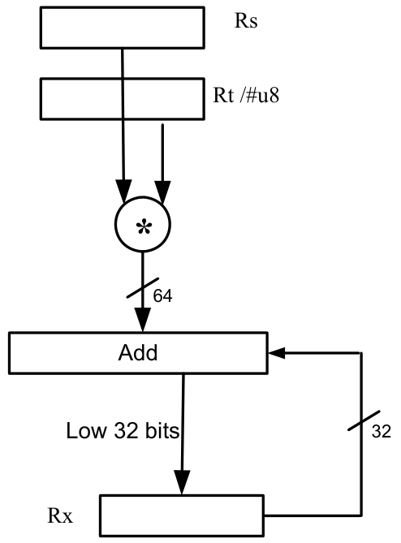

```text
Rs
Rt /#u8
64
Add
Low 32 bits³²
Rx
```

| Syntax | Behavior |
|---|---|
| `Rd=+mpyi(Rs,#u8)` | `apply_extension(#u);`<br>`Rd=Rs*#u;` |
| `Rd=-mpyi(Rs,#u8)` | `Rd=Rs*-#u;` |
| `Rd=add(#u6,mpyi(Rs,#U6`<br>`))` | `apply_extension(#u);`<br>`Rd = #u + Rs*#U;` |
| `Rd=add(#u6,mpyi(Rs,Rt)`<br>`)` | `apply_extension(#u);`<br>`Rd = #u + Rs*Rt;` |
| `Rd=add(Ru,mpyi(#u6:2,R`<br>`s))` | `Rd = Ru + Rs*#u;` |
| `Rd=add(Ru,mpyi(Rs,#u6)`<br>`)` | `apply_extension(#u);`<br>`Rd = Ru + Rs*#u;` |
| `Rd=mpyi(Rs,#m9)` | `if ("((#m9<0) && (#m9>-256))") {`<br>`Assembler mapped to: "Rd=-mpyi(Rs,#m9*(-`<br>`1))";`<br>`} else {`<br>`Assembler mapped to: "Rd=+mpyi(Rs,#m9)";`<br>`}` |
| `Rd=mpyi(Rs,Rt)` | `Rd=Rs*Rt;` |
| `Rd=mpyui(Rs,Rt)` | `Assembler mapped to: "Rd=mpyi(Rs,Rt)"` |
| `Rx+=mpyi(Rs,#u8)` | `apply_extension(#u);`<br>`Rx=Rx + (Rs*#u);` |
| `Rx+=mpyi(Rs,Rt)` | `Rx=Rx + Rs*Rt;` |
| `Rx-=mpyi(Rs,#u8)` | `apply_extension(#u);`<br>`Rx=Rx - (Rs*#u);` |
| `Rx-=mpyi(Rs,Rt)` | `Rx=Rx - Rs*Rt;` |
| `Ry=add(Ru,mpyi(Ry,Rs))` | `Ry = Ru + Rs*Ry;` |

##### Class: XTYPE (slots 2,3)

##### Intrinsics

|  |  |
|---|---|
| `Rd=add(#u6,mpyi(Rs,#U6))` | `Word32 Q6_R_add_mpyi_IRI(Word32 Iu6, Word32 Rs, Word32 IU6)` |
| `Rd=add(#u6,mpyi(Rs,Rt))` | `Word32 Q6_R_add_mpyi_IRR(Word32 Iu6, Word32 Rs, Word32 Rt)` |
| `Rd=add(Ru,mpyi(#u6:2,Rs)` | `Word32 Q6_R_add_mpyi_RIR(Word32 Ru, Word32 Iu6_2,` |
| `)` | `Word32 Rs)` |
| `Rd=add(Ru,mpyi(Rs,#u6))` | `Word32 Q6_R_add_mpyi_RRI(Word32 Ru, Word32 Rs, Word32 Iu6)` |
| `Rd=mpyi(Rs,#m9)` | `Word32 Q6_R_mpyi_RI(Word32 Rs, Word32 Im9)` |
| `Rd=mpyi(Rs,Rt)` | `Word32 Q6_R_mpyi_RR(Word32 Rs, Word32 Rt)` |
| `Rd=mpyui(Rs,Rt)` | `Word32 Q6_R_mpyui_RR(Word32 Rs, Word32 Rt)` |
| `Rx+=mpyi(Rs,#u8)` | `Word32 Q6_R_mpyiacc_RI(Word32 Rx, Word32 Rs, Word32 Iu8)` |
| `Rx+=mpyi(Rs,Rt)` | `Word32 Q6_R_mpyiacc_RR(Word32 Rx, Word32 Rs, Word32 Rt)` |
| `Rx-=mpyi(Rs,#u8)` | `Word32 Q6_R_mpyinac_RI(Word32 Rx, Word32 Rs, Word32 Iu8)` |
| `Rx-=mpyi(Rs,Rt)` | `Word32 Q6_R_mpyinac_RR(Word32 Rx, Word32 Rs, Word32 Rt)` |
| `Ry=add(Ru,mpyi(Ry,Rs))` | `Word32 Q6_R_add_mpyi_RRR(Word32 Ru, Word32 Ry, Word32 Rs)` |

##### Encoding

| 31 | 30 | 29 | 28 | 27 | 26 | 25 | 24 | 23 | 22 | 21 | 20 | 19 | 18 | 17 | 16 | 15 | 14 | 13 | 12 | 11 | 10 | 9 | 8 | 7 | 6 | 5 | 4 | 3 | 2 | 1 | 0 |  |
|---|---|---|---|---|---|---|---|---|---|---|---|---|---|---|---|---|---|---|---|---|---|---|---|---|---|---|---|---|---|---|---|---|
| ICLASS | ICLASS | ICLASS | ICLASS | RegType | RegType | RegType | RegType |  |  |  | s5 | s5 | s5 | s5 | s5 | Parse | Parse |  | t5 | t5 | t5 | t5 | t5 | MinOp | MinOp | MinOp | d5 | d5 | d5 | d5 | d5 |  |
| 1 | 1 | 0 | 1 | 0 | 1 | 1 | 1 | 0 | i | i | s | s | s | s | s | P | P | i | t | t | t | t | t | i | i | i | d | d | d | d | d | Rd=add(#u6,mpyi(Rs,Rt)) |
| ICLASS | ICLASS | ICLASS | ICLASS | RegType | RegType | RegType | RegType |  |  |  | s5 | s5 | s5 | s5 | s5 | Parse | Parse |  | d5 | d5 | d5 | d5 | d5 |  |  |  |  |  |  |  |  |  |
| 1 | 1 | 0 | 1 | 1 | 0 | 0 | 0 | I | i | i | s | s | s | s | s | P | P | i | d | d | d | d | d | i | i | i | I | I | I | I | I | Rd=add(#u6,mpyi(Rs,#U6)) |
| ICLASS | ICLASS | ICLASS | ICLASS | RegType | RegType | RegType | RegType |  |  |  | s5 | s5 | s5 | s5 | s5 | Parse | Parse |  | d5 | d5 | d5 | d5 | d5 |  |  |  | u5 | u5 | u5 | u5 | u5 |  |
| 1 | 1 | 0 | 1 | 1 | 1 | 1 | 1 | 0 | i | i | s | s | s | s | s | P | P | i | d | d | d | d | d | i | i | i | u | u | u | u | u | Rd=add(Ru,mpyi(#u6:2,Rs)) |
| 1 | 1 | 0 | 1 | 1 | 1 | 1 | 1 | 1 | i | i | s | s | s | s | s | P | P | i | d | d | d | d | d | i | i | i | u | u | u | u | u | Rd=add(Ru,mpyi(Rs,#u6)) |
| ICLASS | ICLASS | ICLASS | ICLASS | RegType | RegType | RegType | RegType | MajOp | MajOp | MajOp | s5 | s5 | s5 | s5 | s5 | Parse | Parse |  | y5 | y5 | y5 | y5 | y5 |  |  |  | u5 | u5 | u5 | u5 | u5 |  |
| 1 | 1 | 1 | 0 | 0 | 0 | 1 | 1 | 0 | 0 | 0 | s | s | s | s | s | P | P | - | y | y | y | y | y | - | - | - | u | u | u | u | u | Ry=add(Ru,mpyi(Ry,Rs)) |
| ICLASS | ICLASS | ICLASS | ICLASS | RegType | RegType | RegType | RegType | MajOp | MajOp | MajOp | s5 | s5 | s5 | s5 | s5 | Parse | Parse |  |  |  |  |  |  | MinOp | MinOp | MinOp | d5 | d5 | d5 | d5 | d5 |  |
| 1 | 1 | 1 | 0 | 0 | 0 | 0 | 0 | 0 | - | - | s | s | s | s | s | P | P | 0 | i | i | i | i | i | i | i | i | d | d | d | d | d | Rd=+mpyi(Rs,#u8) |
| 1 | 1 | 1 | 0 | 0 | 0 | 0 | 0 | 1 | - | - | s | s | s | s | s | P | P | 0 | i | i | i | i | i | i | i | i | d | d | d | d | d | Rd=-mpyi(Rs,#u8) |
| ICLASS | ICLASS | ICLASS | ICLASS | RegType | RegType | RegType | RegType | MajOp | MajOp | MajOp | s5 | s5 | s5 | s5 | s5 | Parse | Parse |  |  |  |  |  |  | MinOp | MinOp | MinOp | x5 | x5 | x5 | x5 | x5 |  |
| 1 | 1 | 1 | 0 | 0 | 0 | 0 | 1 | 0 | - | - | s | s | s | s | s | P | P | 0 | i | i | i | i | i | i | i | i | x | x | x | x | x | Rx+=mpyi(Rs,#u8) |
| 1 | 1 | 1 | 0 | 0 | 0 | 0 | 1 | 1 | - | - | s | s | s | s | s | P | P | 0 | i | i | i | i | i | i | i | i | x | x | x | x | x | Rx-=mpyi(Rs,#u8) |
| ICLASS | ICLASS | ICLASS | ICLASS | RegType | RegType | RegType | RegType | MajOp | MajOp | MajOp | s5 | s5 | s5 | s5 | s5 | Parse | Parse |  | t5 | t5 | t5 | t5 | t5 | MinOp | MinOp | MinOp | d5 | d5 | d5 | d5 | d5 |  |
| 1 | 1 | 1 | 0 | 1 | 1 | 0 | 1 | 0 | 0 | 0 | s | s | s | s | s | P | P | 0 | t | t | t | t | t | 0 | 0 | 0 | d | d | d | d | d | Rd=mpyi(Rs,Rt) |
| ICLASS | ICLASS | ICLASS | ICLASS | RegType | RegType | RegType | RegType | MajOp | MajOp | MajOp | s5 | s5 | s5 | s5 | s5 | Parse | Parse |  | t5 | t5 | t5 | t5 | t5 | MinOp | MinOp | MinOp | x5 | x5 | x5 | x5 | x5 |  |
| 1 | 1 | 1 | 0 | 1 | 1 | 1 | 1 | 0 | 0 | 0 | s | s | s | s | s | P | P | 0 | t | t | t | t | t | 0 | 0 | 0 | x | x | x | x | x | Rx+=mpyi(Rs,Rt) |
| 1 | 1 | 1 | 0 | 1 | 1 | 1 | 1 | 1 | 0 | 0 | s | s | s | s | s | P | P | 0 | t | t | t | t | t | 0 | 0 | 0 | x | x | x | x | x | Rx-=mpyi(Rs,Rt) |

| Field name | Description |
|---|---|
| `RegType` | Register type |
| `MajOp` | Major opcode |
| `MinOp` | Minor opcode |
| `ICLASS` | Instruction class |
| `Parse` | Packet/loop parse bits |
| `d5` | Field to encode register d |
| `s5` | Field to encode register s |
| `t5` | Field to encode register t |
| `u5` | Field to encode register u |
| `x5` | Field to encode register x |
| `y5` | Field to encode register y |

#### Vector multiply word by signed half (32 × 16)

Perform mixed precision vector multiply operations. A 32-bit word from vector Rss is multiplied

by a 16-bit halfword (either even or odd) from vector Rtt. The multiplication is performed as a

signed 32 × 16, which produces a 48-bit result. This result is optionally scaled left by one bit. This

result is then shifted right by 16 bits, optionally accumulated and then saturated to 32 bits.

This operation is available in vector form (vmpyweh/vmpywoh) and non-vector form (multiply and use upper result).

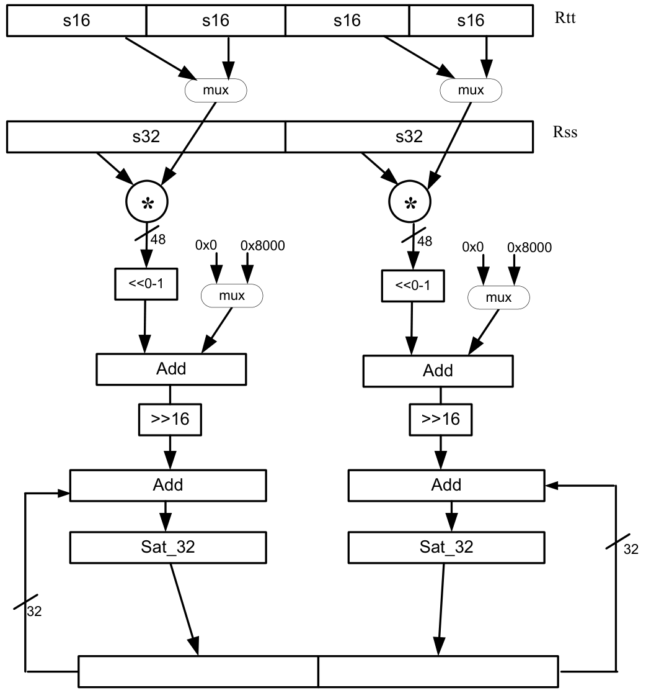

```text
s16 s16 s16 s16 Rtt
mux mux
Rss
s32 s32
₄₈ ₄₈
0x0 0x8000 0x0 0x8000
<<0-1 <<0-1
mux mux
Add Add
>>16 >>16
Add Add
Sat_32 Sat_32₃₂
32
```

Rxx

| Syntax | Behavior |
|---|---|
| `Rdd= `<br>`vmpyweh(Rss,Rtt)[:<<1]:rnd:sat` | `Rdd.w[1]=sat₃₂(((Rss.w[1] * `<br>`Rtt.h[2])[<<1]+0x8000)>>16);`<br>`Rdd.w[0]=sat₃₂(((Rss.w[0] * `<br>`Rtt.h[0])[<<1]+0x8000)>>16);` |
| `Rdd=vmpyweh(Rss,Rtt)[:<<1]:sat` | `Rdd.w[1]=sat₃₂(((Rss.w[1] * `<br>`Rtt.h[2])[<<1])>>16);`<br>`Rdd.w[0]=sat₃₂(((Rss.w[0] * `<br>`Rtt.h[0])[<<1])>>16);` |
| `Rdd= `<br>`vmpywoh(Rss,Rtt)[:<<1]:rnd:sat` | `Rdd.w[1]=sat₃₂(((Rss.w[1] * `<br>`Rtt.h[3])[<<1]+0x8000)>>16);`<br>`Rdd.w[0]=sat₃₂(((Rss.w[0] * `<br>`Rtt.h[1])[<<1]+0x8000)>>16);` |
| `Rdd=vmpywoh(Rss,Rtt)[:<<1]:sat` | `Rdd.w[1]=sat₃₂(((Rss.w[1] * `<br>`Rtt.h[3])[<<1])>>16);`<br>`Rdd.w[0]=sat₃₂(((Rss.w[0] * `<br>`Rtt.h[1])[<<1])>>16);` |
| `Rxx+= `<br>`vmpyweh(Rss,Rtt)[:<<1]:rnd:sat` | `Rxx.w[1]=sat₃₂(Rxx.w[1] + (((Rss.w[1] * `<br>`Rtt.h[2])[<<1]+0x8000)>>16));`<br>`Rxx.w[0]=sat₃₂(Rxx.w[0] + (((Rss.w[0] * `<br>`Rtt.h[0])[<<1]+0x8000)>>16));` |
| `Rxx+= vmpyweh(Rss,Rtt)[:<<1]:sat` | `Rxx.w[1]=sat₃₂(Rxx.w[1] + (((Rss.w[1] * `<br>`Rtt.h[2])[<<1])>>16));`<br>`Rxx.w[0]=sat₃₂(Rxx.w[0] + (((Rss.w[0] * `<br>`Rtt.h[0])[<<1])>>16));` |
| `Rxx+= `<br>`vmpywoh(Rss,Rtt)[:<<1]:rnd:sat` | `Rxx.w[1]=sat₃₂(Rxx.w[1] + (((Rss.w[1] * `<br>`Rtt.h[3])[<<1]+0x8000)>>16));`<br>`Rxx.w[0]=sat₃₂(Rxx.w[0] + (((Rss.w[0] * `<br>`Rtt.h[1])[<<1]+0x8000)>>16 ));` |
| `Rxx+=vmpywoh(Rss,Rtt)[:<<1]:sat` | `Rxx.w[1]=sat₃₂(Rxx.w[1] + (((Rss.w[1] * `<br>`Rtt.h[3])[<<1])>>16));`<br>`Rxx.w[0]=sat₃₂(Rxx.w[0] + (((Rss.w[0] * `<br>`Rtt.h[1])[<<1])>>16 ));` |

##### Class: XTYPE (slots 2,3)

##### Notes

- If saturation occurs during execution of this instruction (a result is clamped to either maximum or minimum values), the OVF bit in the status register is set. OVF remains set until explicitly cleared by a transfer to the status register.

##### Intrinsics

|  |  |
|---|---|
| `Rdd=` | `Word64 Q6_P_vmpyweh_PP_s1_rnd_sat(Word64 Rss,` |
| `vmpyweh(Rss,Rtt):<<1:rnd:sat` | `Word64 Rtt)` |
| `Rdd=vmpyweh(Rss,Rtt):<<1:sat` | `Word64 Q6_P_vmpyweh_PP_s1_sat(Word64 Rss, Word64 Rtt)` |
| `Rdd=vmpyweh(Rss,Rtt):rnd:sat` | `Word64 Q6_P_vmpyweh_PP_rnd_sat(Word64 Rss, Word64 Rtt)` |
| `Rdd=vmpyweh(Rss,Rtt):sat` | `Word64 Q6_P_vmpyweh_PP_sat(Word64 Rss, Word64 Rtt)` |
| `Rdd=` | `Word64 Q6_P_vmpywoh_PP_s1_rnd_sat(Word64 Rss,` |
| `vmpywoh(Rss,Rtt):<<1:rnd:sat` | `Word64 Rtt)` |
| `Rdd=vmpywoh(Rss,Rtt):<<1:sat` | `Word64 Q6_P_vmpywoh_PP_s1_sat(Word64 Rss, Word64 Rtt)` |
| `Rdd=vmpywoh(Rss,Rtt):rnd:sat` | `Word64 Q6_P_vmpywoh_PP_rnd_sat(Word64 Rss, Word64 Rtt)` |
| `Rdd=vmpywoh(Rss,Rtt):sat` | `Word64 Q6_P_vmpywoh_PP_sat(Word64 Rss, Word64 Rtt)` |
| `Rxx+=` | `Word64 Q6_P_vmpywehacc_PP_s1_rnd_sat(Word64 Rxx,` |
| `vmpyweh(Rss,Rtt):<<1:rnd:sat` | `Word64 Rss, Word64 Rtt)` |
| `Rxx+=vmpyweh(Rss,Rtt):<<1:sat` | `Word64 Q6_P_vmpywehacc_PP_s1_sat(Word64 Rxx, Word64 Rss, Word64 Rtt)` |
| `Rxx+=vmpyweh(Rss,Rtt):rnd:sat` | `Word64 Q6_P_vmpywehacc_PP_rnd_sat(Word64 Rxx, Word64 Rss, Word64 Rtt)` |
| `Rxx+=vmpyweh(Rss,Rtt):sat` | `Word64 Q6_P_vmpywehacc_PP_sat(Word64 Rxx, Word64 Rss, Word64 Rtt)` |
| `Rxx+=` | `Word64 Q6_P_vmpywohacc_PP_s1_rnd_sat(Word64 Rxx,` |
| `vmpywoh(Rss,Rtt):<<1:rnd:sat` | `Word64 Rss, Word64 Rtt)` |
| `Rxx+=vmpywoh(Rss,Rtt):<<1:sat` | `Word64 Q6_P_vmpywohacc_PP_s1_sat(Word64 Rxx, Word64 Rss, Word64 Rtt)` |
| `Rxx+=vmpywoh(Rss,Rtt):rnd:sat` | `Word64 Q6_P_vmpywohacc_PP_rnd_sat(Word64 Rxx, Word64 Rss, Word64 Rtt)` |
| `Rxx+=vmpywoh(Rss,Rtt):sat` | `Word64 Q6_P_vmpywohacc_PP_sat(Word64 Rxx, Word64 Rss, Word64 Rtt)` |

##### Encoding

| 31 | 30 | 29 | 28 | 27 | 26 | 25 | 24 | 23 | 22 | 21 | 20 | 19 | 18 | 17 | 16 | 15 | 14 | 13 | 12 | 11 | 10 | 9 | 8 | 7 | 6 | 5 | 4 | 3 | 2 | 1 | 0 |  |
|---|---|---|---|---|---|---|---|---|---|---|---|---|---|---|---|---|---|---|---|---|---|---|---|---|---|---|---|---|---|---|---|---|
| ICLASS | ICLASS | ICLASS | ICLASS | RegType | RegType | RegType | RegType | MajOp | MajOp | MajOp | s5 | s5 | s5 | s5 | s5 | Parse | Parse |  | t5 | t5 | t5 | t5 | t5 | MinOp | MinOp | MinOp | d5 | d5 | d5 | d5 | d5 |  |
| 1 | 1 | 1 | 0 | 1 | 0 | 0 | 0 | N | 0 | 0 | s | s | s | s | s | P | P | 0 | t | t | t | t | t | 1 | 0 | 1 | d | d | d | d | d | Rdd=vmpyweh(Rss,Rtt)[:<<N]:sat |
| 1 | 1 | 1 | 0 | 1 | 0 | 0 | 0 | N | 0 | 0 | s | s | s | s | s | P | P | 0 | t | t | t | t | t | 1 | 1 | 1 | d | d | d | d | d | Rdd=vmpywoh(Rss,Rtt)[:<<N]:sat |
| 1 | 1 | 1 | 0 | 1 | 0 | 0 | 0 | N | 0 | 1 | s | s | s | s | s | P | P | 0 | t | t | t | t | t | 1 | 0 | 1 | d | d | d | d | d | Rdd=vmpyweh(Rss,Rtt)[:<<N]:rnd:sat |
| 1 | 1 | 1 | 0 | 1 | 0 | 0 | 0 | N | 0 | 1 | s | s | s | s | s | P | P | 0 | t | t | t | t | t | 1 | 1 | 1 | d | d | d | d | d | Rdd=vmpywoh(Rss,Rtt)[:<<N]:rnd:sat |
| ICLASS | ICLASS | ICLASS | ICLASS | RegType | RegType | RegType | RegType | MajOp | MajOp | MajOp | s5 | s5 | s5 | s5 | s5 | Parse | Parse |  | t5 | t5 | t5 | t5 | t5 | MinOp | MinOp | MinOp | x5 | x5 | x5 | x5 | x5 |  |
| 1 | 1 | 1 | 0 | 1 | 0 | 1 | 0 | N | 0 | 0 | s | s | s | s | s | P | P | 0 | t | t | t | t | t | 1 | 0 | 1 | x | x | x | x | x | Rxx+=vmpyweh(Rss,Rtt)[:<<N]:sat |
| 1 | 1 | 1 | 0 | 1 | 0 | 1 | 0 | N | 0 | 0 | s | s | s | s | s | P | P | 0 | t | t | t | t | t | 1 | 1 | 1 | x | x | x | x | x | Rxx+=vmpywoh(Rss,Rtt)[:<<N]:sat |
| 1 | 1 | 1 | 0 | 1 | 0 | 1 | 0 | N | 0 | 1 | s | s | s | s | s | P | P | 0 | t | t | t | t | t | 1 | 0 | 1 | x | x | x | x | x | Rxx+=vmpyweh(Rss,Rtt)[:<<N]:rnd:sat |
| 1 | 1 | 1 | 0 | 1 | 0 | 1 | 0 | N | 0 | 1 | s | s | s | s | s | P | P | 0 | t | t | t | t | t | 1 | 1 | 1 | x | x | x | x | x | Rxx+=vmpywoh(Rss,Rtt)[:<<N]:rnd:sat |

| Field name | Description |
|---|---|
| `ICLASS` | Instruction class |
| `MajOp` | Major opcode |
| `MinOp` | Minor opcode |
| Field name | Description |
| `RegType` | Register type |
| `Parse` | Packet/loop parse bits |
| `d5` | Field to encode register d |
| `s5` | Field to encode register s |
| `t5` | Field to encode register t |
| `x5` | Field to encode register x |

#### Vector multiply word by unsigned half (32 × 16)

Perform mixed precision vector multiply operations. A 32-bit signed word from vector Rss is multiplied by a 16-bit unsigned halfword (either odd or even) from vector Rtt. This multiplication produces a 48-bit result. This result is optionally scaled left by one bit, and then a rounding constant is optionally added to the lower 16 bits. This result is then shifted right by 16 bits, optionally accumulated and then saturated to 32 bits. This is a dual vector operation and is performed for both high and low word of Rss.


```text
u16 u16 u16 u16 Rtt
mux mux
Rss
s32 s32
₄₈ ₄₈
0x0 0x8000 0x0 0x8000
<<0-1 <<0-1
mux mux
Add Add
>>16 >>16
Add Add
Sat_32 Sat_32₃₂
32
```

Rxx

| Syntax | Behavior |
|---|---|
| `Rdd= `<br>`vmpyweuh(Rss,Rtt)[:<<1]:rnd:sat` | `Rdd.w[1]=sat₃₂(((Rss.w[1] * `<br>`Rtt.uh[2])[<<1]+0x8000)>>16);`<br>`Rdd.w[0]=sat₃₂(((Rss.w[0] * `<br>`Rtt.uh[0])[<<1]+0x8000)>>16);` |
| `Rdd=vmpyweuh(Rss,Rtt)[:<<1]:sat` | `Rdd.w[1]=sat₃₂(((Rss.w[1] * `<br>`Rtt.uh[2])[<<1])>>16);`<br>`Rdd.w[0]=sat₃₂(((Rss.w[0] * `<br>`Rtt.uh[0])[<<1])>>16);` |
| `Rdd= `<br>`vmpywouh(Rss,Rtt)[:<<1]:rnd:sat` | `Rdd.w[1]=sat₃₂(((Rss.w[1] * `<br>`Rtt.uh[3])[<<1]+0x8000)>>16);`<br>`Rdd.w[0]=sat₃₂(((Rss.w[0] * `<br>`Rtt.uh[1])[<<1]+0x8000)>>16);` |
| `Rdd= vmpywouh(Rss,Rtt)[:<<1]:sat` | `Rdd.w[1]=sat₃₂(((Rss.w[1] * `<br>`Rtt.uh[3])[<<1])>>16);`<br>`Rdd.w[0]=sat₃₂(((Rss.w[0] * `<br>`Rtt.uh[1])[<<1])>>16);` |
| `Rxx+= `<br>`vmpyweuh(Rss,Rtt)[:<<1]:rnd:sat` | `Rxx.w[1]=sat₃₂(Rxx.w[1] + (((Rss.w[1] * `<br>`Rtt.uh[2])[<<1]+0x8000)>>16));`<br>`Rxx.w[0]=sat₃₂(Rxx.w[0] + (((Rss.w[0] * `<br>`Rtt.uh[0])[<<1]+0x8000)>>16));` |
| `Rxx+= vmpyweuh(Rss,Rtt)[:<<1]:sat` | `Rxx.w[1]=sat₃₂(Rxx.w[1] + (((Rss.w[1] * `<br>`Rtt.uh[2])[<<1])>>16));`<br>`Rxx.w[0]=sat₃₂(Rxx.w[0] + (((Rss.w[0] * `<br>`Rtt.uh[0])[<<1])>>16));` |
| `Rxx+= `<br>`vmpywouh(Rss,Rtt)[:<<1]:rnd:sat` | `Rxx.w[1]=sat₃₂(Rxx.w[1] + (((Rss.w[1] * `<br>`Rtt.uh[3])[<<1]+0x8000)>>16));`<br>`Rxx.w[0]=sat₃₂(Rxx.w[0] + (((Rss.w[0] * `<br>`Rtt.uh[1])[<<1]+0x8000)>>16 ));` |
| `Rxx+=vmpywouh(Rss,Rtt)[:<<1]:sat` | `Rxx.w[1]=sat₃₂(Rxx.w[1] + (((Rss.w[1] * `<br>`Rtt.uh[3])[<<1])>>16));`<br>`Rxx.w[0]=sat₃₂(Rxx.w[0] + (((Rss.w[0] * `<br>`Rtt.uh[1])[<<1])>>16 ));` |

##### Class: XTYPE (slots 2,3)

##### Notes

- If saturation occurs during execution of this instruction (a result is clamped to either maximum or minimum values), the OVF bit in the status register is set. OVF remains set until explicitly cleared by a transfer to the status register.

##### Intrinsics

|  |  |
|---|---|
| `Rdd=` | `Word64 Q6_P_vmpyweuh_PP_s1_rnd_sat(Word64 Rss,` |
| `vmpyweuh(Rss,Rtt):<<1:rnd:sat` | `Word64 Rtt)` |
| `Rdd=vmpyweuh(Rss,Rtt):<<1:sat` | `Word64 Q6_P_vmpyweuh_PP_s1_sat(Word64 Rss, Word64 Rtt)` |
| `Rdd=vmpyweuh(Rss,Rtt):rnd:sat` | `Word64 Q6_P_vmpyweuh_PP_rnd_sat(Word64 Rss, Word64 Rtt)` |
| `Rdd=vmpyweuh(Rss,Rtt):sat` | `Word64 Q6_P_vmpyweuh_PP_sat(Word64 Rss, Word64 Rtt)` |
| `Rdd=` | `Word64 Q6_P_vmpywouh_PP_s1_rnd_sat(Word64 Rss,` |
| `vmpywouh(Rss,Rtt):<<1:rnd:sat` | `Word64 Rtt)` |
| `Rdd=vmpywouh(Rss,Rtt):<<1:sat` | `Word64 Q6_P_vmpywouh_PP_s1_sat(Word64 Rss, Word64 Rtt)` |
| `Rdd=vmpywouh(Rss,Rtt):rnd:sat` | `Word64 Q6_P_vmpywouh_PP_rnd_sat(Word64 Rss, Word64 Rtt)` |
| `Rdd=vmpywouh(Rss,Rtt):sat` | `Word64 Q6_P_vmpywouh_PP_sat(Word64 Rss, Word64 Rtt)` |
| `Rxx+=` | `Word64 Q6_P_vmpyweuhacc_PP_s1_rnd_sat(Word64` |
| `vmpyweuh(Rss,Rtt):<<1:rnd:sat` | `Rxx, Word64 Rss, Word64 Rtt)` |
| `Rxx+=vmpyweuh(Rss,Rtt):<<1:sat` | `Word64 Q6_P_vmpyweuhacc_PP_s1_sat(Word64 Rxx, Word64 Rss, Word64 Rtt)` |
| `Rxx+=vmpyweuh(Rss,Rtt):rnd:sat` | `Word64 Q6_P_vmpyweuhacc_PP_rnd_sat(Word64 Rxx, Word64 Rss, Word64 Rtt)` |
| `Rxx+=vmpyweuh(Rss,Rtt):sat` | `Word64 Q6_P_vmpyweuhacc_PP_sat(Word64 Rxx, Word64 Rss, Word64 Rtt)` |
| `Rxx+=` | `Word64 Q6_P_vmpywouhacc_PP_s1_rnd_sat(Word64` |
| `vmpywouh(Rss,Rtt):<<1:rnd:sat` | `Rxx, Word64 Rss, Word64 Rtt)` |
| `Rxx+=vmpywouh(Rss,Rtt):<<1:sat` | `Word64 Q6_P_vmpywouhacc_PP_s1_sat(Word64 Rxx, Word64 Rss, Word64 Rtt)` |
| `Rxx+=vmpywouh(Rss,Rtt):rnd:sat` | `Word64 Q6_P_vmpywouhacc_PP_rnd_sat(Word64 Rxx, Word64 Rss, Word64 Rtt)` |
| `Rxx+=vmpywouh(Rss,Rtt):sat` | `Word64 Q6_P_vmpywouhacc_PP_sat(Word64 Rxx, Word64 Rss, Word64 Rtt)` |

##### Encoding

| 31 | 30 | 29 | 28 | 27 | 26 | 25 | 24 | 23 | 22 | 21 | 20 | 19 | 18 | 17 | 16 | 15 | 14 | 13 | 12 | 11 | 10 | 9 | 8 | 7 | 6 | 5 | 4 | 3 | 2 | 1 | 0 |  |
|---|---|---|---|---|---|---|---|---|---|---|---|---|---|---|---|---|---|---|---|---|---|---|---|---|---|---|---|---|---|---|---|---|
| ICLASS | ICLASS | ICLASS | ICLASS | RegType | RegType | RegType | RegType | MajOp | MajOp | MajOp | s5 | s5 | s5 | s5 | s5 | Parse | Parse |  | t5 | t5 | t5 | t5 | t5 | MinOp | MinOp | MinOp | d5 | d5 | d5 | d5 | d5 |  |
| 1 | 1 | 1 | 0 | 1 | 0 | 0 | 0 | N | 1 | 0 | s | s | s | s | s | P | P | 0 | t | t | t | t | t | 1 | 0 | 1 | d | d | d | d | d | Rdd=vmpyweuh(Rss,Rtt)[:<<N]:sat |
| 1 | 1 | 1 | 0 | 1 | 0 | 0 | 0 | N | 1 | 0 | s | s | s | s | s | P | P | 0 | t | t | t | t | t | 1 | 1 | 1 | d | d | d | d | d | Rdd=vmpywouh(Rss,Rtt)[:<<N]:sat |
| 1 | 1 | 1 | 0 | 1 | 0 | 0 | 0 | N | 1 | 1 | s | s | s | s | s | P | P | 0 | t | t | t | t | t | 1 | 0 | 1 | d | d | d | d | d | Rdd=vmpyweuh(Rss,Rtt)[:<<N]:rnd:sat |
| 1 | 1 | 1 | 0 | 1 | 0 | 0 | 0 | N | 1 | 1 | s | s | s | s | s | P | P | 0 | t | t | t | t | t | 1 | 1 | 1 | d | d | d | d | d | Rdd=vmpywouh(Rss,Rtt)[:<<N]:rnd:sat |
| ICLASS | ICLASS | ICLASS | ICLASS | RegType | RegType | RegType | RegType | MajOp | MajOp | MajOp | s5 | s5 | s5 | s5 | s5 | Parse | Parse |  | t5 | t5 | t5 | t5 | t5 | MinOp | MinOp | MinOp | x5 | x5 | x5 | x5 | x5 |  |
| 1 | 1 | 1 | 0 | 1 | 0 | 1 | 0 | N | 1 | 0 | s | s | s | s | s | P | P | 0 | t | t | t | t | t | 1 | 0 | 1 | x | x | x | x | x | Rxx+=vmpyweuh(Rss,Rtt)[: <<N]:sat |
| 1 | 1 | 1 | 0 | 1 | 0 | 1 | 0 | N | 1 | 0 | s | s | s | s | s | P | P | 0 | t | t | t | t | t | 1 | 1 | 1 | x | x | x | x | x | Rxx+=vmpywouh(Rss,Rtt)[: <<N]:sat |
| 1 | 1 | 1 | 0 | 1 | 0 | 1 | 0 | N | 1 | 1 | s | s | s | s | s | P | P | 0 | t | t | t | t | t | 1 | 0 | 1 | x | x | x | x | x | Rxx+=vmpyweuh(Rss,Rtt)[: <<N]:rnd:sat |
| 1 | 1 | 1 | 0 | 1 | 0 | 1 | 0 | N | 1 | 1 | s | s | s | s | s | P | P | 0 | t | t | t | t | t | 1 | 1 | 1 | x | x | x | x | x | Rxx+=vmpywouh(Rss,Rtt)[: <<N]:rnd:sat |

| Field name | Description |
|---|---|
| `ICLASS` | Instruction class |
| `MajOp` | Major opcode |
| `MinOp` | Minor opcode |
| `RegType` | Register type |
| `Parse` | Packet/loop parse bits |
| `d5` | Field to encode register d |
| `s5` | Field to encode register s |
| `t5` | Field to encode register t |
| `x5` | Field to encode register x |

#### Multiply signed halfwords

Multiply two signed halfwords. Optionally shift the multiplier result by 1 bit. This result can be accumulated or rounded. The destination/accumulator is either 32 or 64 bits. For 32-bit results, saturation is optional.

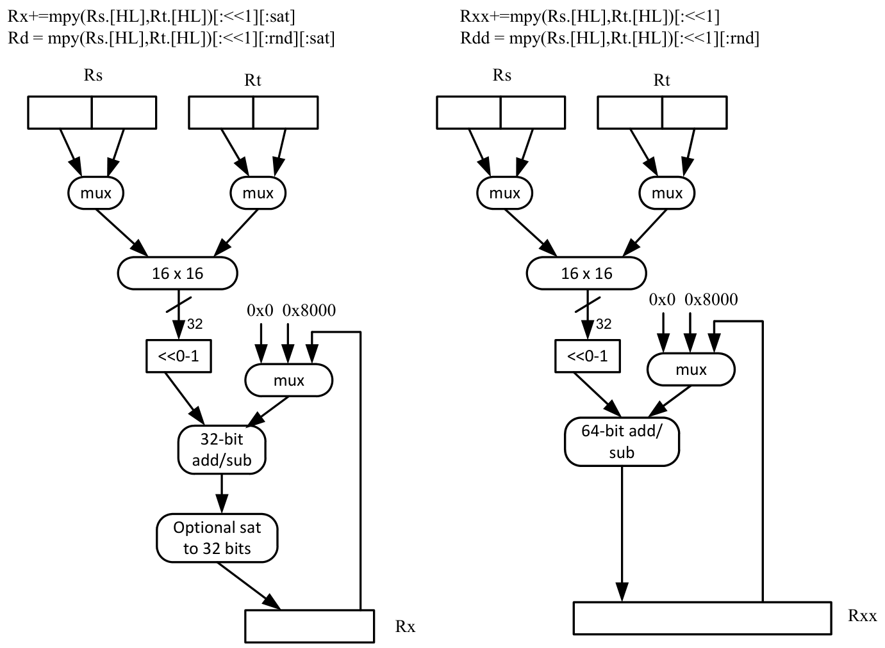

```text
Rx+=mpy(Rs.[HL],Rt.[HL])[:<<1][:sat] Rxx+=mpy(Rs.[HL],Rt.[HL])[:<<1]
Rd = mpy(Rs.[HL],Rt.[HL])[:<<1][:rnd][:sat] Rdd = mpy(Rs.[HL],Rt.[HL])[:<<1][:rnd]
Rs Rt Rs Rt
mux mux mux mux
16 x 16 16 x 16
0x0 0x8000
0x0 0x8000
32 32
<<0-1 <<0-1
mux
mux
64-bit add/
32-bit
sub
add/sub
Optional sat
to 32 bits
Rxx
Rx
```

| Syntax | Behavior |
|---|---|
| `Rd= `<br>`mpy(Rs.[HL],Rt.[HL])[:<<1][:rnd][:sat`<br>`]` | `Rd=[sat₃₂]([round]((Rs.h[01] * `<br>`Rt.h[01])[<<1]));` |
| `Rdd=mpy(Rs.[HL],Rt.[HL])[:<<1][:rnd]` | `Rdd=[round]((Rs.h[01] * Rt.h[01])[<<1]);` |
| `Rx+=mpy(Rs.[HL],Rt.[HL])[:<<1][:sat]` | `Rx=[sat₃₂](Rx+ (Rs.h[01] * Rt.h[01])[<<1]);` |
| `Rx-=mpy(Rs.[HL],Rt.[HL])[:<<1][:sat]` | `Rx=[sat₃₂](Rx- (Rs.h[01] * Rt.h[01])[<<1]);` |
| `Rxx+=mpy(Rs.[HL],Rt.[HL])[:<<1]` | `Rxx=Rxx+ (Rs.h[01] * Rt.h[01])[<<1];` |
| `Rxx-=mpy(Rs.[HL],Rt.[HL])[:<<1]` | `Rxx=Rxx- (Rs.h[01] * Rt.h[01])[<<1];` |

##### Class: XTYPE (slots 2,3)

##### Notes

- If saturation occurs during execution of this instruction (a result is clamped to either maximum or minimum values), the OVF bit in the status register is set. OVF remains set until explicitly cleared by a transfer to the status register.

##### Intrinsics

|  |  |
|---|---|
| `Rd=mpy(Rs.H,Rt.H)` | `Word32 Q6_R_mpy_RhRh(Word32 Rs, Word32 Rt)` |
| `Rd=mpy(Rs.H,Rt.H):<<1` | `Word32 Q6_R_mpy_RhRh_s1(Word32 Rs, Word32 Rt)` |
| `Rd=mpy(Rs.H,Rt.H):<<1:rnd` | `Word32 Q6_R_mpy_RhRh_s1_rnd(Word32 Rs, Word32 Rt)` |
| `Rd=mpy(Rs.H,Rt.H):<<1:rnd:` | `Word32 Q6_R_mpy_RhRh_s1_rnd_sat(Word32 Rs, Word32` |
| `sat` | `Rt)` |
| `Rd=mpy(Rs.H,Rt.H):<<1:sat` | `Word32 Q6_R_mpy_RhRh_s1_sat(Word32 Rs, Word32 Rt)` |
| `Rd=mpy(Rs.H,Rt.H):rnd` | `Word32 Q6_R_mpy_RhRh_rnd(Word32 Rs, Word32 Rt)` |
| `Rd=mpy(Rs.H,Rt.H):rnd:sat` | `Word32 Q6_R_mpy_RhRh_rnd_sat(Word32 Rs, Word32 Rt)` |
| `Rd=mpy(Rs.H,Rt.H):sat` | `Word32 Q6_R_mpy_RhRh_sat(Word32 Rs, Word32 Rt)` |
| `Rd=mpy(Rs.H,Rt.L)` | `Word32 Q6_R_mpy_RhRl(Word32 Rs, Word32 Rt)` |
| `Rd=mpy(Rs.H,Rt.L):<<1` | `Word32 Q6_R_mpy_RhRl_s1(Word32 Rs, Word32 Rt)` |
| `Rd=mpy(Rs.H,Rt.L):<<1:rnd` | `Word32 Q6_R_mpy_RhRl_s1_rnd(Word32 Rs, Word32 Rt)` |
| `Rd=mpy(Rs.H,Rt.L):<<1:rnd:` | `Word32 Q6_R_mpy_RhRl_s1_rnd_sat(Word32 Rs, Word32` |
| `sat` | `Rt)` |
| `Rd=mpy(Rs.H,Rt.L):<<1:sat` | `Word32 Q6_R_mpy_RhRl_s1_sat(Word32 Rs, Word32 Rt)` |
| `Rd=mpy(Rs.H,Rt.L):rnd` | `Word32 Q6_R_mpy_RhRl_rnd(Word32 Rs, Word32 Rt)` |
| `Rd=mpy(Rs.H,Rt.L):rnd:sat` | `Word32 Q6_R_mpy_RhRl_rnd_sat(Word32 Rs, Word32 Rt)` |
| `Rd=mpy(Rs.H,Rt.L):sat` | `Word32 Q6_R_mpy_RhRl_sat(Word32 Rs, Word32 Rt)` |
| `Rd=mpy(Rs.L,Rt.H)` | `Word32 Q6_R_mpy_RlRh(Word32 Rs, Word32 Rt)` |
| `Rd=mpy(Rs.L,Rt.H):<<1` | `Word32 Q6_R_mpy_RlRh_s1(Word32 Rs, Word32 Rt)` |
| `Rd=mpy(Rs.L,Rt.H):<<1:rnd` | `Word32 Q6_R_mpy_RlRh_s1_rnd(Word32 Rs, Word32 Rt)` |
| `Rd=mpy(Rs.L,Rt.H):<<1:rnd:` | `Word32 Q6_R_mpy_RlRh_s1_rnd_sat(Word32 Rs, Word32` |
| `sat` | `Rt)` |
| `Rd=mpy(Rs.L,Rt.H):<<1:sat` | `Word32 Q6_R_mpy_RlRh_s1_sat(Word32 Rs, Word32 Rt)` |
| `Rd=mpy(Rs.L,Rt.H):rnd` | `Word32 Q6_R_mpy_RlRh_rnd(Word32 Rs, Word32 Rt)` |
| `Rd=mpy(Rs.L,Rt.H):rnd:sat` | `Word32 Q6_R_mpy_RlRh_rnd_sat(Word32 Rs, Word32 Rt)` |
| `Rd=mpy(Rs.L,Rt.H):sat` | `Word32 Q6_R_mpy_RlRh_sat(Word32 Rs, Word32 Rt)` |
| `Rd=mpy(Rs.L,Rt.L)` | `Word32 Q6_R_mpy_RlRl(Word32 Rs, Word32 Rt)` |
| `Rd=mpy(Rs.L,Rt.L):<<1` | `Word32 Q6_R_mpy_RlRl_s1(Word32 Rs, Word32 Rt)` |
| `Rd=mpy(Rs.L,Rt.L):<<1:rnd` | `Word32 Q6_R_mpy_RlRl_s1_rnd(Word32 Rs, Word32 Rt)` |
| `Rd=mpy(Rs.L,Rt.L):<<1:rnd:` | `Word32 Q6_R_mpy_RlRl_s1_rnd_sat(Word32 Rs, Word32` |
| `sat` | `Rt)` |
| `Rd=mpy(Rs.L,Rt.L):<<1:sat` | `Word32 Q6_R_mpy_RlRl_s1_sat(Word32 Rs, Word32 Rt)` |
| `Rd=mpy(Rs.L,Rt.L):rnd` | `Word32 Q6_R_mpy_RlRl_rnd(Word32 Rs, Word32 Rt)` |
| `Rd=mpy(Rs.L,Rt.L):rnd:sat` | `Word32 Q6_R_mpy_RlRl_rnd_sat(Word32 Rs, Word32 Rt)` |
| `Rd=mpy(Rs.L,Rt.L):sat` | `Word32 Q6_R_mpy_RlRl_sat(Word32 Rs, Word32 Rt)` |
| `Rdd=mpy(Rs.H,Rt.H)` | `Word64 Q6_P_mpy_RhRh(Word32 Rs, Word32 Rt)` |
| `Rdd=mpy(Rs.H,Rt.H):<<1` | `Word64 Q6_P_mpy_RhRh_s1(Word32 Rs, Word32 Rt)` |
| `Rdd=mpy(Rs.H,Rt.H):<<1:rnd` | `Word64 Q6_P_mpy_RhRh_s1_rnd(Word32 Rs, Word32 Rt)` |
| `Rdd=mpy(Rs.H,Rt.H):rnd` | `Word64 Q6_P_mpy_RhRh_rnd(Word32 Rs, Word32 Rt)` |
| `Rdd=mpy(Rs.H,Rt.L)` | `Word64 Q6_P_mpy_RhRl(Word32 Rs, Word32 Rt)` |
| `Rdd=mpy(Rs.H,Rt.L):<<1` | `Word64 Q6_P_mpy_RhRl_s1(Word32 Rs, Word32 Rt)` |
| `Rdd=mpy(Rs.H,Rt.L):<<1:rnd` | `Word64 Q6_P_mpy_RhRl_s1_rnd(Word32 Rs, Word32 Rt)` |
| `Rdd=mpy(Rs.H,Rt.L):rnd` | `Word64 Q6_P_mpy_RhRl_rnd(Word32 Rs, Word32 Rt)` |
| `Rdd=mpy(Rs.L,Rt.H)` | `Word64 Q6_P_mpy_RlRh(Word32 Rs, Word32 Rt)` |
| `Rdd=mpy(Rs.L,Rt.H):<<1` | `Word64 Q6_P_mpy_RlRh_s1(Word32 Rs, Word32 Rt)` |
| `Rdd=mpy(Rs.L,Rt.H):<<1:rnd` | `Word64 Q6_P_mpy_RlRh_s1_rnd(Word32 Rs, Word32 Rt)` |
| `Rdd=mpy(Rs.L,Rt.H):rnd` | `Word64 Q6_P_mpy_RlRh_rnd(Word32 Rs, Word32 Rt)` |
| `Rdd=mpy(Rs.L,Rt.L)` | `Word64 Q6_P_mpy_RlRl(Word32 Rs, Word32 Rt)` |
| `Rdd=mpy(Rs.L,Rt.L):<<1` | `Word64 Q6_P_mpy_RlRl_s1(Word32 Rs, Word32 Rt)` |
| `Rdd=mpy(Rs.L,Rt.L):<<1:rnd` | `Word64 Q6_P_mpy_RlRl_s1_rnd(Word32 Rs, Word32 Rt)` |
| `Rdd=mpy(Rs.L,Rt.L):rnd` | `Word64 Q6_P_mpy_RlRl_rnd(Word32 Rs, Word32 Rt)` |
| `Rx+=mpy(Rs.H,Rt.H)` | `Word32 Q6_R_mpyacc_RhRh(Word32 Rx, Word32 Rs, Word32 Rt)` |
| `Rx+=mpy(Rs.H,Rt.H):<<1` | `Word32 Q6_R_mpyacc_RhRh_s1(Word32 Rx, Word32 Rs, Word32 Rt)` |
| `Rx+=mpy(Rs.H,Rt.H):<<1:sat` | `Word32 Q6_R_mpyacc_RhRh_s1_sat(Word32 Rx, Word32 Rs, Word32 Rt)` |
| `Rx+=mpy(Rs.H,Rt.H):sat` | `Word32 Q6_R_mpyacc_RhRh_sat(Word32 Rx, Word32 Rs, Word32 Rt)` |
| `Rx+=mpy(Rs.H,Rt.L)` | `Word32 Q6_R_mpyacc_RhRl(Word32 Rx, Word32 Rs, Word32 Rt)` |
| `Rx+=mpy(Rs.H,Rt.L):<<1` | `Word32 Q6_R_mpyacc_RhRl_s1(Word32 Rx, Word32 Rs, Word32 Rt)` |
| `Rx+=mpy(Rs.H,Rt.L):<<1:sat` | `Word32 Q6_R_mpyacc_RhRl_s1_sat(Word32 Rx, Word32 Rs, Word32 Rt)` |
| `Rx+=mpy(Rs.H,Rt.L):sat` | `Word32 Q6_R_mpyacc_RhRl_sat(Word32 Rx, Word32 Rs, Word32 Rt)` |
| `Rx+=mpy(Rs.L,Rt.H)` | `Word32 Q6_R_mpyacc_RlRh(Word32 Rx, Word32 Rs, Word32 Rt)` |
| `Rx+=mpy(Rs.L,Rt.H):<<1` | `Word32 Q6_R_mpyacc_RlRh_s1(Word32 Rx, Word32 Rs, Word32 Rt)` |
| `Rx+=mpy(Rs.L,Rt.H):<<1:sat` | `Word32 Q6_R_mpyacc_RlRh_s1_sat(Word32 Rx, Word32 Rs, Word32 Rt)` |
| `Rx+=mpy(Rs.L,Rt.H):sat` | `Word32 Q6_R_mpyacc_RlRh_sat(Word32 Rx, Word32 Rs, Word32 Rt)` |
| `Rx+=mpy(Rs.L,Rt.L)` | `Word32 Q6_R_mpyacc_RlRl(Word32 Rx, Word32 Rs, Word32 Rt)` |
| `Rx+=mpy(Rs.L,Rt.L):<<1` | `Word32 Q6_R_mpyacc_RlRl_s1(Word32 Rx, Word32 Rs, Word32 Rt)` |
| `Rx+=mpy(Rs.L,Rt.L):<<1:sat` | `Word32 Q6_R_mpyacc_RlRl_s1_sat(Word32 Rx, Word32 Rs, Word32 Rt)` |
| `Rx+=mpy(Rs.L,Rt.L):sat` | `Word32 Q6_R_mpyacc_RlRl_sat(Word32 Rx, Word32 Rs, Word32 Rt)` |
| `Rx-=mpy(Rs.H,Rt.H)` | `Word32 Q6_R_mpynac_RhRh(Word32 Rx, Word32 Rs, Word32 Rt)` |
| `Rx-=mpy(Rs.H,Rt.H):<<1` | `Word32 Q6_R_mpynac_RhRh_s1(Word32 Rx, Word32 Rs, Word32 Rt)` |
| `Rx-=mpy(Rs.H,Rt.H):<<1:sat` | `Word32 Q6_R_mpynac_RhRh_s1_sat(Word32 Rx, Word32 Rs, Word32 Rt)` |
| `Rx-=mpy(Rs.H,Rt.H):sat` | `Word32 Q6_R_mpynac_RhRh_sat(Word32 Rx, Word32 Rs, Word32 Rt)` |
| `Rx-=mpy(Rs.H,Rt.L)` | `Word32 Q6_R_mpynac_RhRl(Word32 Rx, Word32 Rs, Word32 Rt)` |
| `Rx-=mpy(Rs.H,Rt.L):<<1` | `Word32 Q6_R_mpynac_RhRl_s1(Word32 Rx, Word32 Rs, Word32 Rt)` |
| `Rx-=mpy(Rs.H,Rt.L):<<1:sat` | `Word32 Q6_R_mpynac_RhRl_s1_sat(Word32 Rx, Word32 Rs, Word32 Rt)` |
| `Rx-=mpy(Rs.H,Rt.L):sat` | `Word32 Q6_R_mpynac_RhRl_sat(Word32 Rx, Word32 Rs, Word32 Rt)` |
| `Rx-=mpy(Rs.L,Rt.H)` | `Word32 Q6_R_mpynac_RlRh(Word32 Rx, Word32 Rs, Word32 Rt)` |
| `Rx-=mpy(Rs.L,Rt.H):<<1` | `Word32 Q6_R_mpynac_RlRh_s1(Word32 Rx, Word32 Rs, Word32 Rt)` |
| `Rx-=mpy(Rs.L,Rt.H):<<1:sat` | `Word32 Q6_R_mpynac_RlRh_s1_sat(Word32 Rx, Word32 Rs, Word32 Rt)` |
| `Rx-=mpy(Rs.L,Rt.H):sat` | `Word32 Q6_R_mpynac_RlRh_sat(Word32 Rx, Word32 Rs, Word32 Rt)` |
| `Rx-=mpy(Rs.L,Rt.L)` | `Word32 Q6_R_mpynac_RlRl(Word32 Rx, Word32 Rs, Word32 Rt)` |
| `Rx-=mpy(Rs.L,Rt.L):<<1` | `Word32 Q6_R_mpynac_RlRl_s1(Word32 Rx, Word32 Rs, Word32 Rt)` |
| `Rx-=mpy(Rs.L,Rt.L):<<1:sat` | `Word32 Q6_R_mpynac_RlRl_s1_sat(Word32 Rx, Word32 Rs, Word32 Rt)` |
| `Rx-=mpy(Rs.L,Rt.L):sat` | `Word32 Q6_R_mpynac_RlRl_sat(Word32 Rx, Word32 Rs, Word32 Rt)` |
| `Rxx+=mpy(Rs.H,Rt.H)` | `Word64 Q6_P_mpyacc_RhRh(Word64 Rxx, Word32 Rs, Word32 Rt)` |
| `Rxx+=mpy(Rs.H,Rt.H):<<1` | `Word64 Q6_P_mpyacc_RhRh_s1(Word64 Rxx, Word32 Rs, Word32 Rt)` |
| `Rxx+=mpy(Rs.H,Rt.L)` | `Word64 Q6_P_mpyacc_RhRl(Word64 Rxx, Word32 Rs, Word32 Rt)` |
| `Rxx+=mpy(Rs.H,Rt.L):<<1` | `Word64 Q6_P_mpyacc_RhRl_s1(Word64 Rxx, Word32 Rs, Word32 Rt)` |
| `Rxx+=mpy(Rs.L,Rt.H)` | `Word64 Q6_P_mpyacc_RlRh(Word64 Rxx, Word32 Rs, Word32 Rt)` |
| `Rxx+=mpy(Rs.L,Rt.H):<<1` | `Word64 Q6_P_mpyacc_RlRh_s1(Word64 Rxx, Word32 Rs, Word32 Rt)` |
| `Rxx+=mpy(Rs.L,Rt.L)` | `Word64 Q6_P_mpyacc_RlRl(Word64 Rxx, Word32 Rs, Word32 Rt)` |
| `Rxx+=mpy(Rs.L,Rt.L):<<1` | `Word64 Q6_P_mpyacc_RlRl_s1(Word64 Rxx, Word32 Rs, Word32 Rt)` |
| `Rxx-=mpy(Rs.H,Rt.H)` | `Word64 Q6_P_mpynac_RhRh(Word64 Rxx, Word32 Rs, Word32 Rt)` |
| `Rxx-=mpy(Rs.H,Rt.H):<<1` | `Word64 Q6_P_mpynac_RhRh_s1(Word64 Rxx, Word32 Rs, Word32 Rt)` |
| `Rxx-=mpy(Rs.H,Rt.L)` | `Word64 Q6_P_mpynac_RhRl(Word64 Rxx, Word32 Rs, Word32 Rt)` |
| `Rxx-=mpy(Rs.H,Rt.L):<<1` | `Word64 Q6_P_mpynac_RhRl_s1(Word64 Rxx, Word32 Rs, Word32 Rt)` |
| `Rxx-=mpy(Rs.L,Rt.H)` | `Word64 Q6_P_mpynac_RlRh(Word64 Rxx, Word32 Rs, Word32 Rt)` |
| `Rxx-=mpy(Rs.L,Rt.H):<<1` | `Word64 Q6_P_mpynac_RlRh_s1(Word64 Rxx, Word32 Rs, Word32 Rt)` |
| `Rxx-=mpy(Rs.L,Rt.L)` | `Word64 Q6_P_mpynac_RlRl(Word64 Rxx, Word32 Rs, Word32 Rt)` |
| `Rxx-=mpy(Rs.L,Rt.L):<<1` | `Word64 Q6_P_mpynac_RlRl_s1(Word64 Rxx, Word32 Rs, Word32 Rt)` |

##### Encoding

| 31 | 30 | 29 | 28 | 27 | 26 | 25 | 24 | 23 | 22 | 21 | 20 | 19 | 18 | 17 | 16 | 15 | 14 | 13 | 12 | 11 | 10 | 9 | 8 | 7 | 6 | 5 | 4 | 3 | 2 | 1 | 0 |  |
|---|---|---|---|---|---|---|---|---|---|---|---|---|---|---|---|---|---|---|---|---|---|---|---|---|---|---|---|---|---|---|---|---|
| ICLASS | ICLASS | ICLASS | ICLASS | RegType | RegType | RegType | RegType | MajOp | MajOp | MajOp | s5 | s5 | s5 | s5 | s5 | Parse | Parse |  | t5 | t5 | t5 | t5 | t5 | MinOp | MinOp | MinOp | d5 | d5 | d5 | d5 | d5 |  |
| 1 | 1 | 1 | 0 | 0 | 1 | 0 | 0 | N | 0 | 0 | s | s | s | s | s | P | P | - | t | t | t | t | t | - | 0 | 0 | d | d | d | d | d | Rdd=mpy(Rs.L,Rt.L)[:<<N] |
| 1 | 1 | 1 | 0 | 0 | 1 | 0 | 0 | N | 0 | 0 | s | s | s | s | s | P | P | - | t | t | t | t | t | - | 0 | 1 | d | d | d | d | d | Rdd=mpy(Rs.L,Rt.H)[:<<N] |
| 1 | 1 | 1 | 0 | 0 | 1 | 0 | 0 | N | 0 | 0 | s | s | s | s | s | P | P | - | t | t | t | t | t | - | 1 | 0 | d | d | d | d | d | Rdd=mpy(Rs.H,Rt.L)[:<<N] |
| 1 | 1 | 1 | 0 | 0 | 1 | 0 | 0 | N | 0 | 0 | s | s | s | s | s | P | P | - | t | t | t | t | t | - | 1 | 1 | d | d | d | d | d | Rdd=mpy(Rs.H,Rt.H)[:<<N] |
| 1 | 1 | 1 | 0 | 0 | 1 | 0 | 0 | N | 0 | 1 | s | s | s | s | s | P | P | - | t | t | t | t | t | - | 0 | 0 | d | d | d | d | d | Rdd=mpy(Rs.L,Rt.L)[:<<N]: rnd |
| 1 | 1 | 1 | 0 | 0 | 1 | 0 | 0 | N | 0 | 1 | s | s | s | s | s | P | P | - | t | t | t | t | t | - | 0 | 1 | d | d | d | d | d | Rdd=mpy(Rs.L,Rt.H)[:<<N]: rnd |
| 1 | 1 | 1 | 0 | 0 | 1 | 0 | 0 | N | 0 | 1 | s | s | s | s | s | P | P | - | t | t | t | t | t | - | 1 | 0 | d | d | d | d | d | Rdd=mpy(Rs.H,Rt.L)[:<<N]: rnd |
| 1 | 1 | 1 | 0 | 0 | 1 | 0 | 0 | N | 0 | 1 | s | s | s | s | s | P | P | - | t | t | t | t | t | - | 1 | 1 | d | d | d | d | d | Rdd=mpy(Rs.H,Rt.H)[:<<N]:rnd |
| ICLASS | ICLASS | ICLASS | ICLASS | RegType | RegType | RegType | RegType | MajOp | MajOp | MajOp | s5 | s5 | s5 | s5 | s5 | Parse | Parse |  | t5 | t5 | t5 | t5 | t5 | MinOp | MinOp | MinOp | x5 | x5 | x5 | x5 | x5 |  |
| 1 | 1 | 1 | 0 | 0 | 1 | 1 | 0 | N | 0 | 0 | s | s | s | s | s | P | P | - | t | t | t | t | t | 0 | 0 | 0 | x | x | x | x | x | Rxx+=mpy(Rs.L,Rt.L)[:<<N] |
| 1 | 1 | 1 | 0 | 0 | 1 | 1 | 0 | N | 0 | 0 | s | s | s | s | s | P | P | - | t | t | t | t | t | 0 | 0 | 1 | x | x | x | x | x | Rxx+=mpy(Rs.L,Rt.H)[:<<N] |
| 1 | 1 | 1 | 0 | 0 | 1 | 1 | 0 | N | 0 | 0 | s | s | s | s | s | P | P | - | t | t | t | t | t | 0 | 1 | 0 | x | x | x | x | x | Rxx+=mpy(Rs.H,Rt.L)[:<<N] |
| 1 | 1 | 1 | 0 | 0 | 1 | 1 | 0 | N | 0 | 0 | s | s | s | s | s | P | P | - | t | t | t | t | t | 0 | 1 | 1 | x | x | x | x | x | Rxx+=mpy(Rs.H,Rt.H)[:<<N] |
| 1 | 1 | 1 | 0 | 0 | 1 | 1 | 0 | N | 0 | 1 | s | s | s | s | s | P | P | - | t | t | t | t | t | 0 | 0 | 0 | x | x | x | x | x | Rxx-=mpy(Rs.L,Rt.L)[:<<N] |
| 1 | 1 | 1 | 0 | 0 | 1 | 1 | 0 | N | 0 | 1 | s | s | s | s | s | P | P | - | t | t | t | t | t | 0 | 0 | 1 | x | x | x | x | x | Rxx-=mpy(Rs.L,Rt.H)[:<<N] |
| 1 | 1 | 1 | 0 | 0 | 1 | 1 | 0 | N | 0 | 1 | s | s | s | s | s | P | P | - | t | t | t | t | t | 0 | 1 | 0 | x | x | x | x | x | Rxx-=mpy(Rs.H,Rt.L)[:<<N] |
| 1 | 1 | 1 | 0 | 0 | 1 | 1 | 0 | N | 0 | 1 | s | s | s | s | s | P | P | - | t | t | t | t | t | 0 | 1 | 1 | x | x | x | x | x | Rxx-=mpy(Rs.H,Rt.H)[:<<N] |
| ICLASS | ICLASS | ICLASS | ICLASS | RegType | RegType | RegType | RegType | MajOp | MajOp | MajOp | s5 | s5 | s5 | s5 | s5 | Parse | Parse |  | t5 | t5 | t5 | t5 | t5 | MinOp | MinOp | MinOp | d5 | d5 | d5 | d5 | d5 |  |
| 1 | 1 | 1 | 0 | 1 | 1 | 0 | 0 | N | 0 | 0 | s | s | s | s | s | P | P | - | t | t | t | t | t | 0 | 0 | 0 | d | d | d | d | d | Rd=mpy(Rs.L,Rt.L)[:<<N] |
| 1 | 1 | 1 | 0 | 1 | 1 | 0 | 0 | N | 0 | 0 | s | s | s | s | s | P | P | - | t | t | t | t | t | 0 | 0 | 1 | d | d | d | d | d | Rd=mpy(Rs.L,Rt.H)[:<<N] |
| 1 | 1 | 1 | 0 | 1 | 1 | 0 | 0 | N | 0 | 0 | s | s | s | s | s | P | P | - | t | t | t | t | t | 0 | 1 | 0 | d | d | d | d | d | Rd=mpy(Rs.H,Rt.L)[:<<N] |
| 1 | 1 | 1 | 0 | 1 | 1 | 0 | 0 | N | 0 | 0 | s | s | s | s | s | P | P | - | t | t | t | t | t | 0 | 1 | 1 | d | d | d | d | d | Rd=mpy(Rs.H,Rt.H)[:<<N] |
| 1 | 1 | 1 | 0 | 1 | 1 | 0 | 0 | N | 0 | 0 | s | s | s | s | s | P | P | - | t | t | t | t | t | 1 | 0 | 0 | d | d | d | d | d | Rd=mpy(Rs.L,Rt.L)[:<<N]:sat |
| 1 | 1 | 1 | 0 | 1 | 1 | 0 | 0 | N | 0 | 0 | s | s | s | s | s | P | P | - | t | t | t | t | t | 1 | 0 | 1 | d | d | d | d | d | Rd=mpy(Rs.L,Rt.H)[:<<N]:sat |
| 1 | 1 | 1 | 0 | 1 | 1 | 0 | 0 | N | 0 | 0 | s | s | s | s | s | P | P | - | t | t | t | t | t | 1 | 1 | 0 | d | d | d | d | d | Rd=mpy(Rs.H,Rt.L)[:<<N]:sat |
| 1 | 1 | 1 | 0 | 1 | 1 | 0 | 0 | N | 0 | 0 | s | s | s | s | s | P | P | - | t | t | t | t | t | 1 | 1 | 1 | d | d | d | d | d | Rd=mpy(Rs.H,Rt.H)[:<<N]: sat |
| 1 | 1 | 1 | 0 | 1 | 1 | 0 | 0 | N | 0 | 1 | s | s | s | s | s | P | P | - | t | t | t | t | t | 0 | 0 | 0 | d | d | d | d | d | Rd=mpy(Rs.L,Rt.L)[:<<N]:rnd |
| 1 | 1 | 1 | 0 | 1 | 1 | 0 | 0 | N | 0 | 1 | s | s | s | s | s | P | P | - | t | t | t | t | t | 0 | 0 | 1 | d | d | d | d | d | Rd=mpy(Rs.L,Rt.H)[:<<N]:rnd |
| 1 | 1 | 1 | 0 | 1 | 1 | 0 | 0 | N | 0 | 1 | s | s | s | s | s | P | P | - | t | t | t | t | t | 0 | 1 | 0 | d | d | d | d | d | Rd=mpy(Rs.H,Rt.L)[:<<N]:rnd |
| 1 | 1 | 1 | 0 | 1 | 1 | 0 | 0 | N | 0 | 1 | s | s | s | s | s | P | P | - | t | t | t | t | t | 0 | 1 | 1 | d | d | d | d | d | Rd=mpy(Rs.H,Rt.H)[:<<N]:rnd |
| 1 | 1 | 1 | 0 | 1 | 1 | 0 | 0 | N | 0 | 1 | s | s | s | s | s | P | P | - | t | t | t | t | t | 1 | 0 | 0 | d | d | d | d | d | Rd=mpy(Rs.L,Rt.L)[:<<N]:rnd:sat |
| 1 | 1 | 1 | 0 | 1 | 1 | 0 | 0 | N | 0 | 1 | s | s | s | s | s | P | P | - | t | t | t | t | t | 1 | 0 | 1 | d | d | d | d | d | Rd=mpy(Rs.L,Rt.H)[:<<N]:rnd:sat |
| 1 | 1 | 1 | 0 | 1 | 1 | 0 | 0 | N | 0 | 1 | s | s | s | s | s | P | P | - | t | t | t | t | t | 1 | 1 | 0 | d | d | d | d | d | Rd=mpy(Rs.H,Rt.L)[:<<N]:rnd:sat |
| 1 | 1 | 1 | 0 | 1 | 1 | 0 | 0 | N | 0 | 1 | s | s | s | s | s | P | P | - | t | t | t | t | t | 1 | 1 | 1 | d | d | d | d | d | Rd=mpy(Rs.H,Rt.H)[:<<N]:rnd:sat |
| ICLASS | ICLASS | ICLASS | ICLASS | RegType | RegType | RegType | RegType | MajOp | MajOp | MajOp | s5 | s5 | s5 | s5 | s5 | Parse | Parse |  | t5 | t5 | t5 | t5 | t5 | MinOp | MinOp | MinOp | x5 | x5 | x5 | x5 | x5 |  |
| 1 | 1 | 1 | 0 | 1 | 1 | 1 | 0 | N | 0 | 0 | s | s | s | s | s | P | P | - | t | t | t | t | t | 0 | 0 | 0 | x | x | x | x | x | Rx+=mpy(Rs.L,Rt.L)[:<<N] |
| 1 | 1 | 1 | 0 | 1 | 1 | 1 | 0 | N | 0 | 0 | s | s | s | s | s | P | P | - | t | t | t | t | t | 0 | 0 | 1 | x | x | x | x | x | Rx+=mpy(Rs.L,Rt.H)[:<<N] |
| 1 | 1 | 1 | 0 | 1 | 1 | 1 | 0 | N | 0 | 0 | s | s | s | s | s | P | P | - | t | t | t | t | t | 0 | 1 | 0 | x | x | x | x | x | Rx+=mpy(Rs.H,Rt.L)[:<<N] |
| 1 | 1 | 1 | 0 | 1 | 1 | 1 | 0 | N | 0 | 0 | s | s | s | s | s | P | P | - | t | t | t | t | t | 0 | 1 | 1 | x | x | x | x | x | Rx+=mpy(Rs.H,Rt.H)[:<<N] |
| 1 | 1 | 1 | 0 | 1 | 1 | 1 | 0 | N | 0 | 0 | s | s | s | s | s | P | P | - | t | t | t | t | t | 1 | 0 | 0 | x | x | x | x | x | Rx+=mpy(Rs.L,Rt.L)[:<<N]: sat |
| 1 | 1 | 1 | 0 | 1 | 1 | 1 | 0 | N | 0 | 0 | s | s | s | s | s | P | P | - | t | t | t | t | t | 1 | 0 | 1 | x | x | x | x | x | Rx+=mpy(Rs.L,Rt.H)[:<<N]: sat |
| 1 | 1 | 1 | 0 | 1 | 1 | 1 | 0 | N | 0 | 0 | s | s | s | s | s | P | P | - | t | t | t | t | t | 1 | 1 | 0 | x | x | x | x | x | Rx+=mpy(Rs.H,Rt.L)[:<<N]: sat |
| 1 | 1 | 1 | 0 | 1 | 1 | 1 | 0 | N | 0 | 0 | s | s | s | s | s | P | P | - | t | t | t | t | t | 1 | 1 | 1 | x | x | x | x | x | Rx+=mpy(Rs.H,Rt.H)[:<<N]:sat |
| 1 | 1 | 1 | 0 | 1 | 1 | 1 | 0 | N | 0 | 1 | s | s | s | s | s | P | P | - | t | t | t | t | t | 0 | 0 | 0 | x | x | x | x | x | Rx-=mpy(Rs.L,Rt.L)[:<<N] |
| 1 | 1 | 1 | 0 | 1 | 1 | 1 | 0 | N | 0 | 1 | s | s | s | s | s | P | P | - | t | t | t | t | t | 0 | 0 | 1 | x | x | x | x | x | Rx-=mpy(Rs.L,Rt.H)[:<<N] |
| 1 | 1 | 1 | 0 | 1 | 1 | 1 | 0 | N | 0 | 1 | s | s | s | s | s | P | P | - | t | t | t | t | t | 0 | 1 | 0 | x | x | x | x | x | Rx-=mpy(Rs.H,Rt.L)[:<<N] |
| 1 | 1 | 1 | 0 | 1 | 1 | 1 | 0 | N | 0 | 1 | s | s | s | s | s | P | P | - | t | t | t | t | t | 0 | 1 | 1 | x | x | x | x | x | Rx-=mpy(Rs.H,Rt.H)[:<<N] |
| 1 | 1 | 1 | 0 | 1 | 1 | 1 | 0 | N | 0 | 1 | s | s | s | s | s | P | P | - | t | t | t | t | t | 1 | 0 | 0 | x | x | x | x | x | Rx-=mpy(Rs.L,Rt.L)[:<<N]:sat |
| 1 | 1 | 1 | 0 | 1 | 1 | 1 | 0 | N | 0 | 1 | s | s | s | s | s | P | P | - | t | t | t | t | t | 1 | 0 | 1 | x | x | x | x | x | Rx-=mpy(Rs.L,Rt.H)[:<<N]:sat |
| 1 | 1 | 1 | 0 | 1 | 1 | 1 | 0 | N | 0 | 1 | s | s | s | s | s | P | P | - | t | t | t | t | t | 1 | 1 | 0 | x | x | x | x | x | Rx-=mpy(Rs.H,Rt.L)[:<<N]:sat |
| 1 | 1 | 1 | 0 | 1 | 1 | 1 | 0 | N | 0 | 1 | s | s | s | s | s | P | P | - | t | t | t | t | t | 1 | 1 | 1 | x | x | x | x | x | Rx-=mpy(Rs.H,Rt.H)[:<<N]:sat |

| Field name | Description |
|---|---|
| `ICLASS` | Instruction class |
| `MajOp` | Major opcode |
| `MinOp` | Minor opcode |
| `RegType` | Register type |
| `sH` | Rs is high |
| `tH` | Rt is high |
| `Parse` | Packet/loop parse bits |
| `d5` | Field to encode register d |
| `s5` | Field to encode register s |
| `t5` | Field to encode register t |
| `x5` | Field to encode register x |

#### Multiply unsigned halfwords

Multiply two unsigned halfwords. Scale the result by 0-3 bits. Optionally, add or subtract the result from the accumulator.

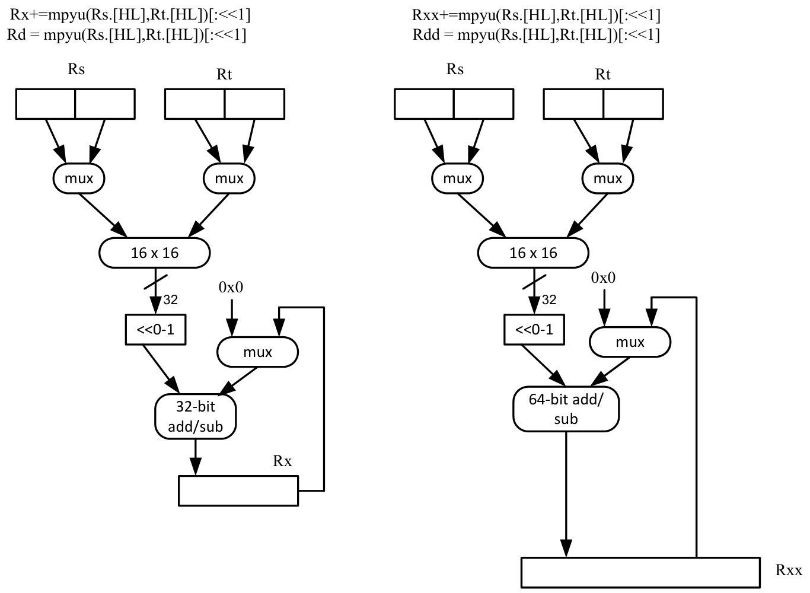

```text
Rx+=mpyu(Rs.[HL],Rt.[HL])[:<<1] Rxx+=mpyu(Rs.[HL],Rt.[HL])[:<<1]
Rd = mpyu(Rs.[HL],Rt.[HL])[:<<1] Rdd = mpyu(Rs.[HL],Rt.[HL])[:<<1]
Rs Rs
Rt Rt
mux mux mux mux
16 x 16 16 x 16
0x0
0x0
32 32
<<0-1 <<0-1
mux
mux
64-bit add/
32-bit
sub
add/sub
Rx
Rxx
```

| Syntax | Behavior |
|---|---|
| `Rd=mpyu(Rs.[HL],Rt.[HL])[:<<1]` | `Rd=(Rs.uh[01] * Rt.uh[01])[<<1];` |
| `Rdd=mpyu(Rs.[HL],Rt.[HL])[:<<1`<br>`]` | `Rdd=(Rs.uh[01] * Rt.uh[01])[<<1];` |
| `Rx+=mpyu(Rs.[HL],Rt.[HL])[:<<1`<br>`]` | `Rx=Rx+ (Rs.uh[01] * Rt.uh[01])[<<1];` |
| `Rx-`<br>`=mpyu(Rs.[HL],Rt.[HL])[:<<1]` | `Rx=Rx- (Rs.uh[01] * Rt.uh[01])[<<1];` |
| `Rxx+=mpyu(Rs.[HL],Rt.[HL])[:<<`<br>`1]` | `Rxx=Rxx+ (Rs.uh[01] * Rt.uh[01])[<<1];` |
| `Rxx-`<br>`=mpyu(Rs.[HL],Rt.[HL])[:<<1]` | `Rxx=Rxx- (Rs.uh[01] * Rt.uh[01])[<<1];` |

##### Class: XTYPE (slots 2,3)

##### Intrinsics

|  |  |
|---|---|
| `Rd=mpyu(Rs.H,Rt.H)` | `UWord32 Q6_R_mpyu_RhRh(Word32 Rs, Word32 Rt)` |
| `Rd=mpyu(Rs.H,Rt.H):<<1` | `UWord32 Q6_R_mpyu_RhRh_s1(Word32 Rs, Word32 Rt)` |
| `Rd=mpyu(Rs.H,Rt.L)` | `UWord32 Q6_R_mpyu_RhRl(Word32 Rs, Word32 Rt)` |
| `Rd=mpyu(Rs.H,Rt.L):<<1` | `UWord32 Q6_R_mpyu_RhRl_s1(Word32 Rs, Word32 Rt)` |
| `Rd=mpyu(Rs.L,Rt.H)` | `UWord32 Q6_R_mpyu_RlRh(Word32 Rs, Word32 Rt)` |
| `Rd=mpyu(Rs.L,Rt.H):<<1` | `UWord32 Q6_R_mpyu_RlRh_s1(Word32 Rs, Word32 Rt)` |
| `Rd=mpyu(Rs.L,Rt.L)` | `UWord32 Q6_R_mpyu_RlRl(Word32 Rs, Word32 Rt)` |
| `Rd=mpyu(Rs.L,Rt.L):<<1` | `UWord32 Q6_R_mpyu_RlRl_s1(Word32 Rs, Word32 Rt)` |
| `Rdd=mpyu(Rs.H,Rt.H)` | `UWord64 Q6_P_mpyu_RhRh(Word32 Rs, Word32 Rt)` |
| `Rdd=mpyu(Rs.H,Rt.H):<<1` | `UWord64 Q6_P_mpyu_RhRh_s1(Word32 Rs, Word32 Rt)` |
| `Rdd=mpyu(Rs.H,Rt.L)` | `UWord64 Q6_P_mpyu_RhRl(Word32 Rs, Word32 Rt)` |
| `Rdd=mpyu(Rs.H,Rt.L):<<1` | `UWord64 Q6_P_mpyu_RhRl_s1(Word32 Rs, Word32 Rt)` |
| `Rdd=mpyu(Rs.L,Rt.H)` | `UWord64 Q6_P_mpyu_RlRh(Word32 Rs, Word32 Rt)` |
| `Rdd=mpyu(Rs.L,Rt.H):<<1` | `UWord64 Q6_P_mpyu_RlRh_s1(Word32 Rs, Word32 Rt)` |
| `Rdd=mpyu(Rs.L,Rt.L)` | `UWord64 Q6_P_mpyu_RlRl(Word32 Rs, Word32 Rt)` |
| `Rdd=mpyu(Rs.L,Rt.L):<<1` | `UWord64 Q6_P_mpyu_RlRl_s1(Word32 Rs, Word32 Rt)` |
| `Rx+=mpyu(Rs.H,Rt.H)` | `Word32 Q6_R_mpyuacc_RhRh(Word32 Rx, Word32 Rs, Word32 Rt)` |
| `Rx+=mpyu(Rs.H,Rt.H):<<1` | `Word32 Q6_R_mpyuacc_RhRh_s1(Word32 Rx, Word32 Rs, Word32 Rt)` |
| `Rx+=mpyu(Rs.H,Rt.L)` | `Word32 Q6_R_mpyuacc_RhRl(Word32 Rx, Word32 Rs, Word32 Rt)` |
| `Rx+=mpyu(Rs.H,Rt.L):<<1` | `Word32 Q6_R_mpyuacc_RhRl_s1(Word32 Rx, Word32 Rs, Word32 Rt)` |
| `Rx+=mpyu(Rs.L,Rt.H)` | `Word32 Q6_R_mpyuacc_RlRh(Word32 Rx, Word32 Rs, Word32 Rt)` |
| `Rx+=mpyu(Rs.L,Rt.H):<<1` | `Word32 Q6_R_mpyuacc_RlRh_s1(Word32 Rx, Word32 Rs, Word32 Rt)` |
| `Rx+=mpyu(Rs.L,Rt.L)` | `Word32 Q6_R_mpyuacc_RlRl(Word32 Rx, Word32 Rs, Word32 Rt)` |
| `Rx+=mpyu(Rs.L,Rt.L):<<1` | `Word32 Q6_R_mpyuacc_RlRl_s1(Word32 Rx, Word32 Rs, Word32 Rt)` |
| `Rx-=mpyu(Rs.H,Rt.H)` | `Word32 Q6_R_mpyunac_RhRh(Word32 Rx, Word32 Rs, Word32 Rt)` |
| `Rx-=mpyu(Rs.H,Rt.H):<<1` | `Word32 Q6_R_mpyunac_RhRh_s1(Word32 Rx, Word32 Rs, Word32 Rt)` |
| `Rx-=mpyu(Rs.H,Rt.L)` | `Word32 Q6_R_mpyunac_RhRl(Word32 Rx, Word32 Rs, Word32 Rt)` |
| `Rx-=mpyu(Rs.H,Rt.L):<<1` | `Word32 Q6_R_mpyunac_RhRl_s1(Word32 Rx, Word32 Rs, Word32 Rt)` |
| `Rx-=mpyu(Rs.L,Rt.H)` | `Word32 Q6_R_mpyunac_RlRh(Word32 Rx, Word32 Rs, Word32 Rt)` |
| `Rx-=mpyu(Rs.L,Rt.H):<<1` | `Word32 Q6_R_mpyunac_RlRh_s1(Word32 Rx, Word32 Rs, Word32 Rt)` |
| `Rx-=mpyu(Rs.L,Rt.L)` | `Word32 Q6_R_mpyunac_RlRl(Word32 Rx, Word32 Rs, Word32 Rt)` |
| `Rx-=mpyu(Rs.L,Rt.L):<<1` | `Word32 Q6_R_mpyunac_RlRl_s1(Word32 Rx, Word32 Rs, Word32 Rt)` |
| `Rxx+=mpyu(Rs.H,Rt.H)` | `Word64 Q6_P_mpyuacc_RhRh(Word64 Rxx, Word32 Rs, Word32 Rt)` |
| `Rxx+=mpyu(Rs.H,Rt.H):<<1` | `Word64 Q6_P_mpyuacc_RhRh_s1(Word64 Rxx, Word32 Rs, Word32 Rt)` |
| `Rxx+=mpyu(Rs.H,Rt.L)` | `Word64 Q6_P_mpyuacc_RhRl(Word64 Rxx, Word32 Rs, Word32 Rt)` |
| `Rxx+=mpyu(Rs.H,Rt.L):<<1` | `Word64 Q6_P_mpyuacc_RhRl_s1(Word64 Rxx, Word32 Rs, Word32 Rt)` |
| `Rxx+=mpyu(Rs.L,Rt.H)` | `Word64 Q6_P_mpyuacc_RlRh(Word64 Rxx, Word32 Rs, Word32 Rt)` |
| `Rxx+=mpyu(Rs.L,Rt.H):<<1` | `Word64 Q6_P_mpyuacc_RlRh_s1(Word64 Rxx, Word32 Rs, Word32 Rt)` |
| `Rxx+=mpyu(Rs.L,Rt.L)` | `Word64 Q6_P_mpyuacc_RlRl(Word64 Rxx, Word32 Rs, Word32 Rt)` |
| `Rxx+=mpyu(Rs.L,Rt.L):<<1` | `Word64 Q6_P_mpyuacc_RlRl_s1(Word64 Rxx, Word32 Rs, Word32 Rt)` |
| `Rxx-=mpyu(Rs.H,Rt.H)` | `Word64 Q6_P_mpyunac_RhRh(Word64 Rxx, Word32 Rs, Word32 Rt)` |
| `Rxx-=mpyu(Rs.H,Rt.H):<<1` | `Word64 Q6_P_mpyunac_RhRh_s1(Word64 Rxx, Word32 Rs, Word32 Rt)` |
| `Rxx-=mpyu(Rs.H,Rt.L)` | `Word64 Q6_P_mpyunac_RhRl(Word64 Rxx, Word32 Rs, Word32 Rt)` |
| `Rxx-=mpyu(Rs.H,Rt.L):<<1` | `Word64 Q6_P_mpyunac_RhRl_s1(Word64 Rxx, Word32 Rs, Word32 Rt)` |
| `Rxx-=mpyu(Rs.L,Rt.H)` | `Word64 Q6_P_mpyunac_RlRh(Word64 Rxx, Word32 Rs, Word32 Rt)` |
| `Rxx-=mpyu(Rs.L,Rt.H):<<1` | `Word64 Q6_P_mpyunac_RlRh_s1(Word64 Rxx, Word32 Rs, Word32 Rt)` |
| `Rxx-=mpyu(Rs.L,Rt.L)` | `Word64 Q6_P_mpyunac_RlRl(Word64 Rxx, Word32 Rs, Word32 Rt)` |
| `Rxx-=mpyu(Rs.L,Rt.L):<<1` | `Word64 Q6_P_mpyunac_RlRl_s1(Word64 Rxx, Word32 Rs, Word32 Rt)` |

##### Encoding

| 31 | 30 | 29 | 28 | 27 | 26 | 25 | 24 | 23 | 22 | 21 | 20 | 19 | 18 | 17 | 16 | 15 | 14 | 13 | 12 | 11 | 10 | 9 | 8 | 7 | 6 | 5 | 4 | 3 | 2 | 1 | 0 |  |
|---|---|---|---|---|---|---|---|---|---|---|---|---|---|---|---|---|---|---|---|---|---|---|---|---|---|---|---|---|---|---|---|---|
| ICLASS | ICLASS | ICLASS | ICLASS | RegType | RegType | RegType | RegType | MajOp | MajOp | MajOp | s5 | s5 | s5 | s5 | s5 | Parse | Parse |  | t5 | t5 | t5 | t5 | t5 | MinOp | MinOp | MinOp | d5 | d5 | d5 | d5 | d5 |  |
| 1 | 1 | 1 | 0 | 0 | 1 | 0 | 0 | N | 1 | 0 | s | s | s | s | s | P | P | - | t | t | t | t | t | - | 0 | 0 | d | d | d | d | d | Rdd=mpyu(Rs.L,Rt.L)[:<<N] |
| 1 | 1 | 1 | 0 | 0 | 1 | 0 | 0 | N | 1 | 0 | s | s | s | s | s | P | P | - | t | t | t | t | t | - | 0 | 1 | d | d | d | d | d | Rdd=mpyu(Rs.L,Rt.H)[:<<N] |
| 1 | 1 | 1 | 0 | 0 | 1 | 0 | 0 | N | 1 | 0 | s | s | s | s | s | P | P | - | t | t | t | t | t | - | 1 | 0 | d | d | d | d | d | Rdd=mpyu(Rs.H,Rt.L)[:<<N] |
| 1 | 1 | 1 | 0 | 0 | 1 | 0 | 0 | N | 1 | 0 | s | s | s | s | s | P | P | - | t | t | t | t | t | - | 1 | 1 | d | d | d | d | d | Rdd=mpyu(Rs.H,Rt.H)[:<<N] |
| ICLASS | ICLASS | ICLASS | ICLASS | RegType | RegType | RegType | RegType | MajOp | MajOp | MajOp | s5 | s5 | s5 | s5 | s5 | Parse | Parse |  | t5 | t5 | t5 | t5 | t5 | MinOp | MinOp | MinOp | x5 | x5 | x5 | x5 | x5 |  |
| 1 | 1 | 1 | 0 | 0 | 1 | 1 | 0 | N | 1 | 0 | s | s | s | s | s | P | P | - | t | t | t | t | t | 0 | 0 | 0 | x | x | x | x | x | Rxx+=mpyu(Rs.L,Rt.L)[:<<N] |
| 1 | 1 | 1 | 0 | 0 | 1 | 1 | 0 | N | 1 | 0 | s | s | s | s | s | P | P | - | t | t | t | t | t | 0 | 0 | 1 | x | x | x | x | x | Rxx+=mpyu(Rs.L,Rt.H)[:<<N] |
| 1 | 1 | 1 | 0 | 0 | 1 | 1 | 0 | N | 1 | 0 | s | s | s | s | s | P | P | - | t | t | t | t | t | 0 | 1 | 0 | x | x | x | x | x | Rxx+=mpyu(Rs.H,Rt.L)[:<<N] |
| 1 | 1 | 1 | 0 | 0 | 1 | 1 | 0 | N | 1 | 0 | s | s | s | s | s | P | P | - | t | t | t | t | t | 0 | 1 | 1 | x | x | x | x | x | Rxx+=mpyu(Rs.H,Rt.H)[:<<N] |
| 1 | 1 | 1 | 0 | 0 | 1 | 1 | 0 | N | 1 | 1 | s | s | s | s | s | P | P | - | t | t | t | t | t | 0 | 0 | 0 | x | x | x | x | x | Rxx-=mpyu(Rs.L,Rt.L)[:<<N] |
| 1 | 1 | 1 | 0 | 0 | 1 | 1 | 0 | N | 1 | 1 | s | s | s | s | s | P | P | - | t | t | t | t | t | 0 | 0 | 1 | x | x | x | x | x | Rxx-=mpyu(Rs.L,Rt.H)[:<<N] |
| 1 | 1 | 1 | 0 | 0 | 1 | 1 | 0 | N | 1 | 1 | s | s | s | s | s | P | P | - | t | t | t | t | t | 0 | 1 | 0 | x | x | x | x | x | Rxx-=mpyu(Rs.H,Rt.L)[:<<N] |
| 1 | 1 | 1 | 0 | 0 | 1 | 1 | 0 | N | 1 | 1 | s | s | s | s | s | P | P | - | t | t | t | t | t | 0 | 1 | 1 | x | x | x | x | x | Rxx-=mpyu(Rs.H,Rt.H)[:<<N] |
| ICLASS | ICLASS | ICLASS | ICLASS | RegType | RegType | RegType | RegType | MajOp | MajOp | MajOp | s5 | s5 | s5 | s5 | s5 | Parse | Parse |  | t5 | t5 | t5 | t5 | t5 | MinOp | MinOp | MinOp | d5 | d5 | d5 | d5 | d5 |  |
| 1 | 1 | 1 | 0 | 1 | 1 | 0 | 0 | N | 1 | 0 | s | s | s | s | s | P | P | - | t | t | t | t | t | 0 | 0 | 0 | d | d | d | d | d | Rd=mpyu(Rs.L,Rt.L)[:<<N] |
| 1 | 1 | 1 | 0 | 1 | 1 | 0 | 0 | N | 1 | 0 | s | s | s | s | s | P | P | - | t | t | t | t | t | 0 | 0 | 1 | d | d | d | d | d | Rd=mpyu(Rs.L,Rt.H)[:<<N] |
| 1 | 1 | 1 | 0 | 1 | 1 | 0 | 0 | N | 1 | 0 | s | s | s | s | s | P | P | - | t | t | t | t | t | 0 | 1 | 0 | d | d | d | d | d | Rd=mpyu(Rs.H,Rt.L)[:<<N] |
| 1 | 1 | 1 | 0 | 1 | 1 | 0 | 0 | N | 1 | 0 | s | s | s | s | s | P | P | - | t | t | t | t | t | 0 | 1 | 1 | d | d | d | d | d | Rd=mpyu(Rs.H,Rt.H)[:<<N] |
| ICLASS | ICLASS | ICLASS | ICLASS | RegType | RegType | RegType | RegType | MajOp | MajOp | MajOp | s5 | s5 | s5 | s5 | s5 | Parse | Parse |  | t5 | t5 | t5 | t5 | t5 | MinOp | MinOp | MinOp | x5 | x5 | x5 | x5 | x5 |  |
| 1 | 1 | 1 | 0 | 1 | 1 | 1 | 0 | N | 1 | 0 | s | s | s | s | s | P | P | - | t | t | t | t | t | 0 | 0 | 0 | x | x | x | x | x | Rx+=mpyu(Rs.L,Rt.L)[:<<N] |
| 1 | 1 | 1 | 0 | 1 | 1 | 1 | 0 | N | 1 | 0 | s | s | s | s | s | P | P | - | t | t | t | t | t | 0 | 0 | 1 | x | x | x | x | x | Rx+=mpyu(Rs.L,Rt.H)[:<<N] |
| 1 | 1 | 1 | 0 | 1 | 1 | 1 | 0 | N | 1 | 0 | s | s | s | s | s | P | P | - | t | t | t | t | t | 0 | 1 | 0 | x | x | x | x | x | Rx+=mpyu(Rs.H,Rt.L)[:<<N] |
| 1 | 1 | 1 | 0 | 1 | 1 | 1 | 0 | N | 1 | 0 | s | s | s | s | s | P | P | - | t | t | t | t | t | 0 | 1 | 1 | x | x | x | x | x | Rx+=mpyu(Rs.H,Rt.H)[:<<N] |
| 1 | 1 | 1 | 0 | 1 | 1 | 1 | 0 | N | 1 | 1 | s | s | s | s | s | P | P | - | t | t | t | t | t | 0 | 0 | 0 | x | x | x | x | x | Rx-=mpyu(Rs.L,Rt.L)[:<<N] |
| 1 | 1 | 1 | 0 | 1 | 1 | 1 | 0 | N | 1 | 1 | s | s | s | s | s | P | P | - | t | t | t | t | t | 0 | 0 | 1 | x | x | x | x | x | Rx-=mpyu(Rs.L,Rt.H)[:<<N] |
| 1 | 1 | 1 | 0 | 1 | 1 | 1 | 0 | N | 1 | 1 | s | s | s | s | s | P | P | - | t | t | t | t | t | 0 | 1 | 0 | x | x | x | x | x | Rx-=mpyu(Rs.H,Rt.L)[:<<N] |
| 1 | 1 | 1 | 0 | 1 | 1 | 1 | 0 | N | 1 | 1 | s | s | s | s | s | P | P | - | t | t | t | t | t | 0 | 1 | 1 | x | x | x | x | x | Rx-=mpyu(Rs.H,Rt.H)[:<<N] |

| Field name | Description |
|---|---|
| `ICLASS` | Instruction class |
| `MajOp` | Major opcode |
| `MinOp` | Minor opcode |
| `RegType` | Register type |
| `sH` | Rs is high |
| `tH` | Rt is high |
| Field name | Description |
| `Parse` | Packet/loop parse bits |
| `d5` | Field to encode register d |
| `s5` | Field to encode register s |
| `t5` | Field to encode register t |
| `x5` | Field to encode register x |

#### Polynomial multiply words

Perform a 32 × 32 carryless polynomial multiply using 32-bit source registers Rs and Rt. The 64-bit

result is optionally accumulated (XORed) with the destination register. Finite field multiply

instructions are useful for many algorithms including scramble code generation, cryptographic

algorithms, convolutional, and Reed Solomon codes.

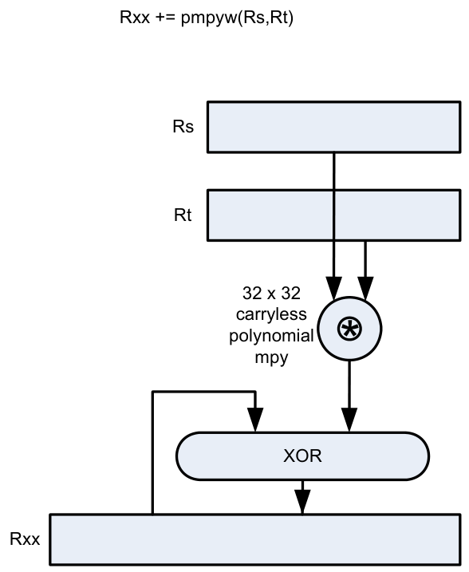

```text
Rxx += pmpyw(Rs,Rt)
Rs
Rt
32 x 32
carryless
polynomial
mpy
XOR
Rxx
```

| Syntax | Behavior |
|---|---|
| `Rdd=pmpyw(Rs,Rt)` | `x = Rs.uw[0];`<br>`y = Rt.uw[0];`<br>`prod = 0;`<br>`for(i=0; i < 32; i++) {`<br>`if((y >> i) & 1) prod ^= (x << i);`<br>`}`<br>`Rdd = prod;` |
| `Rxx^=pmpyw(Rs,Rt)` | `x = Rs.uw[0];`<br>`y = Rt.uw[0];`<br>`prod = 0;`<br>`for(i=0; i < 32; i++) {`<br>`if((y >> i) & 1) prod ^= (x << i);`<br>`}`<br>`Rxx ^= prod;` |

##### Class: XTYPE (slots 2,3)

##### Intrinsics

|  |  |
|---|---|
| `Rdd=pmpyw(Rs,Rt)` | `Word64 Q6_P_pmpyw_RR(Word32 Rs, Word32 Rt)` |
| `Rxx^=pmpyw(Rs,Rt)` | `Word64 Q6_P_pmpywxacc_RR(Word64 Rxx, Word32 Rs, Word32 Rt)` |

##### Encoding

| 31 | 30 | 29 | 28 | 27 | 26 | 25 | 24 | 23 | 22 | 21 | 20 | 19 | 18 | 17 | 16 | 15 | 14 | 13 | 12 | 11 | 10 | 9 | 8 | 7 | 6 | 5 | 4 | 3 | 2 | 1 | 0 |  |
|---|---|---|---|---|---|---|---|---|---|---|---|---|---|---|---|---|---|---|---|---|---|---|---|---|---|---|---|---|---|---|---|---|
| ICLASS | ICLASS | ICLASS | ICLASS | RegType | RegType | RegType | RegType | MajOp | MajOp | MajOp | s5 | s5 | s5 | s5 | s5 | Parse | Parse |  | t5 | t5 | t5 | t5 | t5 | MinOp | MinOp | MinOp | d5 | d5 | d5 | d5 | d5 |  |
| 1 | 1 | 1 | 0 | 0 | 1 | 0 | 1 | 0 | 1 | 0 | s | s | s | s | s | P | P | 0 | t | t | t | t | t | 1 | 1 | 1 | d | d | d | d | d | Rdd=pmpyw(Rs,Rt) |
| ICLASS | ICLASS | ICLASS | ICLASS | RegType | RegType | RegType | RegType | MajOp | MajOp | MajOp | s5 | s5 | s5 | s5 | s5 | Parse | Parse |  | t5 | t5 | t5 | t5 | t5 | MinOp | MinOp | MinOp | x5 | x5 | x5 | x5 | x5 |  |
| 1 | 1 | 1 | 0 | 0 | 1 | 1 | 1 | 0 | 0 | 1 | s | s | s | s | s | P | P | 0 | t | t | t | t | t | 1 | 1 | 1 | x | x | x | x | x | Rxx^=pmpyw(Rs,Rt) |

| Field name | Description |
|---|---|
| `ICLASS` | Instruction class |
| `MajOp` | Major opcode |
| `MinOp` | Minor opcode |
| `RegType` | Register type |
| `Parse` | Packet/loop parse bits |
| `d5` | Field to encode register d |
| `s5` | Field to encode register s |
| `t5` | Field to encode register t |
| `x5` | Field to encode register x |

#### Vector reduce multiply word by signed half (32 × 16)

Perform mixed precision vector multiply operations and accumulate the results. A 32-bit word from vector Rss is multiplied by a 16-bit halfword (either even or odd) from vector Rtt. The multiplication is performed as a signed 32 × 16, which produces a 48-bit result. This result is optionally scaled left by one bit. A similar operation is performed for both words in Rss, and accumulates the two results. The final result optionally accumulates with Rxx.

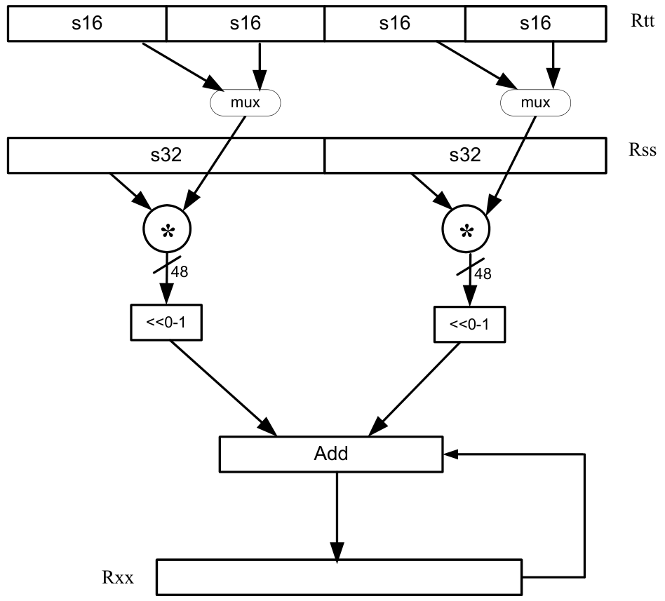

```text
s16 s16 s16 s16 Rtt
mux mux
s32 s32 Rss
₄₈ ₄₈
<<0-1 <<0-1
Add
Rxx
```

| Syntax | Behavior |
|---|---|
| `Rdd=vrmpyweh(Rss,Rtt)[:<<1]` | `Rdd = (Rss.w[1] * Rtt.h[2])[<<1] + (Rss.w[0] * `<br>`Rtt.h[0])[<<1];` |
| `Rdd=vrmpywoh(Rss,Rtt)[:<<1]` | `Rdd = (Rss.w[1] * Rtt.h[3])[<<1] + (Rss.w[0] * `<br>`Rtt.h[1])[<<1];` |
| `Rxx+=vrmpyweh(Rss,Rtt)[:<<1]` | `Rxx += (Rss.w[1] * Rtt.h[2])[<<1] + (Rss.w[0] * `<br>`Rtt.h[0])[<<1];` |
| `Rxx+=vrmpywoh(Rss,Rtt)[:<<1]` | `Rxx += (Rss.w[1] * Rtt.h[3])[<<1] + (Rss.w[0] * `<br>`Rtt.h[1])[<<1];` |

##### Class: XTYPE (slots 2,3)

##### Intrinsics

|  |  |
|---|---|
| `Rdd=vrmpyweh(Rss,Rtt)` | `Word64 Q6_P_vrmpyweh_PP(Word64 Rss, Word64 Rtt)` |
| `Rdd=vrmpyweh(Rss,Rtt):<<` | `Word64 Q6_P_vrmpyweh_PP_s1(Word64 Rss, Word64 Rtt)` |

```
1
```

|  |  |
|---|---|
| `Rdd=vrmpywoh(Rss,Rtt)` | `Word64 Q6_P_vrmpywoh_PP(Word64 Rss, Word64 Rtt)` |
| `Rdd=vrmpywoh(Rss,Rtt):<<` | `Word64 Q6_P_vrmpywoh_PP_s1(Word64 Rss, Word64 Rtt)` |

```
1
```

|  |  |
|---|---|
| `Rxx+=vrmpyweh(Rss,Rtt)` | `Word64 Q6_P_vrmpywehacc_PP(Word64 Rxx, Word64 Rss, Word64 Rtt)` |
| `Rxx+=vrmpyweh(Rss,Rtt):<` | `Word64 Q6_P_vrmpywehacc_PP_s1(Word64 Rxx, Word64 Rss,` |
| `<1` | `Word64 Rtt)` |
| `Rxx+=vrmpywoh(Rss,Rtt)` | `Word64 Q6_P_vrmpywohacc_PP(Word64 Rxx, Word64 Rss, Word64 Rtt)` |
| `Rxx+=vrmpywoh(Rss,Rtt):<` | `Word64 Q6_P_vrmpywohacc_PP_s1(Word64 Rxx, Word64 Rss,` |
| `<1` | `Word64 Rtt)` |

##### Encoding

| 31 | 30 | 29 | 28 | 27 | 26 | 25 | 24 | 23 | 22 | 21 | 20 | 19 | 18 | 17 | 16 | 15 | 14 | 13 | 12 | 11 | 10 | 9 | 8 | 7 | 6 | 5 | 4 | 3 | 2 | 1 | 0 |  |
|---|---|---|---|---|---|---|---|---|---|---|---|---|---|---|---|---|---|---|---|---|---|---|---|---|---|---|---|---|---|---|---|---|
| ICLASS | ICLASS | ICLASS | ICLASS | RegType | RegType | RegType | RegType | MajOp | MajOp | MajOp | s5 | s5 | s5 | s5 | s5 | Parse | Parse |  | t5 | t5 | t5 | t5 | t5 | MinOp | MinOp | MinOp | d5 | d5 | d5 | d5 | d5 |  |
| 1 | 1 | 1 | 0 | 1 | 0 | 0 | 0 | N | 0 | 1 | s | s | s | s | s | P | P | 0 | t | t | t | t | t | 0 | 1 | 0 | d | d | d | d | d | Rdd=vrmpywoh(Rss,Rtt)[:<<N] |
| 1 | 1 | 1 | 0 | 1 | 0 | 0 | 0 | N | 1 | 0 | s | s | s | s | s | P | P | 0 | t | t | t | t | t | 1 | 0 | 0 | d | d | d | d | d | Rdd=vrmpyweh(Rss,Rtt)[:<<N] |
| ICLASS | ICLASS | ICLASS | ICLASS | RegType | RegType | RegType | RegType | MajOp | MajOp | MajOp | s5 | s5 | s5 | s5 | s5 | Parse | Parse |  | t5 | t5 | t5 | t5 | t5 | MinOp | MinOp | MinOp | x5 | x5 | x5 | x5 | x5 |  |
| 1 | 1 | 1 | 0 | 1 | 0 | 1 | 0 | N | 0 | 1 | s | s | s | s | s | P | P | 0 | t | t | t | t | t | 1 | 1 | 0 | x | x | x | x | x | Rxx+=vrmpyweh(Rss,Rtt)[: <<N] |
| 1 | 1 | 1 | 0 | 1 | 0 | 1 | 0 | N | 1 | 1 | s | s | s | s | s | P | P | 0 | t | t | t | t | t | 1 | 1 | 0 | x | x | x | x | x | Rxx+=vrmpywoh(Rss,Rtt)[: <<N] |

| Field name | Description |
|---|---|
| `ICLASS` | Instruction class |
| `MajOp` | Major opcode |
| `MinOp` | Minor opcode |
| `RegType` | Register type |
| `Parse` | Packet/loop parse bits |
| `d5` | Field to encode register d |
| `s5` | Field to encode register s |
| `t5` | Field to encode register t |
| `x5` | Field to encode register x |

#### Multiply and use upper result

Multiply two signed or unsigned 32-bit words. Store the upper 32-bits of this result to a single destination register. Optional rounding is available.

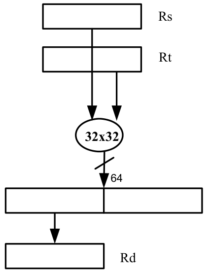

```text
Rs
Rt
32x32
64
Rd
```

| Syntax | Behavior |
|---|---|
| `Rd=mpy(Rs,Rt.H):<<1:rnd:sat` | `Rd = sat₃₂(((Rs * Rt.h[1])<<1+0x8000)>>16);` |
| `Rd=mpy(Rs,Rt.H):<<1:sat` | `Rd = sat₃₂(((Rs * Rt.h[1])<<1)>>16);` |
| `Rd=mpy(Rs,Rt.L):<<1:rnd:sat` | `Rd = sat₃₂(((Rs * Rt.h[0])<<1+0x8000)>>16);` |
| `Rd=mpy(Rs,Rt.L):<<1:sat` | `Rd = sat₃₂(((Rs * Rt.h[0])<<1)>>16);` |
| `Rd=mpy(Rs,Rt)` | `Rd=(Rs * Rt)>>32;` |
| `Rd=mpy(Rs,Rt):<<1` | `Rd=(Rs * Rt)>>31;` |
| `Rd=mpy(Rs,Rt):<<1:sat` | `Rd=sat₃₂((Rs * Rt)>>31);` |
| `Rd=mpy(Rs,Rt):rnd` | `Rd=((Rs * Rt)+0x80000000)>>32;` |
| `Rd=mpysu(Rs,Rt)` | `Rd=(Rs * Rt.uw[0])>>32;` |
| `Rd=mpyu(Rs,Rt)` | `Rd=(Rs.uw[0] * Rt.uw[0])>>32;` |
| `Rx+=mpy(Rs,Rt):<<1:sat` | `Rx=sat₃₂((Rx) + ((Rs * Rt)>>31));` |
| `Rx-=mpy(Rs,Rt):<<1:sat` | `Rx=sat₃₂((Rx) - ((Rs * Rt)>>31));` |

##### Class: XTYPE (slots 2,3)

##### Notes

- If saturation occurs during execution of this instruction (a result is clamped to either maximum or minimum values), the OVF bit in the status register is set. OVF remains set until explicitly cleared by a transfer to the status register.

##### Intrinsics

|  |  |
|---|---|
| `Rd=mpy(Rs,Rt.H):<<1:rnd:s` | `Word32 Q6_R_mpy_RRh_s1_rnd_sat(Word32 Rs, Word32` |
| `at` | `Rt)` |
| `Rd=mpy(Rs,Rt.H):<<1:sat` | `Word32 Q6_R_mpy_RRh_s1_sat(Word32 Rs, Word32 Rt)` |
| `Rd=mpy(Rs,Rt.L):<<1:rnd:s` | `Word32 Q6_R_mpy_RRl_s1_rnd_sat(Word32 Rs, Word32` |
| `at` | `Rt)` |
| `Rd=mpy(Rs,Rt.L):<<1:sat` | `Word32 Q6_R_mpy_RRl_s1_sat(Word32 Rs, Word32 Rt)` |
| `Rd=mpy(Rs,Rt)` | `Word32 Q6_R_mpy_RR(Word32 Rs, Word32 Rt)` |
| `Rd=mpy(Rs,Rt):<<1` | `Word32 Q6_R_mpy_RR_s1(Word32 Rs, Word32 Rt)` |
| `Rd=mpy(Rs,Rt):<<1:sat` | `Word32 Q6_R_mpy_RR_s1_sat(Word32 Rs, Word32 Rt)` |
| `Rd=mpy(Rs,Rt):rnd` | `Word32 Q6_R_mpy_RR_rnd(Word32 Rs, Word32 Rt)` |
| `Rd=mpysu(Rs,Rt)` | `Word32 Q6_R_mpysu_RR(Word32 Rs, Word32 Rt)` |
| `Rd=mpyu(Rs,Rt)` | `UWord32 Q6_R_mpyu_RR(Word32 Rs, Word32 Rt)` |
| `Rx+=mpy(Rs,Rt):<<1:sat` | `Word32 Q6_R_mpyacc_RR_s1_sat(Word32 Rx, Word32 Rs, Word32 Rt)` |
| `Rx-=mpy(Rs,Rt):<<1:sat` | `Word32 Q6_R_mpynac_RR_s1_sat(Word32 Rx, Word32 Rs, Word32 Rt)` |

##### Encoding

| 31 | 30 | 29 | 28 | 27 | 26 | 25 | 24 | 23 | 22 | 21 | 20 | 19 | 18 | 17 | 16 | 15 | 14 | 13 | 12 | 11 | 10 | 9 | 8 | 7 | 6 | 5 | 4 | 3 | 2 | 1 | 0 |  |
|---|---|---|---|---|---|---|---|---|---|---|---|---|---|---|---|---|---|---|---|---|---|---|---|---|---|---|---|---|---|---|---|---|
| ICLASS | ICLASS | ICLASS | ICLASS | RegType | RegType | RegType | RegType | MajOp | MajOp | MajOp | s5 | s5 | s5 | s5 | s5 | Parse | Parse |  | t5 | t5 | t5 | t5 | t5 | MinOp | MinOp | MinOp | d5 | d5 | d5 | d5 | d5 |  |
| 1 | 1 | 1 | 0 | 1 | 1 | 0 | 1 | 0 | 0 | 1 | s | s | s | s | s | P | P | 0 | t | t | t | t | t | 0 | 0 | 1 | d | d | d | d | d | Rd=mpy(Rs,Rt):rnd |
| 1 | 1 | 1 | 0 | 1 | 1 | 0 | 1 | 0 | 1 | 0 | s | s | s | s | s | P | P | 0 | t | t | t | t | t | 0 | 0 | 1 | d | d | d | d | d | Rd=mpyu(Rs,Rt) |
| 1 | 1 | 1 | 0 | 1 | 1 | 0 | 1 | 0 | 1 | 1 | s | s | s | s | s | P | P | 0 | t | t | t | t | t | 0 | 0 | 1 | d | d | d | d | d | Rd=mpysu(Rs,Rt) |
| 1 | 1 | 1 | 0 | 1 | 1 | 0 | 1 | 1 | 0 | 1 | s | s | s | s | s | P | P | 0 | t | t | t | t | t | 0 | 0 | 0 | d | d | d | d | d | Rd=mpy(Rs,Rt.H):<<1:sat |
| 1 | 1 | 1 | 0 | 1 | 1 | 0 | 1 | 1 | 0 | 1 | s | s | s | s | s | P | P | 0 | t | t | t | t | t | 0 | 0 | 1 | d | d | d | d | d | Rd=mpy(Rs,Rt.L):<<1:sat |
| 1 | 1 | 1 | 0 | 1 | 1 | 0 | 1 | 1 | 0 | 1 | s | s | s | s | s | P | P | 0 | t | t | t | t | t | 1 | 0 | 0 | d | d | d | d | d | Rd=mpy(Rs,Rt.H):<<1:rnd: sat |
| 1 | 1 | 1 | 0 | 1 | 1 | 0 | 1 | 1 | 1 | 1 | s | s | s | s | s | P | P | 0 | t | t | t | t | t | 0 | 0 | 0 | d | d | d | d | d | Rd=mpy(Rs,Rt):<<1:sat |
| 1 | 1 | 1 | 0 | 1 | 1 | 0 | 1 | 1 | 1 | 1 | s | s | s | s | s | P | P | 0 | t | t | t | t | t | 1 | 0 | 0 | d | d | d | d | d | Rd=mpy(Rs,Rt.L):<<1:rnd:sat |
| 1 | 1 | 1 | 0 | 1 | 1 | 0 | 1 | N | 0 | N | s | s | s | s | s | P | P | 0 | t | t | t | t | t | 0 | N | N | d | d | d | d | d | Rd=mpy(Rs,Rt)[:<<N] |
| ICLASS | ICLASS | ICLASS | ICLASS | RegType | RegType | RegType | RegType | MajOp | MajOp | MajOp | s5 | s5 | s5 | s5 | s5 | Parse | Parse |  | t5 | t5 | t5 | t5 | t5 | MinOp | MinOp | MinOp | x5 | x5 | x5 | x5 | x5 |  |
| 1 | 1 | 1 | 0 | 1 | 1 | 1 | 1 | 0 | 1 | 1 | s | s | s | s | s | P | P | 0 | t | t | t | t | t | 0 | 0 | 0 | x | x | x | x | x | Rx+=mpy(Rs,Rt):<<1:sat |
| 1 | 1 | 1 | 0 | 1 | 1 | 1 | 1 | 0 | 1 | 1 | s | s | s | s | s | P | P | 0 | t | t | t | t | t | 0 | 0 | 1 | x | x | x | x | x | Rx-=mpy(Rs,Rt):<<1:sat |

| Field name | Description |
|---|---|
| `ICLASS` | Instruction class |
| `MajOp` | Major opcode |
| `MinOp` | Minor opcode |
| `RegType` | Register type |
| `Parse` | Packet/loop parse bits |
| `d5` | Field to encode register d |
| Field name | Description |
| `s5` | Field to encode register s |
| `t5` | Field to encode register t |
| `x5` | Field to encode register x |

#### Multiply and use full result

Multiply two signed or unsigned 32-bit words. Optionally, add or subtract this value from the 64-bit accumulator. The result is a full-precision 64-bit value.

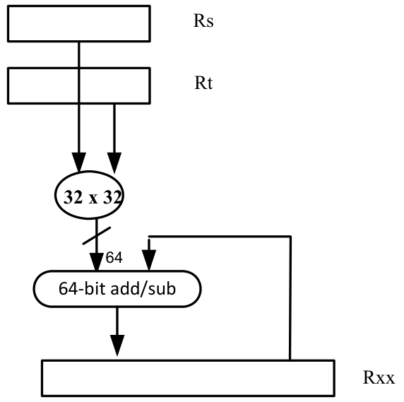

```text
Rs
Rt
32 x 32
64
64-bit add/sub
Rxx
```

| Syntax | Behavior |
|---|---|
| `Rdd=mpy(Rs,Rt)` | `Rdd=(Rs * Rt);` |
| `Rdd=mpyu(Rs,Rt)` | `Rdd=(Rs.uw[0] * Rt.uw[0]);` |
| `Rxx[+-]=mpy(Rs,Rt)` | `Rxx= Rxx [+-] (Rs * Rt);` |
| `Rxx[+-]=mpyu(Rs,Rt)` | `Rxx= Rxx [+-] (Rs.uw[0] * Rt.uw[0]);` |

##### Class: XTYPE (slots 2,3)

##### Intrinsics

|  |  |
|---|---|
| `Rdd=mpy(Rs,Rt)` | `Word64 Q6_P_mpy_RR(Word32 Rs, Word32 Rt)` |
| `Rdd=mpyu(Rs,Rt)` | `UWord64 Q6_P_mpyu_RR(Word32 Rs, Word32 Rt)` |
| `Rxx+=mpy(Rs,Rt)` | `Word64 Q6_P_mpyacc_RR(Word64 Rxx, Word32 Rs, Word32 Rt)` |
| `Rxx+=mpyu(Rs,Rt)` | `Word64 Q6_P_mpyuacc_RR(Word64 Rxx, Word32 Rs, Word32 Rt)` |
| `Rxx-=mpy(Rs,Rt)` | `Word64 Q6_P_mpynac_RR(Word64 Rxx, Word32 Rs, Word32 Rt)` |
| `Rxx-=mpyu(Rs,Rt)` | `Word64 Q6_P_mpyunac_RR(Word64 Rxx, Word32 Rs, Word32 Rt)` |

##### Encoding

| 31 | 30 | 29 | 28 | 27 | 26 | 25 | 24 | 23 | 22 | 21 | 20 | 19 | 18 | 17 | 16 | 15 | 14 | 13 | 12 | 11 | 10 | 9 | 8 | 7 | 6 | 5 | 4 | 3 | 2 | 1 | 0 |  |
|---|---|---|---|---|---|---|---|---|---|---|---|---|---|---|---|---|---|---|---|---|---|---|---|---|---|---|---|---|---|---|---|---|
| ICLASS | ICLASS | ICLASS | ICLASS | RegType | RegType | RegType | RegType | MajOp | MajOp | MajOp | s5 | s5 | s5 | s5 | s5 | Parse | Parse |  | t5 | t5 | t5 | t5 | t5 | MinOp | MinOp | MinOp | d5 | d5 | d5 | d5 | d5 |  |
| 1 | 1 | 1 | 0 | 0 | 1 | 0 | 1 | 0 | 0 | 0 | s | s | s | s | s | P | P | 0 | t | t | t | t | t | 0 | 0 | 0 | d | d | d | d | d | Rdd=mpy(Rs,Rt) |
| 1 | 1 | 1 | 0 | 0 | 1 | 0 | 1 | 0 | 1 | 0 | s | s | s | s | s | P | P | 0 | t | t | t | t | t | 0 | 0 | 0 | d | d | d | d | d | Rdd=mpyu(Rs,Rt) |
| ICLASS | ICLASS | ICLASS | ICLASS | RegType | RegType | RegType | RegType | MajOp | MajOp | MajOp | s5 | s5 | s5 | s5 | s5 | Parse | Parse |  | t5 | t5 | t5 | t5 | t5 | MinOp | MinOp | MinOp | x5 | x5 | x5 | x5 | x5 |  |
| 1 | 1 | 1 | 0 | 0 | 1 | 1 | 1 | 0 | 0 | 0 | s | s | s | s | s | P | P | 0 | t | t | t | t | t | 0 | 0 | 0 | x | x | x | x | x | Rxx+=mpy(Rs,Rt) |
| 1 | 1 | 1 | 0 | 0 | 1 | 1 | 1 | 0 | 0 | 1 | s | s | s | s | s | P | P | 0 | t | t | t | t | t | 0 | 0 | 0 | x | x | x | x | x | Rxx-=mpy(Rs,Rt) |
| 1 | 1 | 1 | 0 | 0 | 1 | 1 | 1 | 0 | 1 | 0 | s | s | s | s | s | P | P | 0 | t | t | t | t | t | 0 | 0 | 0 | x | x | x | x | x | Rxx+=mpyu(Rs,Rt) |
| 1 | 1 | 1 | 0 | 0 | 1 | 1 | 1 | 0 | 1 | 1 | s | s | s | s | s | P | P | 0 | t | t | t | t | t | 0 | 0 | 0 | x | x | x | x | x | Rxx-=mpyu(Rs,Rt) |

| Field name | Description |
|---|---|
| `ICLASS` | Instruction class |
| `MajOp` | Major opcode |
| `MinOp` | Minor opcode |
| `RegType` | Register type |
| `Parse` | Packet/loop parse bits |
| `d5` | Field to encode register d |
| `s5` | Field to encode register s |
| `t5` | Field to encode register t |
| `x5` | Field to encode register x |

#### Vector dual multiply

Multiply four 16-bit halfwords in Rss by the corresponding 16-bit halfwords in Rtt. Add and scale the two lower results. Optionally add the lower word of the accumulator. Saturate this result to 32-bits and store in the lower word of the accumulator. Perform the same operation on the upper two products using the upper word of the accumulator.

Rxx+=vdmpy(Rss,Rtt):sat

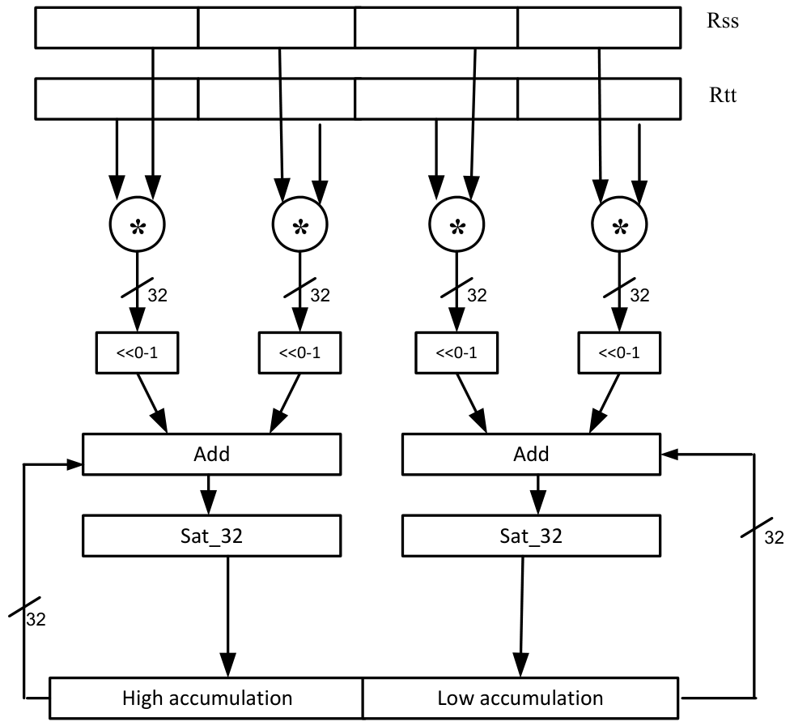

```text
Rss
Rtt
32 32 32 32
<<0-1 <<0-1 <<0-1 <<0-1
Add Add
Sat_32 Sat_32₃₂
32
High accumulation Low accumulation
```

Rxx

| Syntax | Behavior |
|---|---|
| `Rdd= `<br>`vdmpy(Rss,Rtt):<<1:sat` | `Rdd.w[0]=sat₃₂((Rss.h[0] * Rtt.h[0])<<1 + (Rss.h[1] * `<br>`Rtt.h[1])<<1);`<br>`Rdd.w[1]=sat₃₂((Rss.h[2] * Rtt.h[2])<<1 + (Rss.h[3] * `<br>`Rtt.h[3])<<1);` |
| `Rdd=vdmpy(Rss,Rtt):sat` | `Rdd.w[0]=sat₃₂((Rss.h[0] * Rtt.h[0])<<0 + (Rss.h[1] * `<br>`Rtt.h[1])<<0);`<br>`Rdd.w[1]=sat₃₂((Rss.h[2] * Rtt.h[2])<<0 + (Rss.h[3] * `<br>`Rtt.h[3])<<0);` |
| `Rxx+= `<br>`vdmpy(Rss,Rtt):<<1:sat` | `Rxx.w[0]=sat₃₂(Rxx.w[0] + (Rss.h[0] * Rtt.h[0])<<1 + `<br>`(Rss.h[1] * Rtt.h[1])<<1);`<br>`Rxx.w[1]=sat₃₂(Rxx.w[1] + (Rss.h[2] * Rtt.h[2])<<1 + `<br>`(Rss.h[3] * Rtt.h[3])<<1);` |
| `Rxx+=vdmpy(Rss,Rtt):sat` | `Rxx.w[0]=sat₃₂(Rxx.w[0] + (Rss.h[0] * Rtt.h[0])<<0 + `<br>`(Rss.h[1] * Rtt.h[1])<<0);`<br>`Rxx.w[1]=sat₃₂(Rxx.w[1] + (Rss.h[2] * Rtt.h[2])<<0 + `<br>`(Rss.h[3] * Rtt.h[3])<<0);` |

##### Class: XTYPE (slots 2,3)

##### Notes

- If saturation occurs during execution of this instruction (a result is clamped to either maximum or minimum values), the OVF bit in the status register is set. OVF remains set until explicitly cleared by a transfer to the status register.

##### Intrinsics

```
Rdd= Word64 Q6_P_vdmpy_PP_s1_sat(Word64 Rss, Word64 Rtt)
vdmpy(Rss,Rtt):<<1:sat
```

|  |  |
|---|---|
| `Rdd=vdmpy(Rss,Rtt):sat` | `Word64 Q6_P_vdmpy_PP_sat(Word64 Rss, Word64 Rtt)` |
| `Rxx+=` | `Word64 Q6_P_vdmpyacc_PP_s1_sat(Word64 Rxx, Word64` |
| `vdmpy(Rss,Rtt):<<1:sat` | `Rss, Word64 Rtt)` |
| `Rxx+=vdmpy(Rss,Rtt):sat` | `Word64 Q6_P_vdmpyacc_PP_sat(Word64 Rxx, Word64 Rss, Word64 Rtt)` |

##### Encoding

| 31 | 30 | 29 | 28 | 27 | 26 | 25 | 24 | 23 | 22 | 21 | 20 | 19 | 18 | 17 | 16 | 15 | 14 | 13 | 12 | 11 | 10 | 9 | 8 | 7 | 6 | 5 | 4 | 3 | 2 | 1 | 0 |  |
|---|---|---|---|---|---|---|---|---|---|---|---|---|---|---|---|---|---|---|---|---|---|---|---|---|---|---|---|---|---|---|---|---|
| ICLASS | ICLASS | ICLASS | ICLASS | RegType | RegType | RegType | RegType | MajOp | MajOp | MajOp | s5 | s5 | s5 | s5 | s5 | Parse | Parse |  | t5 | t5 | t5 | t5 | t5 | MinOp | MinOp | MinOp | d5 | d5 | d5 | d5 | d5 |  |
| 1 | 1 | 1 | 0 | 1 | 0 | 0 | 0 | N | 0 | 0 | s | s | s | s | s | P | P | 0 | t | t | t | t | t | 1 | 0 | 0 | d | d | d | d | d | Rdd=vdmpy(Rss,Rtt)[:<<N]: sat |
| ICLASS | ICLASS | ICLASS | ICLASS | RegType | RegType | RegType | RegType | MajOp | MajOp | MajOp | s5 | s5 | s5 | s5 | s5 | Parse | Parse |  | t5 | t5 | t5 | t5 | t5 | MinOp | MinOp | MinOp | x5 | x5 | x5 | x5 | x5 |  |
| 1 | 1 | 1 | 0 | 1 | 0 | 1 | 0 | N | 0 | 0 | s | s | s | s | s | P | P | 0 | t | t | t | t | t | 1 | 0 | 0 | x | x | x | x | x | Rxx+=vdmpy(Rss,Rtt)[:<<N]:sat |

| Field name | Description |
|---|---|
| `ICLASS` | Instruction class |
| `MajOp` | Major opcode |
| `MinOp` | Minor opcode |
| `RegType` | Register type |
| `Parse` | Packet/loop parse bits |
| `d5` | Field to encode register d |
| Field name | Description |
| `s5` | Field to encode register s |
| `t5` | Field to encode register t |
| `x5` | Field to encode register x |

#### Vector dual multiply with round and pack

Multiply four 16-bit halfwords in Rss by the corresponding 16-bit halfwords in Rtt. Scale and add together the two lower results with a rounding constant. Saturate this result to 32-bits, and store the upper 16-bits of this result in the lower 16-bits of the destination register. The same operation is performed on the upper two products and the result is stored in the upper 16-bit halfword of the destination.

Rd=vdmpy(Rss,Rtt):rnd:sat

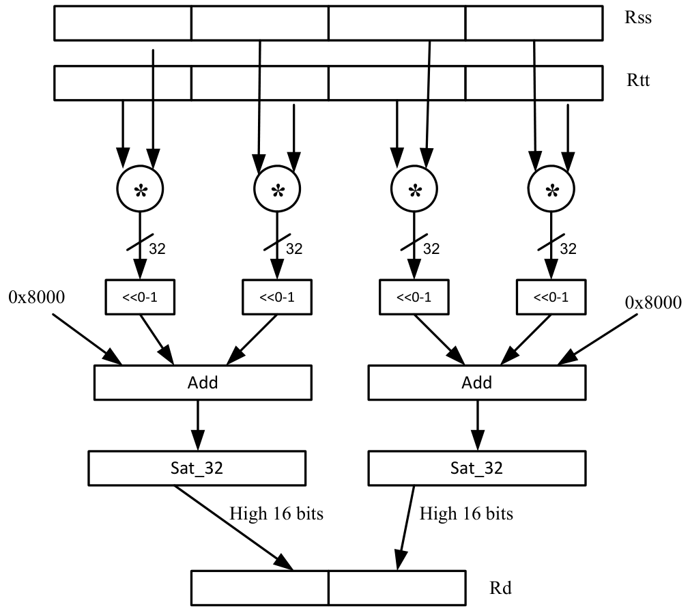

```text
Rss
Rtt
32 32 32 32
0x8000<<0-1<<0-1<<0-1<<0-1 0x8000
Add Add
Sat_32 Sat_32
High 16 bits High 16 bits
Rd
```

| Syntax | Behavior |
|---|---|
| `Rd=vdmpy(Rss,Rtt)[:<<1]:rnd:`<br>`sat` | `Rd.h[0]=(sat₃₂((Rss.h[0] * Rtt.h[0])[<<1] + `<br>`(Rss.h[1] * Rtt.h[1])[<<1] + 0x8000)).h[1];`<br>`Rd.h[1]=(sat₃₂((Rss.h[2] * Rtt.h[2])[<<1] + `<br>`(Rss.h[3] * Rtt.h[3])[<<1] + 0x8000)).h[1];` |

##### Class: XTYPE (slots 2,3)

##### Notes

- If saturation occurs during execution of this instruction (a result is clamped to either maximum or minimum values), the OVF bit in the status register is set. OVF remains set until explicitly cleared by a transfer to the status register.

##### Intrinsics

|  |  |
|---|---|
| `Rd=vdmpy(Rss,Rtt):<<1:rnd:sa` | `Word32 Q6_R_vdmpy_PP_s1_rnd_sat(Word64 Rss, Word64` |
| `t` | `Rtt)` |
| `Rd=vdmpy(Rss,Rtt):rnd:sat` | `Word32 Q6_R_vdmpy_PP_rnd_sat(Word64 Rss, Word64 Rtt)` |

##### Encoding

| 31 | 30 | 29 | 28 | 27 | 26 | 25 | 24 | 23 | 22 | 21 | 20 | 19 | 18 | 17 | 16 | 15 | 14 | 13 | 12 | 11 | 10 | 9 | 8 | 7 | 6 | 5 | 4 | 3 | 2 | 1 | 0 |  |
|---|---|---|---|---|---|---|---|---|---|---|---|---|---|---|---|---|---|---|---|---|---|---|---|---|---|---|---|---|---|---|---|---|
| ICLASS | ICLASS | ICLASS | ICLASS | RegType | RegType | RegType | RegType | MajOp | MajOp | MajOp | s5 | s5 | s5 | s5 | s5 | Parse | Parse |  | t5 | t5 | t5 | t5 | t5 | MinOp | MinOp | MinOp | d5 | d5 | d5 | d5 | d5 |  |
| 1 | 1 | 1 | 0 | 1 | 0 | 0 | 1 | N | 0 | 0 | s | s | s | s | s | P | P | 0 | t | t | t | t | t | 0 | 0 | 0 | d | d | d | d | d | Rd=vdmpy(Rss,Rtt)[:<<N]:rnd:sat |

| Field name | Description |
|---|---|
| `ICLASS` | Instruction class |
| `MajOp` | Major opcode |
| `MinOp` | Minor opcode |
| `RegType` | Register type |
| `Parse` | Packet/loop parse bits |
| `d5` | Field to encode register d |
| `s5` | Field to encode register s |
| `t5` | Field to encode register t |

#### Vector reduce multiply bytes

Multiply eight 8-bit bytes in Rss by the corresponding 8-bit bytes in Rtt. Accumulate the four lower results. Optionally add the lower word of the accumulator. Store this result in the lower 32-bits of the accumulator. The same operation is performed on the upper four products using the upper word of the accumulator. The eight bytes of Rss are treated as either signed or unsigned.

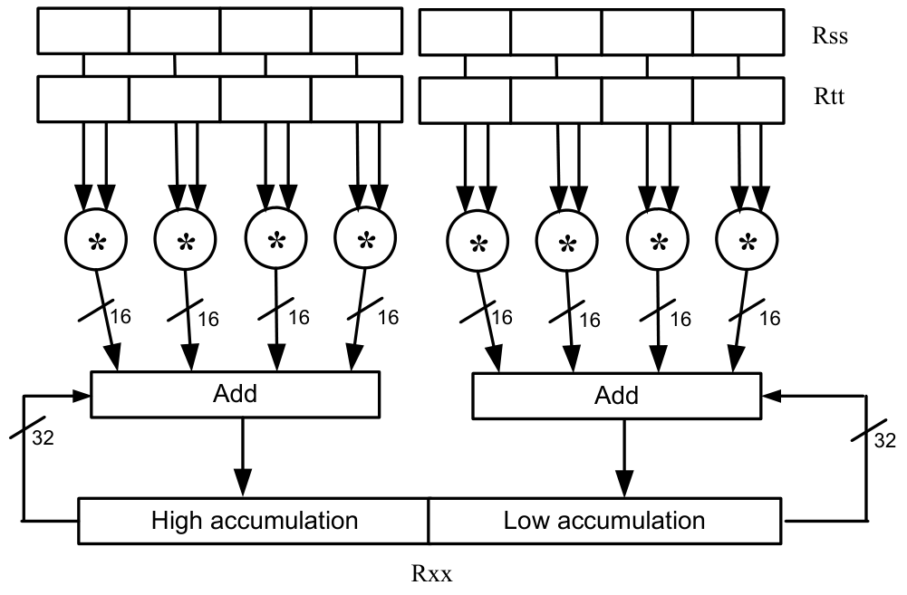

```text
Rss
Rtt
16 16 16 16 16 16 16 16
Add Add
32 32
High accumulation Low accumulation
Rxx
```

| Syntax | Behavior |
|---|---|
| `Rdd= `<br>`vrmpybsu(Rss,Rtt)` | `Rdd.w[0]=((Rss.b[0] * Rtt.ub[0]) + (Rss.b[1] * Rtt.ub[1]) `<br>`+ (Rss.b[2] * Rtt.ub[2]) + (Rss.b[3] * Rtt.ub[3]));`<br>`Rdd.w[1]=((Rss.b[4] * Rtt.ub[4]) + (Rss.b[5] * Rtt.ub[5]) `<br>`+ (Rss.b[6] * Rtt.ub[6]) + (Rss.b[7] * Rtt.ub[7]));` |
| `Rdd=vrmpybu(Rss,Rtt)` | `Rdd.w[0]=((Rss.ub[0] * Rtt.ub[0]) + (Rss.ub[1] * `<br>`Rtt.ub[1]) + (Rss.ub[2] * Rtt.ub[2]) + (Rss.ub[3] * `<br>`Rtt.ub[3]));`<br>`Rdd.w[1]=((Rss.ub[4] * Rtt.ub[4]) + (Rss.ub[5] * `<br>`Rtt.ub[5]) + (Rss.ub[6] * Rtt.ub[6]) + (Rss.ub[7] * `<br>`Rtt.ub[7]));` |
| `Rxx+= `<br>`vrmpybsu(Rss,Rtt)` | `Rxx.w[0]=(Rxx.w[0] + (Rss.b[0] * Rtt.ub[0]) + (Rss.b[1] * `<br>`Rtt.ub[1]) + (Rss.b[2] * Rtt.ub[2]) + (Rss.b[3] * `<br>`Rtt.ub[3]));`<br>`Rxx.w[1]=(Rxx.w[1] + (Rss.b[4] * Rtt.ub[4]) + (Rss.b[5] * `<br>`Rtt.ub[5]) + (Rss.b[6] * Rtt.ub[6]) + (Rss.b[7] * `<br>`Rtt.ub[7]));` |
| `Rxx+= `<br>`vrmpybu(Rss,Rtt)` | `Rxx.w[0]=(Rxx.w[0] + (Rss.ub[0] * Rtt.ub[0]) + (Rss.ub[1] `<br>`* Rtt.ub[1]) + (Rss.ub[2] * Rtt.ub[2]) + (Rss.ub[3] * `<br>`Rtt.ub[3]));`<br>`Rxx.w[1]=(Rxx.w[1] + (Rss.ub[4] * Rtt.ub[4]) + (Rss.ub[5] `<br>`* Rtt.ub[5]) + (Rss.ub[6] * Rtt.ub[6]) + (Rss.ub[7] * `<br>`Rtt.ub[7]));` |

##### Class: XTYPE (slots 2,3)

##### Intrinsics

|  |  |
|---|---|
| `Rdd=vrmpybsu(Rss,Rtt)` | `Word64 Q6_P_vrmpybsu_PP(Word64 Rss, Word64 Rtt)` |
| `Rdd=vrmpybu(Rss,Rtt)` | `Word64 Q6_P_vrmpybu_PP(Word64 Rss, Word64 Rtt)` |
| `Rxx+=vrmpybsu(Rss,Rtt)` | `Word64 Q6_P_vrmpybsuacc_PP(Word64 Rxx, Word64 Rss, Word64 Rtt)` |
| `Rxx+=vrmpybu(Rss,Rtt)` | `Word64 Q6_P_vrmpybuacc_PP(Word64 Rxx, Word64 Rss, Word64 Rtt)` |

##### Encoding

| 31 | 30 | 29 | 28 | 27 | 26 | 25 | 24 | 23 | 22 | 21 | 20 | 19 | 18 | 17 | 16 | 15 | 14 | 13 | 12 | 11 | 10 | 9 | 8 | 7 | 6 | 5 | 4 | 3 | 2 | 1 | 0 |  |
|---|---|---|---|---|---|---|---|---|---|---|---|---|---|---|---|---|---|---|---|---|---|---|---|---|---|---|---|---|---|---|---|---|
| ICLASS | ICLASS | ICLASS | ICLASS | RegType | RegType | RegType | RegType | MajOp | MajOp | MajOp | s5 | s5 | s5 | s5 | s5 | Parse | Parse |  | t5 | t5 | t5 | t5 | t5 | MinOp | MinOp | MinOp | d5 | d5 | d5 | d5 | d5 |  |
| 1 | 1 | 1 | 0 | 1 | 0 | 0 | 0 | 1 | 0 | 0 | s | s | s | s | s | P | P | 0 | t | t | t | t | t | 0 | 0 | 1 | d | d | d | d | d | Rdd=vrmpybu(Rss,Rtt) |
| 1 | 1 | 1 | 0 | 1 | 0 | 0 | 0 | 1 | 1 | 0 | s | s | s | s | s | P | P | 0 | t | t | t | t | t | 0 | 0 | 1 | d | d | d | d | d | Rdd=vrmpybsu(Rss,Rtt) |
| ICLASS | ICLASS | ICLASS | ICLASS | RegType | RegType | RegType | RegType | MajOp | MajOp | MajOp | s5 | s5 | s5 | s5 | s5 | Parse | Parse |  | t5 | t5 | t5 | t5 | t5 | MinOp | MinOp | MinOp | x5 | x5 | x5 | x5 | x5 |  |
| 1 | 1 | 1 | 0 | 1 | 0 | 1 | 0 | 1 | 0 | 0 | s | s | s | s | s | P | P | 0 | t | t | t | t | t | 0 | 0 | 1 | x | x | x | x | x | Rxx+=vrmpybu(Rss,Rtt) |
| 1 | 1 | 1 | 0 | 1 | 0 | 1 | 0 | 1 | 1 | 0 | s | s | s | s | s | P | P | 0 | t | t | t | t | t | 0 | 0 | 1 | x | x | x | x | x | Rxx+=vrmpybsu(Rss,Rtt) |

| Field name | Description |
|---|---|
| `ICLASS` | Instruction class |
| `MajOp` | Major opcode |
| `MinOp` | Minor opcode |
| `RegType` | Register type |
| `Parse` | Packet/loop parse bits |
| `d5` | Field to encode register d |
| `s5` | Field to encode register s |
| `t5` | Field to encode register t |
| `x5` | Field to encode register x |

#### Vector dual multiply signed by unsigned bytes

Multiply eight 8-bit signed bytes in Rss by the corresponding 8-bit unsigned bytes in Rtt. Add the results in pairs, and optionally add the accumulator. Saturate the results to signed 16 bits and store in the four halfwords of the destination register.

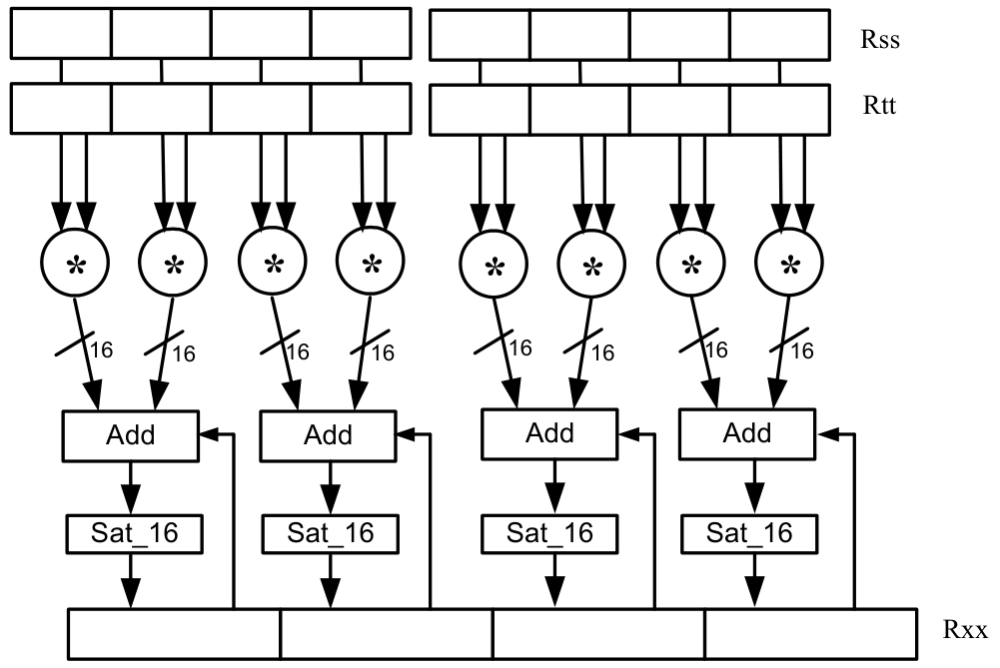

```text
Rss
Rtt
16 16 16 16 16 16 16 16
Add Add Add Add
Sat_16 Sat_16 Sat_16 Sat_16
Rxx
```

| Syntax | Behavior |
|---|---|
| `Rdd=vdmpybsu(Rss,Rtt):sat` | `Rdd.h[0]=sat₁₆(((Rss.b[0] * Rtt.ub[0]) + (Rss.b[1] `<br>`* Rtt.ub[1])));`<br>`Rdd.h[1]=sat₁₆((((Rss.b[2] * Rtt.ub[2]) + `<br>`(Rss.b[3] * Rtt.ub[3])));`<br>`Rdd.h[2]=sat₁₆(((Rss.b[4] * Rtt.ub[4]) + (Rss.b[5] `<br>`* Rtt.ub[5])));`<br>`Rdd.h[3]=sat₁₆(((Rss.b[6] * Rtt.ub[6]) + (Rss.b[7] `<br>`* Rtt.ub[7])));` |
| `Rxx+=vdmpybsu(Rss,Rtt):sat` | `Rxx.h[0]=sat₁₆((Rxx.h[0] + (Rss.b[0] * Rtt.ub[0]) `<br>`+ (Rss.b[1] * Rtt.ub[1])));`<br>`Rxx.h[1]=sat₁₆((Rxx.h[1] + (Rss.b[2] * Rtt.ub[2]) `<br>`+ (Rss.b[3] * Rtt.ub[3])));`<br>`Rxx.h[2]=sat₁₆((Rxx.h[2] + (Rss.b[4] * Rtt.ub[4]) `<br>`+ (Rss.b[5] * Rtt.ub[5])));`<br>`Rxx.h[3]=sat₁₆((Rxx.h[3] + (Rss.b[6] * Rtt.ub[6]) `<br>`+ (Rss.b[7] * Rtt.ub[7])));` |

##### Class: XTYPE (slots 2,3)

##### Notes

- If saturation occurs during execution of this instruction (a result is clamped to either maximum or minimum values), the OVF bit in the status register is set. OVF remains set until explicitly cleared by a transfer to the status register.

##### Intrinsics

|  |  |
|---|---|
| `Rdd=vdmpybsu(Rss,Rtt):sat` | `Word64 Q6_P_vdmpybsu_PP_sat(Word64 Rss, Word64 Rtt)` |
| `Rxx+=vdmpybsu(Rss,Rtt):sat` | `Word64 Q6_P_vdmpybsuacc_PP_sat(Word64 Rxx, Word64 Rss, Word64 Rtt)` |

##### Encoding

| 31 | 30 | 29 | 28 | 27 | 26 | 25 | 24 | 23 | 22 | 21 | 20 | 19 | 18 | 17 | 16 | 15 | 14 | 13 | 12 | 11 | 10 | 9 | 8 | 7 | 6 | 5 | 4 | 3 | 2 | 1 | 0 |  |
|---|---|---|---|---|---|---|---|---|---|---|---|---|---|---|---|---|---|---|---|---|---|---|---|---|---|---|---|---|---|---|---|---|
| ICLASS | ICLASS | ICLASS | ICLASS | RegType | RegType | RegType | RegType | MajOp | MajOp | MajOp | s5 | s5 | s5 | s5 | s5 | Parse | Parse |  | t5 | t5 | t5 | t5 | t5 | MinOp | MinOp | MinOp | d5 | d5 | d5 | d5 | d5 |  |
| 1 | 1 | 1 | 0 | 1 | 0 | 0 | 0 | 1 | 0 | 1 | s | s | s | s | s | P | P | 0 | t | t | t | t | t | 0 | 0 | 1 | d | d | d | d | d | Rdd=vdmpybsu(Rss,Rtt):sat |
| ICLASS | ICLASS | ICLASS | ICLASS | RegType | RegType | RegType | RegType | MajOp | MajOp | MajOp | s5 | s5 | s5 | s5 | s5 | Parse | Parse |  | t5 | t5 | t5 | t5 | t5 | MinOp | MinOp | MinOp | x5 | x5 | x5 | x5 | x5 |  |
| 1 | 1 | 1 | 0 | 1 | 0 | 1 | 0 | 0 | 0 | 1 | s | s | s | s | s | P | P | 0 | t | t | t | t | t | 0 | 0 | 1 | x | x | x | x | x | Rxx+=vdmpybsu(Rss,Rtt):sat |

| Field name | Description |
|---|---|
| `ICLASS` | Instruction class |
| `MajOp` | Major opcode |
| `MinOp` | Minor opcode |
| `RegType` | Register type |
| `Parse` | Packet/loop parse bits |
| `d5` | Field to encode register d |
| `s5` | Field to encode register s |
| `t5` | Field to encode register t |
| `x5` | Field to encode register x |

#### Vector multiply even halfwords

Multiply the even 16-bit halfwords from Rss and Rtt separately. Optionally accumulate with the low and high words of the destination register pair and optionally saturate.

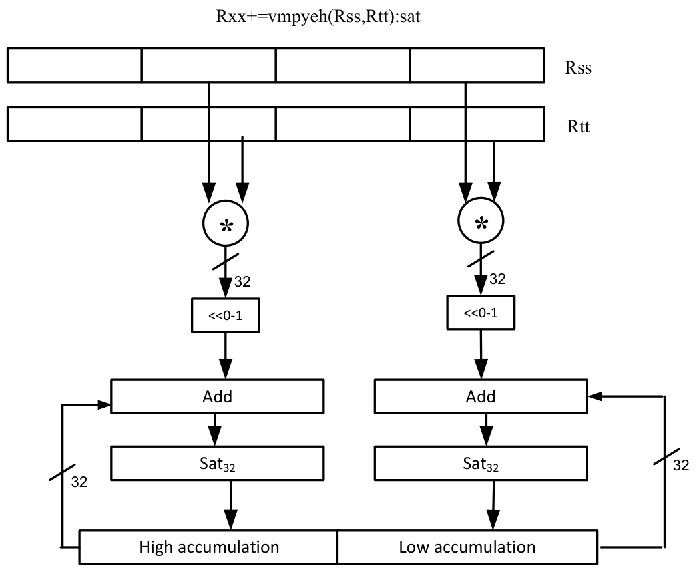

```text
Rxx+=vmpyeh(Rss,Rtt):sat
Rss
Rtt
32 32
<<0-1 <<0-1
Add Add
Sat₃₂ Sat₃₂₃₂
32
High accumulation Low accumulation
```

Rxx

| Syntax | Behavior |
|---|---|
| `Rdd=vmpyeh(Rss,Rtt):<<1:sat` | `Rdd.w[0]=sat₃₂((Rss.h[0] * Rtt.h[0])<<1);`<br>`Rdd.w[1]=sat₃₂((Rss.h[2] * Rtt.h[2])<<1);` |
| `Rdd=vmpyeh(Rss,Rtt):sat` | `Rdd.w[0]=sat₃₂((Rss.h[0] * Rtt.h[0])<<0);`<br>`Rdd.w[1]=sat₃₂((Rss.h[2] * Rtt.h[2])<<0);` |
| `Rxx+=vmpyeh(Rss,Rtt)` | `Rxx.w[0]=Rxx.w[0] + (Rss.h[0] * Rtt.h[0]);`<br>`Rxx.w[1]=Rxx.w[1] + (Rss.h[2] * Rtt.h[2]);` |
| `Rxx+=vmpyeh(Rss,Rtt):<<1:sat` | `Rxx.w[0]=sat₃₂(Rxx.w[0] + (Rss.h[0] * `<br>`Rtt.h[0])<<1);`<br>`Rxx.w[1]=sat₃₂(Rxx.w[1] + (Rss.h[2] * `<br>`Rtt.h[2])<<1);` |
| `Rxx+=vmpyeh(Rss,Rtt):sat` | `Rxx.w[0]=sat₃₂(Rxx.w[0] + (Rss.h[0] * `<br>`Rtt.h[0])<<0);`<br>`Rxx.w[1]=sat₃₂(Rxx.w[1] + (Rss.h[2] * `<br>`Rtt.h[2])<<0);` |

##### Class: XTYPE (slots 2,3)

##### Notes

- If saturation occurs during execution of this instruction (a result is clamped to either maximum or minimum values), the OVF bit in the status register is set. OVF remains set until explicitly cleared by a transfer to the status register.

##### Intrinsics

|  |  |
|---|---|
| `Rdd=vmpyeh(Rss,Rtt):<<1:sat` | `Word64 Q6_P_vmpyeh_PP_s1_sat(Word64 Rss, Word64 Rtt)` |
| `Rdd=vmpyeh(Rss,Rtt):sat` | `Word64 Q6_P_vmpyeh_PP_sat(Word64 Rss, Word64 Rtt)` |
| `Rxx+=vmpyeh(Rss,Rtt)` | `Word64 Q6_P_vmpyehacc_PP(Word64 Rxx, Word64 Rss, Word64 Rtt)` |
| `Rxx+=vmpyeh(Rss,Rtt):<<1:sat` | `Word64 Q6_P_vmpyehacc_PP_s1_sat(Word64 Rxx, Word64 Rss, Word64 Rtt)` |
| `Rxx+=vmpyeh(Rss,Rtt):sat` | `Word64 Q6_P_vmpyehacc_PP_sat(Word64 Rxx, Word64 Rss, Word64 Rtt)` |

##### Encoding

| 31 | 30 | 29 | 28 | 27 | 26 | 25 | 24 | 23 | 22 | 21 | 20 | 19 | 18 | 17 | 16 | 15 | 14 | 13 | 12 | 11 | 10 | 9 | 8 | 7 | 6 | 5 | 4 | 3 | 2 | 1 | 0 |  |
|---|---|---|---|---|---|---|---|---|---|---|---|---|---|---|---|---|---|---|---|---|---|---|---|---|---|---|---|---|---|---|---|---|
| ICLASS | ICLASS | ICLASS | ICLASS | RegType | RegType | RegType | RegType | MajOp | MajOp | MajOp | s5 | s5 | s5 | s5 | s5 | Parse | Parse |  | t5 | t5 | t5 | t5 | t5 | MinOp | MinOp | MinOp | d5 | d5 | d5 | d5 | d5 |  |
| 1 | 1 | 1 | 0 | 1 | 0 | 0 | 0 | N | 0 | 0 | s | s | s | s | s | P | P | 0 | t | t | t | t | t | 1 | 1 | 0 | d | d | d | d | d | Rdd=vmpyeh(Rss,Rtt)[:<<N]:sat |
| ICLASS | ICLASS | ICLASS | ICLASS | RegType | RegType | RegType | RegType | MajOp | MajOp | MajOp | s5 | s5 | s5 | s5 | s5 | Parse | Parse |  | t5 | t5 | t5 | t5 | t5 | MinOp | MinOp | MinOp | x5 | x5 | x5 | x5 | x5 |  |
| 1 | 1 | 1 | 0 | 1 | 0 | 1 | 0 | 0 | 0 | 1 | s | s | s | s | s | P | P | 0 | t | t | t | t | t | 0 | 1 | 0 | x | x | x | x | x | Rxx+=vmpyeh(Rss,Rtt) |
| 1 | 1 | 1 | 0 | 1 | 0 | 1 | 0 | N | 0 | 0 | s | s | s | s | s | P | P | 0 | t | t | t | t | t | 1 | 1 | 0 | x | x | x | x | x | Rxx+=vmpyeh(Rss,Rtt)[:<<N]:sat |

| Field name | Description |
|---|---|
| `ICLASS` | Instruction class |
| `MajOp` | Major opcode |
| `MinOp` | Minor opcode |
| `RegType` | Register type |
| `Parse` | Packet/loop parse bits |
| `d5` | Field to encode register d |
| `s5` | Field to encode register s |
| `t5` | Field to encode register t |
| `x5` | Field to encode register x |

#### Vector multiply halfwords

Multiply two 16-bit halfwords separately, and optionally accumulate with the low and high words of the destination. Optionally saturate, and store the results back to the destination register pair.

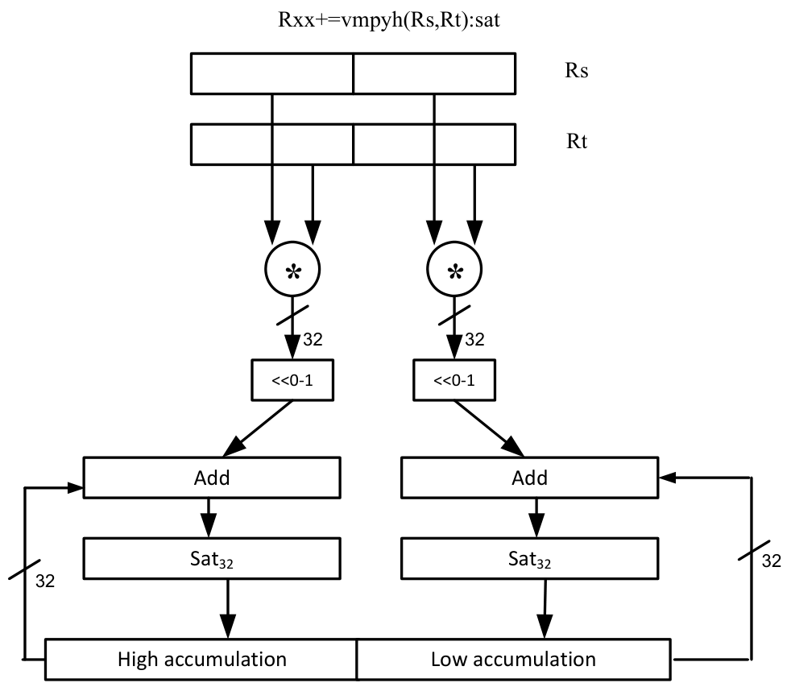

```text
Rxx+=vmpyh(Rs,Rt):sat
Rs
Rt
32 32
<<0-1 <<0-1
Add Add
Sat₃₂ Sat₃₂₃₂
32
High accumulation Low accumulation
```

Rxx

| Syntax | Behavior |
|---|---|
| `Rdd=vmpyh(Rs,Rt)[:<<1]:sa`<br>`t` | `Rdd.w[0]=sat₃₂((Rs.h[0] * Rt.h[0])[<<1]);`<br>`Rdd.w[1]=sat₃₂((Rs.h[1] * Rt.h[1])[<<1]);` |
| `Rxx+=vmpyh(Rs,Rt)` | `Rxx.w[0]=Rxx.w[0] + (Rs.h[0] * Rt.h[0]);`<br>`Rxx.w[1]=Rxx.w[1] + (Rs.h[1] * Rt.h[1]);` |
| `Rxx+=vmpyh(Rs,Rt)[:<<1]:s`<br>`at` | `Rxx.w[0]=sat₃₂(Rxx.w[0] + (Rs.h[0] * Rt.h[0])[<<1]);`<br>`Rxx.w[1]=sat₃₂(Rxx.w[1] + (Rs.h[1] * Rt.h[1])[<<1]);` |

##### Class: XTYPE (slots 2,3)

##### Notes

- If saturation occurs during execution of this instruction (a result is clamped to either maximum or minimum values), the OVF bit in the status register is set. OVF remains set until explicitly cleared by a transfer to the status register.

##### Intrinsics

|  |  |
|---|---|
| `Rdd=vmpyh(Rs,Rt):<<1:sat` | `Word64 Q6_P_vmpyh_RR_s1_sat(Word32 Rs, Word32 Rt)` |
| `Rdd=vmpyh(Rs,Rt):sat` | `Word64 Q6_P_vmpyh_RR_sat(Word32 Rs, Word32 Rt)` |
| `Rxx+=vmpyh(Rs,Rt)` | `Word64 Q6_P_vmpyhacc_RR(Word64 Rxx, Word32 Rs, Word32 Rt)` |
| `Rxx+=vmpyh(Rs,Rt):<<1:sa` | `Word64 Q6_P_vmpyhacc_RR_s1_sat(Word64 Rxx, Word32 Rs,` |
| `t` | `Word32 Rt)` |
| `Rxx+=vmpyh(Rs,Rt):sat` | `Word64 Q6_P_vmpyhacc_RR_sat(Word64 Rxx, Word32 Rs, Word32 Rt)` |

##### Encoding

| 31 | 30 | 29 | 28 | 27 | 26 | 25 | 24 | 23 | 22 | 21 | 20 | 19 | 18 | 17 | 16 | 15 | 14 | 13 | 12 | 11 | 10 | 9 | 8 | 7 | 6 | 5 | 4 | 3 | 2 | 1 | 0 |  |
|---|---|---|---|---|---|---|---|---|---|---|---|---|---|---|---|---|---|---|---|---|---|---|---|---|---|---|---|---|---|---|---|---|
| ICLASS | ICLASS | ICLASS | ICLASS | RegType | RegType | RegType | RegType | MajOp | MajOp | MajOp | s5 | s5 | s5 | s5 | s5 | Parse | Parse |  | t5 | t5 | t5 | t5 | t5 | MinOp | MinOp | MinOp | d5 | d5 | d5 | d5 | d5 |  |
| 1 | 1 | 1 | 0 | 0 | 1 | 0 | 1 | N | 0 | 0 | s | s | s | s | s | P | P | 0 | t | t | t | t | t | 1 | 0 | 1 | d | d | d | d | d | Rdd=vmpyh(Rs,Rt)[:<<N]:sat |
| ICLASS | ICLASS | ICLASS | ICLASS | RegType | RegType | RegType | RegType | MajOp | MajOp | MajOp | s5 | s5 | s5 | s5 | s5 | Parse | Parse |  | t5 | t5 | t5 | t5 | t5 | MinOp | MinOp | MinOp | x5 | x5 | x5 | x5 | x5 |  |
| 1 | 1 | 1 | 0 | 0 | 1 | 1 | 1 | 0 | 0 | 1 | s | s | s | s | s | P | P | 0 | t | t | t | t | t | 0 | 0 | 1 | x | x | x | x | x | Rxx+=vmpyh(Rs,Rt) |
| 1 | 1 | 1 | 0 | 0 | 1 | 1 | 1 | N | 0 | 0 | s | s | s | s | s | P | P | 0 | t | t | t | t | t | 1 | 0 | 1 | x | x | x | x | x | Rxx+=vmpyh(Rs,Rt)[:<<N]: sat |

| Field name | Description |
|---|---|
| `ICLASS` | Instruction class |
| `MajOp` | Major opcode |
| `MinOp` | Minor opcode |
| `RegType` | Register type |
| `Parse` | Packet/loop parse bits |
| `d5` | Field to encode register d |
| `s5` | Field to encode register s |
| `t5` | Field to encode register t |
| `x5` | Field to encode register x |

#### Vector multiply halfwords with round and pack

Multiply two 16-bit halfwords separately. Round the results, and store the high halfwords packed in a single register destination.

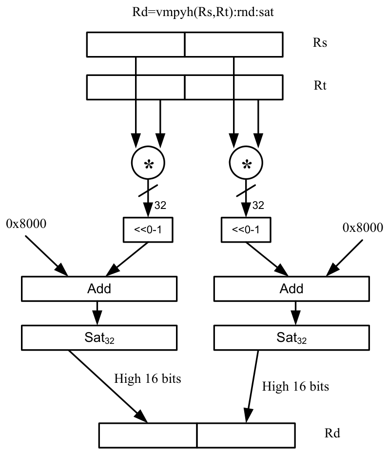

```text
Rd=vmpyh(Rs,Rt):rnd:sat
Rs
Rt
32 32
0x8000
<<0-1<<0-1 0x8000
Add Add
Sat₃₂ Sat₃₂
High 16 bits
High 16 bits
Rd
```

| Syntax | Behavior |
|---|---|
| `Rd=vmpyh(Rs,Rt)[:<<1]:rnd:sa`<br>`t` | `Rd.h[1]=(sat₃₂((Rs.h[1] * Rt.h[1])[<<1] + `<br>`0x8000)).h[1];`<br>`Rd.h[0]=(sat₃₂((Rs.h[0] * Rt.h[0])[<<1] + `<br>`0x8000)).h[1];` |

##### Class: XTYPE (slots 2,3)

##### Notes

- If saturation occurs during execution of this instruction (a result is clamped to either maximum or minimum values), the OVF bit in the status register is set. OVF remains set until explicitly cleared by a transfer to the status register.

##### Intrinsics

|  |  |
|---|---|
| `Rd=vmpyh(Rs,Rt):<<1:rnd:sat` | `Word32 Q6_R_vmpyh_RR_s1_rnd_sat(Word32 Rs, Word32 Rt)` |
| `Rd=vmpyh(Rs,Rt):rnd:sat` | `Word32 Q6_R_vmpyh_RR_rnd_sat(Word32 Rs, Word32 Rt)` |

##### Encoding

| 31 | 30 | 29 | 28 | 27 | 26 | 25 | 24 | 23 | 22 | 21 | 20 | 19 | 18 | 17 | 16 | 15 | 14 | 13 | 12 | 11 | 10 | 9 | 8 | 7 | 6 | 5 | 4 | 3 | 2 | 1 | 0 |  |
|---|---|---|---|---|---|---|---|---|---|---|---|---|---|---|---|---|---|---|---|---|---|---|---|---|---|---|---|---|---|---|---|---|
| ICLASS | ICLASS | ICLASS | ICLASS | RegType | RegType | RegType | RegType | MajOp | MajOp | MajOp | s5 | s5 | s5 | s5 | s5 | Parse | Parse |  | t5 | t5 | t5 | t5 | t5 | MinOp | MinOp | MinOp | d5 | d5 | d5 | d5 | d5 |  |
| 1 | 1 | 1 | 0 | 1 | 1 | 0 | 1 | N | 0 | 1 | s | s | s | s | s | P | P | 0 | t | t | t | t | t | 1 | 1 | 1 | d | d | d | d | d | Rd=vmpyh(Rs,Rt)[:<<N]:rnd:sat |

| Field name | Description |
|---|---|
| `ICLASS` | Instruction class |
| `MajOp` | Major opcode |
| `MinOp` | Minor opcode |
| `RegType` | Register type |
| `Parse` | Packet/loop parse bits |
| `d5` | Field to encode register d |
| `s5` | Field to encode register s |
| `t5` | Field to encode register t |

#### Vector multiply halfwords signed by unsigned

Multiply two 16-bit halfwords. Rs is considered signed, Ru unsigned.

| Syntax | Behavior |
|---|---|
| `Rdd=vmpyhsu(Rs,Rt)[:<<1]:sat` | `Rdd.w[0]=sat₃₂((Rs.h[0] * Rt.uh[0])[<<1]);`<br>`Rdd.w[1]=sat₃₂((Rs.h[1] * Rt.uh[1])[<<1]);` |
| `Rxx+=vmpyhsu(Rs,Rt)[:<<1]:sa`<br>`t` | `Rxx.w[0]=sat₃₂(Rxx.w[0] + (Rs.h[0] * `<br>`Rt.uh[0])[<<1]);`<br>`Rxx.w[1]=sat₃₂(Rxx.w[1] + (Rs.h[1] * `<br>`Rt.uh[1])[<<1]);` |

##### Class: XTYPE (slots 2,3)

##### Notes

- If saturation occurs during execution of this instruction (a result is clamped to either maximum or minimum values), the OVF bit in the status register is set. OVF remains set until explicitly cleared by a transfer to the status register.

##### Intrinsics

```
Rdd=vmpyhsu(Rs,Rt):<<1:saWord64 Q6_P_vmpyhsu_RR_s1_sat(Word32 Rs, Word32 Rt)
t
```

|  |  |
|---|---|
| `Rdd=vmpyhsu(Rs,Rt):sat` | `Word64 Q6_P_vmpyhsu_RR_sat(Word32 Rs, Word32 Rt)` |
| `Rxx+=vmpyhsu(Rs,Rt):<<1:s` | `Word64 Q6_P_vmpyhsuacc_RR_s1_sat(Word64 Rxx, Word32` |
| `at` | `Rs, Word32 Rt)` |
| `Rxx+=vmpyhsu(Rs,Rt):sat` | `Word64 Q6_P_vmpyhsuacc_RR_sat(Word64 Rxx, Word32 Rs, Word32 Rt)` |

##### Encoding

| 31 | 30 | 29 | 28 | 27 | 26 | 25 | 24 | 23 | 22 | 21 | 20 | 19 | 18 | 17 | 16 | 15 | 14 | 13 | 12 | 11 | 10 | 9 | 8 | 7 | 6 | 5 | 4 | 3 | 2 | 1 | 0 |  |
|---|---|---|---|---|---|---|---|---|---|---|---|---|---|---|---|---|---|---|---|---|---|---|---|---|---|---|---|---|---|---|---|---|
| ICLASS | ICLASS | ICLASS | ICLASS | RegType | RegType | RegType | RegType | MajOp | MajOp | MajOp | s5 | s5 | s5 | s5 | s5 | Parse | Parse |  | t5 | t5 | t5 | t5 | t5 | MinOp | MinOp | MinOp | d5 | d5 | d5 | d5 | d5 |  |
| 1 | 1 | 1 | 0 | 0 | 1 | 0 | 1 | N | 0 | 0 | s | s | s | s | s | P | P | 0 | t | t | t | t | t | 1 | 1 | 1 | d | d | d | d | d | Rdd=vmpyhsu(Rs,Rt)[:<<N]:sat |
| ICLASS | ICLASS | ICLASS | ICLASS | RegType | RegType | RegType | RegType | MajOp | MajOp | MajOp | s5 | s5 | s5 | s5 | s5 | Parse | Parse |  | t5 | t5 | t5 | t5 | t5 | MinOp | MinOp | MinOp | x5 | x5 | x5 | x5 | x5 |  |
| 1 | 1 | 1 | 0 | 0 | 1 | 1 | 1 | N | 1 | 1 | s | s | s | s | s | P | P | 0 | t | t | t | t | t | 1 | 0 | 1 | x | x | x | x | x | Rxx+=vmpyhsu(Rs,Rt)[:<<N]:sat |

| Field name | Description |
|---|---|
| `ICLASS` | Instruction class |
| `MajOp` | Major opcode |
| `MinOp` | Minor opcode |
| `RegType` | Register type |
| `Parse` | Packet/loop parse bits |
| `d5` | Field to encode register d |
| Field name | Description |
| `s5` | Field to encode register s |
| `t5` | Field to encode register t |
| `x5` | Field to encode register x |

#### Vector reduce multiply halfwords

Multiply each halfword of Rss by the corresponding halfword in Rtt. Add the intermediate products together and then optionally add the accumulator. Store the full 64-bit result in the destination register pair.

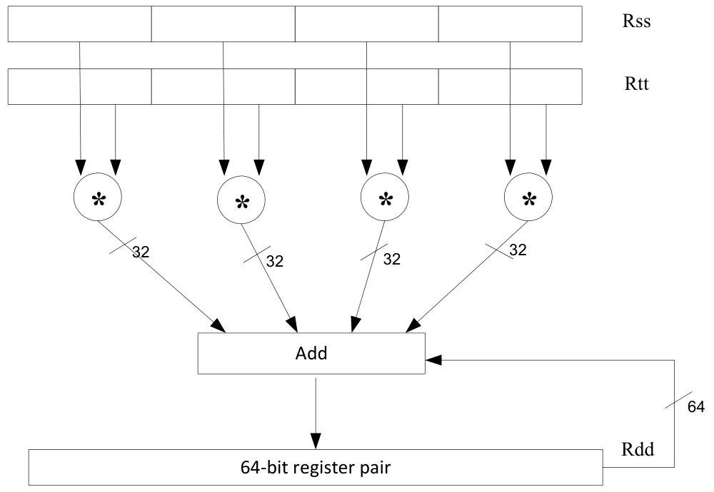

```text
Rss
Rtt
32 32
32 32
Add
64
Rdd
64-bit register pair
```

| Syntax | Behavior |
|---|---|
| `Rdd=vrmpyh(Rss,Rtt)` | `Rdd = (Rss.h[0] * Rtt.h[0]) + (Rss.h[1] * Rtt.h[1]) + `<br>`(Rss.h[2] * Rtt.h[2]) + (Rss.h[3] * Rtt.h[3]);` |
| `Rxx+=vrmpyh(Rss,Rtt)` | `Rxx = Rxx + (Rss.h[0] * Rtt.h[0]) + (Rss.h[1] * `<br>`Rtt.h[1]) + (Rss.h[2] * Rtt.h[2]) + (Rss.h[3] * `<br>`Rtt.h[3]);` |

##### Class: XTYPE (slots 2,3)

##### Intrinsics

|  |  |
|---|---|
| `Rdd=vrmpyh(Rss,Rtt)` | `Word64 Q6_P_vrmpyh_PP(Word64 Rss, Word64 Rtt)` |
| `Rxx+=vrmpyh(Rss,Rtt)` | `Word64 Q6_P_vrmpyhacc_PP(Word64 Rxx, Word64 Rss, Word64 Rtt)` |

##### Encoding

| 31 | 30 | 29 | 28 | 27 | 26 | 25 | 24 | 23 | 22 | 21 | 20 | 19 | 18 | 17 | 16 | 15 | 14 | 13 | 12 | 11 | 10 | 9 | 8 | 7 | 6 | 5 | 4 | 3 | 2 | 1 | 0 |  |
|---|---|---|---|---|---|---|---|---|---|---|---|---|---|---|---|---|---|---|---|---|---|---|---|---|---|---|---|---|---|---|---|---|
| ICLASS | ICLASS | ICLASS | ICLASS | RegType | RegType | RegType | RegType | MajOp | MajOp | MajOp | s5 | s5 | s5 | s5 | s5 | Parse | Parse |  | t5 | t5 | t5 | t5 | t5 | MinOp | MinOp | MinOp | d5 | d5 | d5 | d5 | d5 |  |
| 1 | 1 | 1 | 0 | 1 | 0 | 0 | 0 | 0 | 0 | 0 | s | s | s | s | s | P | P | 0 | t | t | t | t | t | 0 | 1 | 0 | d | d | d | d | d | Rdd=vrmpyh(Rss,Rtt) |
| ICLASS | ICLASS | ICLASS | ICLASS | RegType | RegType | RegType | RegType | MajOp | MajOp | MajOp | s5 | s5 | s5 | s5 | s5 | Parse | Parse |  | t5 | t5 | t5 | t5 | t5 | MinOp | MinOp | MinOp | x5 | x5 | x5 | x5 | x5 |  |
| 1 | 1 | 1 | 0 | 1 | 0 | 1 | 0 | 0 | 0 | 0 | s | s | s | s | s | P | P | 0 | t | t | t | t | t | 0 | 1 | 0 | x | x | x | x | x | Rxx+=vrmpyh(Rss,Rtt) |

| Field name | Description |
|---|---|
| `ICLASS` | Instruction class |
| `MajOp` | Major opcode |
| `MinOp` | Minor opcode |
| `RegType` | Register type |
| `Parse` | Packet/loop parse bits |
| `d5` | Field to encode register d |
| `s5` | Field to encode register s |
| `t5` | Field to encode register t |
| `x5` | Field to encode register x |

#### Vector multiply bytes

Multiply four 8-bit bytes from register Rs by four 8-bit bytes from Rt. Optionally accumulate the product with the 16-bit value from the destination register. Pack the 16-bit results in the destination register pair. The bytes of Rs are treated as either signed or unsigned.

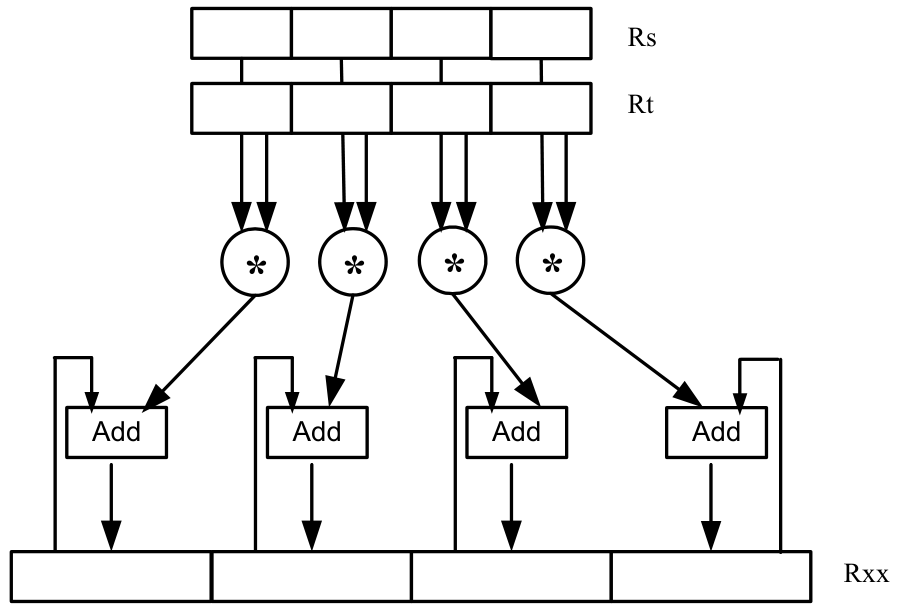

```text
Rs
Rt
Add Add Add Add
Rxx
```

| Syntax | Behavior |
|---|---|
| `Rdd=vmpybsu(Rs,Rt)` | `Rdd.h[0]=((Rs.b[0] * Rt.ub[0]));`<br>`Rdd.h[1]=((Rs.b[1] * Rt.ub[1]));`<br>`Rdd.h[2]=((Rs.b[2] * Rt.ub[2]));`<br>`Rdd.h[3]=((Rs.b[3] * Rt.ub[3]));` |
| `Rdd=vmpybu(Rs,Rt)` | `Rdd.h[0]=((Rs.ub[0] * Rt.ub[0]));`<br>`Rdd.h[1]=((Rs.ub[1] * Rt.ub[1]));`<br>`Rdd.h[2]=((Rs.ub[2] * Rt.ub[2]));`<br>`Rdd.h[3]=((Rs.ub[3] * Rt.ub[3]));` |
| `Rxx+=vmpybsu(Rs,Rt)` | `Rxx.h[0]=(Rxx.h[0]+(Rs.b[0] * Rt.ub[0]));`<br>`Rxx.h[1]=(Rxx.h[1]+(Rs.b[1] * Rt.ub[1]));`<br>`Rxx.h[2]=(Rxx.h[2]+(Rs.b[2] * Rt.ub[2]));`<br>`Rxx.h[3]=(Rxx.h[3]+(Rs.b[3] * Rt.ub[3]));` |
| `Rxx+=vmpybu(Rs,Rt)` | `Rxx.h[0]=(Rxx.h[0]+(Rs.ub[0] * Rt.ub[0]));`<br>`Rxx.h[1]=(Rxx.h[1]+(Rs.ub[1] * Rt.ub[1]));`<br>`Rxx.h[2]=(Rxx.h[2]+(Rs.ub[2] * Rt.ub[2]));`<br>`Rxx.h[3]=(Rxx.h[3]+(Rs.ub[3] * Rt.ub[3]));` |

##### Class: XTYPE (slots 2,3)

##### Intrinsics

|  |  |
|---|---|
| `Rdd=vmpybsu(Rs,Rt)` | `Word64 Q6_P_vmpybsu_RR(Word32 Rs, Word32 Rt)` |
| `Rdd=vmpybu(Rs,Rt)` | `Word64 Q6_P_vmpybu_RR(Word32 Rs, Word32 Rt)` |
| `Rxx+=vmpybsu(Rs,Rt)` | `Word64 Q6_P_vmpybsuacc_RR(Word64 Rxx, Word32 Rs, Word32 Rt)` |
| `Rxx+=vmpybu(Rs,Rt)` | `Word64 Q6_P_vmpybuacc_RR(Word64 Rxx, Word32 Rs, Word32 Rt)` |

##### Encoding

| 31 | 30 | 29 | 28 | 27 | 26 | 25 | 24 | 23 | 22 | 21 | 20 | 19 | 18 | 17 | 16 | 15 | 14 | 13 | 12 | 11 | 10 | 9 | 8 | 7 | 6 | 5 | 4 | 3 | 2 | 1 | 0 |  |
|---|---|---|---|---|---|---|---|---|---|---|---|---|---|---|---|---|---|---|---|---|---|---|---|---|---|---|---|---|---|---|---|---|
| ICLASS | ICLASS | ICLASS | ICLASS | RegType | RegType | RegType | RegType | MajOp | MajOp | MajOp | s5 | s5 | s5 | s5 | s5 | Parse | Parse |  | t5 | t5 | t5 | t5 | t5 | MinOp | MinOp | MinOp | d5 | d5 | d5 | d5 | d5 |  |
| 1 | 1 | 1 | 0 | 0 | 1 | 0 | 1 | 0 | 1 | 0 | s | s | s | s | s | P | P | 0 | t | t | t | t | t | 0 | 0 | 1 | d | d | d | d | d | Rdd=vmpybsu(Rs,Rt) |
| 1 | 1 | 1 | 0 | 0 | 1 | 0 | 1 | 1 | 0 | 0 | s | s | s | s | s | P | P | 0 | t | t | t | t | t | 0 | 0 | 1 | d | d | d | d | d | Rdd=vmpybu(Rs,Rt) |
| ICLASS | ICLASS | ICLASS | ICLASS | RegType | RegType | RegType | RegType | MajOp | MajOp | MajOp | s5 | s5 | s5 | s5 | s5 | Parse | Parse |  | t5 | t5 | t5 | t5 | t5 | MinOp | MinOp | MinOp | x5 | x5 | x5 | x5 | x5 |  |
| 1 | 1 | 1 | 0 | 0 | 1 | 1 | 1 | 1 | 0 | 0 | s | s | s | s | s | P | P | 0 | t | t | t | t | t | 0 | 0 | 1 | x | x | x | x | x | Rxx+=vmpybu(Rs,Rt) |
| 1 | 1 | 1 | 0 | 0 | 1 | 1 | 1 | 1 | 1 | 0 | s | s | s | s | s | P | P | 0 | t | t | t | t | t | 0 | 0 | 1 | x | x | x | x | x | Rxx+=vmpybsu(Rs,Rt) |

| Field name | Description |
|---|---|
| `ICLASS` | Instruction class |
| `MajOp` | Major opcode |
| `MinOp` | Minor opcode |
| `RegType` | Register type |
| `Parse` | Packet/loop parse bits |
| `d5` | Field to encode register d |
| `s5` | Field to encode register s |
| `t5` | Field to encode register t |
| `x5` | Field to encode register x |

#### Vector polynomial multiply halfwords

Perform a vector 16 × 16 carryless polynomial multiply using 32-bit source registers Rs and Rt.

Store the 64-bit result in packed H,H,L,L format in the destination register. The destination

register can also be optionally accumulated (XORed). Finite field multiply instructions are useful

for many algorithms including scramble code generation, cryptographic algorithms,

convolutional, and Reed Solomon codes.

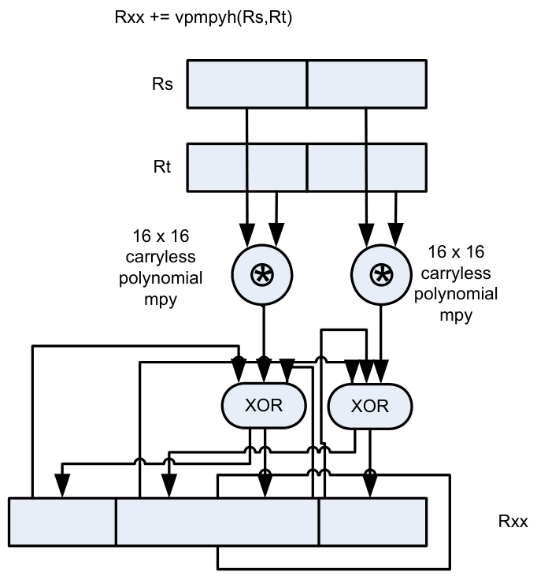

```text
Rxx += vpmpyh(Rs,Rt)
Rs
Rt
16 x 16
carryless 16 x 16
polynomial carryless
mpy  polynomialmpy
XOR XOR
Rxx
```

| Syntax | Behavior |
|---|---|
| `Rdd=vpmpyh(Rs,Rt)` | `x0 = Rs.uh[0];`<br>`x1 = Rs.uh[1];`<br>`y0 = Rt.uh[0];`<br>`y1 = Rt.uh[1];`<br>`prod0 = prod1 = 0;`<br>`for(i=0; i < 16; i++) {`<br>`if((y0 >> i) & 1) prod0 ^= (x0 << i);`<br>`if((y1 >> i) & 1) prod1 ^= (x1 << i);`<br>`}`<br>`Rdd.h[0]=prod0.uh[0];`<br>`Rdd.h[1]=prod1.uh[0];`<br>`Rdd.h[2]=prod0.uh[1];`<br>`Rdd.h[3]=prod1.uh[1];` |
| `Rxx^=vpmpyh(Rs,Rt)` | `x0 = Rs.uh[0];`<br>`x1 = Rs.uh[1];`<br>`y0 = Rt.uh[0];`<br>`y1 = Rt.uh[1];`<br>`prod0 = prod1 = 0;`<br>`for(i=0; i < 16; i++) {`<br>`if((y0 >> i) & 1) prod0 ^= (x0 << i);`<br>`if((y1 >> i) & 1) prod1 ^= (x1 << i);`<br>`}`<br>`Rxx.h[0]=Rxx.uh[0] ^ prod0.uh[0];`<br>`Rxx.h[1]=Rxx.uh[1] ^ prod1.uh[0];`<br>`Rxx.h[2]=Rxx.uh[2] ^ prod0.uh[1];`<br>`Rxx.h[3]=Rxx.uh[3] ^ prod1.uh[1];` |

##### Class: XTYPE (slots 2,3)

##### Intrinsics

|  |  |
|---|---|
| `Rdd=vpmpyh(Rs,Rt)` | `Word64 Q6_P_vpmpyh_RR(Word32 Rs, Word32 Rt)` |
| `Rxx^=vpmpyh(Rs,Rt)` | `Word64 Q6_P_vpmpyhxacc_RR(Word64 Rxx, Word32 Rs, Word32 Rt)` |

##### Encoding

| 31 | 30 | 29 | 28 | 27 | 26 | 25 | 24 | 23 | 22 | 21 | 20 | 19 | 18 | 17 | 16 | 15 | 14 | 13 | 12 | 11 | 10 | 9 | 8 | 7 | 6 | 5 | 4 | 3 | 2 | 1 | 0 |  |
|---|---|---|---|---|---|---|---|---|---|---|---|---|---|---|---|---|---|---|---|---|---|---|---|---|---|---|---|---|---|---|---|---|
| ICLASS | ICLASS | ICLASS | ICLASS | RegType | RegType | RegType | RegType | MajOp | MajOp | MajOp | s5 | s5 | s5 | s5 | s5 | Parse | Parse |  | t5 | t5 | t5 | t5 | t5 | MinOp | MinOp | MinOp | d5 | d5 | d5 | d5 | d5 |  |
| 1 | 1 | 1 | 0 | 0 | 1 | 0 | 1 | 1 | 1 | 0 | s | s | s | s | s | P | P | 0 | t | t | t | t | t | 1 | 1 | 1 | d | d | d | d | d | Rdd=vpmpyh(Rs,Rt) |
| ICLASS | ICLASS | ICLASS | ICLASS | RegType | RegType | RegType | RegType | MajOp | MajOp | MajOp | s5 | s5 | s5 | s5 | s5 | Parse | Parse |  | t5 | t5 | t5 | t5 | t5 | MinOp | MinOp | MinOp | x5 | x5 | x5 | x5 | x5 |  |
| 1 | 1 | 1 | 0 | 0 | 1 | 1 | 1 | 1 | 0 | 1 | s | s | s | s | s | P | P | 0 | t | t | t | t | t | 1 | 1 | 1 | x | x | x | x | x | Rxx^=vpmpyh(Rs,Rt) |

| Field name | Description |
|---|---|
| `ICLASS` | Instruction class |
| `MajOp` | Major opcode |
| `MinOp` | Minor opcode |
| `RegType` | Register type |
| `Parse` | Packet/loop parse bits |
| `d5` | Field to encode register d |
| `s5` | Field to encode register s |
| `t5` | Field to encode register t |
| `x5` | Field to encode register x |

### 11.10.6 XTYPE PERM

The XTYPE PERM instruction subclass includes instructions that perform permutations.

#### CABAC decode bin

This is a special-purpose instruction to support H.264 Context Adaptive Binary Arithmetic Coding (CABAC).

| Syntax | Behavior |
|---|---|
| `Rdd=decbin(Rss,Rtt)` | `state = Rtt.w[1][5:0];`<br>`valMPS = Rtt.w[1][8:8];`<br>`bitpos = Rtt.w[0][4:0];`<br>`range = Rss.w[0];`<br>`offset = Rss.w[1];`<br>`range <<= bitpos;`<br>`offset <<= bitpos;`<br>`rLPS = rLPS_table_64x4[state][ (range `<br>`>>29)&3];`<br>`rLPS = rLPS << 23;`<br>`rMPS= (range&0xff800000) - rLPS;`<br>`if (offset < rMPS) {`<br>`Rdd = AC_next_state_MPS_64[state];`<br>`Rdd[8:8]=valMPS;`<br>`Rdd[31:23]=(rMPS>>23);`<br>`Rdd.w[1]=offset;`<br>`P0=valMPS;`<br>`} else {`<br>`Rdd = AC_next_state_LPS_64[state];`<br>`Rdd[8:8]=((!state)?(1-`<br>`valMPS):(valMPS));`<br>`Rdd[31:23]=(rLPS>>23);`<br>`Rdd.w[1]=(offset-rMPS);`<br>`P0=(valMPS^1);`<br>`}` |

##### Class: XTYPE (slots 2,3)

##### Notes

- The predicate generated by this instruction cannot be used as a .new predicate, nor can it be automatically ANDed with another predicate.

##### Encoding

| 31 | 30 | 29 | 28 | 27 | 26 | 25 | 24 | 23 | 22 | 21 | 20 | 19 | 18 | 17 | 16 | 15 | 14 | 13 | 12 | 11 | 10 | 9 | 8 | 7 | 6 | 5 | 4 | 3 | 2 | 1 | 0 |  |
|---|---|---|---|---|---|---|---|---|---|---|---|---|---|---|---|---|---|---|---|---|---|---|---|---|---|---|---|---|---|---|---|---|
| ICLASS | ICLASS | ICLASS | ICLASS | RegType | RegType | RegType | RegType | Maj | Maj |  | s5 | s5 | s5 | s5 | s5 | Parse | Parse |  | t5 | t5 | t5 | t5 | t5 | Min | Min |  | d5 | d5 | d5 | d5 | d5 |  |
| 1 | 1 | 0 | 0 | 0 | 0 | 0 | 1 | 1 | 1 | - | s | s | s | s | s | P | P | - | t | t | t | t | t | 1 | 1 | - | d | d | d | d | d | Rdd=decbin(Rss,Rtt) |

| Field name | Description |
|---|---|
| `ICLASS` | Instruction class |
| `Parse` | Packet/loop parse bits |
| `d5` | Field to encode register d |
| Field name | Description |
| `s5` | Field to encode register s |
| `t5` | Field to encode register t |
| `Maj` | Major opcode |
| `Min` | Minor opcode |
| `RegType` | Register type |

#### Saturate

Saturate a single scalar value.

The sath instruction saturates a signed 32-bit number to a signed 16-bit number, which is sign-extended back to 32 bits and placed in the destination register. The minimum negative value of the result is 0xffff8000 and the maximum positive value is 0x00007fff.

The satuh instruction saturates a signed 32-bit number to an unsigned 16-bit number, which is zero-extended back to 32 bits and placed in the destination register. The minimum value of the result is 0 and the maximum value is 0x0000ffff.

The satb instruction saturates a signed 32-bit number to an signed 8-bit number, which is sign-extended back to 32 bits and placed in the destination register. The minimum value of the result is 0xffffff80 and the maximum value is 0x0000007f.

The satub instruction saturates a signed 32-bit number to an unsigned 8-bit number, which is zero-extended back to 32 bits and placed in the destination register. The minimum value of the result is 0 and the maximum value is 0x000000ff.

| Syntax | Behavior |
|---|---|
| `Rd=sat(Rss)` | `Rd = sat₃₂(Rss);` |
| `Rd=satb(Rs)` | `Rd = sat₈(Rs);` |
| `Rd=sath(Rs)` | `Rd = sat₁₆(Rs);` |
| `Rd=satub(Rs)` | `Rd = usat₈(Rs);` |
| `Rd=satuh(Rs)` | `Rd = usat₁₆(Rs);` |

##### Class: XTYPE (slots 2,3)

##### Notes

- If saturation occurs during execution of this instruction (a result is clamped to either maximum or minimum values), the OVF bit in the status register is set. OVF remains set until explicitly cleared by a transfer to the status register.

##### Intrinsics

|  |  |
|---|---|
| `Rd=sat(Rss)` | `Word32 Q6_R_sat_P(Word64 Rss)` |
| `Rd=satb(Rs)` | `Word32 Q6_R_satb_R(Word32 Rs)` |
| `Rd=sath(Rs)` | `Word32 Q6_R_sath_R(Word32 Rs)` |
| `Rd=satub(Rs)` | `Word32 Q6_R_satub_R(Word32 Rs)` |
| `Rd=satuh(Rs)` | `Word32 Q6_R_satuh_R(Word32 Rs)` |

##### Encoding

| 31 | 30 | 29 | 28 | 27 | 26 | 25 | 24 | 23 | 22 | 21 | 20 | 19 | 18 | 17 | 16 | 15 | 14 | 13 | 12 | 11 | 10 | 9 | 8 | 7 | 6 | 5 | 4 | 3 | 2 | 1 | 0 |  |
|---|---|---|---|---|---|---|---|---|---|---|---|---|---|---|---|---|---|---|---|---|---|---|---|---|---|---|---|---|---|---|---|---|
| ICLASS | ICLASS | ICLASS | ICLASS | RegType | RegType | RegType | RegType | MajOp | MajOp |  | s5 | s5 | s5 | s5 | s5 | Parse | Parse |  |  |  |  |  |  | MinOp | MinOp | MinOp | d5 | d5 | d5 | d5 | d5 |  |
| 1 | 0 | 0 | 0 | 1 | 0 | 0 | 0 | 1 | 1 | 0 | s | s | s | s | s | P | P | - | - | - | - | - | - | 0 | 0 | 0 | d | d | d | d | d | Rd=sat(Rss) |
| 1 | 0 | 0 | 0 | 1 | 1 | 0 | 0 | 1 | 1 | 0 | s | s | s | s | s | P | P | - | - | - | - | - | - | 1 | 0 | 0 | d | d | d | d | d | Rd=sath(Rs) |
| 1 | 0 | 0 | 0 | 1 | 1 | 0 | 0 | 1 | 1 | 0 | s | s | s | s | s | P | P | - | - | - | - | - | - | 1 | 0 | 1 | d | d | d | d | d | Rd=satuh(Rs) |
| 1 | 0 | 0 | 0 | 1 | 1 | 0 | 0 | 1 | 1 | 0 | s | s | s | s | s | P | P | - | - | - | - | - | - | 1 | 1 | 0 | d | d | d | d | d | Rd=satub(Rs) |
| 1 | 0 | 0 | 0 | 1 | 1 | 0 | 0 | 1 | 1 | 0 | s | s | s | s | s | P | P | - | - | - | - | - | - | 1 | 1 | 1 | d | d | d | d | d | Rd=satb(Rs) |

| Field name | Description |
|---|---|
| `ICLASS` | Instruction class |
| `Parse` | Packet/loop parse bits |
| `d5` | Field to encode register d |
| `s5` | Field to encode register s |
| `MajOp` | Major opcode |
| `MinOp` | Minor opcode |
| `RegType` | Register type |

#### Swizzle bytes

Swizzle the bytes of a word. This instruction is useful in converting between little and big endian formats.

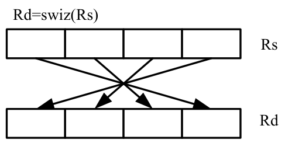

```text
Rd=swiz(Rs)
Rs
Rd
```

| Syntax | Behavior |
|---|---|
| `Rd=swiz(Rs)` | `Rd.b[0]=Rs.b[3];`<br>`Rd.b[1]=Rs.b[2];`<br>`Rd.b[2]=Rs.b[1];`<br>`Rd.b[3]=Rs.b[0];` |

##### Class: XTYPE (slots 2,3)

##### Intrinsics

```
Rd=swiz(Rs)Word32 Q6_R_swiz_R(Word32 Rs)
```

##### Encoding

| 31 | 30 | 29 | 28 | 27 | 26 | 25 | 24 | 23 | 22 | 21 | 20 | 19 | 18 | 17 | 16 | 15 | 14 | 13 | 12 | 11 | 10 | 9 | 8 | 7 | 6 | 5 | 4 | 3 | 2 | 1 | 0 |  |
|---|---|---|---|---|---|---|---|---|---|---|---|---|---|---|---|---|---|---|---|---|---|---|---|---|---|---|---|---|---|---|---|---|
| ICLASS | ICLASS | ICLASS | ICLASS | RegType | RegType | RegType | RegType | MajOp | MajOp |  | s5 | s5 | s5 | s5 | s5 | Parse | Parse |  |  |  |  |  |  | MinOp | MinOp | MinOp | d5 | d5 | d5 | d5 | d5 |  |
| 1 | 0 | 0 | 0 | 1 | 1 | 0 | 0 | 1 | 0 | 0 | s | s | s | s | s | P | P | - | - | - | - | - | - | 1 | 1 | 1 | d | d | d | d | d | Rd=swiz(Rs) |

| Field name | Description |
|---|---|
| `ICLASS` | Instruction class |
| `Parse` | Packet/loop parse bits |
| `d5` | Field to encode register d |
| `s5` | Field to encode register s |
| `MajOp` | Major opcode |
| `MinOp` | Minor opcode |
| `RegType` | Register type |

#### Vector align

Align a vector. Use the immediate amount, or the least significant three bits of a predicate register as the number of bytes to align. Shift the Rss register pair right by this number of bytes. Fill the vacated positions with the least significant elements from Rtt.

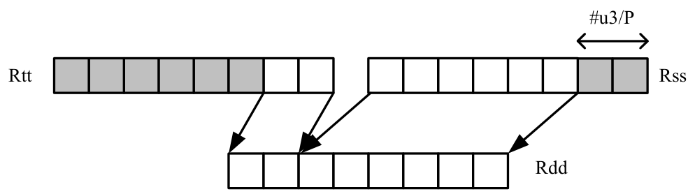

```text
#u3/P
Rtt Rss
Rdd
```

| Syntax | Behavior |
|---|---|
| `Rdd=valignb(Rtt,Rss,#u3)` | `Rdd = (Rss >>> #u*8)\|(Rtt << ((8-#u)*8));` |
| `Rdd=valignb(Rtt,Rss,Pu)` | `PREDUSE_TIMING;`<br>`Rdd = Rss >>> (Pu&0x7)*8\|(Rtt << (8-(Pu&0x7))*8);` |

##### Class: XTYPE (slots 2,3)

##### Intrinsics

```
Rdd=valignb(Rtt,Rss,#u3)Word64 Q6_P_valignb_PPI(Word64 Rtt, Word64 Rss, Word32
                         Iu3)
Rdd=valignb(Rtt,Rss,Pu)Word64 Q6_P_valignb_PPp(Word64 Rtt, Word64 Rss, Byte
                         Pu)
```

##### Encoding

| 31 | 30 | 29 | 28 | 27 | 26 | 25 | 24 | 23 | 22 | 21 | 20 | 19 | 18 | 17 | 16 | 15 | 14 | 13 | 12 | 11 | 10 | 9 | 8 | 7 | 6 | 5 | 4 | 3 | 2 | 1 | 0 |  |
|---|---|---|---|---|---|---|---|---|---|---|---|---|---|---|---|---|---|---|---|---|---|---|---|---|---|---|---|---|---|---|---|---|
| ICLASS | ICLASS | ICLASS | ICLASS | RegType | RegType | RegType | RegType | Maj | Maj |  | s5 | s5 | s5 | s5 | s5 | Parse | Parse |  | t5 | t5 | t5 | t5 | t5 | Min | Min |  | d5 | d5 | d5 | d5 | d5 |  |
| 1 | 1 | 0 | 0 | 0 | 0 | 0 | 0 | 0 | - | - | s | s | s | s | s | P | P | - | t | t | t | t | t | i | i | i | d | d | d | d | d | Rdd=valignb(Rtt,Rss,#u3) |
| ICLASS | ICLASS | ICLASS | ICLASS | RegType | RegType | RegType | RegType | Maj | Maj |  | s5 | s5 | s5 | s5 | s5 | Parse | Parse |  | t5 | t5 | t5 | t5 | t5 |  | u2 | u2 | d5 | d5 | d5 | d5 | d5 |  |
| 1 | 1 | 0 | 0 | 0 | 0 | 1 | 0 | 0 | - | - | s | s | s | s | s | P | P | - | t | t | t | t | t | - | u | u | d | d | d | d | d | Rdd=valignb(Rtt,Rss,Pu) |

| Field name | Description |
|---|---|
| `ICLASS` | Instruction class |
| `Parse` | Packet/loop parse bits |
| `d5` | Field to encode register d |
| `s5` | Field to encode register s |
| `t5` | Field to encode register t |
| `u2` | Field to encode register u |
| Field name | Description |
| `Maj` | Major opcode |
| `Min` | Minor opcode |
| `RegType` | Register type |

#### Vector round and pack

Add the constant 0x00008000 to each word in the 64-bit source vector Rss. Optionally saturate this addition to 32 bits. Pack the high halfwords of the result into the corresponding halfword of the 32-bit destination register.

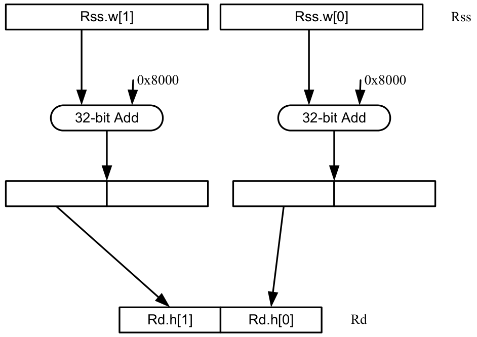

```text
Rss.w[1] Rss.w[0] Rss
0x8000 0x8000
32-bit Add 32-bit Add
Rd.h[1] Rd.h[0] Rd
```

| Syntax | Behavior |
|---|---|
| `Rd=vrndwh(Rss)` | `for (i=0;i<2;i++) {`<br>`Rd.h[i]=(Rss.w[i]+0x08000).h[1];`<br>`}` |
| `Rd=vrndwh(Rss):sat` | `for (i=0;i<2;i++) {`<br>`Rd.h[i]=sat₃₂(Rss.w[i]+0x08000).h[1];`<br>`}` |

##### Class: XTYPE (slots 2,3)

##### Notes

- If saturation occurs during execution of this instruction (a result is clamped to either maximum or minimum values), the OVF bit in the status register is set. OVF remains set until explicitly cleared by a transfer to the status register.

##### Intrinsics

|  |  |
|---|---|
| `Rd=vrndwh(Rss)` | `Word32 Q6_R_vrndwh_P(Word64 Rss)` |
| `Rd=vrndwh(Rss):sat` | `Word32 Q6_R_vrndwh_P_sat(Word64 Rss)` |

##### Encoding

| 31 | 30 | 29 | 28 | 27 | 26 | 25 | 24 | 23 | 22 | 21 | 20 | 19 | 18 | 17 | 16 | 15 | 14 | 13 | 12 | 11 | 10 | 9 | 8 | 7 | 6 | 5 | 4 | 3 | 2 | 1 | 0 |  |
|---|---|---|---|---|---|---|---|---|---|---|---|---|---|---|---|---|---|---|---|---|---|---|---|---|---|---|---|---|---|---|---|---|
| ICLASS | ICLASS | ICLASS | ICLASS | RegType | RegType | RegType | RegType | MajOp | MajOp |  | s5 | s5 | s5 | s5 | s5 | Parse | Parse |  |  |  |  |  |  | MinOp | MinOp | MinOp | d5 | d5 | d5 | d5 | d5 |  |
| 1 | 0 | 0 | 0 | 1 | 0 | 0 | 0 | 1 | 0 | 0 | s | s | s | s | s | P | P | - | - | - | - | - | - | 1 | 0 | 0 | d | d | d | d | d | Rd=vrndwh(Rss) |
| 1 | 0 | 0 | 0 | 1 | 0 | 0 | 0 | 1 | 0 | 0 | s | s | s | s | s | P | P | - | - | - | - | - | - | 1 | 1 | 0 | d | d | d | d | d | Rd=vrndwh(Rss):sat |

| Field name | Description |
|---|---|
| `ICLASS` | Instruction class |
| `Parse` | Packet/loop parse bits |
| `d5` | Field to encode register d |
| `s5` | Field to encode register s |
| `MajOp` | Major opcode |
| `MinOp` | Minor opcode |
| `RegType` | Register type |

#### Vector saturate and pack

For each element in the vector, saturate the value to the next smaller size.

The vsathub instruction saturates signed halfwords to unsigned bytes,

The vsathb instruction saturates signed halfwords to signed bytes.

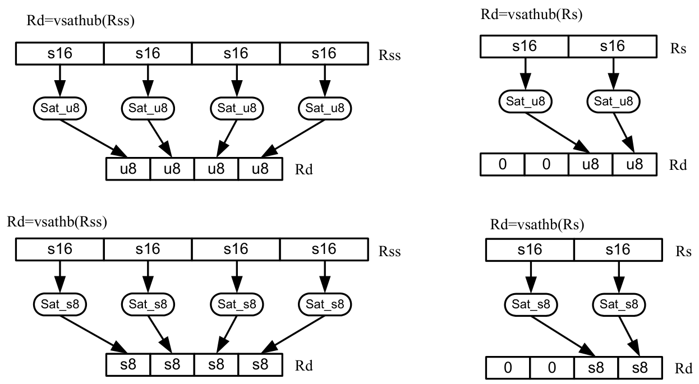

```text
Rd=vsathub(Rs)
Rd=vsathub(Rss)
s16 s16 Rs
s16 s16 s16 s16 Rss
Sat_u8 Sat_u8
Sat_u8 Sat_u8 Sat_u8 Sat_u8
u8 u8 u8 u8 Rd 0 0 u8 u8 Rd
Rd=vsathb(Rss) Rd=vsathb(Rs)
s16 s16 s16 s16 Rss s16 s16 Rs
Sat_s8 Sat_s8 Sat_s8 Sat_s8 Sat_s8 Sat_s8
s8 s8 s8 s8 Rd 0 0 s8 s8 Rd
```

The vsatwh instruction saturates signed words to signed halfwords.

The vsatwuh instruction saturates signed words to unsigned halfwords. The resulting values are packed together into the destination register Rd.

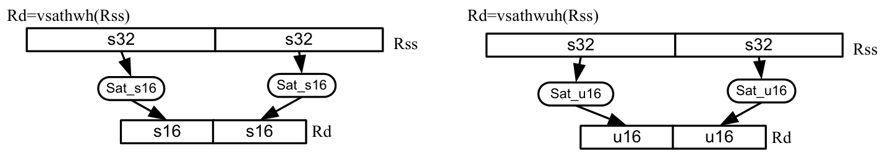

```text
Rd=vsathwh(Rss) Rd=vsathwuh(Rss)
s32 s32 Rss
s32 s32 Rss
Sat_s16 Sat_s16 Sat_u16
Sat_u16
s16 s16 Rd
u16 u16 Rd
```

| Syntax | Behavior |
|---|---|
| `Rd=vsathb(Rs)` | `Rd.b[0]=sat₈(Rs.h[0]);`<br>`Rd.b[1]=sat₈(Rs.h[1]);`<br>`Rd.b[2]=0;`<br>`Rd.b[3]=0;` |
| `Rd=vsathb(Rss)` | `for (i=0;i<4;i++) {`<br>`Rd.b[i]=sat₈(Rss.h[i]);`<br>`}` |
| `Rd=vsathub(Rs)` | `Rd.b[0]=usat₈(Rs.h[0]);`<br>`Rd.b[1]=usat₈(Rs.h[1]);`<br>`Rd.b[2]=0;`<br>`Rd.b[3]=0;` |
| `Rd=vsathub(Rss)` | `for (i=0;i<4;i++) {`<br>`Rd.b[i]=usat₈(Rss.h[i]);`<br>`}` |
| `Rd=vsatwh(Rss)` | `for (i=0;i<2;i++) {`<br>`Rd.h[i]=sat₁₆(Rss.w[i]);`<br>`}` |
| `Rd=vsatwuh(Rss)` | `for (i=0;i<2;i++) {`<br>`Rd.h[i]=usat₁₆(Rss.w[i]);`<br>`}` |

##### Class: XTYPE (slots 2,3)

##### Notes

- If saturation occurs during execution of this instruction (a result is clamped to either maximum or minimum values), the OVF bit in the status register is set. OVF remains set until explicitly cleared by a transfer to the status register.

##### Intrinsics

|  |  |
|---|---|
| `Rd=vsathb(Rs)` | `Word32 Q6_R_vsathb_R(Word32 Rs)` |
| `Rd=vsathb(Rss)` | `Word32 Q6_R_vsathb_P(Word64 Rss)` |
| `Rd=vsathub(Rs)` | `Word32 Q6_R_vsathub_R(Word32 Rs)` |
| `Rd=vsathub(Rss)` | `Word32 Q6_R_vsathub_P(Word64 Rss)` |
| `Rd=vsatwh(Rss)` | `Word32 Q6_R_vsatwh_P(Word64 Rss)` |
| `Rd=vsatwuh(Rss)` | `Word32 Q6_R_vsatwuh_P(Word64 Rss)` |

##### Encoding

| 31 | 30 | 29 | 28 | 27 | 26 | 25 | 24 | 23 | 22 | 21 | 20 | 19 | 18 | 17 | 16 | 15 | 14 | 13 | 12 | 11 | 10 | 9 | 8 | 7 | 6 | 5 | 4 | 3 | 2 | 1 | 0 |  |
|---|---|---|---|---|---|---|---|---|---|---|---|---|---|---|---|---|---|---|---|---|---|---|---|---|---|---|---|---|---|---|---|---|
| ICLASS | ICLASS | ICLASS | ICLASS | RegType | RegType | RegType | RegType | MajOp | MajOp |  | s5 | s5 | s5 | s5 | s5 | Parse | Parse |  |  |  |  |  |  | MinOp | MinOp | MinOp | d5 | d5 | d5 | d5 | d5 |  |
| 1 | 0 | 0 | 0 | 1 | 0 | 0 | 0 | 0 | 0 | 0 | s | s | s | s | s | P | P | - | - | - | - | - | - | 0 | 0 | 0 | d | d | d | d | d | Rd=vsathub(Rss) |
| 1 | 0 | 0 | 0 | 1 | 0 | 0 | 0 | 0 | 0 | 0 | s | s | s | s | s | P | P | - | - | - | - | - | - | 0 | 1 | 0 | d | d | d | d | d | Rd=vsatwh(Rss) |
| 1 | 0 | 0 | 0 | 1 | 0 | 0 | 0 | 0 | 0 | 0 | s | s | s | s | s | P | P | - | - | - | - | - | - | 1 | 0 | 0 | d | d | d | d | d | Rd=vsatwuh(Rss) |
| 1 | 0 | 0 | 0 | 1 | 0 | 0 | 0 | 0 | 0 | 0 | s | s | s | s | s | P | P | - | - | - | - | - | - | 1 | 1 | 0 | d | d | d | d | d | Rd=vsathb(Rss) |
| 1 | 0 | 0 | 0 | 1 | 1 | 0 | 0 | 1 | 0 | - | s | s | s | s | s | P | P | - | - | - | - | - | - | 0 | 0 | - | d | d | d | d | d | Rd=vsathb(Rs) |
| 1 | 0 | 0 | 0 | 1 | 1 | 0 | 0 | 1 | 0 | - | s | s | s | s | s | P | P | - | - | - | - | - | - | 0 | 1 | - | d | d | d | d | d | Rd=vsathub(Rs) |

| Field name | Description |
|---|---|
| `ICLASS` | Instruction class |
| `Parse` | Packet/loop parse bits |
| `d5` | Field to encode register d |
| `s5` | Field to encode register s |
| `MajOp` | Major opcode |
| `MinOp` | Minor opcode |
| `RegType` | Register type |

#### Vector saturate without pack

Saturate each element of source vector Rss to the next smaller size.

The vsathub instruction saturates signed halfwords to unsigned bytes.

The vsatwh instruction saturates signed words to signed halfwords.

The vsatwuh instruction saturates signed words to unsigned halfwords.

The resulting values are placed in destination register Rdd in unpacked form.

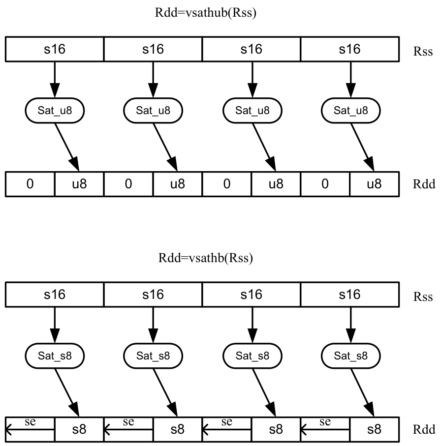

```text
Rdd=vsathub(Rss)
s16 s16 s16 s16 Rss
Sat_u8 Sat_u8 Sat_u8 Sat_u8
0 u8 0 u8 0 u8 0 u8 Rdd
Rdd=vsathb(Rss)
s16 s16 s16 s16 Rss
Sat_s8 Sat_s8 Sat_s8 Sat_s8
se se se se
s8 s8 s8 s8 Rdd
```

| Syntax | Behavior |
|---|---|
| `Rdd=vsathb(Rss)` | `for (i=0;i<4;i++) {`<br>`Rdd.h[i]=sat₈(Rss.h[i]);`<br>`}` |
| `Rdd=vsathub(Rss)` | `for (i=0;i<4;i++) {`<br>`Rdd.h[i]=usat₈(Rss.h[i]);`<br>`}` |
| `Rdd=vsatwh(Rss)` | `for (i=0;i<2;i++) {`<br>`Rdd.w[i]=sat₁₆(Rss.w[i]);`<br>`}` |
| `Rdd=vsatwuh(Rss)` | `for (i=0;i<2;i++) {`<br>`Rdd.w[i]=usat₁₆(Rss.w[i]);`<br>`}` |

##### Class: XTYPE (slots 2,3)

##### Notes

- If saturation occurs during execution of this instruction (a result is clamped to either maximum or minimum values), the OVF bit in the status register is set. OVF remains set until explicitly cleared by a transfer to the status register.

##### Intrinsics

|  |  |
|---|---|
| `Rdd=vsathb(Rss)` | `Word64 Q6_P_vsathb_P(Word64 Rss)` |
| `Rdd=vsathub(Rss)` | `Word64 Q6_P_vsathub_P(Word64 Rss)` |
| `Rdd=vsatwh(Rss)` | `Word64 Q6_P_vsatwh_P(Word64 Rss)` |
| `Rdd=vsatwuh(Rss)` | `Word64 Q6_P_vsatwuh_P(Word64 Rss)` |

##### Encoding

| 31 | 30 | 29 | 28 | 27 | 26 | 25 | 24 | 23 | 22 | 21 | 20 | 19 | 18 | 17 | 16 | 15 | 14 | 13 | 12 | 11 | 10 | 9 | 8 | 7 | 6 | 5 | 4 | 3 | 2 | 1 | 0 |  |
|---|---|---|---|---|---|---|---|---|---|---|---|---|---|---|---|---|---|---|---|---|---|---|---|---|---|---|---|---|---|---|---|---|
| ICLASS | ICLASS | ICLASS | ICLASS | RegType | RegType | RegType | RegType | MajOp | MajOp |  | s5 | s5 | s5 | s5 | s5 | Parse | Parse |  |  |  |  |  |  | MinOp | MinOp | MinOp | d5 | d5 | d5 | d5 | d5 |  |
| 1 | 0 | 0 | 0 | 0 | 0 | 0 | 0 | 0 | 0 | 0 | s | s | s | s | s | P | P | - | - | - | - | - | - | 1 | 0 | 0 | d | d | d | d | d | Rdd=vsathub(Rss) |
| 1 | 0 | 0 | 0 | 0 | 0 | 0 | 0 | 0 | 0 | 0 | s | s | s | s | s | P | P | - | - | - | - | - | - | 1 | 0 | 1 | d | d | d | d | d | Rdd=vsatwuh(Rss) |
| 1 | 0 | 0 | 0 | 0 | 0 | 0 | 0 | 0 | 0 | 0 | s | s | s | s | s | P | P | - | - | - | - | - | - | 1 | 1 | 0 | d | d | d | d | d | Rdd=vsatwh(Rss) |
| 1 | 0 | 0 | 0 | 0 | 0 | 0 | 0 | 0 | 0 | 0 | s | s | s | s | s | P | P | - | - | - | - | - | - | 1 | 1 | 1 | d | d | d | d | d | Rdd=vsathb(Rss) |

| Field name | Description |
|---|---|
| `ICLASS` | Instruction class |
| `Parse` | Packet/loop parse bits |
| `d5` | Field to encode register d |
| `s5` | Field to encode register s |
| Field name | Description |
| `MajOp` | Major opcode |
| `MinOp` | Minor opcode |
| `RegType` | Register type |

#### Vector shuffle

Shuffle odd halfwords (shuffoh) takes the odd halfwords from Rtt and the odd halfwords from Rss and merges them together into vector Rdd. Shuffle even halfwords (shuffeh) performs the same operation on every even halfword in Rss and Rtt. The same operation is available for odd and even bytes.

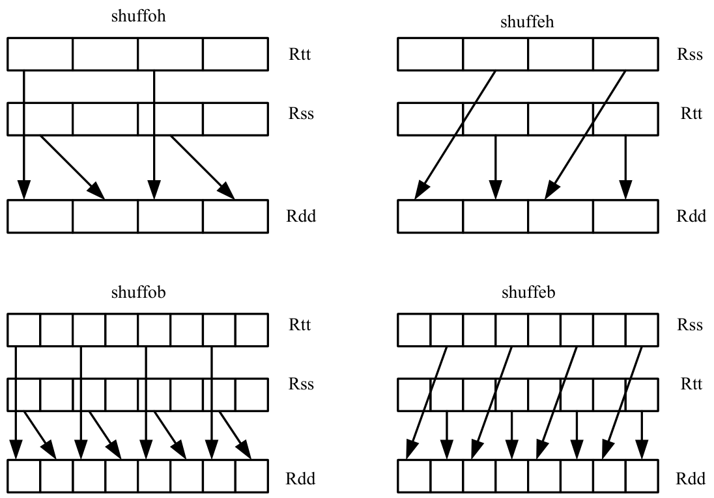

```text
shuffoh
shuffeh
Rtt Rss
Rss Rtt
Rdd Rdd
shuffob shuffeb
Rtt Rss
Rss Rtt
Rdd Rdd
```

| Syntax | Behavior |
|---|---|
| `Rdd=shuffeb(Rss,Rtt)` | `for (i=0;i<4;i++) {`<br>`Rdd.b[i*2]=Rtt.b[i*2];`<br>`Rdd.b[i*2+1]=Rss.b[i*2];`<br>`}` |
| `Rdd=shuffeh(Rss,Rtt)` | `for (i=0;i<2;i++) {`<br>`Rdd.h[i*2]=Rtt.h[i*2];`<br>`Rdd.h[i*2+1]=Rss.h[i*2];`<br>`}` |
| `Rdd=shuffob(Rtt,Rss)` | `for (i=0;i<4;i++) {`<br>`Rdd.b[i*2]=Rss.b[i*2+1];`<br>`Rdd.b[i*2+1]=Rtt.b[i*2+1];`<br>`}` |
| `Rdd=shuffoh(Rtt,Rss)` | `for (i=0;i<2;i++) {`<br>`Rdd.h[i*2]=Rss.h[i*2+1];`<br>`Rdd.h[i*2+1]=Rtt.h[i*2+1];`<br>`}` |

##### Class: XTYPE (slots 2,3)

##### Intrinsics

|  |  |
|---|---|
| `Rdd=shuffeb(Rss,Rtt)` | `Word64 Q6_P_shuffeb_PP(Word64 Rss, Word64 Rtt)` |
| `Rdd=shuffeh(Rss,Rtt)` | `Word64 Q6_P_shuffeh_PP(Word64 Rss, Word64 Rtt)` |
| `Rdd=shuffob(Rtt,Rss)` | `Word64 Q6_P_shuffob_PP(Word64 Rtt, Word64 Rss)` |
| `Rdd=shuffoh(Rtt,Rss)` | `Word64 Q6_P_shuffoh_PP(Word64 Rtt, Word64 Rss)` |

##### Encoding

| 31 | 30 | 29 | 28 | 27 | 26 | 25 | 24 | 23 | 22 | 21 | 20 | 19 | 18 | 17 | 16 | 15 | 14 | 13 | 12 | 11 | 10 | 9 | 8 | 7 | 6 | 5 | 4 | 3 | 2 | 1 | 0 |  |
|---|---|---|---|---|---|---|---|---|---|---|---|---|---|---|---|---|---|---|---|---|---|---|---|---|---|---|---|---|---|---|---|---|
| ICLASS | ICLASS | ICLASS | ICLASS | RegType | RegType | RegType | RegType | Maj | Maj |  | s5 | s5 | s5 | s5 | s5 | Parse | Parse |  | t5 | t5 | t5 | t5 | t5 | Min | Min |  | d5 | d5 | d5 | d5 | d5 |  |
| 1 | 1 | 0 | 0 | 0 | 0 | 0 | 1 | 0 | 0 | - | s | s | s | s | s | P | P | - | t | t | t | t | t | 0 | 1 | - | d | d | d | d | d | Rdd=shuffeb(Rss,Rtt) |
| 1 | 1 | 0 | 0 | 0 | 0 | 0 | 1 | 0 | 0 | - | s | s | s | s | s | P | P | - | t | t | t | t | t | 1 | 0 | - | d | d | d | d | d | Rdd=shuffob(Rtt,Rss) |
| 1 | 1 | 0 | 0 | 0 | 0 | 0 | 1 | 0 | 0 | - | s | s | s | s | s | P | P | - | t | t | t | t | t | 1 | 1 | - | d | d | d | d | d | Rdd=shuffeh(Rss,Rtt) |
| 1 | 1 | 0 | 0 | 0 | 0 | 0 | 1 | 1 | 0 | - | s | s | s | s | s | P | P | - | t | t | t | t | t | 0 | 0 | 0 | d | d | d | d | d | Rdd=shuffoh(Rtt,Rss) |

| Field name | Description |
|---|---|
| `ICLASS` | Instruction class |
| `Parse` | Packet/loop parse bits |
| `d5` | Field to encode register d |
| `s5` | Field to encode register s |
| `t5` | Field to encode register t |
| `Maj` | Major opcode |
| `Min` | Minor opcode |
| `RegType` | Register type |

#### Vector splat bytes

Replicate the low 8-bits from register Rs into each of the four bytes of destination register Rd.

Rd=vsplatb(Rs)

|  |  |  |
|---|---|---|
|  |  |  |

Rs

|  |  |  |
|---|---|---|
|  |  |  |

Rd

| Syntax | Behavior |
|---|---|
| `Rd=vsplatb(Rs)` | `for (i=0;i<4;i++) {`<br>`Rd.b[i]=Rs.b[0];`<br>`}` |
| `Rdd=vsplatb(Rs)` | `for (i=0;i<8;i++) {`<br>`Rdd.b[i]=Rs.b[0];`<br>`}` |

##### Class: XTYPE (slots 2,3)

##### Intrinsics

|  |  |
|---|---|
| `Rd=vsplatb(Rs)` | `Word32 Q6_R_vsplatb_R(Word32 Rs)` |
| `Rdd=vsplatb(Rs)` | `Word64 Q6_P_vsplatb_R(Word32 Rs)` |

##### Encoding

| 31 | 30 | 29 | 28 | 27 | 26 | 25 | 24 | 23 | 22 | 21 | 20 | 19 | 18 | 17 | 16 | 15 | 14 | 13 | 12 | 11 | 10 | 9 | 8 | 7 | 6 | 5 | 4 | 3 | 2 | 1 | 0 |  |
|---|---|---|---|---|---|---|---|---|---|---|---|---|---|---|---|---|---|---|---|---|---|---|---|---|---|---|---|---|---|---|---|---|
| ICLASS | ICLASS | ICLASS | ICLASS | RegType | RegType | RegType | RegType | MajOp | MajOp |  | s5 | s5 | s5 | s5 | s5 | Parse | Parse |  |  |  |  |  |  | MinOp | MinOp | MinOp | d5 | d5 | d5 | d5 | d5 |  |
| 1 | 0 | 0 | 0 | 0 | 1 | 0 | 0 | 0 | 1 | - | s | s | s | s | s | P | P | - | - | - | - | - | - | 1 | 0 | - | d | d | d | d | d | Rdd=vsplatb(Rs) |
| 1 | 0 | 0 | 0 | 1 | 1 | 0 | 0 | 0 | 1 | 0 | s | s | s | s | s | P | P | - | - | - | - | - | - | 1 | 1 | 1 | d | d | d | d | d | Rd=vsplatb(Rs) |

| Field name | Description |
|---|---|
| `ICLASS` | Instruction class |
| `Parse` | Packet/loop parse bits |
| `d5` | Field to encode register d |
| `s5` | Field to encode register s |
| `MajOp` | Major opcode |
| `MinOp` | Minor opcode |
| `RegType` | Register type |

#### Vector splat halfwords

Replicate the low 16-bits from register Rs into each of the four halfwords of destination Rdd.

Rdd=vsplath(Rs)

|  |  |
|---|---|
|  |  |

Rs

|  |  |  |  |
|---|---|---|---|
|  |  |  |  |

Rdd

| Syntax | Behavior |
|---|---|
| `Rdd=vsplath(Rs)` | `for (i=0;i<4;i++) {`<br>`Rdd.h[i]=Rs.h[0];`<br>`}` |

##### Class: XTYPE (slots 2,3)

##### Intrinsics

```
Rdd=vsplath(Rs)Word64 Q6_P_vsplath_R(Word32 Rs)
```

##### Encoding

| 31 | 30 | 29 | 28 | 27 | 26 | 25 | 24 | 23 | 22 | 21 | 20 | 19 | 18 | 17 | 16 | 15 | 14 | 13 | 12 | 11 | 10 | 9 | 8 | 7 | 6 | 5 | 4 | 3 | 2 | 1 | 0 |  |
|---|---|---|---|---|---|---|---|---|---|---|---|---|---|---|---|---|---|---|---|---|---|---|---|---|---|---|---|---|---|---|---|---|
| ICLASS | ICLASS | ICLASS | ICLASS | RegType | RegType | RegType | RegType | MajOp | MajOp |  | s5 | s5 | s5 | s5 | s5 | Parse | Parse |  |  |  |  |  |  | MinOp | MinOp | MinOp | d5 | d5 | d5 | d5 | d5 |  |
| 1 | 0 | 0 | 0 | 0 | 1 | 0 | 0 | 0 | 1 | - | s | s | s | s | s | P | P | - | - | - | - | - | - | 0 | 1 | - | d | d | d | d | d | Rdd=vsplath(Rs) |

| Field name | Description |
|---|---|
| `ICLASS` | Instruction class |
| `Parse` | Packet/loop parse bits |
| `d5` | Field to encode register d |
| `s5` | Field to encode register s |
| `MajOp` | Major opcode |
| `MinOp` | Minor opcode |
| `RegType` | Register type |

#### Vector splice

Concatenate the low (8-N) bytes of vector Rtt with the low N bytes of vector Rss. This instruction is helpful to vectorize unaligned stores.

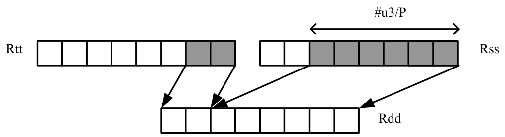

```text
#u3/P
Rtt Rss
Rdd
```

| Syntax | Behavior |
|---|---|
| `Rdd=vspliceb(Rss,Rtt,#u3)` | `Rdd = Rtt << #u*8 \| zxt<sub>#u*8->64</sub>(Rss);` |
| `Rdd=vspliceb(Rss,Rtt,Pu)` | `PREDUSE_TIMING;`<br>`Rdd = Rtt << (Pu&7)*8 \| zxt<sub>(Pu&7)*8->64</sub>(Rss);` |

##### Class: XTYPE (slots 2,3)

##### Intrinsics

|  |  |
|---|---|
| `Rdd=vspliceb(Rss,Rtt,#u3)` | `Word64 Q6_P_vspliceb_PPI(Word64 Rss, Word64 Rtt, Word32 Iu3)` |
| `Rdd=vspliceb(Rss,Rtt,Pu)` | `Word64 Q6_P_vspliceb_PPp(Word64 Rss, Word64 Rtt, Byte Pu)` |

##### Encoding

| 31 | 30 | 29 | 28 | 27 | 26 | 25 | 24 | 23 | 22 | 21 | 20 | 19 | 18 | 17 | 16 | 15 | 14 | 13 | 12 | 11 | 10 | 9 | 8 | 7 | 6 | 5 | 4 | 3 | 2 | 1 | 0 |  |
|---|---|---|---|---|---|---|---|---|---|---|---|---|---|---|---|---|---|---|---|---|---|---|---|---|---|---|---|---|---|---|---|---|
| ICLASS | ICLASS | ICLASS | ICLASS | RegType | RegType | RegType | RegType | Maj | Maj |  | s5 | s5 | s5 | s5 | s5 | Parse | Parse |  | t5 | t5 | t5 | t5 | t5 | Min | Min |  | d5 | d5 | d5 | d5 | d5 |  |
| 1 | 1 | 0 | 0 | 0 | 0 | 0 | 0 | 1 | - | - | s | s | s | s | s | P | P | - | t | t | t | t | t | i | i | i | d | d | d | d | d | Rdd=vspliceb(Rss,Rtt,#u3) |
| ICLASS | ICLASS | ICLASS | ICLASS | RegType | RegType | RegType | RegType | Maj | Maj |  | s5 | s5 | s5 | s5 | s5 | Parse | Parse |  | t5 | t5 | t5 | t5 | t5 |  | u2 | u2 | d5 | d5 | d5 | d5 | d5 |  |
| 1 | 1 | 0 | 0 | 0 | 0 | 1 | 0 | 1 | 0 | 0 | s | s | s | s | s | P | P | - | t | t | t | t | t | - | u | u | d | d | d | d | d | Rdd=vspliceb(Rss,Rtt,Pu) |

| Field name | Description |
|---|---|
| `ICLASS` | Instruction class |
| `Parse` | Packet/loop parse bits |
| `d5` | Field to encode register d |
| `s5` | Field to encode register s |
| `t5` | Field to encode register t |
| `u2` | Field to encode register u |
| Field name | Description |
| `Maj` | Major opcode |
| `Min` | Minor opcode |
| `RegType` | Register type |

#### Vector sign extend

The vsxtbh instruction sign-extends each byte of a single register source to halfwords, and places the result in the destination register pair.

The vsxthw instruction sign-extends each halfword of a single register source to words, and places the result in the destination register pair.

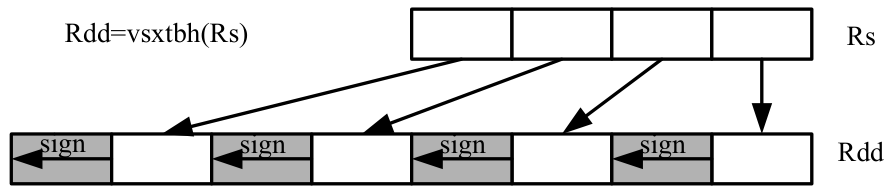

```text
Rdd=vsxtbh(Rs) Rs
sign sign sign sign
Rdd
```

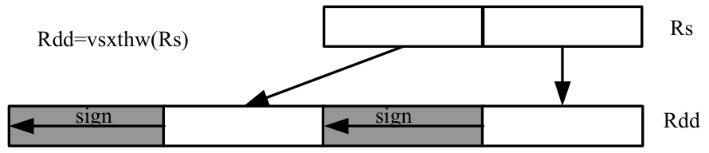

```text
Rs
Rdd=vsxthw(Rs)
sign sign Rdd
```

| Syntax | Behavior |
|---|---|
| `Rdd=vsxtbh(Rs)` | `for (i=0;i<4;i++) {`<br>`Rdd.h[i]=Rs.b[i];`<br>`}` |
| `Rdd=vsxthw(Rs)` | `for (i=0;i<2;i++) {`<br>`Rdd.w[i]=Rs.h[i];`<br>`}` |

##### Class: XTYPE (slots 2,3)

##### Intrinsics

|  |  |
|---|---|
| `Rdd=vsxtbh(Rs)` | `Word64 Q6_P_vsxtbh_R(Word32 Rs)` |
| `Rdd=vsxthw(Rs)` | `Word64 Q6_P_vsxthw_R(Word32 Rs)` |

##### Encoding

| 31 | 30 | 29 | 28 | 27 | 26 | 25 | 24 | 23 | 22 | 21 | 20 | 19 | 18 | 17 | 16 | 15 14 | 13 | 12 | 11 | 10 | 9 | 8 | 7 | 6 | 5 | 4 | 3 | 2 | 1 | 0 |  |
|---|---|---|---|---|---|---|---|---|---|---|---|---|---|---|---|---|---|---|---|---|---|---|---|---|---|---|---|---|---|---|---|
| ICLASS | ICLASS | ICLASS | ICLASS | RegType | RegType | RegType | RegType | MajOp | MajOp |  | s5 | s5 | s5 | s5 | s5 | Parse |  |  |  |  |  |  | MinOp | MinOp | MinOp | d5 | d5 | d5 | d5 | d5 |  |
| 1 | 0 | 0 | 0 | 0 | 1 | 0 | 0 | 0 | 0 | - | s | s | s | s | s | P P | - | - | - | - | - | - | 0 | 0 | - | d | d | d | d | d | Rdd=vsxtbh(Rs) |
| 1 | 0 | 0 | 0 | 0 | 1 | 0 | 0 | 0 | 0 | - | s | s | s | s | s | P P | - | - | - | - | - | - | 1 | 0 | - | d | d | d | d | d | Rdd=vsxthw(Rs) |

| Field name | Description |
|---|---|
| `ICLASS` | Instruction class |
| `Parse` | Packet/loop parse bits |
| `d5` | Field to encode register d |
| Field name | Description |
| `s5` | Field to encode register s |
| `MajOp` | Major opcode |
| `MinOp` | Minor opcode |
| `RegType` | Register type |

#### Vector truncate

In the vtrunehb instruction, for each halfword in a vector, take the even (lower) byte and ignore the other byte. Pack the resulting values into destination register Rd.

The vtrunohb instruction takes each odd byte of the source vector.

The vtrunewh instruction uses two source register pairs, Rss and Rtt. Pack the even (lower) halfwords of Rss in the upper word of Rdd, and pack the lower halfwords of Rtt in the lower word of Rdd.

The vtrunowh instruction performs the same operation as the vtrunewh instruction, but uses the odd (upper) halfwords of the source vectors instead.

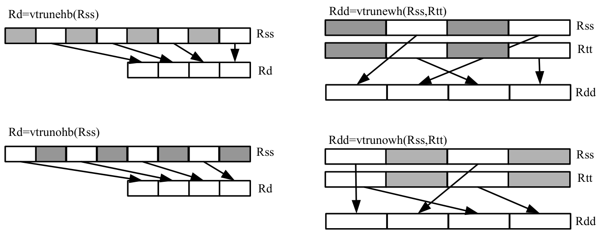

```text
Rd=vtrunehb(Rss) Rdd=vtrunewh(Rss,Rtt)
Rss
Rss
Rtt
Rd
Rdd
Rd=vtrunohb(Rss)
Rdd=vtrunowh(Rss,Rtt)
Rss Rss
Rtt
Rd
Rdd
```

| Syntax | Behavior |
|---|---|
| `Rd=vtrunehb(Rss)` | `for (i=0;i<4;i++) {`<br>`Rd.b[i]=Rss.b[i*2];`<br>`}` |
| `Rd=vtrunohb(Rss)` | `for (i=0;i<4;i++) {`<br>`Rd.b[i]=Rss.b[i*2+1];`<br>`}` |
| `Rdd=vtrunehb(Rss,Rtt)` | `for (i=0;i<4;i++) {`<br>`Rdd.b[i]=Rtt.b[i*2];`<br>`Rdd.b[i+4]=Rss.b[i*2];`<br>`}` |
| `Rdd=vtrunewh(Rss,Rtt)` | `Rdd.h[0]=Rtt.h[0];`<br>`Rdd.h[1]=Rtt.h[2];`<br>`Rdd.h[2]=Rss.h[0];`<br>`Rdd.h[3]=Rss.h[2];` |
| `Rdd=vtrunohb(Rss,Rtt)` | `for (i=0;i<4;i++) {`<br>`Rdd.b[i]=Rtt.b[i*2+1];`<br>`Rdd.b[i+4]=Rss.b[i*2+1];`<br>`}` |
| `Rdd=vtrunowh(Rss,Rtt)` | `Rdd.h[0]=Rtt.h[1];`<br>`Rdd.h[1]=Rtt.h[3];`<br>`Rdd.h[2]=Rss.h[1];`<br>`Rdd.h[3]=Rss.h[3];` |

##### Class: XTYPE (slots 2,3)

##### Intrinsics

|  |  |
|---|---|
| `Rd=vtrunehb(Rss)` | `Word32 Q6_R_vtrunehb_P(Word64 Rss)` |
| `Rd=vtrunohb(Rss)` | `Word32 Q6_R_vtrunohb_P(Word64 Rss)` |
| `Rdd=vtrunehb(Rss,Rtt)` | `Word64 Q6_P_vtrunehb_PP(Word64 Rss, Word64 Rtt)` |
| `Rdd=vtrunewh(Rss,Rtt)` | `Word64 Q6_P_vtrunewh_PP(Word64 Rss, Word64 Rtt)` |
| `Rdd=vtrunohb(Rss,Rtt)` | `Word64 Q6_P_vtrunohb_PP(Word64 Rss, Word64 Rtt)` |
| `Rdd=vtrunowh(Rss,Rtt)` | `Word64 Q6_P_vtrunowh_PP(Word64 Rss, Word64 Rtt)` |

##### Encoding

| 31 | 30 | 29 | 28 | 27 | 26 | 25 | 24 | 23 | 22 | 21 | 20 | 19 | 18 | 17 | 16 | 15 | 14 | 13 | 12 | 11 | 10 | 9 | 8 | 7 | 6 | 5 | 4 | 3 | 2 | 1 | 0 |  |
|---|---|---|---|---|---|---|---|---|---|---|---|---|---|---|---|---|---|---|---|---|---|---|---|---|---|---|---|---|---|---|---|---|
| ICLASS | ICLASS | ICLASS | ICLASS | RegType | RegType | RegType | RegType | MajOp | MajOp |  | s5 | s5 | s5 | s5 | s5 | Parse | Parse |  |  |  |  |  |  | MinOp | MinOp | MinOp | d5 | d5 | d5 | d5 | d5 |  |
| 1 | 0 | 0 | 0 | 1 | 0 | 0 | 0 | 1 | 0 | 0 | s | s | s | s | s | P | P | - | - | - | - | - | - | 0 | 0 | 0 | d | d | d | d | d | Rd=vtrunohb(Rss) |
| 1 | 0 | 0 | 0 | 1 | 0 | 0 | 0 | 1 | 0 | 0 | s | s | s | s | s | P | P | - | - | - | - | - | - | 0 | 1 | 0 | d | d | d | d | d | Rd=vtrunehb(Rss) |
| ICLASS | ICLASS | ICLASS | ICLASS | RegType | RegType | RegType | RegType | Maj | Maj |  | s5 | s5 | s5 | s5 | s5 | Parse | Parse |  | t5 | t5 | t5 | t5 | t5 | Min | Min |  | d5 | d5 | d5 | d5 | d5 |  |
| 1 | 1 | 0 | 0 | 0 | 0 | 0 | 1 | 1 | 0 | - | s | s | s | s | s | P | P | - | t | t | t | t | t | 0 | 1 | 0 | d | d | d | d | d | Rdd=vtrunewh(Rss,Rtt) |
| 1 | 1 | 0 | 0 | 0 | 0 | 0 | 1 | 1 | 0 | - | s | s | s | s | s | P | P | - | t | t | t | t | t | 0 | 1 | 1 | d | d | d | d | d | Rdd=vtrunehb(Rss,Rtt) |
| 1 | 1 | 0 | 0 | 0 | 0 | 0 | 1 | 1 | 0 | - | s | s | s | s | s | P | P | - | t | t | t | t | t | 1 | 0 | 0 | d | d | d | d | d | Rdd=vtrunowh(Rss,Rtt) |
| 1 | 1 | 0 | 0 | 0 | 0 | 0 | 1 | 1 | 0 | - | s | s | s | s | s | P | P | - | t | t | t | t | t | 1 | 0 | 1 | d | d | d | d | d | Rdd=vtrunohb(Rss,Rtt) |

| Field name | Description |
|---|---|
| `ICLASS` | Instruction class |
| `Parse` | Packet/loop parse bits |
| `d5` | Field to encode register d |
| `s5` | Field to encode register s |
| `t5` | Field to encode register t |
| `MajOp` | Major opcode |
| `MinOp` | Minor opcode |
| `Maj` | Major opcode |
| `Min` | Minor opcode |
| `RegType` | Register type |

#### Vector zero extend

The vzxtbh instruction zero-extends each byte of a single register source to halfwords, and places the result in the destination register pair.

The vzxthw instruction zero-extends each halfword of a single register source to words, and places the result in the destination register pair.

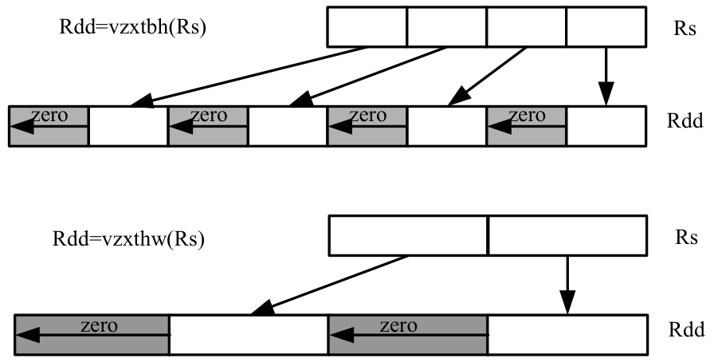

```text
Rdd=vzxtbh(Rs) Rs
zero zero zero zero
Rdd
Rdd=vzxthw(Rs) Rs
zero zero Rdd
```

| Syntax | Behavior |
|---|---|
| `Rdd=vzxtbh(Rs)` | `for (i=0;i<4;i++) {`<br>`Rdd.h[i]=Rs.ub[i];`<br>`}` |
| `Rdd=vzxthw(Rs)` | `for (i=0;i<2;i++) {`<br>`Rdd.w[i]=Rs.uh[i];`<br>`}` |

##### Class: XTYPE (slots 2,3)

##### Intrinsics

|  |  |
|---|---|
| `Rdd=vzxtbh(Rs)` | `Word64 Q6_P_vzxtbh_R(Word32 Rs)` |
| `Rdd=vzxthw(Rs)` | `Word64 Q6_P_vzxthw_R(Word32 Rs)` |

##### Encoding

| 31 | 30 | 29 | 28 | 27 | 26 | 25 | 24 | 23 | 22 | 21 | 20 | 19 | 18 | 17 | 16 | 15 14 | 13 | 12 | 11 | 10 | 9 | 8 | 7 | 6 | 5 | 4 | 3 | 2 | 1 | 0 |  |
|---|---|---|---|---|---|---|---|---|---|---|---|---|---|---|---|---|---|---|---|---|---|---|---|---|---|---|---|---|---|---|---|
| ICLASS | ICLASS | ICLASS | ICLASS | RegType | RegType | RegType | RegType | MajOp | MajOp |  | s5 | s5 | s5 | s5 | s5 | Parse |  |  |  |  |  |  | MinOp | MinOp | MinOp | d5 | d5 | d5 | d5 | d5 |  |
| 1 | 0 | 0 | 0 | 0 | 1 | 0 | 0 | 0 | 0 | - | s | s | s | s | s | P P | - | - | - | - | - | - | 0 | 1 | - | d | d | d | d | d | Rdd=vzxtbh(Rs) |
| 1 | 0 | 0 | 0 | 0 | 1 | 0 | 0 | 0 | 0 | - | s | s | s | s | s | P P | - | - | - | - | - | - | 1 | 1 | - | d | d | d | d | d | Rdd=vzxthw(Rs) |

| Field name | Description |
|---|---|
| `ICLASS` | Instruction class |
| `Parse` | Packet/loop parse bits |
| `d5` | Field to encode register d |
| `s5` | Field to encode register s |
| `MajOp` | Major opcode |
| `MinOp` | Minor opcode |
| `RegType` | Register type |

### 11.10.7 XTYPE PRED

The XTYPE PRED instruction subclass includes instructions that perform miscellaneous operations on predicates, including mask generation, predicate transfers, and the Viterbi pack operation.

#### Bounds check

Determine if Rs falls in the range defined by Rtt.

The user sets Rtt.w0 to the lower bound, and Rtt.w1 to the upper bound.

All bits of the destination predicate are set if the value falls within the range, or all cleared otherwise.

| Syntax | Behavior |
|---|---|
| `Pd=boundscheck(Rs,Rtt)` | `if ("Rs & 1") {`<br>`Assembler mapped to: `<br>`"Pd=boundscheck(Rss,Rtt):raw:hi";`<br>`} else {`<br>`Assembler mapped to: `<br>`"Pd=boundscheck(Rss,Rtt):raw:lo";`<br>`}` |
| `Pd=boundscheck(Rss,Rtt):raw:`<br>`hi` | `src = Rss.uw[1];`<br>`Pd = (src.uw[0] >= Rtt.uw[0]) && (src.uw[0] < `<br>`Rtt.uw[1]) ? 0xff : 0x00;` |
| `Pd=boundscheck(Rss,Rtt):raw:`<br>`lo` | `src = Rss.uw[0];`<br>`Pd = (src.uw[0] >= Rtt.uw[0]) && (src.uw[0] < `<br>`Rtt.uw[1]) ? 0xff : 0x00;` |

##### Class: XTYPE (slots 2,3)

##### Intrinsics

```
Pd=boundscheck(Rs,Rtt)Byte Q6_p_boundscheck_RP(Word32 Rs, Word64
                             Rtt)
```

##### Encoding

| 31 | 30 | 29 | 28 | 27 | 26 | 25 | 24 | 23 | 22 | 21 | 20 | 19 | 18 | 17 | 16 | 15 | 14 | 13 | 12 | 11 | 10 | 9 | 8 | 7 | 6 | 5 | 4 | 3 | 2 | 1 | 0 |  |
|---|---|---|---|---|---|---|---|---|---|---|---|---|---|---|---|---|---|---|---|---|---|---|---|---|---|---|---|---|---|---|---|---|
| ICLASS | ICLASS | ICLASS | ICLASS | RegType | RegType | RegType | RegType |  |  |  | s5 | s5 | s5 | s5 | s5 | Parse | Parse |  | t5 | t5 | t5 | t5 | t5 | MinOp | MinOp | MinOp |  |  |  | d2 | d2 |  |
| 1 | 1 | 0 | 1 | 0 | 0 | 1 | 0 | 0 | - | - | s | s | s | s | s | P | P | 1 | t | t | t | t | t | 1 | 0 | 0 | - | - | - | d | d | Pd=boundscheck(Rss,Rtt):raw:lo |
| 1 | 1 | 0 | 1 | 0 | 0 | 1 | 0 | 0 | - | - | s | s | s | s | s | P | P | 1 | t | t | t | t | t | 1 | 0 | 1 | - | - | - | d | d | Pd=boundscheck(Rss,Rtt):raw:hi |

| Field name | Description |
|---|---|
| `RegType` | Register type |
| `MinOp` | Minor opcode |
| `ICLASS` | Instruction class |
| `Parse` | Packet/loop parse bits |
| Field name | Description |
| `d2` | Field to encode register d |
| `s5` | Field to encode register s |
| `t5` | Field to encode register t |

#### Compare byte

These instructions sign- or zero-extend the low 8 bits of the source registers and perform 32-bit comparisons on the result. When there is an extended 32-bit immediate operand, the full 32 immediate bits are used for the comparison.

| Syntax | Behavior |
|---|---|
| `Pd=cmpb.eq(Rs,#u8)` | `Pd=Rs.ub[0] == #u ? 0xff : 0x00;` |
| `Pd=cmpb.eq(Rs,Rt)` | `Pd=Rs.b[0] == Rt.b[0] ? 0xff : 0x00;` |
| `Pd=cmpb.gt(Rs,#s8)` | `Pd=Rs.b[0] > #s ? 0xff : 0x00;` |
| `Pd=cmpb.gt(Rs,Rt)` | `Pd=Rs.b[0] > Rt.b[0] ? 0xff : 0x00;` |
| `Pd=cmpb.gtu(Rs,#u7)` | `apply_extension(#u);`<br>`Pd=Rs.ub[0] > #u.uw[0] ? 0xff : 0x00;` |
| `Pd=cmpb.gtu(Rs,Rt)` | `Pd=Rs.ub[0] > Rt.ub[0] ? 0xff : 0x00;` |

##### Class: XTYPE (slots 2,3)

##### Intrinsics

|  |  |
|---|---|
| `Pd=cmpb.eq(Rs,#u8)` | `Byte Q6_p_cmpb_eq_RI(Word32 Rs, Word32 Iu8)` |
| `Pd=cmpb.eq(Rs,Rt)` | `Byte Q6_p_cmpb_eq_RR(Word32 Rs, Word32 Rt)` |
| `Pd=cmpb.gt(Rs,#s8)` | `Byte Q6_p_cmpb_gt_RI(Word32 Rs, Word32 Is8)` |
| `Pd=cmpb.gt(Rs,Rt)` | `Byte Q6_p_cmpb_gt_RR(Word32 Rs, Word32 Rt)` |
| `Pd=cmpb.gtu(Rs,#u7)` | `Byte Q6_p_cmpb_gtu_RI(Word32 Rs, Word32 Iu7)` |
| `Pd=cmpb.gtu(Rs,Rt)` | `Byte Q6_p_cmpb_gtu_RR(Word32 Rs, Word32 Rt)` |

##### Encoding

| 31 | 30 | 29 | 28 | 27 | 26 | 25 | 24 | 23 | 22 | 21 | 20 | 19 | 18 | 17 | 16 | 15 | 14 | 13 | 12 | 11 | 10 | 9 | 8 | 7 | 6 | 5 | 4 | 3 | 2 | 1 | 0 |  |
|---|---|---|---|---|---|---|---|---|---|---|---|---|---|---|---|---|---|---|---|---|---|---|---|---|---|---|---|---|---|---|---|---|
| ICLASS | ICLASS | ICLASS | ICLASS | RegType | RegType | RegType | RegType | Maj | Maj |  | s5 | s5 | s5 | s5 | s5 | Parse | Parse |  | t5 | t5 | t5 | t5 | t5 | Min | Min |  |  |  |  | d2 | d2 |  |
| 1 | 1 | 0 | 0 | 0 | 1 | 1 | 1 | 1 | 1 | 0 | s | s | s | s | s | P | P | - | t | t | t | t | t | 0 | 1 | 0 | - | - | - | d | d | Pd=cmpb.gt(Rs,Rt) |
| 1 | 1 | 0 | 0 | 0 | 1 | 1 | 1 | 1 | 1 | 0 | s | s | s | s | s | P | P | - | t | t | t | t | t | 1 | 1 | 0 | - | - | - | d | d | Pd=cmpb.eq(Rs,Rt) |
| 1 | 1 | 0 | 0 | 0 | 1 | 1 | 1 | 1 | 1 | 0 | s | s | s | s | s | P | P | - | t | t | t | t | t | 1 | 1 | 1 | - | - | - | d | d | Pd=cmpb.gtu(Rs,Rt) |
| ICLASS | ICLASS | ICLASS | ICLASS | RegType | RegType | RegType | RegType |  |  |  | s5 | s5 | s5 | s5 | s5 | Parse | Parse |  |  |  |  |  |  |  |  |  |  |  |  | d2 | d2 |  |
| 1 | 1 | 0 | 1 | 1 | 1 | 0 | 1 | - | 0 | 0 | s | s | s | s | s | P | P | - | i | i | i | i | i | i | i | i | 0 | 0 | - | d | d | Pd=cmpb.eq(Rs,#u8) |
| 1 | 1 | 0 | 1 | 1 | 1 | 0 | 1 | - | 0 | 1 | s | s | s | s | s | P | P | - | i | i | i | i | i | i | i | i | 0 | 0 | - | d | d | Pd=cmpb.gt(Rs,#s8) |
| 1 | 1 | 0 | 1 | 1 | 1 | 0 | 1 | - | 1 | 0 | s | s | s | s | s | P | P | - | 0 | i | i | i | i | i | i | i | 0 | 0 | - | d | d | Pd=cmpb.gtu(Rs,#u7) |

| Field name | Description |
|---|---|
| `RegType` | Register type |
| `MajOp` | Major opcode |
| `ICLASS` | Instruction class |
| `Parse` | Packet/loop parse bits |
| `d2` | Field to encode register d |
| `s5` | Field to encode register s |
| Field name | Description |
| `t5` | Field to encode register t |
| `Maj` | Major opcode |
| `Min` | Minor opcode |

#### Compare half

These instructions sign- or zero-extend the low 16 bits of the source registers and perform 32-bit comparisons on the result. When there is an extended 32-bit immediate operand, the full 32 immediate bits are used for the comparison.

| Syntax | Behavior |
|---|---|
| `Pd=cmph.eq(Rs,#s8)` | `apply_extension(#s);`<br>`Pd=Rs.h[0] == #s ? 0xff : 0x00;` |
| `Pd=cmph.eq(Rs,Rt)` | `Pd=Rs.h[0] == Rt.h[0] ? 0xff : 0x00;` |
| `Pd=cmph.gt(Rs,#s8)` | `apply_extension(#s);`<br>`Pd=Rs.h[0] > #s ? 0xff : 0x00;` |
| `Pd=cmph.gt(Rs,Rt)` | `Pd=Rs.h[0] > Rt.h[0] ? 0xff : 0x00;` |
| `Pd=cmph.gtu(Rs,#u7)` | `apply_extension(#u);`<br>`Pd=Rs.uh[0] > #u.uw[0] ? 0xff : 0x00;` |
| `Pd=cmph.gtu(Rs,Rt)` | `Pd=Rs.uh[0] > Rt.uh[0] ? 0xff : 0x00;` |

##### Class: XTYPE (slots 2,3)

##### Intrinsics

|  |  |
|---|---|
| `Pd=cmph.eq(Rs,#s8)` | `Byte Q6_p_cmph_eq_RI(Word32 Rs, Word32 Is8)` |
| `Pd=cmph.eq(Rs,Rt)` | `Byte Q6_p_cmph_eq_RR(Word32 Rs, Word32 Rt)` |
| `Pd=cmph.gt(Rs,#s8)` | `Byte Q6_p_cmph_gt_RI(Word32 Rs, Word32 Is8)` |
| `Pd=cmph.gt(Rs,Rt)` | `Byte Q6_p_cmph_gt_RR(Word32 Rs, Word32 Rt)` |
| `Pd=cmph.gtu(Rs,#u7)` | `Byte Q6_p_cmph_gtu_RI(Word32 Rs, Word32 Iu7)` |
| `Pd=cmph.gtu(Rs,Rt)` | `Byte Q6_p_cmph_gtu_RR(Word32 Rs, Word32 Rt)` |

##### Encoding

| 31 | 30 | 29 | 28 | 27 | 26 | 25 | 24 | 23 | 22 | 21 | 20 | 19 | 18 | 17 | 16 | 15 | 14 | 13 | 12 | 11 | 10 | 9 | 8 | 7 | 6 | 5 | 4 | 3 | 2 | 1 | 0 |  |
|---|---|---|---|---|---|---|---|---|---|---|---|---|---|---|---|---|---|---|---|---|---|---|---|---|---|---|---|---|---|---|---|---|
| ICLASS | ICLASS | ICLASS | ICLASS | RegType | RegType | RegType | RegType | Maj | Maj |  | s5 | s5 | s5 | s5 | s5 | Parse | Parse |  | t5 | t5 | t5 | t5 | t5 | Min | Min |  |  |  |  | d2 | d2 |  |
| 1 | 1 | 0 | 0 | 0 | 1 | 1 | 1 | 1 | 1 | 0 | s | s | s | s | s | P | P | - | t | t | t | t | t | 0 | 1 | 1 | - | - | - | d | d | Pd=cmph.eq(Rs,Rt) |
| 1 | 1 | 0 | 0 | 0 | 1 | 1 | 1 | 1 | 1 | 0 | s | s | s | s | s | P | P | - | t | t | t | t | t | 1 | 0 | 0 | - | - | - | d | d | Pd=cmph.gt(Rs,Rt) |
| 1 | 1 | 0 | 0 | 0 | 1 | 1 | 1 | 1 | 1 | 0 | s | s | s | s | s | P | P | - | t | t | t | t | t | 1 | 0 | 1 | - | - | - | d | d | Pd=cmph.gtu(Rs,Rt) |
| ICLASS | ICLASS | ICLASS | ICLASS | RegType | RegType | RegType | RegType |  |  |  | s5 | s5 | s5 | s5 | s5 | Parse | Parse |  |  |  |  |  |  |  |  |  |  |  |  | d2 | d2 |  |
| 1 | 1 | 0 | 1 | 1 | 1 | 0 | 1 | - | 0 | 0 | s | s | s | s | s | P | P | - | i | i | i | i | i | i | i | i | 0 | 1 | - | d | d | Pd=cmph.eq(Rs,#s8) |
| 1 | 1 | 0 | 1 | 1 | 1 | 0 | 1 | - | 0 | 1 | s | s | s | s | s | P | P | - | i | i | i | i | i | i | i | i | 0 | 1 | - | d | d | Pd=cmph.gt(Rs,#s8) |
| 1 | 1 | 0 | 1 | 1 | 1 | 0 | 1 | - | 1 | 0 | s | s | s | s | s | P | P | - | 0 | i | i | i | i | i | i | i | 0 | 1 | - | d | d | Pd=cmph.gtu(Rs,#u7) |

| Field name | Description |
|---|---|
| `RegType` | Register type |
| `MajOp` | Major opcode |
| `ICLASS` | Instruction class |
| `Parse` | Packet/loop parse bits |
| `d2` | Field to encode register d |
| Field name | Description |
| `s5` | Field to encode register s |
| `t5` | Field to encode register t |
| `Maj` | Major opcode |
| `Min` | Minor opcode |

#### Compare doublewords

Compare two 64-bit register pairs for unsigned greater than, greater than, or equal. The 8-bit predicate register Pd is set to all 1s or all 0s, depending on the result.

| Syntax | Behavior |
|---|---|
| `Pd=cmp.eq(Rss,Rtt)` | `Pd=Rss==Rtt ? 0xff : 0x00;` |
| `Pd=cmp.gt(Rss,Rtt)` | `Pd=Rss>Rtt ? 0xff : 0x00;` |
| `Pd=cmp.gtu(Rss,Rtt)` | `Pd=Rss.u64>Rtt.u64 ? 0xff : 0x00;` |

##### Class: XTYPE (slots 2,3)

##### Intrinsics

|  |  |
|---|---|
| `Pd=cmp.eq(Rss,Rtt)` | `Byte Q6_p_cmp_eq_PP(Word64 Rss, Word64 Rtt)` |
| `Pd=cmp.gt(Rss,Rtt)` | `Byte Q6_p_cmp_gt_PP(Word64 Rss, Word64 Rtt)` |
| `Pd=cmp.gtu(Rss,Rtt)` | `Byte Q6_p_cmp_gtu_PP(Word64 Rss, Word64 Rtt)` |

##### Encoding

| 31 | 30 | 29 | 28 | 27 | 26 | 25 | 24 | 23 | 22 | 21 | 20 | 19 | 18 | 17 | 16 | 15 | 14 | 13 | 12 | 11 | 10 | 9 | 8 | 7 | 6 | 5 | 4 | 3 | 2 | 1 | 0 |  |
|---|---|---|---|---|---|---|---|---|---|---|---|---|---|---|---|---|---|---|---|---|---|---|---|---|---|---|---|---|---|---|---|---|
| ICLASS | ICLASS | ICLASS | ICLASS | RegType | RegType | RegType | RegType |  |  |  | s5 | s5 | s5 | s5 | s5 | Parse | Parse |  | t5 | t5 | t5 | t5 | t5 | MinOp | MinOp | MinOp |  |  |  | d2 | d2 |  |
| 1 | 1 | 0 | 1 | 0 | 0 | 1 | 0 | 1 | 0 | 0 | s | s | s | s | s | P | P | - | t | t | t | t | t | 0 | 0 | 0 | - | - | - | d | d | Pd=cmp.eq(Rss,Rtt) |
| 1 | 1 | 0 | 1 | 0 | 0 | 1 | 0 | 1 | 0 | 0 | s | s | s | s | s | P | P | - | t | t | t | t | t | 0 | 1 | 0 | - | - | - | d | d | Pd=cmp.gt(Rss,Rtt) |
| 1 | 1 | 0 | 1 | 0 | 0 | 1 | 0 | 1 | 0 | 0 | s | s | s | s | s | P | P | - | t | t | t | t | t | 1 | 0 | 0 | - | - | - | d | d | Pd=cmp.gtu(Rss,Rtt) |

| Field name | Description |
|---|---|
| `RegType` | Register type |
| `MinOp` | Minor opcode |
| `ICLASS` | Instruction class |
| `Parse` | Packet/loop parse bits |
| `d2` | Field to encode register d |
| `s5` | Field to encode register s |
| `t5` | Field to encode register t |

#### Compare bit mask

If all the bits in the mask in Rt or a short immediate are set (bitsset) or clear (bitsclear) in Rs, set the Pd to true. Otherwise, set the bits in Pd to false.

| Syntax | Behavior |
|---|---|
| `Pd=[!]bitsclr(Rs,#u6)` | `Pd=(Rs&#u)[!]=0 ? 0xff : 0x00;` |
| `Pd=[!]bitsclr(Rs,Rt)` | `Pd=(Rs&Rt)[!]=0 ? 0xff : 0x00;` |
| `Pd=[!]bitsset(Rs,Rt)` | `Pd=(Rs&Rt)[!]=Rt ? 0xff : 0x00;` |

##### Class: XTYPE (slots 2,3)

##### Intrinsics

|  |  |
|---|---|
| `Pd=!bitsclr(Rs,#u6)` | `Byte Q6_p_not_bitsclr_RI(Word32 Rs, Word32 Iu6)` |
| `Pd=!bitsclr(Rs,Rt)` | `Byte Q6_p_not_bitsclr_RR(Word32 Rs, Word32 Rt)` |
| `Pd=!bitsset(Rs,Rt)` | `Byte Q6_p_not_bitsset_RR(Word32 Rs, Word32 Rt)` |
| `Pd=bitsclr(Rs,#u6)` | `Byte Q6_p_bitsclr_RI(Word32 Rs, Word32 Iu6)` |
| `Pd=bitsclr(Rs,Rt)` | `Byte Q6_p_bitsclr_RR(Word32 Rs, Word32 Rt)` |
| `Pd=bitsset(Rs,Rt)` | `Byte Q6_p_bitsset_RR(Word32 Rs, Word32 Rt)` |

##### Encoding

| 31 | 30 | 29 | 28 | 27 | 26 | 25 | 24 | 23 | 22 | 21 | 20 | 19 | 18 | 17 | 16 | 15 | 14 | 13 | 12 | 11 | 10 | 9 | 8 | 7 | 6 | 5 | 4 | 3 | 2 | 1 | 0 |  |
|---|---|---|---|---|---|---|---|---|---|---|---|---|---|---|---|---|---|---|---|---|---|---|---|---|---|---|---|---|---|---|---|---|
| ICLASS | ICLASS | ICLASS | ICLASS | RegType | RegType | RegType | RegType | MajOp | MajOp |  | s5 | s5 | s5 | s5 | s5 | Parse | Parse |  |  |  |  |  |  |  |  |  |  |  |  | d2 | d2 |  |
| 1 | 0 | 0 | 0 | 0 | 1 | 0 | 1 | 1 | 0 | 0 | s | s | s | s | s | P | P | i | i | i | i | i | i | - | - | - | - | - | - | d | d | Pd=bitsclr(Rs,#u6) |
| 1 | 0 | 0 | 0 | 0 | 1 | 0 | 1 | 1 | 0 | 1 | s | s | s | s | s | P | P | i | i | i | i | i | i | - | - | - | - | - | - | d | d | Pd=!bitsclr(Rs,#u6) |
| ICLASS | ICLASS | ICLASS | ICLASS | RegType | RegType | RegType | RegType | Maj | Maj |  | s5 | s5 | s5 | s5 | s5 | Parse | Parse |  | t5 | t5 | t5 | t5 | t5 |  |  |  |  |  |  | d2 | d2 |  |
| 1 | 1 | 0 | 0 | 0 | 1 | 1 | 1 | 0 | 1 | 0 | s | s | s | s | s | P | P | - | t | t | t | t | t | - | - | - | - | - | - | d | d | Pd=bitsset(Rs,Rt) |
| 1 | 1 | 0 | 0 | 0 | 1 | 1 | 1 | 0 | 1 | 1 | s | s | s | s | s | P | P | - | t | t | t | t | t | - | - | - | - | - | - | d | d | Pd=!bitsset(Rs,Rt) |
| 1 | 1 | 0 | 0 | 0 | 1 | 1 | 1 | 1 | 0 | 0 | s | s | s | s | s | P | P | - | t | t | t | t | t | - | - | - | - | - | - | d | d | Pd=bitsclr(Rs,Rt) |
| 1 | 1 | 0 | 0 | 0 | 1 | 1 | 1 | 1 | 0 | 1 | s | s | s | s | s | P | P | - | t | t | t | t | t | - | - | - | - | - | - | d | d | Pd=!bitsclr(Rs,Rt) |

| Field name | Description |
|---|---|
| `ICLASS` | Instruction class |
| `Parse` | Packet/loop parse bits |
| `d2` | Field to encode register d |
| `s5` | Field to encode register s |
| `t5` | Field to encode register t |
| `MajOp` | Major opcode |
| `Maj` | Major opcode |
| `RegType` | Register type |

#### Mask generate from predicate

For each of the low 8 bits in predicate register Pt, when the bit is set, set the corresponding byte in 64-bit register pair Rdd to 0xff, otherwise, set the corresponding byte to 0x00.

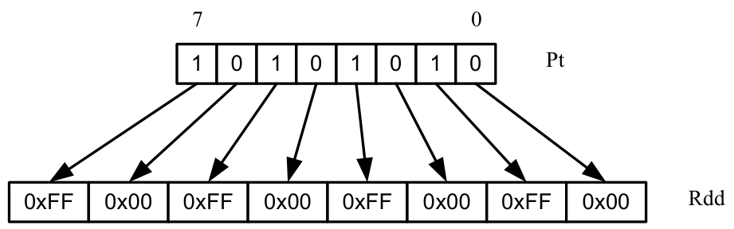

```text
7 0
1 0 1 0 1 0 1 0 Pt
0xFF 0x00 0xFF 0x00 0xFF 0x00 0xFF 0x00 Rdd
```

| Syntax | Behavior |
|---|---|
| `Rdd=mask(Pt)` | `PREDUSE_TIMING;`<br>`for (i = 0; i < 8; i++) {`<br>`Rdd.b[i]=(Pt.i?(0xff):(0x00));`<br>`}` |

##### Class: XTYPE (slots 2,3)

##### Intrinsics

```
Rdd=mask(Pt)Word64 Q6_P_mask_p(Byte Pt)
```

##### Encoding

| 31 | 30 | 29 | 28 | 27 | 26 | 25 | 24 | 23 | 22 | 21 | 20 | 19 | 18 | 17 | 16 | 15 | 14 | 13 | 12 | 11 | 10 | 9 | 8 | 7 | 6 | 5 | 4 | 3 | 2 | 1 | 0 |  |
|---|---|---|---|---|---|---|---|---|---|---|---|---|---|---|---|---|---|---|---|---|---|---|---|---|---|---|---|---|---|---|---|---|
| ICLASS | ICLASS | ICLASS | ICLASS | RegType | RegType | RegType | RegType |  |  |  |  |  |  |  |  | Parse | Parse |  |  |  |  | t2 | t2 |  |  |  | d5 | d5 | d5 | d5 | d5 |  |
| 1 | 0 | 0 | 0 | 0 | 1 | 1 | 0 | - | - | - | - | - | - | - | - | P | P | - | - | - | - | t | t | - | - | - | d | d | d | d | d | Rdd=mask(Pt) |

| Field name | Description |
|---|---|
| `ICLASS` | Instruction class |
| `Parse` | Packet/loop parse bits |
| `d5` | Field to encode register d |
| `t2` | Field to encode register t |
| `RegType` | Register type |

#### Check for TLB match

Determine if the TLB entry in Rss matches the ASID:PPN in Rt.

| Syntax | Behavior |
|---|---|
| `Pd=tlbmatch(Rss,Rt)` | `MASK = 0x07ffffff;`<br>`TLBLO = Rss.uw[0];`<br>`TLBHI = Rss.uw[1];`<br>`SIZE = min(6,count_leading_ones(~reverse_bits(TLBLO)));`<br>`MASK &= (0xffffffff << 2*SIZE);`<br>`Pd = TLBHI.31 && ((TLBHI & MASK) == (Rt & MASK)) ? 0xff `<br>`: 0x00;` |

##### Class: XTYPE (slots 2,3)

##### Notes

- The predicate generated by this instruction cannot be used as a .new predicate, nor can it be automatically ANDed with another predicate.

##### Intrinsics

```
Pd=tlbmatch(Rss,Rt)Byte Q6_p_tlbmatch_PR(Word64 Rss, Word32
                             Rt)
```

##### Encoding

| 31 | 30 | 29 | 28 | 27 | 26 | 25 | 24 | 23 | 22 | 21 | 20 | 19 | 18 | 17 | 16 | 15 | 14 | 13 | 12 | 11 | 10 | 9 | 8 | 7 | 6 | 5 | 4 | 3 | 2 | 1 | 0 |  |
|---|---|---|---|---|---|---|---|---|---|---|---|---|---|---|---|---|---|---|---|---|---|---|---|---|---|---|---|---|---|---|---|---|
| ICLASS | ICLASS | ICLASS | ICLASS | RegType | RegType | RegType | RegType |  |  |  | s5 | s5 | s5 | s5 | s5 | Parse | Parse |  | t5 | t5 | t5 | t5 | t5 | MinOp | MinOp | MinOp |  |  |  | d2 | d2 |  |
| 1 | 1 | 0 | 1 | 0 | 0 | 1 | 0 | 0 | - | - | s | s | s | s | s | P | P | 1 | t | t | t | t | t | 0 | 1 | 1 | - | - | - | d | d | Pd=tlbmatch(Rss,Rt) |

| Field name | Description |
|---|---|
| `RegType` | Register type |
| `MinOp` | Minor opcode |
| `ICLASS` | Instruction class |
| `Parse` | Packet/loop parse bits |
| `d2` | Field to encode register d |
| `s5` | Field to encode register s |
| `t5` | Field to encode register t |

#### Predicate transfer

Pd=Rs transfers a predicate to the eight least-significant bits of a general register and zeros the other bits.

Rd=Ps transfers the eight least-significant bits of a general register to a predicate.

| Syntax | Behavior |
|---|---|
| `Pd=Rs` | `Pd = Rs.ub[0];` |
| `Rd=Ps` | `PREDUSE_TIMING;`<br>`Rd = zxt<sub>8->32</sub>(Ps);` |

##### Class: XTYPE (slots 2,3)

##### Intrinsics

|  |  |
|---|---|
| `Pd=Rs` | `Byte Q6_p_equals_R(Word32 Rs)` |
| `Rd=Ps` | `Word32 Q6_R_equals_p(Byte Ps)` |

##### Encoding

| 31 | 30 | 29 | 28 | 27 | 26 | 25 | 24 | 23 | 22 | 21 | 20 | 19 | 18 | 17 | 16 | 15 | 14 | 13 | 12 | 11 | 10 | 9 | 8 | 7 | 6 | 5 | 4 | 3 | 2 | 1 | 0 |  |
|---|---|---|---|---|---|---|---|---|---|---|---|---|---|---|---|---|---|---|---|---|---|---|---|---|---|---|---|---|---|---|---|---|
| ICLASS | ICLASS | ICLASS | ICLASS | RegType | RegType | RegType | RegType | MajOp | MajOp |  | s5 | s5 | s5 | s5 | s5 | Parse | Parse |  |  |  |  |  |  |  |  |  |  |  |  | d2 | d2 |  |
| 1 | 0 | 0 | 0 | 0 | 1 | 0 | 1 | 0 | 1 | 0 | s | s | s | s | s | P | P | - | - | - | - | - | - | - | - | - | - | - | - | d | d | Pd=Rs |
| ICLASS | ICLASS | ICLASS | ICLASS | RegType | RegType | RegType | RegType | MajOp | MajOp |  |  |  |  | s2 | s2 | Parse | Parse |  |  |  |  |  |  |  |  |  | d5 | d5 | d5 | d5 | d5 |  |
| 1 | 0 | 0 | 0 | 1 | 0 | 0 | 1 | - | 1 | - | - | - | - | s | s | P | P | - | - | - | - | - | - | - | - | - | d | d | d | d | d | Rd=Ps |

| Field name | Description |
|---|---|
| `ICLASS` | Instruction class |
| `Parse` | Packet/loop parse bits |
| `d2` | Field to encode register d |
| `d5` | Field to encode register d |
| `s2` | Field to encode register s |
| `s5` | Field to encode register s |
| `MajOp` | Major opcode |
| `RegType` | Register type |

#### Test bit

Extract a bit from a register. If the bit is true (1), set all the bits of the predicate register destination to 1. If the bit is false (0), set all the bits of the predicate register destination to 0. The bit to test can be indicated using an immediate or register value.

If a register is used to indicate the bit to test, and the value specified is out of range, the predicate result is zero.

| Syntax | Behavior |
|---|---|
| `Pd=[!]tstbit(Rs,#u5)` | `Pd = (Rs & (1<<#u)) == 0 ? 0xff : 0x00;` |
| `Pd=[!]tstbit(Rs,Rt)` | `Pd = (zxt<sub>32->64</sub>(Rs) & (sxt<sub>7->32</sub>(Rt)>0)?(zxt<sub>32->64</sub>(1)<<sxt₇₋`<br>`<sub>>32</sub>(Rt)):(zxt<sub>32->64</sub>(1)>>>sxt<sub>7->32</sub>(Rt))) == 0 ? 0xff : 0x00;` |

##### Class: XTYPE (slots 2,3)

##### Intrinsics

|  |  |
|---|---|
| `Pd=!tstbit(Rs,#u5)` | `Byte Q6_p_not_tstbit_RI(Word32 Rs, Word32 Iu5)` |
| `Pd=!tstbit(Rs,Rt)` | `Byte Q6_p_not_tstbit_RR(Word32 Rs, Word32 Rt)` |
| `Pd=tstbit(Rs,#u5)` | `Byte Q6_p_tstbit_RI(Word32 Rs, Word32 Iu5)` |
| `Pd=tstbit(Rs,Rt)` | `Byte Q6_p_tstbit_RR(Word32 Rs, Word32 Rt)` |

##### Encoding

| 31 | 30 | 29 | 28 | 27 | 26 | 25 | 24 | 23 | 22 | 21 | 20 | 19 | 18 | 17 | 16 | 15 | 14 | 13 | 12 | 11 | 10 | 9 | 8 | 7 | 6 | 5 | 4 | 3 | 2 | 1 | 0 |  |
|---|---|---|---|---|---|---|---|---|---|---|---|---|---|---|---|---|---|---|---|---|---|---|---|---|---|---|---|---|---|---|---|---|
| ICLASS | ICLASS | ICLASS | ICLASS | RegType | RegType | RegType | RegType | MajOp | MajOp |  | s5 | s5 | s5 | s5 | s5 | Parse | Parse |  |  |  |  |  |  |  |  |  |  |  |  | d2 | d2 |  |
| 1 | 0 | 0 | 0 | 0 | 1 | 0 | 1 | 0 | 0 | 0 | s | s | s | s | s | P | P | 0 | i | i | i | i | i | - | - | - | - | - | - | d | d | Pd=tstbit(Rs,#u5) |
| 1 | 0 | 0 | 0 | 0 | 1 | 0 | 1 | 0 | 0 | 1 | s | s | s | s | s | P | P | 0 | i | i | i | i | i | - | - | - | - | - | - | d | d | Pd=!tstbit(Rs,#u5) |
| ICLASS | ICLASS | ICLASS | ICLASS | RegType | RegType | RegType | RegType | Maj | Maj |  | s5 | s5 | s5 | s5 | s5 | Parse | Parse |  | t5 | t5 | t5 | t5 | t5 |  |  |  |  |  |  | d2 | d2 |  |
| 1 | 1 | 0 | 0 | 0 | 1 | 1 | 1 | 0 | 0 | 0 | s | s | s | s | s | P | P | - | t | t | t | t | t | - | - | - | - | - | - | d | d | Pd=tstbit(Rs,Rt) |
| 1 | 1 | 0 | 0 | 0 | 1 | 1 | 1 | 0 | 0 | 1 | s | s | s | s | s | P | P | - | t | t | t | t | t | - | - | - | - | - | - | d | d | Pd=!tstbit(Rs,Rt) |

| Field name | Description |
|---|---|
| `ICLASS` | Instruction class |
| `Parse` | Packet/loop parse bits |
| `d2` | Field to encode register d |
| `s5` | Field to encode register s |
| `t5` | Field to encode register t |
| `MajOp` | Major opcode |
| `Maj` | Major opcode |
| `RegType` | Register type |

#### Vector compare halfwords

Compare each of four 16-bit halfwords in two 64-bit vectors and set the corresponding bits in a predicate destination to '11' if true, '00' if false.

Halfword comparisons are for equal, signed greater than, or unsigned greater than.

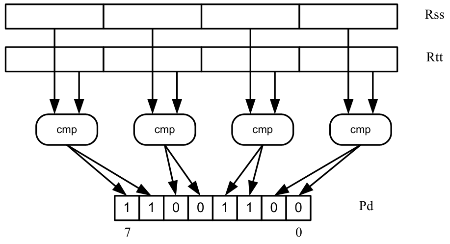

```text
Rss
Rtt
cmp cmp cmp cmp
1 1 0 0 1 1 0 0 Pd
7 0
```

| Syntax | Behavior |
|---|---|
| `Pd=vcmph.eq(Rss,#s8)` | `for (i = 0; i < 4; i++) {`<br>`Pd.i*2 = (Rss.h[i] == #s);`<br>`Pd.i*2+1 = (Rss.h[i] == #s);`<br>`}` |
| `Pd=vcmph.eq(Rss,Rtt)` | `for (i = 0; i < 4; i++) {`<br>`Pd.i*2 = (Rss.h[i] == Rtt.h[i]);`<br>`Pd.i*2+1 = (Rss.h[i] == Rtt.h[i]);`<br>`}` |
| `Pd=vcmph.gt(Rss,#s8)` | `for (i = 0; i < 4; i++) {`<br>`Pd.i*2 = (Rss.h[i] > #s);`<br>`Pd.i*2+1 = (Rss.h[i] > #s);`<br>`}` |
| `Pd=vcmph.gt(Rss,Rtt)` | `for (i = 0; i < 4; i++) {`<br>`Pd.i*2 = (Rss.h[i] > Rtt.h[i]);`<br>`Pd.i*2+1 = (Rss.h[i] > Rtt.h[i]);`<br>`}` |
| `Pd=vcmph.gtu(Rss,#u7)` | `for (i = 0; i < 4; i++) {`<br>`Pd.i*2 = (Rss.uh[i] > #u);`<br>`Pd.i*2+1 = (Rss.uh[i] > #u);`<br>`}` |
| `Pd=vcmph.gtu(Rss,Rtt)` | `for (i = 0; i < 4; i++) {`<br>`Pd.i*2 = (Rss.uh[i] > Rtt.uh[i]);`<br>`Pd.i*2+1 = (Rss.uh[i] > Rtt.uh[i]);`<br>`}` |

##### Class: XTYPE (slots 2,3)

##### Intrinsics

|  |  |
|---|---|
| `Pd=vcmph.eq(Rss,#s8)` | `Byte Q6_p_vcmph_eq_PI(Word64 Rss, Word32 Is8)` |
| `Pd=vcmph.eq(Rss,Rtt)` | `Byte Q6_p_vcmph_eq_PP(Word64 Rss, Word64 Rtt)` |
| `Pd=vcmph.gt(Rss,#s8)` | `Byte Q6_p_vcmph_gt_PI(Word64 Rss, Word32 Is8)` |
| `Pd=vcmph.gt(Rss,Rtt)` | `Byte Q6_p_vcmph_gt_PP(Word64 Rss, Word64 Rtt)` |
| `Pd=vcmph.gtu(Rss,#u7)` | `Byte Q6_p_vcmph_gtu_PI(Word64 Rss, Word32 Iu7)` |
| `Pd=vcmph.gtu(Rss,Rtt)` | `Byte Q6_p_vcmph_gtu_PP(Word64 Rss, Word64 Rtt)` |

##### Encoding

| 31 | 30 | 29 | 28 | 27 | 26 | 25 | 24 | 23 | 22 | 21 | 20 | 19 | 18 | 17 | 16 | 15 | 14 | 13 | 12 | 11 | 10 | 9 | 8 | 7 | 6 | 5 | 4 | 3 | 2 | 1 | 0 |  |
|---|---|---|---|---|---|---|---|---|---|---|---|---|---|---|---|---|---|---|---|---|---|---|---|---|---|---|---|---|---|---|---|---|
| ICLASS | ICLASS | ICLASS | ICLASS | RegType | RegType | RegType | RegType |  |  |  | s5 | s5 | s5 | s5 | s5 | Parse | Parse |  | t5 | t5 | t5 | t5 | t5 | MinOp | MinOp | MinOp |  |  |  | d2 | d2 |  |
| 1 | 1 | 0 | 1 | 0 | 0 | 1 | 0 | 0 | - | - | s | s | s | s | s | P | P | 0 | t | t | t | t | t | 0 | 1 | 1 | - | - | - | d | d | Pd=vcmph.eq(Rss,Rtt) |
| 1 | 1 | 0 | 1 | 0 | 0 | 1 | 0 | 0 | - | - | s | s | s | s | s | P | P | 0 | t | t | t | t | t | 1 | 0 | 0 | - | - | - | d | d | Pd=vcmph.gt(Rss,Rtt) |
| 1 | 1 | 0 | 1 | 0 | 0 | 1 | 0 | 0 | - | - | s | s | s | s | s | P | P | 0 | t | t | t | t | t | 1 | 0 | 1 | - | - | - | d | d | Pd=vcmph.gtu(Rss,Rtt) |
| ICLASS | ICLASS | ICLASS | ICLASS | RegType | RegType | RegType | RegType |  |  |  | s5 | s5 | s5 | s5 | s5 | Parse | Parse |  |  |  |  |  |  |  |  |  |  |  |  | d2 | d2 |  |
| 1 | 1 | 0 | 1 | 1 | 1 | 0 | 0 | 0 | 0 | 0 | s | s | s | s | s | P | P | - | i | i | i | i | i | i | i | i | 0 | 1 | - | d | d | Pd=vcmph.eq(Rss,#s8) |
| 1 | 1 | 0 | 1 | 1 | 1 | 0 | 0 | 0 | 0 | 1 | s | s | s | s | s | P | P | - | i | i | i | i | i | i | i | i | 0 | 1 | - | d | d | Pd=vcmph.gt(Rss,#s8) |
| 1 | 1 | 0 | 1 | 1 | 1 | 0 | 0 | 0 | 1 | 0 | s | s | s | s | s | P | P | - | 0 | i | i | i | i | i | i | i | 0 | 1 | - | d | d | Pd=vcmph.gtu(Rss,#u7) |

| Field name | Description |
|---|---|
| `RegType` | Register type |
| `MajOp` | Major opcode |
| `MinOp` | Minor opcode |
| `ICLASS` | Instruction class |
| `Parse` | Packet/loop parse bits |
| `d2` | Field to encode register d |
| `s5` | Field to encode register s |
| `t5` | Field to encode register t |

#### Vector compare bytes for any match

Compare each byte in two 64-bit source vectors and set a predicate if any of the eight bytes are equal.

This instruction can quickly find the null terminator in a string.

| Syntax | Behavior |
|---|---|
| `Pd=!any8(vcmpb.eq(Rss,Rtt))` | `Pd = 0;`<br>`for (i = 0; i < 8; i++) {`<br>`if (Rss.b[i] == Rtt.b[i]) Pd = 0xff;`<br>`}`<br>`Pd = ~Pd;` |
| `Pd=any8(vcmpb.eq(Rss,Rtt))` | `Pd = 0;`<br>`for (i = 0; i < 8; i++) {`<br>`if (Rss.b[i] == Rtt.b[i]) Pd = 0xff;`<br>`}` |

##### Class: XTYPE (slots 2,3)

##### Intrinsics

|  |  |
|---|---|
| `Pd=!any8(vcmpb.eq(Rss,Rtt))` | `Byte Q6_p_not_any8_vcmpb_eq_PP(Word64 Rss, Word64 Rtt)` |
| `Pd=any8(vcmpb.eq(Rss,Rtt))` | `Byte Q6_p_any8_vcmpb_eq_PP(Word64 Rss, Word64 Rtt)` |

##### Encoding

| 31 | 30 | 29 | 28 | 27 | 26 | 25 | 24 | 23 | 22 | 21 | 20 | 19 | 18 | 17 | 16 | 15 | 14 | 13 | 12 | 11 | 10 | 9 | 8 | 7 | 6 | 5 | 4 | 3 | 2 | 1 | 0 |  |
|---|---|---|---|---|---|---|---|---|---|---|---|---|---|---|---|---|---|---|---|---|---|---|---|---|---|---|---|---|---|---|---|---|
| ICLASS | ICLASS | ICLASS | ICLASS | RegType | RegType | RegType | RegType |  |  |  | s5 | s5 | s5 | s5 | s5 | Parse | Parse |  | t5 | t5 | t5 | t5 | t5 | MinOp | MinOp | MinOp |  |  |  | d2 | d2 |  |
| 1 | 1 | 0 | 1 | 0 | 0 | 1 | 0 | 0 | - | - | s | s | s | s | s | P | P | 1 | t | t | t | t | t | 0 | 0 | 0 | - | - | - | d | d | Pd=any8(vcmpb.eq(Rss,Rtt )) |
| 1 | 1 | 0 | 1 | 0 | 0 | 1 | 0 | 0 | - | - | s | s | s | s | s | P | P | 1 | t | t | t | t | t | 0 | 0 | 1 | - | - | - | d | d | Pd=!any8(vcmpb.eq(Rss,Rt t)) |

| Field name | Description |
|---|---|
| `RegType` | Register type |
| `MinOp` | Minor opcode |
| `ICLASS` | Instruction class |
| `Parse` | Packet/loop parse bits |
| `d2` | Field to encode register d |
| `s5` | Field to encode register s |
| `t5` | Field to encode register t |

#### Vector compare bytes

Compare each of eight bytes in two 64-bit vectors and set the corresponding bit in a predicate destination to 1 if true, 0 if false.

Byte comparisons are for equal or for unsigned greater than.

In the following example, every other comparison is true.

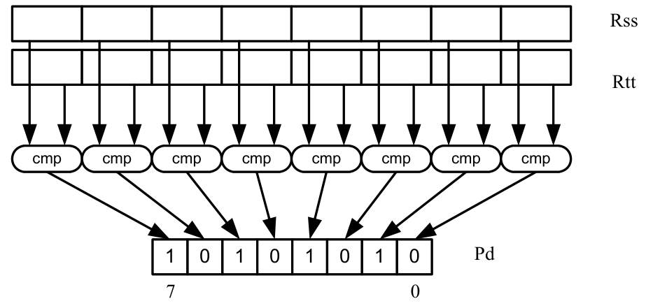

```text
Rss
Rtt
cmp cmp cmp cmp cmp cmp cmp cmp
1 0 1 0 1 0 1 0 Pd
7 0
```

| Syntax | Behavior |
|---|---|
| `Pd=vcmpb.eq(Rss,#u8)` | `for (i = 0; i < 8; i++) {`<br>`Pd.i = (Rss.ub[i] == #u);`<br>`}` |
| `Pd=vcmpb.eq(Rss,Rtt)` | `for (i = 0; i < 8; i++) {`<br>`Pd.i = (Rss.b[i] == Rtt.b[i]);`<br>`}` |
| `Pd=vcmpb.gt(Rss,#s8)` | `for (i = 0; i < 8; i++) {`<br>`Pd.i = (Rss.b[i] > #s);`<br>`}` |
| `Pd=vcmpb.gt(Rss,Rtt)` | `for (i = 0; i < 8; i++) {`<br>`Pd.i = (Rss.b[i] > Rtt.b[i]);`<br>`}` |
| `Pd=vcmpb.gtu(Rss,#u7)` | `for (i = 0; i < 8; i++) {`<br>`Pd.i = (Rss.ub[i] > #u);`<br>`}` |
| `Pd=vcmpb.gtu(Rss,Rtt)` | `for (i = 0; i < 8; i++) {`<br>`Pd.i = (Rss.ub[i] > Rtt.ub[i]);`<br>`}` |

##### Class: XTYPE (slots 2,3)

##### Intrinsics

|  |  |
|---|---|
| `Pd=vcmpb.eq(Rss,#u8)` | `Byte Q6_p_vcmpb_eq_PI(Word64 Rss, Word32 Iu8)` |
| `Pd=vcmpb.eq(Rss,Rtt)` | `Byte Q6_p_vcmpb_eq_PP(Word64 Rss, Word64 Rtt)` |
| `Pd=vcmpb.gt(Rss,#s8)` | `Byte Q6_p_vcmpb_gt_PI(Word64 Rss, Word32 Is8)` |
| `Pd=vcmpb.gt(Rss,Rtt)` | `Byte Q6_p_vcmpb_gt_PP(Word64 Rss, Word64 Rtt)` |
| `Pd=vcmpb.gtu(Rss,#u7)` | `Byte Q6_p_vcmpb_gtu_PI(Word64 Rss, Word32 Iu7)` |
| `Pd=vcmpb.gtu(Rss,Rtt)` | `Byte Q6_p_vcmpb_gtu_PP(Word64 Rss, Word64 Rtt)` |

##### Encoding

| 31 | 30 | 29 | 28 | 27 | 26 | 25 | 24 | 23 | 22 | 21 | 20 | 19 | 18 | 17 | 16 | 15 | 14 | 13 | 12 | 11 | 10 | 9 | 8 | 7 | 6 | 5 | 4 | 3 | 2 | 1 | 0 |  |
|---|---|---|---|---|---|---|---|---|---|---|---|---|---|---|---|---|---|---|---|---|---|---|---|---|---|---|---|---|---|---|---|---|
| ICLASS | ICLASS | ICLASS | ICLASS | RegType | RegType | RegType | RegType |  |  |  | s5 | s5 | s5 | s5 | s5 | Parse | Parse |  | t5 | t5 | t5 | t5 | t5 | MinOp | MinOp | MinOp |  |  |  | d2 | d2 |  |
| 1 | 1 | 0 | 1 | 0 | 0 | 1 | 0 | 0 | - | - | s | s | s | s | s | P | P | 0 | t | t | t | t | t | 1 | 1 | 0 | - | - | - | d | d | Pd=vcmpb.eq(Rss,Rtt) |
| 1 | 1 | 0 | 1 | 0 | 0 | 1 | 0 | 0 | - | - | s | s | s | s | s | P | P | 0 | t | t | t | t | t | 1 | 1 | 1 | - | - | - | d | d | Pd=vcmpb.gtu(Rss,Rtt) |
| 1 | 1 | 0 | 1 | 0 | 0 | 1 | 0 | 0 | - | - | s | s | s | s | s | P | P | 1 | t | t | t | t | t | 0 | 1 | 0 | - | - | - | d | d | Pd=vcmpb.gt(Rss,Rtt) |
| ICLASS | ICLASS | ICLASS | ICLASS | RegType | RegType | RegType | RegType |  |  |  | s5 | s5 | s5 | s5 | s5 | Parse | Parse |  |  |  |  |  |  |  |  |  |  |  |  | d2 | d2 |  |
| 1 | 1 | 0 | 1 | 1 | 1 | 0 | 0 | 0 | 0 | 0 | s | s | s | s | s | P | P | - | i | i | i | i | i | i | i | i | 0 | 0 | - | d | d | Pd=vcmpb.eq(Rss,#u8) |
| 1 | 1 | 0 | 1 | 1 | 1 | 0 | 0 | 0 | 0 | 1 | s | s | s | s | s | P | P | - | i | i | i | i | i | i | i | i | 0 | 0 | - | d | d | Pd=vcmpb.gt(Rss,#s8) |
| 1 | 1 | 0 | 1 | 1 | 1 | 0 | 0 | 0 | 1 | 0 | s | s | s | s | s | P | P | - | 0 | i | i | i | i | i | i | i | 0 | 0 | - | d | d | Pd=vcmpb.gtu(Rss,#u7) |

| Field name | Description |
|---|---|
| `RegType` | Register type |
| `MajOp` | Major opcode |
| `MinOp` | Minor opcode |
| `ICLASS` | Instruction class |
| `Parse` | Packet/loop parse bits |
| `d2` | Field to encode register d |
| `s5` | Field to encode register s |
| `t5` | Field to encode register t |

#### Vector compare words

Compare each of two 32-bit words in two 64-bit vectors and set the corresponding bits in a predicate destination to '1111' if true, '0000' if false.

Word comparisons are for equal, signed greater than, or unsigned greater than.

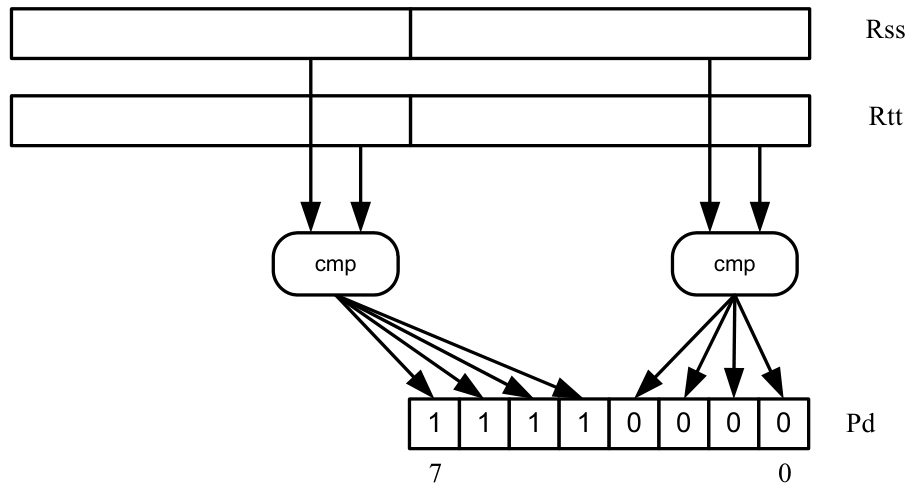

```text
Rss
Rtt
cmp cmp
1 1 1 1 0 0 0 0 Pd
7 0
```

| Syntax | Behavior |
|---|---|
| `Pd=vcmpw.eq(Rss,#s8)` | `Pd[3:0] = (Rss.w[0]==#s);`<br>`Pd[7:4] = (Rss.w[1]==#s);` |
| `Pd=vcmpw.eq(Rss,Rtt)` | `Pd[3:0] = (Rss.w[0]==Rtt.w[0]);`<br>`Pd[7:4] = (Rss.w[1]==Rtt.w[1]);` |
| `Pd=vcmpw.gt(Rss,#s8)` | `Pd[3:0] = (Rss.w[0]>#s);`<br>`Pd[7:4] = (Rss.w[1]>#s);` |
| `Pd=vcmpw.gt(Rss,Rtt)` | `Pd[3:0] = (Rss.w[0]>Rtt.w[0]);`<br>`Pd[7:4] = (Rss.w[1]>Rtt.w[1]);` |
| `Pd=vcmpw.gtu(Rss,#u7)` | `Pd[3:0] = (Rss.uw[0]>#u.uw[0]);`<br>`Pd[7:4] = (Rss.uw[1]>#u.uw[0]);` |
| `Pd=vcmpw.gtu(Rss,Rtt)` | `Pd[3:0] = (Rss.uw[0]>Rtt.uw[0]);`<br>`Pd[7:4] = (Rss.uw[1]>Rtt.uw[1]);` |

##### Class: XTYPE (slots 2,3)

##### Intrinsics

|  |  |
|---|---|
| `Pd=vcmpw.eq(Rss,#s8)` | `Byte Q6_p_vcmpw_eq_PI(Word64 Rss, Word32 Is8)` |
| `Pd=vcmpw.eq(Rss,Rtt)` | `Byte Q6_p_vcmpw_eq_PP(Word64 Rss, Word64 Rtt)` |
| `Pd=vcmpw.gt(Rss,#s8)` | `Byte Q6_p_vcmpw_gt_PI(Word64 Rss, Word32 Is8)` |
| `Pd=vcmpw.gt(Rss,Rtt)` | `Byte Q6_p_vcmpw_gt_PP(Word64 Rss, Word64 Rtt)` |
| `Pd=vcmpw.gtu(Rss,#u7)` | `Byte Q6_p_vcmpw_gtu_PI(Word64 Rss, Word32 Iu7)` |
| `Pd=vcmpw.gtu(Rss,Rtt)` | `Byte Q6_p_vcmpw_gtu_PP(Word64 Rss, Word64 Rtt)` |

##### Encoding

| 31 | 30 | 29 | 28 | 27 | 26 | 25 | 24 | 23 | 22 | 21 | 20 | 19 | 18 | 17 | 16 | 15 | 14 | 13 | 12 | 11 | 10 | 9 | 8 | 7 | 6 | 5 | 4 | 3 | 2 | 1 | 0 |  |
|---|---|---|---|---|---|---|---|---|---|---|---|---|---|---|---|---|---|---|---|---|---|---|---|---|---|---|---|---|---|---|---|---|
| ICLASS | ICLASS | ICLASS | ICLASS | RegType | RegType | RegType | RegType |  |  |  | s5 | s5 | s5 | s5 | s5 | Parse | Parse |  | t5 | t5 | t5 | t5 | t5 | MinOp | MinOp | MinOp |  |  |  | d2 | d2 |  |
| 1 | 1 | 0 | 1 | 0 | 0 | 1 | 0 | 0 | - | - | s | s | s | s | s | P | P | 0 | t | t | t | t | t | 0 | 0 | 0 | - | - | - | d | d | Pd=vcmpw.eq(Rss,Rtt) |
| 1 | 1 | 0 | 1 | 0 | 0 | 1 | 0 | 0 | - | - | s | s | s | s | s | P | P | 0 | t | t | t | t | t | 0 | 0 | 1 | - | - | - | d | d | Pd=vcmpw.gt(Rss,Rtt) |
| 1 | 1 | 0 | 1 | 0 | 0 | 1 | 0 | 0 | - | - | s | s | s | s | s | P | P | 0 | t | t | t | t | t | 0 | 1 | 0 | - | - | - | d | d | Pd=vcmpw.gtu(Rss,Rtt) |
| ICLASS | ICLASS | ICLASS | ICLASS | RegType | RegType | RegType | RegType |  |  |  | s5 | s5 | s5 | s5 | s5 | Parse | Parse |  |  |  |  |  |  |  |  |  |  |  |  | d2 | d2 |  |
| 1 | 1 | 0 | 1 | 1 | 1 | 0 | 0 | 0 | 0 | 0 | s | s | s | s | s | P | P | - | i | i | i | i | i | i | i | i | 1 | 0 | - | d | d | Pd=vcmpw.eq(Rss,#s8) |
| 1 | 1 | 0 | 1 | 1 | 1 | 0 | 0 | 0 | 0 | 1 | s | s | s | s | s | P | P | - | i | i | i | i | i | i | i | i | 1 | 0 | - | d | d | Pd=vcmpw.gt(Rss,#s8) |
| 1 | 1 | 0 | 1 | 1 | 1 | 0 | 0 | 0 | 1 | 0 | s | s | s | s | s | P | P | - | 0 | i | i | i | i | i | i | i | 1 | 0 | - | d | d | Pd=vcmpw.gtu(Rss,#u7) |

| Field name | Description |
|---|---|
| `RegType` | Register type |
| `MajOp` | Major opcode |
| `MinOp` | Minor opcode |
| `ICLASS` | Instruction class |
| `Parse` | Packet/loop parse bits |
| `d2` | Field to encode register d |
| `s5` | Field to encode register s |
| `t5` | Field to encode register t |

#### Viterbi pack even and odd predicate bits

Pack the even and odd bits of two predicate registers into a single destination register. A variant of this instruction is R3:2 |= vitpack(P1,P0), which places the packed predicate bits into the lower eight bits of the register pair, which is preshifted by eight bits.

This instruction is useful in Viterbi decoding. Repeated use of the push version enables a history storage for traceback, purposes.

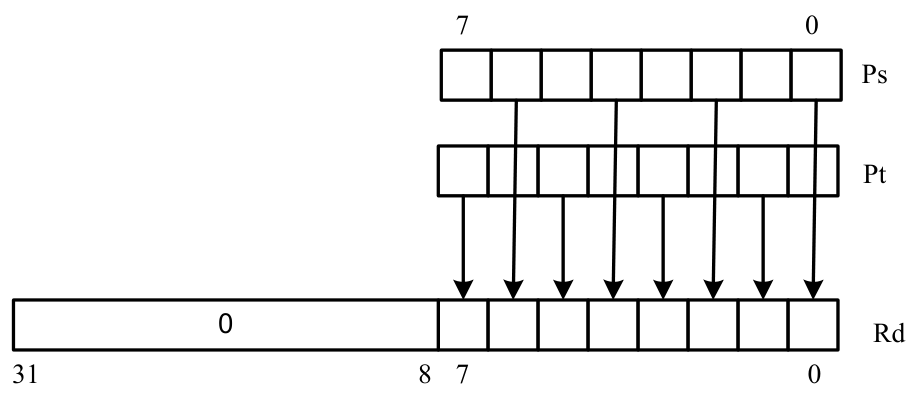

```text
7 0
Ps
Pt
0
Rd
31 8 7 0
```

| Syntax | Behavior |
|---|---|
| `Rd=vitpack(Ps,Pt)` | `PREDUSE_TIMING;`<br>`Rd = (Ps&0x55) \| (Pt&0xAA);` |

##### Class: XTYPE (slots 2,3)

##### Intrinsics

```
Rd=vitpack(Ps,Pt)Word32 Q6_R_vitpack_pp(Byte Ps, Byte Pt)
```

##### Encoding

| 31 | 30 | 29 | 28 | 27 | 26 | 25 | 24 | 23 | 22 | 21 | 20 | 19 | 18 | 17 | 16 15 | 14 | 13 | 12 | 11 | 10 | 9 | 8 | 7 | 6 | 5 | 4 | 3 | 2 | 1 | 0 |  |
|---|---|---|---|---|---|---|---|---|---|---|---|---|---|---|---|---|---|---|---|---|---|---|---|---|---|---|---|---|---|---|---|
| ICLASS | ICLASS | ICLASS | ICLASS | RegType | RegType | RegType | RegType | MajOp | MajOp |  |  |  |  | s2 | s2 | Parse |  |  |  |  | t2 | t2 |  |  |  | d5 | d5 | d5 | d5 | d5 |  |
| 1 | 0 | 0 | 0 | 1 | 0 | 0 | 1 | - | 0 | 0 | - | - | - | s | s P | P | - | - | - | - | t | t | - | - | - | d | d | d | d | d | Rd=vitpack(Ps,Pt) |

| Field name | Description |
|---|---|
| `ICLASS` | Instruction class |
| `Parse` | Packet/loop parse bits |
| `d5` | Field to encode register d |
| `s2` | Field to encode register s |
| `t2` | Field to encode register t |
| `MajOp` | Major opcode |
| `RegType` | Register type |

#### Vector mux

Perform an element-wise byte selection between two vectors.

For each of the low eight bits of predicate register Pu, if the bit is set, the corresponding byte in Rdd is set to the corresponding byte from Rss. Otherwise, set the byte in Rdd to the byte from Rtt.

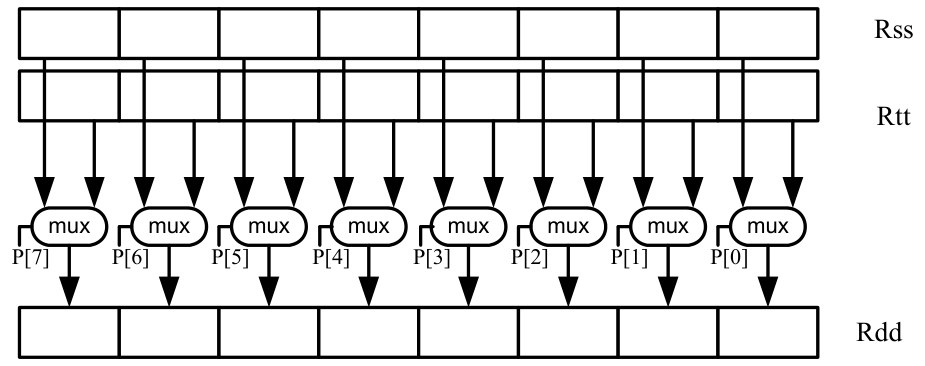

```text
Rss
Rtt
mux mux mux mux mux mux mux mux
P[7] P[6] P[5] P[4] P[3] P[2] P[1] P[0]
Rdd
```

| Syntax | Behavior |
|---|---|
| `Rdd=vmux(Pu,Rss,Rtt)` | `PREDUSE_TIMING;`<br>`for (i = 0; i < 8; i++) {`<br>`Rdd.b[i]=(Pu.i?(Rss.b[i]):(Rtt.b[i]));`<br>`}` |

##### Class: XTYPE (slots 2,3)

##### Intrinsics

```
Rdd=vmux(Pu,Rss,Rtt)Word64 Q6_P_vmux_pPP(Byte Pu, Word64 Rss,
                             Word64 Rtt)
```

##### Encoding

| 31 | 30 | 29 | 28 | 27 | 26 | 25 | 24 | 23 | 22 | 21 | 20 | 19 | 18 | 17 | 16 | 15 14 | 13 | 12 | 11 | 10 | 9 | 8 | 7 | 6 | 5 | 4 | 3 | 2 | 1 | 0 |  |
|---|---|---|---|---|---|---|---|---|---|---|---|---|---|---|---|---|---|---|---|---|---|---|---|---|---|---|---|---|---|---|---|
| ICLASS | ICLASS | ICLASS | ICLASS | RegType | RegType | RegType | RegType |  |  |  | s5 | s5 | s5 | s5 | s5 | Parse |  | t5 | t5 | t5 | t5 | t5 |  | u2 | u2 | d5 | d5 | d5 | d5 | d5 |  |
| 1 | 1 | 0 | 1 | 0 | 0 | 0 | 1 | - | - | - | s | s | s | s | s | P P | - | t | t | t | t | t | - | u | u | d | d | d | d | d | Rdd=vmux(Pu,Rss,Rtt) |

| Field name | Description |
|---|---|
| `RegType` | Register type |
| `MinOp` | Minor opcode |
| `ICLASS` | Instruction class |
| `Parse` | Packet/loop parse bits |
| `d5` | Field to encode register d |
| `s5` | Field to encode register s |
| `t5` | Field to encode register t |
| `u2` | Field to encode register u |

### 11.10.8 XTYPE SHIFT

The XTYPE SHIFT instruction subclass includes instructions that perform shifts.

#### Mask generate from immediate

Generate a mask from two immediate values.

| Syntax | Behavior |
|---|---|
| `Rd=mask(#u5,#U5)` | `Rd = ((1<<#u)-1) << #U;` |

##### Class: XTYPE (slots 2,3)

##### Intrinsics

```
Rd=mask(#u5,#U5)Word32 Q6_R_mask_II(Word32 Iu5, Word32 IU5)
```

##### Encoding

| 31 | 30 | 29 | 28 | 27 | 26 | 25 | 24 | 23 | 22 | 21 | 20 | 19 | 18 | 17 | 16 | 15 | 14 | 13 | 12 | 11 | 10 | 9 | 8 | 7 | 6 | 5 | 4 | 3 | 2 | 1 | 0 |  |
|---|---|---|---|---|---|---|---|---|---|---|---|---|---|---|---|---|---|---|---|---|---|---|---|---|---|---|---|---|---|---|---|---|
| ICLASS | ICLASS | ICLASS | ICLASS | RegType | RegType | RegType | RegType | MajOp | MajOp |  |  |  |  |  |  | Parse | Parse |  |  |  |  |  |  | MinOp | MinOp | MinOp | d5 | d5 | d5 | d5 | d5 |  |
| 1 | 0 | 0 | 0 | 1 | 1 | 0 | 1 | 0 | I | I | - | - | - | - | - | P | P | 1 | i | i | i | i | i | I | I | I | d | d | d | d | d | Rd=mask(#u5,#U5) |

| Field name | Description |
|---|---|
| `ICLASS` | Instruction class |
| `Parse` | Packet/loop parse bits |
| `d5` | Field to encode register d |
| `MajOp` | Major opcode |
| `MinOp` | Minor opcode |
| `RegType` | Register type |

#### Shift by immediate

Shift the source register value right or left based on the type of instruction. In these instructions, the shift amount is contained in an unsigned immediate (five bits for 32-bit shifts, six bits for 64-bit shifts) and the shift instruction gives the shift direction.

Arithmetic right shifts place the sign bit of the source value in the vacated positions.

Logical right shifts place zeros in the vacated positions.

Left shifts always zero-fill the vacated bits.

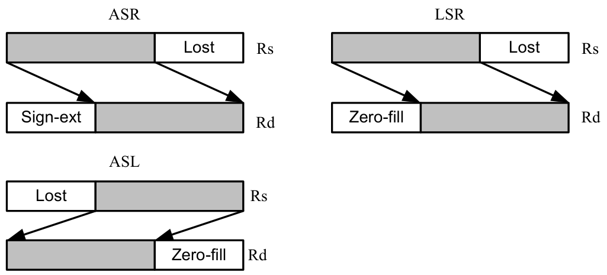

```text
ASR LSR
Lost Rs Lost Rs
Sign-ext Rd Zero-fill Rd
ASL
Lost Rs
Zero-fill Rd
```

| Syntax | Behavior |
|---|---|
| `Rd=asl(Rs,#u5)` | `Rd = Rs << #u;` |
| `Rd=asr(Rs,#u5)` | `Rd = Rs >> #u;` |
| `Rd=lsr(Rs,#u5)` | `Rd = Rs >>> #u;` |
| `Rd=rol(Rs,#u5)` | `Rd = Rs <<<sub>R</sub> #u;` |
| `Rdd=asl(Rss,#u6)` | `Rdd = Rss << #u;` |
| `Rdd=asr(Rss,#u6)` | `Rdd = Rss >> #u;` |
| `Rdd=lsr(Rss,#u6)` | `Rdd = Rss >>> #u;` |
| `Rdd=rol(Rss,#u6)` | `Rdd = Rss <<<sub>R</sub> #u;` |

##### Class: XTYPE (slots 2,3)

##### Intrinsics

|  |  |
|---|---|
| `Rd=asl(Rs,#u5)` | `Word32 Q6_R_asl_RI(Word32 Rs, Word32 Iu5)` |
| `Rd=asr(Rs,#u5)` | `Word32 Q6_R_asr_RI(Word32 Rs, Word32 Iu5)` |
| `Rd=lsr(Rs,#u5)` | `Word32 Q6_R_lsr_RI(Word32 Rs, Word32 Iu5)` |
| `Rd=rol(Rs,#u5)` | `Word32 Q6_R_rol_RI(Word32 Rs, Word32 Iu5)` |
| `Rdd=asl(Rss,#u6)` | `Word64 Q6_P_asl_PI(Word64 Rss, Word32 Iu6)` |
| `Rdd=asr(Rss,#u6)` | `Word64 Q6_P_asr_PI(Word64 Rss, Word32 Iu6)` |
| `Rdd=lsr(Rss,#u6)` | `Word64 Q6_P_lsr_PI(Word64 Rss, Word32 Iu6)` |
| `Rdd=rol(Rss,#u6)` | `Word64 Q6_P_rol_PI(Word64 Rss, Word32 Iu6)` |

##### Encoding

| 31 | 30 | 29 | 28 | 27 | 26 | 25 | 24 | 23 | 22 | 21 | 20 | 19 | 18 | 17 | 16 | 15 | 14 | 13 | 12 | 11 | 10 | 9 | 8 | 7 | 6 | 5 | 4 | 3 | 2 | 1 | 0 |  |
|---|---|---|---|---|---|---|---|---|---|---|---|---|---|---|---|---|---|---|---|---|---|---|---|---|---|---|---|---|---|---|---|---|
| ICLASS | ICLASS | ICLASS | ICLASS | RegType | RegType | RegType | RegType | MajOp | MajOp |  | s5 | s5 | s5 | s5 | s5 | Parse | Parse |  |  |  |  |  |  | MinOp | MinOp | MinOp | d5 | d5 | d5 | d5 | d5 |  |
| 1 | 0 | 0 | 0 | 0 | 0 | 0 | 0 | 0 | 0 | 0 | s | s | s | s | s | P | P | i | i | i | i | i | i | 0 | 0 | 0 | d | d | d | d | d | Rdd=asr(Rss,#u6) |
| 1 | 0 | 0 | 0 | 0 | 0 | 0 | 0 | 0 | 0 | 0 | s | s | s | s | s | P | P | i | i | i | i | i | i | 0 | 0 | 1 | d | d | d | d | d | Rdd=lsr(Rss,#u6) |
| 1 | 0 | 0 | 0 | 0 | 0 | 0 | 0 | 0 | 0 | 0 | s | s | s | s | s | P | P | i | i | i | i | i | i | 0 | 1 | 0 | d | d | d | d | d | Rdd=asl(Rss,#u6) |
| 1 | 0 | 0 | 0 | 0 | 0 | 0 | 0 | 0 | 0 | 0 | s | s | s | s | s | P | P | i | i | i | i | i | i | 0 | 1 | 1 | d | d | d | d | d | Rdd=rol(Rss,#u6) |
| 1 | 0 | 0 | 0 | 1 | 1 | 0 | 0 | 0 | 0 | 0 | s | s | s | s | s | P | P | 0 | i | i | i | i | i | 0 | 0 | 0 | d | d | d | d | d | Rd=asr(Rs,#u5) |
| 1 | 0 | 0 | 0 | 1 | 1 | 0 | 0 | 0 | 0 | 0 | s | s | s | s | s | P | P | 0 | i | i | i | i | i | 0 | 0 | 1 | d | d | d | d | d | Rd=lsr(Rs,#u5) |
| 1 | 0 | 0 | 0 | 1 | 1 | 0 | 0 | 0 | 0 | 0 | s | s | s | s | s | P | P | 0 | i | i | i | i | i | 0 | 1 | 0 | d | d | d | d | d | Rd=asl(Rs,#u5) |
| 1 | 0 | 0 | 0 | 1 | 1 | 0 | 0 | 0 | 0 | 0 | s | s | s | s | s | P | P | 0 | i | i | i | i | i | 0 | 1 | 1 | d | d | d | d | d | Rd=rol(Rs,#u5) |

| Field name | Description |
|---|---|
| `ICLASS` | Instruction class |
| `Parse` | Packet/loop parse bits |
| `d5` | Field to encode register d |
| `s5` | Field to encode register s |
| `MajOp` | Major opcode |
| `MinOp` | Minor opcode |
| `RegType` | Register type |

#### Shift by immediate and accumulate

Shift the source register value right or left, based on the type of instruction. In these instructions, an unsigned immediate (5 bits for 32-bit shifts, 6 bits for 64-bit shifts) contains the shift amount, and the shift instruction gives the shift direction.

Arithmetic right shifts place the sign bit of the source value in the vacated positions. Logical right shifts place zeros in the vacated positions. Left shifts always zero-fill the vacated bits.

After shifting, add or subtract the shifted value from the destination register or register pair.


```text
Rss # / Rt Rs # / Rt
64-bit shift value Shift amount 32-bit shift value Shift amount
64-bit shift 32-bit shift
64-bit add/sub 32-bit add/sub
64-bit result Rxx 32-bit result Rx
```

| Syntax | Behavior |
|---|---|
| `Rx=add(#u8,asl(Rx,#U5))` | `Rx=apply_extension(#u)+(Rx<<#U);` |
| `Rx=add(#u8,lsr(Rx,#U5))` | `Rx=apply_extension(#u)+(((unsigned `<br>`int)Rx)>>#U);` |
| `Rx=sub(#u8,asl(Rx,#U5))` | `Rx=apply_extension(#u)-(Rx<<#U);` |
| `Rx=sub(#u8,lsr(Rx,#U5))` | `Rx=apply_extension(#u)-(((unsigned `<br>`int)Rx)>>#U);` |
| `Rx[+-]=asl(Rs,#u5)` | `Rx = Rx [+-] Rs << #u;` |
| `Rx[+-]=asr(Rs,#u5)` | `Rx = Rx [+-] Rs >> #u;` |
| `Rx[+-]=lsr(Rs,#u5)` | `Rx = Rx [+-] Rs >>> #u;` |
| `Rx[+-]=rol(Rs,#u5)` | `Rx = Rx [+-] Rs <<<sub>R</sub> #u;` |
| `Rxx[+-]=asl(Rss,#u6)` | `Rxx = Rxx [+-] Rss << #u;` |
| `Rxx[+-]=asr(Rss,#u6)` | `Rxx = Rxx [+-] Rss >> #u;` |
| `Rxx[+-]=lsr(Rss,#u6)` | `Rxx = Rxx [+-] Rss >>> #u;` |
| `Rxx[+-]=rol(Rss,#u6)` | `Rxx = Rxx [+-] Rss <<<sub>R</sub> #u;` |

##### Class: XTYPE (slots 2,3)

##### Intrinsics

|  |  |
|---|---|
| `Rx+=asl(Rs,#u5)` | `Word32 Q6_R_aslacc_RI(Word32 Rx, Word32 Rs, Word32 Iu5)` |
| `Rx+=asr(Rs,#u5)` | `Word32 Q6_R_asracc_RI(Word32 Rx, Word32 Rs, Word32 Iu5)` |
| `Rx+=lsr(Rs,#u5)` | `Word32 Q6_R_lsracc_RI(Word32 Rx, Word32 Rs, Word32 Iu5)` |
| `Rx+=rol(Rs,#u5)` | `Word32 Q6_R_rolacc_RI(Word32 Rx, Word32 Rs, Word32 Iu5)` |
| `Rx-=asl(Rs,#u5)` | `Word32 Q6_R_aslnac_RI(Word32 Rx, Word32 Rs, Word32 Iu5)` |
| `Rx-=asr(Rs,#u5)` | `Word32 Q6_R_asrnac_RI(Word32 Rx, Word32 Rs, Word32 Iu5)` |
| `Rx-=lsr(Rs,#u5)` | `Word32 Q6_R_lsrnac_RI(Word32 Rx, Word32 Rs, Word32 Iu5)` |
| `Rx-=rol(Rs,#u5)` | `Word32 Q6_R_rolnac_RI(Word32 Rx, Word32 Rs, Word32 Iu5)` |
| `Rx=add(#u8,asl(Rx,#U5` | `Word32 Q6_R_add_asl_IRI(Word32 Iu8, Word32 Rx, Word32` |
| `))` | `IU5)` |
| `Rx=add(#u8,lsr(Rx,#U5` | `Word32 Q6_R_add_lsr_IRI(Word32 Iu8, Word32 Rx, Word32` |
| `))` | `IU5)` |
| `Rx=sub(#u8,asl(Rx,#U5` | `Word32 Q6_R_sub_asl_IRI(Word32 Iu8, Word32 Rx, Word32` |
| `))` | `IU5)` |
| `Rx=sub(#u8,lsr(Rx,#U5` | `Word32 Q6_R_sub_lsr_IRI(Word32 Iu8, Word32 Rx, Word32` |
| `))` | `IU5)` |
| `Rxx+=asl(Rss,#u6)` | `Word64 Q6_P_aslacc_PI(Word64 Rxx, Word64 Rss, Word32 Iu6)` |
| `Rxx+=asr(Rss,#u6)` | `Word64 Q6_P_asracc_PI(Word64 Rxx, Word64 Rss, Word32 Iu6)` |
| `Rxx+=lsr(Rss,#u6)` | `Word64 Q6_P_lsracc_PI(Word64 Rxx, Word64 Rss, Word32 Iu6)` |
| `Rxx+=rol(Rss,#u6)` | `Word64 Q6_P_rolacc_PI(Word64 Rxx, Word64 Rss, Word32 Iu6)` |
| `Rxx-=asl(Rss,#u6)` | `Word64 Q6_P_aslnac_PI(Word64 Rxx, Word64 Rss, Word32 Iu6)` |
| `Rxx-=asr(Rss,#u6)` | `Word64 Q6_P_asrnac_PI(Word64 Rxx, Word64 Rss, Word32 Iu6)` |
| `Rxx-=lsr(Rss,#u6)` | `Word64 Q6_P_lsrnac_PI(Word64 Rxx, Word64 Rss, Word32 Iu6)` |
| `Rxx-=rol(Rss,#u6)` | `Word64 Q6_P_rolnac_PI(Word64 Rxx, Word64 Rss, Word32 Iu6)` |

##### Encoding

| 31 | 30 | 29 | 28 | 27 | 26 | 25 | 24 | 23 | 22 | 21 | 20 | 19 | 18 | 17 | 16 | 15 | 14 | 13 | 12 | 11 | 10 | 9 | 8 | 7 | 6 | 5 | 4 | 3 | 2 | 1 | 0 |  |
|---|---|---|---|---|---|---|---|---|---|---|---|---|---|---|---|---|---|---|---|---|---|---|---|---|---|---|---|---|---|---|---|---|
| ICLASS | ICLASS | ICLASS | ICLASS | RegType | RegType | RegType | RegType | MajOp | MajOp |  | s5 | s5 | s5 | s5 | s5 | Parse | Parse |  |  |  |  |  |  | MinOp | MinOp | MinOp | x5 | x5 | x5 | x5 | x5 |  |
| 1 | 0 | 0 | 0 | 0 | 0 | 1 | 0 | 0 | 0 | - | s | s | s | s | s | P | P | i | i | i | i | i | i | 0 | 0 | 0 | x | x | x | x | x | Rxx-=asr(Rss,#u6) |
| 1 | 0 | 0 | 0 | 0 | 0 | 1 | 0 | 0 | 0 | - | s | s | s | s | s | P | P | i | i | i | i | i | i | 0 | 0 | 1 | x | x | x | x | x | Rxx-=lsr(Rss,#u6) |
| 1 | 0 | 0 | 0 | 0 | 0 | 1 | 0 | 0 | 0 | - | s | s | s | s | s | P | P | i | i | i | i | i | i | 0 | 1 | 0 | x | x | x | x | x | Rxx-=asl(Rss,#u6) |
| 1 | 0 | 0 | 0 | 0 | 0 | 1 | 0 | 0 | 0 | - | s | s | s | s | s | P | P | i | i | i | i | i | i | 0 | 1 | 1 | x | x | x | x | x | Rxx-=rol(Rss,#u6) |
| 1 | 0 | 0 | 0 | 0 | 0 | 1 | 0 | 0 | 0 | - | s | s | s | s | s | P | P | i | i | i | i | i | i | 1 | 0 | 0 | x | x | x | x | x | Rxx+=asr(Rss,#u6) |
| 1 | 0 | 0 | 0 | 0 | 0 | 1 | 0 | 0 | 0 | - | s | s | s | s | s | P | P | i | i | i | i | i | i | 1 | 0 | 1 | x | x | x | x | x | Rxx+=lsr(Rss,#u6) |
| 1 | 0 | 0 | 0 | 0 | 0 | 1 | 0 | 0 | 0 | - | s | s | s | s | s | P | P | i | i | i | i | i | i | 1 | 1 | 0 | x | x | x | x | x | Rxx+=asl(Rss,#u6) |
| 1 | 0 | 0 | 0 | 0 | 0 | 1 | 0 | 0 | 0 | - | s | s | s | s | s | P | P | i | i | i | i | i | i | 1 | 1 | 1 | x | x | x | x | x | Rxx+=rol(Rss,#u6) |
| 1 | 0 | 0 | 0 | 1 | 1 | 1 | 0 | 0 | 0 | - | s | s | s | s | s | P | P | 0 | i | i | i | i | i | 0 | 0 | 0 | x | x | x | x | x | Rx-=asr(Rs,#u5) |
| 1 | 0 | 0 | 0 | 1 | 1 | 1 | 0 | 0 | 0 | - | s | s | s | s | s | P | P | 0 | i | i | i | i | i | 0 | 0 | 1 | x | x | x | x | x | Rx-=lsr(Rs,#u5) |
| 1 | 0 | 0 | 0 | 1 | 1 | 1 | 0 | 0 | 0 | - | s | s | s | s | s | P | P | 0 | i | i | i | i | i | 0 | 1 | 0 | x | x | x | x | x | Rx-=asl(Rs,#u5) |
| 1 | 0 | 0 | 0 | 1 | 1 | 1 | 0 | 0 | 0 | - | s | s | s | s | s | P | P | 0 | i | i | i | i | i | 0 | 1 | 1 | x | x | x | x | x | Rx-=rol(Rs,#u5) |
| 1 | 0 | 0 | 0 | 1 | 1 | 1 | 0 | 0 | 0 | - | s | s | s | s | s | P | P | 0 | i | i | i | i | i | 1 | 0 | 0 | x | x | x | x | x | Rx+=asr(Rs,#u5) |
| 1 | 0 | 0 | 0 | 1 | 1 | 1 | 0 | 0 | 0 | - | s | s | s | s | s | P | P | 0 | i | i | i | i | i | 1 | 0 | 1 | x | x | x | x | x | Rx+=lsr(Rs,#u5) |
| 1 | 0 | 0 | 0 | 1 | 1 | 1 | 0 | 0 | 0 | - | s | s | s | s | s | P | P | 0 | i | i | i | i | i | 1 | 1 | 0 | x | x | x | x | x | Rx+=asl(Rs,#u5) |
| 1 | 0 | 0 | 0 | 1 | 1 | 1 | 0 | 0 | 0 | - | s | s | s | s | s | P | P | 0 | i | i | i | i | i | 1 | 1 | 1 | x | x | x | x | x | Rx+=rol(Rs,#u5) |
| ICLASS | ICLASS | ICLASS | ICLASS | RegType | RegType | RegType | RegType |  |  |  | x5 | x5 | x5 | x5 | x5 | Parse | Parse |  |  |  |  |  |  |  |  |  | MajOp | MajOp | MajOp | MajOp | MajOp |  |
| 1 | 1 | 0 | 1 | 1 | 1 | 1 | 0 | i | i | i | x | x | x | x | x | P | P | i | I | I | I | I | I | i | i | i | 0 | i | 1 | 0 | - | Rx=add(#u8,asl(Rx,#U5)) |
| 1 | 1 | 0 | 1 | 1 | 1 | 1 | 0 | i | i | i | x | x | x | x | x | P | P | i | I | I | I | I | I | i | i | i | 0 | i | 1 | 1 | - | Rx=sub(#u8,asl(Rx,#U5)) |
| 1 | 1 | 0 | 1 | 1 | 1 | 1 | 0 | i | i | i | x | x | x | x | x | P | P | i | I | I | I | I | I | i | i | i | 1 | i | 1 | 0 | - | Rx=add(#u8,lsr(Rx,#U5)) |
| 1 | 1 | 0 | 1 | 1 | 1 | 1 | 0 | i | i | i | x | x | x | x | x | P | P | i | I | I | I | I | I | i | i | i | 1 | i | 1 | 1 | - | Rx=sub(#u8,lsr(Rx,#U5)) |

| Field name | Description |
|---|---|
| `RegType` | Register type |
| `MajOp` | Major opcode |
| `ICLASS` | Instruction class |
| `Parse` | Packet/loop parse bits |
| `s5` | Field to encode register s |
| `x5` | Field to encode register x |
| `MinOp` | Minor opcode |

#### Shift by immediate and add

Shift Rs left by 0-7 bits, add to Rt, and place the result in Rd.

This instruction is useful for calculating array pointers, where destruction of the base pointer is undesirable.

| Syntax | Behavior |
|---|---|
| `Rd=addasl(Rt,Rs,#u3)` | `Rd = Rt + Rs << #u;` |

##### Class: XTYPE (slots 2,3)

##### Intrinsics

```
Rd=addasl(Rt,Rs,#u3)Word32 Q6_R_addasl_RRI(Word32 Rt, Word32
                             Rs, Word32 Iu3)
```

##### Encoding

| 31 | 30 | 29 | 28 | 27 | 26 | 25 | 24 | 23 | 22 | 21 | 20 | 19 | 18 | 17 | 16 | 15 | 14 | 13 | 12 | 11 | 10 | 9 | 8 | 7 | 6 | 5 | 4 | 3 | 2 | 1 | 0 |  |
|---|---|---|---|---|---|---|---|---|---|---|---|---|---|---|---|---|---|---|---|---|---|---|---|---|---|---|---|---|---|---|---|---|
| ICLASS | ICLASS | ICLASS | ICLASS | RegType | RegType | RegType | RegType | Maj | Maj |  | s5 | s5 | s5 | s5 | s5 | Parse | Parse |  | t5 | t5 | t5 | t5 | t5 | Min | Min |  | d5 | d5 | d5 | d5 | d5 |  |
| 1 | 1 | 0 | 0 | 0 | 1 | 0 | 0 | 0 | 0 | 0 | s | s | s | s | s | P | P | 0 | t | t | t | t | t | i | i | i | d | d | d | d | d | Rd=addasl(Rt,Rs,#u3) |

| Field name | Description |
|---|---|
| `ICLASS` | Instruction class |
| `Parse` | Packet/loop parse bits |
| `d5` | Field to encode register d |
| `s5` | Field to encode register s |
| `t5` | Field to encode register t |
| `Maj` | Major opcode |
| `Min` | Minor opcode |
| `RegType` | Register type |

#### Shift by immediate and logical

Shift the source register value right or left based on the type of instruction. In these instructions, an unsigned immediate (five bits for 32-bit shifts, six bits for 64-bit shifts) contains the shift amount and the shift instruction gives the shift direction.

Arithmetic right shifts place the sign bit of the source value in the vacated positions. Logical right shifts place zeros in the vacated positions. Left shifts always zero-fill the vacated bits.

After shifting, take the logical AND, OR, or XOR of the shifted amount and the destination register or register pair, and place the result back in the destination register or register pair.

Saturation is not available for these instructions.

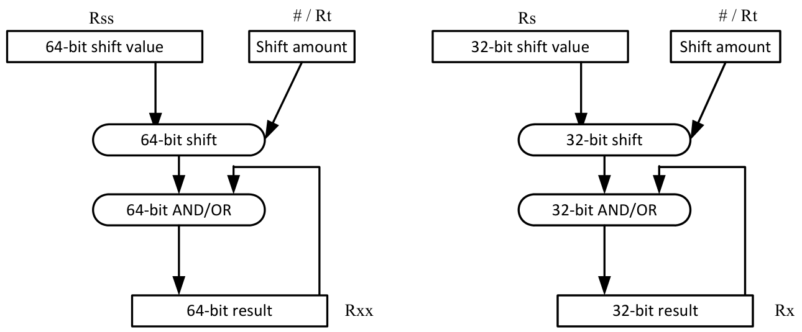

```text
Rss # / Rt Rs # / Rt
64-bit shift value Shift amount 32-bit shift value Shift amount
64-bit shift 32-bit shift
64-bit AND/OR 32-bit AND/OR
64-bit result Rxx 32-bit result Rx
```

| Syntax | Behavior |
|---|---|
| `Rx=and(#u8,asl(Rx,#U5))` | `Rx=apply_extension(#u)&(Rx<<#U);` |
| `Rx=and(#u8,lsr(Rx,#U5))` | `Rx=apply_extension(#u)&(((unsigned `<br>`int)Rx)>>#U);` |
| `Rx=or(#u8,asl(Rx,#U5))` | `Rx=apply_extension(#u)\|(Rx<<#U);` |
| `Rx=or(#u8,lsr(Rx,#U5))` | `Rx=apply_extension(#u)\|(((unsigned `<br>`int)Rx)>>#U);` |
| `Rx[&\|]=asl(Rs,#u5)` | `Rx = Rx [\|&] Rs << #u;` |
| `Rx[&\|]=asr(Rs,#u5)` | `Rx = Rx [\|&] Rs >> #u;` |
| `Rx[&\|]=lsr(Rs,#u5)` | `Rx = Rx [\|&] Rs >>> #u;` |
| `Rx[&\|]=rol(Rs,#u5)` | `Rx = Rx [\|&] Rs <<<sub>R</sub> #u;` |
| `Rx^=asl(Rs,#u5)` | `Rx = Rx ^ Rs << #u;` |
| `Rx^=lsr(Rs,#u5)` | `Rx = Rx ^ Rs >>> #u;` |
| `Rx^=rol(Rs,#u5)` | `Rx = Rx ^ Rs <<<sub>R</sub> #u;` |
| `Rxx[&\|]=asl(Rss,#u6)` | `Rxx = Rxx [\|&] Rss << #u;` |
| `Rxx[&\|]=asr(Rss,#u6)` | `Rxx = Rxx [\|&] Rss >> #u;` |
| `Rxx[&\|]=lsr(Rss,#u6)` | `Rxx = Rxx [\|&] Rss >>> #u;` |
| `Rxx[&\|]=rol(Rss,#u6)` | `Rxx = Rxx [\|&] Rss <<<sub>R</sub> #u;` |
| `Rxx^=asl(Rss,#u6)` | `Rxx = Rxx ^ Rss << #u;` |
| `Rxx^=lsr(Rss,#u6)` | `Rxx = Rxx ^ Rss >>> #u;` |
| `Rxx^=rol(Rss,#u6)` | `Rxx = Rxx ^ Rss <<<sub>R</sub> #u;` |

##### Class: XTYPE (slots 2,3)

##### Intrinsics

|  |  |
|---|---|
| `Rx&=asl(Rs,#u5)` | `Word32 Q6_R_asland_RI(Word32 Rx, Word32 Rs, Word32 Iu5)` |
| `Rx&=asr(Rs,#u5)` | `Word32 Q6_R_asrand_RI(Word32 Rx, Word32 Rs, Word32 Iu5)` |
| `Rx&=lsr(Rs,#u5)` | `Word32 Q6_R_lsrand_RI(Word32 Rx, Word32 Rs, Word32 Iu5)` |
| `Rx&=rol(Rs,#u5)` | `Word32 Q6_R_roland_RI(Word32 Rx, Word32 Rs, Word32 Iu5)` |
| `Rx=and(#u8,asl(Rx,#U5` | `Word32 Q6_R_and_asl_IRI(Word32 Iu8, Word32 Rx, Word32` |
| `))` | `IU5)` |
| `Rx=and(#u8,lsr(Rx,#U5` | `Word32 Q6_R_and_lsr_IRI(Word32 Iu8, Word32 Rx, Word32` |
| `))` | `IU5)` |
| `Rx=or(#u8,asl(Rx,#U5)` | `Word32 Q6_R_or_asl_IRI(Word32 Iu8, Word32 Rx, Word32 IU5)` |

```
)
Rx=or(#u8,lsr(Rx,#U5)Word32 Q6_R_or_lsr_IRI(Word32 Iu8, Word32 Rx, Word32 IU5)
)
```

|  |  |
|---|---|
| `Rx^=asl(Rs,#u5)` | `Word32 Q6_R_aslxacc_RI(Word32 Rx, Word32 Rs, Word32 Iu5)` |
| `Rx^=lsr(Rs,#u5)` | `Word32 Q6_R_lsrxacc_RI(Word32 Rx, Word32 Rs, Word32 Iu5)` |
| `Rx^=rol(Rs,#u5)` | `Word32 Q6_R_rolxacc_RI(Word32 Rx, Word32 Rs, Word32 Iu5)` |
| `Rx\|=asl(Rs,#u5)` | `Word32 Q6_R_aslor_RI(Word32 Rx, Word32 Rs, Word32 Iu5)` |
| `Rx\|=asr(Rs,#u5)` | `Word32 Q6_R_asror_RI(Word32 Rx, Word32 Rs, Word32 Iu5)` |
| `Rx\|=lsr(Rs,#u5)` | `Word32 Q6_R_lsror_RI(Word32 Rx, Word32 Rs, Word32 Iu5)` |
| `Rx\|=rol(Rs,#u5)` | `Word32 Q6_R_rolor_RI(Word32 Rx, Word32 Rs, Word32 Iu5)` |
| `Rxx&=asl(Rss,#u6)` | `Word64 Q6_P_asland_PI(Word64 Rxx, Word64 Rss, Word32 Iu6)` |
| `Rxx&=asr(Rss,#u6)` | `Word64 Q6_P_asrand_PI(Word64 Rxx, Word64 Rss, Word32 Iu6)` |
| `Rxx&=lsr(Rss,#u6)` | `Word64 Q6_P_lsrand_PI(Word64 Rxx, Word64 Rss, Word32 Iu6)` |
| `Rxx&=rol(Rss,#u6)` | `Word64 Q6_P_roland_PI(Word64 Rxx, Word64 Rss, Word32 Iu6)` |
| `Rxx^=asl(Rss,#u6)` | `Word64 Q6_P_aslxacc_PI(Word64 Rxx, Word64 Rss, Word32 Iu6)` |
| `Rxx^=lsr(Rss,#u6)` | `Word64 Q6_P_lsrxacc_PI(Word64 Rxx, Word64 Rss, Word32 Iu6)` |
| `Rxx^=rol(Rss,#u6)` | `Word64 Q6_P_rolxacc_PI(Word64 Rxx, Word64 Rss, Word32 Iu6)` |
| `Rxx\|=asl(Rss,#u6)` | `Word64 Q6_P_aslor_PI(Word64 Rxx, Word64 Rss, Word32 Iu6)` |
| `Rxx\|=asr(Rss,#u6)` | `Word64 Q6_P_asror_PI(Word64 Rxx, Word64 Rss, Word32 Iu6)` |
| `Rxx\|=lsr(Rss,#u6)` | `Word64 Q6_P_lsror_PI(Word64 Rxx, Word64 Rss, Word32 Iu6)` |
| `Rxx\|=rol(Rss,#u6)` | `Word64 Q6_P_rolor_PI(Word64 Rxx, Word64 Rss, Word32 Iu6)` |

##### Encoding

| 31 | 30 | 29 | 28 | 27 | 26 | 25 | 24 | 23 | 22 | 21 | 20 | 19 | 18 | 17 | 16 | 15 | 14 | 13 | 12 | 11 | 10 | 9 | 8 | 7 | 6 | 5 | 4 | 3 | 2 | 1 | 0 |  |
|---|---|---|---|---|---|---|---|---|---|---|---|---|---|---|---|---|---|---|---|---|---|---|---|---|---|---|---|---|---|---|---|---|
| ICLASS | ICLASS | ICLASS | ICLASS | RegType | RegType | RegType | RegType | MajOp | MajOp |  | s5 | s5 | s5 | s5 | s5 | Parse | Parse |  |  |  |  |  |  | MinOp | MinOp | MinOp | x5 | x5 | x5 | x5 | x5 |  |
| 1 | 0 | 0 | 0 | 0 | 0 | 1 | 0 | 0 | 1 | - | s | s | s | s | s | P | P | i | i | i | i | i | i | 0 | 0 | 0 | x | x | x | x | x | Rxx&=asr(Rss,#u6) |
| 1 | 0 | 0 | 0 | 0 | 0 | 1 | 0 | 0 | 1 | - | s | s | s | s | s | P | P | i | i | i | i | i | i | 0 | 0 | 1 | x | x | x | x | x | Rxx&=lsr(Rss,#u6) |
| 1 | 0 | 0 | 0 | 0 | 0 | 1 | 0 | 0 | 1 | - | s | s | s | s | s | P | P | i | i | i | i | i | i | 0 | 1 | 0 | x | x | x | x | x | Rxx&=asl(Rss,#u6) |
| 1 | 0 | 0 | 0 | 0 | 0 | 1 | 0 | 0 | 1 | - | s | s | s | s | s | P | P | i | i | i | i | i | i | 0 | 1 | 1 | x | x | x | x | x | Rxx&=rol(Rss,#u6) |
| 1 | 0 | 0 | 0 | 0 | 0 | 1 | 0 | 0 | 1 | - | s | s | s | s | s | P | P | i | i | i | i | i | i | 1 | 0 | 0 | x | x | x | x | x | Rxx\|=asr(Rss,#u6) |
| 1 | 0 | 0 | 0 | 0 | 0 | 1 | 0 | 0 | 1 | - | s | s | s | s | s | P | P | i | i | i | i | i | i | 1 | 0 | 1 | x | x | x | x | x | Rxx\|=lsr(Rss,#u6) |
| 1 | 0 | 0 | 0 | 0 | 0 | 1 | 0 | 0 | 1 | - | s | s | s | s | s | P | P | i | i | i | i | i | i | 1 | 1 | 0 | x | x | x | x | x | Rxx\|=asl(Rss,#u6) |
| 1 | 0 | 0 | 0 | 0 | 0 | 1 | 0 | 0 | 1 | - | s | s | s | s | s | P | P | i | i | i | i | i | i | 1 | 1 | 1 | x | x | x | x | x | Rxx\|=rol(Rss,#u6) |
| 1 | 0 | 0 | 0 | 0 | 0 | 1 | 0 | 1 | 0 | - | s | s | s | s | s | P | P | i | i | i | i | i | i | 0 | 0 | 1 | x | x | x | x | x | Rxx^=lsr(Rss,#u6) |
| 1 | 0 | 0 | 0 | 0 | 0 | 1 | 0 | 1 | 0 | - | s | s | s | s | s | P | P | i | i | i | i | i | i | 0 | 1 | 0 | x | x | x | x | x | Rxx^=asl(Rss,#u6) |
| 1 | 0 | 0 | 0 | 0 | 0 | 1 | 0 | 1 | 0 | - | s | s | s | s | s | P | P | i | i | i | i | i | i | 0 | 1 | 1 | x | x | x | x | x | Rxx^=rol(Rss,#u6) |
| 1 | 0 | 0 | 0 | 1 | 1 | 1 | 0 | 0 | 1 | - | s | s | s | s | s | P | P | 0 | i | i | i | i | i | 0 | 0 | 0 | x | x | x | x | x | Rx&=asr(Rs,#u5) |
| 1 | 0 | 0 | 0 | 1 | 1 | 1 | 0 | 0 | 1 | - | s | s | s | s | s | P | P | 0 | i | i | i | i | i | 0 | 0 | 1 | x | x | x | x | x | Rx&=lsr(Rs,#u5) |
| 1 | 0 | 0 | 0 | 1 | 1 | 1 | 0 | 0 | 1 | - | s | s | s | s | s | P | P | 0 | i | i | i | i | i | 0 | 1 | 0 | x | x | x | x | x | Rx&=asl(Rs,#u5) |
| 1 | 0 | 0 | 0 | 1 | 1 | 1 | 0 | 0 | 1 | - | s | s | s | s | s | P | P | 0 | i | i | i | i | i | 0 | 1 | 1 | x | x | x | x | x | Rx&=rol(Rs,#u5) |
| 1 | 0 | 0 | 0 | 1 | 1 | 1 | 0 | 0 | 1 | - | s | s | s | s | s | P | P | 0 | i | i | i | i | i | 1 | 0 | 0 | x | x | x | x | x | Rx\|=asr(Rs,#u5) |
| 1 | 0 | 0 | 0 | 1 | 1 | 1 | 0 | 0 | 1 | - | s | s | s | s | s | P | P | 0 | i | i | i | i | i | 1 | 0 | 1 | x | x | x | x | x | Rx\|=lsr(Rs,#u5) |
| 1 | 0 | 0 | 0 | 1 | 1 | 1 | 0 | 0 | 1 | - | s | s | s | s | s | P | P | 0 | i | i | i | i | i | 1 | 1 | 0 | x | x | x | x | x | Rx\|=asl(Rs,#u5) |
| 1 | 0 | 0 | 0 | 1 | 1 | 1 | 0 | 0 | 1 | - | s | s | s | s | s | P | P | 0 | i | i | i | i | i | 1 | 1 | 1 | x | x | x | x | x | Rx\|=rol(Rs,#u5) |
| 1 | 0 | 0 | 0 | 1 | 1 | 1 | 0 | 1 | 0 | - | s | s | s | s | s | P | P | 0 | i | i | i | i | i | 0 | 0 | 1 | x | x | x | x | x | Rx^=lsr(Rs,#u5) |
| 1 | 0 | 0 | 0 | 1 | 1 | 1 | 0 | 1 | 0 | - | s | s | s | s | s | P | P | 0 | i | i | i | i | i | 0 | 1 | 0 | x | x | x | x | x | Rx^=asl(Rs,#u5) |
| 1 | 0 | 0 | 0 | 1 | 1 | 1 | 0 | 1 | 0 | - | s | s | s | s | s | P | P | 0 | i | i | i | i | i | 0 | 1 | 1 | x | x | x | x | x | Rx^=rol(Rs,#u5) |
| ICLASS | ICLASS | ICLASS | ICLASS | RegType | RegType | RegType | RegType |  |  |  | x5 | x5 | x5 | x5 | x5 | Parse | Parse |  |  |  |  |  |  |  |  |  | MajOp | MajOp | MajOp | MajOp | MajOp |  |
| 1 | 1 | 0 | 1 | 1 | 1 | 1 | 0 | i | i | i | x | x | x | x | x | P | P | i | I | I | I | I | I | i | i | i | 0 | i | 0 | 0 | - | Rx=and(#u8,asl(Rx,#U5)) |
| 1 | 1 | 0 | 1 | 1 | 1 | 1 | 0 | i | i | i | x | x | x | x | x | P | P | i | I | I | I | I | I | i | i | i | 0 | i | 0 | 1 | - | Rx=or(#u8,asl(Rx,#U5)) |
| 1 | 1 | 0 | 1 | 1 | 1 | 1 | 0 | i | i | i | x | x | x | x | x | P | P | i | I | I | I | I | I | i | i | i | 1 | i | 0 | 0 | - | Rx=and(#u8,lsr(Rx,#U5)) |
| 1 | 1 | 0 | 1 | 1 | 1 | 1 | 0 | i | i | i | x | x | x | x | x | P | P | i | I | I | I | I | I | i | i | i | 1 | i | 0 | 1 | - | Rx=or(#u8,lsr(Rx,#U5)) |

| Field name | Description |
|---|---|
| `RegType` | Register type |
| `ICLASS` | Instruction class |
| `Parse` | Packet/loop parse bits |
| `s5` | Field to encode register s |
| `x5` | Field to encode register x |
| `MajOp` | Major opcode |
| `MinOp` | Minor opcode |

#### Shift right by immediate with rounding

Perform an arithmetic right shift by an immediate amount, and then round the result. This instruction works by first shifting right, then adding the value +1 to the result, and finally shifting right again by one bit. The right shifts always inserts the sign-bit in the vacated position.

When using the asrrnd instruction, the assembler adjusts the immediate appropriately.

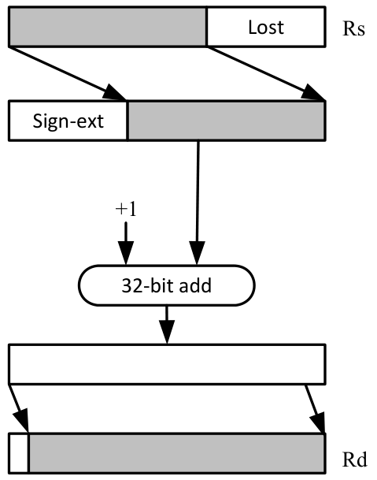

```text
Lost Rs
Sign-ext
+1
32-bit add
Rd
```

| Syntax | Behavior |
|---|---|
| `Rd=asr(Rs,#u5):rnd` | `Rd = ((Rs >> #u)+1) >> 1;` |
| `Rd=asrrnd(Rs,#u5)` | `if ("#u5==0") {`<br>`Assembler mapped to: "Rd=Rs";`<br>`} else {`<br>`Assembler mapped to: "Rd=asr(Rs,#u5-1):rnd";`<br>`}` |
| `Rdd=asr(Rss,#u6):rnd` | `tmp = Rss >> #u;`<br>`rnd = tmp & 1;`<br>`Rdd = tmp >> 1 + rnd;` |
| `Rdd=asrrnd(Rss,#u6)` | `if ("#u6==0") {`<br>`Assembler mapped to: "Rdd=Rss";`<br>`} else {`<br>`Assembler mapped to: "Rdd=asr(Rss,#u6-1):rnd";`<br>`}` |

##### Class: XTYPE (slots 2,3)

##### Intrinsics

|  |  |
|---|---|
| `Rd=asr(Rs,#u5):rnd` | `Word32 Q6_R_asr_RI_rnd(Word32 Rs, Word32 Iu5)` |
| `Rd=asrrnd(Rs,#u5)` | `Word32 Q6_R_asrrnd_RI(Word32 Rs, Word32 Iu5)` |
| `Rdd=asr(Rss,#u6):rnd` | `Word64 Q6_P_asr_PI_rnd(Word64 Rss, Word32 Iu6)` |
| `Rdd=asrrnd(Rss,#u6)` | `Word64 Q6_P_asrrnd_PI(Word64 Rss, Word32 Iu6)` |

##### Encoding

| 31 | 30 | 29 | 28 | 27 | 26 | 25 | 24 | 23 | 22 | 21 | 20 | 19 | 18 | 17 | 16 | 15 | 14 | 13 | 12 | 11 | 10 | 9 | 8 | 7 | 6 | 5 | 4 | 3 | 2 | 1 | 0 |  |
|---|---|---|---|---|---|---|---|---|---|---|---|---|---|---|---|---|---|---|---|---|---|---|---|---|---|---|---|---|---|---|---|---|
| ICLASS | ICLASS | ICLASS | ICLASS | RegType | RegType | RegType | RegType | MajOp | MajOp |  | s5 | s5 | s5 | s5 | s5 | Parse | Parse |  |  |  |  |  |  | MinOp | MinOp | MinOp | d5 | d5 | d5 | d5 | d5 |  |
| 1 | 0 | 0 | 0 | 0 | 0 | 0 | 0 | 1 | 1 | 0 | s | s | s | s | s | P | P | i | i | i | i | i | i | 1 | 1 | 1 | d | d | d | d | d | Rdd=asr(Rss,#u6):rnd |
| 1 | 0 | 0 | 0 | 1 | 1 | 0 | 0 | 0 | 1 | 0 | s | s | s | s | s | P | P | 0 | i | i | i | i | i | 0 | 0 | 0 | d | d | d | d | d | Rd=asr(Rs,#u5):rnd |

| Field name | Description |
|---|---|
| `ICLASS` | Instruction class |
| `Parse` | Packet/loop parse bits |
| `d5` | Field to encode register d |
| `s5` | Field to encode register s |
| `MajOp` | Major opcode |
| `MinOp` | Minor opcode |
| `RegType` | Register type |

#### Shift left by immediate with saturation

Perform a left shift of the 32-bit source register value by an immediate amount and saturate.

Saturation works by first sign-extending the 32-bit Rs register to 64 bits. It is then left-shifted by the immediate amount. If this 64-bit value cannot fit in a signed 32-bit number (the upper word is not the sign-extension of bit 31), saturation is performed based on the sign of the original value. Saturation clamps the 32-bit result to the range 0x8000_0000 to 0x7fff_ffff.

| Syntax | Behavior |
|---|---|
| `Rd=asl(Rs,#u5):sat` | `Rd = sat₃₂(sxt<sub>32->64</sub>(Rs) << #u);` |

##### Class: XTYPE (slots 2,3)

##### Notes

- If saturation occurs during execution of this instruction (a result is clamped to either maximum or minimum values), the OVF bit in the status register is set. OVF remains set until explicitly cleared by a transfer to the status register.

##### Intrinsics

```
Rd=asl(Rs,#u5):satWord32 Q6_R_asl_RI_sat(Word32 Rs, Word32
                             Iu5)
```

##### Encoding

| 31 | 30 | 29 | 28 | 27 | 26 | 25 | 24 | 23 | 22 | 21 | 20 | 19 | 18 | 17 | 16 | 15 | 14 | 13 | 12 | 11 | 10 | 9 | 8 | 7 | 6 | 5 | 4 | 3 | 2 | 1 | 0 |  |
|---|---|---|---|---|---|---|---|---|---|---|---|---|---|---|---|---|---|---|---|---|---|---|---|---|---|---|---|---|---|---|---|---|
| ICLASS | ICLASS | ICLASS | ICLASS | RegType | RegType | RegType | RegType | MajOp | MajOp |  | s5 | s5 | s5 | s5 | s5 | Parse | Parse |  |  |  |  |  |  | MinOp | MinOp | MinOp | d5 | d5 | d5 | d5 | d5 |  |
| 1 | 0 | 0 | 0 | 1 | 1 | 0 | 0 | 0 | 1 | 0 | s | s | s | s | s | P | P | 0 | i | i | i | i | i | 0 | 1 | 0 | d | d | d | d | d | Rd=asl(Rs,#u5):sat |

| Field name | Description |
|---|---|
| `ICLASS` | Instruction class |
| `Parse` | Packet/loop parse bits |
| `d5` | Field to encode register d |
| `s5` | Field to encode register s |
| `MajOp` | Major opcode |
| `MinOp` | Minor opcode |
| `RegType` | Register type |

#### Shift by register

The shift amount is the least significant seven bits of Rt, treated as a two's complement value. If the shift amount is negative (bit 6 of Rt is set), reverse the direction of the shift indicated in the opcode (see Figure).

The source data to shift is always performed as a 64-bit shift. When the Rs source register is a 32-bit register, this register is first sign or zero-extended to 64-bits. Arithmetic shifts sign-extend the 32-bit source to 64-bits, whereas logical shifts zero extend.

The 64-bit source value is then right or left shifted based on the shift amount and the type of instruction. Arithmetic right shifts place the sign bit of the source value in the vacated positions. Logical right shifts place zeros in the vacated positions.

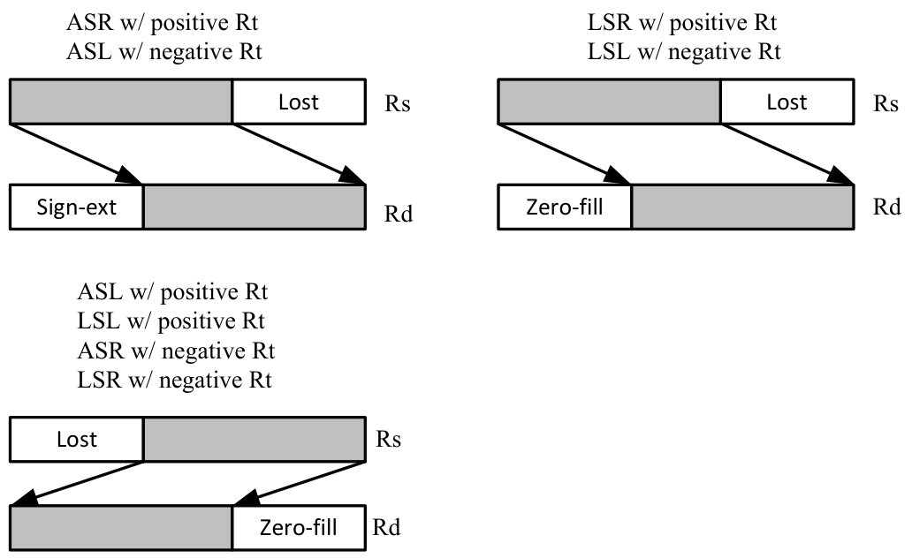

```text
ASR w/ positive Rt LSR w/ positive Rt
ASL w/ negative Rt LSL w/ negative Rt
Lost Rs Lost Rs
Sign-ext Rd Zero-fill Rd
ASL w/ positive Rt
LSL w/ positive Rt
ASR w/ negative Rt
LSR w/ negative Rt
Lost Rs
Zero-fill Rd
```

| Syntax | Behavior |
|---|---|
| `Rd=asl(Rs,Rt)` | `shamt=sxt<sub>7->32</sub>(Rt);`<br>`Rd = (shamt>0)?(sxt<sub>32->64</sub>(Rs)<<shamt):(sxt₃₂₋`<br>`<sub>>64</sub>(Rs)>>shamt);` |
| `Rd=asr(Rs,Rt)` | `shamt=sxt<sub>7->32</sub>(Rt);`<br>`Rd = (shamt>0)?(sxt<sub>32->64</sub>(Rs)>>shamt):(sxt₃₂₋`<br>`<sub>>64</sub>(Rs)<<shamt);` |
| `Rd=lsl(#s6,Rt)` | `shamt = sxt<sub>7->32</sub>(Rt);`<br>`Rd = (shamt>0)?(zxt<sub>32->64</sub>(#s)<<shamt):(zxt₃₂₋`<br>`<sub>>64</sub>(#s)>>>shamt);` |
| `Rd=lsl(Rs,Rt)` | `shamt=sxt<sub>7->32</sub>(Rt);`<br>`Rd = (shamt>0)?(zxt<sub>32->64</sub>(Rs)<<shamt):(zxt₃₂₋`<br>`<sub>>64</sub>(Rs)>>>shamt);` |
| `Rd=lsr(Rs,Rt)` | `shamt=sxt<sub>7->32</sub>(Rt);`<br>`Rd = (shamt>0)?(zxt<sub>32->64</sub>(Rs)>>>shamt):(zxt₃₂₋`<br>`<sub>>64</sub>(Rs)<<shamt);` |
| `Rdd=asl(Rss,Rt)` | `shamt=sxt<sub>7->32</sub>(Rt);`<br>`Rdd = (shamt>0)?(Rss<<shamt):(Rss>>shamt);` |
| `Rdd=asr(Rss,Rt)` | `shamt=sxt<sub>7->32</sub>(Rt);`<br>`Rdd = (shamt>0)?(Rss>>shamt):(Rss<<shamt);` |
| `Rdd=lsl(Rss,Rt)` | `shamt=sxt<sub>7->32</sub>(Rt);`<br>`Rdd = (shamt>0)?(Rss<<shamt):(Rss>>>shamt);` |
| `Rdd=lsr(Rss,Rt)` | `shamt=sxt<sub>7->32</sub>(Rt);`<br>`Rdd = (shamt>0)?(Rss>>>shamt):(Rss<<shamt);` |

##### Class: XTYPE (slots 2,3)

##### Intrinsics

|  |  |
|---|---|
| `Rd=asl(Rs,Rt)` | `Word32 Q6_R_asl_RR(Word32 Rs, Word32 Rt)` |
| `Rd=asr(Rs,Rt)` | `Word32 Q6_R_asr_RR(Word32 Rs, Word32 Rt)` |
| `Rd=lsl(#s6,Rt)` | `Word32 Q6_R_lsl_IR(Word32 Is6, Word32 Rt)` |
| `Rd=lsl(Rs,Rt)` | `Word32 Q6_R_lsl_RR(Word32 Rs, Word32 Rt)` |
| `Rd=lsr(Rs,Rt)` | `Word32 Q6_R_lsr_RR(Word32 Rs, Word32 Rt)` |
| `Rdd=asl(Rss,Rt)` | `Word64 Q6_P_asl_PR(Word64 Rss, Word32 Rt)` |
| `Rdd=asr(Rss,Rt)` | `Word64 Q6_P_asr_PR(Word64 Rss, Word32 Rt)` |
| `Rdd=lsl(Rss,Rt)` | `Word64 Q6_P_lsl_PR(Word64 Rss, Word32 Rt)` |
| `Rdd=lsr(Rss,Rt)` | `Word64 Q6_P_lsr_PR(Word64 Rss, Word32 Rt)` |

##### Encoding

| 31 | 30 | 29 | 28 | 27 | 26 | 25 | 24 | 23 | 22 | 21 | 20 | 19 | 18 | 17 | 16 | 15 | 14 | 13 | 12 | 11 | 10 | 9 | 8 | 7 | 6 | 5 | 4 | 3 | 2 | 1 | 0 |  |
|---|---|---|---|---|---|---|---|---|---|---|---|---|---|---|---|---|---|---|---|---|---|---|---|---|---|---|---|---|---|---|---|---|
| ICLASS | ICLASS | ICLASS | ICLASS | RegType | RegType | RegType | RegType | Maj | Maj |  | s5 | s5 | s5 | s5 | s5 | Parse | Parse |  | t5 | t5 | t5 | t5 | t5 | Min | Min |  | d5 | d5 | d5 | d5 | d5 |  |
| 1 | 1 | 0 | 0 | 0 | 0 | 1 | 1 | 1 | 0 | - | s | s | s | s | s | P | P | - | t | t | t | t | t | 0 | 0 | - | d | d | d | d | d | Rdd=asr(Rss,Rt) |
| 1 | 1 | 0 | 0 | 0 | 0 | 1 | 1 | 1 | 0 | - | s | s | s | s | s | P | P | - | t | t | t | t | t | 0 | 1 | - | d | d | d | d | d | Rdd=lsr(Rss,Rt) |
| 1 | 1 | 0 | 0 | 0 | 0 | 1 | 1 | 1 | 0 | - | s | s | s | s | s | P | P | - | t | t | t | t | t | 1 | 0 | - | d | d | d | d | d | Rdd=asl(Rss,Rt) |
| 1 | 1 | 0 | 0 | 0 | 0 | 1 | 1 | 1 | 0 | - | s | s | s | s | s | P | P | - | t | t | t | t | t | 1 | 1 | - | d | d | d | d | d | Rdd=lsl(Rss,Rt) |
| 1 | 1 | 0 | 0 | 0 | 1 | 1 | 0 | 0 | 1 | - | s | s | s | s | s | P | P | - | t | t | t | t | t | 0 | 0 | - | d | d | d | d | d | Rd=asr(Rs,Rt) |
| 1 | 1 | 0 | 0 | 0 | 1 | 1 | 0 | 0 | 1 | - | s | s | s | s | s | P | P | - | t | t | t | t | t | 0 | 1 | - | d | d | d | d | d | Rd=lsr(Rs,Rt) |
| 1 | 1 | 0 | 0 | 0 | 1 | 1 | 0 | 0 | 1 | - | s | s | s | s | s | P | P | - | t | t | t | t | t | 1 | 0 | - | d | d | d | d | d | Rd=asl(Rs,Rt) |
| 1 | 1 | 0 | 0 | 0 | 1 | 1 | 0 | 0 | 1 | - | s | s | s | s | s | P | P | - | t | t | t | t | t | 1 | 1 | - | d | d | d | d | d | Rd=lsl(Rs,Rt) |
| ICLASS | ICLASS | ICLASS | ICLASS | RegType | RegType | RegType | RegType | Maj | Maj |  |  |  |  |  |  | Parse | Parse |  | t5 | t5 | t5 | t5 | t5 | Min | Min |  | d5 | d5 | d5 | d5 | d5 |  |
| 1 | 1 | 0 | 0 | 0 | 1 | 1 | 0 | 1 | 0 | - | i | i | i | i | i | P | P | - | t | t | t | t | t | 1 | 1 | i | d | d | d | d | d | Rd=lsl(#s6,Rt) |

| Field name | Description |
|---|---|
| `ICLASS` | Instruction class |
| `Parse` | Packet/loop parse bits |
| `d5` | Field to encode register d |
| Field name | Description |
| `s5` | Field to encode register s |
| `t5` | Field to encode register t |
| `Maj` | Major opcode |
| `Min` | Minor opcode |
| `RegType` | Register type |

#### Shift by register and accumulate

The shift amount is the least significant seven bits of Rt, treated as a two's complement value. When the shift amount is negative (bit 6 of Rt is set), reverse the direction of the shift indicated in the opcode.

Shift the source register value right or left based on the shift amount and the type of instruction. Arithmetic right shifts place the sign bit of the source value in the vacated positions. Logical right shifts place zeros in the vacated positions.

The shift operation is always performed as a 64-bit shift. When Rs is a 32-bit register, this register is first sign- or zero-extended to 64-bits. Arithmetic shifts sign-extend the 32-bit source to 64-bits, whereas logical shifts zero extend.

After shifting, add or subtract the 64-bit shifted amount from the destination register or register pair.

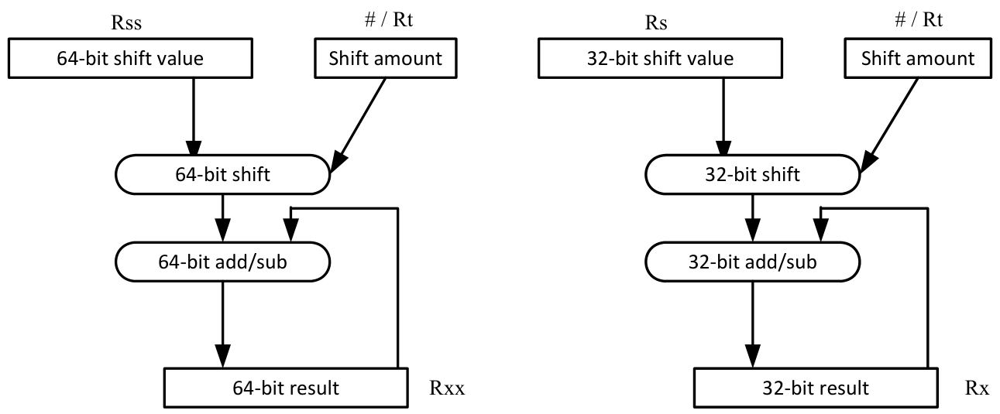

```text
Rss # / Rt Rs # / Rt
64-bit shift value Shift amount 32-bit shift value Shift amount
64-bit shift 32-bit shift
64-bit add/sub 32-bit add/sub
64-bit result Rxx 32-bit result Rx
```

| Syntax | Behavior |
|---|---|
| `Rx[+-]=asl(Rs,Rt)` | `shamt=sxt<sub>7->32</sub>(Rt);`<br>`Rx = Rx [+-] (shamt>0)?(sxt<sub>32->64</sub>(Rs)<<shamt):(sxt₃₂₋`<br>`<sub>>64</sub>(Rs)>>shamt);` |
| `Rx[+-]=asr(Rs,Rt)` | `shamt=sxt<sub>7->32</sub>(Rt);`<br>`Rx = Rx [+-] (shamt>0)?(sxt<sub>32->64</sub>(Rs)>>shamt):(sxt₃₂₋`<br>`<sub>>64</sub>(Rs)<<shamt);` |
| `Rx[+-]=lsl(Rs,Rt)` | `shamt=sxt<sub>7->32</sub>(Rt);`<br>`Rx = Rx [+-] (shamt>0)?(zxt<sub>32->64</sub>(Rs)<<shamt):(zxt₃₂₋`<br>`<sub>>64</sub>(Rs)>>>shamt);` |
| `Rx[+-]=lsr(Rs,Rt)` | `shamt=sxt<sub>7->32</sub>(Rt);`<br>`Rx = Rx [+-] (shamt>0)?(zxt<sub>32->64</sub>(Rs)>>>shamt):(zxt₃₂₋`<br>`<sub>>64</sub>(Rs)<<shamt);` |
| `Rxx[+-]= `<br>`asl(Rss,Rt)` | `shamt=sxt<sub>7->32</sub>(Rt);`<br>`Rxx = Rxx [+-] (shamt>0)?(Rss<<shamt):(Rss>>shamt);` |
| `Rxx[+-]= `<br>`asr(Rss,Rt)` | `shamt=sxt<sub>7->32</sub>(Rt);`<br>`Rxx = Rxx [+-] (shamt>0)?(Rss>>shamt):(Rss<<shamt);` |
| `Rxx[+-]= `<br>`lsl(Rss,Rt)` | `shamt=sxt<sub>7->32</sub>(Rt);`<br>`Rxx = Rxx [+-] (shamt>0)?(Rss<<shamt):(Rss>>>shamt);` |
| `Rxx[+-]= `<br>`lsr(Rss,Rt)` | `shamt=sxt<sub>7->32</sub>(Rt);`<br>`Rxx = Rxx [+-] (shamt>0)?(Rss>>>shamt):(Rss<<shamt);` |

##### Class: XTYPE (slots 2,3)

##### Intrinsics

|  |  |
|---|---|
| `Rx+=asl(Rs,Rt)` | `Word32 Q6_R_aslacc_RR(Word32 Rx, Word32 Rs, Word32 Rt)` |
| `Rx+=asr(Rs,Rt)` | `Word32 Q6_R_asracc_RR(Word32 Rx, Word32 Rs, Word32 Rt)` |
| `Rx+=lsl(Rs,Rt)` | `Word32 Q6_R_lslacc_RR(Word32 Rx, Word32 Rs, Word32 Rt)` |
| `Rx+=lsr(Rs,Rt)` | `Word32 Q6_R_lsracc_RR(Word32 Rx, Word32 Rs, Word32 Rt)` |
| `Rx-=asl(Rs,Rt)` | `Word32 Q6_R_aslnac_RR(Word32 Rx, Word32 Rs, Word32 Rt)` |
| `Rx-=asr(Rs,Rt)` | `Word32 Q6_R_asrnac_RR(Word32 Rx, Word32 Rs, Word32 Rt)` |
| `Rx-=lsl(Rs,Rt)` | `Word32 Q6_R_lslnac_RR(Word32 Rx, Word32 Rs, Word32 Rt)` |
| `Rx-=lsr(Rs,Rt)` | `Word32 Q6_R_lsrnac_RR(Word32 Rx, Word32 Rs, Word32 Rt)` |
| `Rxx+=asl(Rss,Rt)` | `Word64 Q6_P_aslacc_PR(Word64 Rxx, Word64 Rss, Word32 Rt)` |
| `Rxx+=asr(Rss,Rt)` | `Word64 Q6_P_asracc_PR(Word64 Rxx, Word64 Rss, Word32 Rt)` |
| `Rxx+=lsl(Rss,Rt)` | `Word64 Q6_P_lslacc_PR(Word64 Rxx, Word64 Rss, Word32 Rt)` |
| `Rxx+=lsr(Rss,Rt)` | `Word64 Q6_P_lsracc_PR(Word64 Rxx, Word64 Rss, Word32 Rt)` |
| `Rxx-=asl(Rss,Rt)` | `Word64 Q6_P_aslnac_PR(Word64 Rxx, Word64 Rss, Word32 Rt)` |
| `Rxx-=asr(Rss,Rt)` | `Word64 Q6_P_asrnac_PR(Word64 Rxx, Word64 Rss, Word32 Rt)` |
| `Rxx-=lsl(Rss,Rt)` | `Word64 Q6_P_lslnac_PR(Word64 Rxx, Word64 Rss, Word32 Rt)` |
| `Rxx-=lsr(Rss,Rt)` | `Word64 Q6_P_lsrnac_PR(Word64 Rxx, Word64 Rss, Word32 Rt)` |

##### Encoding

| 31 | 30 | 29 | 28 | 27 | 26 | 25 | 24 | 23 | 22 | 21 | 20 | 19 | 18 | 17 | 16 | 15 | 14 | 13 | 12 | 11 | 10 | 9 | 8 | 7 | 6 | 5 | 4 | 3 | 2 | 1 | 0 |  |
|---|---|---|---|---|---|---|---|---|---|---|---|---|---|---|---|---|---|---|---|---|---|---|---|---|---|---|---|---|---|---|---|---|
| ICLASS | ICLASS | ICLASS | ICLASS | RegType | RegType | RegType | RegType | Maj | Maj |  | s5 | s5 | s5 | s5 | s5 | Parse | Parse |  | t5 | t5 | t5 | t5 | t5 | Min | Min |  | x5 | x5 | x5 | x5 | x5 |  |
| 1 | 1 | 0 | 0 | 1 | 0 | 1 | 1 | 1 | 0 | 0 | s | s | s | s | s | P | P | - | t | t | t | t | t | 0 | 0 | - | x | x | x | x | x | Rxx-=asr(Rss,Rt) |
| 1 | 1 | 0 | 0 | 1 | 0 | 1 | 1 | 1 | 0 | 0 | s | s | s | s | s | P | P | - | t | t | t | t | t | 0 | 1 | - | x | x | x | x | x | Rxx-=lsr(Rss,Rt) |
| 1 | 1 | 0 | 0 | 1 | 0 | 1 | 1 | 1 | 0 | 0 | s | s | s | s | s | P | P | - | t | t | t | t | t | 1 | 0 | - | x | x | x | x | x | Rxx-=asl(Rss,Rt) |
| 1 | 1 | 0 | 0 | 1 | 0 | 1 | 1 | 1 | 0 | 0 | s | s | s | s | s | P | P | - | t | t | t | t | t | 1 | 1 | - | x | x | x | x | x | Rxx-=lsl(Rss,Rt) |
| 1 | 1 | 0 | 0 | 1 | 0 | 1 | 1 | 1 | 1 | 0 | s | s | s | s | s | P | P | - | t | t | t | t | t | 0 | 0 | - | x | x | x | x | x | Rxx+=asr(Rss,Rt) |
| 1 | 1 | 0 | 0 | 1 | 0 | 1 | 1 | 1 | 1 | 0 | s | s | s | s | s | P | P | - | t | t | t | t | t | 0 | 1 | - | x | x | x | x | x | Rxx+=lsr(Rss,Rt) |
| 1 | 1 | 0 | 0 | 1 | 0 | 1 | 1 | 1 | 1 | 0 | s | s | s | s | s | P | P | - | t | t | t | t | t | 1 | 0 | - | x | x | x | x | x | Rxx+=asl(Rss,Rt) |
| 1 | 1 | 0 | 0 | 1 | 0 | 1 | 1 | 1 | 1 | 0 | s | s | s | s | s | P | P | - | t | t | t | t | t | 1 | 1 | - | x | x | x | x | x | Rxx+=lsl(Rss,Rt) |
| 1 | 1 | 0 | 0 | 1 | 1 | 0 | 0 | 1 | 0 | - | s | s | s | s | s | P | P | - | t | t | t | t | t | 0 | 0 | - | x | x | x | x | x | Rx-=asr(Rs,Rt) |
| 1 | 1 | 0 | 0 | 1 | 1 | 0 | 0 | 1 | 0 | - | s | s | s | s | s | P | P | - | t | t | t | t | t | 0 | 1 | - | x | x | x | x | x | Rx-=lsr(Rs,Rt) |
| 1 | 1 | 0 | 0 | 1 | 1 | 0 | 0 | 1 | 0 | - | s | s | s | s | s | P | P | - | t | t | t | t | t | 1 | 0 | - | x | x | x | x | x | Rx-=asl(Rs,Rt) |
| 1 | 1 | 0 | 0 | 1 | 1 | 0 | 0 | 1 | 0 | - | s | s | s | s | s | P | P | - | t | t | t | t | t | 1 | 1 | - | x | x | x | x | x | Rx-=lsl(Rs,Rt) |
| 1 | 1 | 0 | 0 | 1 | 1 | 0 | 0 | 1 | 1 | - | s | s | s | s | s | P | P | - | t | t | t | t | t | 0 | 0 | - | x | x | x | x | x | Rx+=asr(Rs,Rt) |
| 1 | 1 | 0 | 0 | 1 | 1 | 0 | 0 | 1 | 1 | - | s | s | s | s | s | P | P | - | t | t | t | t | t | 0 | 1 | - | x | x | x | x | x | Rx+=lsr(Rs,Rt) |
| 1 | 1 | 0 | 0 | 1 | 1 | 0 | 0 | 1 | 1 | - | s | s | s | s | s | P | P | - | t | t | t | t | t | 1 | 0 | - | x | x | x | x | x | Rx+=asl(Rs,Rt) |
| 1 | 1 | 0 | 0 | 1 | 1 | 0 | 0 | 1 | 1 | - | s | s | s | s | s | P | P | - | t | t | t | t | t | 1 | 1 | - | x | x | x | x | x | Rx+=lsl(Rs,Rt) |

| Field name | Description |
|---|---|
| `ICLASS` | Instruction class |
| `Parse` | Packet/loop parse bits |
| `s5` | Field to encode register s |
| `t5` | Field to encode register t |
| `x5` | Field to encode register x |
| `Maj` | Major opcode |
| `Min` | Minor opcode |
| `RegType` | Register type |

#### Shift by register and logical

The shift amount is the least significant seven bits of Rt, treated as a two's complement value. When the shift amount is negative (bit 6 of Rt is set), reverse the direction of the shift indicated in the opcode.

Shift the source register value right or left based on the shift amount and the type of instruction. Arithmetic right shifts place the sign bit of the source value in the vacated positions. Logical right shifts place zeros in the vacated positions.

The shift operation is always performed as a 64-bit shift. When the Rs source register is a 32-bit register, this register is first sign or zero-extended to 64-bits. Arithmetic shifts sign-extend the 32-bit source to 64-bits, whereas logical shifts zero extend.

After shifting, take the logical AND or OR of the shifted amount and the destination register or register pair, and place the result back in the destination register or register pair.

Saturation is not available for these instructions.


```text
Rss # / Rt Rs # / Rt
64-bit shift value Shift amount 32-bit shift value Shift amount
64-bit shift 32-bit shift
64-bit AND/OR 32-bit AND/OR
64-bit result Rxx 32-bit result Rx
```

| Syntax | Behavior |
|---|---|
| `Rx[&\|]=asl(Rs,Rt)` | `shamt=sxt<sub>7->32</sub>(Rt);`<br>`Rx = Rx [\|&] (shamt>0)?(sxt<sub>32->64</sub>(Rs)<<shamt):(sxt₃₂₋`<br>`<sub>>64</sub>(Rs)>>shamt);` |
| `Rx[&\|]=asr(Rs,Rt)` | `shamt=sxt<sub>7->32</sub>(Rt);`<br>`Rx = Rx [\|&] (shamt>0)?(sxt<sub>32->64</sub>(Rs)>>shamt):(sxt₃₂₋`<br>`<sub>>64</sub>(Rs)<<shamt);` |
| `Rx[&\|]=lsl(Rs,Rt)` | `shamt=sxt<sub>7->32</sub>(Rt);`<br>`Rx = Rx [\|&] (shamt>0)?(zxt<sub>32->64</sub>(Rs)<<shamt):(zxt₃₂₋`<br>`<sub>>64</sub>(Rs)>>>shamt);` |
| `Rx[&\|]=lsr(Rs,Rt)` | `shamt=sxt<sub>7->32</sub>(Rt);`<br>`Rx = Rx [\|&] (shamt>0)?(zxt<sub>32->64</sub>(Rs)>>>shamt):(zxt₃₂₋`<br>`<sub>>64</sub>(Rs)<<shamt);` |
| `Rxx[&\|]= `<br>`asl(Rss,Rt)` | `shamt=sxt<sub>7->32</sub>(Rt);`<br>`Rxx = Rxx [\|&] (shamt>0)?(Rss<<shamt):(Rss>>shamt);` |
| `Rxx[&\|]= `<br>`asr(Rss,Rt)` | `shamt=sxt<sub>7->32</sub>(Rt);`<br>`Rxx = Rxx [\|&] (shamt>0)?(Rss>>shamt):(Rss<<shamt);` |
| `Rxx[&\|]= `<br>`lsl(Rss,Rt)` | `shamt=sxt<sub>7->32</sub>(Rt);`<br>`Rxx = Rxx [\|&] (shamt>0)?(Rss<<shamt):(Rss>>>shamt);` |
| `Rxx[&\|]= `<br>`lsr(Rss,Rt)` | `shamt=sxt<sub>7->32</sub>(Rt);`<br>`Rxx = Rxx [\|&] (shamt>0)?(Rss>>>shamt):(Rss<<shamt);` |
| `Rxx^=asl(Rss,Rt)` | `shamt=sxt<sub>7->32</sub>(Rt);`<br>`Rxx = Rxx ^ (shamt>0)?(Rss<<shamt):(Rss>>shamt);` |
| `Rxx^=asr(Rss,Rt)` | `shamt=sxt<sub>7->32</sub>(Rt);`<br>`Rxx = Rxx ^ (shamt>0)?(Rss>>shamt):(Rss<<shamt);` |
| `Rxx^=lsl(Rss,Rt)` | `shamt=sxt<sub>7->32</sub>(Rt);`<br>`Rxx = Rxx ^ (shamt>0)?(Rss<<shamt):(Rss>>>shamt);` |
| `Rxx^=lsr(Rss,Rt)` | `shamt=sxt<sub>7->32</sub>(Rt);`<br>`Rxx = Rxx ^ (shamt>0)?(Rss>>>shamt):(Rss<<shamt);` |

##### Class: XTYPE (slots 2,3)

##### Intrinsics

|  |  |
|---|---|
| `Rx&=asl(Rs,Rt)` | `Word32 Q6_R_asland_RR(Word32 Rx, Word32 Rs, Word32 Rt)` |
| `Rx&=asr(Rs,Rt)` | `Word32 Q6_R_asrand_RR(Word32 Rx, Word32 Rs, Word32 Rt)` |
| `Rx&=lsl(Rs,Rt)` | `Word32 Q6_R_lsland_RR(Word32 Rx, Word32 Rs, Word32 Rt)` |
| `Rx&=lsr(Rs,Rt)` | `Word32 Q6_R_lsrand_RR(Word32 Rx, Word32 Rs, Word32 Rt)` |
| `Rx\|=asl(Rs,Rt)` | `Word32 Q6_R_aslor_RR(Word32 Rx, Word32 Rs, Word32 Rt)` |
| `Rx\|=asr(Rs,Rt)` | `Word32 Q6_R_asror_RR(Word32 Rx, Word32 Rs, Word32 Rt)` |
| `Rx\|=lsl(Rs,Rt)` | `Word32 Q6_R_lslor_RR(Word32 Rx, Word32 Rs, Word32 Rt)` |
| `Rx\|=lsr(Rs,Rt)` | `Word32 Q6_R_lsror_RR(Word32 Rx, Word32 Rs, Word32 Rt)` |
| `Rxx&=asl(Rss,Rt)` | `Word64 Q6_P_asland_PR(Word64 Rxx, Word64 Rss, Word32 Rt)` |
| `Rxx&=asr(Rss,Rt)` | `Word64 Q6_P_asrand_PR(Word64 Rxx, Word64 Rss, Word32 Rt)` |
| `Rxx&=lsl(Rss,Rt)` | `Word64 Q6_P_lsland_PR(Word64 Rxx, Word64 Rss, Word32 Rt)` |
| `Rxx&=lsr(Rss,Rt)` | `Word64 Q6_P_lsrand_PR(Word64 Rxx, Word64 Rss, Word32 Rt)` |
| `Rxx^=asl(Rss,Rt)` | `Word64 Q6_P_aslxacc_PR(Word64 Rxx, Word64 Rss, Word32 Rt)` |
| `Rxx^=asr(Rss,Rt)` | `Word64 Q6_P_asrxacc_PR(Word64 Rxx, Word64 Rss, Word32 Rt)` |
| `Rxx^=lsl(Rss,Rt)` | `Word64 Q6_P_lslxacc_PR(Word64 Rxx, Word64 Rss, Word32 Rt)` |
| `Rxx^=lsr(Rss,Rt)` | `Word64 Q6_P_lsrxacc_PR(Word64 Rxx, Word64 Rss, Word32 Rt)` |
| `Rxx\|=asl(Rss,Rt)` | `Word64 Q6_P_aslor_PR(Word64 Rxx, Word64 Rss, Word32 Rt)` |
| `Rxx\|=asr(Rss,Rt)` | `Word64 Q6_P_asror_PR(Word64 Rxx, Word64 Rss, Word32 Rt)` |
| `Rxx\|=lsl(Rss,Rt)` | `Word64 Q6_P_lslor_PR(Word64 Rxx, Word64 Rss, Word32 Rt)` |
| `Rxx\|=lsr(Rss,Rt)` | `Word64 Q6_P_lsror_PR(Word64 Rxx, Word64 Rss, Word32 Rt)` |

##### Encoding

| 31 | 30 | 29 | 28 | 27 | 26 | 25 | 24 | 23 | 22 | 21 | 20 | 19 | 18 | 17 | 16 | 15 | 14 | 13 | 12 | 11 | 10 | 9 | 8 | 7 | 6 | 5 | 4 | 3 | 2 | 1 | 0 |  |
|---|---|---|---|---|---|---|---|---|---|---|---|---|---|---|---|---|---|---|---|---|---|---|---|---|---|---|---|---|---|---|---|---|
| ICLASS | ICLASS | ICLASS | ICLASS | RegType | RegType | RegType | RegType | Maj | Maj |  | s5 | s5 | s5 | s5 | s5 | Parse | Parse |  | t5 | t5 | t5 | t5 | t5 | Min | Min |  | x5 | x5 | x5 | x5 | x5 |  |
| 1 | 1 | 0 | 0 | 1 | 0 | 1 | 1 | 0 | 0 | 0 | s | s | s | s | s | P | P | - | t | t | t | t | t | 0 | 0 | - | x | x | x | x | x | Rxx\|=asr(Rss,Rt) |
| 1 | 1 | 0 | 0 | 1 | 0 | 1 | 1 | 0 | 0 | 0 | s | s | s | s | s | P | P | - | t | t | t | t | t | 0 | 1 | - | x | x | x | x | x | Rxx\|=lsr(Rss,Rt) |
| 1 | 1 | 0 | 0 | 1 | 0 | 1 | 1 | 0 | 0 | 0 | s | s | s | s | s | P | P | - | t | t | t | t | t | 1 | 0 | - | x | x | x | x | x | Rxx\|=asl(Rss,Rt) |
| 1 | 1 | 0 | 0 | 1 | 0 | 1 | 1 | 0 | 0 | 0 | s | s | s | s | s | P | P | - | t | t | t | t | t | 1 | 1 | - | x | x | x | x | x | Rxx\|=lsl(Rss,Rt) |
| 1 | 1 | 0 | 0 | 1 | 0 | 1 | 1 | 0 | 1 | 0 | s | s | s | s | s | P | P | - | t | t | t | t | t | 0 | 0 | - | x | x | x | x | x | Rxx&=asr(Rss,Rt) |
| 1 | 1 | 0 | 0 | 1 | 0 | 1 | 1 | 0 | 1 | 0 | s | s | s | s | s | P | P | - | t | t | t | t | t | 0 | 1 | - | x | x | x | x | x | Rxx&=lsr(Rss,Rt) |
| 1 | 1 | 0 | 0 | 1 | 0 | 1 | 1 | 0 | 1 | 0 | s | s | s | s | s | P | P | - | t | t | t | t | t | 1 | 0 | - | x | x | x | x | x | Rxx&=asl(Rss,Rt) |
| 1 | 1 | 0 | 0 | 1 | 0 | 1 | 1 | 0 | 1 | 0 | s | s | s | s | s | P | P | - | t | t | t | t | t | 1 | 1 | - | x | x | x | x | x | Rxx&=lsl(Rss,Rt) |
| 1 | 1 | 0 | 0 | 1 | 0 | 1 | 1 | 0 | 1 | 1 | s | s | s | s | s | P | P | - | t | t | t | t | t | 0 | 0 | - | x | x | x | x | x | Rxx^=asr(Rss,Rt) |
| 1 | 1 | 0 | 0 | 1 | 0 | 1 | 1 | 0 | 1 | 1 | s | s | s | s | s | P | P | - | t | t | t | t | t | 0 | 1 | - | x | x | x | x | x | Rxx^=lsr(Rss,Rt) |
| 1 | 1 | 0 | 0 | 1 | 0 | 1 | 1 | 0 | 1 | 1 | s | s | s | s | s | P | P | - | t | t | t | t | t | 1 | 0 | - | x | x | x | x | x | Rxx^=asl(Rss,Rt) |
| 1 | 1 | 0 | 0 | 1 | 0 | 1 | 1 | 0 | 1 | 1 | s | s | s | s | s | P | P | - | t | t | t | t | t | 1 | 1 | - | x | x | x | x | x | Rxx^=lsl(Rss,Rt) |
| 1 | 1 | 0 | 0 | 1 | 1 | 0 | 0 | 0 | 0 | - | s | s | s | s | s | P | P | - | t | t | t | t | t | 0 | 0 | - | x | x | x | x | x | Rx\|=asr(Rs,Rt) |
| 1 | 1 | 0 | 0 | 1 | 1 | 0 | 0 | 0 | 0 | - | s | s | s | s | s | P | P | - | t | t | t | t | t | 0 | 1 | - | x | x | x | x | x | Rx\|=lsr(Rs,Rt) |
| 1 | 1 | 0 | 0 | 1 | 1 | 0 | 0 | 0 | 0 | - | s | s | s | s | s | P | P | - | t | t | t | t | t | 1 | 0 | - | x | x | x | x | x | Rx\|=asl(Rs,Rt) |
| 1 | 1 | 0 | 0 | 1 | 1 | 0 | 0 | 0 | 0 | - | s | s | s | s | s | P | P | - | t | t | t | t | t | 1 | 1 | - | x | x | x | x | x | Rx\|=lsl(Rs,Rt) |
| 1 | 1 | 0 | 0 | 1 | 1 | 0 | 0 | 0 | 1 | - | s | s | s | s | s | P | P | - | t | t | t | t | t | 0 | 0 | - | x | x | x | x | x | Rx&=asr(Rs,Rt) |
| 1 | 1 | 0 | 0 | 1 | 1 | 0 | 0 | 0 | 1 | - | s | s | s | s | s | P | P | - | t | t | t | t | t | 0 | 1 | - | x | x | x | x | x | Rx&=lsr(Rs,Rt) |
| 1 | 1 | 0 | 0 | 1 | 1 | 0 | 0 | 0 | 1 | - | s | s | s | s | s | P | P | - | t | t | t | t | t | 1 | 0 | - | x | x | x | x | x | Rx&=asl(Rs,Rt) |
| 1 | 1 | 0 | 0 | 1 | 1 | 0 | 0 | 0 | 1 | - | s | s | s | s | s | P | P | - | t | t | t | t | t | 1 | 1 | - | x | x | x | x | x | Rx&=lsl(Rs,Rt) |

| Field name | Description |
|---|---|
| `ICLASS` | Instruction class |
| `Parse` | Packet/loop parse bits |
| `s5` | Field to encode register s |
| `t5` | Field to encode register t |
| `x5` | Field to encode register x |
| `Maj` | Major opcode |
| `Min` | Minor opcode |
| `RegType` | Register type |

#### Shift by register with saturation

The shift amount is the least significant seven bits of Rt, treated as a two's complement value. When the shift amount is negative (bit 6 of Rt is set), reverse the direction of the shift indicated in the opcode.

Saturation is available for 32-bit arithmetic left shifts: either an ASL instruction with positive Rt, or an ASR instruction with negative Rt. Saturation works by first sign-extending the 32-bit Rs register to 64 bits. It is then shifted by the shift amount. If this 64-bit value cannot fit in a signed 32-bit number (the upper word is not the sign-extension of bit 31), aturation is performed based on the sign of the original value. Saturation clamps the 32-bit result to the range 0x80000000 to 0x7fffffff.

| Syntax | Behavior |
|---|---|
| `Rd=asl(Rs,Rt):sat` | `shamt=sxt<sub>7->32</sub>(Rt);`<br>`Rd = bidir_shiftl(Rs,shamt);` |
| `Rd=asr(Rs,Rt):sat` | `shamt=sxt<sub>7->32</sub>(Rt);`<br>`Rd = bidir_shiftr(Rs,shamt);` |

##### Class: XTYPE (slots 2,3)

##### Notes

- If saturation occurs during execution of this instruction (a result is clamped to either maximum or minimum values), the OVF bit in the status register is set. OVF remains set until explicitly cleared by a transfer to the status register.

##### Intrinsics

|  |  |
|---|---|
| `Rd=asl(Rs,Rt):sat` | `Word32 Q6_R_asl_RR_sat(Word32 Rs, Word32 Rt)` |
| `Rd=asr(Rs,Rt):sat` | `Word32 Q6_R_asr_RR_sat(Word32 Rs, Word32 Rt)` |

##### Encoding

| 31 | 30 | 29 | 28 | 27 | 26 | 25 | 24 | 23 | 22 | 21 | 20 | 19 | 18 | 17 | 16 | 15 | 14 | 13 | 12 | 11 | 10 | 9 | 8 | 7 | 6 | 5 | 4 | 3 | 2 | 1 | 0 |  |
|---|---|---|---|---|---|---|---|---|---|---|---|---|---|---|---|---|---|---|---|---|---|---|---|---|---|---|---|---|---|---|---|---|
| ICLASS | ICLASS | ICLASS | ICLASS | RegType | RegType | RegType | RegType | Maj | Maj |  | s5 | s5 | s5 | s5 | s5 | Parse | Parse |  | t5 | t5 | t5 | t5 | t5 | Min | Min |  | d5 | d5 | d5 | d5 | d5 |  |
| 1 | 1 | 0 | 0 | 0 | 1 | 1 | 0 | 0 | 0 | - | s | s | s | s | s | P | P | - | t | t | t | t | t | 0 | 0 | - | d | d | d | d | d | Rd=asr(Rs,Rt):sat |
| 1 | 1 | 0 | 0 | 0 | 1 | 1 | 0 | 0 | 0 | - | s | s | s | s | s | P | P | - | t | t | t | t | t | 1 | 0 | - | d | d | d | d | d | Rd=asl(Rs,Rt):sat |

| Field name | Description |
|---|---|
| `ICLASS` | Instruction class |
| `Parse` | Packet/loop parse bits |
| `d5` | Field to encode register d |
| `s5` | Field to encode register s |
| `t5` | Field to encode register t |
| `Maj` | Major opcode |
| `Min` | Minor opcode |
| `RegType` | Register type |

#### Vector shift halfwords by immediate

Shift individual halfwords of the source vector. Arithmetic right shifts place the sign bit of the source values in the vacated positions. Logical right shifts place zeros in the vacated positions.

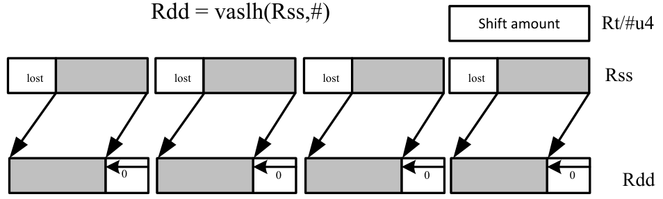

```text
Rdd = vaslh(Rss,#)
Shift amount Rt/#u4
lostlostlostlost Rss
0 0 0 0
Rdd
```

| Syntax | Behavior |
|---|---|
| `Rdd=vaslh(Rss,#u4)` | `for (i=0;i<4;i++) {`<br>`Rdd.h[i]=(Rss.h[i]<<#u);`<br>`}` |
| `Rdd=vasrh(Rss,#u4)` | `for (i=0;i<4;i++) {`<br>`Rdd.h[i]=(Rss.h[i]>>#u);`<br>`}` |
| `Rdd=vlsrh(Rss,#u4)` | `for (i=0;i<4;i++) {`<br>`Rdd.h[i]=(Rss.uh[i]>>#u);`<br>`}` |

##### Class: XTYPE (slots 2,3)

##### Intrinsics

|  |  |
|---|---|
| `Rdd=vaslh(Rss,#u4)` | `Word64 Q6_P_vaslh_PI(Word64 Rss, Word32 Iu4)` |
| `Rdd=vasrh(Rss,#u4)` | `Word64 Q6_P_vasrh_PI(Word64 Rss, Word32 Iu4)` |
| `Rdd=vlsrh(Rss,#u4)` | `Word64 Q6_P_vlsrh_PI(Word64 Rss, Word32 Iu4)` |

##### Encoding

| 31 | 30 | 29 | 28 | 27 | 26 | 25 | 24 | 23 | 22 | 21 | 20 | 19 | 18 | 17 | 16 | 15 | 14 | 13 | 12 | 11 | 10 | 9 | 8 | 7 | 6 | 5 | 4 | 3 | 2 | 1 | 0 |  |
|---|---|---|---|---|---|---|---|---|---|---|---|---|---|---|---|---|---|---|---|---|---|---|---|---|---|---|---|---|---|---|---|---|
| ICLASS | ICLASS | ICLASS | ICLASS | RegType | RegType | RegType | RegType | MajOp | MajOp |  | s5 | s5 | s5 | s5 | s5 | Parse | Parse |  |  |  |  |  |  | MinOp | MinOp | MinOp | d5 | d5 | d5 | d5 | d5 |  |
| 1 | 0 | 0 | 0 | 0 | 0 | 0 | 0 | 1 | 0 | 0 | s | s | s | s | s | P | P | 0 | 0 | i | i | i | i | 0 | 0 | 0 | d | d | d | d | d | Rdd=vasrh(Rss,#u4) |
| 1 | 0 | 0 | 0 | 0 | 0 | 0 | 0 | 1 | 0 | 0 | s | s | s | s | s | P | P | 0 | 0 | i | i | i | i | 0 | 0 | 1 | d | d | d | d | d | Rdd=vlsrh(Rss,#u4) |
| 1 | 0 | 0 | 0 | 0 | 0 | 0 | 0 | 1 | 0 | 0 | s | s | s | s | s | P | P | 0 | 0 | i | i | i | i | 0 | 1 | 0 | d | d | d | d | d | Rdd=vaslh(Rss,#u4) |

| Field name | Description |
|---|---|
| `ICLASS` | Instruction class |
| `Parse` | Packet/loop parse bits |
| `d5` | Field to encode register d |
| `s5` | Field to encode register s |
| `MajOp` | Major opcode |
| `MinOp` | Minor opcode |
| `RegType` | Register type |

#### Vector arithmetic shift halfwords with round

For each halfword in the vector, round then arithmetic shift right by an immediate amount. The results are stored in the destination register.

Rdd = vasrh(Rss,#u):rnd

|  |  |  |  |
|---|---|---|---|
|  |  |  |  |

```
1<<(#u-1)1<<(#u-1)1<<(#u-1)1<<(#u-1)
```

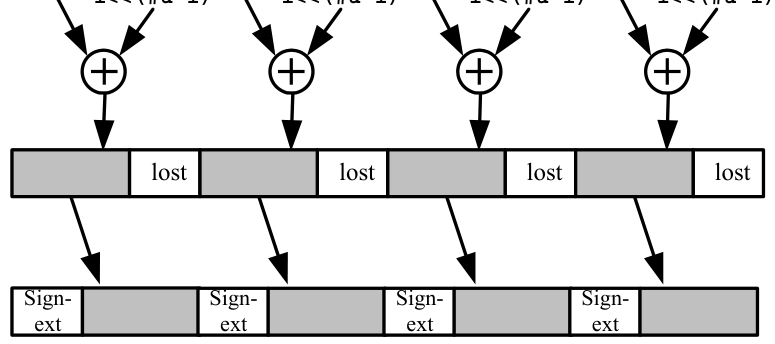

```text
+ + + +
lost lost lost lost
Sign- Sign- Sign- Sign-
ext ext ext ext
```

| Syntax | Behavior |
|---|---|
| `Rdd=vasrh(Rss,#u4):raw`<br>`}` | `for (i=0;i<4;i++) {`<br>`Rdd.h[i]=( ((Rss.h[i] >> #u)+1)>>1 );`<br>`}` |
| `Rdd=vasrh(Rss,#u4):rnd`<br>`}` | `if ("#u4==0") {`<br>`Assembler mapped to: "Rdd=Rss";`<br>`} else {`<br>`Assembler mapped to: "Rdd=vasrh(Rss,#u4-1):raw";`<br>`}` |

##### Class: XTYPE (slots 2,3)

##### Intrinsics

```
Rdd=vasrh(Rss,#u4):rndWord64 Q6_P_vasrh_PI_rnd(Word64 Rss, Word32 Iu4)
```

##### Encoding

| 31 | 30 | 29 | 28 | 27 | 26 | 25 | 24 | 23 | 22 | 21 | 20 | 19 | 18 17 | 16 | 15 | 14 | 13 | 12 | 11 | 10 | 9 | 8 | 7 | 6 | 5 | 4 | 3 | 2 | 1 | 0 |  |
|---|---|---|---|---|---|---|---|---|---|---|---|---|---|---|---|---|---|---|---|---|---|---|---|---|---|---|---|---|---|---|---|
| ICLASS | ICLASS | ICLASS | ICLASS | RegType | RegType | RegType | RegType | MajOp | MajOp |  | s5 | s5 | s5 | s5 | Parse | Parse |  |  |  |  |  |  | MinOp | MinOp | MinOp | d5 | d5 | d5 | d5 | d5 |  |
| 1 | 0 | 0 | 0 | 0 | 0 | 0 | 0 | 0 | 0 | 1 | s | s | s s | s | P | P | 0 | 0 | i | i | i | i | 0 | 0 | 0 | d | d | d | d | d | Rdd=vasrh(Rss,#u4):raw |

| Field name | Description |
|---|---|
| `ICLASS` | Instruction class |
| `Parse` | Packet/loop parse bits |
| `d5` | Field to encode register d |
| `s5` | Field to encode register s |
| `MajOp` | Major opcode |
| `MinOp` | Minor opcode |
| `RegType` | Register type |

#### Vector arithmetic shift halfwords with saturate and pack

For each halfword in the vector, optionally round, then arithmetic shift right by an immediate amount. Saturate the results to unsigned [0-255] and then pack in the destination register.

Rd = vasrhub(Rss,#u):rnd:sat

|  |  |  |  |
|---|---|---|---|
|  |  |  |  |

```
1<<(#u-1)1<<(#u-1)1<<(#u-1)1<<(#u-1)
```

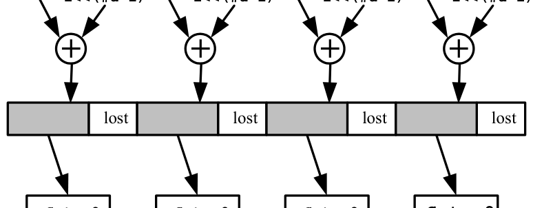

```text
+ + + +
lost lost lost lost
```

```
Sat_u8Sat_u8Sat_u8Sat_u8
```

|  |  |  |  |
|---|---|---|---|
|  |  |  |  |

| Syntax | Behavior |
|---|---|
| `Rd=vasrhub(Rss,#u4):raw` | `for (i=0;i<4;i++) {`<br>`Rd.b[i]=usat₈(((Rss.h[i] >> #u )+1)>>1);`<br>`}` |
| `Rd=vasrhub(Rss,#u4):rnd:sa`<br>`t` | `if ("#u4==0") {`<br>`Assembler mapped to: "Rd=vsathub(Rss)";`<br>`} else {`<br>`Assembler mapped to: "Rd=vasrhub(Rss,#u4-`<br>`1):raw";`<br>`}` |
| `Rd=vasrhub(Rss,#u4):sat` | `for (i=0;i<4;i++) {`<br>`Rd.b[i]=usat₈(Rss.h[i] >> #u);`<br>`}` |

##### Class: XTYPE (slots 2,3)

##### Notes

- If saturation occurs during execution of this instruction (a result is clamped to either maximum or minimum values), the OVF bit in the status register is set. OVF remains set until explicitly cleared by a transfer to the status register.

##### Intrinsics

|  |  |
|---|---|
| `Rd=vasrhub(Rss,#u4):rnd:sat` | `Word32 Q6_R_vasrhub_PI_rnd_sat(Word64 Rss, Word32 Iu4)` |
| `Rd=vasrhub(Rss,#u4):sat` | `Word32 Q6_R_vasrhub_PI_sat(Word64 Rss, Word32 Iu4)` |

##### Encoding

| 31 | 30 | 29 | 28 | 27 | 26 | 25 | 24 | 23 | 22 | 21 | 20 | 19 | 18 | 17 | 16 | 15 | 14 | 13 | 12 | 11 | 10 | 9 | 8 | 7 | 6 | 5 | 4 | 3 | 2 | 1 | 0 |  |
|---|---|---|---|---|---|---|---|---|---|---|---|---|---|---|---|---|---|---|---|---|---|---|---|---|---|---|---|---|---|---|---|---|
| ICLASS | ICLASS | ICLASS | ICLASS | RegType | RegType | RegType | RegType | MajOp | MajOp |  | s5 | s5 | s5 | s5 | s5 | Parse | Parse |  |  |  |  |  |  | MinOp | MinOp | MinOp | d5 | d5 | d5 | d5 | d5 |  |
| 1 | 0 | 0 | 0 | 1 | 0 | 0 | 0 | 0 | 1 | 1 | s | s | s | s | s | P | P | 0 | 0 | i | i | i | i | 1 | 0 | 0 | d | d | d | d | d | Rd=vasrhub(Rss,#u4):raw |
| 1 | 0 | 0 | 0 | 1 | 0 | 0 | 0 | 0 | 1 | 1 | s | s | s | s | s | P | P | 0 | 0 | i | i | i | i | 1 | 0 | 1 | d | d | d | d | d | Rd=vasrhub(Rss,#u4):sat |

| Field name | Description |
|---|---|
| `ICLASS` | Instruction class |
| `Parse` | Packet/loop parse bits |
| `d5` | Field to encode register d |
| `s5` | Field to encode register s |
| `MajOp` | Major opcode |
| `MinOp` | Minor opcode |
| `RegType` | Register type |

#### Vector shift halfwords by register

The shift amount is the least significant seven bits of Rt, treated as a two's complement value. If the shift amount is negative, reverse the direction of the shift. Shift the source values right or left based on the shift amount and the type of instruction. Arithmetic right shifts place the sign bit of the source value in the vacated positions. Logical right shifts place zeros in the vacated positions.

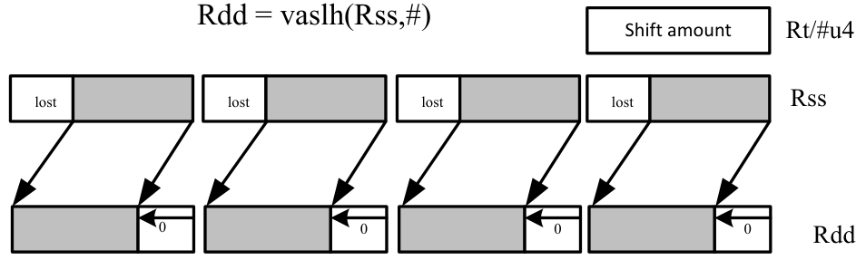

```text
Rdd = vaslh(Rss,#)
Shift amount Rt/#u4
lostlostlostlost Rss
0 0 0 0
Rdd
```

| Syntax | Behavior |
|---|---|
| `Rdd=vaslh(Rss,Rt`<br>`)` | `for (i=0;i<4;i++) {`<br>`Rdd.h[i]=(sxt<sub>7->32</sub>(Rt)>0)?(sxt<sub>16->64</sub>(Rss.h[i])<<sxt₇₋`<br>`<sub>>32</sub>(Rt)):(sxt<sub>16->64</sub>(Rss.h[i])>>sxt<sub>7->32</sub>(Rt));`<br>`}` |
| `Rdd=vasrh(Rss,Rt`<br>`)` | `for (i=0;i<4;i++) {`<br>`Rdd.h[i]=(sxt<sub>7->32</sub>(Rt)>0)?(sxt<sub>16->64</sub>(Rss.h[i])>>sxt₇₋`<br>`<sub>>32</sub>(Rt)):(sxt<sub>16->64</sub>(Rss.h[i])<<sxt<sub>7->32</sub>(Rt));`<br>`}` |
| `Rdd=vlslh(Rss,Rt`<br>`)` | `for (i=0;i<4;i++) {`<br>`Rdd.h[i]=(sxt<sub>7->32</sub>(Rt)>0)?(zxt<sub>16->64</sub>(Rss.uh[i])<<sxt₇₋`<br>`<sub>>32</sub>(Rt)):(zxt<sub>16->64</sub>(Rss.uh[i])>>>sxt<sub>7->32</sub>(Rt));`<br>`}` |
| `Rdd=vlsrh(Rss,Rt`<br>`)` | `for (i=0;i<4;i++) {`<br>`Rdd.h[i]=(sxt<sub>7->32</sub>(Rt)>0)?(zxt<sub>16->64</sub>(Rss.uh[i])>>>sxt₇₋`<br>`<sub>>32</sub>(Rt)):(zxt<sub>16->64</sub>(Rss.uh[i])<<sxt<sub>7->32</sub>(Rt));`<br>`}` |

##### Class: XTYPE (slots 2,3)

##### Notes

- If the number of bits to shift is greater than the width of the vector element, the result is either all sign-bits (for arithmetic right shifts) or all zeros for logical and left shifts.

##### Intrinsics

|  |  |
|---|---|
| `Rdd=vaslh(Rss,Rt)` | `Word64 Q6_P_vaslh_PR(Word64 Rss, Word32 Rt)` |
| `Rdd=vasrh(Rss,Rt)` | `Word64 Q6_P_vasrh_PR(Word64 Rss, Word32 Rt)` |
| `Rdd=vlslh(Rss,Rt)` | `Word64 Q6_P_vlslh_PR(Word64 Rss, Word32 Rt)` |
| `Rdd=vlsrh(Rss,Rt)` | `Word64 Q6_P_vlsrh_PR(Word64 Rss, Word32 Rt)` |

##### Encoding

| 31 | 30 | 29 | 28 | 27 | 26 | 25 | 24 | 23 | 22 | 21 | 20 | 19 | 18 | 17 | 16 | 15 | 14 | 13 | 12 | 11 | 10 | 9 | 8 | 7 | 6 | 5 | 4 | 3 | 2 | 1 | 0 |  |
|---|---|---|---|---|---|---|---|---|---|---|---|---|---|---|---|---|---|---|---|---|---|---|---|---|---|---|---|---|---|---|---|---|
| ICLASS | ICLASS | ICLASS | ICLASS | RegType | RegType | RegType | RegType | Maj | Maj |  | s5 | s5 | s5 | s5 | s5 | Parse | Parse |  | t5 | t5 | t5 | t5 | t5 | Min | Min |  | d5 | d5 | d5 | d5 | d5 |  |
| 1 | 1 | 0 | 0 | 0 | 0 | 1 | 1 | 0 | 1 | - | s | s | s | s | s | P | P | - | t | t | t | t | t | 0 | 0 | - | d | d | d | d | d | Rdd=vasrh(Rss,Rt) |
| 1 | 1 | 0 | 0 | 0 | 0 | 1 | 1 | 0 | 1 | - | s | s | s | s | s | P | P | - | t | t | t | t | t | 0 | 1 | - | d | d | d | d | d | Rdd=vlsrh(Rss,Rt) |
| 1 | 1 | 0 | 0 | 0 | 0 | 1 | 1 | 0 | 1 | - | s | s | s | s | s | P | P | - | t | t | t | t | t | 1 | 0 | - | d | d | d | d | d | Rdd=vaslh(Rss,Rt) |
| 1 | 1 | 0 | 0 | 0 | 0 | 1 | 1 | 0 | 1 | - | s | s | s | s | s | P | P | - | t | t | t | t | t | 1 | 1 | - | d | d | d | d | d | Rdd=vlslh(Rss,Rt) |

| Field name | Description |
|---|---|
| `ICLASS` | Instruction class |
| `Parse` | Packet/loop parse bits |
| `d5` | Field to encode register d |
| `s5` | Field to encode register s |
| `t5` | Field to encode register t |
| `Maj` | Major opcode |
| `Min` | Minor opcode |
| `RegType` | Register type |

#### Vector shift words by immediate

Shift individual words of the source vector. Arithmetic right shifts place the sign bit of the source values in the vacated positions. Logical right shifts place zeros in the vacated positions.

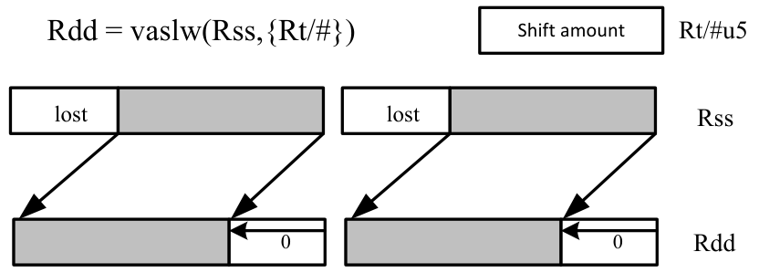

```text
Rdd = vaslw(Rss,{Rt/#})Shift amountRt/#u5
lost lost Rss
⁰⁰₀ Rdd
```

| Syntax | Behavior |
|---|---|
| `Rdd=vaslw(Rss,#u5)` | `for (i=0;i<2;i++) {`<br>`Rdd.w[i]=(Rss.w[i]<<#u);`<br>`}` |
| `Rdd=vasrw(Rss,#u5)` | `for (i=0;i<2;i++) {`<br>`Rdd.w[i]=(Rss.w[i]>>#u);`<br>`}` |
| `Rdd=vlsrw(Rss,#u5)` | `for (i=0;i<2;i++) {`<br>`Rdd.w[i]=(Rss.uw[i]>>#u);`<br>`}` |

##### Class: XTYPE (slots 2,3)

##### Intrinsics

|  |  |
|---|---|
| `Rdd=vaslw(Rss,#u5)` | `Word64 Q6_P_vaslw_PI(Word64 Rss, Word32 Iu5)` |
| `Rdd=vasrw(Rss,#u5)` | `Word64 Q6_P_vasrw_PI(Word64 Rss, Word32 Iu5)` |
| `Rdd=vlsrw(Rss,#u5)` | `Word64 Q6_P_vlsrw_PI(Word64 Rss, Word32 Iu5)` |

##### Encoding

| 31 | 30 | 29 | 28 | 27 | 26 | 25 | 24 | 23 | 22 | 21 | 20 | 19 | 18 | 17 | 16 | 15 | 14 | 13 | 12 | 11 | 10 | 9 | 8 | 7 | 6 | 5 | 4 | 3 | 2 | 1 | 0 |  |
|---|---|---|---|---|---|---|---|---|---|---|---|---|---|---|---|---|---|---|---|---|---|---|---|---|---|---|---|---|---|---|---|---|
| ICLASS | ICLASS | ICLASS | ICLASS | RegType | RegType | RegType | RegType | MajOp | MajOp |  | s5 | s5 | s5 | s5 | s5 | Parse | Parse |  |  |  |  |  |  | MinOp | MinOp | MinOp | d5 | d5 | d5 | d5 | d5 |  |
| 1 | 0 | 0 | 0 | 0 | 0 | 0 | 0 | 0 | 1 | 0 | s | s | s | s | s | P | P | 0 | i | i | i | i | i | 0 | 0 | 0 | d | d | d | d | d | Rdd=vasrw(Rss,#u5) |
| 1 | 0 | 0 | 0 | 0 | 0 | 0 | 0 | 0 | 1 | 0 | s | s | s | s | s | P | P | 0 | i | i | i | i | i | 0 | 0 | 1 | d | d | d | d | d | Rdd=vlsrw(Rss,#u5) |
| 1 | 0 | 0 | 0 | 0 | 0 | 0 | 0 | 0 | 1 | 0 | s | s | s | s | s | P | P | 0 | i | i | i | i | i | 0 | 1 | 0 | d | d | d | d | d | Rdd=vaslw(Rss,#u5) |

| Field name | Description |
|---|---|
| `ICLASS` | Instruction class |
| `Parse` | Packet/loop parse bits |
| `d5` | Field to encode register d |
| `s5` | Field to encode register s |
| `MajOp` | Major opcode |
| `MinOp` | Minor opcode |
| `RegType` | Register type |

#### Vector shift words by register

The shift amount is the least significant seven bits of Rt, treated as a two's complement value. If the shift amount is negative, reverse the direction of the shift. Shift the source values right or left based on the shift amount and the type of instruction. Arithmetic right shifts place the sign bit of the source value in the vacated positions. Logical right shifts place zeros in the vacated positions.

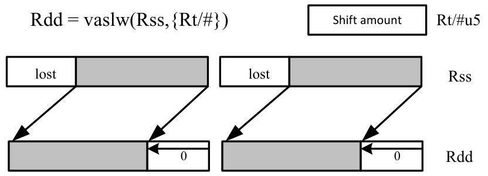

```text
Rdd = vaslw(Rss,{Rt/#})Shift amountRt/#u5
lost lost Rss
⁰⁰₀ Rdd
```

| Syntax | Behavior |
|---|---|
| `Rdd=vaslw(Rss,Rt)` | `for (i=0;i<2;i++) {`<br>`Rdd.w[i]=(sxt<sub>7->32</sub>(Rt)>0)?(sxt<sub>32->64</sub>(Rss.w[i])<<sxt₇₋`<br>`<sub>>32</sub>(Rt)):(sxt<sub>32->64</sub>(Rss.w[i])>>sxt<sub>7->32</sub>(Rt));`<br>`}` |
| `Rdd=vasrw(Rss,Rt)` | `for (i=0;i<2;i++) {`<br>`Rdd.w[i]=(sxt<sub>7->32</sub>(Rt)>0)?(sxt<sub>32->64</sub>(Rss.w[i])>>sxt₇₋`<br>`<sub>>32</sub>(Rt)):(sxt<sub>32->64</sub>(Rss.w[i])<<sxt<sub>7->32</sub>(Rt));`<br>`}` |
| `Rdd=vlslw(Rss,Rt)` | `for (i=0;i<2;i++) {`<br>`Rdd.w[i]=(sxt<sub>7->32</sub>(Rt)>0)?(zxt<sub>32->64</sub>(Rss.uw[i])<<sxt₇₋`<br>`<sub>>32</sub>(Rt)):(zxt<sub>32->64</sub>(Rss.uw[i])>>>sxt<sub>7->32</sub>(Rt));`<br>`}` |
| `Rdd=vlsrw(Rss,Rt)` | `for (i=0;i<2;i++) {`<br>`Rdd.w[i]=(sxt<sub>7->32</sub>(Rt)>0)?(zxt<sub>32->64</sub>(Rss.uw[i])>>>sxt₇₋`<br>`<sub>>32</sub>(Rt)):(zxt<sub>32->64</sub>(Rss.uw[i])<<sxt<sub>7->32</sub>(Rt));`<br>`}` |

##### Class: XTYPE (slots 2,3)

##### Notes

- If the number of bits to shift is greater than the width of the vector element, the result is either all sign-bits (for arithmetic right shifts) or all zeros for logical and left shifts.

##### Intrinsics

|  |  |
|---|---|
| `Rdd=vaslw(Rss,Rt)` | `Word64 Q6_P_vaslw_PR(Word64 Rss, Word32 Rt)` |
| `Rdd=vasrw(Rss,Rt)` | `Word64 Q6_P_vasrw_PR(Word64 Rss, Word32 Rt)` |
| `Rdd=vlslw(Rss,Rt)` | `Word64 Q6_P_vlslw_PR(Word64 Rss, Word32 Rt)` |
| `Rdd=vlsrw(Rss,Rt)` | `Word64 Q6_P_vlsrw_PR(Word64 Rss, Word32 Rt)` |

##### Encoding

| 31 | 30 | 29 | 28 | 27 | 26 | 25 | 24 | 23 | 22 | 21 | 20 | 19 | 18 | 17 | 16 | 15 | 14 | 13 | 12 | 11 | 10 | 9 | 8 | 7 | 6 | 5 | 4 | 3 | 2 | 1 | 0 |  |
|---|---|---|---|---|---|---|---|---|---|---|---|---|---|---|---|---|---|---|---|---|---|---|---|---|---|---|---|---|---|---|---|---|
| ICLASS | ICLASS | ICLASS | ICLASS | RegType | RegType | RegType | RegType | Maj | Maj |  | s5 | s5 | s5 | s5 | s5 | Parse | Parse |  | t5 | t5 | t5 | t5 | t5 | Min | Min |  | d5 | d5 | d5 | d5 | d5 |  |
| 1 | 1 | 0 | 0 | 0 | 0 | 1 | 1 | 0 | 0 | - | s | s | s | s | s | P | P | - | t | t | t | t | t | 0 | 0 | - | d | d | d | d | d | Rdd=vasrw(Rss,Rt) |
| 1 | 1 | 0 | 0 | 0 | 0 | 1 | 1 | 0 | 0 | - | s | s | s | s | s | P | P | - | t | t | t | t | t | 0 | 1 | - | d | d | d | d | d | Rdd=vlsrw(Rss,Rt) |
| 1 | 1 | 0 | 0 | 0 | 0 | 1 | 1 | 0 | 0 | - | s | s | s | s | s | P | P | - | t | t | t | t | t | 1 | 0 | - | d | d | d | d | d | Rdd=vaslw(Rss,Rt) |
| 1 | 1 | 0 | 0 | 0 | 0 | 1 | 1 | 0 | 0 | - | s | s | s | s | s | P | P | - | t | t | t | t | t | 1 | 1 | - | d | d | d | d | d | Rdd=vlslw(Rss,Rt) |

| Field name | Description |
|---|---|
| `ICLASS` | Instruction class |
| `Parse` | Packet/loop parse bits |
| `d5` | Field to encode register d |
| `s5` | Field to encode register s |
| `t5` | Field to encode register t |
| `Maj` | Major opcode |
| `Min` | Minor opcode |
| `RegType` | Register type |

#### Vector shift words with truncate and pack

Shift individual words of the source vector Rss right by a register or immediate amount. The low 16-bits of each word are packed into destination register Rd.

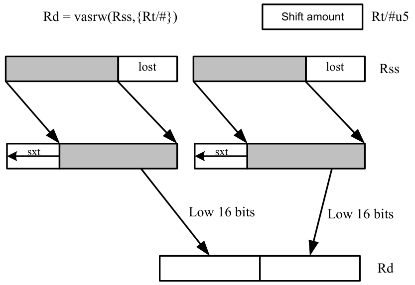

```text
Rd = vasrw(Rss,{Rt/#})Shift amount Rt/#u5
lost lost Rss
sxt sxt
Low 16 bits Low 16 bits
Rd
```

| Syntax | Behavior |
|---|---|
| `Rd=vasrw(Rss,#u5`<br>`)` | `for (i=0;i<2;i++) {`<br>`Rd.h[i]=(Rss.w[i]>>#u).h[0];`<br>`}` |
| `Rd=vasrw(Rss,Rt)` | `for (i=0;i<2;i++) {`<br>`Rd.h[i]=(sxt<sub>7->32</sub>(Rt)>0)?(sxt<sub>32->64</sub>(Rss.w[i])>>sxt₇₋`<br>`<sub>>32</sub>(Rt)):(sxt<sub>32->64</sub>(Rss.w[i])<<sxt<sub>7->32</sub>(Rt)).h[0];`<br>`}` |

##### Class: XTYPE (slots 2,3)

##### Intrinsics

|  |  |
|---|---|
| `Rd=vasrw(Rss,#u5)` | `Word32 Q6_R_vasrw_PI(Word64 Rss, Word32 Iu5)` |
| `Rd=vasrw(Rss,Rt)` | `Word32 Q6_R_vasrw_PR(Word64 Rss, Word32 Rt)` |

##### Encoding

| 31 | 30 | 29 | 28 | 27 | 26 | 25 | 24 | 23 | 22 | 21 | 20 | 19 | 18 | 17 | 16 | 15 | 14 | 13 | 12 | 11 | 10 | 9 | 8 | 7 | 6 | 5 | 4 | 3 | 2 | 1 | 0 |  |
|---|---|---|---|---|---|---|---|---|---|---|---|---|---|---|---|---|---|---|---|---|---|---|---|---|---|---|---|---|---|---|---|---|
| ICLASS | ICLASS | ICLASS | ICLASS | RegType | RegType | RegType | RegType | MajOp | MajOp |  | s5 | s5 | s5 | s5 | s5 | Parse | Parse |  |  |  |  |  |  | MinOp | MinOp | MinOp | d5 | d5 | d5 | d5 | d5 |  |
| 1 | 0 | 0 | 0 | 1 | 0 | 0 | 0 | 1 | 1 | 0 | s | s | s | s | s | P | P | 0 | i | i | i | i | i | 0 | 1 | 0 | d | d | d | d | d | Rd=vasrw(Rss,#u5) |
| ICLASS | ICLASS | ICLASS | ICLASS | RegType | RegType | RegType | RegType |  |  |  | s5 | s5 | s5 | s5 | s5 | Parse | Parse |  | t5 | t5 | t5 | t5 | t5 | Min | Min |  | d5 | d5 | d5 | d5 | d5 |  |
| 1 | 1 | 0 | 0 | 0 | 1 | 0 | 1 | - | - | - | s | s | s | s | s | P | P | - | t | t | t | t | t | 0 | 1 | 0 | d | d | d | d | d | Rd=vasrw(Rss,Rt) |

| Field name | Description |
|---|---|
| `ICLASS` | Instruction class |
| `Parse` | Packet/loop parse bits |
| `d5` | Field to encode register d |
| `s5` | Field to encode register s |
| `t5` | Field to encode register t |
| `MajOp` | Major opcode |
| `MinOp` | Minor opcode |
| `Min` | Minor opcode |
| `RegType` | Register type |
